# 2. التحقق من قالب

!!! tip "بنهاية هذه الوحدة ستكون قادرًا على"

    - [ ] تحليل بنية حل الذكاء الاصطناعي
    - [ ] فهم سير عمل نشر AZD
    - [ ] استخدام GitHub Copilot للحصول على مساعدة في استخدام AZD
    - [ ] **Lab 2:** نشر والتحقق من قالب وكلاء الذكاء الاصطناعي

---


## 1. المقدمة

The [Azure Developer CLI](https://learn.microsoft.com/en-us/azure/developer/azure-developer-cli/) أو `azd` هي أداة سطر أوامر مفتوحة المصدر تُبسط سير عمل المطور عند بناء ونشر التطبيقات على Azure. 

[AZD Templates](https://learn.microsoft.com/azure/developer/azure-developer-cli/azd-templates) هي مستودعات معيارية تتضمن كود تطبيق نموذجي، وأصول _البنية التحتية ككود_، وملفات تهيئة `azd` لهندسة حل متكاملة. يصبح توفير البنية التحتية بسيطًا مثل أمر `azd provision` - بينما يتيح لك استخدام `azd up` توفير البنية التحتية **و** نشر تطبيقك في خطوة واحدة!

نتيجة لذلك، يمكن أن يكون بدء عملية تطوير تطبيقك بسيطًا مثل العثور على _قالب بدء AZD_ المناسب الذي يقترب أكثر من احتياجات التطبيق والبنية التحتية لديك - ثم تخصيص المستودع ليناسب متطلبات السيناريو الخاص بك.

قبل أن نبدأ، دعونا نتأكد من أن لديك Azure Developer CLI مثبتًا.

1. افتح طرفية VS Code واكتب هذا الأمر:

      ```bash title="" linenums="0"
      azd version
      ```

1. يجب أن ترى شيئًا مثل هذا!

      ```bash title="" linenums="0"
      azd version 1.19.0 (commit b3d68cea969b2bfbaa7b7fa289424428edb93e97)
      ```

**أنت الآن جاهز لاختيار ونشر قالب باستخدام azd**

---

## 2. اختيار القالب

تأتي منصة Microsoft Foundry مع [مجموعة من قوالب AZD الموصى بها](https://learn.microsoft.com/en-us/azure/ai-foundry/how-to/develop/ai-template-get-started) التي تغطي سيناريوهات حلول شائعة مثل _أتمتة سير عمل الوكلاء المتعددين_ و _معالجة المحتوى متعددة الوسائط_. يمكنك أيضًا اكتشاف هذه القوالب بزيارة بوابة Microsoft Foundry.

1. قم بزيارة [https://ai.azure.com/templates](https://ai.azure.com/templates)
1. سجّل الدخول إلى بوابة Microsoft Foundry عندما يُطلب منك ذلك - ستشاهد شيئًا مثل هذا.

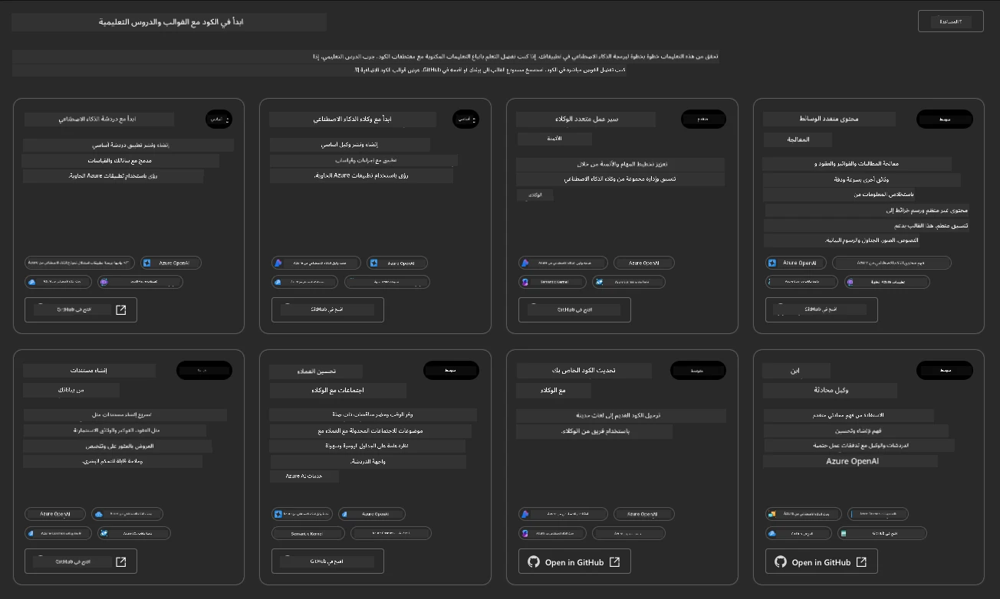


خيارات **Basic** هي قوالب البداية لديك:

1. [ ] [Get Started with AI Chat](https://github.com/Azure-Samples/get-started-with-ai-chat) الذي ينشر تطبيق دردشة أساسي _مع بياناتك_ إلى Azure Container Apps. استخدم هذا لاستكشاف سيناريو شات ذكاء اصطناعي أساسي.
1. [X] [Get Started with AI Agents](https://github.com/Azure-Samples/get-started-with-ai-agents) الذي ينشر أيضًا وكيل ذكاء اصطناعي قياسي (مع Foundry Agents). استخدم هذا للتعرف على حلول الذكاء الاصطناعي الوكيلية التي تتضمن أدوات ونماذج.

زر الرابط الثاني في علامة تبويب متصفح جديدة (أو انقر على `Open in GitHub` لبطاقة ذات صلة). يجب أن ترى المستودع لهذا قالب AZD. خذ دقيقة لاستكشاف ملف README. تبدو هندسة التطبيق هكذا:

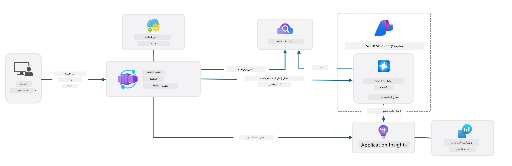

---

## 3. تفعيل القالب

دعنا نحاول نشر هذا القالب ونتأكد من أنه صالح. سنتبع الإرشادات في قسم [Getting Started](https://github.com/Azure-Samples/get-started-with-ai-agents?tab=readme-ov-file#getting-started).

1. انقر على [this link](https://github.com/codespaces/new/Azure-Samples/get-started-with-ai-agents) - أكد الإجراء الافتراضي لـ `Create codespace`
1. سيفتح هذا علامة تبويب متصفح جديدة - انتظر حتى يكتمل تحميل جلسة GitHub Codespaces
1. افتح طرفية VS Code في Codespaces - اكتب الأمر التالي:

   ```bash title="" linenums="0"
   azd up
   ```

أكمل خطوات سير العمل التي سيؤدي إليها هذا:

1. سيُطلب منك تسجيل الدخول إلى Azure - اتبع التعليمات للمصادقة
1. أدخل اسم بيئة فريد لك - على سبيل المثال، استخدمت `nitya-mshack-azd`
1. سيؤدي هذا إلى إنشاء مجلد `.azure/` - سترى مجلدًا فرعيًا باسم البيئة
1. سيُطلب منك اختيار اسم اشتراك - اختر الافتراضي
1. سيُطلب منك تحديد موقع - استخدم `East US 2`

الآن، انتظر حتى يكتمل التزويد. **تستغرق هذه العملية 10-15 دقيقة**

1. عند الانتهاء، ستُظهر وحدة التحكم رسالة SUCCESS مثل هذه:
      ```bash title="" linenums="0"
      SUCCESS: Your up workflow to provision and deploy to Azure completed in 10 minutes 17 seconds.
      ```
1. ستحتوي بوابة Azure الخاصة بك الآن على مجموعة موارد مزودة باسم تلك البيئة:

      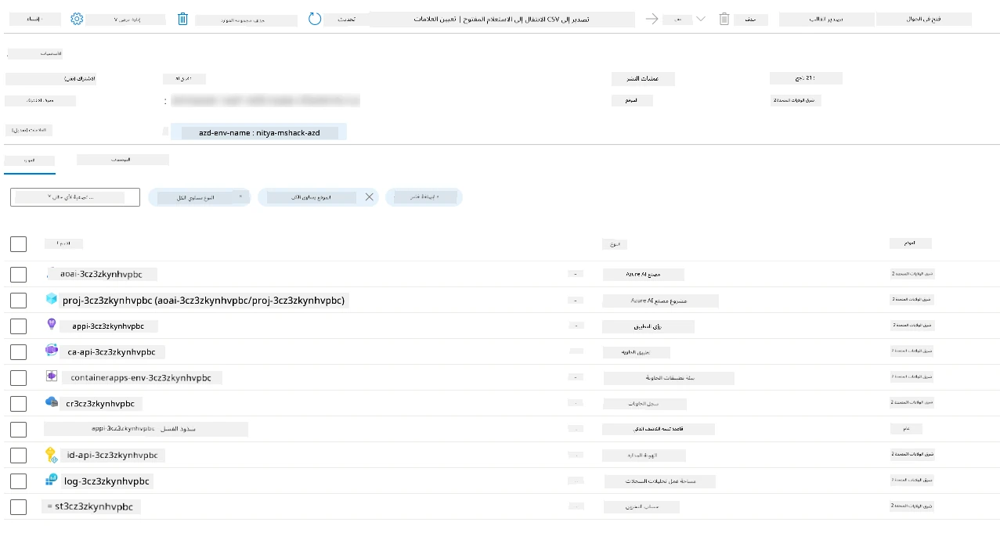

1. **أنت الآن جاهز للتحقق من البنية التحتية والتطبيق المنشور**.

---

## 4. التحقق من القالب

1. قم بزيارة صفحة مجموعات الموارد في بوابة Azure [Resource Groups](https://portal.azure.com/#browse/resourcegroups) - سجّل الدخول عندما يُطلب منك ذلك
1. انقر على RG لاسم بيئتك - سترى الصفحة أعلاه

      - انقر على مورد Azure Container Apps
      - انقر على Application Url في قسم _الأساسيات_ (أعلى اليمين)

1. يجب أن ترى واجهة أمامية للتطبيق المستضاف تبدو هكذا:

   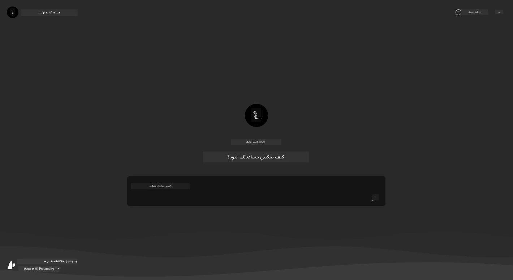

1. جرّب طرح بعض [أسئلة نموذجية](https://github.com/Azure-Samples/get-started-with-ai-agents/blob/main/docs/sample_questions.md)

      1. اسأل: ```What is the capital of France?``` 
      1. اسأل: ```What's the best tent under $200 for two people, and what features does it include?```

1. يجب أن تحصل على إجابات مشابهة لما هو موضح أدناه. _لكن كيف يعمل هذا؟_ 

      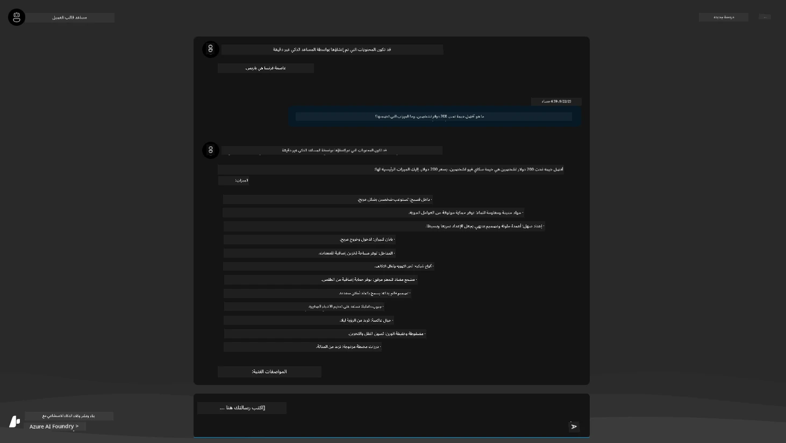

---

## 5. التحقق من الوكيل

يقوم Azure Container App بنشر نقطة نهاية تتصل بالوكيل الذكي المزوّد في مشروع Microsoft Foundry لهذا القالب. دعنا نلقي نظرة على ما يعنيه ذلك.

1. ارجع إلى صفحة _Overview_ لمجموعة الموارد في بوابة Azure

1. انقر على مورد `Microsoft Foundry` في تلك القائمة

1. يجب أن ترى هذا. انقر على زر `Go to Microsoft Foundry Portal`. 
   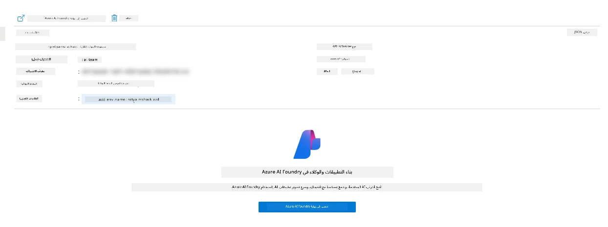

1. يجب أن ترى صفحة مشروع Foundry لتطبيق الذكاء الاصطناعي الخاص بك
   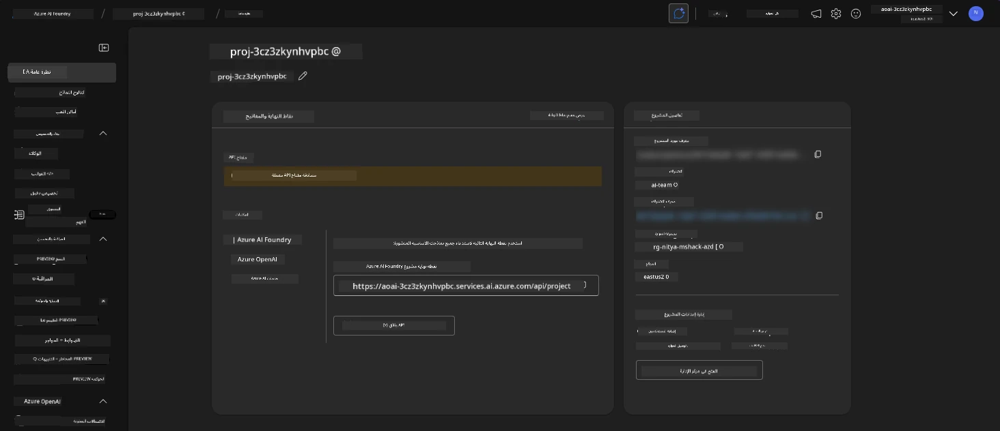

1. انقر على `Agents` - سترى الوكيل الافتراضي المزود في مشروعك
   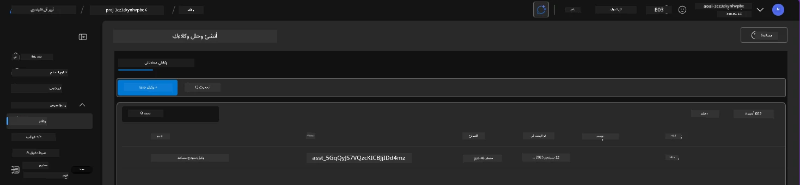

1. حدده - وسترى تفاصيل الوكيل. لاحظ ما يلي:

      - يستخدم الوكيل File Search بشكل افتراضي (دائمًا)
      - يشير `Knowledge` الخاص بالوكيل إلى أنه تم تحميل 32 ملفًا (لبحث الملف)
      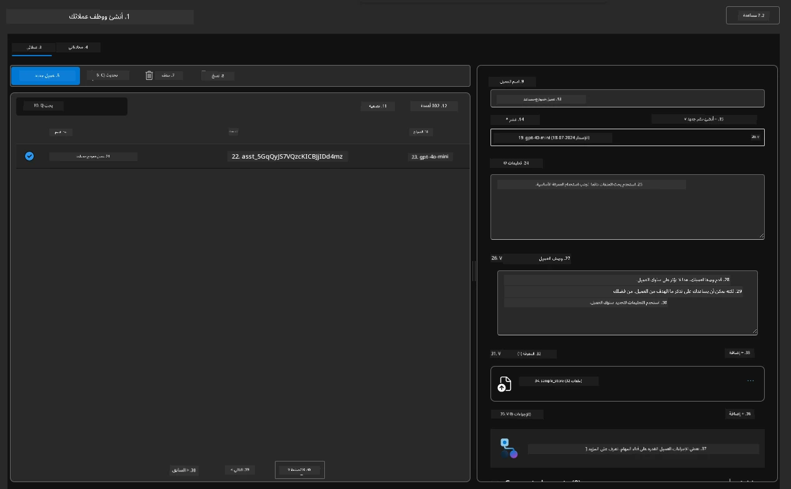

1. ابحث عن خيار `Data+indexes` في القائمة اليمنى وانقر للاطلاع على التفاصيل. 

      - يجب أن ترى 32 ملف بيانات تم رفعها للمعرفة.
      - ستطابق هذه الملفات 12 ملف عملاء و20 ملف منتجات تحت `src/files` 
      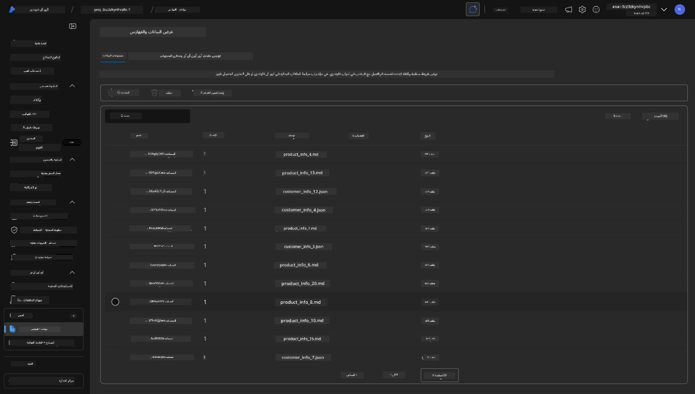

**لقد حققت من عمل الوكيل!** 

1. تستند استجابات الوكيل إلى المعرفة الموجودة في تلك الملفات. 
1. يمكنك الآن طرح أسئلة تتعلق بتلك البيانات، والحصول على استجابات مؤسَّسة.
1. مثال: يصف `customer_info_10.json` عمليات الشراء الثلاثة التي قامت بها "Amanda Perez"

ارجع إلى علامة تبويب المتصفح التي تحتوي على نقطة نهاية Container App واسأل: `What products does Amanda Perez own?`. يجب أن ترى شيئًا مثل هذا:

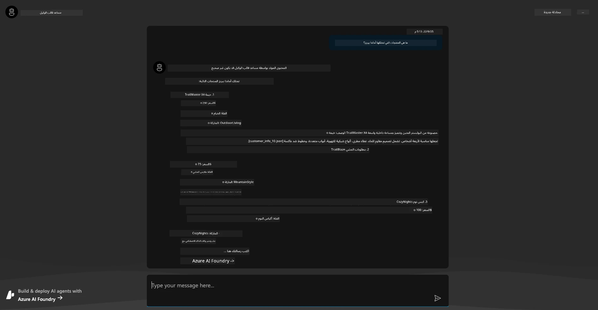

---

## 6. ملعب الوكيل

دعنا نبني المزيد من الفهم لقدرات Microsoft Foundry، عن طريق تجربة الوكيل في ملعب الوكلاء.

1. ارجع إلى صفحة `Agents` في Microsoft Foundry - اختر الوكيل الافتراضي
1. انقر على خيار `Try in Playground` - ستحصل على واجهة ملعب مثل هذه
1. اسأل نفس السؤال: `What products does Amanda Perez own?`

    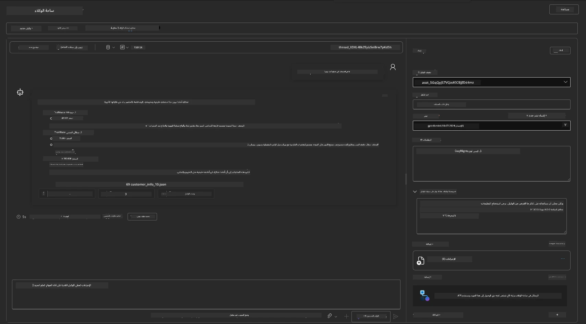

ستحصل على نفس الاستجابة (أو استجابة مشابهة) - لكنك ستحصل أيضًا على معلومات إضافية يمكنك استخدامها لفهم جودة وتكلفة وأداء تطبيق الوكيل الخاص بك. على سبيل المثال:

1. لاحظ أن الاستجابة تشير إلى ملفات البيانات المستخدمة لـ "تأصيل" الاستجابة
1. مرر الماوس فوق أي من تسميات الملفات هذه - هل تتطابق البيانات مع استفسارك والاستجابة المعروضة؟

سترى أيضًا صفًا للإحصاءات أسفل الاستجابة. 

1. مرر الماوس فوق أي مقياس - على سبيل المثال، Safety. سترى شيئًا مثل هذا
1. هل يتطابق التقييم المقيّم مع حدسك لمستوى أمان الاستجابة؟

      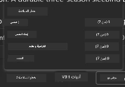

---

## 7. المراقبة المدمجة

المراقبة تدور حول تجهيز تطبيقك لتوليد بيانات يمكن استخدامها لفهمه وتصحيحه وتحسين عملياته. للحصول على فكرة عن هذا:

1. انقر على زر `View Run Info` - يجب أن ترى هذا العرض. هذا مثال على [تتبع الوكيل](https://learn.microsoft.com/en-us/azure/ai-foundry/how-to/develop/trace-agents-sdk#view-trace-results-in-the-azure-ai-foundry-agents-playground) قيد التنفيذ. _يمكنك أيضًا الحصول على هذا العرض بالنقر على Thread Logs في القائمة العلوية_.

   - تعرّف على خطوات التشغيل والأدوات التي استخدمها الوكيل
   - افهم إجمالي عدد التوكنات (مقابل استخدام توكنات الإخراج) للاستجابة
   - افهم الكمون وأين يُقضى الوقت أثناء التنفيذ

      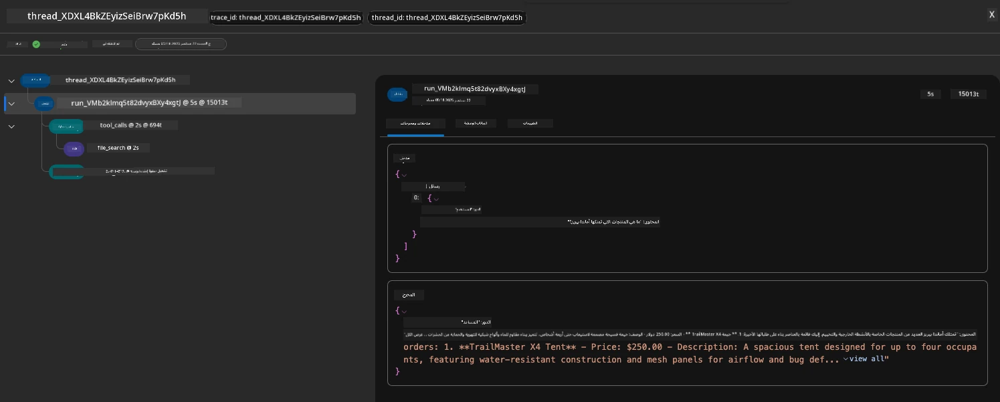

1. انقر على تبويب `Metadata` لعرض سمات إضافية للتشغيل، والتي قد توفر سياقًا مفيدًا لتصحيح المشكلات لاحقًا.   

      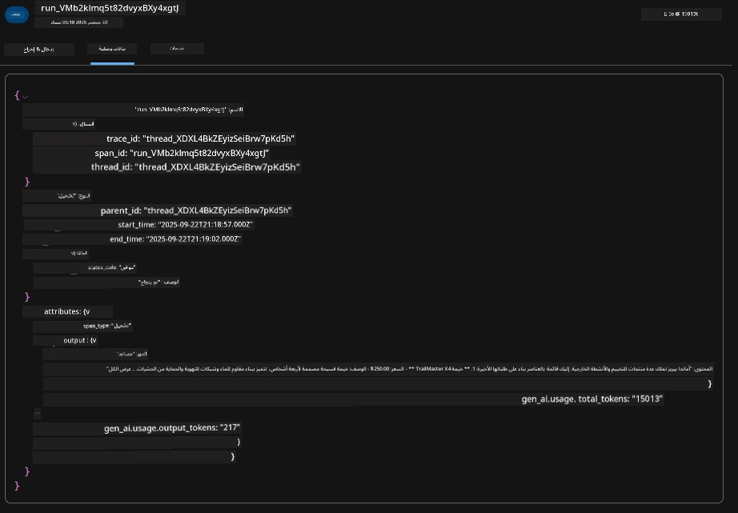


1. انقر على تبويب `Evaluations` لرؤية التقييمات التلقائية التي تم إجراؤها على استجابة الوكيل. تشمل هذه تقييمات الأمان (مثل، Self-harm) وتقييمات محددة بالوكيل (مثل، حل النية، الالتزام بالمهمة).

      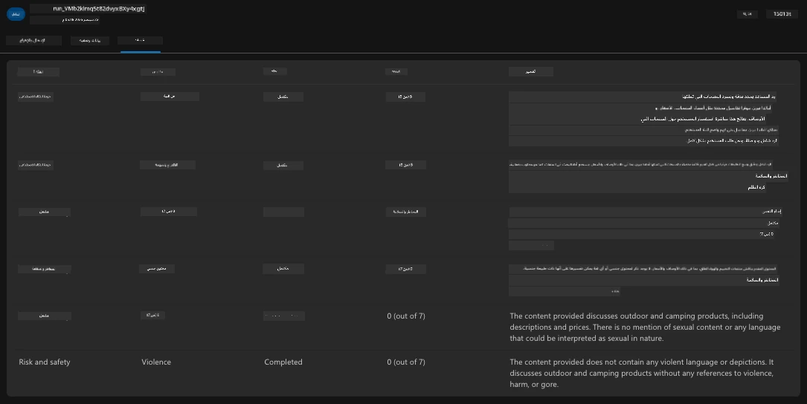

1. أخيرًا وليس آخرًا، انقر على تبويب `Monitoring` في قائمة الشريط الجانبي.

      - اختر تبويب `Resource usage` في الصفحة المعروضة - واطلع على المقاييس.
      - تتبع استخدام التطبيق من حيث التكاليف (توكينات) والتحميل (الطلبات).
      - تتبع زمن استجابة التطبيق للبايت الأول (معالجة الإدخال) والبايت الأخير (الإخراج).

      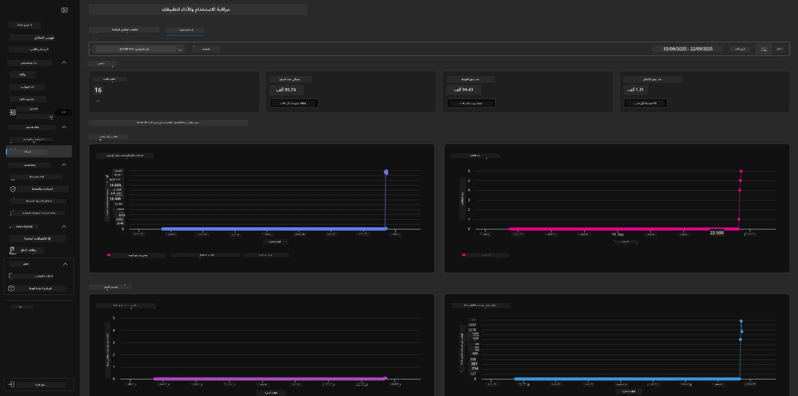

---

## 8. متغيرات البيئة

حتى الآن، مررنا بعملية النشر في المتصفح - وتحققنا من أن بنيتنا التحتية قد تم تزويدها وأن التطبيق يعمل. ولكن للعمل مع التطبيق _من حيث الكود_، نحتاج إلى تكوين بيئة التطوير المحلية لدينا بالمتغيرات ذات الصلة المطلوبة للعمل مع هذه الموارد. يجعل `azd` هذا الأمر سهلاً.

1. يستخدم Azure Developer CLI [متغيرات البيئة](https://learn.microsoft.com/en-us/azure/developer/azure-developer-cli/manage-environment-variables?tabs=bash) لتخزين وإدارة إعدادات التهيئة لنشر التطبيقات.

1. تُخزن متغيرات البيئة في `.azure/<env-name>/.env` - هذا يقصرها على بيئة `env-name` المستخدمة أثناء النشر ويساعدك على عزل البيئات بين أهداف نشر مختلفة في نفس المستودع.

1. تُحمّل متغيرات البيئة تلقائيًا بواسطة أمر `azd` كلما نفذ أمرًا محددًا (مثل، `azd up`). لاحظ أن `azd` لا يقرأ تلقائيًا متغيرات بيئة من مستوى نظام التشغيل (مثل، المعينة في الشل) - بدلاً من ذلك استخدم `azd set env` و `azd get env` لنقل المعلومات داخل السكربتات.


دعنا نجرب بعض الأوامر:

1. احصل على كل متغيرات البيئة المعينة لـ `azd` في هذه البيئة:

      ```bash title="" linenums="0"
      azd env get-values
      ```
      
      سترى شيئًا مثل:

      ```bash title="" linenums="0"
      AZURE_AI_AGENT_DEPLOYMENT_NAME="gpt-4o-mini"
      AZURE_AI_AGENT_NAME="agent-template-assistant"
      AZURE_AI_EMBED_DEPLOYMENT_NAME="text-embedding-3-small"
      AZURE_AI_EMBED_DIMENSIONS=100
      ...
      ```

1. احصل على قيمة محددة - على سبيل المثال، أريد أن أعرف ما إذا حددنا قيمة `AZURE_AI_AGENT_MODEL_NAME`

      ```bash title="" linenums="0"
      azd env get-value AZURE_AI_AGENT_MODEL_NAME 
      ```
      
      سترى شيئًا مثل هذا - لم يتم تعيينها بشكل افتراضي!

      ```bash title="" linenums="0"
      ERROR: key 'AZURE_AI_AGENT_MODEL_NAME' not found in the environment values
      ```

1. قم بتعيين متغير بيئة جديد لـ `azd`. هنا، نقوم بتحديث اسم نموذج الوكيل. _ملاحظة: أي تغييرات تُجرى ستنعكس فورًا في ملف `.azure/<env-name>/.env`._

      ```bash title="" linenums="0"
      azd env set AZURE_AI_AGENT_MODEL_NAME gpt-4.1
      azd env set AZURE_AI_AGENT_MODEL_VERSION 2025-04-14
      azd env set AZURE_AI_AGENT_DEPLOYMENT_CAPACITY 150
      ```

      الآن، يجب أن نجد أن القيمة قد تم تعيينها:

      ```bash title="" linenums="0"
      azd env get-value AZURE_AI_AGENT_MODEL_NAME 
      ```

1. لاحظ أن بعض الموارد دائمة (مثل، نشرات النماذج) وستتطلب أكثر من مجرد `azd up` لإجبار إعادة النشر. دعنا نجرب تفكيك النشر الأصلي وإعادة النشر مع متغيرات بيئة مغيّرة.

1. **تحديث** إذا كنت قد نشرت بنية تحتية سابقًا باستخدام قالب azd - يمكنك _تحديث_ حالة متغيرات بيئتك المحلية استنادًا إلى الحالة الحالية لنشر Azure الخاص بك باستخدام هذا الأمر:

      ```bash title="" linenums="0"
      azd env refresh
      ```

      هذه طريقة قوية لـ _مزامنة_ متغيرات البيئة عبر بيئتين أو أكثر من بيئات التطوير المحلية (على سبيل المثال، فريق يضم عدة مطورين) - مما يسمح للبنية التحتية المنشورة بأن تكون المصدر الأساسي لحالة متغيرات البيئة. ببساطة يقوم أعضاء الفريق بـ _تحديث_ المتغيرات للعودة إلى التزامن.

---

## 9. تهانينا 🏆

لقد أكملت للتو سير عمل شامل حيث you:

- [X] اخترت AZD Template الذي تريد استخدامه
- [X] أطلقت القالب باستخدام GitHub Codespaces 
- [X] نشرت القالب وتأكدت من أنه يعمل

---

<!-- CO-OP TRANSLATOR DISCLAIMER START -->
إخلاء المسؤولية:
تمت ترجمة هذا المستند باستخدام خدمة الترجمة الآلية [Co-op Translator](https://github.com/Azure/co-op-translator). بينما نسعى للدقة، يرجى العلم أن الترجمات الآلية قد تحتوي على أخطاء أو معلومات غير دقيقة. يجب اعتبار الوثيقة الأصلية بلغتها الأصلية المصدر المعتمد. للمعلومات الحساسة أو الحرجة، يوصى بالاستعانة بترجمة بشرية محترفة. نحن غير مسؤولين عن أي سوء فهم أو تفسير ناتج عن استخدام هذه الترجمة.
<!-- CO-OP TRANSLATOR DISCLAIMER END -->