# 2. التحقق من قالب

!!! tip "بنهاية هذه الوحدة ستكون قادراً على"

    - [ ] تحليل بنية حل الذكاء الاصطناعي
    - [ ] فهم سير عمل نشر AZD
    - [ ] استخدام GitHub Copilot للحصول على مساعدة في استخدام AZD
    - [ ] **المختبر 2:** نشر والتحقق من قالب وكلاء الذكاء الاصطناعي

---


## 1. مقدمة

The [Azure Developer CLI](https://learn.microsoft.com/en-us/azure/developer/azure-developer-cli/) or `azd` هو أداة سطر أوامر مفتوحة المصدر تُبسط سير عمل المطور عند بناء ونشر التطبيقات إلى Azure. 

[AZD Templates](https://learn.microsoft.com/azure/developer/azure-developer-cli/azd-templates) هي مستودعات معيارية تتضمن كود تطبيق نموذجي، ومكونات _البنية التحتية كرمز_، وملفات تكوين `azd` لهندسة حل متكاملة. يصبح توفير البنية التحتية بسيطًا مثل أمر `azd provision` - بينما يتيح لك `azd up` توفير البنية التحتية **و** نشر تطبيقك في خطوة واحدة!

نتيجة لذلك، يمكن أن تكون عملية بدء تطوير تطبيقك بسيطة مثل العثور على _قالب بدء AZD_ المناسب الذي يقترب أكثر من احتياجات تطبيقك والبنية التحتية - ثم تخصيص المستودع ليتناسب مع متطلبات السيناريو الخاص بك.

قبل أن نبدأ، دعونا نتأكد من أن لديك Azure Developer CLI مثبتًا.

1. افتح طرفية VS Code واكتب هذا الأمر:

      ```bash title="" linenums="0"
      azd version
      ```

1. سترى شيئًا مثل هذا!

      ```bash title="" linenums="0"
      azd version 1.19.0 (commit b3d68cea969b2bfbaa7b7fa289424428edb93e97)
      ```

**أنت الآن جاهز لاختيار ونشر قالب باستخدام azd**

---

## 2. اختيار القالب

تأتي منصة Microsoft Foundry مع [مجموعة من قوالب AZD الموصى بها](https://learn.microsoft.com/en-us/azure/ai-foundry/how-to/develop/ai-template-get-started) التي تغطي سيناريوهات حلول شائعة مثل _أتمتة سير عمل الوكلاء المتعددين_ و _معالجة المحتوى متعددة الوسائط_. يمكنك أيضًا اكتشاف هذه القوالب بزيارة بوابة Microsoft Foundry.

1. قم بزيارة [https://ai.azure.com/templates](https://ai.azure.com/templates)
1. سجّل الدخول إلى بوابة Microsoft Foundry عند المطالبة - سترى شيئًا مثل هذا.

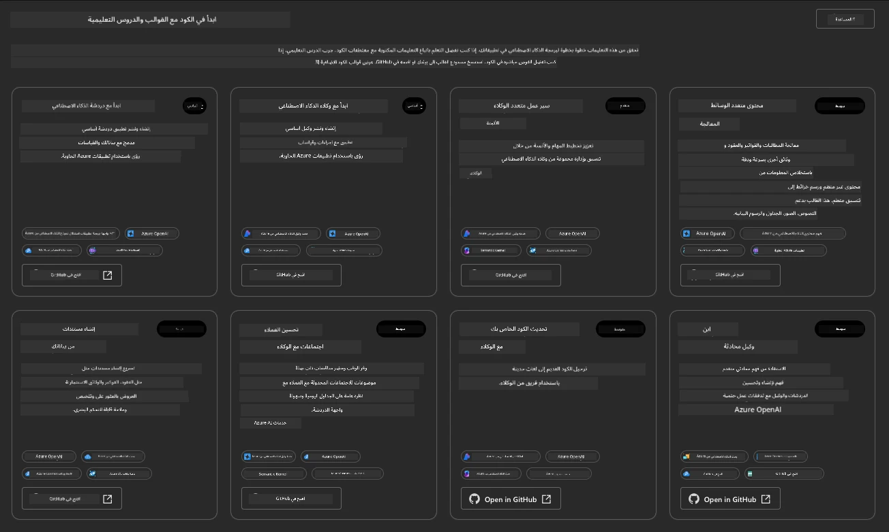


تُعد خيارات **Basic** قوالب البداية الخاصة بك:

1. [ ] [Get Started with AI Chat](https://github.com/Azure-Samples/get-started-with-ai-chat) الذي ينشر تطبيق دردشة أساسي _مع بياناتك_ إلى Azure Container Apps. استخدم هذا لاستكشاف سيناريو شات بوت أساسي للذكاء الاصطناعي.
1. [X] [Get Started with AI Agents](https://github.com/Azure-Samples/get-started-with-ai-agents) الذي ينشر أيضًا وكيل ذكاء اصطناعي قياسي (مع Foundry Agents). استخدم هذا للتعرّف على حلول الذكاء الاصطناعي الوكِيلية التي تتضمن أدوات ونماذج.

زر الرابط الثاني في علامة تبويب جديدة في المتصفح (أو انقر على `Open in GitHub` لبطاقة ذات صلة). يجب أن ترى المستودع الخاص بهذا قالب AZD. خذ دقيقة لاستكشاف ملف README. تبدو بنية التطبيق هكذا:

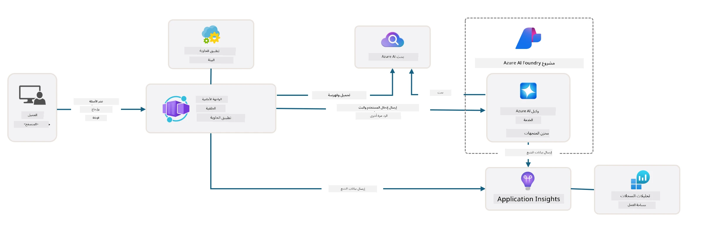

---

## 3. تفعيل القالب

لنحاول نشر هذا القالب ونتأكد من صلاحيته. سنتبع الإرشادات في قسم [البدء](https://github.com/Azure-Samples/get-started-with-ai-agents?tab=readme-ov-file#getting-started).

1. انقر على [this link](https://github.com/codespaces/new/Azure-Samples/get-started-with-ai-agents) - أكد الإجراء الافتراضي لـ `Create codespace`
1. سيفتح هذا علامة تبويب جديدة في المتصفح - انتظر حتى تكتمل جلسة GitHub Codespaces بالتحميل
1. افتح طرفية VS Code في Codespaces - اكتب الأمر التالي:

   ```bash title="" linenums="0"
   azd up
   ```

أكمل خطوات سير العمل التي سيؤدي إليها هذا:

1. سيُطلب منك تسجيل الدخول إلى Azure - اتبع التعليمات للمصادقة
1. أدخل اسم بيئة فريد لك - على سبيل المثال، استخدمت `nitya-mshack-azd`
1. هذا  سيؤدي إلى إنشاء مجلد `.azure/` - سترى مجلدًا فرعيًا باسم البيئة
1. سيُطلب منك اختيار اسم الاشتراك - اختر الافتراضي
1. سيُطلب منك تحديد موقع - استخدم `East US 2`

الآن، انتظر حتى يكتمل التهيئة. **يستغرق هذا 10-15 دقيقة**

1. عند الانتهاء، سيظهر في وحدة التحكم لديك رسالة SUCCESS مثل هذه:
      ```bash title="" linenums="0"
      SUCCESS: Your up workflow to provision and deploy to Azure completed in 10 minutes 17 seconds.
      ```
1. ستحتوي بوابة Azure الخاصة بك الآن على مجموعة موارد تم توفيرها بهذا الاسم البيئي:

      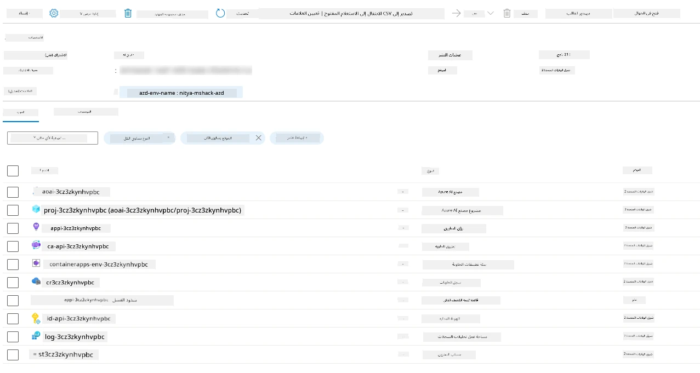

1. **أنت الآن جاهز للتحقق من البنية التحتية والتطبيق المنشور**.

---

## 4. التحقق من القالب

1. قم بزيارة صفحة مجموعات الموارد في بوابة Azure [Resource Groups](https://portal.azure.com/#browse/resourcegroups) - سجّل الدخول عند المطالبة
1. انقر على RG لاسم بيئتك - سترى الصفحة أعلاه

      - انقر على مورد Azure Container Apps
      - انقر على Application Url في قسم _Essentials_ (أعلى اليمين)

1. يجب أن ترى واجهة مستخدم لواجهة أمامية للتطبيق مستضافة مثل هذه:

   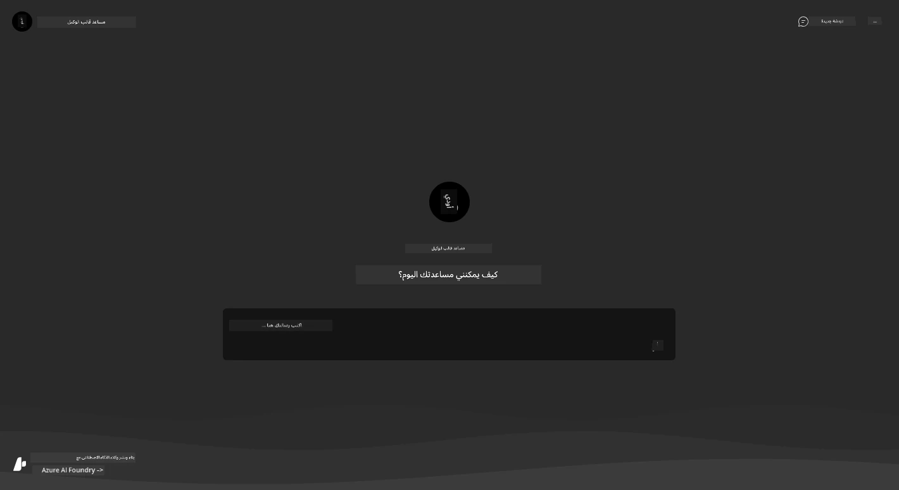

1. جرّب طرح بعض [الأسئلة النموذجية](https://github.com/Azure-Samples/get-started-with-ai-agents/blob/main/docs/sample_questions.md)

      1. اسأل: ```ما هي عاصمة فرنسا؟``` 
      1. اسأل: ```ما أفضل خيمة تحت 200$ لشخصين، وما الميزات التي تتضمنها؟```

1. يجب أن تحصل على إجابات مشابهة لما هو موضح أدناه. _لكن كيف يعمل هذا؟_ 

      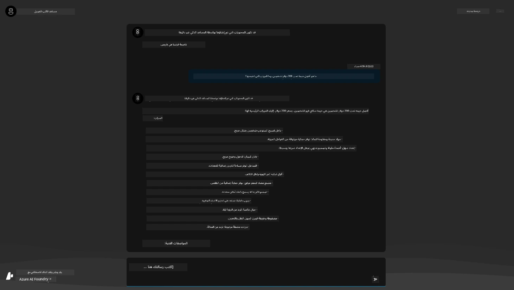

---

## 5.  التحقق من الوكيل

ينشر Azure Container App نقطة نهاية تتصل بوكيل الذكاء الاصطناعي الذي تم توفيره في مشروع Microsoft Foundry لهذا القالب. دعنا نلقي نظرة على ما يعنيه ذلك.

1. عد إلى صفحة _Overview_ في بوابة Azure لمجموعة الموارد الخاصة بك

1. انقر على مورد `Microsoft Foundry` في تلك القائمة

1. يجب أن ترى هذا. انقر على زر `Go to Microsoft Foundry Portal`. 
   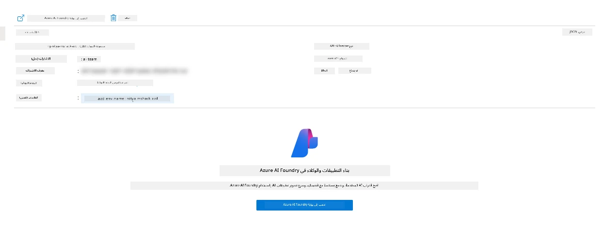

1. يجب أن ترى صفحة مشروع Foundry لتطبيق الذكاء الاصطناعي الخاص بك
   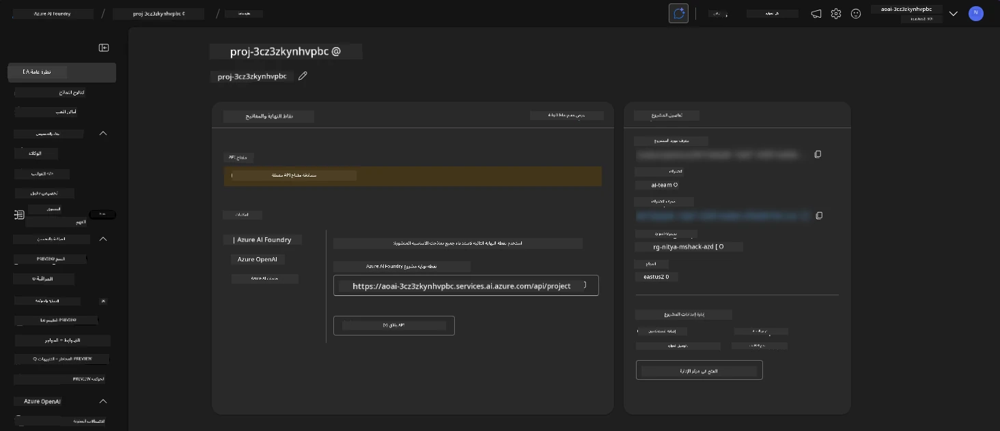

1. انقر على `Agents` - سترى الوكيل الافتراضي المزود في مشروعك
   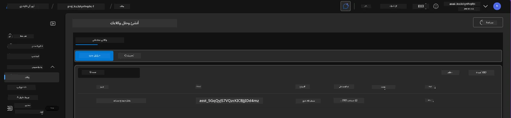

1. حدده - وسترى تفاصيل الوكيل. لاحظ ما يلي:

      - يستخدم الوكيل File Search افتراضيًا (دائمًا)
      - يشير `Knowledge` الخاص بالوكيل إلى أنه تم تحميل 32 ملفًا (للبحث في الملفات)
      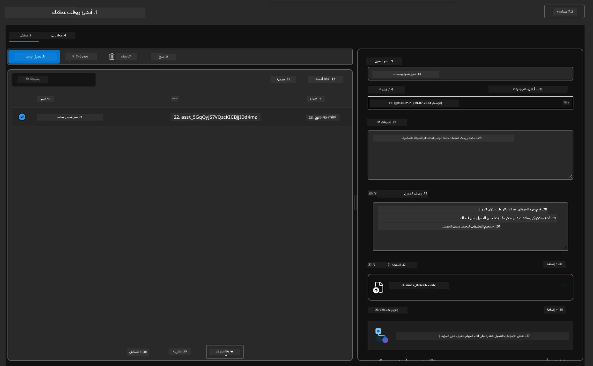

1. ابحث عن خيار `Data+indexes` في القائمة اليسرى وانقر للاطلاع على التفاصيل. 

      - يجب أن ترى 32 ملف بيانات تم تحميلها للمعرفة.
      - ستتوافق هذه مع 12 ملفًا للعميل و20 ملفًا للمنتج تحت `src/files` 
      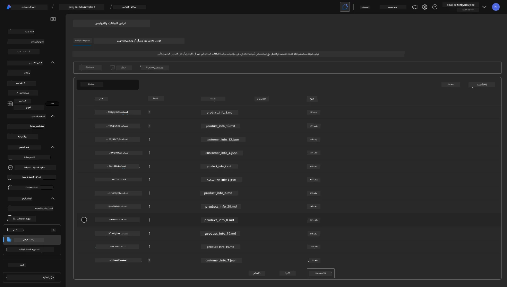

**لقد تحققت من تشغيل الوكيل!** 

1. استجابات الوكيل مستندة إلى المعرفة في تلك الملفات.
1. يمكنك الآن طرح أسئلة تتعلق بتلك البيانات، والحصول على استجابات مؤسَّسة.
1. مثال: يصف `customer_info_10.json` عمليات الشراء الثلاث التي قامت بها "Amanda Perez"

عد إلى علامة تبويب المتصفح التي تحتوي على نقطة نهاية Container App واسأل: `ما المنتجات التي تمتلكها Amanda Perez؟`. يجب أن ترى شيئًا مثل هذا:

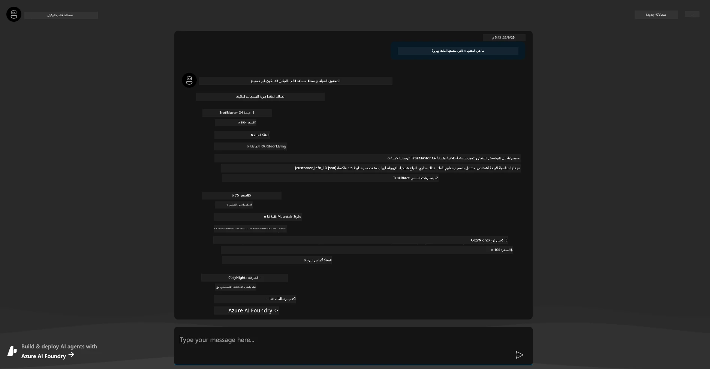

---

## 6. ملعب الوكيل

لنَبنِ فهمًا أكبر لقدرات Microsoft Foundry، من خلال تجربة الوكيل في ملعب الوكلاء.

1. عد إلى صفحة `Agents` في Microsoft Foundry - حدد الوكيل الافتراضي
1. انقر على خيار `Try in Playground` - ستحصل على واجهة ملعب مثل هذه
1. اطرح نفس السؤال: `ما المنتجات التي تمتلكها Amanda Perez؟`

    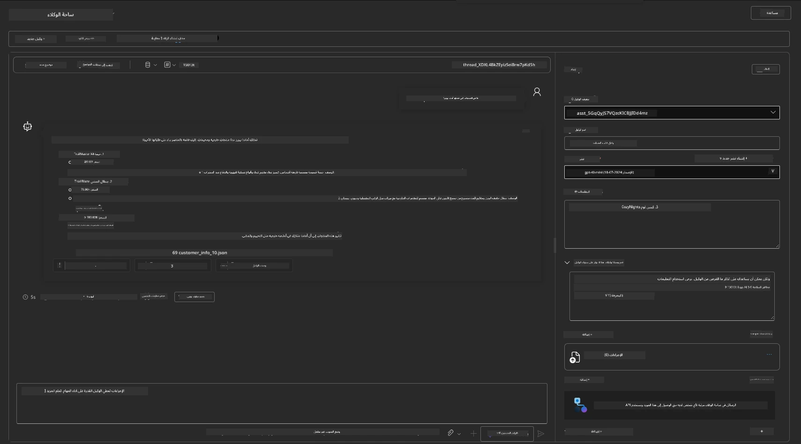

ستحصل على نفس الاستجابة (أو استجابة مشابهة) - لكنك ستحصل أيضًا على معلومات إضافية يمكنك استخدامها لفهم جودة وتكلفة وأداء تطبيق الوكيل لديك. على سبيل المثال:

1. لاحظ أن الاستجابة تستشهد بملفات البيانات المستخدمة لـ "تأصيل" الاستجابة
1. مرّر المؤشر فوق أي من هذه تسميات الملفات - هل تتطابق البيانات مع استفسارك والاستجابة المعروضة؟

ترى أيضًا صفًا إحصائيًا أسفل الاستجابة.

1. مرّر المؤشر فوق أي مقياس - على سبيل المثال، السلامة. سترى شيئًا مثل هذا
1. هل يتطابق التقييم المقيم مع حدسك لمستوى سلامة الاستجابة؟

      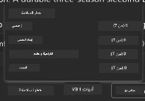

---

## 7. القابلية للمراقبة المدمجة

المراقبة تتعلق بأدوات لتوليد بيانات يمكن استخدامها لفهم التطبيق وتصحيحه وتحسين تشغيله. للحصول على فكرة عن هذا:

1. انقر على زر `View Run Info` - يجب أن ترى هذا العرض. هذا مثال على [تتبّع الوكلاء](https://learn.microsoft.com/en-us/azure/ai-foundry/how-to/develop/trace-agents-sdk#view-trace-results-in-the-azure-ai-foundry-agents-playground) قيد العمل. _يمكنك أيضًا الحصول على هذا العرض بالنقر على Thread Logs في القائمة العلوية_.

   - احصل على إحساس بخطوات التشغيل والأدوات التي استُخدمت بواسطة الوكيل
   - افهم إجمالي عدد التوكنات (مقابل استخدام توكنات الإخراج) للاستجابة
   - افهم الكمون وأين يُقضى الوقت في التنفيذ

      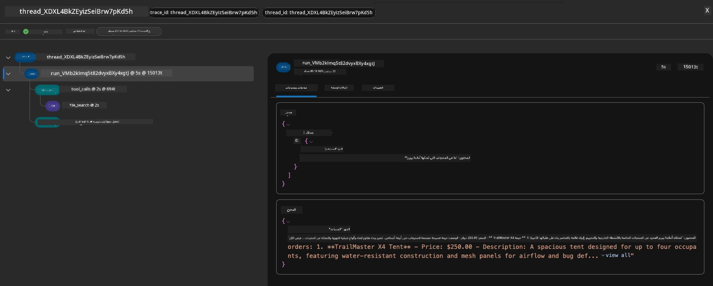

1. انقر على تبويب `Metadata` لمشاهدة سمات إضافية للتشغيل، والتي قد توفر سياقًا مفيدًا لتصحيح المشكلات لاحقًا.   

      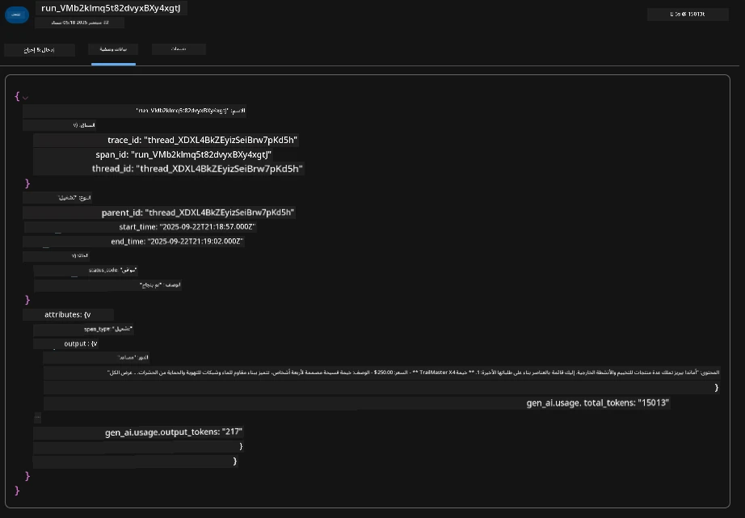


1. انقر على تبويب `Evaluations` لمشاهدة التقييمات الآلية التي أُجريت على استجابة الوكيل. تتضمن هذه تقييمات السلامة (مثل، الإيذاء الذاتي) وتقييمات خاصة بالوكيل (مثل، حل النوايا، الالتزام بالمهمة).

      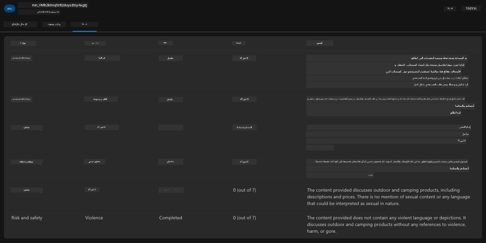

1. أخيرًا وليس آخرًا، انقر على تبويب `Monitoring` في قائمة الشريط الجانبي.

      - اختر تبويب `Resource usage` في الصفحة المعروضة - واطلع على المقاييس.
      - تتبّع استخدام التطبيق من حيث التكاليف (التوكنات) والحمولة (الطلبات).
      - تتبّع زمن استجابة التطبيق حتى البايت الأول (معالجة الإدخال) والبايت الأخير (الإخراج).

      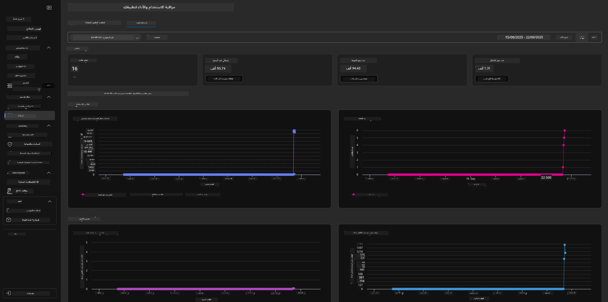

---

## 8. متغيرات البيئة

حتى الآن، استعرضنا النشر في المتصفح - وتحققنا من أن بنيتنا التحتية مُزَوَّدة وأن التطبيق يعمل. ولكن للعمل مع التطبيق _من خلال الكود أولًا_، نحتاج إلى تكوين بيئة التطوير المحلية الخاصة بنا بالمتغيرات ذات الصلة اللازمة للعمل مع هذه الموارد. يجعل `azd` ذلك سهلاً.

1. يستخدم Azure Developer CLI [متغيرات البيئة](https://learn.microsoft.com/en-us/azure/developer/azure-developer-cli/manage-environment-variables?tabs=bash) لتخزين وإدارة إعدادات التكوين لنشر التطبيقات.

1. تُخزّن متغيرات البيئة في `.azure/<env-name>/.env` - هذا يقصرها على بيئة `env-name` المستخدمة أثناء النشر ويساعدك على عزل البيئات بين أهداف النشر المختلفة في نفس المستودع.

1. يتم تحميل متغيرات البيئة تلقائيًا بواسطة أمر `azd` كلما نفّذ أمرًا محددًا (مثل، `azd up`). لاحظ أن `azd` لا يقرأ تلقائيًا متغيرات بيئة مستوى نظام التشغيل (مثل، المُعدة في الشل) - بدلاً من ذلك استخدم `azd set env` و `azd get env` لنقل المعلومات داخل السكربتات.


لنجرّب بعض الأوامر:

1. احصل على جميع متغيرات البيئة المضبوطة لـ `azd` في هذه البيئة:

      ```bash title="" linenums="0"
      azd env get-values
      ```
      
      سترى شيئًا مثل:

      ```bash title="" linenums="0"
      AZURE_AI_AGENT_DEPLOYMENT_NAME="gpt-4.1-mini"
      AZURE_AI_AGENT_NAME="agent-template-assistant"
      AZURE_AI_EMBED_DEPLOYMENT_NAME="text-embedding-3-small"
      AZURE_AI_EMBED_DIMENSIONS=100
      ...
      ```

1. احصل على قيمة محددة - على سبيل المثال، أريد أن أعرف ما إذا كنا قد ضبطنا قيمة `AZURE_AI_AGENT_MODEL_NAME`

      ```bash title="" linenums="0"
      azd env get-value AZURE_AI_AGENT_MODEL_NAME 
      ```
      
      سترى شيئًا مثل هذا - لم يتم ضبطها افتراضيًا!

      ```bash title="" linenums="0"
      ERROR: key 'AZURE_AI_AGENT_MODEL_NAME' not found in the environment values
      ```

1. اضبط متغير بيئة جديد لـ `azd`. هنا، نقوم بتحديث اسم نموذج الوكيل. _ملاحظة: أي تغييرات تُجرى سيتم عكسها فورًا في ملف `.azure/<env-name>/.env`._

      ```bash title="" linenums="0"
      azd env set AZURE_AI_AGENT_MODEL_NAME gpt-4.1
      azd env set AZURE_AI_AGENT_MODEL_VERSION 2025-04-14
      azd env set AZURE_AI_AGENT_DEPLOYMENT_CAPACITY 150
      ```

      الآن، يجب أن نجد أن القيمة قد تم ضبطها:

      ```bash title="" linenums="0"
      azd env get-value AZURE_AI_AGENT_MODEL_NAME 
      ```

1. لاحظ أن بعض الموارد دائمة (مثل، نشرات النماذج) وستتطلب أكثر من مجرد `azd up` لإجبار إعادة النشر. دعنا نحاول تفكيك النشر الأصلي وإعادة النشر مع متغيرات بيئة مُعدَّلة.

1. **تحديث** إذا كنت قد نشرت بنية تحتية مسبقًا باستخدام قالب azd - يمكنك _تحديث_ حالة متغيرات البيئة المحلية الخاصة بك بناءً على الحالة الحالية لنشر Azure الخاص بك باستخدام هذا الأمر:

      ```bash title="" linenums="0"
      azd env refresh
      ```

      هذه طريقة قوية لـ _مزامنة_ متغيرات البيئة عبر بيئتين محليتين أو أكثر للتطوير (على سبيل المثال، فريق يضم عدة مطورين) - مما يسمح للبنية التحتية المنشورة بأن تكون المصدر المرجعي لحالة متغيرات البيئة. يقوم أعضاء الفريق ببساطة بـ_تحديث_ المتغيرات للعودة إلى التزامن.

---

## 9. تهانينا 🏆

لقد أكملت للتو سير عمل من البداية إلى النهاية حيث:

- [X] اخترت قالب AZD الذي تريد استخدامه
- [X] أطلقت القالب باستخدام GitHub Codespaces 
- [X] نشرت القالب وتحققت من أنه يعمل

---

<!-- CO-OP TRANSLATOR DISCLAIMER START -->
إخلاء المسؤولية:
تمت ترجمة هذا المستند باستخدام خدمة الترجمة الآلية [Co-op Translator] (https://github.com/Azure/co-op-translator). مع أننا نسعى إلى الدقة، يرجى العلم أن الترجمات الآلية قد تحتوي على أخطاء أو عدم اتساق. يجب اعتبار المستند الأصلي بلغته الأم المصدر المعتمد. بالنسبة للمعلومات الحرجة، يُنصَح بالاستعانة بترجمة احترافية من قبل مترجم بشري. نحن غير مسؤولين عن أي سوء فهم أو تفسيرات خاطئة تنشأ عن استخدام هذه الترجمة.
<!-- CO-OP TRANSLATOR DISCLAIMER END -->