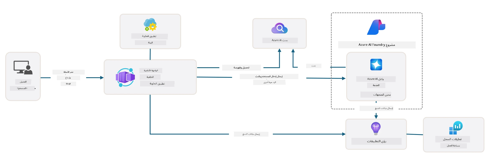

# 3. تفكيك قالب

!!! tip "بنهاية هذه الوحدة ستكون قادرًا على"

    - [ ] تفعيل GitHub Copilot مع خوادم MCP للحصول على دعم Azure
    - [ ] فهم بنية مجلد قالب AZD ومكوناته
    - [ ] استكشاف أنماط تنظيم البنية ككود (Bicep)
    - [ ] **المختبر 3:** استخدام GitHub Copilot لاستكشاف وفهم بنية المستودع 

---


مع قوالب AZD وواجهة سطر أوامر Azure Developer CLI (`azd`) يمكننا بسرعة بدء رحلتنا في تطوير الذكاء الاصطناعي بمستودعات معيارية توفر مثالاً على الشيفرة والبنية التحتية وملفات التكوين - على شكل مشروع _مشروع_ جاهز للنشر.

**لكن الآن، نحتاج إلى فهم هيكل المشروع وقاعدة الشيفرة - وأن نتمكن من تخصيص قالب AZD - دون أي خبرة أو فهم مسبق لـ AZD!**

---

## 1. تفعيل GitHub Copilot

### 1.1 تثبيت GitHub Copilot Chat

حان الوقت لاستكشاف [GitHub Copilot مع وضع الوكيل](https://code.visualstudio.com/docs/copilot/chat/chat-agent-mode). الآن، يمكننا استخدام اللغة الطبيعية لوصف مهمتنا على مستوى عالٍ، والحصول على مساعدة في التنفيذ. بالنسبة لهذا المختبر، سنستخدم خطة [Copilot Free](https://github.com/github-copilot/signup) التي تحتوي على حد شهري للإكمالات وتفاعلات الدردشة.

يمكن تثبيت الامتداد من السوق، لكنه ينبغي أن يكون متاحًا بالفعل في بيئة Codespaces الخاصة بك. _انقر على `Open Chat` من قائمة أيقونة Copilot - واكتب موجهًا مثل `What can you do?`_ - قد يُطلب منك تسجيل الدخول. **دردشة GitHub Copilot جاهزة**.

### 1.2. تثبيت خوادم MCP

لكي يكون وضع الوكيل فعالًا، يحتاج إلى الوصول إلى الأدوات الصحيحة لمساعدته في استرجاع المعرفة أو اتخاذ إجراءات. هنا تأتي فائدة خوادم MCP. سنقوم بتكوين الخوادم التالية:

1. [خادم MCP لـ Azure](../../../../../workshop/docs/instructions)
1. [خادم MCP لمستندات Microsoft](../../../../../workshop/docs/instructions)

لتفعيل هذه:

1. أنشئ ملفًا باسم `.vscode/mcp.json` إذا لم يكن موجودًا
1. انسخ ما يلي إلى ذلك الملف - وشغّل الخوادم!
   ```json title=".vscode/mcp.json"
   {
      "servers": {
         "Azure MCP Server": {
            "command": "npx",
            "args": [
            "-y",
            "@azure/mcp@latest",
            "server",
            "start"
            ]
         },
         "microsoft.docs.mcp": {
            "type": "http",
            "url": "https://learn.microsoft.com/api/mcp"
         }
      }
   }
   ```

??? warning "قد يظهر لك خطأ يفيد بأن `npx` غير مثبت (انقر للتوسيع للحصول على إصلاح)"

      To fix,this open the `.devcontainer/devcontainer.json` file and add this line to the features section. Then rebuild the container. You should now have `npx` installed.

      ```title="" linenums="0"
         "features": {
            "ghcr.io/devcontainers/features/node:1": {},
            ...
         },
      ```

---

### 1.3. اختبار GitHub Copilot Chat

**استخدم أولًا `az login` للمصادقة مع Azure من سطر أوامر VS Code.**

ينبغي الآن أن تكون قادرًا على الاستعلام عن حالة اشتراك Azure الخاص بك، وطرح أسئلة حول الموارد المنشورة أو التكوين. جرّب هذه الموجهات:

1. `List my Azure resource groups`
1. `#foundry list my current deployments`

يمكنك أيضًا طرح أسئلة حول توثيق Azure والحصول على ردود مستندة إلى خادم Microsoft Docs MCP. جرّب هذه الموجهات:

1. `#microsoft_docs_search What is Azure Developer CLI?`
1. `#microsoft_docs_search Show me a Python tutorial to chat with deployed model`

أو يمكنك طلب مقتطفات برمجية لإكمال مهمة. جرّب هذا الموجه.

1. `Give me a Python code example that uses AAD for an interactive chat client`

في وضع "Ask"، سيُقدِّم هذا شيفرة يمكنك نسخها ولصقها وتجربتها. في وضع "Agent"، قد يقوم ذلك بخطوة إضافية ويُنشئ الموارد ذات الصلة لك - بما في ذلك سكربتات الإعداد والتوثيق - لمساعدتك على تنفيذ المهمة.

**أنت الآن مجهز لبدء استكشاف مستودع القالب**

---

## 2. تفكيك البنية

??? prompt "اسأل: اشرح بنية التطبيق في docs/images/architecture.png في فقرة واحدة"

      هذا التطبيق هو تطبيق دردشة مدعوم بالذكاء الاصطناعي مبني على Azure ويعرض بنية حديثة تعتمد على الوكلاء. تتركز الحل حول Azure Container App الذي يستضيف الشيفرة الرئيسية للتطبيق، والتي تعالج مدخلات المستخدم وتولد استجابات ذكية عبر وكيل ذكاء اصطناعي.
      
      تستفيد البنية من مشروع Microsoft Foundry كأساس لقدرات الذكاء الاصطناعي، متصلة بخدمات Azure AI التي توفر نماذج اللغة الأساسية (مثل GPT-4o-mini) ووظائف الوكلاء. تتدفق تفاعلات المستخدم عبر واجهة أمامية مبنية بـ React إلى خلفية FastAPI التي تتواصل مع خدمة الوكيل للذكاء الاصطناعي لتوليد استجابات سياقية.
      
      يتضمن النظام قدرات استرجاع المعرفة من خلال البحث في الملفات أو خدمة Azure AI Search، ما يتيح للوكيل الوصول إلى المعلومات المرفوعة والاقتباس منها. لأجل التميز التشغيلي، تتضمن البنية مراقبة شاملة عبر Application Insights وLog Analytics Workspace للتتبع والتسجيل وتحسين الأداء.
      
      يوفر Azure Storage تخزينًا للبلوب للبيانات وعمليات رفع الملفات، بينما تضمن Managed Identity وصولًا آمنًا بين موارد Azure دون تخزين بيانات الاعتماد. صُمِّم الحل بأكمله ليكون قابلاً للتوسع وسهل الصيانة، مع تحجيم التطبيق المحوَّل إلى حاويات تلقائيًا بناءً على الطلب مع توفير أمان ومراقبة وCI/CD مدمجة عبر نظام خدمات Azure المُدارة.



---

## 3. هيكل المستودع

!!! prompt "اسأل: اشرح هيكل مجلد القالب. ابدأ بمخطط هرمي بصري."

??? info "الإجابة: مخطط هرمي بصري"

      ```bash title="" 
      get-started-with-ai-agents/
      ├── 📋 Configuration & Setup
      │   ├── azure.yaml                    # Azure Developer CLI configuration
      │   ├── docker-compose.yaml           # Local development containers
      │   ├── pyproject.toml                # Python project configuration
      │   ├── requirements-dev.txt          # Development dependencies
      │   └── .devcontainer/                # VS Code dev container setup
      │
      ├── 🏗️ Infrastructure (infra/)
      │   ├── main.bicep                    # Main infrastructure template
      │   ├── api.bicep                     # API-specific resources
      │   ├── main.parameters.json          # Infrastructure parameters
      │   └── core/                         # Modular infrastructure components
      │       ├── ai/                       # AI service configurations
      │       ├── host/                     # Hosting infrastructure
      │       ├── monitor/                  # Monitoring and logging
      │       ├── search/                   # Azure AI Search setup
      │       ├── security/                 # Security and identity
      │       └── storage/                  # Storage account configs
      │
      ├── 💻 Application Source (src/)
      │   ├── api/                          # Backend API
      │   │   ├── main.py                   # FastAPI application entry
      │   │   ├── routes.py                 # API route definitions
      │   │   ├── search_index_manager.py   # Search functionality
      │   │   ├── data/                     # API data handling
      │   │   ├── static/                   # Static web assets
      │   │   └── templates/                # HTML templates
      │   ├── frontend/                     # React/TypeScript frontend
      │   │   ├── package.json              # Node.js dependencies
      │   │   ├── vite.config.ts            # Vite build configuration
      │   │   └── src/                      # Frontend source code
      │   ├── data/                         # Sample data files
      │   │   └── embeddings.csv            # Pre-computed embeddings
      │   ├── files/                        # Knowledge base files
      │   │   ├── customer_info_*.json      # Customer data samples
      │   │   └── product_info_*.md         # Product documentation
      │   ├── Dockerfile                    # Container configuration
      │   └── requirements.txt              # Python dependencies
      │
      ├── 🔧 Automation & Scripts (scripts/)
      │   ├── postdeploy.sh/.ps1           # Post-deployment setup
      │   ├── setup_credential.sh/.ps1     # Credential configuration
      │   ├── validate_env_vars.sh/.ps1    # Environment validation
      │   └── resolve_model_quota.sh/.ps1  # Model quota management
      │
      ├── 🧪 Testing & Evaluation
      │   ├── tests/                        # Unit and integration tests
      │   │   └── test_search_index_manager.py
      │   ├── evals/                        # Agent evaluation framework
      │   │   ├── evaluate.py               # Evaluation runner
      │   │   ├── eval-queries.json         # Test queries
      │   │   └── eval-action-data-path.json
      │   ├── sandbox/                      # Development playground
      │   │   ├── 1-quickstart.py           # Getting started examples
      │   │   └── aad-interactive-chat.py   # Authentication examples
      │   └── airedteaming/                 # AI safety evaluation
      │       └── ai_redteaming.py          # Red team testing
      │
      ├── 📚 Documentation (docs/)
      │   ├── deployment.md                 # Deployment guide
      │   ├── local_development.md          # Local setup instructions
      │   ├── troubleshooting.md            # Common issues & fixes
      │   ├── azure_account_setup.md        # Azure prerequisites
      │   └── images/                       # Documentation assets
      │
      └── 📄 Project Metadata
         ├── README.md                     # Project overview
         ├── CODE_OF_CONDUCT.md           # Community guidelines
         ├── CONTRIBUTING.md              # Contribution guide
         ├── LICENSE                      # License terms
         └── next-steps.md                # Post-deployment guidance
      ```

### 3.1. البنية الأساسية للتطبيق

يتبع هذا القالب نمط **تطبيق ويب متكامل** مع:

- **الواجهة الخلفية**: Python FastAPI مع تكامل Azure AI
- **الواجهة الأمامية**: TypeScript/React مع نظام البناء Vite
- **البنية التحتية**: قوالب Azure Bicep لموارد السحابة
- **الحاويات**: Docker للنشر المتسق

### 3.2 البنية ككود (Bicep)

تستخدم طبقة البنية التحتية قوالب **Azure Bicep** منظمة بشكل معياري:

   - **`main.bicep`**: يُنسق كل موارد Azure
   - **وحدات `core/`**: مكونات قابلة لإعادة الاستخدام لخدمات مختلفة
      - خدمات الذكاء الاصطناعي (Azure OpenAI, AI Search)
      - استضافة الحاويات (Azure Container Apps)
      - المراقبة (Application Insights, Log Analytics)
      - الأمن (Key Vault, Managed Identity)

### 3.3 مصدر التطبيق (`src/`)

**API الخلفية (`src/api/`)**:

- واجهة REST مبنية على FastAPI
- تكامل Foundry Agents
- إدارة فهرس البحث لاسترجاع المعرفة
- قدرات رفع الملفات ومعالجتها

**الواجهة الأمامية (`src/frontend/`)**:

- تطبيق SPA حديث بـ React/TypeScript
- Vite للتطوير السريع وبناءات محسّنة
- واجهة دردشة لتفاعلات الوكيل

**قاعدة المعرفة (`src/files/`)**:

- بيانات نموذجية للعملاء والمنتجات
- يوضح استرجاع المعرفة من الملفات
- أمثلة بتنسيق JSON وMarkdown


### 3.4 DevOps والأتمتة

**السكربتات (`scripts/`)**:

- سكربتات متوافقة عبر المنصات PowerShell وBash
- التحقق من البيئة وإعدادها
- إعداد ما بعد النشر
- إدارة حصص النماذج

**تكامل Azure Developer CLI**:

- تكوين `azure.yaml` لتدفقات عمل `azd`
- التهيئة والنشر التلقائي
- إدارة متغيرات البيئة

### 3.5 الاختبار وضمان الجودة

**إطار التقييم (`evals/`)**:

- تقييم أداء الوكلاء
- اختبار جودة الاستجابة للمسائل
- خط أنابيب تقييم آلي

**أمان الذكاء الاصطناعي (`airedteaming/`)**:

- اختبار الفريق الأحمر لأمان الذكاء الاصطناعي
- فحص الثغرات الأمنية
- ممارسات الذكاء الاصطناعي المسؤولة

---

## 4. تهانينا 🏆

لقد استخدمت بنجاح GitHub Copilot Chat مع خوادم MCP لاستكشاف المستودع.

- [X] تم تفعيل GitHub Copilot لـ Azure
- [X] تم فهم بنية التطبيق
- [X] تم استكشاف بنية قالب AZD

هذا يمنحك فكرة عن أصول _البنية ككود_ لهذا القالب. بعد ذلك، سنلقي نظرة على ملف التكوين الخاص بـ AZD.

---

<!-- CO-OP TRANSLATOR DISCLAIMER START -->
إخلاء المسؤولية:
تمت ترجمة هذا المستند باستخدام خدمة الترجمة الآلية Co‑op Translator (https://github.com/Azure/co-op-translator). بينما نسعى إلى الدقة، يُرجى ملاحظة أن الترجمات الآلية قد تحتوي على أخطاء أو عدم دقّة. يجب اعتبار الوثيقة الأصلية بلغتها الأصلية المصدر المعتمد والمرجعي. للمعلومات الحيوية أو الحرجة، يُنصح باللجوء إلى ترجمة بشرية محترفة. نحن غير مسؤولين عن أي سوء فهم أو تفسير خاطئ ناتج عن استخدام هذه الترجمة.
<!-- CO-OP TRANSLATOR DISCLAIMER END -->