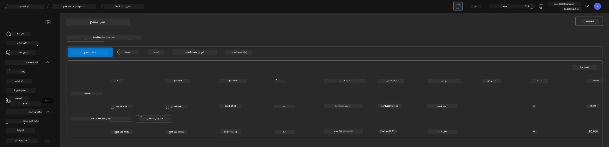
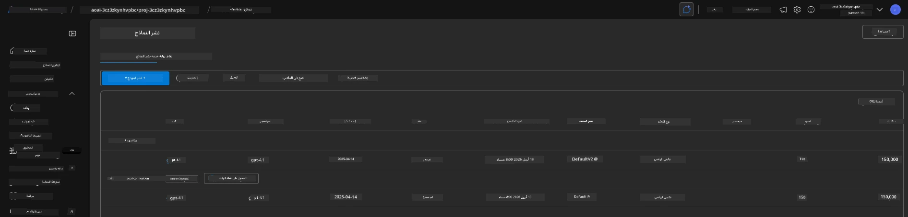

# 6. تفكيك البنية التحتية

!!! tip "بنهاية هذه الوحدة، ستتمكن من"

    - [ ] فهم أهمية تنظيف الموارد وإدارة التكاليف
    - [ ] استخدام `azd down` لإلغاء توفير البنية التحتية بأمان
    - [ ] استعادة خدمات Cognitive المحذوفة مؤقتًا عند الحاجة
    - [ ] **Lab 6:** تنظيف موارد Azure والتحقق من إزالتها

---

## تمارين إضافية

قبل أن نقوم بتفكيك المشروع، خذ بضع دقائق للقيام ببعض الاستكشاف الحر.

!!! info "جرّب هذه المطالبات للاستكشاف"

    **جرب GitHub Copilot:**
    
    1. اسأل: `What other AZD templates could I try for multi-agent scenarios?`
    2. اسأل: `How can I customize the agent instructions for a healthcare use case?`
    3. اسأل: `What environment variables control cost optimization?`
    
    **استكشف بوابة Azure:**
    
    1. راجع مقاييس Application Insights لنشرك
    2. تحقق من تحليل التكاليف للموارد التي تم توفيرها
    3. استكشف ملعب الوكلاء في بوابة Microsoft Foundry مرة أخرى

---

## إلغاء توفير البنية التحتية

1. تفكيك البنية التحتية سهل مثل:
      
      ```bash title="" linenums="0"
      azd down --purge
      ```
1. يضمن العلم `--purge` أنه يقوم أيضًا بمسح موارد خدمات Cognitive المحذوفة مؤقتًا، وبالتالي تحرير الحصة المحتجوزة بواسطة هذه الموارد. بمجرد اكتماله سترى شيئًا مثل هذا:
      
      ```bash title="" linenums="0"
      ? Total resources to delete: 11, are you sure you want to continue? Yes
      Deleting your resources can take some time.
      (✓) Done: Deleted resource group rg-nitya-mshack-azd
      (✓) Done: Purging Cognitive Account: aoai-3cz3zkynhvpbc

      SUCCESS: Your application was removed from Azure in 11 minutes 4 seconds.
      ```

1. (اختياري) إذا قمت الآن بتشغيل `azd up` مرة أخرى، ستلاحظ أنه يتم نشر نموذج gpt-4.1 لأن متغير البيئة تم تغييره (وحُفظ) في المجلد المحلي `.azure`. 

      إليك نشرات النماذج **قبل**:

      

      وهنا **بعد**:
      

---

<!-- CO-OP TRANSLATOR DISCLAIMER START -->
إخلاء المسؤولية:
تمت ترجمة هذا المستند باستخدام خدمة الترجمة الآلية Co-op Translator (https://github.com/Azure/co-op-translator). رغم سعينا لتحقيق الدقة، يرجى ملاحظة أن الترجمات الآلية قد تحتوي على أخطاء أو معلومات غير دقيقة. يجب اعتبار الوثيقة الأصلية بلغتها الأصلية المرجع المعتمد. بالنسبة للمعلومات الحيوية، يُنصح بالاستعانة بترجمة احترافية بشرية. نحن غير مسؤولين عن أي سوء فهم أو تفسير خاطئ ينشأ عن استخدام هذه الترجمة.
<!-- CO-OP TRANSLATOR DISCLAIMER END -->