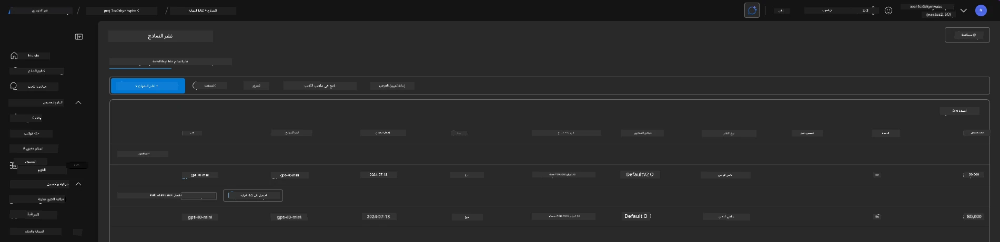
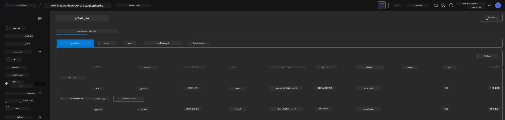

# 6. تفكيك البنية التحتية

!!! tip "بحلول نهاية هذه الوحدة ستكون قادرًا على"

    - [ ] فهم أهمية تنظيف الموارد وإدارة التكاليف
    - [ ] استخدام `azd down` لإلغاء توفير البنية التحتية بأمان
    - [ ] استعادة خدمات Azure AI المحذوفة مؤقتًا عند الحاجة
    - [ ] **Lab 6:** تنظيف موارد Azure والتحقق من الإزالة

---

## تمارين إضافية

قبل أن نقوم بتفكيك المشروع، خُذ بضع دقائق للقيام ببعض الاستكشاف الحر.

!!! info "جرب هذه المقترحات للاستكشاف"

    **جرّب GitHub Copilot:**
    
    1. اسأل: `What other AZD templates could I try for multi-agent scenarios?`
    2. اسأل: `How can I customize the agent instructions for a healthcare use case?`
    3. اسأل: `What environment variables control cost optimization?`
    
    **استكشاف بوابة Azure:**
    
    1. راجع مقاييس Application Insights لنشرك
    2. تحقق من تحليل التكاليف للموارد الموفرة
    3. استكشف ملعب الوكيل في بوابة Microsoft Foundry مرة أخرى

---

## إلغاء توفير البنية التحتية

1. تفكيك البنية التحتية سهل كما يلي:
      
      ```bash title="" linenums="0"
      azd down --purge
      ```
1. يضمن الوسيط `--purge` أنه يقوم أيضًا بمسح موارد Cognitive Service المحذوفة مؤقتًا، وبالتالي تحرير الحصة المخصصة التي تحتفظ بها هذه الموارد. عند الانتهاء سترى شيئًا مثل هذا:
      
      ```bash title="" linenums="0"
      ? Total resources to delete: 11, are you sure you want to continue? Yes
      Deleting your resources can take some time.
      (✓) Done: Deleted resource group rg-nitya-mshack-azd
      (✓) Done: Purging Cognitive Account: aoai-3cz3zkynhvpbc

      SUCCESS: Your application was removed from Azure in 11 minutes 4 seconds.
      ```

1. (اختياري) إذا قمت الآن بتشغيل `azd up` مرة أخرى، ستلاحظ أن نموذج gpt-4.1 يتم نشره لأنه تم تغيير متغير البيئة (وحفظه) في المجلد المحلي `.azure`. 

      هنا عمليات نشر النماذج **قبل**:

      

      وهنا هو **بعد**:
      

---

<!-- CO-OP TRANSLATOR DISCLAIMER START -->
**تنويه**:
تمت ترجمة هذا المستند باستخدام خدمة الترجمة بالذكاء الاصطناعي [Co-op Translator](https://github.com/Azure/co-op-translator). بينما نسعى للدقة، يرجى العلم أن الترجمات الآلية قد تحتوي على أخطاء أو عدم دقة. يجب اعتبار المستند الأصلي بلغته الأصلية المصدر الرسمي والمعتمد. للمعلومات الهامة، يُنصح بالاستعانة بترجمة بشرية محترفة. نحن غير مسؤولين عن أي سوء فهم أو تفسير ناتج عن استخدام هذه الترجمة.
<!-- CO-OP TRANSLATOR DISCLAIMER END -->