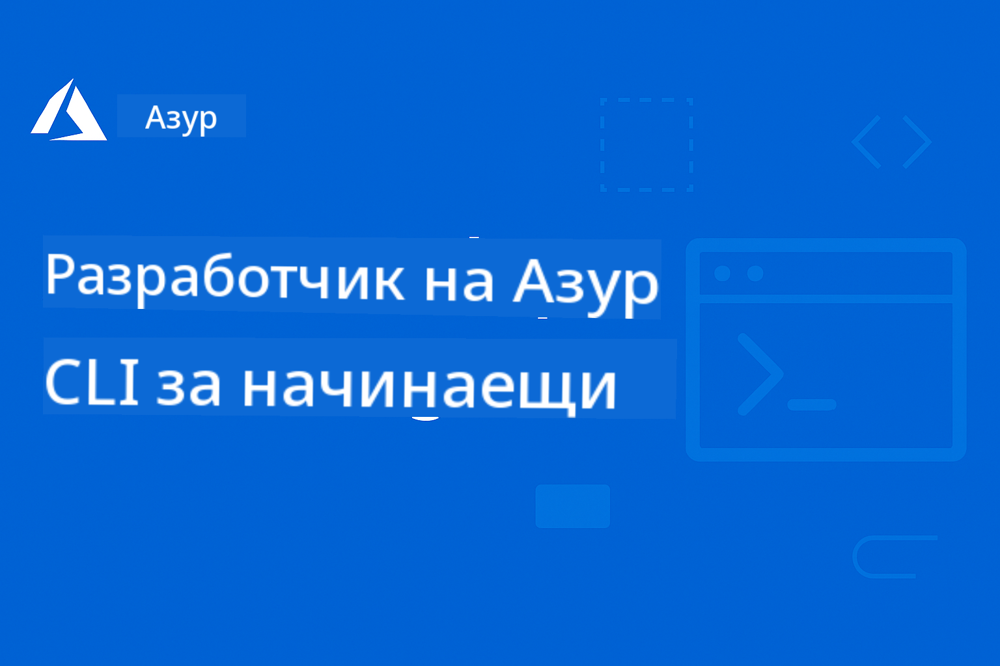

<!--
CO_OP_TRANSLATOR_METADATA:
{
  "original_hash": "1caf5e63f84a4cdffbeb8d0fe5fa3fa8",
  "translation_date": "2025-12-21T19:44:21+00:00",
  "source_file": "README.md",
  "language_code": "bg"
}
-->
# AZD за начинаещи: Структуриран учебен път

 

[](https://GitHub.com/microsoft/azd-for-beginners/watchers/)
[](https://GitHub.com/microsoft/azd-for-beginners/network/)
[](https://GitHub.com/microsoft/azd-for-beginners/stargazers/)

[](https://discord.gg/microsoft-azure)
[](https://discord.gg/nTYy5BXMWG)

## Започване с този курс

Следвайте тези стъпки, за да започнете вашето обучение по AZD:

1. **Разклонете хранилището (Fork)**: Кликнете [](https://GitHub.com/microsoft/azd-for-beginners/fork)
2. **Клонирайте хранилището**: `git clone https://github.com/microsoft/azd-for-beginners.git`
3. **Присъединете се към общността**: [Azure Discord общности](https://discord.com/invite/ByRwuEEgH4) за експертна помощ
4. **Изберете вашия учебен път**: Изберете глава по-долу, която отговаря на вашето ниво на опит

### Поддръжка на много езици

#### Автоматични преводи (винаги актуални)

<!-- CO-OP TRANSLATOR LANGUAGES TABLE START -->
[Арабски](../ar/README.md) | [Бенгалски](../bn/README.md) | [Български](./README.md) | [Бирмански (Мианмар)](../my/README.md) | [Китайски (опростен)](../zh/README.md) | [Китайски (традиционен, Хонконг)](../hk/README.md) | [Китайски (традиционен, Макао)](../mo/README.md) | [Китайски (традиционен, Тайван)](../tw/README.md) | [Хърватски](../hr/README.md) | [Чешки](../cs/README.md) | [Датски](../da/README.md) | [Нидерландски](../nl/README.md) | [Естонски](../et/README.md) | [Финландски](../fi/README.md) | [Френски](../fr/README.md) | [Немски](../de/README.md) | [Гръцки](../el/README.md) | [Иврит](../he/README.md) | [Хинди](../hi/README.md) | [Унгарски](../hu/README.md) | [Индонезийски](../id/README.md) | [Италиански](../it/README.md) | [Японски](../ja/README.md) | [Каннада](../kn/README.md) | [Корейски](../ko/README.md) | [Литовски](../lt/README.md) | [Малайски](../ms/README.md) | [Малаялам](../ml/README.md) | [Марати](../mr/README.md) | [Непалски](../ne/README.md) | [Нигерийски пиджин](../pcm/README.md) | [Норвежки](../no/README.md) | [Персийски (фарси)](../fa/README.md) | [Полски](../pl/README.md) | [Португалски (Бразилия)](../br/README.md) | [Португалски (Португалия)](../pt/README.md) | [Пенджаби (Гурмукхи)](../pa/README.md) | [Румънски](../ro/README.md) | [Руски](../ru/README.md) | [Сръбски (кирилица)](../sr/README.md) | [Словашки](../sk/README.md) | [Словенски](../sl/README.md) | [Испански](../es/README.md) | [Суахили](../sw/README.md) | [Шведски](../sv/README.md) | [Тагалог (Филипински)](../tl/README.md) | [Тамилски](../ta/README.md) | [Телугу](../te/README.md) | [Тайландски](../th/README.md) | [Турски](../tr/README.md) | [Украински](../uk/README.md) | [Урдски](../ur/README.md) | [Виетнамски](../vi/README.md)
<!-- CO-OP TRANSLATOR LANGUAGES TABLE END -->

## Преглед на курса

Овладейте Azure Developer CLI (azd) чрез структурирани глави, проектирани за стъпково обучение. **Особено внимание към внедряването на AI приложения с интеграция на Microsoft Foundry.**

### Защо този курс е от съществено значение за съвременните разработчици

Въз основа на прозрения от общността в Microsoft Foundry Discord, **45% от разработчиците искат да използват AZD за AI натоварвания**, но се сблъскват с предизвикателства при:
- Сложни многоуслугови AI архитектури
- Най-добри практики за внедряване на AI в продукция  
- Интеграция и конфигурация на Azure AI услуги
- Оптимизация на разходите за AI натоварвания
- Отстраняване на проблеми специфични за AI внедрявания

### Цели на обучението

След завършване на този структуриран курс ще:
- **Овладете основите на AZD**: Основни концепции, инсталация и конфигурация
- **Внедрите AI приложения**: Използвайте AZD с Microsoft Foundry услуги
- **Прилагате Инфраструктура като код**: Управлявайте Azure ресурси с Bicep шаблони
- **Отстранявате проблеми при внедрявания**: Решавайте често срещани проблеми и дебъгвайте
- **Оптимизирате за продукция**: Сигурност, скалиране, мониторинг и управление на разходите
- **Изграждате многоагентни решения**: Внедрете сложни AI архитектури

## 📚 Учебни глави

*Изберете вашия учебен път въз основа на нивото на опит и целите*

### 🚀 Глава 1: Основи и Бърз старт
**Предпоставки**: Абонамент за Azure, основни познания за команден ред  
**Продължителност**: 30-45 минути  
**Сложност**: ⭐

#### Какво ще научите
- Разбиране на основите на Azure Developer CLI
- Инсталиране на AZD на вашата платформа
- Вашето първо успешно внедряване

#### Ресурси за обучение
- **🎯 Започнете тук**: [Какво е Azure Developer CLI?](../..)
- **📖 Теория**: [Основи на AZD](docs/getting-started/azd-basics.md) - Основни концепции и терминология
- **⚙️ Настройка**: [Инсталация & Настройка](docs/getting-started/installation.md) - Ръководства за конкретни платформи
- **🛠️ Практическо**: [Вашият първи проект](docs/getting-started/first-project.md) - Урок стъпка по стъпка
- **📋 Бърза справка**: [Команден cheat sheet](resources/cheat-sheet.md)

#### Практически упражнения
```bash
# Бърза проверка на инсталацията
azd version

# Разположете първото си приложение
azd init --template todo-nodejs-mongo
azd up
```

**💡 Резултат от главата**: Успешно внедряване на просто уеб приложение в Azure, използвайки AZD

**✅ Проверка за успех:**
```bash
# След като завършите Глава 1, трябва да можете да:
azd version              # Показва инсталираната версия
azd init --template todo-nodejs-mongo  # Инициализира проект
azd up                  # Разгръща в Azure
azd show                # Показва URL на работещото приложение
# Приложението се отваря в браузъра и работи
azd down --force --purge  # Почиства ресурсите
```

**📊 Инвестиция на време:** 30-45 минути  
**📈 Ниво на умения след:** Може да внедрява основни приложения самостоятелно

**✅ Проверка за успех:**
```bash
# След като завършите Глава 1, трябва да можете да:
azd version              # Показва инсталираната версия
azd init --template todo-nodejs-mongo  # Инициализира проекта
azd up                  # Разгръща в Azure
azd show                # Показва URL адреса на работещото приложение
# Приложението се отваря в браузъра и работи
azd down --force --purge  # Почиства ресурсите
```

**📊 Инвестиция на време:** 30-45 минути  
**📈 Ниво на умения след:** Може да внедрява основни приложения самостоятелно

---

### 🤖 Глава 2: AI-първо разработване (Препоръчва се за AI разработчици)
**Предпоставки**: Завършена Глава 1  
**Продължителност**: 1-2 часа  
**Сложност**: ⭐⭐

#### Какво ще научите
- Интеграция на Microsoft Foundry с AZD
- Внедряване на приложения с изкуствен интелект
- Разбиране на конфигурациите на AI услуги

#### Ресурси за обучение
- **🎯 Започнете тук**: [Интеграция с Microsoft Foundry](docs/microsoft-foundry/microsoft-foundry-integration.md)
- **📖 Шаблони**: [Внедряване на AI модели](docs/microsoft-foundry/ai-model-deployment.md) - Внедряване и управление на AI модели
- **🛠️ Работилница**: [AI Workshop Lab](docs/microsoft-foundry/ai-workshop-lab.md) - Направете вашите AI решения готови за AZD
- **🎥 Интерактивно ръководство**: [Материали от работилницата](workshop/README.md) - Обучение в браузъра с MkDocs * DevContainer Environment
- **📋 Шаблони**: [Microsoft Foundry шаблони](../..)
- **📝 Примери**: [Примери за AZD внедряване](examples/README.md)

#### Практически упражнения
```bash
# Разположете първото си AI приложение
azd init --template azure-search-openai-demo
azd up

# Опитайте допълнителни AI шаблони
azd init --template openai-chat-app-quickstart
azd init --template agent-openai-python-prompty
```

**💡 Резултат от главата**: Внедрете и конфигурирайте чат приложение с изкуствен интелект и RAG възможности

**✅ Проверка за успех:**
```bash
# След глава 2 трябва да можете да:
azd init --template azure-search-openai-demo
azd up
# Тествайте интерфейса за чат с ИИ
# Задавайте въпроси и получавайте отговори от ИИ с източници
# Проверете дали интеграцията за търсене работи
azd monitor  # Проверете дали Application Insights показва телеметрия
azd down --force --purge
```

**📊 Инвестиция на време:** 1-2 часа  
**📈 Ниво на умения след:** Може да внедрява и конфигурира AI приложения, готови за продукция  
**💰 Осъзнаване на разходите:** Разберете разходи за разработка $80-150/месец, производствени разходи $300-3500/месец

#### 💰 Съображения за разходите при AI внедрявания

**Развойна среда (Ориентировъчно $80-150/месец):**
- Azure OpenAI (Pay-as-you-go): $0-50/месец (въз основа на използване на токени)
- AI Search (Basic tier): $75/месец
- Container Apps (Consumption): $0-20/месец
- Storage (Standard): $1-5/месец

**Производствена среда (Ориентировъчно $300-3,500+/месец):**
- Azure OpenAI (PTU за постоянна производителност): $3,000+/месец ИЛИ Pay-as-go при висок обем
- AI Search (Standard tier): $250/месец
- Container Apps (Dedicated): $50-100/месец
- Application Insights: $5-50/месец
- Storage (Premium): $10-50/месец

**💡 Съвети за оптимизиране на разходите:**
- Използвайте **Free Tier** на Azure OpenAI за обучение (50,000 токена/месец включени)
- Стартирайте `azd down`, за да деактивирате ресурси, когато не разработвате активно
- Започнете с таксуване на база потребление, надградете до PTU само за продукция
- Използвайте `azd provision --preview` за оценка на разходите преди внедряване
- Включете авто-скалиране: плащате само за реалната употреба

**Мониторинг на разходите:**
```bash
# Проверете приблизителните месечни разходи
azd provision --preview

# Следете реалните разходи в портала на Azure
az consumption budget list --resource-group <your-rg>
```

---

### ⚙️ Глава 3: Конфигурация и Удостоверяване
**Предпоставки**: Завършена Глава 1  
**Продължителност**: 45-60 минути  
**Сложност**: ⭐⭐

#### Какво ще научите
- Конфигурация и управление на среди
- Удостоверяване и най-добри практики за сигурност
- Именуване и организация на ресурсите

#### Ресурси за обучение
- **📖 Конфигурация**: [Ръководство за конфигурация](docs/getting-started/configuration.md) - Настройка на среди
- **🔐 Сигурност**: [Шаблони за удостоверяване и управлявани идентичности](docs/getting-started/authsecurity.md) - Шаблони за удостоверяване
- **📝 Примери**: [Пример с база данни](examples/database-app/README.md) - AZD примери с база данни

#### Практически упражнения
- Конфигурирайте множество среди (dev, staging, prod)
- Настройте удостоверяване с управлявана идентичност
- Прилагайте конфигурации, специфични за средата

**💡 Резултат от главата**: Управлявайте множество среди с правилно удостоверяване и сигурност

---

### 🏗️ Глава 4: Инфраструктура като код и внедряване
**Предпоставки**: Завършени Глави 1-3  
**Продължителност**: 1-1.5 часа  
**Сложност**: ⭐⭐⭐

#### Какво ще научите
- Разширени модели на внедряване
- Инфраструктура като код с Bicep
- Стратегии за предоставяне на ресурси

#### Ресурси за обучение
- **📖 Внедряване**: [Ръководство за внедряване](docs/deployment/deployment-guide.md) - Пълни работни потоци
- **🏗️ Предоставяне**: [Предоставяне на ресурси](docs/deployment/provisioning.md) - Управление на Azure ресурси
- **📝 Примери**: [Пример с Container App](../../examples/container-app) - Контейнеризирани внедрявания

#### Практически упражнения
- Създайте персонализирани Bicep шаблони
- Внедрете многосервисни приложения
- Прилагайте стратегии за blue-green внедряване

**💡 Резултат от главата**: Внедрете сложни многосервисни приложения, използвайки персонализирани инфраструктурни шаблони

---

### 🎯 Глава 5: Многоагентни AI решения (Напреднали)
**Предпоставки**: Завършени Глави 1-2  
**Продължителност**: 2-3 часа  
**Сложност**: ⭐⭐⭐⭐

#### Какво ще научите
- Шаблони за многоагентна архитектура
- Оркестрация и координация на агенти
- AI внедрявания, готови за продукция

#### Ресурси за обучение
- **🤖 Представен проект**: [Многоагентно решение за търговия на дребно](examples/retail-scenario.md) - Пълна имплементация
- **🛠️ ARM шаблони**: [Пакет с ARM шаблони](../../examples/retail-multiagent-arm-template) - Деплой с един клик
- **📖 Архитектура**: [Шаблони за координация на мулти-агенти](/docs/pre-deployment/coordination-patterns.md) - Шаблони

#### Практически упражнения
```bash
# Разположете цялостното многоагентно решение за търговия на дребно
cd examples/retail-multiagent-arm-template
./deploy.sh

# Разгледайте конфигурациите на агентите
az deployment group show --resource-group <rg-name> --name <deployment-name>
```

**💡 Резултат от главата**: Деплой и управление на продукционно готово мулти-агентно ИИ решение с агенти Customer и Inventory

---

### 🔍 Глава 6: Валидиране и планиране преди внедряване
**Предварителни изисквания**: Глава 4 завършена  
**Продължителност**: 1 час  
**Сложност**: ⭐⭐

#### Какво ще научите
- Планиране на капацитета и валидиране на ресурси
- Стратегии за избор на SKU
- Предварителни проверки и автоматизация

#### Ресурси за учене
- **📊 Планиране**: [Планиране на капацитета](docs/pre-deployment/capacity-planning.md) - Валидиране на ресурси
- **💰 Избор**: [Избор на SKU](docs/pre-deployment/sku-selection.md) - Икономически ефективни избори
- **✅ Валидиране**: [Предварителни проверки](docs/pre-deployment/preflight-checks.md) - Автоматизирани скриптове

#### Практически упражнения
- Стартиране на скриптове за валидиране на капацитета
- Оптимизиране на избора на SKU за намаляване на разходите
- Имплементиране на автоматизирани предварителни проверки

**💡 Резултат от главата**: Валидирайте и оптимизирайте разполагането преди изпълнение

---

### 🚨 Глава 7: Отстраняване на проблеми и дебъгване
**Предварителни изисквания**: Завършена която и да е глава за разполагане  
**Продължителност**: 1-1.5 часа  
**Сложност**: ⭐⭐

#### Какво ще научите
- Систематични подходи за дебъгване
- Чести проблеми и решения
- Отстраняване на проблеми, специфични за ИИ

#### Ресурси за учене
- **🔧 Чести проблеми**: [Чести проблеми](docs/troubleshooting/common-issues.md) - ЧЗВ и решения
- **🕵️ Дебъгване**: [Ръководство за дебъгване](docs/troubleshooting/debugging.md) - Стъпка по стъпка стратегии
- **🤖 Проблеми с ИИ**: [Отстраняване на проблеми специфични за ИИ](docs/troubleshooting/ai-troubleshooting.md) - Проблеми с AI услуги

#### Практически упражнения
- Диагностициране на неуспехи при разгръщане
- Решаване на проблеми с удостоверяване
- Дебъгване на връзката към AI услуги

**💡 Резултат от главата**: Самостоятелно диагностициране и разрешаване на чести проблеми при разгръщане

---

### 🏢 Глава 8: Патерни за продукция и корпоративни модели
**Предварителни изисквания**: Глави 1-4 завършени  
**Продължителност**: 2-3 часа  
**Сложност**: ⭐⭐⭐⭐

#### Какво ще научите
- Стратегии за разгръщане в продукция
- Корпоративни модели за сигурност
- Наблюдение и оптимизация на разходите

#### Ресурси за учене
- **🏭 Продукция**: [Най-добри практики за продукционно ИИ](docs/microsoft-foundry/production-ai-practices.md) - Корпоративни модели
- **📝 Примери**: [Пример за микросървиси](../../examples/microservices) - Комплексни архитектури
- **📊 Наблюдение**: [Интеграция с Application Insights](docs/pre-deployment/application-insights.md) - Наблюдение

#### Практически упражнения
- Имплементиране на корпоративни модели за сигурност
- Настройване на цялостно наблюдение
- Разгръщане в продукция с подходящо управление

**💡 Резултат от главата**: Разгръщане на приложения, готови за корпоративна употреба, с пълни продукционни възможности

---

## 🎓 Преглед на работилницата: Практическо обучение

> **⚠️ СЪСТОЯНИЕ НА РАБОТИЛНИЦАТА: Активна разработка**  
> Материалите за работилницата в момента се разработват и усъвършенстват. Основните модули са функционални, но някои напреднали секции са незавършени. Активно работим за завършване на цялото съдържание. [Проследете напредъка →](workshop/README.md)

### Интерактивни материали за работилницата
**Пълноценно практическо обучение с браузър-базирани инструменти и ръководени упражнения**

Нашите материали за работилницата предоставят структуриран, интерактивен учебен опит, който допълва горната учебна програма, базирана на глави. Работилницата е предназначена както за самостоятелно обучение, така и за сесии с инструктор.

#### 🛠️ Характеристики на работилницата
- **Интерфейс в браузъра**: Пълна работилница, управлявана от MkDocs, с функции за търсене, копиране и теми
- **Интеграция с GitHub Codespaces**: Настройка на среда за разработка с един клик
- **Структуриран учебен път**: Ръководени упражнения в 7 стъпки (общо 3.5 часа)
- **Откриване → Разгръщане → Персонализиране**: Прогресивна методология
- **Интерактивна DevContainer среда**: Предварително конфигурирани инструменти и зависимости

#### 📚 Структура на работилницата
Работилницата следва методология **Откриване → Разгръщане → Персонализиране**:

1. **Фаза на откриване** (45 мин)
   - Проучване на шаблони и услуги на Microsoft Foundry
   - Разбиране на архитектурните шаблони за мулти-агенти
   - Преглед на изискванията за разгръщане и предварителни условия

2. **Фаза на разгръщане** (2 часа)
   - Практическо разгръщане на ИИ приложения с AZD
   - Конфигуриране на Azure AI услуги и крайни точки
   - Имплементиране на модели за сигурност и автентикация

3. **Фаза на персонализиране** (45 мин)
   - Модифициране на приложенията за конкретни случаи на употреба
   - Оптимизиране за продукционно разгръщане
   - Имплементиране на мониторинг и управление на разходите

#### 🚀 Как да започнете с работилницата
```bash
# Опция 1: GitHub Codespaces (Препоръчително)
# Кликнете "Code" → "Create codespace on main" в хранилището

# Опция 2: Локална разработка
git clone https://github.com/microsoft/azd-for-beginners.git
cd azd-for-beginners/workshop
# Следвайте инструкциите за настройка в workshop/README.md
```

#### 🎯 Очаквани резултати от работилницата
След завършване на работилницата, участниците ще:
- **Разгръщат продукционни ИИ приложения**: Използване на AZD с услуги на Microsoft Foundry
- **Овладеят мултиагентни архитектури**: Имплементиране на координирани решения с ИИ агенти
- **Прилагат най-добри практики за сигурност**: Конфигуриране на автентикация и контрол на достъпа
- **Оптимизират за мащаб**: Проектиране на рентабилни и производителни разгръщания
- **Отстраняват проблеми при разгръщане**: Самостоятелно разрешаване на чести проблеми

#### 📖 Ресурси за работилницата
- **🎥 Интерактивно ръководство**: [Материали за работилницата](workshop/README.md) - Обучение в браузър
- **📋 Стъпка по стъпка инструкции**: [Ръководени упражнения](../../workshop/docs/instructions) - Подробни инструкции
- **🛠️ Лаб на AI работилницата**: [AI Workshop Lab](docs/microsoft-foundry/ai-workshop-lab.md) - Упражнения, фокусирани върху ИИ
- **💡 Бърз старт**: [Ръководство за настройка на работилницата](workshop/README.md#quick-start) - Конфигуриране на средата

**Подходящо за**: Корпоративно обучение, университетски курсове, самостоятелно обучение и bootcamp програми за разработчици.

---

## 📖 Какво е Azure Developer CLI?

Azure Developer CLI (azd) е команден интерфейс, ориентиран към разработчиците, който ускорява процеса на изграждане и разгръщане на приложения в Azure. Той предоставя:

- **Разгръщане, базирано на шаблони** - Използвайте предварително изградени шаблони за често срещани приложни модели
- **Инфраструктура като код** - Управлявайте Azure ресурси с помощта на Bicep или Terraform  
- **Интегрирани работни потоци** - Безпроблемно обезпечаване, разгръщане и наблюдение на приложения
- **Удобен за разработчици** - Оптимизиран за продуктивност и потребителско изживяване на разработчиците

### **AZD + Microsoft Foundry: Идеално за разгръщане на ИИ**

**Защо AZD за ИИ решения?** AZD адресира основните предизвикателства, с които се сблъскват разработчиците на ИИ:

- **Шаблони готови за ИИ** - Предварително конфигурирани шаблони за Azure OpenAI, Cognitive Services и ML натоварвания
- **Сигурни ИИ разгръщания** - Вградени модели за сигурност за AI услуги, API ключове и крайни точки на модели  
- **Патерни за продукционно ИИ** - Най-добри практики за мащабируеми и рентабилни разгръщания на ИИ приложения
- **Край-до-край работни потоци за ИИ** - От разработката на модели до продукционно разгръщане с подходящ мониторинг
- **Оптимизация на разходите** - Интелигентно разпределение на ресурси и стратегии за скалиране за ИИ натоварвания
- **Интеграция с Microsoft Foundry** - Безшевна връзка с каталогa от модели и крайни точки на Microsoft Foundry

---

## 🎯 Библиотека с шаблони и примери

### Препоръчани: Шаблони на Microsoft Foundry
**Започнете тук, ако разгръщате ИИ приложения!**

> **Бележка:** Тези шаблони демонстрират различни ИИ модели. Някои са външни Azure Samples, други са локални реализации.

| Шаблон | Глава | Сложност | Услуги | Тип |
|----------|---------|------------|----------|------|
| [**Get started with AI chat**](https://github.com/Azure-Samples/get-started-with-ai-chat) | Глава 2 | ⭐⭐ | AzureOpenAI + Azure AI Model Inference API + Azure AI Search + Azure Container Apps + Application Insights | Външен |
| [**Get started with AI agents**](https://github.com/Azure-Samples/get-started-with-ai-agents) | Глава 2 | ⭐⭐ | Azure AI Agent Service + AzureOpenAI + Azure AI Search + Azure Container Apps + Application Insights| Външен |
| [**Azure Search + OpenAI Demo**](https://github.com/Azure-Samples/azure-search-openai-demo) | Глава 2 | ⭐⭐ | AzureOpenAI + Azure AI Search + App Service + Storage | Външен |
| [**OpenAI Chat App Quickstart**](https://github.com/Azure-Samples/openai-chat-app-quickstart) | Глава 2 | ⭐ | AzureOpenAI + Container Apps + Application Insights | Външен |
| [**Agent OpenAI Python Prompty**](https://github.com/Azure-Samples/agent-openai-python-prompty) | Глава 5 | ⭐⭐⭐ | AzureOpenAI + Azure Functions + Prompty | Външен |
| [**Contoso Chat RAG**](https://github.com/Azure-Samples/contoso-chat) | Глава 8 | ⭐⭐⭐⭐ | AzureOpenAI + AI Search + Cosmos DB + Container Apps | Външен |
| [**Retail Multi-Agent Solution**](examples/retail-scenario.md) | Глава 5 | ⭐⭐⭐⭐ | AzureOpenAI + AI Search + Storage + Container Apps + Cosmos DB | **Локално** |

### Препоръчани: Пълни учебни сценарии
**Шаблони за продукционно готови приложения, съответстващи на учебните глави**

| Шаблон | Учебна глава | Сложност | Ключови знания |
|----------|------------------|------------|--------------|
| [**openai-chat-app-quickstart**](https://github.com/Azure-Samples/openai-chat-app-quickstart) | Глава 2 | ⭐ | Основни модели за разгръщане на ИИ |
| [**azure-search-openai-demo**](https://github.com/Azure-Samples/azure-search-openai-demo) | Глава 2 | ⭐⭐ | RAG имплементация с Azure AI Search |
| [**ai-document-processing**](https://github.com/Azure-Samples/ai-document-processing) | Глава 4 | ⭐⭐ | Интеграция с Document Intelligence |
| [**agent-openai-python-prompty**](https://github.com/Azure-Samples/agent-openai-python-prompty) | Глава 5 | ⭐⭐⭐ | Агентен фреймуърк и извикване на функции |
| [**contoso-chat**](https://github.com/Azure-Samples/contoso-chat) | Глава 8 | ⭐⭐⭐ | Оркестрация на корпоративни ИИ решения |
| [**retail-multi-agent-solution**](examples/retail-scenario.md) | Глава 5 | ⭐⭐⭐⭐ | Мултиагентна архитектура с агенти Customer и Inventory |

### Учене чрез примери по тип

> **📌 Локални срещу външни примери:**  
> **Локални примери** (в това хранилище) = Готови за използване веднага  
> **Външни примери** (Azure Samples) = Клонирайте от свързаните хранилища

#### Локални примери (Готови за използване)
- [**Retail Multi-Agent Solution**](examples/retail-scenario.md) - Пълна продукционно готова имплементация с ARM шаблони
  - Мултиагентна архитектура (агенти Customer + Inventory)
  - Цялостен мониторинг и оценка
  - Разгръщане с един клик чрез ARM шаблон

#### Локални примери - Контейнерни приложения (Глави 2-5)
**Пълни примери за разгръщане на контейнери в това хранилище:**
- [**Container App Examples**](examples/container-app/README.md) - Пълно ръководство за разгръщане на контейнеризирани приложения
  - [Прост Flask API](../../examples/container-app/simple-flask-api) - Основен REST API със скалиране до нула
  - [Архитектура на микросървиси](../../examples/container-app/microservices) - Разгръщане на няколко услуги, готово за продукция
  - Quick Start, Production, and Advanced deployment patterns
  - Monitoring, security, and cost optimization guidance

#### Външни примери - Прости приложения (Глави 1-2)
**Клонирайте тези Azure Samples хранилища, за да започнете:**
- [Simple Web App - Node.js + MongoDB](https://github.com/Azure-Samples/todo-nodejs-mongo) - Основни модели за разгръщане
- [Static Website - React SPA](https://github.com/Azure-Samples/todo-csharp-sql-swa-func) - Разгръщане на статично съдържание
- [Container App - Python Flask](https://github.com/Azure-Samples/container-apps-store-api-microservice) - Разгръщане на REST API

#### Външни примери - Интеграция с база данни (Глави 3-4)  
- [Database App - C# + SQL](https://github.com/Azure-Samples/todo-csharp-sql) - Модели за свързване към база данни
- [Functions + Cosmos DB](https://github.com/Azure-Samples/todo-python-mongo-swa-func) - Безсървърен поток за данни

#### Външни примери - Разширени модели (Глави 4-8)
- [Java Microservices](https://github.com/Azure-Samples/java-microservices-aca-lab) - Multi-service architectures
- [Container Apps Jobs](https://github.com/Azure-Samples/container-apps-jobs) - Background processing  
- [Enterprise ML Pipeline](https://github.com/Azure-Samples/mlops-v2) - Production-ready ML patterns

### Външни колекции с шаблони
- [**Официална галерия с AZD шаблони**](https://azure.github.io/awesome-azd/) - Кураторска колекция от официални и общностни шаблони
- [**Шаблони за Azure Developer CLI**](https://learn.microsoft.com/en-us/azure/developer/azure-developer-cli/azd-templates) - Документация за шаблони в Microsoft Learn
- [**Директория с примери**](examples/README.md) - Локални учебни примери с подробни обяснения

---

## 📚 Ресурси за учене и справки

### Бързи справки
- [**Шпаргалка с команди**](resources/cheat-sheet.md) - Основни azd команди, организирани по глава
- [**Речник**](resources/glossary.md) - терминология на Azure и azd  
- [**ЧЗВ**](resources/faq.md) - Често срещани въпроси, организирани по учебна глава
- [**Учебно ръководство**](resources/study-guide.md) - Изчерпателни практически упражнения

### Практически работилници
- [**AI лаборатория**](docs/microsoft-foundry/ai-workshop-lab.md) - Направете вашите AI решения разгръщаеми с AZD (2-3 часа)
- [**Интерактивно ръководство за работилница**](workshop/README.md) - Работилница в браузъра с MkDocs и DevContainer Environment
- [**Структуриран учебен път**](../../workshop/docs/instructions) -7-етапни ръководени упражнения (Откриване → Разполагане → Персонализиране)
- [**Работилница AZD за начинаещи**](workshop/README.md) - Пълни практически материали за работилницата с интеграция на GitHub Codespaces

### Външни учебни ресурси
- [Документация за Azure Developer CLI](https://learn.microsoft.com/en-us/azure/developer/azure-developer-cli/)
- [Център за архитектура на Azure](https://learn.microsoft.com/en-us/azure/architecture/)
- [Калкулатор на цените за Azure](https://azure.microsoft.com/pricing/calculator/)
- [Статус на Azure](https://status.azure.com/)

---

## 🔧 Бързо ръководство за отстраняване на проблеми

**Чести проблеми, с които се сблъскват начинаещите, и незабавни решения:**

### ❌ "azd: command not found"

```bash
# Инсталирайте първо AZD
# Windows (PowerShell):
winget install microsoft.azd

# macOS:
brew tap azure/azd && brew install azd

# Linux:
curl -fsSL https://aka.ms/install-azd.sh | bash

# Проверете инсталацията
azd version
```

### ❌ "No subscription found" or "Subscription not set"

```bash
# Изброй наличните абонаменти
az account list --output table

# Задай подразбиращ се абонамент
az account set --subscription "<subscription-id-or-name>"

# Задай за AZD среда
azd env set AZURE_SUBSCRIPTION_ID "<subscription-id>"

# Провери
az account show
```

### ❌ "InsufficientQuota" or "Quota exceeded"

```bash
# Опитайте друг регион на Azure
azd env set AZURE_LOCATION "westus2"
azd up

# Или използвайте по-малки SKU в среда за разработка
# Редактирайте infra/main.parameters.json:
{
  "sku": "B1"  // Instead of "P1V2"
}
```

### ❌ "azd up" fails halfway through

```bash
# Опция 1: Почисти и опитай отново
azd down --force --purge
azd up

# Опция 2: Просто поправи инфраструктурата
azd provision

# Опция 3: Провери подробните логове
azd show
azd logs
```

### ❌ "Authentication failed" or "Token expired"

```bash
# Удостоверете се отново
az logout
az login

azd auth logout
azd auth login

# Проверете удостоверяването
az account show
```

### ❌ "Resource already exists" or naming conflicts

```bash
# AZD генерира уникални имена, но ако има конфликт:
azd down --force --purge

# След това опитайте отново с нова среда
azd env new dev-v2
azd up
```

### ❌ Template deployment taking too long

```bash
# Проверете напредъка
azd show

# Ако сте блокирани повече от 30 минути, проверете портала на Azure:
azd monitor
# Потърсете неуспешни внедрявания
```

### ❌ "Permission denied" or "Forbidden"

```bash
# Проверете ролята си в Azure
az role assignment list --assignee $(az account show --query user.name -o tsv)

# Трябва ви поне ролята „Contributor“
# Помолете администратора на Azure да предостави:
# - Contributor (за ресурси)
# - User Access Administrator (за задаване на роли)
```

### ❌ Can't find deployed application URL

```bash
# Покажи всички крайни точки на услугите
azd show

# Или отвори портала на Azure
azd monitor

# Провери конкретна услуга
azd env get-values
# Потърси променливите *_URL
```

### 📚 Пълни ресурси за отстраняване на проблеми

- **Ръководство за чести проблеми:** [Подробни решения](docs/troubleshooting/common-issues.md)
- **Проблеми, специфични за AI:** [Отстраняване на проблеми при AI](docs/troubleshooting/ai-troubleshooting.md)
- **Ръководство за отстраняване на грешки:** [Отстраняване на грешки стъпка по стъпка](docs/troubleshooting/debugging.md)
- **Потърсете помощ:** [Azure Discord](https://discord.gg/microsoft-azure) #azure-developer-cli

---

## 🔧 Бързо ръководство за отстраняване на проблеми

**Чести проблеми, с които се сблъскват начинаещите, и незабавни решения:**

<details>
<summary><strong>❌ "azd: command not found"</strong></summary>

```bash
# Първо инсталирайте AZD
# Windows (PowerShell):
winget install microsoft.azd

# macOS:
brew tap azure/azd && brew install azd

# Linux:
curl -fsSL https://aka.ms/install-azd.sh | bash

# Проверете инсталацията
azd version
```
</details>

<details>
<summary><strong>❌ "No subscription found" or "Subscription not set"</strong></summary>

```bash
# Изброяване на наличните абонаменти
az account list --output table

# Задаване на абонамент по подразбиране
az account set --subscription "<subscription-id-or-name>"

# Настройване за AZD среда
azd env set AZURE_SUBSCRIPTION_ID "<subscription-id>"

# Проверяване
az account show
```
</details>

<details>
<summary><strong>❌ "InsufficientQuota" or "Quota exceeded"</strong></summary>

```bash
# Опитайте друг регион на Azure
azd env set AZURE_LOCATION "westus2"
azd up

# Или използвайте по-малки SKU-та при разработка
# Редактирайте infra/main.parameters.json:
{
  "sku": "B1"  // Instead of "P1V2"
}
```
</details>

<details>
<summary><strong>❌ "azd up" fails halfway through</strong></summary>

```bash
# Опция 1: Изчистете и опитайте отново
azd down --force --purge
azd up

# Опция 2: Просто поправете инфраструктурата
azd provision

# Опция 3: Проверете подробните логове
azd show
azd logs
```
</details>

<details>
<summary><strong>❌ "Authentication failed" or "Token expired"</strong></summary>

```bash
# Удостоверете се отново
az logout
az login

azd auth logout
azd auth login

# Проверете удостоверяването
az account show
```
</details>

<details>
<summary><strong>❌ "Resource already exists" or naming conflicts</strong></summary>

```bash
# AZD генерира уникални имена, но ако има конфликт:
azd down --force --purge

# След това опитайте отново с нова среда
azd env new dev-v2
azd up
```
</details>

<details>
<summary><strong>❌ Разгръщането на шаблона отнема твърде много време</strong></summary>

**Нормално време за изчакване:**
- Просто уеб приложение: 5-10 минути
- Приложение с база данни: 10-15 минути
- AI приложения: 15-25 минути (предоставянето на OpenAI е бавно)

```bash
# Провери напредъка
azd show

# Ако заседнеш повече от 30 минути, провери Azure портала:
azd monitor
# Потърси неуспешни разгръщания
```
</details>

<details>
<summary><strong>❌ "Permission denied" or "Forbidden"</strong></summary>

```bash
# Проверете ролята си в Azure
az role assignment list --assignee $(az account show --query user.name -o tsv)

# Трябва да имате поне ролята "Contributor"
# Помолете вашия Azure администратор да предостави:
# - Contributor (за ресурси)
# - User Access Administrator (за присвояване на роли)
```
</details>

<details>
<summary><strong>❌ Не може да се намери URL на разположеното приложение</strong></summary>

```bash
# Покажете всички крайни точки на услугите
azd show

# Или отворете портала на Azure
azd monitor

# Проверете конкретна услуга
azd env get-values
# Потърсете променливи *_URL
```
</details>

### 📚 Пълни ресурси за отстраняване на проблеми

- **Ръководство за чести проблеми:** [Подробни решения](docs/troubleshooting/common-issues.md)
- **Проблеми, специфични за AI:** [Отстраняване на проблеми при AI](docs/troubleshooting/ai-troubleshooting.md)
- **Ръководство за отстраняване на грешки:** [Отстраняване на грешки стъпка по стъпка](docs/troubleshooting/debugging.md)
- **Потърсете помощ:** [Azure Discord](https://discord.gg/microsoft-azure) #azure-developer-cli

---

## 🎓 Завършване на курса и сертифициране

### Проследяване на напредъка
Проследявайте напредъка си в обучението през всяка глава:

- [ ] **Глава 1**: Основи и бърз старт ✅
- [ ] **Глава 2**: AI-ориентирана разработка ✅  
- [ ] **Глава 3**: Конфигуриране и удостоверяване ✅
- [ ] **Глава 4**: Инфраструктура като код и разполагане ✅
- [ ] **Глава 5**: Многоагентни AI решения ✅
- [ ] **Глава 6**: Валидация и планиране преди разполагане ✅
- [ ] **Глава 7**: Отстраняване на проблеми и отстраняване на грешки ✅
- [ ] **Глава 8**: Производствена среда и корпоративни модели ✅

### Проверка на знанията
След завършване на всяка глава, проверете знанията си чрез:
1. **Практическо упражнение**: Завършете практическото разгръщане от главата
2. **Проверка на знанията**: Прегледайте раздела с ЧЗВ за вашата глава
3. **Дискусия в общността**: Споделете опита си в Azure Discord
4. **Следваща глава**: Преминете към следващото ниво на сложност

### Ползи от завършване на курса
След завършване на всички глави, ще имате:
- **Опит в продукционно разгръщане**: Разположили реални AI приложения в Azure
- **Професионални умения**: Възможности за разгръщане, подходящи за предприятия  
- **Признание в общността**: Активен член на общността на разработчиците за Azure
- **Кариерно развитие**: Търсен опит в AZD и разгръщане на AI

---

## 🤝 Общност и поддръжка

### Получаване на помощ и поддръжка
- **Технически проблеми**: [Докладване на грешки и искане на функции](https://github.com/microsoft/azd-for-beginners/issues)
- **Въпроси за обучение**: [Общност на Microsoft Azure в Discord](https://discord.gg/microsoft-azure) и [](https://discord.gg/nTYy5BXMWG)
- **Помощ, специфична за AI**: Присъединете се към [](https://discord.gg/nTYy5BXMWG)
- **Документация**: [Официална документация за Azure Developer CLI](https://learn.microsoft.com/en-us/azure/developer/azure-developer-cli/)

### Информация от общността в Discord на Microsoft Foundry

**Последни резултати от анкета в канала #Azure:**
- **45%** от разработчиците искат да използват AZD за AI натоварвания
- **Основни предизвикателства**: Разгръщания с много услуги, управление на идентификационни данни, готовност за продукция  
- **Най-често искани**: AI-специфични шаблони, ръководства за отстраняване на проблеми, добри практики

**Присъединете се към нашата общност, за да:**
- Споделяйте вашите AZD + AI преживявания и получавайте помощ
- Достъп до ранни прегледи на нови AI шаблони
- Съдействие при създаване на добри практики за разгръщане на AI
- Влияние върху бъдещото развитие на функции за AI + AZD

### Принос за курса
Добре дошли са приноси! Моля, прочетете нашето [Ръководство за принос](CONTRIBUTING.md) за подробности относно:
- **Подобрения на съдържанието**: Подобряване на съществуващи глави и примери
- **Нови примери**: Добавяне на реални сценарии и шаблони  
- **Превод**: Помогнете за поддържането на многоезична поддръжка
- **Доклади за грешки**: Подобряване на точността и яснота
- **Стандарти на общността**: Следвайте нашите насоки за приобщаваща общност

---

## 📄 Информация за курса

### Лиценз
Този проект е с лиценз MIT - вижте файла [LICENSE](../../LICENSE) за подробности.

### Свързани учебни ресурси на Microsoft

Нашият екип произвежда други изчерпателни учебни курсове:

<!-- CO-OP TRANSLATOR OTHER COURSES START -->
### LangChain
[](https://aka.ms/langchain4j-for-beginners)
[](https://aka.ms/langchainjs-for-beginners?WT.mc_id=m365-94501-dwahlin)

---

### Azure / Edge / MCP / Агенти
[](https://github.com/microsoft/AZD-for-beginners?WT.mc_id=academic-105485-koreyst)
[](https://github.com/microsoft/edgeai-for-beginners?WT.mc_id=academic-105485-koreyst)
[](https://github.com/microsoft/mcp-for-beginners?WT.mc_id=academic-105485-koreyst)
[](https://github.com/microsoft/ai-agents-for-beginners?WT.mc_id=academic-105485-koreyst)

---
 
### Серия за генеративен AI
[](https://github.com/microsoft/generative-ai-for-beginners?WT.mc_id=academic-105485-koreyst)
[-9333EA?style=for-the-badge&labelColor=E5E7EB&color=9333EA)](https://github.com/microsoft/Generative-AI-for-beginners-dotnet?WT.mc_id=academic-105485-koreyst)
[-C084FC?style=for-the-badge&labelColor=E5E7EB&color=C084FC)](https://github.com/microsoft/generative-ai-for-beginners-java?WT.mc_id=academic-105485-koreyst)
[-E879F9?style=for-the-badge&labelColor=E5E7EB&color=E879F9)](https://github.com/microsoft/generative-ai-with-javascript?WT.mc_id=academic-105485-koreyst)

---
 
### Основно обучение
[](https://aka.ms/ml-beginners?WT.mc_id=academic-105485-koreyst)
[](https://aka.ms/datascience-beginners?WT.mc_id=academic-105485-koreyst)
[](https://aka.ms/ai-beginners?WT.mc_id=academic-105485-koreyst)
[](https://github.com/microsoft/Security-101?WT.mc_id=academic-96948-sayoung)
[](https://aka.ms/webdev-beginners?WT.mc_id=academic-105485-koreyst)
[](https://aka.ms/iot-beginners?WT.mc_id=academic-105485-koreyst)
[](https://github.com/microsoft/xr-development-for-beginners?WT.mc_id=academic-105485-koreyst)

---
 
### Поредицата Copilot
[](https://aka.ms/GitHubCopilotAI?WT.mc_id=academic-105485-koreyst)
[](https://github.com/microsoft/mastering-github-copilot-for-dotnet-csharp-developers?WT.mc_id=academic-105485-koreyst)
[](https://github.com/microsoft/CopilotAdventures?WT.mc_id=academic-105485-koreyst)
<!-- CO-OP TRANSLATOR OTHER COURSES END -->

---

## 🗺️ Навигация в курса

**🚀 Готови да започнете да учите?**

**За начинаещи**: Започнете с [Глава 1: Основи и бърз старт](../..)  
**Разработчици на ИИ**: Преминете към [Глава 2: Разработка, ориентирана към ИИ](../..)  
**Опитни разработчици**: Започнете с [Глава 3: Конфигурация и удостоверяване](../..)

**Следващи стъпки**: [Започнете Глава 1 - Основи на AZD](docs/getting-started/azd-basics.md) →

---

<!-- CO-OP TRANSLATOR DISCLAIMER START -->
Отказ от отговорност:
Този документ е преведен с помощта на услуга за превод с изкуствен интелект Co-op Translator (https://github.com/Azure/co-op-translator). Въпреки че се стремим към точност, имайте предвид, че автоматизираните преводи могат да съдържат грешки или неточности. Оригиналният документ на оригиналния му език трябва да се счита за авторитетен източник. За критична информация се препоръчва професионален човешки превод. Не носим отговорност за каквито и да е недоразумения или неправилни тълкувания, произтичащи от използването на този превод.
<!-- CO-OP TRANSLATOR DISCLAIMER END -->