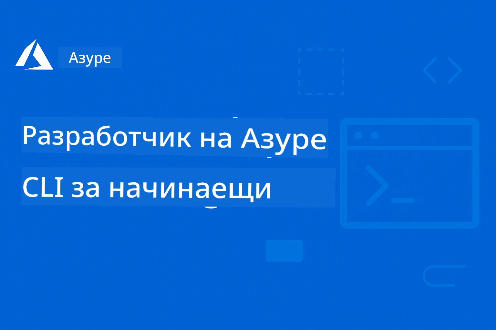

<!--
CO_OP_TRANSLATOR_METADATA:
{
  "original_hash": "068c87cc2641a81ca353ad7064ff326a",
  "translation_date": "2026-01-01T19:35:34+00:00",
  "source_file": "README.md",
  "language_code": "bg"
}
-->
# AZD за начинаещи: Структуриран учебен път

 

[](https://GitHub.com/microsoft/azd-for-beginners/watchers/)
[](https://GitHub.com/microsoft/azd-for-beginners/network/)
[](https://GitHub.com/microsoft/azd-for-beginners/stargazers/)

[](https://discord.gg/microsoft-azure)
[](https://discord.gg/nTYy5BXMWG)

## Как да започнете с този курс

Следвайте тези стъпки, за да започнете обучението си по AZD:

1. **Форкнете хранилището**: Щракнете [](https://GitHub.com/microsoft/azd-for-beginners/fork)
2. **Клонирайте хранилището**: `git clone https://github.com/microsoft/azd-for-beginners.git`
3. **Присъединете се към общността**: [Общности на Azure Discord](https://discord.com/invite/ByRwuEEgH4) за експертна подкрепа
4. **Изберете път за обучение**: Изберете глава по-долу, която отговаря на вашето ниво на опит

### Поддръжка на множество езици

#### Автоматични преводи (винаги актуални)

<!-- CO-OP TRANSLATOR LANGUAGES TABLE START -->
[Арабски](../ar/README.md) | [Бенгалски](../bn/README.md) | [Български](./README.md) | [Бирмански (Мианмар)](../my/README.md) | [Китайски (опростен)](../zh/README.md) | [Китайски (традиционен, Хонконг)](../hk/README.md) | [Китайски (традиционен, Макао)](../mo/README.md) | [Китайски (традиционен, Тайван)](../tw/README.md) | [Хърватски](../hr/README.md) | [Чешки](../cs/README.md) | [Датски](../da/README.md) | [Нидерландски](../nl/README.md) | [Естонски](../et/README.md) | [Фински](../fi/README.md) | [Френски](../fr/README.md) | [Немски](../de/README.md) | [Гръцки](../el/README.md) | [Иврит](../he/README.md) | [Хинди](../hi/README.md) | [Унгарски](../hu/README.md) | [Индонезийски](../id/README.md) | [Италиански](../it/README.md) | [Японски](../ja/README.md) | [Каннада](../kn/README.md) | [Корейски](../ko/README.md) | [Литовски](../lt/README.md) | [Малайски](../ms/README.md) | [Малаялам](../ml/README.md) | [Марати](../mr/README.md) | [Непалски](../ne/README.md) | [Нигерийски Пиджин](../pcm/README.md) | [Норвежки](../no/README.md) | [Персийски (фарси)](../fa/README.md) | [Полски](../pl/README.md) | [Португалски (Бразилия)](../br/README.md) | [Португалски (Португалия)](../pt/README.md) | [Пенджабски (Гурумухи)](../pa/README.md) | [Румънски](../ro/README.md) | [Руски](../ru/README.md) | [Сръбски (кирилица)](../sr/README.md) | [Словашки](../sk/README.md) | [Словенски](../sl/README.md) | [Испански](../es/README.md) | [Суахили](../sw/README.md) | [Шведски](../sv/README.md) | [Тагалог (Филипински)](../tl/README.md) | [Тамилски](../ta/README.md) | [Телугу](../te/README.md) | [Тайландски](../th/README.md) | [Турски](../tr/README.md) | [Украински](../uk/README.md) | [Урду](../ur/README.md) | [Виетнамски](../vi/README.md)
<!-- CO-OP TRANSLATOR LANGUAGES TABLE END -->

## Преглед на курса

Овладейте Azure Developer CLI (azd) чрез структурирани глави, проектирани за прогресивно обучение. **Специален фокус върху разгръщането на AI приложения с интеграция на Microsoft Foundry.**

### Защо този курс е важен за съвременните разработчици

На базата на прозрения от общността в Discord на Microsoft Foundry, **45% от разработчиците искат да използват AZD за AI натоварвания**, но срещат предизвикателства с:
- Сложни многослойни AI архитектури
- Най-добри практики за продукционно разгръщане на AI  
- Интеграция и конфигурация на Azure AI услуги
- Оптимизация на разходите за AI натоварвания
- Отстраняване на специфични за AI проблеми при разгръщане

### Учебни цели

С изпълнението на този структуриран курс ще:
- **Овладeете основите на AZD**: Основни концепции, инсталация и конфигурация
- **Разгръщате AI приложения**: Използвайте AZD с услуги на Microsoft Foundry
- **Прилагате инфраструктура като код**: Управлявайте Azure ресурси с Bicep шаблони
- **Отстранявате проблеми при разгръщане**: Решаване на често срещани проблеми и отстраняване на грешки
- **Оптимизирате за продукция**: Сигурност, мащабиране, мониторинг и управление на разходите
- **Създавате мулти-агентни решения**: Разгръщане на сложни AI архитектури

## 📚 Учебни глави

*Изберете пътя си за обучение въз основа на ниво на опит и цели*

### 🚀 Глава 1: Основи и бърз старт
**Предварителни изисквания**: Абонамент за Azure, основни познания с команден ред  
**Продължителност**: 30-45 минути  
**Сложност**: ⭐

#### Какво ще научите
- Разбиране на основите на Azure Developer CLI
- Инсталиране на AZD на вашата платформа
- Вашето първо успешно разгръщане

#### Ресурси за обучение
- **🎯 Започнете тук**: [Какво е Azure Developer CLI?](../..)
- **📖 Теория**: [AZD Basics](docs/getting-started/azd-basics.md) - Основни концепции и терминология
- **⚙️ Настройка**: [Installation & Setup](docs/getting-started/installation.md) - Ръководства за конкретни платформи
- **🛠️ Практическо**: [Вашият първи проект](docs/getting-started/first-project.md) - Ръководство стъпка по стъпка
- **📋 Бърз справочник**: [Шпаргалка с команди](resources/cheat-sheet.md)

#### Практически упражнения
```bash
# Бърза проверка на инсталацията
azd version

# Разположете първото си приложение
azd init --template todo-nodejs-mongo
azd up
```

**💡 Резултат от главата**: Успешно разгръщане на просто уеб приложение в Azure с помощта на AZD

**✅ Критерии за успех:**
```bash
# След като завършите Глава 1, трябва да можете:
azd version              # Показва инсталираната версия
azd init --template todo-nodejs-mongo  # Инициализира проекта
azd up                  # Разгръща в Azure
azd show                # Показва URL адреса на работещото приложение
# Приложението се отваря в браузъра и работи
azd down --force --purge  # Почиства ресурсите
```

**📊 Времеви ресурс:** 30-45 минути  
**📈 Умения след:** Може да разгръща основни приложения самостоятелно

**✅ Критерии за успех:**
```bash
# След като завършите Глава 1, ще можете:
azd version              # Показва инсталираната версия
azd init --template todo-nodejs-mongo  # Инициализира проект
azd up                  # Разгръща в Azure
azd show                # Показва URL адреса на работещото приложение
# Приложението се отваря в браузъра и работи
azd down --force --purge  # Почиства ресурсите
```

**📊 Времеви ресурс:** 30-45 минути  
**📈 Умения след:** Може да разгръща основни приложения самостоятелно

---

### 🤖 Глава 2: Разработка, насочена първо към AI (Препоръчва се за AI разработчици)
**Предварителни изисквания**: Глава 1 завършена  
**Продължителност**: 1-2 часа  
**Сложност**: ⭐⭐

#### Какво ще научите
- Интеграция на Microsoft Foundry с AZD
- Разгръщане на AI-задвижвани приложения
- Разбиране на конфигурациите на AI услуги

#### Ресурси за обучение
- **🎯 Започнете тук**: [Microsoft Foundry Integration](docs/microsoft-foundry/microsoft-foundry-integration.md)
- **📖 Патерни**: [AI Model Deployment](docs/microsoft-foundry/ai-model-deployment.md) - Разгръщане и управление на AI модели
- **🛠️ Уъркшоп**: [AI Workshop Lab](docs/microsoft-foundry/ai-workshop-lab.md) - Подгответе вашите AI решения за AZD
- **🎥 Интерактивно ръководство**: [Workshop Materials](workshop/README.md) - Обучение в браузъра с MkDocs * DevContainer Environment
- **📋 Шаблони**: [Microsoft Foundry Templates](../..)
- **📝 Примери**: [Примери за разгръщане с AZD](examples/README.md)

#### Практически упражнения
```bash
# Разположете първото си приложение с ИИ
azd init --template azure-search-openai-demo
azd up

# Опитайте допълнителни шаблони за ИИ
azd init --template openai-chat-app-quickstart
azd init --template agent-openai-python-prompty
```

**💡 Резултат от главата**: Разгръщане и конфигуриране на AI-задвижван чат приложение с RAG възможности

**✅ Критерии за успех:**
```bash
# След Глава 2, трябва да можете да:
azd init --template azure-search-openai-demo
azd up
# Тествайте интерфейса за чат с ИИ
# Задавайте въпроси и получавайте отговори от ИИ с посочени източници
# Проверете дали интеграцията на търсенето работи
azd monitor  # Проверете дали Application Insights показва телеметрия
azd down --force --purge
```

**📊 Времеви ресурс:** 1-2 часа  
**📈 Умения след:** Може да разгръща и конфигурира AI приложения, готови за продукция  
**💰 Осъзнатост за разходи:** Разбиране на $80-150/месец за разработка, $300-3500/месец за продукция

#### 💰 Финансови съображения за AI разгръщания

**Среда за разработка (оценка $80-150/месец):**
- Azure OpenAI (плащане при използване): $0-50/месец (в зависимост от употребата на токени)
- AI Search (основен план): $75/месец
- Container Apps (потребление): $0-20/месец
- Съхранение (стандартно): $1-5/месец

**Продукционна среда (оценка $300-3,500+/месец):**
- Azure OpenAI (PTU за постоянна производителност): $3,000+/месец ИЛИ плащане при използване при голям обем
- AI Search (стандартен план): $250/месец
- Container Apps (посветен): $50-100/месец
- Application Insights: $5-50/месец
- Съхранение (премиум): $10-50/месец

**💡 Съвети за оптимизация на разходите:**
- Използвайте **Free Tier** на Azure OpenAI за обучение (включени 50,000 токена/месец)
- Стартирайте `azd down`, за да деактивирате ресурси, когато не разработвате активно
- Започнете с платеж по потребление, надградете до PTU само за продукция
- Използвайте `azd provision --preview`, за да оцените разходите преди разгръщане
- Активирайте авто-скалиране: плащайте само за реалното използване

**Мониторинг на разходите:**
```bash
# Проверете прогнозните месечни разходи
azd provision --preview

# Следете реалните разходи в портала на Azure
az consumption budget list --resource-group <your-rg>
```

---

### ⚙️ Глава 3: Конфигурация и удостоверяване
**Предварителни изисквания**: Глава 1 завършена  
**Продължителност**: 45-60 минути  
**Сложност**: ⭐⭐

#### Какво ще научите
- Конфигурация и управление на среди
- Удостоверяване и най-добри практики за сигурност
- Именуване и организация на ресурси

#### Ресурси за обучение
- **📖 Конфигурация**: [Configuration Guide](docs/getting-started/configuration.md) - Настройка на среди
- **🔐 Сигурност**: [Authentication patterns and managed identity](docs/getting-started/authsecurity.md) - Патерни за удостоверяване
- **📝 Примери**: [Database App Example](examples/database-app/README.md) - Примери за бази данни с AZD

#### Практически упражнения
- Конфигурирайте множество среди (dev, staging, prod)
- Настройте удостоверяване с managed identity
- Прилагайте конфигурации специфични за средата

**💡 Резултат от главата**: Управление на множество среди с правилно удостоверяване и сигурност

---

### 🏗️ Глава 4: Инфраструктура като код и разгръщане
**Предварителни изисквания**: Глави 1-3 завършени  
**Продължителност**: 1-1.5 часа  
**Сложност**: ⭐⭐⭐

#### Какво ще научите
- Разширени модели за разгръщане
- Инфраструктура като код с Bicep
- Стратегии за предоставяне на ресурси

#### Ресурси за обучение
- **📖 Разгръщане**: [Deployment Guide](docs/deployment/deployment-guide.md) - Пълни работни потоци
- **🏗️ Предоставяне**: [Provisioning Resources](docs/deployment/provisioning.md) - Управление на Azure ресурси
- **📝 Примери**: [Container App Example](../../examples/container-app) - Разгръщане на контейнеризирани приложения

#### Практически упражнения
- Създайте персонализирани Bicep шаблони
- Разгръщайте многослойни приложения
- Прилагайте стратегии за blue-green разгръщане

**💡 Резултат от главата**: Разгръщане на сложни многослойни приложения, използвайки персонализирани шаблони за инфраструктура

---

### 🎯 Глава 5: Мулти-агентни AI решения (Разширено)
**Предварителни изисквания**: Глави 1-2 завършени  
**Продължителност**: 2-3 часа  
**Сложност**: ⭐⭐⭐⭐

#### Какво ще научите
- Патерни за мулти-агентна архитектура
- Оркестрация и координация на агенти
- Продукционно готови AI разгръщания

#### Ресурси за обучение
- **🤖 Представен проект**: [Retail Multi-Agent Solution](examples/retail-scenario.md) - Пълна реализация
- **🛠️ ARM шаблони**: [Пакет с ARM шаблони](../../examples/retail-multiagent-arm-template) - Деплой с едно щракване
- **📖 Архитектура**: [Шаблони за координация на многоагентни системи](/docs/pre-deployment/coordination-patterns.md) - Шаблони

#### Практически упражнения
```bash
# Разположете пълното многоагентно решение за търговия на дребно
cd examples/retail-multiagent-arm-template
./deploy.sh

# Проучете конфигурациите на агентите
az deployment group show --resource-group <rg-name> --name <deployment-name>
```

**💡 Резултат от главата**: Разгръщане и управление на продукционно многоагентно AI решение с агенти за Клиенти и Инвентар

---

### 🔍 Глава 6: Валидация и планиране преди внедряване
**Предпоставки**: Глава 4 завършена  
**Продължителност**: 1 час  
**Сложност**: ⭐⭐

#### Какво ще научите
- Планиране на капацитета и валидация на ресурсите
- Стратегии за избор на SKU
- Проверки преди разгръщане и автоматизация

#### Учебни ресурси
- **📊 Планиране**: [Планиране на капацитета](docs/pre-deployment/capacity-planning.md) - Валидация на ресурсите
- **💰 Избор**: [Избор на SKU](docs/pre-deployment/sku-selection.md) - Икономически ефективни решения
- **✅ Валидация**: [Проверки преди разгръщане](docs/pre-deployment/preflight-checks.md) - Автоматизирани скриптове

#### Практически упражнения
- Стартирайте скриптове за валидация на капацитета
- Оптимизирайте избора на SKU спрямо цена
- Внедрете автоматизирани проверки преди разгръщане

**💡 Резултат от главата**: Валидирайте и оптимизирайте разгръщанията преди изпълнение

---

### 🚨 Глава 7: Отстраняване на проблеми и дебъгване
**Предпоставки**: Завършена поне една глава за разгръщане  
**Продължителност**: 1-1.5 часа  
**Сложност**: ⭐⭐

#### Какво ще научите
- Систематични подходи за дебъгване
- Чести проблеми и решения
- Отстраняване на проблеми специфични за AI

#### Учебни ресурси
- **🔧 Чести проблеми**: [Чести проблеми](docs/troubleshooting/common-issues.md) - ЧЗВ и решения
- **🕵️ Дебъгване**: [Ръководство за дебъгване](docs/troubleshooting/debugging.md) - Стъпка по стъпка стратегии
- **🤖 AI проблеми**: [Отстраняване на проблеми при AI](docs/troubleshooting/ai-troubleshooting.md) - Проблеми с AI услугите

#### Практически упражнения
- Диагностицирайте неуспехи при разгръщане
- Решете проблеми с удостоверяването
- Дебъгвайте свързаността на AI услугите

**💡 Резултат от главата**: Самостоятелно диагностициране и разрешаване на често срещани проблеми при разгръщане

---

### 🏢 Глава 8: Производствени и корпоративни модели
**Предпоставки**: Глави 1-4 завършени  
**Продължителност**: 2-3 часа  
**Сложност**: ⭐⭐⭐⭐

#### Какво ще научите
- Стратегии за разгръщане в продукция
- Корпоративни модели за сигурност
- Наблюдение и оптимизация на разходите

#### Учебни ресурси
- **🏭 Производство**: [Най-добри практики за AI в продукция](docs/microsoft-foundry/production-ai-practices.md) - Корпоративни модели
- **📝 Примери**: [Пример с микросървиси](../../examples/microservices) - Комплексни архитектури
- **📊 Наблюдение**: [Интеграция с Application Insights](docs/pre-deployment/application-insights.md) - Наблюдение

#### Практически упражнения
- Внедрете корпоративни модели за сигурност
- Настройте цялостно наблюдение
- Разгърнете в продукция с подходящо управление

**💡 Резултат от главата**: Разгръщане на приложения, готови за корпоративна среда, с пълни производствени възможности

---

## 🎓 Преглед на работилницата: Практическо учебно преживяване

> **⚠️ СТАТУС НА РАБОТИЛНИЦАТА: В активно развитие**  
> Материалите на работилницата в момента се разработват и усъвършенстват. Основните модули са функционални, но някои напреднали секции са незавършени. Активно работим за завършване на цялото съдържание. [Проследете напредъка →](workshop/README.md)

### Интерактивни материали за работилницата
**Цялостно практическо обучение с инструменти в браузъра и ръководени упражнения**

Нашите материали за работилницата предоставят структуриран, интерактивен учебен опит, който допълва горепосочената учебна програма по глави. Работилницата е предназначена както за самостоятелно обучение, така и за занятия, водени от инструктор.

#### 🛠️ Характеристики на работилницата
- **Интерфейс в браузъра**: Пълна работилница, базирана на MkDocs, с функции за търсене, копиране и теми
- **Интеграция с GitHub Codespaces**: Настройка на среда за разработка с един клик
- **Структуриран учебен път**: 7-степенни ръководени упражнения (общо 3.5 часа)
- **Откриване → Разгръщане → Персонализиране**: Прогресивна методология
- **Интерактивна DevContainer среда**: Предконфигурирани инструменти и зависимости

#### 📚 Структура на работилницата
Работилницата следва методологията **Откриване → Разгръщане → Персонализиране**:

1. **Фаза на откриване** (45 мин)
   - Разгледайте шаблоните и услугите на Microsoft Foundry
   - Разберете моделите на многоагентна архитектура
   - Прегледайте изискванията за разгръщане и предпоставките

2. **Фаза на разгръщане** (2 часа)
   - Практическо разгръщане на AI приложения с AZD
   - Конфигурирайте Azure AI услуги и крайни точки
   - Внедрете модели за сигурност и удостоверяване

3. **Фаза на персонализиране** (45 мин)
   - Модифицирайте приложенията за конкретни случаи на употреба
   - Оптимизирайте за продукционно разгръщане
   - Внедрете наблюдение и управление на разходите

#### 🚀 Как да започнете с работилницата
```bash
# Опция 1: GitHub Codespaces (Препоръчително)
# Щракнете върху "Code" → "Create codespace on main" в репозиторията

# Опция 2: Локална разработка
git clone https://github.com/microsoft/azd-for-beginners.git
cd azd-for-beginners/workshop
# Следвайте инструкциите за настройка в workshop/README.md
```

#### 🎯 Учебни резултати от работилницата
Чрез завършване на работилницата участниците ще:
- **Разгръщане на AI приложения в продукция**: Използвайте AZD с услугите на Microsoft Foundry
- **Овладяване на многоагентни архитектури**: Внедрете координирани AI агентни решения
- **Внедряване на най-добри практики за сигурност**: Конфигуриране на удостоверяване и контрол на достъпа
- **Оптимизация за мащаб**: Проектирайте икономични и високопроизводителни разгръщания
- **Отстраняване на проблеми при разгръщане**: Разрешавайте често срещани проблеми самостоятелно

#### 📖 Ресурси за работилницата
- **🎥 Интерактивно ръководство**: [Материали за работилницата](workshop/README.md) - Учебна среда в браузъра
- **📋 Инструкции стъпка по стъпка**: [Ръководени упражнения](../../workshop/docs/instructions) - Подробни упътвания
- **🛠️ Лаборатория на AI работилницата**: [AI Workshop Lab](docs/microsoft-foundry/ai-workshop-lab.md) - Упражнения, фокусирани върху AI
- **💡 Бърз старт**: [Ръководство за настройка на работилницата](workshop/README.md#quick-start) - Конфигуриране на средата

**Подходящо за**: Корпоративни обучения, университетски курсове, самостоятелно обучение и интензивни курсове за разработчици.

---

## 📖 Какво е Azure Developer CLI?

Azure Developer CLI (azd) е команден интерфейс, ориентиран към разработчиците, който ускорява процеса на изграждане и разгръщане на приложения в Azure. Той предоставя:

- **Разгръщания, базирани на шаблони** - Използвайте предварително изградени шаблони за често срещани модели на приложения
- **Инфраструктура като код** - Управлявайте Azure ресурси с Bicep или Terraform  
- **Интегрирани работни потоци** - Безпроблемно осигурявайте, разгръщайте и наблюдавайте приложения
- **Приятелски за разработчици** - Оптимизиран за продуктивност и потребителски опит на разработчиците

### **AZD + Microsoft Foundry: Идеално за AI разгръщания**

**Защо AZD за AI решения?** AZD отговаря на основните предизвикателства, пред които са изправени AI разработчиците:

- **Шаблони готови за AI** - Предконфигурирани шаблони за Azure OpenAI, Cognitive Services и ML натоварвания
- **Сигурни AI разгръщания** - Вградени модели за сигурност за AI услуги, API ключове и крайни точки на модели  
- **Производствени AI модели** - Най-добри практики за мащабируеми и икономични разгръщания на AI приложения
- **Краен-до-краен AI работен поток** - От разработката на модели до продукционно разгръщане с надлежно наблюдение
- **Оптимизация на разходите** - Умно разпределение на ресурси и стратегии за скалиране за AI натоварвания
- **Интеграция с Microsoft Foundry** - Безшевна връзка с каталога на модели на Microsoft Foundry и крайни точки

---

## 🎯 Библиотека с шаблони и примери

### Представени: Шаблони на Microsoft Foundry
**Започнете тук, ако разгъръщате AI приложения!**

> **Бележка:** Тези шаблони демонстрират различни AI модели. Някои са външни Azure Samples, други са локални реализации.

| Шаблон | Глава | Сложност | Услуги | Тип |
|----------|---------|------------|----------|------|
| [**Започнете с AI чат**](https://github.com/Azure-Samples/get-started-with-ai-chat) | Глава 2 | ⭐⭐ | AzureOpenAI + Azure AI Model Inference API + Azure AI Search + Azure Container Apps + Application Insights | Външен |
| [**Започнете с AI агенти**](https://github.com/Azure-Samples/get-started-with-ai-agents) | Глава 2 | ⭐⭐ | Azure AI Agent Service + AzureOpenAI + Azure AI Search + Azure Container Apps + Application Insights| Външен |
| [**Демо: Azure Search + OpenAI**](https://github.com/Azure-Samples/azure-search-openai-demo) | Глава 2 | ⭐⭐ | AzureOpenAI + Azure AI Search + App Service + Storage | Външен |
| [**Бърз старт на OpenAI Chat App**](https://github.com/Azure-Samples/openai-chat-app-quickstart) | Глава 2 | ⭐ | AzureOpenAI + Container Apps + Application Insights | Външен |
| [**Agent OpenAI Python Prompty**](https://github.com/Azure-Samples/agent-openai-python-prompty) | Глава 5 | ⭐⭐⭐ | AzureOpenAI + Azure Functions + Prompty | Външен |
| [**Contoso Chat RAG**](https://github.com/Azure-Samples/contoso-chat) | Глава 8 | ⭐⭐⭐⭐ | AzureOpenAI + AI Search + Cosmos DB + Container Apps | Външен |
| [**Решение за търговия на дребно с много агенти**](examples/retail-scenario.md) | Глава 5 | ⭐⭐⭐⭐ | AzureOpenAI + AI Search + Storage + Container Apps + Cosmos DB | **Локален** |

### Представени: Пълни учебни сценарии
**Шаблони на приложения, готови за продукция, свързани с учебните глави**

| Шаблон | Учебна глава | Сложност | Ключово знание |
|----------|------------------|------------|--------------|
| [**openai-chat-app-quickstart**](https://github.com/Azure-Samples/openai-chat-app-quickstart) | Глава 2 | ⭐ | Основни модели за разгръщане на AI |
| [**azure-search-openai-demo**](https://github.com/Azure-Samples/azure-search-openai-demo) | Глава 2 | ⭐⭐ | RAG реализация с Azure AI Search |
| [**ai-document-processing**](https://github.com/Azure-Samples/ai-document-processing) | Глава 4 | ⭐⭐ | Интеграция с Document Intelligence |
| [**agent-openai-python-prompty**](https://github.com/Azure-Samples/agent-openai-python-prompty) | Глава 5 | ⭐⭐⭐ | Фреймуърк за агенти и извикване на функции |
| [**contoso-chat**](https://github.com/Azure-Samples/contoso-chat) | Глава 8 | ⭐⭐⭐ | Оркестрация на корпоративни AI решения |
| [**retail-multi-agent-solution**](examples/retail-scenario.md) | Глава 5 | ⭐⭐⭐⭐ | Многоагентна архитектура с агенти за Клиенти и Инвентар |

### Учене чрез примери

> **📌 Локални срещу външни примери:**  
> **Локални примери** (в това хранилище) = Готови за незабавна употреба  
> **Външни примери** (Azure Samples) = Клонирайте от свързаните хранилища

#### Локални примери (Готови за използване)
- [**Решение за търговия на дребно с много агенти**](examples/retail-scenario.md) - Пълна продукционно готова реализация с ARM шаблони
  - Многоагентна архитектура (агенти за клиенти и инвентар)
  - Изчерпателно наблюдение и оценка
  - Разгръщане с един клик чрез ARM шаблон

#### Локални примери - Контейнерни приложения (Глави 2-5)
**Изчерпателни примери за разгръщане на контейнери в това хранилище:**
- [**Примери за контейнерни приложения**](examples/container-app/README.md) - Пълно ръководство за разгръщане на контейнери
  - [Прост Flask API](../../examples/container-app/simple-flask-api) - Основно REST API със скалиране до нула
  - [Архитектура с микросървиси](../../examples/container-app/microservices) - Продукционно готово разгръщане с множество услуги
  - Бърз старт, продукция и напреднали модели на разгръщане
  - Насоки за наблюдение, сигурност и оптимизация на разходите

#### Външни примери - Прости приложения (Глави 1-2)
**Клонирайте тези Azure Samples хранилища, за да започнете:**
- [Simple Web App - Node.js + MongoDB](https://github.com/Azure-Samples/todo-nodejs-mongo) - Основни модели за разгръщане
- [Static Website - React SPA](https://github.com/Azure-Samples/todo-csharp-sql-swa-func) - Разгръщане на статично съдържание
- [Container App - Python Flask](https://github.com/Azure-Samples/container-apps-store-api-microservice) - Разгръщане на REST API

#### Външни примери - Интеграция на бази данни (Глави 3-4)  
- [Database App - C# + SQL](https://github.com/Azure-Samples/todo-csharp-sql) - Модели за свързаност с база данни
- [Functions + Cosmos DB](https://github.com/Azure-Samples/todo-python-mongo-swa-func) - Безсървърен работен поток за данни

#### Външни примери - Напреднали модели (Глави 4-8)
- [Java Microservices](https://github.com/Azure-Samples/java-microservices-aca-lab) - Многоуслужни архитектури
- [Container Apps Jobs](https://github.com/Azure-Samples/container-apps-jobs) - Фоново обработване  
- [Enterprise ML Pipeline](https://github.com/Azure-Samples/mlops-v2) - Производствени ML модели

### Външни колекции с шаблони
- [**Official AZD Template Gallery**](https://azure.github.io/awesome-azd/) - Курирана колекция от официални и общностни шаблони
- [**Azure Developer CLI Templates**](https://learn.microsoft.com/en-us/azure/developer/azure-developer-cli/azd-templates) - Документация за шаблони в Microsoft Learn
- [**Examples Directory**](examples/README.md) - Локални учебни примери с подробни обяснения

---

## 📚 Учебни ресурси и справочна информация

### Бързи справки
- [**Шпаргалка с команди**](resources/cheat-sheet.md) - Основни команди на azd, подредени по глава
- [**Глосар**](resources/glossary.md) - Терминология на Azure и azd  
- [**ЧЗВ**](resources/faq.md) - Често задавани въпроси, организирани по учебни глави
- [**Учебно ръководство**](resources/study-guide.md) - Всеобхватни практически упражнения

### Практически работилници
- [**AI лаборатория**](docs/microsoft-foundry/ai-workshop-lab.md) - Направете вашите AI решения готови за разгръщане с AZD (2-3 часа)
- [**Интерактивно ръководство за работилница**](workshop/README.md) - Базиран на браузър работилница с MkDocs и DevContainer среда
- [**Структуриран учебен път**](../../workshop/docs/instructions) -7-стъпкови ръководени упражнения (Откриване → Разгръщане → Персонализиране)
- [**Работилница AZD за начинаещи**](workshop/README.md) - Пълни материали за практическа работилница с интеграция на GitHub Codespaces

### Външни учебни ресурси
- [Документация за Azure Developer CLI](https://learn.microsoft.com/en-us/azure/developer/azure-developer-cli/)
- [Център за архитектура на Azure](https://learn.microsoft.com/en-us/azure/architecture/)
- [Калкулатор за ценообразуване на Azure](https://azure.microsoft.com/pricing/calculator/)
- [Статус на Azure](https://status.azure.com/)

---

## 🔧 Бързо ръководство за отстраняване на проблеми

**Чести проблеми, с които се сблъскват начинаещите, и бързи решения:**

### ❌ "azd: command not found"

```bash
# Инсталирайте първо AZD
# Windows (PowerShell):
winget install microsoft.azd

# macOS:
brew tap azure/azd && brew install azd

# Linux:
curl -fsSL https://aka.ms/install-azd.sh | bash

# Проверете инсталацията
azd version
```

### ❌ "No subscription found" or "Subscription not set"

```bash
# Изброяване на наличните абонаменти
az account list --output table

# Задаване на абонамент по подразбиране
az account set --subscription "<subscription-id-or-name>"

# Задаване за AZD среда
azd env set AZURE_SUBSCRIPTION_ID "<subscription-id>"

# Проверка
az account show
```

### ❌ "InsufficientQuota" or "Quota exceeded"

```bash
# Опитайте различен регион на Azure
azd env set AZURE_LOCATION "westus2"
azd up

# Или използвайте по-малки SKU-та в средата за разработка
# Редактирайте infra/main.parameters.json:
{
  "sku": "B1"  // Instead of "P1V2"
}
```

### ❌ "azd up" fails halfway through

```bash
# Опция 1: Почисти и опитай отново
azd down --force --purge
azd up

# Опция 2: Просто поправи инфраструктурата
azd provision

# Опция 3: Провери подробните логове
azd show
azd logs
```

### ❌ "Authentication failed" or "Token expired"

```bash
# Повторно удостоверяване
az logout
az login

azd auth logout
azd auth login

# Проверете удостоверяването
az account show
```

### ❌ "Resource already exists" or naming conflicts

```bash
# AZD генерира уникални имена, но ако има конфликт:
azd down --force --purge

# След това опитайте отново с нова среда
azd env new dev-v2
azd up
```

### ❌ Разгръщането на шаблона отнема твърде много време

**Обичайно време за изчакване:**
- Просто уеб приложение: 5-10 минути
- Приложение с база данни: 10-15 минути
- AI приложения: 15-25 минути (предоставянето на OpenAI е бавно)

```bash
# Проверете напредъка
azd show

# Ако сте блокирани >30 минути, проверете портала на Azure:
azd monitor
# Потърсете неуспешни разгръщания
```

### ❌ "Permission denied" or "Forbidden"

```bash
# Проверете ролята си в Azure
az role assignment list --assignee $(az account show --query user.name -o tsv)

# Трябва ви поне роля "Contributor"
# Помолете вашия администратор на Azure да предостави:
# - Contributor (за ресурси)
# - User Access Administrator (за присвояване на роли)
```

### ❌ Не може да се намери URL на разположеното приложение

```bash
# Покажи всички крайни точки на услугите
azd show

# Или отвори портала на Azure
azd monitor

# Провери конкретна услуга
azd env get-values
# Търси променливите *_URL
```

### 📚 Пълни ресурси за отстраняване на проблеми

- **Ръководство за често срещани проблеми:** [Подробни решения](docs/troubleshooting/common-issues.md)
- **Проблеми, специфични за AI:** [Отстраняване на проблеми с AI](docs/troubleshooting/ai-troubleshooting.md)
- **Ръководство за отстраняване на грешки:** [Стъпка по стъпка отстраняване на грешки](docs/troubleshooting/debugging.md)
- **Получете помощ:** [Azure Discord](https://discord.gg/microsoft-azure) #azure-developer-cli

---

## 🔧 Бързо ръководство за отстраняване на проблеми

**Чести проблеми, с които се сблъскват начинаещите, и бързи решения:**

<details>
<summary><strong>❌ "azd: command not found"</strong></summary>

```bash
# Първо инсталирайте AZD
# Windows (PowerShell):
winget install microsoft.azd

# macOS:
brew tap azure/azd && brew install azd

# Linux:
curl -fsSL https://aka.ms/install-azd.sh | bash

# Проверете инсталацията
azd version
```
</details>

<details>
<summary><strong>❌ "No subscription found" or "Subscription not set"</strong></summary>

```bash
# Избройте наличните абонаменти
az account list --output table

# Задайте абонамент по подразбиране
az account set --subscription "<subscription-id-or-name>"

# Настройте за AZD среда
azd env set AZURE_SUBSCRIPTION_ID "<subscription-id>"

# Проверете
az account show
```
</details>

<details>
<summary><strong>❌ "InsufficientQuota" or "Quota exceeded"</strong></summary>

```bash
# Опитайте друг регион на Azure
azd env set AZURE_LOCATION "westus2"
azd up

# Или използвайте по-малки SKU-та при разработка
# Редактирайте infra/main.parameters.json:
{
  "sku": "B1"  // Instead of "P1V2"
}
```
</details>

<details>
<summary><strong>❌ "azd up" fails halfway through</strong></summary>

```bash
# Опция 1: Изчисти и опитай отново
azd down --force --purge
azd up

# Опция 2: Просто поправи инфраструктурата
azd provision

# Опция 3: Провери подробните логове
azd show
azd logs
```
</details>

<details>
<summary><strong>❌ "Authentication failed" or "Token expired"</strong></summary>

```bash
# Повторно удостоверяване
az logout
az login

azd auth logout
azd auth login

# Проверете удостоверяването
az account show
```
</details>

<details>
<summary><strong>❌ "Resource already exists" or naming conflicts</strong></summary>

```bash
# AZD генерира уникални имена, но ако има конфликт:
azd down --force --purge

# След това опитайте отново с нова среда
azd env new dev-v2
azd up
```
</details>

<details>
<summary><strong>❌ Разгръщането на шаблона отнема твърде много време</strong></summary>

**Обичайно време за изчакване:**
- Просто уеб приложение: 5-10 минути
- Приложение с база данни: 10-15 минути
- AI приложения: 15-25 минути (предоставянето на OpenAI е бавно)

```bash
# Проверете напредъка
azd show

# Ако сте заседнали повече от 30 минути, проверете Azure портала:
azd monitor
# Потърсете неуспешни разгръщания
```
</details>

<details>
<summary><strong>❌ "Permission denied" or "Forbidden"</strong></summary>

```bash
# Проверете ролята си в Azure
az role assignment list --assignee $(az account show --query user.name -o tsv)

# Трябва да имате поне ролята "Contributor"
# Помолете вашия администратор на Azure да предостави:
# - Contributor (за ресурси)
# - User Access Administrator (за назначаване на роли)
```
</details>

<details>
<summary><strong>❌ Не може да се намери URL на разположеното приложение</strong></summary>

```bash
# Покажи всички крайни точки на услугите
azd show

# Или отвори Azure портала
azd monitor

# Провери конкретна услуга
azd env get-values
# Търси променливи *_URL
```
</details>

### 📚 Пълни ресурси за отстраняване на проблеми

- **Ръководство за често срещани проблеми:** [Подробни решения](docs/troubleshooting/common-issues.md)
- **Проблеми, специфични за AI:** [Отстраняване на проблеми с AI](docs/troubleshooting/ai-troubleshooting.md)
- **Ръководство за отстраняване на грешки:** [Стъпка по стъпка отстраняване на грешки](docs/troubleshooting/debugging.md)
- **Получете помощ:** [Azure Discord](https://discord.gg/microsoft-azure) #azure-developer-cli

---

## 🎓 Завършване на курса и сертификация

### Проследяване на напредъка
Следете напредъка си в ученето за всяка глава:

- [ ] **Глава 1**: Основи и бърз старт ✅
- [ ] **Глава 2**: AI-първо разработване ✅  
- [ ] **Глава 3**: Конфигурация и удостоверяване ✅
- [ ] **Глава 4**: Инфраструктура като код и разгръщане ✅
- [ ] **Глава 5**: Многоагентни AI решения ✅
- [ ] **Глава 6**: Валидация и планиране преди разгръщане ✅
- [ ] **Глава 7**: Отстраняване на проблеми и дебъгване ✅
- [ ] **Глава 8**: Производство и корпоративни модели ✅

### Проверка на знанията
След като завършите всяка глава, проверете знанията си чрез:
1. **Практическо упражнение**: Завършете практическото разгръщане от главата
2. **Проверка на знанията**: Прегледайте секцията с ЧЗВ за вашата глава
3. **Обсъждане в общността**: Споделете опита си в Azure Discord
4. **Следваща глава**: Продължете към следващото ниво на сложност

### Ползи от завършване на курса
След като завършите всички глави, ще имате:
- **Практически опит в продукция**: Разположили реални AI приложения в Azure
- **Професионални умения**: Възможности за разгръщане, подходящи за корпоративна среда  
- **Признание в общността**: Активен член на общността на разработчици за Azure
- **Професионално развитие**: Търсени умения в AZD и разгръщане на AI

---

## 🤝 Общност и поддръжка

### Получаване на помощ и поддръжка
- **Технически проблеми**: [Докладване на бъгове и искане на функции](https://github.com/microsoft/azd-for-beginners/issues)
- **Въпроси за обучение**: [Общност на Microsoft Azure в Discord](https://discord.gg/microsoft-azure) and [](https://discord.gg/nTYy5BXMWG)
- **Помощ, специфична за AI**: Присъединете се към [](https://discord.gg/nTYy5BXMWG)
- **Документация**: [Официална документация за Azure Developer CLI](https://learn.microsoft.com/en-us/azure/developer/azure-developer-cli/)

### Информация от общността от Microsoft Foundry Discord

**Последни резултати от анкетата в канала #Azure:**
- **45%** от разработчиците искат да използват AZD за AI натоварвания
- **Основни предизвикателства**: Разгръщане на многослужбени системи, управление на идентификационни данни, готовност за продукция  
- **Най-често заявяванo**: Шаблони, специфични за AI, ръководства за отстраняване на проблеми, добри практики

**Присъединете се към нашата общност, за да:**
- Споделяйте своя опит с AZD + AI и получавайте помощ
- Достъп до ранни предварителни версии на нови AI шаблони
- Приноси към най-добрите практики за разгръщане на AI
- Влияйте върху бъдещото развитие на функции за AI + AZD

### Принос към курса
Добре дошли са приноси! Моля, прочетете нашето [Ръководство за приноси](CONTRIBUTING.md) за подробности относно:
- **Подобрения на съдържанието**: Подобряване на съществуващите глави и примери
- **Нови примери**: Добавяне на реални сценарии и шаблони  
- **Превод**: Помогнете за поддържане на многоезична поддръжка
- **Доклади за грешки**: Подобряване на точността и яснота
- **Стандарти на общността**: Следвайте нашите включващи указания за общността

---

## 📄 Информация за курса

### Лиценз
Този проект е лицензиран под MIT лиценза - вижте файла [LICENSE](../../LICENSE) за подробности.

### Свързани учебни ресурси на Microsoft

Нашият екип произвежда и други изчерпателни учебни курсове:

<!-- CO-OP TRANSLATOR OTHER COURSES START -->
### LangChain
[](https://aka.ms/langchain4j-for-beginners)
[](https://aka.ms/langchainjs-for-beginners?WT.mc_id=m365-94501-dwahlin)

---

### Azure / Edge / MCP / Агенти
[](https://github.com/microsoft/AZD-for-beginners?WT.mc_id=academic-105485-koreyst)
[](https://github.com/microsoft/edgeai-for-beginners?WT.mc_id=academic-105485-koreyst)
[](https://github.com/microsoft/mcp-for-beginners?WT.mc_id=academic-105485-koreyst)
[](https://github.com/microsoft/ai-agents-for-beginners?WT.mc_id=academic-105485-koreyst)

---
 
### Серия за генеративен AI
[](https://github.com/microsoft/generative-ai-for-beginners?WT.mc_id=academic-105485-koreyst)
[-9333EA?style=for-the-badge&labelColor=E5E7EB&color=9333EA)](https://github.com/microsoft/Generative-AI-for-beginners-dotnet?WT.mc_id=academic-105485-koreyst)
[-C084FC?style=for-the-badge&labelColor=E5E7EB&color=C084FC)](https://github.com/microsoft/generative-ai-for-beginners-java?WT.mc_id=academic-105485-koreyst)
[-E879F9?style=for-the-badge&labelColor=E5E7EB&color=E879F9)](https://github.com/microsoft/generative-ai-with-javascript?WT.mc_id=academic-105485-koreyst)

---
 
### Основно обучение
[](https://aka.ms/ml-beginners?WT.mc_id=academic-105485-koreyst)
[](https://aka.ms/datascience-beginners?WT.mc_id=academic-105485-koreyst)
[](https://aka.ms/ai-beginners?WT.mc_id=academic-105485-koreyst)
[](https://github.com/microsoft/Security-101?WT.mc_id=academic-96948-sayoung)
[](https://aka.ms/webdev-beginners?WT.mc_id=academic-105485-koreyst)
[](https://aka.ms/iot-beginners?WT.mc_id=academic-105485-koreyst)
[](https://github.com/microsoft/xr-development-for-beginners?WT.mc_id=academic-105485-koreyst)

---
 
### Серия Copilot
[](https://aka.ms/GitHubCopilotAI?WT.mc_id=academic-105485-koreyst)
[](https://github.com/microsoft/mastering-github-copilot-for-dotnet-csharp-developers?WT.mc_id=academic-105485-koreyst)
[](https://github.com/microsoft/CopilotAdventures?WT.mc_id=academic-105485-koreyst)
<!-- CO-OP TRANSLATOR OTHER COURSES END -->

---

## 🗺️ Навигация в курса

**🚀 Готови да започнете да учите?**

**Начинаещи**: Започнете с [Глава 1: Основи и бърз старт](../..)  
**Разработчици на ИИ**: Преминете към [Глава 2: Разработка, ориентирана към ИИ](../..)  
**Опитни разработчици**: Започнете с [Глава 3: Конфигурация и удостоверяване](../..)

**Следващи стъпки**: [Започнете Глава 1 - Основи на AZD](docs/getting-started/azd-basics.md) →

---

<!-- CO-OP TRANSLATOR DISCLAIMER START -->
Отказ от отговорност:
Този документ е преведен с помощта на AI преводаческа услуга [Co-op Translator](https://github.com/Azure/co-op-translator). Въпреки че се стремим към точност, имайте предвид, че автоматичните преводи могат да съдържат грешки или неточности. Оригиналният документ на езика, на който е написан, трябва да се счита за авторитетен източник. За критична информация препоръчваме професионален превод, извършен от човешки преводач. Не носим отговорност за каквито и да е недоразумения или погрешни тълкувания, произтичащи от използването на този превод.
<!-- CO-OP TRANSLATOR DISCLAIMER END -->