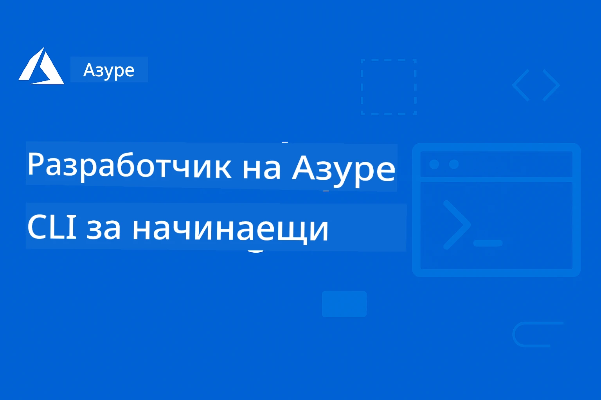

# AZD за начинаещи: Структуриран учебен път

 

[](https://GitHub.com/microsoft/azd-for-beginners/watchers/)
[](https://GitHub.com/microsoft/azd-for-beginners/network/)
[](https://GitHub.com/microsoft/azd-for-beginners/stargazers/)

[](https://discord.gg/microsoft-azure)
[](https://discord.gg/nTYy5BXMWG)

---

### Автоматични преводи (винаги актуални)

<!-- CO-OP TRANSLATOR LANGUAGES TABLE START -->
[Арабски](../ar/README.md) | [Бенгалски](../bn/README.md) | [Български](./README.md) | [Бирмански (Мианмар)](../my/README.md) | [Китайски (опростен)](../zh-CN/README.md) | [Китайски (традиционен, Хонконг)](../zh-HK/README.md) | [Китайски (традиционен, Макао)](../zh-MO/README.md) | [Китайски (традиционен, Тайван)](../zh-TW/README.md) | [Хърватски](../hr/README.md) | [Чешки](../cs/README.md) | [Датски](../da/README.md) | [Нидерландски](../nl/README.md) | [Естонски](../et/README.md) | [Фински](../fi/README.md) | [Френски](../fr/README.md) | [Немски](../de/README.md) | [Гръцки](../el/README.md) | [Иврит](../he/README.md) | [Хинди](../hi/README.md) | [Унгарски](../hu/README.md) | [Индонезийски](../id/README.md) | [Италиански](../it/README.md) | [Японски](../ja/README.md) | [Каннада](../kn/README.md) | [Корейски](../ko/README.md) | [Литовски](../lt/README.md) | [Малайски](../ms/README.md) | [Малаялам](../ml/README.md) | [Маратхи](../mr/README.md) | [Непалски](../ne/README.md) | [Нигерийски пиджин](../pcm/README.md) | [Норвежки](../no/README.md) | [Персийски (фарси)](../fa/README.md) | [Полски](../pl/README.md) | [Португалски (Бразилия)](../pt-BR/README.md) | [Португалски (Португалия)](../pt-PT/README.md) | [Пунджаби (Гурмукхи)](../pa/README.md) | [Румънски](../ro/README.md) | [Руски](../ru/README.md) | [Сръбски (кирилица)](../sr/README.md) | [Словацки](../sk/README.md) | [Словенски](../sl/README.md) | [Испански](../es/README.md) | [Суахили](../sw/README.md) | [Шведски](../sv/README.md) | [Тагалог (Филипински)](../tl/README.md) | [Тамилски](../ta/README.md) | [Телугу](../te/README.md) | [Тайландски](../th/README.md) | [Турски](../tr/README.md) | [Украински](../uk/README.md) | [Урду](../ur/README.md) | [Виетнамски](../vi/README.md)

> **Предпочитате да клонирате локално?**
>
> Това хранилище включва 50+ езикови превода, което значително увеличава размера на свалянето. За да клонирате без преводите, използвайте sparse checkout:
>
> **Bash / macOS / Linux:**
> ```bash
> git clone --filter=blob:none --sparse https://github.com/microsoft/AZD-for-beginners.git
> cd AZD-for-beginners
> git sparse-checkout set --no-cone '/*' '!translations' '!translated_images'
> ```
>
> **CMD (Windows):**
> ```cmd
> git clone --filter=blob:none --sparse https://github.com/microsoft/AZD-for-beginners.git
> cd AZD-for-beginners
> git sparse-checkout set --no-cone "/*" "!translations" "!translated_images"
> ```
>
> Това ви дава всичко необходимо, за да завършите курса с много по-бързо изтегляне.
<!-- CO-OP TRANSLATOR LANGUAGES TABLE END -->

## 🆕 Какво ново в azd днес

Azure Developer CLI се разшири отвъд традиционните уеб приложения и API. Днес azd е единственият инструмент за разгръщане на всяко приложение в Azure — включително приложения с AI и интелигентни агенти.

Ето какво означава това за вас:

- **AI агентите вече са първокласни натоварвания в azd.** Можете да инициализирате, разполагате и управлявате проекти с AI агенти, използвайки същия работен поток `azd init` → `azd up`, който вече познавате.
- **Интеграцията с Microsoft Foundry** добавя разгръщане на модели, хостване на агенти и конфигуриране на AI услуги директно в екосистемата на azd шаблоните.
- **Основният работен процес не се е променил.** Независимо дали разполагате todo приложение, микросървис или мултиагентно AI решение, командите са същите.

Ако сте използвали azd преди, поддръжката на AI е естествено разширение — не отделен инструмент или напреднал модул. Ако започвате от нулата, ще научите един работен поток, който работи за всичко.

---

## 🚀 Какво е Azure Developer CLI (azd)?

**Azure Developer CLI (azd)** е удобен за разработчици команден инструмент, който улеснява разгръщането на приложения в Azure. Вместо да създавате и свързвате ръчно десетки Azure ресурси, можете да разположите цели приложения с една команда.

### Магията на `azd up`

```bash
# Тази една команда върши всичко:
# ✅ Създава всички ресурси в Azure
# ✅ Конфигурира мрежата и сигурността
# ✅ Компилира кода на приложението ви
# ✅ Деплойва в Azure
# ✅ Дава ви работещ URL адрес
azd up
```

**Това е всичко!** Никакви кликове в Azure портала, никакви сложни ARM шаблони за изучаване първо, никаква ръчна конфигурация — само работещи приложения в Azure.

---

## ❓ Azure Developer CLI срещу Azure CLI: Каква е разликата?

Това е най-често задаваният въпрос от начинаещите. Ето простият отговор:

| Функция | **Azure CLI (`az`)** | **Azure Developer CLI (`azd`)** |
|---------|---------------------|--------------------------------|
| **Цел** | Управление на отделни Azure ресурси | Разгръщане на цели приложения |
| **Подход** | С фокус върху инфраструктурата | С фокус върху приложението |
| **Пример** | `az webapp create --name myapp...` | `azd up` |
| **Крива на обучение** | Трябва да познавате услугите на Azure | Достатъчно е да знаете приложението си |
| **Подходящо за** | DevOps, инфраструктура | Разработчици, прототипиране |

### Просто сравнение

- **Azure CLI** е като да имате всички инструменти за строеж на къща - чукове, триони, пирони. Можете да построите всичко, но трябва да знаете как да го направите.
- **Azure Developer CLI** е като да наемете изпълнител - описвате какво искате и той поема изграждането.

### Кога да използвате кой

| Сценарий | Използвайте това |
|----------|----------|
| "Искам бързо да разположа уеб приложението си" | `azd up` |
| "Трябва ми само да създам storage акаунт" | `az storage account create` |
| "Изграждам пълно AI приложение" | `azd init --template azure-search-openai-demo` |
| "Трябва да отстраня проблем в конкретен Azure ресурс" | `az resource show` |
| "Искам продукционно разгръщане за минути" | `azd up --environment production` |

### Работят заедно!

AZD използва Azure CLI под капака. Можете да използвате и двата:
```bash
# Публикувайте приложението си с AZD
azd up

# След това настройте конкретни ресурси с Azure CLI
az webapp config set --name myapp --always-on true
```

---

## 🌟 Намерете шаблони в Awesome AZD

Не започвайте от нулата! **Awesome AZD** е обществена колекция от готови за разгръщане шаблони:

| Ресурс | Описание |
|----------|-------------|
| 🔗 [**Галерия Awesome AZD**](https://azure.github.io/awesome-azd/) | Разгледайте над 200 шаблона с възможност за внедряване с едно кликване |
| 🔗 [**Изпратете шаблон**](https://github.com/Azure/awesome-azd/issues) | Допринесете със свой шаблон към общността |
| 🔗 [**GitHub репозитория**](https://github.com/Azure/awesome-azd) | Дайте звезда и разгледайте изходния код |

### Популярни AI шаблони от Awesome AZD

```bash
# RAG чат с Microsoft Foundry модели + AI търсене
azd init --template azure-search-openai-demo

# Бързо AI чат приложение
azd init --template openai-chat-app-quickstart

# AI агенти с Foundry агенти
azd init --template get-started-with-ai-agents
```

---

## 🎯 Започнете в 3 стъпки

### Стъпка 1: Инсталирайте AZD (2 минути)

**Windows:**
```powershell
winget install microsoft.azd
```

**macOS:**
```bash
brew tap azure/azd && brew install azd
```

**Linux:**
```bash
curl -fsSL https://aka.ms/install-azd.sh | bash
```

### Стъпка 2: Вход в Azure

```bash
azd auth login
```

### Стъпка 3: Разположете първото си приложение

```bash
# Инициализиране от шаблон
azd init --template todo-nodejs-mongo

# Деплой на Azure (създава всичко!)
azd up
```

**🎉 Готово!** Вашето приложение вече е активно в Azure.

### Почистване (не забравяйте!)

```bash
# Remove all resources when done experimenting
azd down --force --purge
```

---

## 📚 Как да използвате този курс

Този курс е проектиран за **постепенно обучение** - започнете от мястото, където се чувствате уверени, и напредвайте:

| Вашият опит | Започнете тук |
|-----------------|------------|
| **Напълно нов в Azure** | [Глава 1: Основи](#-chapter-1-foundation--quick-start) |
| **Познат с Azure, нов в AZD** | [Глава 1: Основи](#-chapter-1-foundation--quick-start) |
| **Искате да разположите AI приложения** | [Глава 2: AI-първо разработване](#-chapter-2-ai-first-development-recommended-for-ai-developers) |
| **Искате практическа работа** | [🎓 Интерктивен работен семинар](workshop/README.md) - 3-4 часa ръководен лабораторен модул |
| **Нуждаете се от продукционни модели** | [Глава 8: Продукция & Предприятие](#-chapter-8-production--enterprise-patterns) |

### Бърза настройка

1. **Форкнете това хранилище**: [](https://GitHub.com/microsoft/azd-for-beginners/fork)
2. **Клонирайте го**: `git clone https://github.com/YOUR-USERNAME/azd-for-beginners.git`
3. **Получете помощ**: [Общност на Azure в Discord](https://discord.com/invite/ByRwuEEgH4)

> **Предпочитате да клонирате локално?**

> Това хранилище включва 50+ езикови превода, което значително увеличава размера на свалянето. За да клонирате без преводите, използвайте sparse checkout:
> ```bash
> git clone --filter=blob:none --sparse https://github.com/microsoft/AZD-for-beginners.git
> cd AZD-for-beginners
> git sparse-checkout set --no-cone '/*' '!translations' '!translated_images'
> ```
> Това ви дава всичко необходимо, за да завършите курса с много по-бързо изтегляне.


## Преглед на курса

Усъвършенствайте Azure Developer CLI (azd) чрез структурирани глави, предназначени за постепенно обучение. **Специален фокус върху разгръщането на AI приложения с интеграция на Microsoft Foundry.**

### Защо този курс е важен за съвременните разработчици

Според прозрения от общността в Discord на Microsoft Foundry, **45% от разработчиците искат да използват AZD за AI натоварвания**, но срещат предизвикателства с:
- Сложни AI архитектури с множество услуги
- Практики за продукционно разгръщане на AI  
- Интеграция и конфигурация на Azure AI услуги
- Оптимизация на разходите за AI натоварвания
- Отстраняване на специфични за AI проблеми при разгръщане

### Учебни цели

Като завършите този структуриран курс, вие ще:
- **Овладеете основите на AZD**: Основни концепции, инсталация и конфигурация
- **Разположите AI приложения**: Използвайте AZD с Microsoft Foundry услуги
- **Прилагате Infrastructure as Code**: Управление на Azure ресурси с Bicep шаблони
- **Отстраняване на проблеми при разгръщане**: Разрешаване на често срещани проблеми и дебъгване
- **Оптимизирате за продукция**: Сигурност, мащабиране, мониторинг и управление на разходите
- **Сградите мултиагентни решения**: Разполагане на сложни AI архитектури

## 🗺️ Карта на курса: Бърза навигация по глави

Всяка глава има отделен README с учебни цели, бързи старти и упражнения:

| Глава | Тема | Уроци | Продължителност | Сложност |
|---------|-------|---------|----------|------------|
| **[Ch 1: Foundation](docs/chapter-01-foundation/README.md)** | Първи стъпки | [AZD Basics](docs/chapter-01-foundation/azd-basics.md) &#124; [Installation](docs/chapter-01-foundation/installation.md) &#124; [First Project](docs/chapter-01-foundation/first-project.md) | 30-45 мин | ⭐ |
| **[Гл. 2: Разработка, ориентирана към AI](docs/chapter-02-ai-development/README.md)** | AI-първи приложения | [Интеграция с Foundry](docs/chapter-02-ai-development/microsoft-foundry-integration.md) &#124; [AI агенти](docs/chapter-02-ai-development/agents.md) &#124; [Разгръщане на модели](docs/chapter-02-ai-development/ai-model-deployment.md) &#124; [Работилница](docs/chapter-02-ai-development/ai-workshop-lab.md) | 1-2 ч | ⭐⭐ |
| **[Гл. 3: Конфигурация](docs/chapter-03-configuration/README.md)** | Удостоверяване и сигурност | [Ръководство за конфигурация](docs/chapter-03-configuration/configuration.md) &#124; [Удостоверяване и сигурност](docs/chapter-03-configuration/authsecurity.md) | 45-60 мин | ⭐⭐ |
| **[Гл. 4: Инфраструктура](docs/chapter-04-infrastructure/README.md)** | IaC и разгръщане | [Ръководство за разгръщане](docs/chapter-04-infrastructure/deployment-guide.md) &#124; [Провизиране](docs/chapter-04-infrastructure/provisioning.md) | 1-1.5 ч | ⭐⭐⭐ |
| **[Гл. 5: Многоагентни](docs/chapter-05-multi-agent/README.md)** | Решения с AI агенти | [Сценарий за търговия на дребно](examples/retail-scenario.md) &#124; [Модели за координация](docs/chapter-06-pre-deployment/coordination-patterns.md) | 2-3 ч | ⭐⭐⭐⭐ |
| **[Гл. 6: Преди разгръщане](docs/chapter-06-pre-deployment/README.md)** | Планиране и валидиране | [Предварителни проверки](docs/chapter-06-pre-deployment/preflight-checks.md) &#124; [Планиране на капацитета](docs/chapter-06-pre-deployment/capacity-planning.md) &#124; [Избор на SKU](docs/chapter-06-pre-deployment/sku-selection.md) &#124; [App Insights](docs/chapter-06-pre-deployment/application-insights.md) | 1 ч | ⭐⭐ |
| **[Гл. 7: Отстраняване на неизправности](docs/chapter-07-troubleshooting/README.md)** | Отстраняване на грешки и дебъгване | [Чести проблеми](docs/chapter-07-troubleshooting/common-issues.md) &#124; [Дебъгване](docs/chapter-07-troubleshooting/debugging.md) &#124; [AI проблеми](docs/chapter-07-troubleshooting/ai-troubleshooting.md) | 1-1.5 ч | ⭐⭐ |
| **[Гл. 8: Производство](docs/chapter-08-production/README.md)** | Корпоративни модели | [Практики за продукция](docs/chapter-08-production/production-ai-practices.md) | 2-3 ч | ⭐⭐⭐⭐ |
| **[🎓 Работилница](workshop/README.md)** | Практическа лаборатория | [Въведение](workshop/docs/instructions/0-Introduction.md) &#124; [Избор](workshop/docs/instructions/1-Select-AI-Template.md) &#124; [Валидиране](workshop/docs/instructions/2-Validate-AI-Template.md) &#124; [Деконструкция](workshop/docs/instructions/3-Deconstruct-AI-Template.md) &#124; [Конфигурация](workshop/docs/instructions/4-Configure-AI-Template.md) &#124; [Персонализиране](workshop/docs/instructions/5-Customize-AI-Template.md) &#124; [Разрушаване](workshop/docs/instructions/6-Teardown-Infrastructure.md) &#124; [Заключване](workshop/docs/instructions/7-Wrap-up.md) | 3-4 ч | ⭐⭐ |

**Общо време на курса:** ~10-14 часа | **Напредък в уменията:** Начинаещ → Готов за продукция

---

## 📚 Раздели за учене

*Изберете път за учене според нивото на опит и целите*

### 🚀 Глава 1: Основи и бърз старт
**Предварителни изисквания**: Абонамент за Azure, основни познания за командния ред  
**Продължителност**: 30-45 минути  
**Сложност**: ⭐

#### Какво ще научите
- Основи на Azure Developer CLI
- Инсталиране на AZD на вашата платформа
- Вашето първо успешно разгръщане

#### Ресурси за учене
- **🎯 Започнете тук**: [Какво е Azure Developer CLI?](#what-is-azure-developer-cli)
- **📖 Теория**: [AZD Basics](docs/chapter-01-foundation/azd-basics.md) - Основни концепции и терминология
- **⚙️ Настройка**: [Installation & Setup](docs/chapter-01-foundation/installation.md) - Ръководства за конкретни платформи
- **🛠️ Практика**: [Вашият първи проект](docs/chapter-01-foundation/first-project.md) - Пошагово ръководство
- **📋 Бърза справка**: [Command Cheat Sheet](resources/cheat-sheet.md)

#### Практически упражнения
```bash
# Бърза проверка на инсталацията
azd version

# Разположете първото си приложение
azd init --template todo-nodejs-mongo
azd up
```

**💡 Резултат от главата**: Успешно разположете просто уеб приложение в Azure с помощта на AZD

**✅ Проверка за успех:**
```bash
# След като завършите Глава 1, трябва да можете да:
azd version              # Показва инсталираната версия
azd init --template todo-nodejs-mongo  # Инициализира проект
azd up                  # Разгръща в Azure
azd show                # Показва URL на работещото приложение
# Приложението се отваря в браузъра и работи
azd down --force --purge  # Почиства ресурсите
```

**📊 Необходимо време:** 30-45 минути  
**📈 Ниво на умения след:** Може самостоятелно да разгръща базови приложения
**📈 Ниво на умения след:** Може самостоятелно да разгръща базови приложения

---

### 🤖 Глава 2: Разработка, ориентирана към AI (Препоръчано за AI разработчици)
**Предварителни изисквания**: Глава 1 завършена  
**Продължителност**: 1-2 часа  
**Сложност**: ⭐⭐

#### Какво ще научите
- Интеграция на Microsoft Foundry с AZD
- Разгръщане на приложения с AI функционалности
- Разбиране на конфигурациите на AI услугите

#### Ресурси за учене
- **🎯 Започнете тук**: [Microsoft Foundry Integration](docs/chapter-02-ai-development/microsoft-foundry-integration.md)
- **🤖 AI агенти**: [Ръководство за AI агенти](docs/chapter-02-ai-development/agents.md) - Разгръщане на интелигентни агенти с AZD
- **📖 Патерни**: [AI Model Deployment](docs/chapter-02-ai-development/ai-model-deployment.md) - Разгръщане и управление на AI модели
- **🛠️ Работилница**: [AI Workshop Lab](docs/chapter-02-ai-development/ai-workshop-lab.md) - Направете вашите AI решения готови за AZD
- **🎥 Интерактивно ръководство**: [Workshop Materials](workshop/README.md) - Обучение в браузър с MkDocs * DevContainer среда
- **📋 Шаблони**: [Microsoft Foundry Templates](#задълбочен-преглед-възможности-на-azd)
- **📝 Примери**: [AZD Deployment Examples](examples/README.md)

#### Практически упражнения
```bash
# Разположете първото си AI приложение
azd init --template azure-search-openai-demo
azd up

# Изпробвайте допълнителни AI шаблони
azd init --template openai-chat-app-quickstart
azd init --template agent-openai-python-prompty
```

**💡 Резултат от главата**: Разположете и конфигурирайте чат приложение с AI и възможности за RAG

**✅ Проверка за успех:**
```bash
# След Глава 2 трябва да можете да:
azd init --template azure-search-openai-demo
azd up
# Тествайте интерфейса за чат с изкуствен интелект
# Задавайте въпроси и получавайте отговори, генерирани от изкуствен интелект, с източници
# Проверете дали интеграцията за търсене работи
azd monitor  # Проверете дали Application Insights показва телеметрия
azd down --force --purge
```

**📊 Необходимо време:** 1-2 часа  
**📈 Ниво на умения след:** Може да разгръща и конфигурира готови за продукция AI приложения  
**💰 Осъзнаване на разходите:** Разберете разработвателните разходи $80-150/месец, разходите за продукция $300-3500/месец

#### 💰 Разглеждане на разходите за AI разгръщания

**Среда за разработка (Оценено $80-150/месец):**
- Microsoft Foundry Models (плащане според използването): $0-50/месец (въз основа на използване на токени)
- AI Search (базово ниво): $75/месец
- Container Apps (консумация): $0-20/месец
- Съхранение (стандартно): $1-5/месец

**Производствена среда (Оценено $300-3,500+/месец):**
- Microsoft Foundry Models (PTU за стабилна производителност): $3,000+/месец ИЛИ плащане според използването при голям обем
- AI Search (стандартно ниво): $250/месец
- Container Apps (dedicated): $50-100/месец
- Application Insights: $5-50/месец
- Съхранение (премиум): $10-50/месец

**💡 Съвети за оптимизиране на разходите:**
- Използвайте **безплатния слой** Microsoft Foundry Models за обучение (Azure OpenAI 50,000 токена/месец включени)
- Стартирайте `azd down`, за да освободите ресурси, когато не разработвате активно
- Започнете с таксуване на база консумация, надстройте до PTU само за продукция
- Използвайте `azd provision --preview`, за да оцените разходите преди разгръщане
- Позволете авто-скалиране: плащате само за реалната употреба

**Мониторинг на разходите:**
```bash
# Проверете оценените месечни разходи
azd provision --preview

# Следете реалните разходи в портала на Azure
az consumption budget list --resource-group <your-rg>
```

---

### ⚙️ Глава 3: Конфигурация и удостоверяване
**Предварителни изисквания**: Глава 1 завършена  
**Продължителност**: 45-60 минути  
**Сложност**: ⭐⭐

#### Какво ще научите
- Конфигурация и управление на среди
- Удостоверяване и най-добри практики за сигурност
- Именуване и организация на ресурси

#### Ресурси за учене
- **📖 Конфигурация**: [Configuration Guide](docs/chapter-03-configuration/configuration.md) - Настройка на среди
- **🔐 Сигурност**: [Authentication patterns and managed identity](docs/chapter-03-configuration/authsecurity.md) - Патерни за удостоверяване
- **📝 Примери**: [Database App Example](examples/database-app/README.md) - AZD примери с бази данни

#### Практически упражнения
- Конфигурирайте множество среди (dev, staging, prod)
- Настройте удостоверяване с управлявана идентичност
- Реализирайте конфигурации специфични за средата

**💡 Резултат от главата**: Управлявайте множество среди с правилно удостоверяване и сигурност

---

### 🏗️ Глава 4: Инфраструктура като код и разгръщане
**Предварителни изисквания**: Глави 1-3 завършени  
**Продължителност**: 1-1.5 часа  
**Сложност**: ⭐⭐⭐

#### Какво ще научите
- Разширени модели за разгръщане
- Инфраструктура като код с Bicep
- Стратегии за провизиране на ресурси

#### Ресурси за учене
- **📖 Разгръщане**: [Deployment Guide](docs/chapter-04-infrastructure/deployment-guide.md) - Пълни работни потоци
- **🏗️ Провизиране**: [Provisioning Resources](docs/chapter-04-infrastructure/provisioning.md) - Управление на Azure ресурси
- **📝 Примери**: [Container App Example](../../examples/container-app) - Контейнеризирани разгръщания

#### Практически упражнения
- Създайте персонализирани Bicep шаблони
- Разгърнете многосервисни приложения
- Реализирайте стратегии за blue-green разгръщане

**💡 Резултат от главата**: Разгръщайте сложни многосервисни приложения, използвайки персонализирани инфраструктурни шаблони

---

### 🎯 Глава 5: Многоагентни AI решения (Напреднали)
**Предварителни изисквания**: Глави 1-2 завършени  
**Продължителност**: 2-3 часа  
**Сложност**: ⭐⭐⭐⭐

#### Какво ще научите
- Модели на многоагентна архитектура
- Оркестрация и координация на агенти
- AI разгръщания, готови за продукция

#### Ресурси за учене
- **🤖 Тематичен проект**: [Retail Multi-Agent Solution](examples/retail-scenario.md) - Пълна имплементация
- **🛠️ ARM шаблони**: [ARM Template Package](../../examples/retail-multiagent-arm-template) - Разгръщане с един клик
- **📖 Архитектура**: [Multi-agent coordination patterns](docs/chapter-06-pre-deployment/coordination-patterns.md) - Модели

#### Практически упражнения
```bash
# Разгръщане на пълно решение за търговия на дребно с множество агенти
cd examples/retail-multiagent-arm-template
./deploy.sh

# Разгледайте конфигурациите на агентите
az deployment group show --resource-group <rg-name> --name <deployment-name>
```

**💡 Резултат от главата**: Разположете и управлявайте многоагентно AI решение, готово за продукция, с агенти за клиенти и инвентар

---

### 🔍 Глава 6: Валидация и планиране преди разгръщане
**Предварителни изисквания**: Глава 4 завършена  
**Продължителност**: 1 час  
**Сложност**: ⭐⭐

#### Какво ще научите
- Планиране на капацитета и валидация на ресурси
- Стратегии за избор на SKU
- Предварителни проверки и автоматизация

#### Ресурси за учене
- **📊 Планиране**: [Capacity Planning](docs/chapter-06-pre-deployment/capacity-planning.md) - Валидация на ресурси
- **💰 Избор**: [SKU Selection](docs/chapter-06-pre-deployment/sku-selection.md) - Икономически ефективни избори
- **✅ Валидиране**: [Pre-flight Checks](docs/chapter-06-pre-deployment/preflight-checks.md) - Автоматизирани скриптове

#### Практически упражнения
- Стартирайте скриптове за валидация на капацитета
- Оптимизирайте избора на SKU за намаляване на разходите
- Реализирайте автоматизирани предварителни проверки преди разгръщане

**💡 Резултат от главата**: Валидирайте и оптимизирайте разгръщанията преди изпълнение

---

### 🚨 Глава 7: Отстраняване на неизправности и дебъгване
**Предварителни изисквания**: Всяка глава за разгръщане завършена  
**Продължителност**: 1-1.5 часа  
**Сложност**: ⭐⭐

#### Какво ще научите
- Систематични подходи за дебъгване
- Чести проблеми и решения
- AI-специфично отстраняване на неизправности

#### Ресурси за учене
- **🔧 Чести проблеми**: [Common Issues](docs/chapter-07-troubleshooting/common-issues.md) - Често задавани въпроси и решения
- **🕵️ Дебъгване**: [Debugging Guide](docs/chapter-07-troubleshooting/debugging.md) - Пошагови стратегии
- **🤖 AI проблеми**: [AI-Specific Troubleshooting](docs/chapter-07-troubleshooting/ai-troubleshooting.md) - Проблеми с AI услуги

#### Практически упражнения
- Диагностицирайте провали при разгръщане
- Разрешете проблеми с удостоверяването
- Дебъгвайте свързаността на AI услуги

**💡 Резултат от главата**: Самостоятелно диагностицирайте и отстранявайте често срещани проблеми при разгръщане

---

### 🏢 Глава 8: Производство и корпоративни модели
**Предварителни изисквания**: Глави 1-4 завършени  
**Продължителност**: 2-3 часа  
**Сложност**: ⭐⭐⭐⭐

#### Какво ще научите
- Стратегии за разгръщане в продукция
- Корпоративни модели за сигурност
- Мониторинг и оптимизация на разходите
- **🏭 Продукция**: [Production AI Best Practices](docs/chapter-08-production/production-ai-practices.md) - Корпоративни модели
- **📝 Примери**: [Microservices Example](../../examples/microservices) - Сложни архитектури
- **📊 Наблюдение**: [Application Insights integration](docs/chapter-06-pre-deployment/application-insights.md) - Наблюдение

#### Практически упражнения
- Прилагайте корпоративни шаблони за сигурност
- Настройте цялостно наблюдение
- Разположете в продукция с подходящо управление

**💡 Резултат от главата**: Разгръщайте корпоративни приложения с пълни производствени възможности

---

## 🎓 Преглед на работилницата: Практическо обучение

> **⚠️ СТАТУС НА РАБОТИЛНИЦАТА: В процес на разработка**  
> Материалите за работилницата в момента се разработват и прецизират. Основните модули са функционални, но някои напреднали секции не са завършени. Активно работим за завършването на цялото съдържание. [Проследете напредъка →](workshop/README.md)

### Интерактивни материали за работилницата
**Изчерпателно практически обучение с инструменти в браузъра и насочени упражнения**

Нашите материали за работилницата предлагат структурирано, интерактивно учебно преживяване, което допълва горната учебна програма, организирана по глави. Работилницата е проектирана както за самостоятелно обучение, така и за сесии водени от инструктор.

#### 🛠️ Характеристики на работилницата
- **Интерфейс в браузъра**: Пълна работилница, захранвана от MkDocs, с търсене, копиране и функции за теми
- **Интеграция с GitHub Codespaces**: Настройка на среда за разработка с едно щракване
- **Структуриран учебен път**: 8-модулни насочени упражнения (общо 3-4 часа)
- **Прогресивна методология**: Въведение → Избор → Потвърждение → Разглобяване → Конфигурация → Персонализиране → Почистване → Обобщение
- **Интерактивна DevContainer среда**: Предварително конфигурирани инструменти и зависимости

#### 📚 Структура на модулите на работилницата
Работилницата следва **8-модулна прогресивна методология**, която ви води от откриване до овладяване на разгръщането:

| Модул | Тема | Какво ще правите | Продължителност |
|--------|-------|----------------|----------|
| **0. Въведение** | Преглед на работилницата | Разберете учебните цели, предварителните изисквания и структурата на работилницата | 15 мин |
| **1. Избор** | Откриване на шаблони | Разгледайте AZD шаблони и изберете правилния AI шаблон за вашия сценарий | 20 мин |
| **2. Потвърждение** | Разполагане и проверка | Разположете шаблона с `azd up` и валидирайте, че инфраструктурата работи | 30 мин |
| **3. Разглобяване** | Разберете структурата | Използвайте GitHub Copilot за изследване на архитектурата на шаблона, Bicep файловете и организацията на кода | 30 мин |
| **4. Конфигурация** | Подробен преглед на azure.yaml | Усъвършенствайте конфигурацията на `azure.yaml`, lifecycle hooks и променливите на средата | 30 мин |
| **5. Персонализиране** | Персонализирайте | Активирайте AI Search, трасировка, оценяване и персонализирайте за вашия сценарий | 45 мин |
| **6. Премахване** | Почистване | Безопасно освобождаване на ресурсите с `azd down --purge` | 15 мин |
| **7. Обобщение** | Следващи стъпки | Прегледайте постигнатото, ключовите концепции и продължете учебното си пътуване | 15 мин |

**Поток на работилницата:**
```
Introduction → Selection → Validation → Deconstruction → Configuration → Customization → Teardown → Wrap-up
     ↓            ↓           ↓              ↓               ↓              ↓            ↓           ↓
  Overview    Find the     Deploy &      Explore        Master         Customize     Clean up    Review &
             right        verify        code &        azure.yaml      for your      resources   next steps
             template                   structure                     scenario
```

#### 🚀 Как да започнете с работилницата
```bash
# Опция 1: GitHub Codespaces (Препоръчително)
# Щракнете "Code" → "Create codespace on main" в хранилището

# Опция 2: Локална разработка
git clone https://github.com/microsoft/azd-for-beginners.git
cd azd-for-beginners/workshop
# Следвайте инструкциите за настройка в workshop/README.md
```

#### 🎯 Учебни резултати на работилницата
Като завършат работилницата, участниците ще:
- **Разгръщане на продукционни AI приложения**: Използвайте AZD с услугите на Microsoft Foundry
- **Овладяване на многоагентни архитектури**: Реализирайте координирани решения с AI агенти
- **Прилагане на най-добри практики за сигурност**: Конфигурирайте удостоверяване и контрол на достъпа
- **Оптимизиране за мащаб**: Проектирайте икономични и производителни разгръщания
- **Отстраняване на проблеми при разгръщане**: Решавайте често срещани проблеми самостоятелно

#### 📖 Ресурси за работилницата
- **🎥 Интерактивно ръководство**: [Workshop Materials](workshop/README.md) - Обучителна среда в браузъра
- **📋 Инструкции по модули**:
  - [0. Въведение](workshop/docs/instructions/0-Introduction.md) - Преглед на работилницата и цели
  - [1. Избор](workshop/docs/instructions/1-Select-AI-Template.md) - Намерете и изберете AI шаблони
  - [2. Потвърждение](workshop/docs/instructions/2-Validate-AI-Template.md) - Разположете и проверете шаблоните
  - [3. Разглобяване](workshop/docs/instructions/3-Deconstruct-AI-Template.md) - Изследвайте архитектурата на шаблона
  - [4. Конфигурация](workshop/docs/instructions/4-Configure-AI-Template.md) - Усвоете azure.yaml
  - [5. Персонализиране](workshop/docs/instructions/5-Customize-AI-Template.md) - Персонализирайте за вашия сценарий
  - [6. Премахване](workshop/docs/instructions/6-Teardown-Infrastructure.md) - Почистете ресурсите
  - [7. Обобщение](workshop/docs/instructions/7-Wrap-up.md) - Преглед и следващи стъпки
- **🛠️ Лаборатория за AI**: [AI Workshop Lab](docs/chapter-02-ai-development/ai-workshop-lab.md) - Упражнения, фокусирани върху AI
- **💡 Бърз старт**: [Workshop Setup Guide](workshop/README.md#quick-start) - Конфигурация на средата

**Подходящо за**: Корпоративно обучение, университетски курсове, самостоятелно обучение и интензивни курсове за разработчици.

---

## 📖 Задълбочен преглед: Възможности на AZD

Освен основните функции, AZD предлага мощни възможности за производствени разгръщания:

- **Разгръщания, базирани на шаблони** - Използвайте предварително изградени шаблони за общи модели на приложения
- **Инфраструктура като код** - Управлявайте Azure ресурсите чрез Bicep или Terraform  
- **Интегрирани работни потоци** - Безпроблемно предоставяне, разгръщане и наблюдение на приложенията
- **Подходящо за разработчици** - Оптимизирано за продуктивността и изживяването на разработчиците

### **AZD + Microsoft Foundry: Идеално за AI разгръщания**

**Защо да използвате AZD за AI решения?** AZD отговаря на основните предизвикателства, пред които са изправени AI разработчиците:

- **Шаблони готови за AI** - Предварително конфигурирани шаблони за Microsoft Foundry Models, Cognitive Services и ML натоварвания
- **Сигурни AI разгръщания** - Вградени модели за сигурност за AI услуги, API ключове и крайни точки на модели  
- **Производствени AI модели** - Най-добри практики за мащабируеми, икономични разгръщания на AI приложения
- **Край до край AI работни потоци** - От разработката на модели до производственото разгръщане с подходящо наблюдение
- **Оптимизация на разходите** - Интелигентно разпределяне на ресурси и стратегии за скалиране за AI натоварвания
- **Интеграция с Microsoft Foundry** - Безшевна връзка с каталога от модели на Microsoft Foundry и крайни точки

---

## 🎯 Библиотека с шаблони и примери

### Представено: Шаблони за Microsoft Foundry
**Започнете тук, ако разгръщате AI приложения!**

> **Забележка:** Тези шаблони демонстрират различни AI модели. Някои са външни Azure Samples, други са локални имплементации.

| Шаблон | Глава | Сложност | Услуги | Тип |
|----------|---------|------------|----------|------|
| [**Get started with AI chat**](https://github.com/Azure-Samples/get-started-with-ai-chat) | Глава 2 | ⭐⭐ | AzureOpenAI + Azure AI Model Inference API + Azure AI Search + Azure Container Apps + Application Insights | Външен |
| [**Get started with AI agents**](https://github.com/Azure-Samples/get-started-with-ai-agents) | Глава 2 | ⭐⭐ | Foundry Agents + AzureOpenAI + Azure AI Search + Azure Container Apps + Application Insights| Външен |
| [**Azure Search + OpenAI Demo**](https://github.com/Azure-Samples/azure-search-openai-demo) | Глава 2 | ⭐⭐ | AzureOpenAI + Azure AI Search + App Service + Storage | Външен |
| [**OpenAI Chat App Quickstart**](https://github.com/Azure-Samples/openai-chat-app-quickstart) | Глава 2 | ⭐ | AzureOpenAI + Container Apps + Application Insights | Външен |
| [**Agent OpenAI Python Prompty**](https://github.com/Azure-Samples/agent-openai-python-prompty) | Глава 5 | ⭐⭐⭐ | AzureOpenAI + Azure Functions + Prompty | Външен |
| [**Contoso Chat RAG**](https://github.com/Azure-Samples/contoso-chat) | Глава 8 | ⭐⭐⭐⭐ | AzureOpenAI + AI Search + Cosmos DB + Container Apps | Външен |
| [**Retail Multi-Agent Solution**](examples/retail-scenario.md) | Глава 5 | ⭐⭐⭐⭐ | AzureOpenAI + AI Search + Storage + Container Apps + Cosmos DB | **Локален** |

### Представено: Пълни учебни сценарии
**Шаблони на приложения готови за продукция, свързани с учебни глави**

| Шаблон | Учебна глава | Сложност | Ключово обучение |
|----------|------------------|------------|--------------|
| [**openai-chat-app-quickstart**](https://github.com/Azure-Samples/openai-chat-app-quickstart) | Глава 2 | ⭐ | Основни модели за разгръщане на AI |
| [**azure-search-openai-demo**](https://github.com/Azure-Samples/azure-search-openai-demo) | Глава 2 | ⭐⭐ | RAG имплементация с Azure AI Search |
| [**ai-document-processing**](https://github.com/Azure-Samples/ai-document-processing) | Глава 4 | ⭐⭐ | Интеграция с Document Intelligence |
| [**agent-openai-python-prompty**](https://github.com/Azure-Samples/agent-openai-python-prompty) | Глава 5 | ⭐⭐⭐ | Агентна рамка и function calling |
| [**contoso-chat**](https://github.com/Azure-Samples/contoso-chat) | Глава 8 | ⭐⭐⭐ | Корпоративна оркестрация на AI |
| [**retail-multi-agent-solution**](examples/retail-scenario.md) | Глава 5 | ⭐⭐⭐⭐ | Многоагентна архитектура с агенти за клиенти и инвентар |

### Учене чрез тип примери

> **📌 Локални срещу външни примери:**  
> **Локални примери** (в това хранилище) = Готови за незабавна употреба  
> **Външни примери** (Azure Samples) = Клонирайте от свързаните хранилища

#### Локални примери (Готови за употреба)
- [**Retail Multi-Agent Solution**](examples/retail-scenario.md) - Пълна имплементация, готова за продукция, с ARM шаблони
  - Мултиагентна архитектура (агенти за клиенти + агенти за инвентар)
  - Комплексно наблюдение и оценяване
  - Разгръщане с едно щракване чрез ARM шаблон

#### Локални примери - Контейнерни приложения (Глави 2-5)
**Пълни примери за разгръщане на контейнери в това хранилище:**
- [**Container App Examples**](examples/container-app/README.md) - Пълен гид за разгръщане на контейнеризирани приложения
  - [Simple Flask API](../../examples/container-app/simple-flask-api) - Основен REST API със скалиране до нула
  - [Microservices Architecture](../../examples/container-app/microservices) - Разгръщане с много услуги, готово за продукция
  - Бърз старт, продукция и напреднали модели на разгръщане
  - Насоки за наблюдение, сигурност и оптимизация на разходите

#### Външни примери - Прости приложения (Глави 1-2)
**Клонирайте тези Azure Samples хранилища, за да започнете:**
- [Simple Web App - Node.js + MongoDB](https://github.com/Azure-Samples/todo-nodejs-mongo) - Основни модели за разгръщане
- [Static Website - React SPA](https://github.com/Azure-Samples/todo-csharp-sql-swa-func) - Разгръщане на статично съдържание
- [Container App - Python Flask](https://github.com/Azure-Samples/container-apps-store-api-microservice) - Разгръщане на REST API

#### Външни примери - Интеграция на бази данни (Глави 3-4)  
- [Database App - C# + SQL](https://github.com/Azure-Samples/todo-csharp-sql) - Модели за свързване с база данни
- [Functions + Cosmos DB](https://github.com/Azure-Samples/todo-python-mongo-swa-func) - Serverless работен поток за данни

#### Външни примери - Напреднали модели (Глави 4-8)
- [Java Microservices](https://github.com/Azure-Samples/java-microservices-aca-lab) - Многоуслужни архитектури
- [Container Apps Jobs](https://github.com/Azure-Samples/container-apps-jobs) - Фоново обработване  
- [Enterprise ML Pipeline](https://github.com/Azure-Samples/mlops-v2) - Производствени ML модели

### Външни колекции от шаблони
- [**Official AZD Template Gallery**](https://azure.github.io/awesome-azd/) - Курирана колекция от официални и общностни шаблони
- [**Azure Developer CLI Templates**](https://learn.microsoft.com/en-us/azure/developer/azure-developer-cli/azd-templates) - Документация за шаблони в Microsoft Learn
- [**Examples Directory**](examples/README.md) - Локални учебни примери с подробни обяснения

---

## 📚 Ресурси за обучение и препратки

### Бързи справки
- [**Command Cheat Sheet**](resources/cheat-sheet.md) - Основни azd команди, организирани по глава
- [**Glossary**](resources/glossary.md) - Терминология на Azure и azd  
- [**FAQ**](resources/faq.md) - Чести въпроси, организирани по учебни глави
- [**Study Guide**](resources/study-guide.md) - Изчерпателни практически упражнения

### Практически работилници
- [**AI Workshop Lab**](docs/chapter-02-ai-development/ai-workshop-lab.md) - Направете вашите AI решения разгръщаеми с AZD (2-3 часа)
- [**Interactive Workshop**](workshop/README.md) - 8-модулни насочени упражнения с MkDocs и GitHub Codespaces
  - Следва: Въведение → Избор → Потвърждение → Разглобяване → Конфигурация → Персонализиране → Почистване → Обобщение

### Външни ресурси за обучение
- [Документация за Azure Developer CLI](https://learn.microsoft.com/en-us/azure/developer/azure-developer-cli/)
- [Център за архитектура на Azure](https://learn.microsoft.com/en-us/azure/architecture/)
- [Калкулатор на цените на Azure](https://azure.microsoft.com/pricing/calculator/)
- [Статус на Azure](https://status.azure.com/)

### Умения на AI агентите за вашия редактор
- [**Microsoft Azure Skills on skills.sh**](https://skills.sh/microsoft/github-copilot-for-azure) - 37 налични умения за агенти за Azure AI, Foundry, разгръщане, диагностика, оптимизация на разходите и още. Инсталирайте ги в GitHub Copilot, Cursor, Claude Code, или във всеки поддържан агент:
  ```bash
  npx skills add microsoft/github-copilot-for-azure
  ```

---

## 🔧 Бързо ръководство за отстраняване на проблеми

**Чести проблеми, с които се сблъскват начинаещите, и незабавни решения:**

<details>
<summary><strong>❌ "azd: команда не е намерена"</strong></summary>

```bash
# Инсталирайте първо AZD
# Windows (PowerShell):
winget install microsoft.azd

# macOS:
brew tap azure/azd && brew install azd

# Linux:
curl -fsSL https://aka.ms/install-azd.sh | bash

# Проверете инсталацията
azd version
```
</details>

<details>
<summary><strong>❌ "Не е намерен абонамент" или "Абонаментът не е зададен"</strong></summary>

```bash
# Изброяване на наличните абонаменти
az account list --output table

# Задаване на абонамент по подразбиране
az account set --subscription "<subscription-id-or-name>"

# Задаване за AZD среда
azd env set AZURE_SUBSCRIPTION_ID "<subscription-id>"

# Проверка
az account show
```
</details>

<details>
<summary><strong>❌ "InsufficientQuota" или "Квотата е надвишена"</strong></summary>

```bash
# Опитайте различен регион на Azure
azd env set AZURE_LOCATION "westus2"
azd up

# Или използвайте по-малки SKU-та при разработка
# Редактирайте infra/main.parameters.json:
{
  "sku": "B1"  // Instead of "P1V2"
}
```
</details>

<details>
<summary><strong>❌ "azd up" не успява да завърши</strong></summary>

```bash
# Опция 1: Почисти и опитай отново
azd down --force --purge
azd up

# Опция 2: Просто поправи инфраструктурата
azd provision

# Опция 3: Провери подробния статус
azd show

# Опция 4: Провери логовете в Azure Monitor
azd monitor --logs
```
</details>

<details>
<summary><strong>❌ "Неуспешна автентикация" или "Токенът е изтекъл"</strong></summary>

```bash
# Повторно удостоверяване
az logout
az login

azd auth logout
azd auth login

# Проверете удостоверяването
az account show
```
</details>

<details>
<summary><strong>❌ "Ресурсът вече съществува" или конфликти при именуване</strong></summary>

```bash
# AZD генерира уникални имена, но ако има конфликт:
azd down --force --purge

# След това опитайте отново с нова среда
azd env new dev-v2
azd up
```
</details>

<details>
<summary><strong>❌ Разгръщането на шаблона отнема твърде много време</strong></summary>

**Нормални времена на изчакване:**
- Просто уеб приложение: 5-10 минути
- Приложение с база данни: 10-15 минути
- AI приложения: 15-25 минути (предоставянето на OpenAI е бавно)

```bash
# Проверете напредъка
azd show

# Ако сте блокирани повече от 30 минути, проверете портала на Azure:
azd monitor
# Потърсете неуспешни разгръщания
```
</details>

<details>
<summary><strong>❌ "Достъпът е отказан" или "Забранено"</strong></summary>

```bash
# Проверете вашата роля в Azure
az role assignment list --assignee $(az account show --query user.name -o tsv)

# Необходима ви е поне роля "Contributor"
# Помолете вашия администратор на Azure да предостави:
# - Contributor (за ресурси)
# - User Access Administrator (за присвояване на роли)
```
</details>

<details>
<summary><strong>❌ Не може да се намери URL на разположеното приложение</strong></summary>

```bash
# Покажи всички крайни точки на услугите
azd show

# Или отвори портала на Azure
azd monitor

# Провери конкретна услуга
azd env get-values
# Търси променливи *_URL
```
</details>

### 📚 Пълни ресурси за отстраняване на проблеми

- **Ръководство за чести проблеми:** [Подробни решения](docs/chapter-07-troubleshooting/common-issues.md)
- **Проблеми, специфични за AI:** [Отстраняване на проблеми с AI](docs/chapter-07-troubleshooting/ai-troubleshooting.md)
- **Ръководство за отстраняване на грешки:** [Отстраняване на грешки стъпка по стъпка](docs/chapter-07-troubleshooting/debugging.md)
- **Получете помощ:** [Azure Discord](https://discord.gg/microsoft-azure) #azure-developer-cli

---

## 🎓 Завършване на курса и сертификация

### Проследяване на напредъка
Проследявайте напредъка си в обучението през всеки раздел:

- [ ] **Глава 1**: Основи и бърз старт ✅
- [ ] **Глава 2**: Разширяване с фокус върху AI ✅  
- [ ] **Глава 3**: Конфигурация и удостоверяване ✅
- [ ] **Глава 4**: Инфраструктура като код и разгръщане ✅
- [ ] **Глава 5**: Мулти-агентни AI решения ✅
- [ ] **Глава 6**: Валидация и планиране преди разгръщане ✅
- [ ] **Глава 7**: Отстраняване на проблеми и дебъгване ✅
- [ ] **Глава 8**: Производствени и корпоративни модели ✅

### Проверка на усвояването
След приключване на всяка глава, проверете знанията си чрез:
1. **Практическо упражнение**: Завършете практическото разгръщане от главата
2. **Проверка на знанията**: Прегледайте раздела с ЧЗВ за вашата глава
3. **Обсъждане в общността**: Споделете опита си в Azure Discord
4. **Следваща глава**: Преминете към следващото ниво на сложност

### Предимства при завършване на курса
След като завършите всички глави, ще имате:
- **Производствен опит**: Разположили реални AI приложения в Azure
- **Професионални умения**: Възможности за разгръщане, готови за корпоративна среда  
- **Признание в общността**: Активен член на общността на разработчиците за Azure
- **Напредък в кариерата**: Търсени умения в AZD и разгръщане на AI

---

## 🤝 Общност и поддръжка

### Потърсете помощ и поддръжка
- **Технически проблеми**: [Докладвайте грешки и поискайте функции](https://github.com/microsoft/azd-for-beginners/issues)
- **Въпроси за обучението**: [Microsoft Azure Discord общност](https://discord.gg/microsoft-azure) и [](https://discord.gg/nTYy5BXMWG)
- **Помощ, специфична за AI**: Присъединете се към [](https://discord.gg/nTYy5BXMWG)
- **Документация**: [Официална документация за Azure Developer CLI](https://learn.microsoft.com/en-us/azure/developer/azure-developer-cli/)

### Прозрения от общността в Microsoft Foundry Discord

**Скорошни резултати от анкета в канала #Azure:**
- **45%** от разработчиците искат да използват AZD за AI работни натоварвания
- **Основни предизвикателства**: Мултисервизни разгръщания, управление на идентификационни данни, готовност за продукция  
- **Най-често заявявани**: Шаблони, специфични за AI, ръководства за отстраняване на проблеми, добри практики

**Присъединете се към общността ни, за да:**
- Споделете опита си с AZD + AI и получете помощ
- Получите достъп до ранни предварителни версии на нови шаблони за AI
- Допринасяте за добрите практики при разгръщане на AI
- Влияете върху бъдещото развитие на функционалности за AI + AZD

### Допринасяне за курса
Добре дошли сте да допринасяте! Моля прочетете нашето [Ръководство за сътрудничество](CONTRIBUTING.md) за детайли относно:
- **Подобрения на съдържанието**: Подобряване на съществуващите глави и примери
- **Нови примери**: Добавяне на реални сценарии и шаблони  
- **Превод**: Помогнете за поддържане на многоезична поддръжка
- **Доклади за грешки**: Подобрете точността и яснотата
- **Стандарти на общността**: Спазвайте нашите насоки за приобщаваща общност

---

## 📄 Информация за курса

### Лиценз
Този проект е лицензиран под MIT License - вижте файла [LICENSE](../../LICENSE) за подробности.

### Свързани учебни ресурси на Microsoft

Нашият екип произвежда други изчерпателни учебни курсове:

<!-- CO-OP TRANSLATOR OTHER COURSES START -->
### LangChain
[](https://aka.ms/langchain4j-for-beginners)
[](https://aka.ms/langchainjs-for-beginners?WT.mc_id=m365-94501-dwahlin)
[](https://github.com/microsoft/langchain-for-beginners?WT.mc_id=m365-94501-dwahlin)
---

### Azure / Edge / MCP / Агенти
[](https://github.com/microsoft/AZD-for-beginners?WT.mc_id=academic-105485-koreyst)
[](https://github.com/microsoft/edgeai-for-beginners?WT.mc_id=academic-105485-koreyst)
[](https://github.com/microsoft/mcp-for-beginners?WT.mc_id=academic-105485-koreyst)
[](https://github.com/microsoft/ai-agents-for-beginners?WT.mc_id=academic-105485-koreyst)

---
 
### Серия за генеративен AI
[](https://github.com/microsoft/generative-ai-for-beginners?WT.mc_id=academic-105485-koreyst)
[-9333EA?style=for-the-badge&labelColor=E5E7EB&color=9333EA)](https://github.com/microsoft/Generative-AI-for-beginners-dotnet?WT.mc_id=academic-105485-koreyst)
[-C084FC?style=for-the-badge&labelColor=E5E7EB&color=C084FC)](https://github.com/microsoft/generative-ai-for-beginners-java?WT.mc_id=academic-105485-koreyst)
[-E879F9?style=for-the-badge&labelColor=E5E7EB&color=E879F9)](https://github.com/microsoft/generative-ai-with-javascript?WT.mc_id=academic-105485-koreyst)

---
 
### Основно обучение
[](https://aka.ms/ml-beginners?WT.mc_id=academic-105485-koreyst)
[](https://aka.ms/datascience-beginners?WT.mc_id=academic-105485-koreyst)
[](https://aka.ms/ai-beginners?WT.mc_id=academic-105485-koreyst)
[](https://github.com/microsoft/Security-101?WT.mc_id=academic-96948-sayoung)
[](https://aka.ms/webdev-beginners?WT.mc_id=academic-105485-koreyst)
[](https://aka.ms/iot-beginners?WT.mc_id=academic-105485-koreyst)
[](https://github.com/microsoft/xr-development-for-beginners?WT.mc_id=academic-105485-koreyst)

---
 
### Серия Copilot
[](https://aka.ms/GitHubCopilotAI?WT.mc_id=academic-105485-koreyst)
[](https://github.com/microsoft/mastering-github-copilot-for-dotnet-csharp-developers?WT.mc_id=academic-105485-koreyst)
[](https://github.com/microsoft/CopilotAdventures?WT.mc_id=academic-105485-koreyst)
<!-- CO-OP TRANSLATOR OTHER COURSES END -->

---

## 🗺️ Навигация на курса

**🚀 Готови ли сте да започнете да учите?**

**За начинаещи**: Започнете с [Глава 1: Основи и Бърз старт](#-chapter-1-foundation--quick-start)  
**AI разработчици**: Преминете към [Глава 2: Разработка, ориентирана към AI](#-chapter-2-ai-first-development-recommended-for-ai-developers)  
**Опитни разработчици**: Започнете с [Глава 3: Конфигурация и удостоверяване](#️-chapter-3-configuration--authentication)

**Следващи стъпки**: [Започнете Глава 1 - Основи на AZD](docs/chapter-01-foundation/azd-basics.md) →

---

<!-- CO-OP TRANSLATOR DISCLAIMER START -->
**Отказ от отговорност**:
Този документ е преведен с помощта на услуга за превод с изкуствен интелект [Co-op Translator](https://github.com/Azure/co-op-translator). Въпреки че се стремим към точност, имайте предвид, че автоматизираните преводи могат да съдържат грешки или неточности. Оригиналният документ на езика, на който е написан, трябва да се счита за авторитетен източник. За критична информация се препоръчва професионален превод, извършен от човек. Не носим отговорност за каквито и да е недоразумения или неправилни тълкувания, произтичащи от използването на този превод.
<!-- CO-OP TRANSLATOR DISCLAIMER END -->