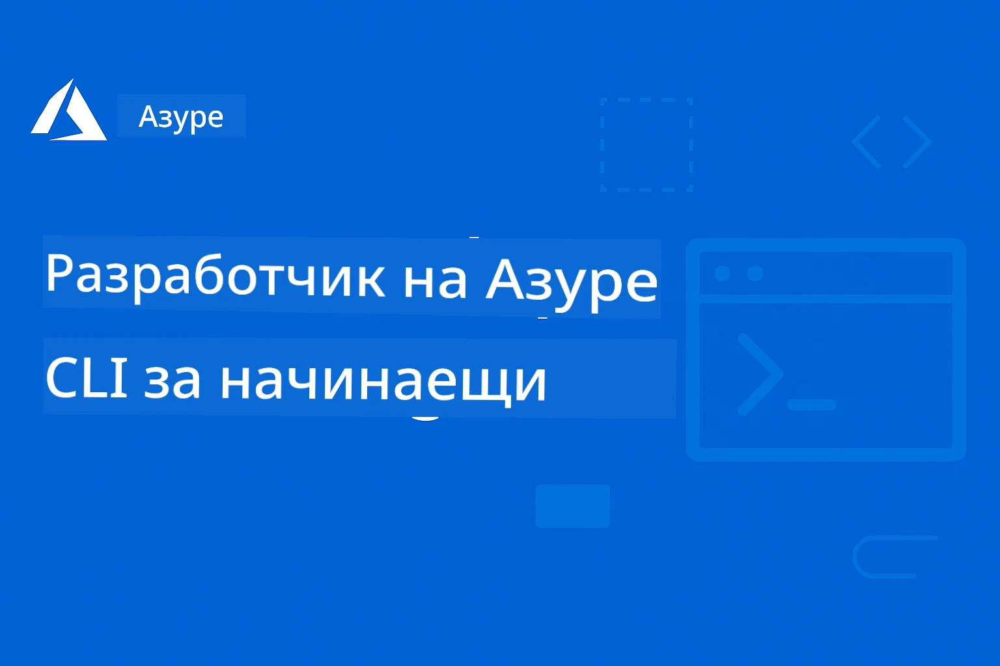

# AZD за начинаещи: Структуриран обучителен път

 

[](https://GitHub.com/microsoft/azd-for-beginners/watchers/)
[](https://GitHub.com/microsoft/azd-for-beginners/network/)
[](https://GitHub.com/microsoft/azd-for-beginners/stargazers/)

[](https://discord.com/invite/nkVh3dp)
[](https://discord.gg/nTYy5BXMWG)

---

### Автоматизирани преводи (Винаги актуални)

<!-- CO-OP TRANSLATOR LANGUAGES TABLE START -->
[Arabic](../ar/README.md) | [Bengali](../bn/README.md) | [Bulgarian](./README.md) | [Burmese (Myanmar)](../my/README.md) | [Chinese (Simplified)](../zh-CN/README.md) | [Chinese (Traditional, Hong Kong)](../zh-HK/README.md) | [Chinese (Traditional, Macau)](../zh-MO/README.md) | [Chinese (Traditional, Taiwan)](../zh-TW/README.md) | [Croatian](../hr/README.md) | [Czech](../cs/README.md) | [Danish](../da/README.md) | [Dutch](../nl/README.md) | [Estonian](../et/README.md) | [Finnish](../fi/README.md) | [French](../fr/README.md) | [German](../de/README.md) | [Greek](../el/README.md) | [Hebrew](../he/README.md) | [Hindi](../hi/README.md) | [Hungarian](../hu/README.md) | [Indonesian](../id/README.md) | [Italian](../it/README.md) | [Japanese](../ja/README.md) | [Kannada](../kn/README.md) | [Khmer](../km/README.md) | [Korean](../ko/README.md) | [Lithuanian](../lt/README.md) | [Malay](../ms/README.md) | [Malayalam](../ml/README.md) | [Marathi](../mr/README.md) | [Nepali](../ne/README.md) | [Nigerian Pidgin](../pcm/README.md) | [Norwegian](../no/README.md) | [Persian (Farsi)](../fa/README.md) | [Polish](../pl/README.md) | [Portuguese (Brazil)](../pt-BR/README.md) | [Portuguese (Portugal)](../pt-PT/README.md) | [Punjabi (Gurmukhi)](../pa/README.md) | [Romanian](../ro/README.md) | [Russian](../ru/README.md) | [Serbian (Cyrillic)](../sr/README.md) | [Slovak](../sk/README.md) | [Slovenian](../sl/README.md) | [Spanish](../es/README.md) | [Swahili](../sw/README.md) | [Swedish](../sv/README.md) | [Tagalog (Filipino)](../tl/README.md) | [Tamil](../ta/README.md) | [Telugu](../te/README.md) | [Thai](../th/README.md) | [Turkish](../tr/README.md) | [Ukrainian](../uk/README.md) | [Urdu](../ur/README.md) | [Vietnamese](../vi/README.md)

> **Предпочитате да клонирате локално?**
>
> Това хранилище съдържа над 50 езикови превода, което значително увеличава размера на изтегляне. За да клонирате без преводи, използвайте sparse checkout:
>
> **Bash / macOS / Linux:**
> ```bash
> git clone --filter=blob:none --sparse https://github.com/microsoft/AZD-for-beginners.git
> cd AZD-for-beginners
> git sparse-checkout set --no-cone '/*' '!translations' '!translated_images'
> ```
>
> **CMD (Windows):**
> ```cmd
> git clone --filter=blob:none --sparse https://github.com/microsoft/AZD-for-beginners.git
> cd AZD-for-beginners
> git sparse-checkout set --no-cone "/*" "!translations" "!translated_images"
> ```
>
> Това ви дава всичко необходимо за завършване на курса с много по-бързо изтегляне.
<!-- CO-OP TRANSLATOR LANGUAGES TABLE END -->

## 🆕 Какво е ново в azd днес

> 📌 Този курс е тестван с **`azd 1.27.1`** (юли 2026). Изпълнете `azd version`, за да проверите версията си, и `azd upgrade`, за да получите последната.

Azure Developer CLI надхвърля традиционните уеб приложения и API-та. Днес azd е единствената команда за разгръщане на **всяко** приложение в Azure — включително AI-приложения и интелигентни агенти.

Ето какво означава това за вас:

- **AI агентите вече са основни azd задачи.** Можете да инициализирате, разгърнете и управлявате AI агент проекти с познатия `azd init` → `azd up` работен процес.
- **Пълен жизнен цикъл на агента от CLI.** Разширението `azure.ai.agents` вече покрива целия път — `azd ai agent init` за scaffold, `azd ai agent invoke` за тест (с информация за времето за отговор), `azd ai agent eval generate` и `azd ai agent optimize` за измерване и подобряване на качеството, и `azd ai agent delete` за почистване.
- **Още AI компоненти.** Нови preview разширения — `azure.ai.skills` и `azure.ai.connections` — ви позволяват да управлявате преизползваеми умения на агенти и Foundry връзки директно с azd.
- **Интеграция с Microsoft Foundry** носи моделиране на модели, хостинг на агенти и конфигуриране на AI услуги директно в екосистемата на azd шаблоните.
- **По-гладки основи за ежедневна работа.** Последните версии направиха `azd init` идемпотентен (безопасен за повторно изпълнение), почиства автоматично остарели токени с `azd auth login` и добавиха приятен начален prompt за `azd tool`.
- **Основният работен процес не се е променил.** Независимо дали разгървате todo app, микросървис или AI решение с много агенти, командите са същите.

> **Забележка за Aspire потребители:** Microsoft вече нарича продукта просто **Aspire** (преди ".NET Aspire"). Поддръжката на azd за Aspire не се е променила — само името е актуализирано.

Ако вече сте използвали azd, поддръжката на AI е естествено разширение — не отделен инструмент или напреднала пътека. Ако започвате отначало, ще научите един работен процес, който работи за всичко.

---

## 🚀 Какво е Azure Developer CLI (azd)?

**Azure Developer CLI (azd)** е удобен за разработчици команден инструмент, който прави лесно разгръщането на приложения в Azure. Вместо ръчното създаване и свързване на десетки Azure ресурси, можете да разположите цели приложения с една команда.

### Магията на `azd up`

```bash
# Тази една команда прави всичко:
# ✅ Създава всички Azure ресурси
# ✅ Конфигурира мрежата и сигурността
# ✅ Компилира кода на вашето приложение
# ✅ Деплойва в Azure
# ✅ Да ви даде работещ URL адрес
azd up
```

**Това е всичко!** Никакво кликане в Azure портала, никакви сложни ARM шаблони за учене, никаква ръчна конфигурация — само работещи приложения в Azure.

---

## ❓ Azure Developer CLI срещу Azure CLI: Каква е разликата?

Това е най-често задаваният въпрос от начинаещи. Ето простия отговор:

| Функция | **Azure CLI (`az`)** | **Azure Developer CLI (`azd`)** |
|---------|---------------------|--------------------------------|
| **Цел** | Управление на отделни Azure ресурси | Разгръщане на пълни приложения |
| **Мислене** | Фокус върху инфраструктурата | Фокус върху приложението |
| **Пример** | `az webapp create --name myapp...` | `azd up` |
| **Крива на учене** | Трябва да знаете Azure услуги | Просто знайте приложението си |
| **Подходящо за** | DevOps, инфраструктура | Разработчици, прототипиране |

### Прост аналог

- **Azure CLI** е като да имате всички инструменти за строеж на къща — чукове, триони, пирони. Можете да построите всичко, но трябва да знаете строителство.
- **Azure Developer CLI** е като да наемете строителен предприемач — вие описвате какво искате, а той се занимава с построяването.

### Кога да използвате кой

| Сценарий | Използвайте това |
|----------|----------|
| "Искам бързо да разположа уеб приложението си" | `azd up` |
| "Трябва само да създам акаунт за съхранение" | `az storage account create` |
| "Строя пълно AI приложение" | `azd init --template azure-search-openai-demo` |
| "Трябва да отстраня грешка в конкретен Azure ресурс" | `az resource show` |
| "Искам разгръщане и готовност за продукция за минути" | `azd up --environment production` |

### Те работят заедно!

AZD използва Azure CLI под капака. Можете да използвате и двата:
```bash
# Разгръщайте вашето приложение с AZD
azd up

# След това фино настройте конкретни ресурси с Azure CLI
az webapp config set --name myapp --always-on true
```

---

## 🌟 Намерете шаблони в Awesome AZD

Не започвайте от нулата! **Awesome AZD** е общностна колекция от шаблони, готови за разгръщане:

| Ресурс | Описание |
|----------|-------------|
| 🔗 [**Awesome AZD Gallery**](https://azure.github.io/awesome-azd/) | Прегледайте над 200 шаблона с възможност за еднокликово разгръщане |
| 🔗 [**Submit a Template**](https://github.com/Azure/awesome-azd/issues) | Допринесете със собствен шаблон за общността |
| 🔗 [**GitHub Repository**](https://github.com/Azure/awesome-azd) | Оценете и разгледайте изходния код |

### Популярни AI шаблони от Awesome AZD

```bash
# RAG чат с модели Microsoft Foundry + AI търсене
azd init --template azure-search-openai-demo

# Бързо AI чат приложение
azd init --template openai-chat-app-quickstart

# AI агенти с Foundry агенти
azd init --template get-started-with-ai-agents
```

---

## 🎯 Започване в 3 стъпки

Преди да започнете, уверете се, че машината ви е готова за шаблона, който искате да разположите:

**Windows:**
```powershell
.\validate-setup.ps1
```

**macOS / Linux:**
```bash
bash ./validate-setup.sh
```

Ако някоя от необходимите проверки не премине, оправете я първо и след това продължете с бързото стартиране.

### Стъпка 1: Инсталирайте AZD (2 минути)

**Windows:**
```powershell
winget install microsoft.azd
```

**macOS:**
```bash
brew tap azure/azd && brew install azd
```

**Linux:**
```bash
curl -fsSL https://aka.ms/install-azd.sh | bash
```

### Стъпка 2: Аутентификация за AZD

```bash
# По избор, ако планирате да използвате Azure CLI команди директно в този курс
az login

# Задължително за AZD работни потоци
azd auth login
```

Ако не сте сигурни кой ви трябва, следвайте пълния процес в [Installation & Setup](docs/chapter-01-foundation/installation.md#authentication-setup).

### Стъпка 3: Разположете първото си приложение

```bash
# Инициализиране от шаблон
azd init --template todo-nodejs-mongo

# Деплой в Azure (създава всичко!)
azd up
```

**🎉 Това е!** Вашето приложение вече е онлайн в Azure.

### Почистете след себе си (не забравяйте!)

```bash
# Премахнете всички ресурси след приключване на експериментирането
azd down --force --purge
```

---

## 📚 Как да използвате този курс

Този курс е предназначен за **прогресивно учене** — започнете откъдето ви е удобно и продължете напред:

| Вашият опит | Започнете тук |
|-----------------|------------|
| **Напълно нови в Azure** | [Глава 1: Основи](#-chapter-1-foundation--quick-start) |
| **Знаещи Azure, нови в AZD** | [Глава 1: Основи](#-chapter-1-foundation--quick-start) |
| **Искат да разгръщат AI приложения** | [Глава 2: AI-първо развитие](#-chapter-2-ai-first-development-recommended-for-ai-developers) |
| **Искат практически тренинг** | [🎓 Интерактивен Workshop](workshop/README.md) - водена лаборатория 3-4 часа |
| **Имат нужда от продукционни шаблони** | [Глава 8: Производствен и корпоративен](#-chapter-8-production--enterprise-patterns) |

### Бързо настройване

1. **Направете Fork на това хранилище**: [](https://GitHub.com/microsoft/azd-for-beginners/fork)
2. **Клонирайте го**: `git clone https://github.com/YOUR-USERNAME/azd-for-beginners.git`
3. **Получете помощ**: [Azure Discord Community](https://discord.com/invite/ByRwuEEgH4)

> **Предпочитате да клонирате локално?**

> Това хранилище съдържа над 50 езикови превода, което значително увеличава размера на изтегляне. За да клонирате без преводи, използвайте sparse checkout:
> ```bash
> git clone --filter=blob:none --sparse https://github.com/microsoft/AZD-for-beginners.git
> cd AZD-for-beginners
> git sparse-checkout set --no-cone '/*' '!translations' '!translated_images'
> ```
> Това ви дава всичко необходимо за завършване на курса с много по-бързо изтегляне.


## Преглед на курса

Усъвършенствайте Azure Developer CLI (azd) чрез структурирани глави, предназначени за прогресивно учене. **Специален фокус върху разгъване на AI приложения с интеграция на Microsoft Foundry.**


### Защо този курс е от съществено значение за съвременните разработчици

Базирано на прозрения от Microsoft Foundry Discord общността, **45% от разработчиците искат да използват AZD за AI натоварвания**, но срещат предизвикателства с:
- Комплексни AI архитектури с много услуги
- Най-добри практики за продуктивно внедряване на AI  
- Интеграция и конфигурация на Azure AI услуги
- Оптимизация на разходите за AI натоварвания
- Отстраняване на специфични за AI проблеми при внедряване

### Цели на обучението

След завършване на този структуриран курс, ще можете:
- **Да овладеете основите на AZD**: Основни концепции, инсталация и конфигурация
- **Да внедрявате AI приложения**: Използване на AZD с Microsoft Foundry услуги
- **Да прилагате инфраструктура като код**: Управление на Azure ресурси с Bicep шаблони
- **Да отстранявате проблеми при внедрявания**: Решаване на чести проблеми и дебъгване
- **Да оптимизирате за продукция**: Сигурност, мащабиране, мониторинг и управление на разходите
- **Да изграждате мулти-агентски решения**: Внедряване на сложни AI архитектури

## Преди да започнете: Акаунти, достъп и предположения

Преди да започнете Глава 1, уверете се, че разполагате със следното. Стъпките за инсталация по-нататък в този наръчник предполагат, че основите вече са уредени.

- **Абонамент в Azure**: Можете да използвате съществуващ абонамент от работа или личен акаунт, или да създадете [безплатен пробен](https://aka.ms/azurefreetrial) за начало.
- **Разрешение за създаване на Azure ресурси**: За повечето упражнения трябва да имате поне **Contributor** достъп до целевия абонамент или група ресурси. Някои глави предполагат, че можете да създавате групи ресурси, управлявани идентичности и RBAC присвоявания.
- [**GitHub акаунт**](https://github.com): Полезно за форкване на репозитория, проследяване на лични промени и използване на GitHub Codespaces за работилницата.
- **Предварителни изисквания за изпълнение на шаблони**: Някои шаблони изискват локални инструменти като Node.js, Python, Java или Docker. Изпълнете валидатора за настройка преди започване, за да откриете липсващи инструменти рано.
- **Базова работа с терминал**: Не е нужно да сте експерт, но трябва да се чувствате комфортно с команди като `git clone`, `azd auth login` и `azd up`.

> **Работите в корпоративен абонамент?**
> Ако вашата Azure среда се управлява от администратор, предварително се уверете, че можете да внедрявате ресурси в абонамента или групата ресурси, която планирате да използвате. Ако не, поискайте пясъчник абонамент или Contributor достъп преди да започнете.

> **Нови сте в Azure?**
> Започнете с вашия собствен Azure пробен или pay-as-you-go абонамент на https://aka.ms/azurefreetrial, за да можете да завършите упражненията изцяло без да чакате одобрения на ниво на организация.

## 🗺️ Карта на курса: Бърза навигация по глави

Всяка глава има отделен README с цели на обучението, бързи стартирания и упражнения:

| Глава | Тема | Уроци | Продължителност | Сложност |
|---------|-------|---------|----------|------------|
| **[Гл. 1: Основи](docs/chapter-01-foundation/README.md)** | Започване | [Основи на AZD](docs/chapter-01-foundation/azd-basics.md) &#124; [Инсталация](docs/chapter-01-foundation/installation.md) &#124; [Първи проект](docs/chapter-01-foundation/first-project.md) | 30-45 мин | ⭐ |
| **[Гл. 2: Разработка на AI](docs/chapter-02-ai-development/README.md)** | AI-първи приложения | [Интеграция с Foundry](docs/chapter-02-ai-development/microsoft-foundry-integration.md) &#124; [AI агенти](docs/chapter-02-ai-development/agents.md) &#124; [Внедряване на модели](docs/chapter-02-ai-development/ai-model-deployment.md) &#124; [Работилница](docs/chapter-02-ai-development/ai-workshop-lab.md) | 1-2 ч | ⭐⭐ |
| **[Гл. 3: Конфигурация](docs/chapter-03-configuration/README.md)** | Аутентикация и сигурност | [Конфигурация](docs/chapter-03-configuration/configuration.md) &#124; [Аутентикация и сигурност](docs/chapter-03-configuration/authsecurity.md) | 45-60 мин | ⭐⭐ |
| **[Гл. 4: Инфраструктура](docs/chapter-04-infrastructure/README.md)** | IaC & Внедряване | [Наръчник за внедряване](docs/chapter-04-infrastructure/deployment-guide.md) &#124; [Провизиране](docs/chapter-04-infrastructure/provisioning.md) | 1-1.5 ч | ⭐⭐⭐ |
| **[Гл. 5: Мулти-Агент](docs/chapter-05-multi-agent/README.md)** | AI Агентски решения | [Търговски сценарий](examples/retail-scenario.md) &#124; [Патерни за координация](docs/chapter-06-pre-deployment/coordination-patterns.md) | 2-3 ч | ⭐⭐⭐⭐ |
| **[Гл. 6: Предварително внедряване](docs/chapter-06-pre-deployment/README.md)** | Планиране и валидиране | [Проверки преди полет](docs/chapter-06-pre-deployment/preflight-checks.md) &#124; [Планиране на капацитет](docs/chapter-06-pre-deployment/capacity-planning.md) &#124; [Избор на SKU](docs/chapter-06-pre-deployment/sku-selection.md) &#124; [App Insights](docs/chapter-06-pre-deployment/application-insights.md) | 1 ч | ⭐⭐ |
| **[Гл. 7: Отстраняване на проблеми](docs/chapter-07-troubleshooting/README.md)** | Дебъг и корекции | [Чести проблеми](docs/chapter-07-troubleshooting/common-issues.md) &#124; [Дебъгване](docs/chapter-07-troubleshooting/debugging.md) &#124; [AI проблеми](docs/chapter-07-troubleshooting/ai-troubleshooting.md) | 1-1.5 ч | ⭐⭐ |
| **[Гл. 8: Продукция](docs/chapter-08-production/README.md)** | Корпоративни патерни | [Практики за продукция](docs/chapter-08-production/production-ai-practices.md) | 2-3 ч | ⭐⭐⭐⭐ |
| **[🎓 Работилница](workshop/README.md)** | Практическа лаборатория | [Въведение](workshop/docs/instructions/0-Introduction.md) &#124; [Избор](workshop/docs/instructions/1-Select-AI-Template.md) &#124; [Валидация](workshop/docs/instructions/2-Validate-AI-Template.md) &#124; [Разглобяване](workshop/docs/instructions/3-Deconstruct-AI-Template.md) &#124; [Конфигурация](workshop/docs/instructions/4-Configure-AI-Template.md) &#124; [Персонализация](workshop/docs/instructions/5-Customize-AI-Template.md) &#124; [Разглобяване на инфраструктура](workshop/docs/instructions/6-Teardown-Infrastructure.md) &#124; [Заключение](workshop/docs/instructions/7-Wrap-up.md) | 3-4 ч | ⭐⭐ |

**Общо време за курс:** ~10-14 часа | **Ниво на умения:** Начинаещ → Готов за продукция

---

## 📚 Учебни глави

*Изберете своя път на обучение според нивото и целите си*

### 🚀 Глава 1: Основи и бързо стартиране
**Предварителни изисквания**: Абонамент в Azure, базови познания за команден ред  
**Продължителност**: 30-45 минути  
**Сложност**: ⭐

#### Какво ще научите
- Основи на Azure Developer CLI
- Инсталиране на AZD на вашата платформа
- Първото ви успешно внедряване

#### Ресурси за обучение
- **🎯 Започнете тук**: [Какво е Azure Developer CLI?](#what-is-azure-developer-cli)
- **📖 Теория**: [Основи на AZD](docs/chapter-01-foundation/azd-basics.md) - Основни концепции и терминология
- **⚙️ Настройка**: [Инсталация и настройка](docs/chapter-01-foundation/installation.md) - Ръководства за конкретна платформа
- **🛠️ Практика**: [Първият ви проект](docs/chapter-01-foundation/first-project.md) - Урок стъпка по стъпка
- **📋 Бърза справка**: [Лист с команди](resources/cheat-sheet.md)

#### Практически упражнения
```bash
# Бърза проверка на инсталацията
azd version

# Разположете първото си приложение
azd init --template todo-nodejs-mongo
azd up
```

**💡 Резултат от главата**: Успешно внедряване на просто уеб приложение в Azure с помощта на AZD

**✅ Валидация на успеха:**
```bash
# След завършване на Глава 1, трябва да можете:
azd version              # Показва инсталирана версия
azd init --template todo-nodejs-mongo  # Инициализира проект
azd up                  # Разгръща в Azure
azd show                # Показва URL на работещото приложение
# Приложението се отваря в браузъра и работи
azd down --force --purge  # Почиства ресурси
```

**📊 Времева инвестиция:** 30-45 минути  
**📈 Ниво след глава:** Може да внедрява основни приложения самостоятелно
**📈 Ниво след глава:** Може да внедрява основни приложения самостоятелно

---

### 🤖 Глава 2: Разработка с акцент върху AI (Препоръчана за AI разработчици)
**Предварителни изисквания**: Глава 1 завършена  
**Продължителност**: 1-2 часа  
**Сложност**: ⭐⭐

#### Какво ще научите
- Интеграция на Microsoft Foundry с AZD
- Внедряване на AI задвижвани приложения
- Разбиране на конфигурации на AI услуги

#### Ресурси за обучение
- **🎯 Започнете тук**: [Интеграция с Microsoft Foundry](docs/chapter-02-ai-development/microsoft-foundry-integration.md)
- **🤖 AI агенти**: [Ръководство за AI агенти](docs/chapter-02-ai-development/agents.md) - Внедряване на интелигентни агенти с AZD
- **📖 Патерни**: [Внедряване на AI модели](docs/chapter-02-ai-development/ai-model-deployment.md) - Внедряване и управление на AI модели
- **🛠️ Работилница**: [AI работилница](docs/chapter-02-ai-development/ai-workshop-lab.md) - Направете своите AI решения готови за AZD
- **🎥 Интерактивно ръководство**: [Материали от работилницата](workshop/README.md) - Обучение през браузър с MkDocs * DevContainer среда
- **📋 Шаблони**: [Шаблони Microsoft Foundry](#ресурси-на-работилницата)
- **📝 Примери**: [Примери за внедряване с AZD](examples/README.md)

#### Практически упражнения
```bash
# Разположете вашето първо AI приложение
azd init --template azure-search-openai-demo
azd up

# Опитайте допълнителни AI шаблони
azd init --template openai-chat-app-quickstart
azd init --template agent-openai-python-prompty
```

**💡 Резултат от главата**: Внедряване и конфигуриране на AI-задвижван чат бот с RAG възможности

**✅ Валидация на успеха:**
```bash
# След Глава 2 трябва да можете:
azd init --template azure-search-openai-demo
azd up
# Да тествате AI чат интерфейса
# Да задавате въпроси и да получавате отговори с AI и източници
# Да проверите дали интеграцията на търсачката работи
azd monitor  # Да проверите дали Application Insights показва телеметрия
azd down --force --purge
```

**📊 Времева инвестиция:** 1-2 часа  
**📈 Ниво след глава:** Може да внедрява и конфигурира AI приложения готови за продукция  
**💰 Осъзнаване на разходите:** Разбиране на разходи за разработка $80-150/месец, продукционни разходи $300-3500/месец

#### 💰 Финансови съображения за AI внедрявания

**Среда за разработка (Оценка $80-150/месец):**
- Microsoft Foundry модели (платете според потреблението): $0-50/месец (в зависимост от използването на токени)
- AI Search (основен план): $75/месец
- Container Apps (консумация): $0-20/месец
- Съхранение (стандартно): $1-5/месец

**Продукционна среда (Оценка $300-3,500+/месец):**
- Microsoft Foundry модели (PTU за стабилна производителност): $3,000+/месец ИЛИ плащате според потреблението при голям обем
- AI Search (стандартен план): $250/месец
- Container Apps (посветени): $50-100/месец
- Application Insights: $5-50/месец
- Съхранение (премиум): $10-50/месец

**💡 Съвети за оптимизация на разходите:**
- Използвайте **Безплатен слой** Microsoft Foundry модели за обучение (Azure OpenAI включва 50,000 токена/месец)
- Стартирайте `azd down` за освобождаване на ресурси, когато не разработвате активно
- Започнете с таксуване според консумацията, преминете към PTU само за продукция
- Използвайте `azd provision --preview` за оценка на разходите преди внедряване
- Активирайте автоматично мащабиране: плащате само за реална консумация

**Проследяване на разходите:**
```bash
# Проверете предвидените месечни разходи
azd provision --preview

# Следете реалните разходи в Azure портала
az consumption budget list --resource-group <your-rg>
```

---

### ⚙️ Глава 3: Конфигурация и аутентикация
**Предварителни изисквания**: Глава 1 завършена  
**Продължителност**: 45-60 минути  
**Сложност**: ⭐⭐

#### Какво ще научите
- Конфигурация и управление на средата
- Най-добри практики за аутентикация и сигурност
- Именуване и организация на ресурси

#### Ресурси за обучение
- **📖 Конфигурация**: [Ръководство за конфигурация](docs/chapter-03-configuration/configuration.md) - Настройка на средата
- **🔐 Сигурност**: [Патерни за аутентикация и управлявана идентичност](docs/chapter-03-configuration/authsecurity.md) - Патерни за аутентикация
- **📝 Примери**: [Пример с базата данни](examples/database-app/README.md) - Примери за AZD с базата данни

#### Практически упражнения
- Конфигуриране на множество среди (dev, staging, prod)
- Настройване на аутентикация с управлявана идентичност
- Прилагане на среда-специфични конфигурации

**💡 Резултат от главата**: Управление на множество среди с подходяща аутентикация и сигурност

---

### 🏗️ Глава 4: Инфраструктура като код и внедряване
**Предварителни изисквания**: Завършени глави 1-3  
**Продължителност**: 1-1.5 часа  
**Сложност**: ⭐⭐⭐

#### Какво ще научите
- Разширени патерни за внедряване
- Инфраструтура като код с Bicep
- Стратегии за провизиране на ресурси

#### Ресурси за обучение
- **📖 Внедряване**: [Ръководство за внедряване](docs/chapter-04-infrastructure/deployment-guide.md) - Пълни работни потоци
- **🏗️ Провизиране**: [Провизиране на ресурси](docs/chapter-04-infrastructure/provisioning.md) - Управление на Azure ресурси
- **📝 Примери**: [Пример с контейнер приложение](../../examples/container-app) - Контейнеризирани внедрявания

#### Практически упражнения
- Създаване на персонализирани Bicep шаблони
- Внедряване на многоуслужни приложения
- Прилагане на blue-green стратегии за внедряване

**💡 Резултат от главата**: Внедряване на сложни многоуслужни приложения с помощта на персонализирани инфраструктурни шаблони

---


### 🎯 Глава 5: Многоагентски AI решения (Разширено)
**Изисквания**: Завършени глави 1-2  
**Продължителност**: 2-3 часа  
**Сложност**: ⭐⭐⭐⭐

#### Какво ще научите
- Многоагентски архитектурни шаблони
- Оркестрация и координация на агентите
- Разгръщания на AI, готови за продукция

#### Учебни ресурси
- **🤖 Представен проект**: [Многоагентско решение за търговия на дребно](examples/retail-scenario.md) - Пълна реализация
- **🛠️ ARM шаблони**: [Пакет с ARM шаблони](../../examples/retail-multiagent-arm-template) - Разгръщане с един клик
- **📖 Архитектура**: [Шаблони за координация на многоагентски системи](docs/chapter-06-pre-deployment/coordination-patterns.md) - Шаблони

#### Практически упражнения
```bash
# Разгръщане на пълното мултиагентно решение за търговия на дребно
cd examples/retail-multiagent-arm-template
./deploy.sh

# Разгледайте конфигурациите на агентите
az deployment group show --resource-group <rg-name> --name <deployment-name>
```

**💡 Резултат от главата**: Разгънете и управлявайте многоагентско AI решение, готово за продукция, с агенти за клиенти и наличности

---

### 🔍 Глава 6: Валидация и планиране преди разгръщане
**Изисквания**: Завършена глава 4  
**Продължителност**: 1 час  
**Сложност**: ⭐⭐

#### Какво ще научите
- Планиране на капацитета и валидиране на ресурсите
- Стратегии за избор на SKU
- Проверки преди стартиране и автоматизация

#### Учебни ресурси
- **📊 Планиране**: [Планиране на капацитета](docs/chapter-06-pre-deployment/capacity-planning.md) - Валидиране на ресурсите
- **💰 Избор**: [Избор на SKU](docs/chapter-06-pre-deployment/sku-selection.md) - Разумни разходи
- **✅ Валидация**: [Проверки преди стартиране](docs/chapter-06-pre-deployment/preflight-checks.md) - Автоматизирани скриптове

#### Практически упражнения
- Стартирайте скриптове за валидация на капацитет
- Оптимизирайте избора на SKU за разходи
- Имплементирайте автоматизираните проверки преди разгръщане

**💡 Резултат от главата**: Валидирайте и оптимизирайте разгръщанията преди изпълнение

---

### 🚨 Глава 7: Отстраняване на проблеми и дебъгване
**Изисквания**: Завършена някоя от главите за разгръщане  
**Продължителност**: 1-1.5 часа  
**Сложност**: ⭐⭐

#### Какво ще научите
- Систематични подходи за дебъгване
- Чести проблеми и решения
- Отстраняване на проблеми специфични за AI

#### Учебни ресурси
- **🔧 Чести проблеми**: [Чести проблеми](docs/chapter-07-troubleshooting/common-issues.md) - FAQ и решения
- **🕵️ Дебъгване**: [Ръководство за дебъгване](docs/chapter-07-troubleshooting/debugging.md) - Стъпка по стъпка стратегии
- **🤖 AI проблеми**: [Отстраняване на AI проблеми](docs/chapter-07-troubleshooting/ai-troubleshooting.md) - Проблеми със AI услугите

#### Практически упражнения
- Диагностицирайте неуспешни разгръщания
- Отстранете проблеми с удостоверяването
- Дебъгвайте връзката към AI услуги

**💡 Резултат от главата**: Самостоятелно диагностицирайте и решавайте чести проблеми при разгръщания

---

### 🏢 Глава 8: Производствени и корпоративни шаблони
**Изисквания**: Завършени глави 1-4  
**Продължителност**: 2-3 часа  
**Сложност**: ⭐⭐⭐⭐

#### Какво ще научите
- Стратегии за производствено разгръщане
- Корпоративни шаблони за сигурност
- Мониторинг и оптимизация на разходите

#### Учебни ресурси
- **🏭 Производство**: [Най-добри практики за AI в продукция](docs/chapter-08-production/production-ai-practices.md) - Корпоративни шаблони
- **📝 Примери**: [Пример с микросървиси](../../examples/microservices) - Сложни архитектури
- **📊 Мониторинг**: [Интеграция с Application Insights](docs/chapter-06-pre-deployment/application-insights.md) - Мониторинг

#### Практически упражнения
- Имплементирайте корпоративни шаблони за сигурност
- Настройте комплексен мониторинг
- Разгърнете в производство с подходящо управление

**💡 Резултат от главата**: Разгърнете приложения за корпоративна среда с пълни производствени възможности

---

## 🎓 Преглед на работилницата: Практическо обучение

> **⚠️ СТАТУС НА РАБОТИЛНИЦАТА: Активна разработка**  
> Материалите за работилницата в момента се разработват и усъвършенстват. Основните модули функционират, но някои напреднали секции не са завършени. Активно работим за завършване на цялото съдържание. [Проследи напредъка →](workshop/README.md)

### Интерактивни материали за работилницата
**Комплексно практическо обучение с инструменти в браузър и ръководени упражнения**

Нашите материали за работилницата предлагат структурирано, интерактивно обучение, което допълва горепосочената учебна програма по глави. Работилницата е предназначена както за самостоятелно обучение, така и за ръководени от инструктор сесии.

#### 🛠️ Характеристики на работилницата
- **Интерфейс базиран на браузър**: Пълна работилница с MkDocs, с търсене, копиране и функции за теми
- **Интеграция с GitHub Codespaces**: Настройване на среда за разработка с един клик
- **Структуриран учебен път**: 8 модула с ръководени упражнения (общо 3-4 часа)
- **Прогресивна методология**: Въведение → Избор → Валидация → Разглобяване → Конфигурация → Персонализация → Изчистване → Финал
- **Интерактивна DevContainer среда**: Предконфигурирани инструменти и зависимости

#### 📚 Структура на модулите в работилницата
Работилницата следва **8-модулна прогресивна методология**, която ви води от откриването до майсторството при разгръщане:

| Модул | Тема | Какво ще правите | Продължителност |
|--------|-------|----------------|----------|
| **0. Въведение** | Преглед на работилницата | Разберете учебните цели, изискванията и структурата на работилницата | 15 мин |
| **1. Избор** | Откриване на шаблони | Разгледайте шаблоните на AZD и изберете подходящия AI шаблон за вашия сценарий | 20 мин |
| **2. Валидация** | Разгръщане и проверка | Разгърнете шаблона с `azd up` и валидирайте инфраструктурата | 30 мин |
| **3. Разглобяване** | Разберете структурата | Използвайте GitHub Copilot, за да разгледате архитектурата на шаблона, Bicep файловете и организацията на кода | 30 мин |
| **4. Конфигурация** | Задълбочено изучаване на azure.yaml | Усвойте конфигурацията на `azure.yaml`, жизнения цикъл на хуките и променливите на средата | 30 мин |
| **5. Персонализация** | Направете го свой | Активирайте AI търсене, проследяване, оценка и персонализирайте за вашия сценарий | 45 мин |
| **6. Изчистване** | Изчистете | Безопасно премахнете ресурсите с `azd down --purge` | 15 мин |
| **7. Финал** | Следващи стъпки | Прегледайте постигнатото, ключови концепции и продължете обучението си | 15 мин |

**Ход на работилницата:**
```
Introduction → Selection → Validation → Deconstruction → Configuration → Customization → Teardown → Wrap-up
     ↓            ↓           ↓              ↓               ↓              ↓            ↓           ↓
  Overview    Find the     Deploy &      Explore        Master         Customize     Clean up    Review &
             right        verify        code &        azure.yaml      for your      resources   next steps
             template                   structure                     scenario
```

#### 🚀 Започване с работилницата
```bash
# Опция 1: GitHub Codespaces (Препоръчително)
# Кликнете "Code" → "Create codespace on main" в хранилището

# Опция 2: Локална разработка
git clone https://github.com/microsoft/azd-for-beginners.git
cd azd-for-beginners/workshop
# Следвайте инструкциите за настройка в workshop/README.md
```

#### 🎯 Резултати от обучението в работилницата
Като завършат работилницата, участниците ще:
- **Разгръщат производствени AI приложения**: Използват AZD с услуги Microsoft Foundry
- **Майсторят многоагентски архитектури**: Имплементират координирани AI агентски решения
- **Прилагат най-добри практики за сигурност**: Конфигурират удостоверяване и контрол на достъпа
- **Оптимизират за мащаб**: Проектират разгръщания с оптимални разходи и представяне
- **Отстраняват проблеми при разгръщания**: Решават чести проблеми самостоятелно

#### 📖 Ресурси на работилницата
- **🎥 Интерактивно ръководство**: [Материали за работилница](workshop/README.md) - Описание на учебна среда в браузър
- **📋 Инструкции по модули**:
  - [0. Въведение](workshop/docs/instructions/0-Introduction.md) - Преглед и цели на работилницата
  - [1. Избор](workshop/docs/instructions/1-Select-AI-Template.md) - Как да намерите и изберете AI шаблони
  - [2. Валидация](workshop/docs/instructions/2-Validate-AI-Template.md) - Разгръщане и проверка на шаблоните
  - [3. Разглобяване](workshop/docs/instructions/3-Deconstruct-AI-Template.md) - Разглеждане на архитектурата на шаблона
  - [4. Конфигурация](workshop/docs/instructions/4-Configure-AI-Template.md) - Усвояване на azure.yaml
  - [5. Персонализация](workshop/docs/instructions/5-Customize-AI-Template.md) - Персонализиране за вашия сценарий
  - [6. Изчистване](workshop/docs/instructions/6-Teardown-Infrastructure.md) - Почистване на ресурсите
  - [7. Финал](workshop/docs/instructions/7-Wrap-up.md) - Преглед и следващи стъпки
- **🛠️ AI лаборатория**: [AI Workshop Lab](docs/chapter-02-ai-development/ai-workshop-lab.md) - Упражнения, фокусирани върху AI
- **💡 Бърз старт**: [Ръководство за настройка на работилницата](workshop/README.md#quick-start) - Конфигуриране на средата

**Подходяща за**: Корпоративни обучения, университетски курсове, самостоятелно обучение и обучителни лагери за разработчици.

---

## 📖 Задълбочен преглед: Възможности на AZD

Над основите, AZD предлага мощни функции за производствени разгръщания:

- **Разгръщане с шаблони** - Използване на предварително създадени шаблони за често срещани приложения
- **Инфраструктура като код** - Управлява Azure ресурси чрез Bicep или Terraform  
- **Интегрирани работни потоци** - Безпроблемно осигуряване, разгръщане и наблюдение на приложенията
- **Приятелски за разработчици** - Оптимизиран за продуктивност и опит на разработчиците

### **AZD + Microsoft Foundry: Перфектна комбинация за AI разгръщания**

**Защо AZD за AI решения?** AZD адресира основните предизвикателства пред AI разработчиците:

- **Готови AI шаблони** - Предварително конфигурирани шаблони за Microsoft Foundry модели, Azure AI услуги и ML натоварвания
- **Сигурни AI разгръщания** - Вградени шаблони за сигурност за AI услуги, API ключове и крайни точки на модели  
- **Производствени AI шаблони** - Най-добри практики за мащабируеми и изгодни AI приложения
- **Цялостни работни потоци за AI** - От разработка на модел до разгръщане в продукция с подходящ мониторинг
- **Оптимизация на разходите** - Интелигентно разпределение и скалиране на ресурси за AI натоварвания
- **Интеграция с Microsoft Foundry** - Безпроблемна връзка към каталог на модели и крайни точки на Microsoft Foundry

---

## 🎯 Библиотека с шаблони и примери

### Представени: Microsoft Foundry шаблони
**Започнете тук, ако разгръщате AI приложения!**

> **Забележка:** Тези шаблони демонстрират различни AI шаблони. Някои са външни Azure примери, други са локални реализации.

| Шаблон | Глава | Сложност | Услуги | Вид |
|----------|---------|------------|----------|------|
| [**Започнете с AI чат**](https://github.com/Azure-Samples/get-started-with-ai-chat) | Глава 2 | ⭐⭐ | AzureOpenAI + Azure AI Model Inference API + Azure AI Search + Azure Container Apps + Application Insights | Външен |
| [**Започнете с AI агенти**](https://github.com/Azure-Samples/get-started-with-ai-agents) | Глава 2 | ⭐⭐ | Foundry Agents + AzureOpenAI + Azure AI Search + Azure Container Apps + Application Insights| Външен |
| [**Демо с Azure Search + OpenAI**](https://github.com/Azure-Samples/azure-search-openai-demo) | Глава 2 | ⭐⭐ | AzureOpenAI + Azure AI Search + App Service + Storage | Външен |
| [**OpenAI Chat App Бърз старт**](https://github.com/Azure-Samples/openai-chat-app-quickstart) | Глава 2 | ⭐ | AzureOpenAI + Container Apps + Application Insights | Външен |
| [**Agent OpenAI Python Prompty**](https://github.com/Azure-Samples/agent-openai-python-prompty) | Глава 5 | ⭐⭐⭐ | AzureOpenAI + Azure Functions + Prompty | Външен |
| [**Contoso Chat RAG**](https://github.com/Azure-Samples/contoso-chat) | Глава 8 | ⭐⭐⭐⭐ | AzureOpenAI + AI Search + Cosmos DB + Container Apps | Външен |
| [**Многоагентско решение за търговия на дребно**](examples/retail-scenario.md) | Глава 5 | ⭐⭐⭐⭐ | AzureOpenAI + AI Search + Storage + Container Apps + Cosmos DB | **Локален** |

### Представени: Пълни учебни сценарии
**Готови за продукция шаблони, съответстващи на учебните глави**

| Шаблон | Учебна глава | Сложност | Ключово обучение |
|----------|------------------|------------|--------------|
| [**openai-chat-app-quickstart**](https://github.com/Azure-Samples/openai-chat-app-quickstart) | Глава 2 | ⭐ | Основни AI шаблони за разгръщане |
| [**azure-search-openai-demo**](https://github.com/Azure-Samples/azure-search-openai-demo) | Глава 2 | ⭐⭐ | Имплементация на RAG с Azure AI Search |
| [**ai-document-processing**](https://github.com/Azure-Samples/ai-document-processing) | Глава 4 | ⭐⭐ | Интеграция с Document Intelligence |
| [**agent-openai-python-prompty**](https://github.com/Azure-Samples/agent-openai-python-prompty) | Глава 5 | ⭐⭐⭐ | Рамка за агенти и извикване на функции |
| [**contoso-chat**](https://github.com/Azure-Samples/contoso-chat) | Глава 8 | ⭐⭐⭐ | Корпоративна AI оркестрация |
| [**retail-multi-agent-solution**](examples/retail-scenario.md) | Глава 5 | ⭐⭐⭐⭐ | Многоагентна архитектура с агенти за клиенти и наличности |

### Учете се чрез тип примери

> **📌 Локални срещу външни примери:**  
> **Локални примери** (в това хранилище) = Готови за незабавна употреба  
> **Външни примери** (Azure Samples) = Клониране от свързани хранилища

#### Локални примери (Готови за употреба)
- [**Многоагентско решение за търговия на дребно**](examples/retail-scenario.md) - Пълна продукционна реализация с ARM шаблони
  - Многоагентна архитектура (Агенти за клиенти и наличности)
  - Комплексен мониторинг и оценка
  - Разгръщане с един клик чрез ARM шаблон

#### Локални примери - Контейнер приложения (Глави 2-5)
**Комплексни примери за контейнерни разгръщания в това хранилище:**

- [**Примери за контейнерни приложения**](examples/container-app/README.md) - Пълен наръчник за контейнеризирани внедрявания
  - [Просто Flask API](../../examples/container-app/simple-flask-api) - Основно REST API със скалиране до нула
  - [Микросервисна архитектура](../../examples/container-app/microservices) - Внедряване в продукция с множество услуги
  - Бързо стартиране, Производство и Напреднали модели на внедряване
  - Насоки за мониторинг, сигурност и оптимизация на разходите

#### Външни примери - Прости приложения (Глави 1-2)
**Клонирайте тези хранилища с примери от Azure, за да започнете:**
- [Просто уеб приложение - Node.js + MongoDB](https://github.com/Azure-Samples/todo-nodejs-mongo) - Основни модели на внедряване
- [Статичен уебсайт - React SPA](https://github.com/Azure-Samples/todo-csharp-sql-swa-func) - Внедряване на статично съдържание
- [Контейнерно приложение - Python Flask](https://github.com/Azure-Samples/container-apps-store-api-microservice) - Внедряване на REST API

#### Външни примери - Интеграция с база данни (Глави 3-4)  
- [База данни приложение - C# + SQL](https://github.com/Azure-Samples/todo-csharp-sql) - Модели за връзка с база данни
- [Функции + Cosmos DB](https://github.com/Azure-Samples/todo-python-mongo-swa-func) - Безсървърна обработка на данни

#### Външни примери - Напреднали модели (Глави 4-8)
- [Java микросервизи](https://github.com/Azure-Samples/java-microservices-aca-lab) - Многосервисни архитектури
- [Контейнерни приложения Jobs](https://github.com/Azure-Samples/container-apps-jobs) - Обработка на заден план  
- [Корпоративен ML Pipeline](https://github.com/Azure-Samples/mlops-v2) - Готови за продукция ML модели

### Колекции с външни шаблони
- [**Официална галерия с шаблони на AZD**](https://azure.github.io/awesome-azd/) - Подбрана колекция с официални и от общността шаблони
- [**Шаблони на Azure Developer CLI**](https://learn.microsoft.com/en-us/azure/developer/azure-developer-cli/azd-templates) - Документация на шаблони в Microsoft Learn
- [**Директория с примери**](examples/README.md) - Локални учебни примери с подробни обяснения

---

## 📚 Учебни ресурси и препратки

### Бързи препратки
- [**Командна шпаргалка**](resources/cheat-sheet.md) - Основни azd команди, организирани по глави
- [**Глосарий**](resources/glossary.md) - Терминология за Azure и azd  
- [**Често задавани въпроси (FAQ)**](resources/faq.md) - Общи въпроси, организирани по учебни глави
- [**Учебно ръководство**](resources/study-guide.md) - Комплексни практични упражнения

### Практически работилници
- [**Работилница за изкуствен интелект**](docs/chapter-02-ai-development/ai-workshop-lab.md) - Направете AI решенията си внедряеми с AZD (2-3 часа)
- [**Интерактивна работилница**](workshop/README.md) - Ръководени упражнения в 8 модула с MkDocs и GitHub Codespaces
  - Следва: Въведение → Избор → Проверка → Деконструкция → Конфигурация → Персонализация → Демонтаж → Обзор

### Външни учебни ресурси
- [Документация на Azure Developer CLI](https://learn.microsoft.com/en-us/azure/developer/azure-developer-cli/)
- [Azure Architecture Center](https://learn.microsoft.com/en-us/azure/architecture/)
- [Калкулатор за цени на Azure](https://azure.microsoft.com/pricing/calculator/)
- [Статус на Azure](https://status.azure.com/)

### AI Агент умения за вашия редактор
- [**Умения на Microsoft Azure в skills.sh**](https://skills.sh/microsoft/github-copilot-for-azure) - 37 отворени агентски умения за Azure AI, Foundry, внедряване, диагностика, оптимизация на разходите и други. Инсталирайте ги в GitHub Copilot, Cursor, Claude Code или в който и да е поддържан агент:
  ```bash
  npx skills add microsoft/github-copilot-for-azure
  ```

---

## 🔧 Бързо ръководство за отстраняване на неизправности

**Често срещани проблеми за начинаещи и незабавни решения:**

<details>
<summary><strong>❌ "azd: команда не намерена"</strong></summary>

```bash
# Инсталирайте първо AZD
# Windows (PowerShell):
winget install microsoft.azd

# macOS:
brew tap azure/azd && brew install azd

# Linux:
curl -fsSL https://aka.ms/install-azd.sh | bash

# Проверете инсталацията
azd version
```
</details>

<details>
<summary><strong>❌ "Не е намерен абонамент" или "Абонаментът не е зададен"</strong></summary>

```bash
# Изброяване на наличните абонаменти
az account list --output table

# Задаване на подразбиращ се абонамент
az account set --subscription "<subscription-id-or-name>"

# Задаване за AZD среда
azd env set AZURE_SUBSCRIPTION_ID "<subscription-id>"

# Потвърждаване
az account show
```
</details>

<details>
<summary><strong>❌ "InsufficientQuota" или "Превишена квота"</strong></summary>

```bash
# Опитайте различен регион на Azure
azd env set AZURE_LOCATION "westus2"
azd up

# Или използвайте по-малки SKU-та в развитие
# Редактирайте infra/main.parameters.json:
{
  "sku": "B1"  // Instead of "P1V2"
}
```
</details>

<details>
<summary><strong>❌ "azd up" се проваля по средата</strong></summary>

```bash
# Опция 1: Изчисти и опитай отново
azd down --force --purge
azd up

# Опция 2: Само поправи инфраструктурата
azd provision

# Опция 3: Провери подробен статус
azd show

# Опция 4: Провери логовете в Azure Monitor
azd monitor --logs
```
</details>

<details>
<summary><strong>❌ "Неуспешна автентикация" или "Токенът е изтекъл"</strong></summary>

```bash
# Повторно удостоверяване за AZD
azd auth logout
azd auth login

# По желание: освежете и Azure CLI, ако изпълнявате az команди
az logout
az login

# Проверете удостоверяването
az account show
```
</details>

<details>
<summary><strong>❌ "Ресурсът вече съществува" или конфликт при именуване</strong></summary>

```bash
# AZD генерира уникални имена, но ако има конфликт:
azd down --force --purge

# След това опитайте отново с нова среда
azd env new dev-v2
azd up
```
</details>

<details>
<summary><strong>❌ Внедряването на шаблона отнема твърде много време</strong></summary>

**Обичайни времена за изчакване:**
- Просто уеб приложение: 5-10 минути
- Приложение с база данни: 10-15 минути
- AI приложения: 15-25 минути (OpenAI предоставянето е бавно)

```bash
# Проверете напредъка
azd show

# Ако сте заседнали >30 минути, проверете Azure портала:
azd monitor --overview
# Потърсете неуспешни разгръщания
```
</details>

<details>
<summary><strong>❌ "Достъпът е отказан" или "Забранено"</strong></summary>

```bash
# Проверете вашата Azure роля
az role assignment list --assignee $(az account show --query user.name -o tsv)

# Трябва ви поне роля "Contributor"
# Помолете вашия Azure администратор да предостави:
# - Contributor (за ресурси)
# - User Access Administrator (за назначаване на роли)
```
</details>

<details>
<summary><strong>❌ Не може да се намери URL на внедреното приложение</strong></summary>

```bash
# Покажи всички крайни точки на услугата
azd show

# Или отвори Azure портала
azd monitor

# Провери конкретна услуга
azd env get-values
# Потърси променливи *_URL
```
</details>

### 📚 Пълни ресурси за отстраняване на неизправности

- **Ръководство за общи проблеми:** [Подробни решения](docs/chapter-07-troubleshooting/common-issues.md)
- **Проблеми, свързани с AI:** [Отстраняване на проблеми с AI](docs/chapter-07-troubleshooting/ai-troubleshooting.md)
- **Ръководство за отстраняване на грешки:** [Стъпка по стъпка отстраняване на грешки](docs/chapter-07-troubleshooting/debugging.md)
- **Получаване на помощ:** [Azure Discord](https://discord.gg/microsoft-azure) #azure-developer-cli

---

## 🎓 Завършване на курса и сертифициране

### Проследяване на напредъка
Следете напредъка си в ученето през всяка глава:

- [ ] **Глава 1**: Основи и бързо стартиране ✅
- [ ] **Глава 2**: Разработка с приоритет AI ✅  
- [ ] **Глава 3**: Конфигурация и автентикация ✅
- [ ] **Глава 4**: Инфраструктура като код и внедряване ✅
- [ ] **Глава 5**: Множество AI агенти ✅
- [ ] **Глава 6**: Предварителна проверка и планиране ✅
- [ ] **Глава 7**: Отстраняване на проблеми и отстраняване на грешки ✅
- [ ] **Глава 8**: Производствени и корпоративни модели ✅

### Проверка на наученото
След завършване на всяка глава, проверете знанията си като:
1. **Практическо упражнение**: Завършете практическото внедряване в главата
2. **Проверка на знанията**: Прегледайте раздел FAQ за вашата глава
3. **Обществена дискусия**: Споделете опита си в Azure Discord
4. **Следваща глава**: Преминете към следващото ниво на сложност

### Предимства от завършването на курса
След завършване на всички глави, ще имате:
- **Опит в продукция**: Внедрени реални AI приложения в Azure
- **Професионални умения**: Възможности за внедряване, готови за корпоративна среда  
- **Обществено признание**: Активен член на общността на разработчиците на Azure
- **Кариера**: Търсен опит с AZD и AI внедряване

---

## 🤝 Общност и поддръжка

### Получете помощ и поддръжка
- **Технически проблеми**: [Докладвайте грешки и поискайте функции](https://github.com/microsoft/azd-for-beginners/issues)
- **Въпроси за ученето**: [Общност Microsoft Azure Discord](https://discord.gg/microsoft-azure) и [](https://discord.gg/nTYy5BXMWG)
- **Помощ, специфична за AI**: Присъединете се към [](https://discord.gg/nTYy5BXMWG)
- **Документация**: [Официална документация на Azure Developer CLI](https://learn.microsoft.com/en-us/azure/developer/azure-developer-cli/)

### Информация от общността в Microsoft Foundry Discord

**Последни резултати от анкета в #Azure канал:**
- **45%** от разработчиците искат да използват AZD за AI натоварвания
- **Основни предизвикателства**: Многосервисни внедрявания, управление на идентификационни данни, готовност за продукция  
- **Най-търсени**: AI-специфични шаблони, ръководства за отстраняване на проблеми, най-добри практики

**Присъединете се към нашата общност за:**
- Споделяне на опита си с AZD + AI и получаване на помощ
- Достъп до предварителни версии на нови AI шаблони
- Принос към най-добрите практики за AI внедряване
- Влияние върху бъдещото развитие на функции за AI + AZD

### Принос към курса
Очакваме принос! Моля, прочетете нашето [Ръководство за приноси](CONTRIBUTING.md) за подробности относно:
- **Подобрения в съдържанието**: Подобряване на съществуващите глави и примери
- **Нови примери**: Добавяне на реални сценарии и шаблони  
- **Превод**: Помага при поддръжката на многезичната поддръжка
- **Доклади за грешки**: Подобряване на точността и яснотата
- **Обществени стандарти**: Следване на нашите приобщаващи правила за общност

---

## 📄 Информация за курса

### Лиценз
Този проект е лицензирана под MIT License - вижте файла [LICENSE](../../LICENSE) за подробности.

### Свързани обучителни ресурси на Microsoft

Нашият екип произвежда други комплексни обучителни курсове:

<!-- CO-OP TRANSLATOR OTHER COURSES START -->
### LangChain
[](https://aka.ms/langchain4j-for-beginners)
[](https://aka.ms/langchainjs-for-beginners?WT.mc_id=m365-94501-dwahlin)
[](https://github.com/microsoft/langchain-for-beginners?WT.mc_id=m365-94501-dwahlin)
---

### Azure / Edge / MCP / Агентите
[](https://github.com/microsoft/AZD-for-beginners?WT.mc_id=academic-105485-koreyst)
[](https://github.com/microsoft/edgeai-for-beginners?WT.mc_id=academic-105485-koreyst)
[](https://github.com/microsoft/mcp-for-beginners?WT.mc_id=academic-105485-koreyst)
[](https://github.com/microsoft/ai-agents-for-beginners?WT.mc_id=academic-105485-koreyst)

---
 
### Серия за генеративен AI
[](https://github.com/microsoft/generative-ai-for-beginners?WT.mc_id=academic-105485-koreyst)
[-9333EA?style=for-the-badge&labelColor=E5E7EB&color=9333EA)](https://github.com/microsoft/Generative-AI-for-beginners-dotnet?WT.mc_id=academic-105485-koreyst)
[-C084FC?style=for-the-badge&labelColor=E5E7EB&color=C084FC)](https://github.com/microsoft/generative-ai-for-beginners-java?WT.mc_id=academic-105485-koreyst)

[-E879F9?style=for-the-badge&labelColor=E5E7EB&color=E879F9)](https://github.com/microsoft/generative-ai-with-javascript?WT.mc_id=academic-105485-koreyst)

---
 
### Основно обучение
[](https://aka.ms/ml-beginners?WT.mc_id=academic-105485-koreyst)
[](https://aka.ms/datascience-beginners?WT.mc_id=academic-105485-koreyst)
[](https://aka.ms/ai-beginners?WT.mc_id=academic-105485-koreyst)
[](https://github.com/microsoft/Security-101?WT.mc_id=academic-96948-sayoung)
[](https://aka.ms/webdev-beginners?WT.mc_id=academic-105485-koreyst)
[](https://aka.ms/iot-beginners?WT.mc_id=academic-105485-koreyst)
[](https://github.com/microsoft/xr-development-for-beginners?WT.mc_id=academic-105485-koreyst)

---
 
### Серия Copilot
[](https://aka.ms/GitHubCopilotAI?WT.mc_id=academic-105485-koreyst)
[](https://github.com/microsoft/mastering-github-copilot-for-dotnet-csharp-developers?WT.mc_id=academic-105485-koreyst)
[](https://github.com/microsoft/CopilotAdventures?WT.mc_id=academic-105485-koreyst)
<!-- CO-OP TRANSLATOR OTHER COURSES END -->

---

## 🗺️ Навигация в курса

**🚀 Готови ли сте да започнете да учите?**

**Начинаещи**: Започнете с [Глава 1: Основи и бърз старт](#-chapter-1-foundation--quick-start)  
**AI разработчици**: Преминете към [Глава 2: Разработка, ориентирана към AI](#-chapter-2-ai-first-development-recommended-for-ai-developers)  
**Опитни разработчици**: Започнете с [Глава 3: Конфигурация и удостоверяване](#️-chapter-3-configuration--authentication)

**Следващи стъпки**: [Започнете Глава 1 - Основи на AZD](docs/chapter-01-foundation/azd-basics.md) →

---

<!-- CO-OP TRANSLATOR DISCLAIMER START -->
**Отказ от отговорност**:
Този документ е преведен с помощта на AI преводачески услуга [Co-op Translator](https://github.com/Azure/co-op-translator). Въпреки че се стремим към точност, моля имайте предвид, че автоматизираните преводи могат да съдържат грешки или неточности. Оригиналният документ на неговия роден език трябва да се счита за авторитетен източник. За критична информация се препоръчва професионален човешки превод. Ние не носим отговорност за каквито и да е недоразумения или неправилни тълкувания, произтичащи от използването на този превод.
<!-- CO-OP TRANSLATOR DISCLAIMER END -->