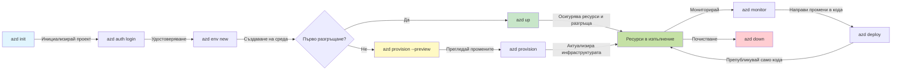

# Основи на AZD - Разбиране на Azure Developer CLI

# Основи на AZD - Основни концепции и принципи

**Навигация в главата:**
- **📚 Начало на курса**: [AZD за начинаещи](../../README.md)
- **📖 Текуща глава**: Глава 1 - Основи и бърз старт
- **⬅️ Предишна**: [Преглед на курса](../../README.md#-chapter-1-foundation--quick-start)
- **➡️ Следваща**: [Инсталация и настройка](installation.md)
- **🚀 Следваща глава**: [Глава 2: Разработка, ориентирана към AI](../chapter-02-ai-development/microsoft-foundry-integration.md)

## Въведение

Този урок ви запознава с Azure Developer CLI (azd), мощен инструмент от командния ред, който ускорява пътя ви от локална разработка до разгръщане в Azure. Ще научите основните концепции, ключовите функции и ще разберете как azd опростява разгръщането на приложения, нативни за облака.

## Цели на обучението

Към края на този урок ще:
- Разберете какво представлява Azure Developer CLI и каква е основната му цел
- Научите основните концепции за шаблони, среди и услуги
- Изследвате ключовите функции, включително разработка, базирана на шаблони, и Инфраструктура като код
- Разберете структурата на проекта azd и работния процес
- Бъдете подготвени да инсталирате и конфигурирате azd за вашата среда за разработка

## Резултати от обучението

След завършване на този урок ще можете да:
- Обясните ролята на azd в съвременните работни потоци за облачна разработка
- Идентифицирате компонентите на структурата на azd проект
- Описвате как шаблоните, средите и услугите работят заедно
- Разберете ползите от Инфраструктура като код с azd
- Разпознавате различни azd команди и тяхното предназначение

## Какво е Azure Developer CLI (azd)?

Azure Developer CLI (azd) е инструмент от командния ред, проектиран да ускори пътя ви от локална разработка до разгръщане в Azure. Той опростява процеса на изграждане, разгръщане и управление на приложения, нативни за облака, в Azure.

### 🎯 Защо да използвате AZD? Сравнение от реалния свят

Нека сравним разгръщането на просто уеб приложение с база данни:

#### ❌ БЕЗ AZD: Ръчно разгръщане в Azure (30+ минути)

```bash
# Стъпка 1: Създайте ресурсна група
az group create --name myapp-rg --location eastus

# Стъпка 2: Създайте план за App Service
az appservice plan create --name myapp-plan \
  --resource-group myapp-rg \
  --sku B1 --is-linux

# Стъпка 3: Създайте уеб приложение
az webapp create --name myapp-web-unique123 \
  --resource-group myapp-rg \
  --plan myapp-plan \
  --runtime "NODE:18-lts"

# Стъпка 4: Създайте акаунт в Cosmos DB (10-15 минути)
az cosmosdb create --name myapp-cosmos-unique123 \
  --resource-group myapp-rg \
  --kind MongoDB

# Стъпка 5: Създайте база данни
az cosmosdb mongodb database create \
  --account-name myapp-cosmos-unique123 \
  --resource-group myapp-rg \
  --name tododb

# Стъпка 6: Създайте колекция
az cosmosdb mongodb collection create \
  --account-name myapp-cosmos-unique123 \
  --resource-group myapp-rg \
  --database-name tododb \
  --name todos

# Стъпка 7: Вземете низ за връзка
CONN_STR=$(az cosmosdb keys list \
  --name myapp-cosmos-unique123 \
  --resource-group myapp-rg \
  --type connection-strings \
  --query "connectionStrings[0].connectionString" -o tsv)

# Стъпка 8: Конфигурирайте настройките на приложението
az webapp config appsettings set \
  --name myapp-web-unique123 \
  --resource-group myapp-rg \
  --settings MONGODB_URI="$CONN_STR"

# Стъпка 9: Активирайте логването
az webapp log config --name myapp-web-unique123 \
  --resource-group myapp-rg \
  --application-logging filesystem \
  --detailed-error-messages true

# Стъпка 10: Настройте Application Insights
az monitor app-insights component create \
  --app myapp-insights \
  --location eastus \
  --resource-group myapp-rg

# Стъпка 11: Свържете App Insights с уеб приложението
INSTRUMENTATION_KEY=$(az monitor app-insights component show \
  --app myapp-insights \
  --resource-group myapp-rg \
  --query "instrumentationKey" -o tsv)

az webapp config appsettings set \
  --name myapp-web-unique123 \
  --resource-group myapp-rg \
  --settings APPINSIGHTS_INSTRUMENTATIONKEY="$INSTRUMENTATION_KEY"

# Стъпка 12: Компилирайте приложението локално
npm install
npm run build

# Стъпка 13: Създайте пакет за разгръщане
zip -r app.zip . -x "*.git*" "node_modules/*"

# Стъпка 14: Разгърнете приложението
az webapp deployment source config-zip \
  --resource-group myapp-rg \
  --name myapp-web-unique123 \
  --src app.zip

# Стъпка 15: Чакайте и се молете да работи 🙏
# (Няма автоматична валидация, изисква се ръчно тестване)
```

**Проблеми:**
- ❌ 15+ команди, които трябва да запомните и изпълните в правилния ред
- ❌ 30-45 минути ръчна работа
- ❌ Лесно се правят грешки (печатарски грешки, грешни параметри)
- ❌ Стринговете за връзка са изложени в историята на терминала
- ❌ Няма автоматично връщане при грешка
- ❌ Трудно е да се възпроизведе за членове на екипа
- ❌ Всяки път е различно (не е възпроизводимо)

#### ✅ С AZD: Автоматизирано разгръщане (5 команди, 10-15 минути)

```bash
# Стъпка 1: Инициализиране от шаблон
azd init --template todo-nodejs-mongo

# Стъпка 2: Удостоверяване
azd auth login

# Стъпка 3: Създаване на среда
azd env new dev

# Стъпка 4: Преглед на промените (незадължително, но препоръчително)
azd provision --preview

# Стъпка 5: Разгръщане на всичко
azd up

# ✨ Готово! Всичко е разгърнато, конфигурирано и наблюдавано
```

**Ползи:**
- ✅ **5 команди** срещу 15+ ръчни стъпки
- ✅ **10-15 минути** общо време (главно чакане за Azure)
- ✅ **Нулеви грешки** - автоматизирано и тествано
- ✅ **Тайните се управляват сигурно** чрез Key Vault
- ✅ **Автоматично връщане** при провали
- ✅ **Напълно възпроизводимо** - същият резултат всеки път
- ✅ **Готово за екип** - всеки може да разположи с едни и същи команди
- ✅ **Инфраструктура като код** - Bicep шаблони под контрол на версиите
- ✅ **Вграден мониторинг** - Application Insights конфигуриран автоматично

### 📊 Време и намаляване на грешките

| Метрика | Ръчно разгръщане | Разгръщане с AZD | Подобрение |
|:-------|:------------------|:---------------|:------------|
| **Команди** | 15+ | 5 | 67% по-малко |
| **Време** | 30-45 мин | 10-15 мин | 60% по-бързо |
| **Честота на грешки** | ~40% | <5% | 88% намаление |
| **Съгласуваност** | Ниска (ръчно) | 100% (автоматизирано) | Перфектна |
| **Обучение на екип** | 2-4 часа | 30 минути | 75% по-бързо |
| **Време за възстановяване** | 30+ мин (ръчно) | 2 мин (автоматизирано) | 93% по-бързо |

## Основни концепции

### Шаблони
Шаблоните са основата на azd. Те съдържат:
- **Код на приложението** - Вашият изходен код и зависимости
- **Дефиниции на инфраструктурата** - Azure ресурси, дефинирани в Bicep или Terraform
- **Файлове с конфигурация** - Настройки и променливи на средата
- **Скриптове за разгръщане** - Автоматизирани работни потоци за разгръщане

### Среди
Средите представят различни цели за разгръщане:
- **Development** - За тестване и разработка
- **Staging** - Предпроизводствена среда
- **Production** - Жива продукционна среда

Всяка среда поддържа собствена:
- Azure resource group
- Конфигурационни настройки
- Състояние на разгръщането

### Услуги
Услугите са градивните елементи на вашето приложение:
- **Фронтенд** - Уеб приложения, SPA (едностранични приложения)
- **Бекенд** - API, микросервизи
- **База данни** - Решения за съхранение на данни
- **Съхранение** - Файлово и blob съхранение

## Ключови характеристики

### 1. Разработка, управлявана от шаблони
```bash
# Разгледайте наличните шаблони
azd template list

# Инициализирайте от шаблон
azd init --template <template-name>
```

### 2. Инфраструктура като код
- **Bicep** - домейн-специфичен език на Azure
- **Terraform** - инструмент за инфраструктура за множество облаци
- **ARM Templates** - шаблони на Azure Resource Manager

### 3. Интегрирани работни потоци
```bash
# Пълен работен процес за внедряване
azd up            # Осигуряване + Внедряване — това е без намеса при първоначалната настройка

# 🧪 НОВО: Преглед на промените в инфраструктурата преди внедряване (БЕЗОПАСНО)
azd provision --preview    # Симулирайте внедряване на инфраструктурата без да правите промени

azd provision     # Създайте Azure ресурси — ако актуализирате инфраструктурата, използвайте това
azd deploy        # Внедрете кода на приложението или го внедрете отново след актуализация
azd down          # Почистване на ресурси
```

#### 🛡️ Безопасно планиране на инфраструктурата с Preview
Командата `azd provision --preview` е ключова за безопасните разгръщания:
- **Dry-run анализ** - Показва какво ще бъде създадено, променено или изтрито
- **Нулев риск** - Внасят се никакви реални промени в вашата Azure среда
- **Сътрудничество в екип** - Споделяйте резултатите от прегледа преди разгръщане
- **Оценка на разходите** - Разберете разходите за ресурси преди ангажиране

```bash
# Примерен работен процес за преглед
azd provision --preview           # Вижте какво ще се промени
# Прегледайте резултата, обсъдете с екипа
azd provision                     # Прилагайте промените с увереност
```

### 📊 Визуално: Работен процес за разработка с AZD


**Обяснение на работния процес:**
1. **Init** - Започнете със шаблон или нов проект
2. **Auth** - Удостоверяване в Azure
3. **Environment** - Създайте изолирана среда за разгръщане
4. **Preview** - 🆕 Винаги преглеждайте промените в инфраструктурата първо (безопасна практика)
5. **Provision** - Създаване/актуализиране на Azure ресурси
6. **Deploy** - Избутайте кода на приложението си
7. **Monitor** - Наблюдавайте производителността на приложението
8. **Iterate** - Правете промени и повторно разгръщайте кода
9. **Cleanup** - Премахнете ресурсите, когато сте готови

### 4. Управление на среди
```bash
# Създаване и управление на среди
azd env new <environment-name>
azd env select <environment-name>
azd env list
```

## 📁 Структура на проекта

Типична структура на azd проект:
```
my-app/
├── .azd/                    # azd configuration
│   └── config.json
├── .azure/                  # Azure deployment artifacts
├── .devcontainer/          # Development container config
├── .github/workflows/      # GitHub Actions
├── .vscode/               # VS Code settings
├── infra/                 # Infrastructure code
│   ├── main.bicep        # Main infrastructure template
│   ├── main.parameters.json
│   └── modules/          # Reusable modules
├── src/                  # Application source code
│   ├── api/             # Backend services
│   └── web/             # Frontend application
├── azure.yaml           # azd project configuration
└── README.md
```

## 🔧 Файлове за конфигурация

### azure.yaml
Основният файл за конфигурация на проекта:
```yaml
name: my-awesome-app
metadata:
  template: my-template@1.0.0

services:
  web:
    project: ./src/web
    language: js
    host: appservice
  api:
    project: ./src/api
    language: js
    host: appservice

hooks:
  preprovision:
    shell: pwsh
    run: echo "Preparing to provision..."
```

### .azure/config.json
Конфигурация, специфична за средата:
```json
{
  "version": 1,
  "defaultEnvironment": "dev",
  "environments": {
    "dev": {
      "subscriptionId": "your-subscription-id",
      "location": "eastus"
    }
  }
}
```

## 🎪 Общи работни потоци с практически упражнения

> **💡 Съвет за учене:** Следвайте тези упражнения в ред, за да изградите уменията си с AZD постепенно.

### 🎯 Упражнение 1: Инициализирайте първия си проект

**Цел:** Създайте AZD проект и разгледайте неговата структура

**Стъпки:**
```bash
# Използвайте проверен шаблон
azd init --template todo-nodejs-mongo

# Разгледайте генерираните файлове
ls -la  # Прегледайте всички файлове, включително скритите

# Създадени ключови файлове:
# - azure.yaml (основна конфигурация)
# - infra/ (инфраструктурен код)
# - src/ (код на приложението)
```

**✅ Успех:** Имате azure.yaml, infra/ и src/ директории

---

### 🎯 Упражнение 2: Разгръщане в Azure

**Цел:** Извършете край-до-край разгръщане

**Стъпки:**
```bash
# 1. Удостоверяване
az login && azd auth login

# 2. Създаване на среда
azd env new dev
azd env set AZURE_LOCATION eastus

# 3. Преглед на промените (ПРЕПОРЪЧИТЕЛНО)
azd provision --preview

# 4. Разгръщане на всичко
azd up

# 5. Проверка на разгръщането
azd show    # Вижте URL адреса на вашето приложение
```

**Очаквано време:** 10-15 минути  
**✅ Успех:** URL на приложението се отваря в браузъра

---

### 🎯 Упражнение 3: Множество среди

**Цел:** Разгръщане в dev и staging

**Стъпки:**
```bash
# Вече имате dev, създайте staging
azd env new staging
azd env set AZURE_LOCATION westus2
azd up

# Превключвайте между тях
azd env list
azd env select dev
```

**✅ Успех:** Две отделни групи ресурси в Azure Portal

---

### 🛡️ Чист старт: `azd down --force --purge`

Когато трябва напълно да нулирате:

```bash
azd down --force --purge
```

**Какво прави:**
- `--force`: Без подкани за потвърждение
- `--purge`: Изтрива цялото локално състояние и Azure ресурси

**Използвайте когато:**
- Ако разгръщането се провали по средата
- Смяна на проекти
- Необходим е чист старт

---

## 🎪 Оригинална справка за работния процес

### Стартиране на нов проект
```bash
# Метод 1: Използвайте съществуващ шаблон
azd init --template todo-nodejs-mongo

# Метод 2: Започнете от нулата
azd init

# Метод 3: Използвайте текущата директория
azd init .
```

### Цикъл на разработка
```bash
# Настройте средата за разработка
azd auth login
azd env new dev
azd env select dev

# Разположете всичко
azd up

# Направете промени и разположете отново
azd deploy

# Почистете след като приключите
azd down --force --purge # Командата в Azure Developer CLI е **твърдо нулиране** за вашата среда—особено полезна, когато отстранявате неизправности при неуспешни разполагания, изчиствате изоставени ресурси или се подготвяте за ново разполагане.
```

## Разбиране на `azd down --force --purge`
Командата `azd down --force --purge` е мощен начин да изтриете напълно вашата azd среда и всички свързани ресурси. Ето разбивка на това какво прави всеки флаг:
```
--force
```
- Пропуска подкани за потвърждение.
- Полезно за автоматизация или скриптиране, където ръчен вход не е възможен.
- Гарантира, че премахването продължава без прекъсване, дори ако CLI открие несъответствия.

```
--purge
```
Изтрива **всички свързани метаданни**, включително:
Състояние на средата
Локална папка `.azure`
Кеширана информация за разгръщане
Предотвратява azd да "запомня" предишни разгръщания, което може да причини проблеми като несъответстващи групи ресурси или остарели референции към регистъра.

### Защо да използвате и двете?
Когато сте блокирани при `azd up` поради останало състояние или частични разгръщания, тази комбинация осигурява **чист старт**.

Това е особено полезно след ръчни изтривания на ресурси в Azure портала или при смяна на шаблони, среди или конвенции за именуване на групи ресурси.

### Управление на множество среди
```bash
# Създаване на staging среда
azd env new staging
azd env select staging
azd up

# Превключете обратно на dev
azd env select dev

# Сравнете средите
azd env list
```

## 🔐 Удостоверяване и идентификационни данни

Разбирането на удостоверяването е от решаващо значение за успешни разгръщания с azd. Azure използва множество методи за удостоверяване, а azd използва същата верига от идентификационни механизми, използвана от другите инструменти на Azure.

### Удостоверяване с Azure CLI (`az login`)

Преди да използвате azd, трябва да се удостоверите в Azure. Най-често използваният метод е чрез Azure CLI:

```bash
# Интерактивно влизане (отваря браузър)
az login

# Влизане с конкретен тенант
az login --tenant <tenant-id>

# Влизане с идентичността на услугата (service principal)
az login --service-principal -u <app-id> -p <password> --tenant <tenant-id>

# Проверка на текущия статус на влизане
az account show

# Изброяване на наличните абонаменти
az account list --output table

# Задаване на абонамент по подразбиране
az account set --subscription <subscription-id>
```

### Поток на удостоверяване
1. **Интерактивно влизане**: Отваря вашия браузър по подразбиране за удостоверяване
2. **Device Code Flow**: За среди без достъп до браузър
3. **Service Principal**: За сценарии за автоматизация и CI/CD
4. **Managed Identity**: За приложения, хоствани в Azure

### Верига DefaultAzureCredential

`DefaultAzureCredential` е тип идентификационни данни, който предоставя опростено изживяване при удостоверяване, като автоматично опитва няколко източника на идентификационни данни в определен ред:

#### Ред на веригата от идентификационни данни

#### 1. Променливи на средата
```bash
# Задаване на променливи на средата за служебен акаунт
export AZURE_CLIENT_ID="<app-id>"
export AZURE_CLIENT_SECRET="<password>"
export AZURE_TENANT_ID="<tenant-id>"
```

#### 2. Workload Identity (Kubernetes/GitHub Actions)
Използва се автоматично в:
- Azure Kubernetes Service (AKS) с Workload Identity
- GitHub Actions с OIDC федерация
- Други сценарии с федеративна идентичност

#### 3. Managed Identity
За Azure ресурси като:
- Виртуални машини
- App Service
- Azure Functions
- Container Instances

```bash
# Проверява дали се изпълнява на Azure ресурс с управлявана идентичност
az account show --query "user.type" --output tsv
# Връща: "servicePrincipal", ако използва управлявана идентичност
```

#### 4. Интеграция с инструменти за разработчици
- **Visual Studio**: Автоматично използва влезлия в профила акаунт
- **VS Code**: Използва креденшълите от разширението Azure Account
- **Azure CLI**: Използва креденшълите от `az login` (най-често за локална разработка)

### Настройка на удостоверяване за AZD

```bash
# Метод 1: Използвайте Azure CLI (Препоръчително за разработка)
az login
azd auth login  # Използва съществуващи идентификационни данни на Azure CLI

# Метод 2: Директно удостоверяване на azd
azd auth login --use-device-code  # За среди без графичен интерфейс

# Метод 3: Проверка на състоянието на удостоверяването
azd auth login --check-status

# Метод 4: Изход и повторно удостоверяване
azd auth logout
azd auth login
```

### Най-добри практики за удостоверяване

#### За локална разработка
```bash
# 1. Влезте с Azure CLI
az login

# 2. Проверете правилния абонамент
az account show
az account set --subscription "Your Subscription Name"

# 3. Използвайте azd със съществуващи идентификационни данни
azd auth login
```

#### За CI/CD конвейри
```yaml
# GitHub Actions example
- name: Azure Login
  uses: azure/login@v1
  with:
    creds: ${{ secrets.AZURE_CREDENTIALS }}

- name: Deploy with azd
  run: |
    azd auth login --client-id ${{ secrets.AZURE_CLIENT_ID }} \
                    --client-secret ${{ secrets.AZURE_CLIENT_SECRET }} \
                    --tenant-id ${{ secrets.AZURE_TENANT_ID }}
    azd up --no-prompt
```

#### За продукционни среди
- Използвайте **Managed Identity** при изпълнение на Azure ресурси
- Използвайте **Service Principal** за сценарии за автоматизация
- Избягвайте съхраняване на идентификационни данни в кода или конфигурационните файлове
- Използвайте **Azure Key Vault** за чувствителни конфигурации

### Чести проблеми с удостоверяването и решения

#### Проблем: "Не е намерен абонамент"
```bash
# Решение: Задайте абонамент по подразбиране
az account list --output table
az account set --subscription "<subscription-id>"
azd env set AZURE_SUBSCRIPTION_ID "<subscription-id>"
```

#### Проблем: "Недостатъчни права"
```bash
# Решение: Проверете и присвоете необходимите роли
az role assignment list --assignee $(az account show --query user.name --output tsv)

# Общи необходими роли:
# - Contributor (за управление на ресурси)
# - User Access Administrator (за присвояване на роли)
```

#### Проблем: "Токенът е изтекъл"
```bash
# Решение: Повторно удостоверяване
az logout
az login
azd auth logout
azd auth login
```

### Удостоверяване в различни сценарии

#### Локална разработка
```bash
# Акаунт за личностно развитие
az login
azd auth login
```

#### Екипна разработка
```bash
# Използвайте конкретен тенант за организацията
az login --tenant contoso.onmicrosoft.com
azd auth login
```

#### Мулти-тенантни сценарии
```bash
# Превключване между наематели
az login --tenant tenant1.onmicrosoft.com
# Разгръщане към наемател 1
azd up

az login --tenant tenant2.onmicrosoft.com  
# Разгръщане към наемател 2
azd up
```

### Съображения за сигурност

1. **Съхранение на идентификационни данни**: Никога не съхранявайте идентификационни данни в изходния код
2. **Ограничаване на обхвата**: Използвайте принципа за най-малко привилегии за service principals
3. **Ротация на токени**: Редовно сменяйте тайните на service principal
4. **Одитна следа**: Наблюдавайте дейностите по удостоверяване и разгръщане
5. **Мрежова сигурност**: Използвайте частни крайни точки, когато е възможно

### Отстраняване на проблеми с удостоверяването

```bash
# Отстраняване на проблеми с удостоверяването
azd auth login --check-status
az account show
az account get-access-token

# Често използвани диагностични команди
whoami                          # Текущ контекст на потребителя
az ad signed-in-user show      # Подробности за потребителя в Azure AD
az group list                  # Тествай достъпа до ресурса
```

## Разбиране на `azd down --force --purge`

### Откриване
```bash
azd template list              # Разгледайте шаблоните
azd template show <template>   # Детайли за шаблона
azd init --help               # Опции за инициализация
```

### Управление на проекти
```bash
azd show                     # Преглед на проекта
azd env show                 # Текуща среда
azd config list             # Настройки на конфигурацията
```

### Мониторинг
```bash
azd monitor                  # Отворете мониторинга в портала на Azure
azd monitor --logs           # Прегледайте логовете на приложението
azd monitor --live           # Прегледайте живите метрики
azd pipeline config          # Настройте CI/CD
```

## Най-добри практики

### 1. Използвайте смислени имена
```bash
# Добре
azd env new production-east
azd init --template web-app-secure

# Избягвайте
azd env new env1
azd init --template template1
```

### 2. Използвайте шаблони
- Започнете с налични шаблони
- Персонализирайте според вашите нужди
- Създавайте многократно използваеми шаблони за вашата организация

### 3. Изолация на средите
- Използвайте отделни среди за dev/staging/prod
- Никога не разгръщайте директно в продукция от локална машина
- Използвайте CI/CD конвейри за разгръщания в продукция

### 4. Управление на конфигурацията
- Използвайте променливи на средата за чувствителни данни
- Дръжте конфигурацията в система за контрол на версиите
- Документирайте настройки, специфични за средата

## Напредък в обучението

### Начинаещи (Седмица 1-2)
1. Инсталирайте azd и се удостоверете
2. Разгърнете прост шаблон
3. Разберете структурата на проекта
4. Научете основни команди (up, down, deploy)

### Средно ниво (Седмица 3-4)
1. Персонализирайте шаблони
2. Управлявайте множество среди
3. Разберете кода на инфраструктурата
4. Настройте CI/CD конвейри

### Напреднали (Седмица 5+)
1. Създавайте персонализирани шаблони
2. Разширени инфраструктурни модели
3. Разгръщания в множество региони
4. Конфигурации от корпоративно ниво

## Следващи стъпки

**📖 Продължете изучаването на Глава 1:**
- [Инсталиране и настройка](installation.md) - Инсталирайте и конфигурирайте azd
- [Вашият първи проект](first-project.md) - Пълно практическо ръководство
- [Ръководство за конфигурация](configuration.md) - Разширени опции за конфигуриране

**🎯 Готови за следващата глава?**
- [Глава 2: Разработка, ориентирана към ИИ](../chapter-02-ai-development/microsoft-foundry-integration.md) - Започнете да създавате приложения с ИИ

## Допълнителни ресурси

- [Преглед на Azure Developer CLI](https://learn.microsoft.com/en-us/azure/developer/azure-developer-cli/)
- [Галерия с шаблони](https://azure.github.io/awesome-azd/)
- [Примери от общността](https://github.com/Azure-Samples)

---

## 🙋 Често задавани въпроси

### Общи въпроси

**Q: Каква е разликата между AZD и Azure CLI?**

A: Azure CLI (`az`) се използва за управление на отделни ресурси в Azure. AZD (`azd`) се използва за управление на цели приложения:

```bash
# Azure CLI - Управление на ресурси на ниско ниво
az webapp create --name myapp --resource-group rg
az sql server create --name myserver --resource-group rg
# ...необходими са още много команди

# AZD - Управление на ниво приложение
azd up  # Разгръща цялото приложение с всички ресурси
```

**Мислете за това по следния начин:**
- `az` = Работа с отделни Lego тухлички
- `azd` = Работа с пълни комплекти Lego

---

**Q: Трябва ли да познавам Bicep или Terraform, за да използвам AZD?**

A: Не! Започнете с шаблони:
```bash
# Използвайте съществуващ шаблон - не са необходими знания по IaC
azd init --template todo-nodejs-mongo
azd up
```

Можете да научите Bicep по-късно, за да персонализирате инфраструктурата. Шаблоните предоставят работещи примери, от които да учите.

---

**Q: Колко струва изпълнението на AZD шаблони?**

A: Разходите варират в зависимост от шаблона. Повечето шаблони за разработка струват $50-150/месец:

```bash
# Прегледайте разходите преди разгръщане
azd provision --preview

# Винаги почиствайте, когато не го използвате
azd down --force --purge  # Премахва всички ресурси
```

**Професионален съвет:** Използвайте безплатните нива, където са налични:
- App Service: F1 (безплатен) план
- Azure OpenAI: 50,000 токена/месец безплатно
- Cosmos DB: 1000 RU/s безплатен слой

---

**Q: Мога ли да използвам AZD с вече съществуващи Azure ресурси?**

A: Да, но е по-лесно да започнете наново. AZD работи най-добре, когато управлява целия жизнен цикъл. За вече съществуващи ресурси:

```bash
# Опция 1: Импортиране на съществуващи ресурси (за напреднали)
azd init
# След това променете infra/, за да се позовава на съществуващи ресурси

# Опция 2: Започнете отначало (препоръчително)
azd init --template matching-your-stack
azd up  # Създава нова среда
```

---

**Q: Как да споделя проекта си с колеги?**

A: Комитнете AZD проекта в Git (но НЕ папката `.azure/`):

```bash
# Вече е в .gitignore по подразбиране
.azure/        # Съдържа тайни и данни за средата
*.env          # Променливи на средата

# Членове на екипа тогава:
git clone <your-repo>
azd auth login
azd env new <their-name>-dev
azd up
```

Всеки получава една и съща инфраструктура от същите шаблони.

---

### Въпроси за отстраняване на проблеми

**Q: "azd up" се провали наполовина. Какво да направя?**

A: Проверете грешката, коригирайте я, и опитайте отново:

```bash
# Преглед на подробни дневници
azd show

# Чести поправки:

# 1. Ако квотата е превишена:
azd env set AZURE_LOCATION "westus2"  # Опитайте друг регион

# 2. Ако има конфликт на името на ресурса:
azd down --force --purge  # Изчистете всичко
azd up  # Опитайте отново

# 3. Ако удостоверяването е изтекло:
az login
azd auth login
azd up
```

**Най-често срещан проблем:** Неправилно избран абонамент в Azure
```bash
az account list --output table
az account set --subscription "<correct-subscription>"
```

---

**Q: Как да разгръщам само промените в кода без повторно разполагане на инфраструктурата?**

A: Използвайте `azd deploy` вместо `azd up`:

```bash
azd up          # Първи път: провизиране + разгръщане (бавно)

# Направете промени в кода...

azd deploy      # Следващи пъти: само разгръщане (бързо)
```

Сравнение на скоростта:
- `azd up`: 10-15 minutes (предоставя инфраструктура)
- `azd deploy`: 2-5 minutes (само код)

---

**Q: Мога ли да персонализирам инфраструктурните шаблони?**

A: Да! Редактирайте Bicep файловете в `infra/`:

```bash
# След azd init
cd infra/
code main.bicep  # Редактирайте в VS Code

# Прегледайте промените
azd provision --preview

# Приложете промените
azd provision
```

**Съвет:** Започнете с малко - променете първо SKU-та:
```bicep
// infra/main.bicep
sku: {
  name: 'B1'  // Change to 'P1V2' for production
}
```

---

**Q: Как да изтрия всичко, което AZD е създало?**

A: Една команда премахва всички ресурси:

```bash
azd down --force --purge

# Това изтрива:
# - Всички ресурси в Azure
# - Ресурсна група
# - Локално състояние на средата
# - Кеширани данни за внедряване
```

**Винаги изпълнявайте това когато:**
- Завършихте тестване на шаблон
- Превключвате към друг проект
- Искате да започнете отначало

**Спестяване на разходи:** Изтриването на неизползвани ресурси = $0 разходи

---

**Q: Какво се случва, ако по погрешка изтрия ресурси в Azure Portal?**

A: Състоянието на AZD може да се разминава. Подход за чист старт:

```bash
# 1. Премахнете локалното състояние
azd down --force --purge

# 2. Започнете на чисто
azd up

# Алтернатива: Нека AZD открие и поправи
azd provision  # Ще създаде липсващите ресурси
```

---

### Разширени въпроси

**Q: Мога ли да използвам AZD в CI/CD пайплайни?**

A: Да! Пример с GitHub Actions:

```yaml
# .github/workflows/deploy.yml
name: Deploy with AZD

on:
  push:
    branches: [main]

jobs:
  deploy:
    runs-on: ubuntu-latest
    steps:
      - uses: actions/checkout@v2
      
      - name: Install azd
        run: curl -fsSL https://aka.ms/install-azd.sh | bash
      
      - name: Azure Login
        run: |
          azd auth login \
            --client-id ${{ secrets.AZURE_CLIENT_ID }} \
            --client-secret ${{ secrets.AZURE_CLIENT_SECRET }} \
            --tenant-id ${{ secrets.AZURE_TENANT_ID }}
      
      - name: Deploy
        run: azd up --no-prompt
```

---

**Q: Как да управлявам секрети и чувствителни данни?**

A: AZD се интегрира автоматично с Azure Key Vault:

```bash
# Тайните се съхраняват в Key Vault, а не в кода
azd env set DATABASE_PASSWORD "$(openssl rand -base64 32)"

# AZD автоматично:
# 1. Създава Key Vault
# 2. Съхранява тайна
# 3. Предоставя на приложението достъп чрез Managed Identity
# 4. Инжектира по време на изпълнение
```

**Никога не комитвайте:**
- `.azure/` папка (съдържа данни за средата)
- `.env` файлове (локални секрети)
- Низове за връзка

---

**Q: Мога ли да разположа в множество региони?**

A: Да, създайте среда за всеки регион:

```bash
# Околна среда в Източните САЩ
azd env new prod-eastus
azd env set AZURE_LOCATION eastus
azd up

# Околна среда в Западна Европа
azd env new prod-westeurope
azd env set AZURE_LOCATION westeurope
azd up

# Всяка среда е независима
azd env list
```

За истински мултирегионални приложения, персонализирайте Bicep шаблоните, за да ги разположите в множество региони едновременно.

---

**Q: Къде мога да получа помощ, ако имам затруднения?**

1. **Документация на AZD:** https://learn.microsoft.com/azure/developer/azure-developer-cli/
2. **GitHub Issues:** https://github.com/Azure/azure-dev/issues
3. **Discord:** [Azure Discord](https://discord.gg/microsoft-azure) - канал #azure-developer-cli
4. **Stack Overflow:** Таг `azure-developer-cli`
5. **Този курс:** [Ръководство за отстраняване на проблеми](../chapter-07-troubleshooting/common-issues.md)

**Професионален съвет:** Преди да питате, изпълнете:
```bash
azd show       # Показва текущото състояние
azd version    # Показва вашата версия
```
Включете тази информация в въпроса си за по-бърза помощ.

---

## 🎓 Какво следва?

Сега разбирате основите на AZD. Изберете своя път:

### 🎯 За начинаещи:
1. **Следва:** [Инсталиране и настройка](installation.md) - Инсталирайте AZD на вашата машина
2. **След това:** [Вашият първи проект](first-project.md) - Разположете първото си приложение
3. **Практика:** Изпълнете всичките 3 упражнения в този урок

### 🚀 За AI разработчици:
1. **Прескочете към:** [Глава 2: Разработка, ориентирана към ИИ](../chapter-02-ai-development/microsoft-foundry-integration.md)
2. **Разгръщане:** Започнете с `azd init --template get-started-with-ai-chat`
3. **Научете:** Изграждайте, докато разгръщате

### 🏗️ За напреднали разработчици:
1. **Преглед:** [Ръководство за конфигурация](configuration.md) - Разширени настройки
2. **Разгледайте:** [Инфраструктура като код](../chapter-04-infrastructure/provisioning.md) - Задълбочено изучаване на Bicep
3. **Изградете:** Създайте персонализирани шаблони за вашия стек

---

**Навигация в главите:**
- **📚 Начало на курса**: [AZD за начинаещи](../../README.md)
- **📖 Текуща глава**: Глава 1 - Основи и бърз старт  
- **⬅️ Предишна**: [Преглед на курса](../../README.md#-chapter-1-foundation--quick-start)
- **➡️ Следваща**: [Инсталиране и настройка](installation.md)
- **🚀 Следваща глава**: [Глава 2: Разработка, ориентирана към ИИ](../chapter-02-ai-development/microsoft-foundry-integration.md)

---

<!-- CO-OP TRANSLATOR DISCLAIMER START -->
Отказ от отговорност:
Този документ е преведен с помощта на услуга за превод, използваща изкуствен интелект — Co‑op Translator (https://github.com/Azure/co-op-translator). Въпреки че се стремим към точност, моля, имайте предвид, че автоматизираните преводи могат да съдържат грешки или неточности. Оригиналният документ на оригиналния език трябва да се счита за авторитетен източник. За критична информация се препоръчва професионален човешки превод. Не носим отговорност за каквито и да е недоразумения или погрешни тълкувания, произтичащи от използването на този превод.
<!-- CO-OP TRANSLATOR DISCLAIMER END -->