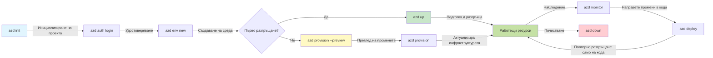

# AZD Basics - Разбиране на Azure Developer CLI

# AZD Basics - Основни концепции и основи

**Навигация в главата:**
- **📚 Начало на курса**: [AZD For Beginners](../../README.md)
- **📖 Текуща глава**: Глава 1 - Основи и бърз старт
- **⬅️ Предишна**: [Преглед на курса](../../README.md#-chapter-1-foundation--quick-start)
- **➡️ Следваща**: [Инсталация и настройка](installation.md)
- **🚀 Следваща глава**: [Глава 2: AI-първо разработване](../chapter-02-ai-development/microsoft-foundry-integration.md)

## Въведение

Този урок ви запознава с Azure Developer CLI (azd) — мощен инструмент за команден ред, който ускорява вашето пътуване от локална разработка до разполагане в Azure. Ще научите основните концепции, ключовите функции и ще разберете как azd опростява разполагането на облачно-родени приложения.

## Цели на обучението

Към края на този урок ще:
- Разберете какво представлява Azure Developer CLI и неговата основна цел
- Научите основните концепции за шаблони, среди и услуги
- Изследвате ключови функции, включително разработка, базирана на шаблони, и Infrastructure as Code
- Разберете структурата на azd проекта и работния поток
- Бъдете подготвени да инсталирате и конфигурирате azd за вашата среда за разработка

## Резултати от обучението

След завършване на този урок ще можете да:
- Обясните ролята на azd в съвременните облачни работни потоци за разработка
- Идентифицирате компонентите на структурата на azd проект
- Описвате как шаблоните, средите и услугите работят заедно
- Разберете ползите от Infrastructure as Code с azd
- Разпознавате различни azd команди и тяхната цел

## Какво е Azure Developer CLI (azd)?

Azure Developer CLI (azd) е инструмент за команден ред, проектиран да ускори вашето пътуване от локална разработка до разполагане в Azure. Той опростява процеса на изграждане, разполагане и управление на облачно-родени приложения в Azure.

### Какво можете да разположите с azd?

azd поддържа широк кръг от натоварвания — и списъкът продължава да расте. Днес можете да използвате azd за разполагане на:

| Тип натоварване | Примери | Същ работен процес? |
|---------------|----------|----------------|
| **Традиционни приложения** | Уеб приложения, REST API, статични сайтове | ✅ `azd up` |
| **Услуги и микросървиси** | Container Apps, Function Apps, бекенди с множество услуги | ✅ `azd up` |
| **Приложения с изкуствен интелект** | Чат приложения с Microsoft Foundry Models, RAG решения с AI Search | ✅ `azd up` |
| **Интелигентни агенти** | Агенти, хоствани във Foundry, оркестрации с множество агенти | ✅ `azd up` |

Ключовото прозрение е, че **жизненият цикъл на azd остава еднакъв независимо от това какво разполагате**. Инициализирате проект, осигурявате инфраструктура, деплойвате кода си, наблюдавате приложението и почиствате — дали става въпрос за прост уебсайт или сложен AI агент.

Тази последователност е по дизайн. azd третира AI възможностите като още един вид услуга, която вашето приложение може да използва, а не като нещо принципно различно. Чат крайна точка, подсигурена от Microsoft Foundry Models, от гледна точка на azd е просто още една услуга за конфигуриране и разполагане.

### 🎯 Защо да използваме AZD? Сравнение от реалния свят

Нека сравним разполагането на просто уеб приложение с база данни:

#### ❌ БЕЗ AZD: Ръчно разполагане в Azure (30+ минути)

```bash
# Стъпка 1: Създаване на ресурсна група
az group create --name myapp-rg --location eastus

# Стъпка 2: Създаване на App Service план
az appservice plan create --name myapp-plan \
  --resource-group myapp-rg \
  --sku B1 --is-linux

# Стъпка 3: Създаване на уеб приложение
az webapp create --name myapp-web-unique123 \
  --resource-group myapp-rg \
  --plan myapp-plan \
  --runtime "NODE:18-lts"

# Стъпка 4: Създаване на Cosmos DB акаунт (10-15 минути)
az cosmosdb create --name myapp-cosmos-unique123 \
  --resource-group myapp-rg \
  --kind MongoDB

# Стъпка 5: Създаване на база данни
az cosmosdb mongodb database create \
  --account-name myapp-cosmos-unique123 \
  --resource-group myapp-rg \
  --name tododb

# Стъпка 6: Създаване на колекция
az cosmosdb mongodb collection create \
  --account-name myapp-cosmos-unique123 \
  --resource-group myapp-rg \
  --database-name tododb \
  --name todos

# Стъпка 7: Получаване на низ за връзка
CONN_STR=$(az cosmosdb keys list \
  --name myapp-cosmos-unique123 \
  --resource-group myapp-rg \
  --type connection-strings \
  --query "connectionStrings[0].connectionString" -o tsv)

# Стъпка 8: Конфигуриране на настройки на приложението
az webapp config appsettings set \
  --name myapp-web-unique123 \
  --resource-group myapp-rg \
  --settings MONGODB_URI="$CONN_STR"

# Стъпка 9: Активиране на логиране
az webapp log config --name myapp-web-unique123 \
  --resource-group myapp-rg \
  --application-logging filesystem \
  --detailed-error-messages true

# Стъпка 10: Настройване на Application Insights
az monitor app-insights component create \
  --app myapp-insights \
  --location eastus \
  --resource-group myapp-rg

# Стъпка 11: Свързване на App Insights с уеб приложението
INSTRUMENTATION_KEY=$(az monitor app-insights component show \
  --app myapp-insights \
  --resource-group myapp-rg \
  --query "instrumentationKey" -o tsv)

az webapp config appsettings set \
  --name myapp-web-unique123 \
  --resource-group myapp-rg \
  --settings APPINSIGHTS_INSTRUMENTATIONKEY="$INSTRUMENTATION_KEY"

# Стъпка 12: Изграждане на приложението локално
npm install
npm run build

# Стъпка 13: Създаване на пакет за разгръщане
zip -r app.zip . -x "*.git*" "node_modules/*"

# Стъпка 14: Разгръщане на приложението
az webapp deployment source config-zip \
  --resource-group myapp-rg \
  --name myapp-web-unique123 \
  --src app.zip

# Стъпка 15: Изчакайте и се молете да проработи 🙏
# (Няма автоматизирана валидация, изисква се ръчно тестване)
```

**Проблеми:**
- ❌ 15+ команди за запомняне и изпълнение в правилния ред
- ❌ 30-45 минути ръчна работа
- ❌ Лесно е да се допуснат грешки (печатни грешки, грешни параметри)
- ❌ Низовете за връзка са изложени в историята на терминала
- ❌ Няма автоматично връщане назад при провал
- ❌ Трудно за възпроизвеждане от членове на екипа
- ❌ Различно всеки път (не е възпроизводимо)

#### ✅ С AZD: Автоматизирано разполагане (5 команди, 10-15 минути)

```bash
# Стъпка 1: Инициализиране от шаблон
azd init --template todo-nodejs-mongo

# Стъпка 2: Удостоверяване
azd auth login

# Стъпка 3: Създаване на среда
azd env new dev

# Стъпка 4: Преглед на промените (по избор, но препоръчително)
azd provision --preview

# Стъпка 5: Разгръщане на всичко
azd up

# ✨ Готово! Всичко е разгрънато, конфигурирано и се наблюдава
```

**Ползи:**
- ✅ **5 команди** срещу 15+ ръчни стъпки
- ✅ **10-15 минути** общо време (повечето чакане за Azure)
- ✅ **Нулеви грешки** - автоматизирано и тествано
- ✅ **Тайни управлявани сигурно** чрез Key Vault
- ✅ **Автоматично връщане назад** при неуспехи
- ✅ **Напълно възпроизводимо** - същият резултат всеки път
- ✅ **Готово за екип** - всеки може да разположи със същите команди
- ✅ **Инфраструктура като код** - Bicep шаблони под версионен контрол
- ✅ **Вграден мониторинг** - Application Insights конфигуриран автоматично

### 📊 Намаляване на време и грешки

| Метрика | Ръчно разполагане | AZD разполагане | Подобрение |
|:-------|:------------------|:---------------|:------------|
| **Команди** | 15+ | 5 | 67% по-малко |
| **Време** | 30-45 мин | 10-15 мин | 60% по-бързо |
| **Процент грешки** | ~40% | <5% | 88% намаление |
| **Последователност** | Ниска (ръчно) | 100% (автоматизирано) | Перфектно |
| **Въвеждане на екип** | 2-4 часа | 30 минути | 75% по-бързо |
| **Време за връщане назад** | 30+ мин (ръчно) | 2 мин (автоматизирано) | 93% по-бързо |

## Основни концепции

### Шаблони
Шаблоните са основата на azd. Те съдържат:
- **Код на приложението** - Вашият изходен код и зависимости
- **Дефиниции на инфраструктурата** - Ресурси в Azure, дефинирани в Bicep или Terraform
- **Файлове за конфигурация** - Настройки и променливи на средата
- **Скриптове за разполагане** - Автоматизирани работни потоци за разполагане

### Околни среди
Среди представляват различни цели за разполагане:
- **Development** - За тестове и разработка
- **Staging** - Предпроизводствена среда
- **Production** - Жива продукционна среда

Всяка среда поддържа собствена:
- ресурсна група в Azure
- настройки за конфигурация
- състояние на разполагането

### Услуги
Услугите са сградните блокове на вашето приложение:
- **Frontend** - Уеб приложения, SPA
- **Backend** - API, микросървиси
- **Database** - С решения за съхранение на данни
- **Storage** - Файлово и blob съхранение

## Ключови функции

### 1. Разработка, базирана на шаблони
```bash
# Преглед на наличните шаблони
azd template list

# Инициализиране от шаблон
azd init --template <template-name>
```

### 2. Инфраструктура като код
- **Bicep** - език, специфичен за домейна на Azure
- **Terraform** - инструмент за инфраструктура за множество облаци
- **ARM Templates** - шаблони на Azure Resource Manager

### 3. Интегрирани работни потоци
```bash
# Пълен работен процес за разгръщане
azd up            # Осигуряване + Разгръщане — това е автоматично за първоначална настройка

# 🧪 НОВО: Прегледайте промените в инфраструктурата преди разгръщане (БЕЗОПАСНО)
azd provision --preview    # Симулирайте разгръщането на инфраструктурата без да правите промени

azd provision     # Създайте Azure ресурси — ако актуализирате инфраструктурата, използвайте това
azd deploy        # Разположете кода на приложението или го разположете отново след актуализация
azd down          # Премахнете ресурсите
```

#### 🛡️ Сигурно планиране на инфраструктурата с Preview
Командата `azd provision --preview` е промяната в играта за сигурни разполагания:
- **Dry-run анализ** - Показва какво ще бъде създадено, променено или изтрито
- **Нулев риск** - Няма реални промени в Azure средата ви
- **Екипна колаборация** - Споделяйте резултатите от preview преди разполагане
- **Оценка на разходите** - Разберете разходите за ресурси преди ангажимент

```bash
# Примерен работен процес за преглед
azd provision --preview           # Вижте какво ще се промени
# Прегледайте резултата, обсъдете с екипа
azd provision                     # Приложете промените с увереност
```

### 📊 Визуализация: Работен процес на AZD


**Обяснение на работния процес:**
1. **Init** - Стартирайте с шаблон или нов проект
2. **Auth** - Удостоверете се в Azure
3. **Environment** - Създайте изолирана среда за разполагане
4. **Preview** - 🆕 Винаги първо преглеждайте промените в инфраструктурата (безопасна практика)
5. **Provision** - Създайте/актуализирайте Azure ресурсите
6. **Deploy** - Натиснете кода на вашето приложение
7. **Monitor** - Наблюдавайте производителността на приложението
8. **Iterate** - Правете промени и повторно разполагайте кода
9. **Cleanup** - Премахнете ресурсите, когато сте готови

### 4. Управление на среди
```bash
# Създаване и управление на среди
azd env new <environment-name>
azd env select <environment-name>
azd env list
```

### 5. Разширения и AI команди

azd използва система от разширения, за да добавя възможности извън основния CLI. Това е особено полезно за AI натоварвания:

```bash
# Изброи наличните разширения
azd extension list

# Инсталирай разширението Foundry agents
azd extension install azure.ai.agents

# Инициализирай проект за AI агент от манифест
azd ai agent init -m agent-manifest.yaml

# Стартирай MCP сървъра за разработка с помощта на AI (Алфа)
azd mcp start
```

> Разширенията са разгледани подробно в [Глава 2: AI-първо разработване](../chapter-02-ai-development/agents.md) и референцията [AZD AI CLI Commands](../chapter-08-production/production-ai-practices.md#azd-ai-cli-commands-and-extensions).

## 📁 Структура на проекта

Типична структура на azd проект:
```
my-app/
├── .azd/                    # azd configuration
│   └── config.json
├── .azure/                  # Azure deployment artifacts
├── .devcontainer/          # Development container config
├── .github/workflows/      # GitHub Actions
├── .vscode/               # VS Code settings
├── infra/                 # Infrastructure code
│   ├── main.bicep        # Main infrastructure template
│   ├── main.parameters.json
│   └── modules/          # Reusable modules
├── src/                  # Application source code
│   ├── api/             # Backend services
│   └── web/             # Frontend application
├── azure.yaml           # azd project configuration
└── README.md
```

## 🔧 Файлове за конфигурация

### azure.yaml
Основният файл за конфигурация на проекта:
```yaml
name: my-awesome-app
metadata:
  template: my-template@1.0.0

services:
  web:
    project: ./src/web
    language: js
    host: appservice
  api:
    project: ./src/api
    language: js
    host: appservice

hooks:
  preprovision:
    shell: pwsh
    run: echo "Preparing to provision..."
```

### .azure/config.json
Конфигурация, специфична за средата:
```json
{
  "version": 1,
  "defaultEnvironment": "dev",
  "environments": {
    "dev": {
      "subscriptionId": "your-subscription-id",
      "location": "eastus"
    }
  }
}
```

## 🎪 Общи работни потоци с практически упражнения

> **💡 Съвет за учене:** Следвайте тези упражнения в ред, за да развиете уменията си с AZD постепенно.

### 🎯 Упражнение 1: Инициализирайте първия си проект

**Цел:** Създайте AZD проект и разгледайте структурата му

**Стъпки:**
```bash
# Използвайте проверен шаблон
azd init --template todo-nodejs-mongo

# Разгледайте генерираните файлове
ls -la  # Вижте всички файлове, включително скритите

# Създадени ключови файлове:
# - azure.yaml (основна конфигурация)
# - infra/ (код за инфраструктурата)
# - src/ (код на приложението)
```

**✅ Успех:** Имaте azure.yaml, infra/ и src/ директории

---

### 🎯 Упражнение 2: Разположете в Azure

**Цел:** Завършете край до край разполагане

**Стъпки:**
```bash
# 1. Удостоверяване
az login && azd auth login

# 2. Създаване на среда
azd env new dev
azd env set AZURE_LOCATION eastus

# 3. Преглед на промените (ПРЕПОРЪЧИТЕЛНО)
azd provision --preview

# 4. Разполагане на всичко
azd up

# 5. Проверка на разполагането
azd show    # Вижте URL адреса на вашето приложение
```

**Очаквано време:** 10-15 минути  
**✅ Успех:** URL на приложението се отваря в браузъра

---

### 🎯 Упражнение 3: Множество среди

**Цел:** Разположете в dev и staging

**Стъпки:**
```bash
# Вече имате dev, създайте staging
azd env new staging
azd env set AZURE_LOCATION westus2
azd up

# Превключвайте между тях
azd env list
azd env select dev
```

**✅ Успех:** Две отделни ресурсни групи в Azure Portal

---

### 🛡️ Чист старт: `azd down --force --purge`

Когато трябва да нулирате напълно:

```bash
azd down --force --purge
```

**Какво прави:**
- `--force`: Без подкани за потвърждение
- `--purge`: Изтрива цялото локално състояние и ресурси в Azure

**Използвайте когато:**
- Разполагането е неуспешно по средата
- Превключване на проекти
- Нужда от ново начало

---

## 🎪 Оригинален референтен работен процес

### Стартиране на нов проект
```bash
# Метод 1: Използвайте съществуващ шаблон
azd init --template todo-nodejs-mongo

# Метод 2: Започнете от нулата
azd init

# Метод 3: Използвайте текущата директория
azd init .
```

### Цикъл на разработка
```bash
# Настройте средата за разработка
azd auth login
azd env new dev
azd env select dev

# Разположете всичко
azd up

# Направете промени и разположете отново
azd deploy

# Почистете след като приключите
azd down --force --purge # Команда в Azure Developer CLI е **пълно нулиране** за вашата среда — особено полезна, когато отстранявате проблеми с неуспешни разгръщания, почиствате безстопанствени ресурси или подготвяте средата за ново разгръщане.
```

## Разбиране на `azd down --force --purge`
Командата `azd down --force --purge` е мощен начин да разрушите напълно вашата azd среда и всички свързани ресурси. Ето разчленение на това какво прави всеки флаг:
```
--force
```
- Пропуска подкани за потвърждение.
- Полезно за автоматизация или скриптове, където ръчен вход не е възможен.
- Гарантира, че премахването продължава без прекъсване, дори ако CLI открие несъответствия.

```
--purge
```
Изтрива **всичката свързана метаинформация**, включително:
Състояние на средата
Локална папка `.azure`
Кеширана информация за разполагане
Предотвратява azd от "запомняне" на предишни разполагания, което може да предизвика проблеми като несъответстващи ресурсни групи или остарели препратки към регистри.


### Защо да използвате и двата?
Когато сте в задънена улица с `azd up` поради останало състояние или частични разполагания, тази комбинация осигурява **чист старт**.

Особено полезно е след ръчни изтривания на ресурси в Azure портала или при смяна на шаблони, среди или конвенции за именуване на ресурсни групи.


### Управление на множество среди
```bash
# Създайте подготовителна среда
azd env new staging
azd env select staging
azd up

# Върнете се към dev
azd env select dev

# Сравнете средите
azd env list
```

## 🔐 Удостоверяване и идентификационни данни

Разбирането на удостоверяването е от решаващо значение за успешните azd разполагания. Azure използва множество методи за удостоверяване, а azd използва същата верига от идентификационни данни, използвана от другите Azure инструменти.

### Удостоверяване в Azure CLI (`az login`)

Преди да използвате azd, трябва да се удостоверите в Azure. Най-честият метод е чрез Azure CLI:

```bash
# Интерактивно влизане (отворява браузър)
az login

# Влизане с конкретен наемател
az login --tenant <tenant-id>

# Влизане със служебен идентификатор
az login --service-principal -u <app-id> -p <password> --tenant <tenant-id>

# Проверка на текущия статус на влизане
az account show

# Изброяване на наличните абонаменти
az account list --output table

# Задаване на абонамент по подразбиране
az account set --subscription <subscription-id>
```

### Поток на удостоверяване
1. **Interactive Login**: Отваря вашия браузър по подразбиране за удостоверяване
2. **Device Code Flow**: За среди без достъп до браузър
3. **Service Principal**: За автоматизация и CI/CD сценарии
4. **Managed Identity**: За приложения, хоствани в Azure

### Верига DefaultAzureCredential

`DefaultAzureCredential` е тип идентификационни данни, който предлага опростено изживяване при удостоверяване, като автоматично опитва няколко източника на идентификационни данни в определен ред:

#### Поредност на веригата за удостоверяване

#### 1. Променливи на средата
```bash
# Задайте променливи на средата за служебния акаунт
export AZURE_CLIENT_ID="<app-id>"
export AZURE_CLIENT_SECRET="<password>"
export AZURE_TENANT_ID="<tenant-id>"
```

#### 2. Workload Identity (Kubernetes/GitHub Actions)
Използва се автоматично в:
- Azure Kubernetes Service (AKS) с Workload Identity
- GitHub Actions с OIDC федерация
- Други сценарии с федеративна идентичност

#### 3. Managed Identity
За Azure ресурси като:
- Virtual Machines
- App Service
- Azure Functions
- Container Instances

```bash
# Проверява дали се изпълнява на ресурс в Azure с управлявана идентичност
az account show --query "user.type" --output tsv
# Връща: "servicePrincipal" ако използва управлявана идентичност
```

#### 4. Интеграция с инструменти за разработка
- **Visual Studio**: Автоматично използва влязлия акаунт
- **VS Code**: Използва идентификационните данни от разширението Azure Account
- **Azure CLI**: Използва `az login` идентификационни данни (най-често за локална разработка)

### Настройка на удостоверяването за AZD

```bash
# Метод 1: Използвайте Azure CLI (Препоръчва се за разработка)
az login
azd auth login  # Използва съществуващи идентификационни данни на Azure CLI

# Метод 2: Директна автентификация чрез azd
azd auth login --use-device-code  # За среди без графичен интерфейс

# Метод 3: Проверка на състоянието на автентификацията
azd auth login --check-status

# Метод 4: Отписване и повторна автентификация
azd auth logout
azd auth login
```

### Най-добри практики за удостоверяване

#### За локална разработка
```bash
# 1. Влезте с Azure CLI
az login

# 2. Проверете правилния абонамент
az account show
az account set --subscription "Your Subscription Name"

# 3. Използвайте azd с наличните учетни данни
azd auth login
```

#### За CI/CD конвейери
```yaml
# GitHub Actions example
- name: Azure Login
  uses: azure/login@v1
  with:
    creds: ${{ secrets.AZURE_CREDENTIALS }}

- name: Deploy with azd
  run: |
    azd auth login --client-id ${{ secrets.AZURE_CLIENT_ID }} \
                    --client-secret ${{ secrets.AZURE_CLIENT_SECRET }} \
                    --tenant-id ${{ secrets.AZURE_TENANT_ID }}
    azd up --no-prompt
```

#### За продукционни среди
- Използвайте **Managed Identity** когато работите върху Azure ресурси
- Използвайте **Service Principal** за автоматизационни сценарии
- Избягвайте съхраняването на идентификационни данни в кода или конфигурационните файлове
- Използвайте **Azure Key Vault** за поверителна конфигурация

### Често срещани проблеми с удостоверяването и решения

#### Проблем: "No subscription found"
```bash
# Решение: Задайте абонамент по подразбиране
az account list --output table
az account set --subscription "<subscription-id>"
azd env set AZURE_SUBSCRIPTION_ID "<subscription-id>"
```

#### Проблем: "Insufficient permissions"
```bash
# Решение: Проверете и присвоете необходимите роли
az role assignment list --assignee $(az account show --query user.name --output tsv)

# Често срещани необходими роли:
# - Contributor (за управление на ресурси)
# - User Access Administrator (за присвояване на роли)
```

#### Проблем: "Token expired"
```bash
# Решение: Повторно удостоверяване
az logout
az login
azd auth logout
azd auth login
```

### Удостоверяване в различни сценарии

#### Локална разработка
```bash
# Акаунт за личностно развитие
az login
azd auth login
```

#### Екипна разработка
```bash
# Използвайте конкретен наемател за организацията
az login --tenant contoso.onmicrosoft.com
azd auth login
```

#### Мулти-тенант сценарии
```bash
# Превключване между наемателите
az login --tenant tenant1.onmicrosoft.com
# Разгръщане към наемател 1
azd up

az login --tenant tenant2.onmicrosoft.com  
# Разгръщане към наемател 2
azd up
```

### Съображения за сигурност
1. **Съхранение на идентификационни данни**: Никога не съхранявайте идентификационни данни в изходния код
2. **Ограничаване на обхвата**: Използвайте принципа на най-малко привилегии за service principals
3. **Ротация на токени**: Редовно сменяйте тайните на service principals
4. **Одитни записи**: Наблюдавайте удостоверяването и дейностите по разгръщане
5. **Мрежова сигурност**: Използвайте частни крайни точки, когато е възможно

### Отстраняване на проблеми с удостоверяването

```bash
# Отстраняване на проблеми с удостоверяването
azd auth login --check-status
az account show
az account get-access-token

# Чести диагностични команди
whoami                          # Текущ контекст на потребителя
az ad signed-in-user show      # Подробности за потребител в Azure AD
az group list                  # Тестване на достъпа до ресурс
```

## Разбиране на `azd down --force --purge`

### Откриване
```bash
azd template list              # Разглеждане на шаблони
azd template show <template>   # Детайли за шаблона
azd init --help               # Опции за инициализация
```

### Управление на проекта
```bash
azd show                     # Преглед на проекта
azd env show                 # Текуща среда
azd config list             # Настройки на конфигурацията
```

### Мониторинг
```bash
azd monitor                  # Отворете мониторинга в портала на Azure
azd monitor --logs           # Прегледайте логовете на приложението
azd monitor --live           # Прегледайте метриките в реално време
azd pipeline config          # Настройте CI/CD
```

## Най-добри практики

### 1. Използвайте смислени имена
```bash
# Добре
azd env new production-east
azd init --template web-app-secure

# Избягвайте
azd env new env1
azd init --template template1
```

### 2. Използвайте шаблони
- Започнете със съществуващи шаблони
- Персонализирайте според нуждите си
- Създайте многократно използваеми шаблони за вашата организация

### 3. Изолация на среди
- Използвайте отделни среди за dev/staging/prod
- Никога не разгръщайте директно в production от локалната машина
- Използвайте CI/CD pipelines за разгръщания в production

### 4. Управление на конфигурацията
- Използвайте променливи на средата за чувствителни данни
- Съхранявайте конфигурацията в контрол на версиите
- Документирайте настройките, специфични за средата

## Напредък в обучението

### Начинаещи (Седмица 1-2)
1. Инсталирайте azd и се удостоверете
2. Разгърнете прост шаблон
3. Разберете структурата на проекта
4. Научете основните команди (up, down, deploy)

### Средно ниво (Седмица 3-4)
1. Персонализирайте шаблоните
2. Управлявайте множество среди
3. Разберете инфраструктурния код
4. Настройте CI/CD pipelines

### Напреднали (Седмица 5+)
1. Създайте персонализирани шаблони
2. Разширени инфраструктурни модели
3. Разгръщания в няколко региона
4. Конфигурации за корпоративно ниво

## Следващи стъпки

**📖 Продължете обучението от Глава 1:**
- [Инсталация и настройка](installation.md) - Инсталирайте и конфигурирайте azd
- [Вашият първи проект](first-project.md) - Завършете практическо ръководство
- [Ръководство за конфигурация](configuration.md) - Разширени опции за конфигурация

**🎯 Готови за следващата глава?**
- [Глава 2: Разработка, ориентирана към AI](../chapter-02-ai-development/microsoft-foundry-integration.md) - Започнете да изграждате AI приложения

## Допълнителни ресурси

- [Преглед на Azure Developer CLI](https://learn.microsoft.com/en-us/azure/developer/azure-developer-cli/)
- [Галерия с шаблони](https://azure.github.io/awesome-azd/)
- [Образци от общността](https://github.com/Azure-Samples)

---

## 🙋 Често задавани въпроси

### Общи въпроси

**Q: Каква е разликата между AZD и Azure CLI?**

A: Azure CLI (`az`) е за управление на отделни Azure ресурси. AZD (`azd`) е за управление на цели приложения:

```bash
# Azure CLI - Управление на ресурси на ниско ниво
az webapp create --name myapp --resource-group rg
az sql server create --name myserver --resource-group rg
# ...необходими са много повече команди

# AZD - Управление на ниво приложение
azd up  # Разгръща цялото приложение с всички ресурси
```

**Мислете за това по следния начин:**
- `az` = Операции с отделни Lego тухлички
- `azd` = Работа с пълни комплекти Lego

---

**Q: Трябва ли да знам Bicep или Terraform, за да използвам AZD?**

A: Не! Започнете с шаблоните:
```bash
# Използвайте съществуващ шаблон - не се изискват знания по IaC
azd init --template todo-nodejs-mongo
azd up
```

Можете да научите Bicep по-късно, за да персонализирате инфраструктурата. Шаблоните предоставят работещи примери, от които да се учите.

---

**Q: Колко струва да стартирам AZD шаблони?**

A: Разходите варират в зависимост от шаблона. Повечето шаблони за разработка струват $50-150/месец:

```bash
# Прегледайте разходите преди разгръщане
azd provision --preview

# Винаги почиствайте, когато не го използвате
azd down --force --purge  # Премахва всички ресурси
```

**Съвет:** Използвайте безплатни нива, когато са налични:
- App Service: F1 (Free) tier
- Microsoft Foundry Models: Azure OpenAI 50,000 tokens/month free
- Cosmos DB: 1000 RU/s free tier

---

**Q: Мога ли да използвам AZD с вече съществуващи Azure ресурси?**

A: Да, но е по-лесно да започнете от нула. AZD работи най-добре, когато управлява целия жизнен цикъл. За вече съществуващи ресурси:

```bash
# Опция 1: Импортиране на съществуващи ресурси (за напреднали)
azd init
# След това променете infra/ така че да се позовава на съществуващи ресурси

# Опция 2: Започнете от нулата (препоръчително)
azd init --template matching-your-stack
azd up  # Създава нова среда
```

---

**Q: Как да споделя проекта си с колеги?**

A: Коментирайте AZD проекта в Git (но НЕ `.azure` папката):

```bash
# Вече е в .gitignore по подразбиране
.azure/        # Съдържа тайни и данни за средата
*.env          # Променливи на средата

# Членове на екипа тогава:
git clone <your-repo>
azd auth login
azd env new <their-name>-dev
azd up
```

Всички получават идентична инфраструктура от същите шаблони.

---

### Въпроси за отстраняване на проблеми

**Q: "azd up" не успя наполовина. Какво да направя?**

A: Проверете грешката, коригирайте я и опитайте отново:

```bash
# Преглед на подробни регистрационни записи
azd show

# Чести поправки:

# 1. Ако квотата е надвишена:
azd env set AZURE_LOCATION "westus2"  # Опитайте друг регион

# 2. Ако има конфликт на името на ресурса:
azd down --force --purge  # Изчистете всичко
azd up  # Опитайте отново

# 3. Ако удостоверяването е изтекло:
az login
azd auth login
azd up
```

**Най-честият проблем:** Избран е грешен абонамент в Azure
```bash
az account list --output table
az account set --subscription "<correct-subscription>"
```

---

**Q: Как да разположа само промени в кода без повторно предоставяне?**

A: Използвайте `azd deploy` вместо `azd up`:

```bash
azd up          # Първи път: осигуряване + разгръщане (бавно)

# Направете промени в кода...

azd deploy      # Следващите пъти: само разгръщане (бързо)
```

Сравнение на скоростта:
- `azd up`: 10-15 минути (предоставя инфраструктура)
- `azd deploy`: 2-5 минути (само код)

---

**Q: Мога ли да персонализирам инфраструктурните шаблони?**

A: Да! Редактирайте Bicep файловете в `infra/`:

```bash
# След azd init
cd infra/
code main.bicep  # Редактирайте във VS Code

# Прегледайте промените
azd provision --preview

# Приложете промените
azd provision
```

**Съвет:** Започнете малко - първо променяйте SKU-та:
```bicep
// infra/main.bicep
sku: {
  name: 'B1'  // Change to 'P1V2' for production
}
```

---

**Q: Как да изтрия всичко, създадено от AZD?**

A: Една команда премахва всички ресурси:

```bash
azd down --force --purge

# Това изтрива:
# - Всички ресурси в Azure
# - Ресурсна група
# - Локално състояние на средата
# - Кеширани данни за внедряване
```

**Винаги пускайте това когато:**
- Завършили сте тестване на шаблон
- Превключвате към различен проект
- Искате да започнете отначало

**Спестяване на разходи:** Изтриването на неизползвани ресурси = $0 такси

---

**Q: Какво ако случайно изтрия ресурси в Azure Portal?**

A: Състоянието на AZD може да се разминава. Подход "чист старт":

```bash
# 1. Премахнете локалното състояние
azd down --force --purge

# 2. Започнете на чисто
azd up

# Алтернатива: Нека AZD открие и поправи
azd provision  # Ще създаде липсващите ресурси
```

---

### Разширени въпроси

**Q: Мога ли да използвам AZD в CI/CD pipelines?**

A: Да! Пример с GitHub Actions:

```yaml
# .github/workflows/deploy.yml
name: Deploy with AZD

on:
  push:
    branches: [main]

jobs:
  deploy:
    runs-on: ubuntu-latest
    steps:
      - uses: actions/checkout@v2
      
      - name: Install azd
        run: curl -fsSL https://aka.ms/install-azd.sh | bash
      
      - name: Azure Login
        run: |
          azd auth login \
            --client-id ${{ secrets.AZURE_CLIENT_ID }} \
            --client-secret ${{ secrets.AZURE_CLIENT_SECRET }} \
            --tenant-id ${{ secrets.AZURE_TENANT_ID }}
      
      - name: Deploy
        run: azd up --no-prompt
```

---

**Q: Как да се справя със секрети и чувствителни данни?**

A: AZD се интегрира автоматично с Azure Key Vault:

```bash
# Тайните се съхраняват в Key Vault, а не в кода
azd env set DATABASE_PASSWORD "$(openssl rand -base64 32)"

# AZD автоматично:
# 1. Създава Key Vault
# 2. Съхранява тайна
# 3. Предоставя достъп на приложението чрез Managed Identity
# 4. Внедрява по време на изпълнение
```

**Никога не комитвайте:**
- `.azure/` папка (съдържа данни за средата)
- `.env` файлове (локални секрети)
- Connection strings

---

**Q: Мога ли да разгръщам в няколко региона?**

A: Да, създайте среда за всеки регион:

```bash
# Среда в източната част на САЩ
azd env new prod-eastus
azd env set AZURE_LOCATION eastus
azd up

# Среда в Западна Европа
azd env new prod-westeurope
azd env set AZURE_LOCATION westeurope
azd up

# Всяка среда е независима
azd env list
```

За истински мултирегионални приложения, персонализирайте Bicep шаблоните, за да разгръщате в няколко региона едновременно.

---

**Q: Къде мога да получа помощ, ако съм заседнал?**

1. **Документация за AZD:** https://learn.microsoft.com/azure/developer/azure-developer-cli/
2. **GitHub Issues:** https://github.com/Azure/azure-dev/issues
3. **Discord:** [Azure Discord](https://discord.gg/microsoft-azure) - #azure-developer-cli канал
4. **Stack Overflow:** Таг `azure-developer-cli`
5. **Този курс:** [Ръководство за отстраняване на проблеми](../chapter-07-troubleshooting/common-issues.md)

**Съвет:** Преди да попитате, изпълнете:
```bash
azd show       # Показва текущото състояние
azd version    # Показва вашата версия
```
Включете тази информация в въпроса си за по-бърза помощ.

---

## 🎓 Какво следва?

Сега разбирате основите на AZD. Изберете своя път:

### 🎯 За начинаещи:
1. **Next:** [Инсталация и настройка](installation.md) - Инсталирайте AZD на своята машина
2. **Then:** [Вашият първи проект](first-project.md) - Разгърнете първото си приложение
3. **Practice:** Завършете всички 3 упражнения в този урок

### 🚀 За AI разработчици:
1. **Skip to:** [Глава 2: Разработка, ориентирана към AI](../chapter-02-ai-development/microsoft-foundry-integration.md)
2. **Deploy:** Започнете с `azd init --template get-started-with-ai-chat`
3. **Learn:** Стройте докато разгърнате

### 🏗️ За опитни разработчици:
1. **Review:** [Ръководство за конфигурация](configuration.md) - Разширени настройки
2. **Explore:** [Infrastructure as Code](../chapter-04-infrastructure/provisioning.md) - Подробно за Bicep
3. **Build:** Създайте персонализирани шаблони за вашия стек

---

**Навигация на главата:**
- **📚 Начало на курса**: [AZD For Beginners](../../README.md)
- **📖 Текуща глава**: Глава 1 - Основи и бърз старт  
- **⬅️ Предишна**: [Course Overview](../../README.md#-chapter-1-foundation--quick-start)
- **➡️ Следваща**: [Инсталация и настройка](installation.md)
- **🚀 Следваща глава**: [Глава 2: Разработка, ориентирана към AI](../chapter-02-ai-development/microsoft-foundry-integration.md)

---

<!-- CO-OP TRANSLATOR DISCLAIMER START -->
**Отказ от отговорност**:
Този документ е преведен чрез услуга за превод с изкуствен интелект [Co-op Translator](https://github.com/Azure/co-op-translator). Въпреки че се стремим към точност, моля, имайте предвид, че автоматизираните преводи могат да съдържат грешки или неточности. Оригиналният документ на неговия език трябва да се счита за авторитетен източник. За критична информация се препоръчва професионален превод от човек. Не носим отговорност за каквито и да е недоразумения или погрешни тълкувания, възникнали от използването на този превод.
<!-- CO-OP TRANSLATOR DISCLAIMER END -->