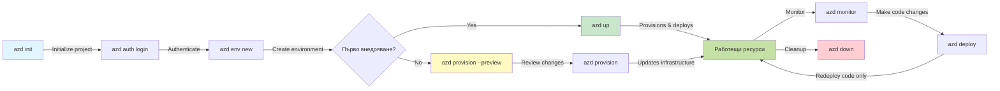
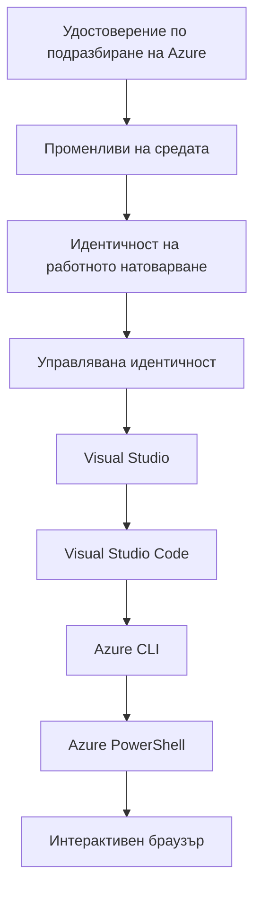

# AZD Основи - Разбиране на Azure Developer CLI

# AZD Основи - Основни концепции и основи

**Навигация на главите:**
- **📚 Начало на курса**: [AZD за начинаещи](../../README.md)
- **📖 Текуща глава**: Глава 1 - Основи & Бърз старт
- **⬅️ Предишна**: [Преглед на курса](../../README.md#-chapter-1-foundation--quick-start)
- **➡️ Следваща**: [Инсталиране и настройка](installation.md)
- **🚀 Следваща глава**: [Глава 2: Разработка, ориентирана към ИИ](../chapter-02-ai-development/microsoft-foundry-integration.md)

## Въведение

Това занятие ви запознава с Azure Developer CLI (azd), мощен инструмент от командния ред, който ускорява вашия път от локална разработка до разгръщане в Azure. Ще научите основните концепции, ключовите функции и ще разберете как azd опростява разгръщането на облачни приложения.

## Цели на обучението

Към края на това занятие вие ще:
- Разберете какво представлява Azure Developer CLI и основната му цел
- Научите основните концепции за шаблони, среди и услуги
- Разгледате ключовите функции, включително разработка, базирана на шаблони, и Инфраструктура като код
- Разберете структурата на проекта azd и работния процес
- Бъдете готови да инсталирате и конфигурирате azd за вашата среда за разработка

## Резултати от обучението

След приключване на това занятие, вие ще можете да:
- Обясните ролята на azd в съвременните облачни работни процеси за разработка
- Идентифицирате компонентите на структурата на проект azd
- Описвате как шаблоните, средите и услугите работят заедно
- Разберете ползите от Инфраструктурата като код с azd
- Разпознавате различни azd команди и техните цели

## Какво е Azure Developer CLI (azd)?

Azure Developer CLI (azd) е инструмент от командния ред, проектиран да ускори вашия път от локална разработка до разгръщане в Azure. Той опростява процеса на изграждане, разгръщане и управление на облачни приложения в Azure.

### Какво можете да разгръщате с azd?

azd поддържа широк набор от натоварвания — и списъкът продължава да расте. Днес можете да използвате azd за разгръщане на:

| Тип натоварване | Примери | Същ работен процес? |
|---------------|----------|----------------|
| **Традиционни приложения** | Уеб приложения, REST API, статични сайтове | ✅ `azd up` |
| **Услуги и микроуслуги** | Container Apps, Function Apps, бекенди с няколко услуги | ✅ `azd up` |
| **Приложения, захранвани от ИИ** | Чат приложения с Microsoft Foundry Models, RAG решения с AI Search | ✅ `azd up` |
| **Интелигентни агенти** | Агенти, хоствани от Foundry, оркестрации с множество агенти | ✅ `azd up` |

Ключовото е, че **жизненият цикъл на azd остава същият независимо от това какво разгръщате**. Инициализирате проект, провизирате инфраструктура, разгръщате кода си, наблюдавате приложението и почиствате — независимо дали е прост уебсайт или сложен ИИ агент.

Тази последователност е проектирана нарочно. azd третира ИИ възможностите като още един вид услуга, която вашето приложение може да използва, а не като нещо принципно различно. Чат крайна точка, подсигурена от Microsoft Foundry Models, е от гледна точка на azd просто още една услуга за конфигуриране и разгръщане.

### 🎯 Защо да използвате AZD? Сравнение в реалния свят

Нека сравним разгръщането на просто уеб приложение с база данни:

#### ❌ БЕЗ AZD: Ръчно разгръщане в Azure (30+ минути)

```bash
# Стъпка 1: Създаване на ресурсна група
az group create --name myapp-rg --location eastus

# Стъпка 2: Създаване на App Service план
az appservice plan create --name myapp-plan \
  --resource-group myapp-rg \
  --sku B1 --is-linux

# Стъпка 3: Създаване на уеб приложение
az webapp create --name myapp-web-unique123 \
  --resource-group myapp-rg \
  --plan myapp-plan \
  --runtime "NODE:18-lts"

# Стъпка 4: Създаване на акаунт в Cosmos DB (10-15 минути)
az cosmosdb create --name myapp-cosmos-unique123 \
  --resource-group myapp-rg \
  --kind MongoDB

# Стъпка 5: Създаване на база данни
az cosmosdb mongodb database create \
  --account-name myapp-cosmos-unique123 \
  --resource-group myapp-rg \
  --name tododb

# Стъпка 6: Създаване на колекция
az cosmosdb mongodb collection create \
  --account-name myapp-cosmos-unique123 \
  --resource-group myapp-rg \
  --database-name tododb \
  --name todos

# Стъпка 7: Получаване на низ за връзка
CONN_STR=$(az cosmosdb keys list \
  --name myapp-cosmos-unique123 \
  --resource-group myapp-rg \
  --type connection-strings \
  --query "connectionStrings[0].connectionString" -o tsv)

# Стъпка 8: Конфигуриране на настройки на приложението
az webapp config appsettings set \
  --name myapp-web-unique123 \
  --resource-group myapp-rg \
  --settings MONGODB_URI="$CONN_STR"

# Стъпка 9: Активиране на регистриране
az webapp log config --name myapp-web-unique123 \
  --resource-group myapp-rg \
  --application-logging filesystem \
  --detailed-error-messages true

# Стъпка 10: Настройване на Application Insights
az monitor app-insights component create \
  --app myapp-insights \
  --location eastus \
  --resource-group myapp-rg

# Стъпка 11: Свързване на App Insights с уеб приложението
INSTRUMENTATION_KEY=$(az monitor app-insights component show \
  --app myapp-insights \
  --resource-group myapp-rg \
  --query "instrumentationKey" -o tsv)

az webapp config appsettings set \
  --name myapp-web-unique123 \
  --resource-group myapp-rg \
  --settings APPINSIGHTS_INSTRUMENTATIONKEY="$INSTRUMENTATION_KEY"

# Стъпка 12: Изграждане на приложението локално
npm install
npm run build

# Стъпка 13: Създаване на пакет за разгръщане
zip -r app.zip . -x "*.git*" "node_modules/*"

# Стъпка 14: Разгръщане на приложението
az webapp deployment source config-zip \
  --resource-group myapp-rg \
  --name myapp-web-unique123 \
  --src app.zip

# Стъпка 15: Изчакайте и се помолете да работи 🙏
# (Няма автоматична проверка, изисква се ръчно тестване)
```

**Проблеми:**
- ❌ Над 15 команди за запомняне и изпълнение в определен ред
- ❌ 30–45 минути ръчна работа
- ❌ Лесно е да се допуснат грешки (правописни грешки, грешни параметри)
- ❌ Низове за връзка изложени в историята на терминала
- ❌ Няма автоматично връщане назад при неуспех
- ❌ Трудно за възпроизвеждане от членовете на екипа
- ❌ Различно всеки път (не възпроизводимо)

#### ✅ С AZD: Автоматизирано разгръщане (5 команди, 10-15 минути)

```bash
# Стъпка 1: Инициализиране от шаблон
azd init --template todo-nodejs-mongo

# Стъпка 2: Удостоверяване
azd auth login

# Стъпка 3: Създаване на среда
azd env new dev

# Стъпка 4: Преглед на промените (по избор, но препоръчително)
azd provision --preview

# Стъпка 5: Разгръщане на всичко
azd up

# ✨ Готово! Всичко е разгрънато, конфигурирано и наблюдавано
```

**Ползи:**
- ✅ **5 команди** срещу 15+ ръчни стъпки
- ✅ **10-15 минути** общо време (предимно изчакване на Azure)
- ✅ **По-малко ръчни грешки** - последователен, базиран на шаблони работен процес
- ✅ **Сигурно боравене с тайни** - много шаблони използват хранилище за тайни, управлявано от Azure
- ✅ **Повторими разгръщания** - същият работен процес всеки път
- ✅ **Напълно възпроизводимо** - същият резултат всеки път
- ✅ **Готов за екип** - всеки може да разгръща с едни и същи команди
- ✅ **Инфраструктура като код** - Bicep шаблони под версионен контрол
- ✅ **Вградено наблюдение** - Application Insights конфигуриран автоматично

### 📊 Намаляване на време и грешки

| Показател | Ръчно разгръщане | Разгръщане с AZD | Подобрение |
|:-------|:------------------|:---------------|:------------|
| **Команди** | 15+ | 5 | 67% по-малко |
| **Време** | 30-45 мин | 10-15 мин | 60% по-бързо |
| **Процент грешки** | ~40% | <5% | 88% намаление |
| **Последователност** | Ниска (ръчно) | 100% (автоматизирано) | Перфектна |
| **Въвеждане на екип** | 2-4 часа | 30 минути | 75% по-бързо |
| **Време за възстановяване** | 30+ мин (ръчно) | 2 мин (автоматизирано) | 93% по-бързо |

## Основни концепции

### Шаблони
Шаблоните са основата на azd. Те съдържат:
- **Код на приложението** - Вашият изходен код и зависимости
- **Дефиниции на инфраструктурата** - Azure ресурси, дефинирани в Bicep или Terraform
- **Конфигурационни файлове** - Настройки и променливи на средата
- **Скриптове за разгръщане** - Автоматизирани работни процеси за разгръщане

### Среди
Средите представляват различни цели за разгръщане:
- **Разработка** - За тестване и разработка
- **Staging** - Предпродукционна среда
- **Production** - Жива продукционна среда

Всяка среда поддържа своя собствена:
- Azure resource group
- Конфигурационни настройки
- Състояние на разгръщането

### Услуги
Услугите са градивните елементи на вашето приложение:
- **Frontend** - Уеб приложения, SPA
- **Backend** - API-та, микроуслуги
- **Database** - Решения за съхранение на данни
- **Storage** - Файлово и blob хранилище

## Основни функции

### 1. Разработка, базирана на шаблони
```bash
# Преглед на наличните шаблони
azd template list

# Инициализиране от шаблон
azd init --template <template-name>
```

### 2. Инфраструктура като код
- **Bicep** - домейн-специфичният език на Azure
- **Terraform** - инструмент за инфраструктура за множество облаци
- **ARM Templates** - шаблони на Azure Resource Manager

### 3. Интегрирани работни процеси
```bash
# Пълен работен процес за внедряване
azd up            # Подготовка + внедряване — без ръчна намеса за първоначална настройка

# 🧪 НОВО: Преглед на промените в инфраструктурата преди внедряване (БЕЗОПАСНО)
azd provision --preview    # Симулиране на внедряване на инфраструктура без извършване на промени

azd provision     # Създаване на ресурси в Azure — използвайте това, ако обновявате инфраструктурата
azd deploy        # Внедряване на код на приложението или повторно внедряване след актуализация
azd down          # Премахване на ресурси
```

#### 🛡️ Безопасно планиране на инфраструктурата с предварителен преглед
Командата `azd provision --preview` е ключова за безопасните разгръщания:
- **Анализ при сухо изпълнение** - Показва какво ще бъде създадено, модифицирано или изтрито
- **Нулев риск** - Няма реални промени в Azure средата
- **Сътрудничество в екип** - Споделяне на резултати от предварителния преглед преди разгръщане
- **Оценка на разходите** - Разберете разходите за ресурси преди ангажимент

```bash
# Примерен работен процес за преглед
azd provision --preview           # Вижте какво ще се промени
# Прегледайте резултата, обсъдете с екипа
azd provision                     # Прилагайте промените с увереност
```

### 📊 Визуално: Работен процес на AZD за разработка



**Обяснение на работния процес:**
1. **Init** - Започнете с шаблон или нов проект
2. **Auth** - Удостоверете се в Azure
3. **Environment** - Създайте изолирана среда за разгръщане
4. **Preview** - 🆕 Винаги първо преглеждайте промените в инфраструктурата (безопасна практика)
5. **Provision** - Създаване/актуализиране на Azure ресурси
6. **Deploy** - Качете кода на приложението
7. **Monitor** - Наблюдавайте производителността на приложението
8. **Iterate** - Правете промени и преразгръщайте кода
9. **Cleanup** - Премахнете ресурсите, когато сте готови

### 4. Управление на среди
```bash
# Създаване и управление на среди
azd env new <environment-name>
azd env select <environment-name>
azd env list
```

### 5. Разширения и команди за ИИ

azd използва система от разширения за добавяне на възможности извън ядрото на CLI. Това е особено полезно за натоварвания с ИИ:

```bash
# Изброи наличните разширения
azd extension list

# Инсталирай разширението Foundry agents
azd extension install azure.ai.agents

# Инициализирай проект за AI агент от манифест
azd ai agent init -m agent-manifest.yaml

# Тествай разположен агент (показва закъснение и време до първия байт)
azd ai agent invoke

# Стартирай MCP сървъра за AI-подпомагана разработка (Алфа)
azd mcp start
```

**Жизненият цикъл на агента, от край до край.** След като инсталирате `azure.ai.agents`, един работен процес ви води от идеята до пуснат и наблюдаван агент. Не е нужно да имате всичко това в първия ден—просто знайте, че съществуват:

| Етап | Команда | Какво прави |
|-------|---------|--------------|
| **Създаване на структура** | `azd ai agent init -m <manifest>` | Генерира проект на агент от манифест |
| **Тестване** | `azd ai agent invoke` | Извика агента и вижда времето за отговор |
| **Измерване** | `azd ai agent eval generate` | Създава набор от данни за оценка на агента |
| **Подобряване** | `azd ai agent optimize` | Оптимизира инструкциите на агента спрямо вашите данни |
| **Инспектиране** | `azd ai agent endpoint show` | Преглежда конфигурацията на живата крайна точка |
| **Почистване** | `azd ai agent delete` | Изтрива хостван агент и всички негови версии |

> Разширенията са разгледани подробно в [Глава 2: Разработка, ориентирана към ИИ](../chapter-02-ai-development/agents.md) и в справочника [Команди на AZD AI CLI](../chapter-08-production/production-ai-practices.md#azd-ai-cli-commands-and-extensions).

## 📁 Структура на проекта

Типична структура на проект на azd:
```
my-app/
├── .azd/                    # azd configuration
│   └── config.json
├── .azure/                  # Azure deployment artifacts
├── .devcontainer/          # Development container config
├── .github/workflows/      # GitHub Actions
├── .vscode/               # VS Code settings
├── infra/                 # Infrastructure code
│   ├── main.bicep        # Main infrastructure template
│   ├── main.parameters.json
│   └── modules/          # Reusable modules
├── src/                  # Application source code
│   ├── api/             # Backend services
│   └── web/             # Frontend application
├── azure.yaml           # azd project configuration
└── README.md
```

## 🔧 Конфигурационни файлове

### azure.yaml
Основният конфигурационен файл на проекта:
```yaml
name: my-awesome-app
metadata:
  template: my-template@1.0.0

services:
  web:
    project: ./src/web
    language: js
    host: appservice
  api:
    project: ./src/api
    language: js
    host: appservice

hooks:
  preprovision:
    shell: pwsh
    run: echo "Preparing to provision..."
```

### .azure/config.json
Конфигурация, специфична за средата:
```json
{
  "version": 1,
  "defaultEnvironment": "dev",
  "environments": {
    "dev": {
      "subscriptionId": "your-subscription-id",
      "location": "eastus"
    }
  }
}
```

## 🎪 Чести работни процеси с практически упражнения

> **💡 Съвет за учене:** Следвайте тези упражнения в ред, за да развивате уменията си с AZD постепенно.

### 🎯 Упражнение 1: Инициализирайте първия си проект

**Цел:** Създайте AZD проект и разгледайте структурата му

**Стъпки:**
```bash
# Използвайте доказан шаблон
azd init --template todo-nodejs-mongo

# Разгледайте генерираните файлове
ls -la  # Прегледайте всички файлове, включително скритите

# Създадени ключови файлове:
# - azure.yaml (основна конфигурация)
# - infra/ (код за инфраструктура)
# - src/ (код на приложението)
```

**✅ Успех:** Имате azure.yaml, infra/ и src/ директории

---

### 🎯 Упражнение 2: Разгръщане в Azure

**Цел:** Завършете разгръщане от край до край

**Стъпки:**
```bash
# 1. Удостоверете се
az login && azd auth login

# 2. Създайте среда
azd env new dev
azd env set AZURE_LOCATION eastus

# 3. Прегледайте промените (ПРЕПОРЪЧВА СЕ)
azd provision --preview

# 4. Разположете всичко
azd up

# 5. Проверете разгръщането
azd show    # Вижте URL адреса на вашето приложение
```

**Очаквано време:** 10-15 минути  
**✅ Успех:** URL на приложението се отваря в браузъра

---

### 🎯 Упражнение 3: Множество среди

**Цел:** Разгръщане в dev и staging

**Стъпки:**
```bash
# Вече имаме dev, създайте staging
azd env new staging
azd env set AZURE_LOCATION westus2
azd up

# Превключвайте между тях
azd env list
azd env select dev
```

**✅ Успех:** Две отделни групи ресурси в Azure портала

---

### 🛡️ Чист старт: `azd down --force --purge`

Когато трябва да нулирате напълно:

```bash
azd down --force --purge
```

**Какво прави:**
- `--force`: Няма подкани за потвърждение
- `--purge`: Изтрива цялото локално състояние и Azure ресурсите

**Използвайте когато:**
- Разгръщането се е провалило по средата
- Смяна на проекти
- Нужда от ново начало

---

## 🎪 Оригинална справка за работния процес

### Стартиране на нов проект
```bash
# Метод 1: Използвайте съществуващ шаблон
azd init --template todo-nodejs-mongo

# Метод 2: Започнете от нулата
azd init

# Метод 3: Използвайте текущата директория
azd init .
```

### Цикъл на разработка
```bash
# Настройване на среда за разработка
azd auth login
azd env new dev
azd env select dev

# Разположете всичко
azd up

# Направете промени и повторно разположете
azd deploy

# Почистете, когато приключите
azd down --force --purge # Командата в Azure Developer CLI е **твърдо нулиране** за вашата среда—особено полезна, когато отстранявате проблеми с неуспешни разгръщания, почиствате изоставени ресурси или се подготвяте за ново разгръщане.
```

## Разбиране на `azd down --force --purge`
Командата `azd down --force --purge` е мощен начин да премахнете напълно вашата azd среда и всички свързани ресурси. Ето разяснение какво прави всеки флаг:
```
--force
```
- Пропуска подкани за потвърждение.
- Полезно за автоматизация или скриптове, когато ръчното въвеждане не е възможно.
- Гарантира, че разрушаването продължава без прекъсване, дори ако CLI открие несъответствия.

```
--purge
```
Изтрива **всички свързани метаданни**, включително:
- Състояние на средата
- Локална `.azure` папка
- Кеширана информация за разгръщането
- Предотвратява "запомнянето" на предишни разгръщания от azd, което може да доведе до проблеми като несъответстващи групи ресурси или остарели препратки към регистри.


### Защо да използвате и двете?
Когато сте срещнали проблем с `azd up` поради останало състояние или частични разгръщания, тази комбинация гарантира **чисто начало**.

Особено полезно е след ръчно изтриване на ресурси в Azure портала или при смяна на шаблони, среди или конвенции за именуване на групи ресурси.


### Управление на множество среди
```bash
# Създайте предпускова среда
azd env new staging
azd env select staging
azd up

# Върнете се обратно към dev
azd env select dev

# Сравнете средите
azd env list
```

## 🔐 Удостоверяване и идентификационни данни

Разбирането на удостоверяването е от решаващо значение за успешните azd разгръщания. Azure използва множество методи за удостоверяване, а azd използва същата верига от идентификационни данни, която използват и други Azure инструменти.

### Удостоверяване с Azure CLI (`az login`)

Преди да използвате azd, трябва да се удостоверите в Azure. Най-често използваният метод е чрез Azure CLI:

```bash
# Интерактивно влизане (отваря браузър)
az login

# Влизане с конкретен тенант
az login --tenant <tenant-id>

# Влизане с service principal
az login --service-principal -u <app-id> -p <password> --tenant <tenant-id>

# Проверка на текущия статус на влизане
az account show

# Изброяване на наличните абонаменти
az account list --output table

# Задаване на абонамент по подразбиране
az account set --subscription <subscription-id>
```

### Поток на удостоверяване
1. **Интерактивно влизане**: Отваря вашия стандартен браузър за удостоверяване
2. **Device Code Flow**: За среди без достъп до браузър
3. **Service Principal**: За автоматизация и CI/CD сценарии
4. **Managed Identity**: За приложения, хоствани в Azure

### Веригата DefaultAzureCredential

`DefaultAzureCredential` е тип идентификационни данни, който предоставя опростено преживяване за удостоверяване, като автоматично опитва множество източници на идентификационни данни в конкретен ред:

#### Ред на веригата от идентификационни данни


#### 1. Променливи на средата
```bash
# Задайте променливи на средата за принципал на услугата
export AZURE_CLIENT_ID="<app-id>"
export AZURE_CLIENT_SECRET="<password>"
export AZURE_TENANT_ID="<tenant-id>"
```

#### 2. Workload Identity (Kubernetes/GitHub Actions)
Използва се автоматично в:
- Azure Kubernetes Service (AKS) с Workload Identity
- GitHub Actions с OIDC федерация
- Други сценарии с федеративна идентичност

#### 3. Управлявана идентичност
За Azure ресурси като:
- Виртуални машини
- App Service
- Azure Functions
- Container Instances

```bash
# Проверява дали работи на Azure ресурс с управлявана идентичност
az account show --query "user.type" --output tsv
# Връща: "servicePrincipal" ако използва управлявана идентичност
```

#### 4. Интеграция с инструменти за разработчици
- **Visual Studio**: Автоматично използва влезлия акаунт
- **VS Code**: Използва идентификационните данни от разширението Azure Account
- **Azure CLI**: Използва идентификационните данни от `az login` (най-често при локална разработка)

### Настройка на удостоверяването за AZD

```bash
# Метод 1: Използвайте Azure CLI (Препоръчително за разработка)
az login
azd auth login  # Използва съществуващите идентификационни данни на Azure CLI

# Метод 2: Директна автентикация с azd
azd auth login --use-device-code  # За среди без графичен интерфейс

# Метод 3: Проверете състоянието на автентикацията
azd auth login --check-status

# Метод 4: Излезте и влезте отново
azd auth logout
azd auth login
```

### Добри практики за удостоверяване

#### За локална разработка
```bash
# 1. Влезте чрез Azure CLI
az login

# 2. Проверете дали абонаментът е правилен
az account show
az account set --subscription "Your Subscription Name"

# 3. Използвайте azd със съществуващи идентификационни данни
azd auth login
```

#### За CI/CD пайплайни
```yaml
# GitHub Actions example
- name: Azure Login
  uses: azure/login@v1
  with:
    creds: ${{ secrets.AZURE_CREDENTIALS }}

- name: Deploy with azd
  run: |
    azd auth login --client-id ${{ secrets.AZURE_CLIENT_ID }} \
                    --client-secret ${{ secrets.AZURE_CLIENT_SECRET }} \
                    --tenant-id ${{ secrets.AZURE_TENANT_ID }}
    azd up --no-prompt
```

#### За производствени среди
- Използвайте **Managed Identity**, когато работите върху Azure ресурси
- Използвайте **Service Principal** за автоматизирани сценарии
- Избягвайте съхраняването на идентификационни данни в кода или конфигурационните файлове
- Използвайте **Azure Key Vault** за чувствителна конфигурация

### Чести проблеми с удостоверяването и решения

#### Проблем: "No subscription found"
```bash
# Решение: Задайте абонамент по подразбиране
az account list --output table
az account set --subscription "<subscription-id>"
azd env set AZURE_SUBSCRIPTION_ID "<subscription-id>"
```

#### Проблем: "Insufficient permissions"
```bash
# Решение: Проверете и присвоете необходимите роли
az role assignment list --assignee $(az account show --query user.name --output tsv)

# Често срещани необходими роли:
# - Contributor (за управление на ресурсите)
# - User Access Administrator (за присвояване на роли)
```

#### Проблем: "Token expired"
```bash
# Решение: Повторно удостоверяване
az logout
az login
azd auth logout
azd auth login
```

### Удостоверяване в различни сценарии

#### Локална разработка
```bash
# Акаунт за лично развитие
az login
azd auth login
```

#### Разработка в екип
```bash
# Използвайте конкретен наемател за организацията
az login --tenant contoso.onmicrosoft.com
azd auth login
```

#### Мулти-тенант сценарии
```bash
# Превключване между наематели
az login --tenant tenant1.onmicrosoft.com
# Разгръщане към наемател 1
azd up

az login --tenant tenant2.onmicrosoft.com  
# Разгръщане към наемател 2
azd up
```

### Съображения за сигурност

1. **Съхранение на идентификационни данни**: Никога не съхранявайте идентификационни данни в изходния код
2. **Ограничаване на обхвата**: Използвайте принципа на най-малките привилегии за service principals
3. **Ротация на токени**: Редовно сменяйте тайните на service principal
4. **Одитна следа**: Наблюдавайте дейностите по удостоверяване и внедряване
5. **Мрежова сигурност**: Използвайте private endpoints когато е възможно

### Отстраняване на проблеми с удостоверяването

```bash
# Отстраняване на грешки при удостоверяване
azd auth login --check-status
az account show
az account get-access-token

# Чести диагностични команди
whoami                          # Текущ контекст на потребителя
az ad signed-in-user show      # Подробности за потребителя в Microsoft Entra ID
az group list                  # Тестване на достъпа до ресурс
```

## Разбиране на `azd down --force --purge`

### Откриване
```bash
azd template list              # Преглед на шаблони
azd template show <template>   # Детайли на шаблона
azd init --help               # Опции за инициализация
```

### Управление на проекта
```bash
azd show                     # Преглед на проекта
azd env list                # Налични среди и избраната по подразбиране
azd config show            # Настройки на конфигурацията
```

### Наблюдение
```bash
azd monitor                  # Отворете мониторинга в портала на Azure
azd monitor --logs           # Прегледайте логовете на приложението
azd monitor --live           # Прегледайте метриките в реално време
azd pipeline config          # Настройте CI/CD
```

## Най-добри практики

### 1. Използвайте смислени имена
```bash
# Добре
azd env new production-east
azd init --template web-app-secure

# Избягвайте
azd env new env1
azd init --template template1
```

### 2. Използвайте шаблони
- Започнете с готови шаблони
- Персонализирайте според вашите нужди
- Създайте многократно използваеми шаблони за вашата организация

### 3. Изолация на среди
- Използвайте отделни среди за dev/staging/prod
- Никога не деплойвайте директно в продукция от локалната машина
- Използвайте CI/CD пайплайни за продукционни деплойменти

### 4. Управление на конфигурацията
- Използвайте променливи на средата за чувствителни данни
- Дръжте конфигурацията под версионен контрол
- Документирайте настройки, специфични за средата

## Прогрес на обучението

### Начинаещ (Седмица 1-2)
1. Инсталирайте azd и се удостоверете
2. Деплойнете прост шаблон
3. Разберете структурата на проекта
4. Научете базови команди (up, down, deploy)

### Средно ниво (Седмица 3-4)
1. Персонализирайте шаблоните
2. Управлявайте множество среди
3. Разберете инфраструктурния код
4. Настройте CI/CD пайплайни

### Напреднали (Седмица 5+)
1. Създайте персонализирани шаблони
2. Разширени инфраструктурни модели
3. Деплойменти в няколко региона
4. Конфигурации за корпоративна употреба

## Следващи стъпки

**📖 Продължете с Глава 1:**
- [Инсталация и настройка](installation.md) - Инсталирайте azd и го конфигурирайте
- [Вашият първи проект](first-project.md) - Завършете практическо ръководство
- [Ръководство за конфигурация](configuration.md) - Разширени опции за конфигурация

**🎯 Готови за следващата глава?**
- [Глава 2: AI-ориентирана разработка](../chapter-02-ai-development/microsoft-foundry-integration.md) - Започнете да изграждате AI приложения

## Допълнителни ресурси

- [Преглед на Azure Developer CLI](https://learn.microsoft.com/en-us/azure/developer/azure-developer-cli/)
- [Галерия с шаблони](https://azure.github.io/awesome-azd/)
- [Примери от общността](https://github.com/Azure-Samples)

---

## 🙋 Често задавани въпроси

### Общи въпроси

**В: Каква е разликата между AZD и Azure CLI?**

О: Azure CLI (`az`) служи за управление на отделни Azure ресурси. AZD (`azd`) служи за управление на цели приложения:

```bash
# Azure CLI - управление на ресурси на ниско ниво
az webapp create --name myapp --resource-group rg
az sql server create --name myserver --resource-group rg
# ...необходими са още много команди

# AZD - управление на ниво приложение
azd up  # Разгръща цялото приложение с всички ресурси
```

**Мислете по следния начин:**
- `az` = Работа с отделни Lego тухлички
- `azd` = Работа с пълни Lego комплекти

---

**В: Трябва ли да знам Bicep или Terraform, за да използвам AZD?**

О: Не! Започнете с шаблони:
```bash
# Използвайте съществуващ шаблон - не се изискват познания по IaC
azd init --template todo-nodejs-mongo
azd up
```

Можете да научите Bicep по-късно, за да персонализирате инфраструктурата. Шаблоните предоставят работещи примери, от които да се учите.

---

**В: Колко струва изпълнението на AZD шаблони?**

О: Разходите зависят от шаблона. Повечето развойни шаблони струват $50-150/месец:

```bash
# Прегледайте разходите преди внедряване
azd provision --preview

# Винаги почиствайте, когато не го използвате
azd down --force --purge  # Премахва всички ресурси
```

**Полезен съвет:** Използвайте безплатни нива, когато са налични:
- App Service: ниво F1 (Безплатно)
- Microsoft Foundry Models: Azure OpenAI 50,000 токена/месец безплатно
- Cosmos DB: безплатно ниво 1000 RU/s

---

**В: Мога ли да използвам AZD с вече съществуващи Azure ресурси?**

О: Да, но е по-лесно да започнете от нулата. AZD работи най-добре, когато управлява целия жизнен цикъл. За вече съществуващи ресурси:

```bash
# Опция 1: Импортиране на съществуващи ресурси (за напреднали)
azd init
# След това променете infra/ да сочи към съществуващи ресурси

# Опция 2: Започнете отначало (препоръчително)
azd init --template matching-your-stack
azd up  # Създава нова среда
```

---

**В: Как да споделя проекта си с колеги?**

О: Комитнете AZD проекта в Git (но НЕ папката .azure):
```bash
# Вече е в .gitignore по подразбиране
.azure/        # Съдържа тайни и данни за средата
*.env          # Променливи на средата

# Тогавашните членове на екипа:
git clone <your-repo>
azd auth login
azd env new <their-name>-dev
azd up
```

Всеки получава идентична инфраструктура от същите шаблони.

---

### Въпроси за отстраняване на проблеми

**В: "azd up" се провали наполовина. Какво да направя?**

О: Проверете грешката, поправете я и опитайте отново:
```bash
# Преглед на подробни логове
azd show

# Често срещани решения:

# 1. Ако квотата е превишена:
azd env set AZURE_LOCATION "westus2"  # Опитайте друг регион

# 2. Ако има конфликт на името на ресурса:
azd down --force --purge  # Започнете отначало
azd up  # Опитайте отново

# 3. Ако удостоверяването е изтекло:
az login
azd auth login
azd up
```

**Най-честият проблем:** Избрана е неправилна абонация
```bash
az account list --output table
az account set --subscription "<correct-subscription>"
```

---

**В: Как да деплойна само промените в кода без повторно провизиране?**

О: Използвайте `azd deploy` вместо `azd up`:
```bash
azd up          # Първи път: настройка + разгръщане (бавно)

# Направете промени в кода...

azd deploy      # Следващи пъти: само разгръщане (бързо)
```

Сравнение на скоростта:
- `azd up`: 10-15 минути (провизира инфраструктурата)
- `azd deploy`: 2-5 минути (само код)

---

**В: Мога ли да персонализирам инфраструктурните шаблони?**

О: Да! Редактирайте Bicep файловете в `infra/`:
```bash
# След изпълнение на azd init
cd infra/
code main.bicep  # Редактиране в VS Code

# Преглед на промените
azd provision --preview

# Прилагане на промените
azd provision
```

**Съвет:** Започнете малко - първо променете SKU-тата:
```bicep
// infra/main.bicep
sku: {
  name: 'B1'  // Change to 'P1V2' for production
}
```

---

**В: Как да изтрия всичко, което AZD е създало?**

О: Една команда премахва всички ресурси:
```bash
azd down --force --purge

# Това изтрива:
# - Всички ресурси в Azure
# - Ресурсна група
# - Локално състояние на средата
# - Кеширани данни за разгръщане
```

**Винаги изпълнявайте това когато:**
- Приключили сте с тестването на шаблон
- Превключвате към различен проект
- Искате да започнете от чисто

**Спестяване на разходи:** Изтриването на неизползвани ресурси = $0 разходи

---

**В: Какво ако случайно изтрия ресурси в Azure Portal?**

О: Състоянието на AZD може да се разсинхронизира. Подход за чист старт:
```bash
# 1. Премахнете локалното състояние
azd down --force --purge

# 2. Започнете отначало
azd up

# Alternative: Нека AZD открие и поправи
azd provision  # Ще създаде липсващите ресурси
```

---

### Напреднали въпроси

**В: Мога ли да използвам AZD в CI/CD пайплайни?**

О: Да! Пример с GitHub Actions:
```yaml
# .github/workflows/deploy.yml
name: Deploy with AZD

on:
  push:
    branches: [main]

jobs:
  deploy:
    runs-on: ubuntu-latest
    steps:
      - uses: actions/checkout@v2
      
      - name: Install azd
        run: curl -fsSL https://aka.ms/install-azd.sh | bash
      
      - name: Azure Login
        run: |
          azd auth login \
            --client-id ${{ secrets.AZURE_CLIENT_ID }} \
            --client-secret ${{ secrets.AZURE_CLIENT_SECRET }} \
            --tenant-id ${{ secrets.AZURE_TENANT_ID }}
      
      - name: Deploy
        run: azd up --no-prompt
```

---

**В: Как да управлявам тайни и чувствителни данни?**

О: AZD се интегрира автоматично с Azure Key Vault:
```bash
# Секретите се съхраняват в Key Vault, а не в кода
azd env set DATABASE_PASSWORD "$(openssl rand -base64 32)"

# AZD автоматично:
# 1. Създава Key Vault
# 2. Съхранява тайна
# 3. Предоставя на приложението достъп чрез управлявана идентичност
# 4. Инжектира по време на изпълнение
```

**Никога не комитвайте:**
- папка `.azure/` (съдържа данни за средата)
- файлове `.env` (локални тайни)
- низове за връзка

---

**В: Мога ли да деплойвам в няколко региона?**

О: Да, създайте среда за всеки регион:
```bash
# Среда за Източните САЩ
azd env new prod-eastus
azd env set AZURE_LOCATION eastus
azd up

# Среда за Западна Европа
azd env new prod-westeurope
azd env set AZURE_LOCATION westeurope
azd up

# Всяка среда е независима
azd env list
```

За истински мултирегионални приложения, персонализирайте Bicep шаблоните да деплойват в няколко региона едновременно.

---

**В: Къде мога да получа помощ, ако съм заседнал?**

1. **Документация на AZD:** https://learn.microsoft.com/azure/developer/azure-developer-cli/
2. **GitHub Issues:** https://github.com/Azure/azure-dev/issues
3. **Discord:** [Azure Discord](https://discord.gg/microsoft-azure) - канал #azure-developer-cli
4. **Stack Overflow:** Таг `azure-developer-cli`
5. **Този курс:** [Ръководство за отстраняване на проблеми](../chapter-07-troubleshooting/common-issues.md)

**Полезен съвет:** Преди да попитате, изпълнете:
```bash
azd show       # Показва текущото състояние
azd version    # Показва вашата версия
```
Включете тази информация в въпроса си за по-бърза помощ.

---

## 🎓 Какво следва?

Вече разбирате основите на AZD. Изберете своя път:

### 🎯 За начинаещи:
1. **Следващо:** [Инсталация и настройка](installation.md) - Инсталирайте AZD на вашата машина
2. **После:** [Вашият първи проект](first-project.md) - Деплойнете първото си приложение
3. **Практика:** Завършете всичките 3 упражнения в този урок

### 🚀 За AI разработчици:
1. **Прескочете до:** [Глава 2: AI-ориентирана разработка](../chapter-02-ai-development/microsoft-foundry-integration.md)
2. **Деплойвайте:** Започнете с `azd init --template get-started-with-ai-chat`
3. **Научете:** Изграждайте докато деплойвате

### 🏗️ За опитни разработчици:
1. **Прегледайте:** [Ръководство за конфигурация](configuration.md) - Разширени настройки
2. **Проучете:** [Infrastructure as Code](../chapter-04-infrastructure/provisioning.md) - Дълбоко навлизане в Bicep
3. **Създайте:** Създайте персонализирани шаблони за вашия стек

---

**Навигация на главите:**
- **📚 Начало на курса**: [AZD For Beginners](../../README.md)
- **📖 Текуща глава**: Глава 1 - Основи и бърз старт  
- **⬅️ Предишна**: [Преглед на курса](../../README.md#-chapter-1-foundation--quick-start)
- **➡️ Следваща**: [Инсталация и настройка](installation.md)
- **🚀 Следваща глава**: [Глава 2: AI-ориентирана разработка](../chapter-02-ai-development/microsoft-foundry-integration.md)

---

<!-- CO-OP TRANSLATOR DISCLAIMER START -->
**Отказ от отговорност**:
Този документ е преведен с помощта на AI преводачески услуга [Co-op Translator](https://github.com/Azure/co-op-translator). Въпреки че се стремим към точност, моля имайте предвид, че автоматизираните преводи могат да съдържат грешки или неточности. Оригиналният документ на неговия роден език трябва да се счита за авторитетен източник. За критична информация се препоръчва професионален човешки превод. Ние не носим отговорност за каквито и да е недоразумения или неправилни тълкувания, произтичащи от използването на този превод.
<!-- CO-OP TRANSLATOR DISCLAIMER END -->