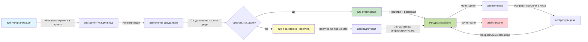
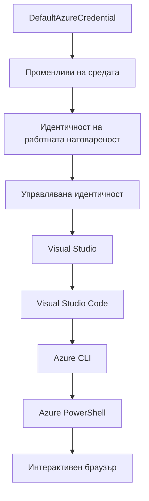

# AZD Основи - Разбиране на Azure Developer CLI

# AZD Основи - Основни концепции и принципи

**Навигация в главите:**
- **📚 Начало на курса**: [AZD За начинаещи](../../README.md)
- **📖 Текуща глава**: Глава 1 - Основи и бърз старт
- **⬅️ Предишна**: [Преглед на курса](../../README.md#-chapter-1-foundation--quick-start)
- **➡️ Следваща**: [Инсталация и настройка](installation.md)
- **🚀 Следваща глава**: [Глава 2: Разработка с ориентация към изкуствен интелект](../chapter-02-ai-development/microsoft-foundry-integration.md)

## Въведение

Този урок ви запознава с Azure Developer CLI (azd), мощен инструмент за команден ред, който ускорява пътя ви от локална разработка до разгръщане в Azure. Ще научите основните концепции, ключовите функции и ще разберете как azd опростява разгръщането на облачно базирани приложения.

## Цели на обучението

В края на този урок ще:
- Разберете какво представлява Azure Developer CLI и неговото основно предназначение
- Научите основните понятия за шаблони, среди и услуги
- Изследвате ключови функции, включително разработка, основана на шаблони и инфраструктура като код
- Разберете структурата и работния процес на azd проект
- Сте подготвени да инсталирате и конфигурирате azd за вашата среда за разработка

## Резултати от обучението

След завършване на този урок ще можете:
- Да обясните ролята на azd в съвременните работни процеси за облачна разработка
- Да идентифицирате компонентите на структурата на azd проект
- Да опишете как работят заедно шаблоните, средите и услугите
- Да разберете ползите от инфраструктурата като код с azd
- Да разпознаете различни azd команди и техните предназначения

## Какво е Azure Developer CLI (azd)?

Azure Developer CLI (azd) е инструмент за команден ред, разработен да ускори пътя ви от локална разработка до разгръщане в Azure. Той опростява процеса на създаване, разгръщане и управление на облачно базирани приложения в Azure.

### Какво можете да разгръщате с azd?

azd поддържа широк спектър от натоварвания — и списъкът постоянно расте. Днес можете да използвате azd за разгръщане на:

| Вид натоварване | Примери | Същият работен поток? |
|-----------------|---------|-----------------------|
| **Традиционни приложения** | Уеб приложения, REST API, статични сайтове | ✅ `azd up` |
| **Услуги и микросервизи** | Контейнерни приложения, Функционални приложения, бекенди с множество услуги | ✅ `azd up` |
| **Приложения с изкуствен интелект** | Чат приложения с Microsoft Foundry модели, RAG решения с AI търсене | ✅ `azd up` |
| **Интелигентни агенти** | Агенти хоствани в Foundry, оркестрации с множество агенти | ✅ `azd up` |

Ключовото осъзнаване е, че **жизненият цикъл на azd остава същият независимо от това какво разгръщате**. Инициализирате проект, подготвяте инфраструктура, разгръщате кода си, наблюдавате приложението си и почиствате — било то прост уебсайт или сложен AI агент.

Тази последователност е проектирана умишлено. azd третира AI възможностите като още един вид услуга, която вашето приложение може да използва, а не като нещо фундаментално различно. Чат краен пункт, задвижван от Microsoft Foundry модели, от гледна точка на azd е просто още една услуга за конфигуриране и разгръщане.

### 🎯 Защо да използвате AZD? Сравнение от реалния свят

Нека сравним разгръщането на просто уеб приложение с база данни:

#### ❌ БЕЗ AZD: Ръчно разгръщане в Azure (над 30 минути)

```bash
# Стъпка 1: Създаване на ресурсна група
az group create --name myapp-rg --location eastus

# Стъпка 2: Създаване на план за App Service
az appservice plan create --name myapp-plan \
  --resource-group myapp-rg \
  --sku B1 --is-linux

# Стъпка 3: Създаване на Web App
az webapp create --name myapp-web-unique123 \
  --resource-group myapp-rg \
  --plan myapp-plan \
  --runtime "NODE:18-lts"

# Стъпка 4: Създаване на Cosmos DB акаунт (10-15 минути)
az cosmosdb create --name myapp-cosmos-unique123 \
  --resource-group myapp-rg \
  --kind MongoDB

# Стъпка 5: Създаване на база данни
az cosmosdb mongodb database create \
  --account-name myapp-cosmos-unique123 \
  --resource-group myapp-rg \
  --name tododb

# Стъпка 6: Създаване на колекция
az cosmosdb mongodb collection create \
  --account-name myapp-cosmos-unique123 \
  --resource-group myapp-rg \
  --database-name tododb \
  --name todos

# Стъпка 7: Вземане на връзка за свързване
CONN_STR=$(az cosmosdb keys list \
  --name myapp-cosmos-unique123 \
  --resource-group myapp-rg \
  --type connection-strings \
  --query "connectionStrings[0].connectionString" -o tsv)

# Стъпка 8: Конфигуриране на настройките на приложението
az webapp config appsettings set \
  --name myapp-web-unique123 \
  --resource-group myapp-rg \
  --settings MONGODB_URI="$CONN_STR"

# Стъпка 9: Активиране на логване
az webapp log config --name myapp-web-unique123 \
  --resource-group myapp-rg \
  --application-logging filesystem \
  --detailed-error-messages true

# Стъпка 10: Настройване на Application Insights
az monitor app-insights component create \
  --app myapp-insights \
  --location eastus \
  --resource-group myapp-rg

# Стъпка 11: Свързване на App Insights с Web App
INSTRUMENTATION_KEY=$(az monitor app-insights component show \
  --app myapp-insights \
  --resource-group myapp-rg \
  --query "instrumentationKey" -o tsv)

az webapp config appsettings set \
  --name myapp-web-unique123 \
  --resource-group myapp-rg \
  --settings APPINSIGHTS_INSTRUMENTATIONKEY="$INSTRUMENTATION_KEY"

# Стъпка 12: Локално компилиране на приложението
npm install
npm run build

# Стъпка 13: Създаване на пакет за разгъване
zip -r app.zip . -x "*.git*" "node_modules/*"

# Стъпка 14: Разгъване на приложението
az webapp deployment source config-zip \
  --resource-group myapp-rg \
  --name myapp-web-unique123 \
  --src app.zip

# Стъпка 15: Изчакайте и се молете да проработи 🙏
# (Няма автоматична проверка, изисква се ръчно тестване)
```

**Проблеми:**
- ❌ 15+ команди за запомняне и изпълнение в ред
- ❌ 30-45 минути ръчна работа
- ❌ Лесно е да се допуснат грешки (грешно изписване, грешни параметри)
- ❌ Стринговете за връзка са видими в историята на терминала
- ❌ Няма автоматично връщане назад при неуспех
- ❌ Трудно за повтаряне от членове на екипа
- ❌ Винаги различно (неповтаряемо)

#### ✅ С AZD: Автоматизирано разгръщане (5 команди, 10-15 минути)

```bash
# Стъпка 1: Инициализиране от шаблон
azd init --template todo-nodejs-mongo

# Стъпка 2: Удостоверяване
azd auth login

# Стъпка 3: Създаване на околна среда
azd env new dev

# Стъпка 4: Преглед на промените (по избор, но препоръчително)
azd provision --preview

# Стъпка 5: Разгръщане на всичко
azd up

# ✨ Готово! Всичко е разположено, конфигурирано и наблюдавано
```

**Ползи:**
- ✅ **5 команди** вместо 15+ ръчни стъпки
- ✅ **10-15 минути** общо време (главно чакане на Azure)
- ✅ **По-малко ръчни грешки** - последователен, базиран на шаблони работен поток
- ✅ **Сигурно обработване на тайни** - много шаблони използват Azure управлявано съхранение на тайни
- ✅ **Повтаряеми разгръщания** - същият работен поток всеки път
- ✅ **Пълна възпроизводимост** - същия резултат всеки път
- ✅ **Пригоден за екипи** - всеки може да разгръща със същите команди
- ✅ **Инфраструктура като код** - Bicep шаблони под контрол на версиите
- ✅ **Вградена мониторинг** - автоматично конфигуриран Application Insights

### 📊 Намаляване на време и грешки

| Метрика | Ръчно разгръщане | Разгръщане с AZD | Подобрение |
|:--------|:-----------------|:-----------------|:-----------|
| **Команди** | 15+ | 5 | С 67% по-малко |
| **Време** | 30-45 мин | 10-15 мин | С 60% по-бързо |
| **Честота на грешки** | ~40% | <5% | С 88% по-малко |
| **Последователност** | Ниска (ръчна) | 100% (автоматизирана) | Перфектна |
| **Въвеждане на екип** | 2-4 часа | 30 минути | С 75% по-бързо |
| **Време за връщане назад** | 30+ мин (ръчно) | 2 мин (автоматизирано) | С 93% по-бързо |

## Основни концепции

### Шаблони
Шаблоните са основата на azd. Те съдържат:
- **Код на приложението** - вашият изходен код и зависимости
- **Дефиниции на инфраструктурата** - Azure ресурси, дефинирани в Bicep или Terraform
- **Конфигурационни файлове** - настройки и променливи на средата
- **Скриптове за разгръщане** - автоматизирани работни потоци за разгръщане

### Среди
Средите представляват различни цели за разгръщане:
- **Разработка** - за тестване и разработка
- **Сценична среда** - пред-продукционна среда
- **Продукция** - живата производствена среда

Всяка среда поддържа собствен:
- ресурсна група в Azure
- конфигурационни настройки
- състояние на разгръщането

### Услуги
Услугите са градивните блокове на вашето приложение:
- **Фронтенд** - уеб приложения, SPA
- **Бекенд** - API, микросервизи
- **База данни** - решения за съхранение на данни
- **Съхранение** - съхранение на файлове и обекти

## Ключови функции

### 1. Разработка, базирана на шаблони
```bash
# Прегледайте наличните шаблони
azd template list

# Инициализирайте от шаблон
azd init --template <template-name>
```

### 2. Инфраструктура като код
- **Bicep** - специфичен език за Azure
- **Terraform** - инструмент за мулти-облачна инфраструктура
- **ARM шаблони** - шаблони за Azure Resource Manager

### 3. Интегрирани работни потоци
```bash
# Пълен работен процес за внедряване
azd up            # Осигуряване + Внедряване, това е без ръчна намеса за първоначална настройка

# 🧪 НОВО: Преглед на инфраструктурните промени преди внедряване (БЕЗОПАСНО)
azd provision --preview    # Симулиране на внедряване на инфраструктура без реални промени

azd provision     # Създаване на Azure ресурси, ако актуализирате инфраструктурата използвайте това
azd deploy        # Внедряване на код на приложението или повторно внедряване след актуализация
azd down          # Изчистване на ресурси
```

#### 🛡️ Безопасно планиране на инфраструктура с преглед
Командата `azd provision --preview` е ключова за безопасно разгръщане:
- **Анализ без изпълнение** - показва какво ще бъде създадено, променено или изтрито
- **Нулев риск** - няма реални промени в Azure средата
- **Сътрудничество в екипа** - споделяйте резултатите от прегледа преди разгръщане
- **Оценка на разходите** - разберете прогнозните разходи преди ангажимент

```bash
# Примерен преглед на работния процес
azd provision --preview           # Вижте какво ще се промени
# Прегледайте резултата, обсъдете с екипа
azd provision                     # Прилагайте промените с увереност
```

### 📊 Визуализация: Работен процес на разработка с AZD


**Обяснение на работния поток:**
1. **Init** - Започнете с шаблон или нов проект
2. **Auth** - Автентикация в Azure
3. **Environment** - Създаване на изолирана среда за разгръщане
4. **Preview** - 🆕 Винаги предварителен преглед на инфраструктурните промени (безопасен процес)
5. **Provision** - Създаване/актуализиране на Azure ресурси
6. **Deploy** - Публикуване на кода на приложението
7. **Monitor** - Наблюдение на производителността на приложението
8. **Iterate** - Правене на промени и повторно разгръщане на кода
9. **Cleanup** - Премахване на ресурсите след приключване

### 4. Управление на среди
```bash
# Създаване и управление на среди
azd env new <environment-name>
azd env select <environment-name>
azd env list
```

### 5. Разширения и AI команди

azd използва система от разширения, за да добави възможности извън основния CLI. Това е особено полезно за AI натоварвания:

```bash
# Изброяване на наличните разширения
azd extension list

# Инсталиране на разширението Foundry agents
azd extension install azure.ai.agents

# Инициализиране на AI агент проект от манифест
azd ai agent init -m agent-manifest.yaml

# Стартиране на MCP сървъра за AI-подпомогнато разработване (Алфа)
azd mcp start
```

> Разширенията са подробно разгледани в [Глава 2: Разработка с ориентация към изкуствен интелект](../chapter-02-ai-development/agents.md) и в справката за [AZD AI CLI команди](../chapter-08-production/production-ai-practices.md#azd-ai-cli-commands-and-extensions).

## 📁 Структура на проекта

Типична структура на azd проект:
```
my-app/
├── .azd/                    # azd configuration
│   └── config.json
├── .azure/                  # Azure deployment artifacts
├── .devcontainer/          # Development container config
├── .github/workflows/      # GitHub Actions
├── .vscode/               # VS Code settings
├── infra/                 # Infrastructure code
│   ├── main.bicep        # Main infrastructure template
│   ├── main.parameters.json
│   └── modules/          # Reusable modules
├── src/                  # Application source code
│   ├── api/             # Backend services
│   └── web/             # Frontend application
├── azure.yaml           # azd project configuration
└── README.md
```

## 🔧 Конфигурационни файлове

### azure.yaml
Основният конфигурационен файл на проекта:
```yaml
name: my-awesome-app
metadata:
  template: my-template@1.0.0

services:
  web:
    project: ./src/web
    language: js
    host: appservice
  api:
    project: ./src/api
    language: js
    host: appservice

hooks:
  preprovision:
    shell: pwsh
    run: echo "Preparing to provision..."
```

### .azure/config.json
Специфична за средата конфигурация:
```json
{
  "version": 1,
  "defaultEnvironment": "dev",
  "environments": {
    "dev": {
      "subscriptionId": "your-subscription-id",
      "location": "eastus"
    }
  }
}
```

## 🎪 Често използвани работни потоци с практически упражнения

> **💡 Съвет за обучение:** Следвайте тези упражнения по ред, за да изградите постепенно умения в AZD.

### 🎯 Упражнение 1: Инициализирайте първия си проект

**Цел:** Създаване на AZD проект и изследване на структурата му

**Стъпки:**
```bash
# Използвайте доказан шаблон
azd init --template todo-nodejs-mongo

# Прегледайте генерираните файлове
ls -la  # Прегледайте всички файлове, включително скритите

# Създадени основни файлове:
# - azure.yaml (основна конфигурация)
# - infra/ (код на инфраструктурата)
# - src/ (код на приложението)
```

**✅ Успешно:** Имате директории azure.yaml, infra/ и src/

---

### 🎯 Упражнение 2: Разгръщане в Azure

**Цел:** Завършване на процеса от край до край

**Стъпки:**
```bash
# 1. Удостоверяване
az login && azd auth login

# 2. Създаване на среда
azd env new dev
azd env set AZURE_LOCATION eastus

# 3. Преглед на промените (ПРЕПОРЪЧИТЕЛНО)
azd provision --preview

# 4. Разгръщане на всичко
azd up

# 5. Проверка на разгръщането
azd show    # Преглед на URL адреса на вашето приложение
```

**Очаквано време:** 10-15 минути  
**✅ Успешно:** URL на приложението се отваря в браузъра

---

### 🎯 Упражнение 3: Множество среди

**Цел:** Разгръщане в dev и staging

**Стъпки:**
```bash
# Вече има dev, създайте staging
azd env new staging
azd env set AZURE_LOCATION westus2
azd up

# Превключване между тях
azd env list
azd env select dev
```

**✅ Успешно:** Две отделни ресурсни групи в Azure портала

---

### 🛡️ Чист старт: `azd down --force --purge`

Когато е необходимо пълно нулиране:

```bash
azd down --force --purge
```

**Какво прави:**
- `--force`: Без потвърждения
- `--purge`: Изтрива всички локални състояния и Azure ресурси

**Използвайте когато:**
- Разгръщането е неуспешно на средата
- Смяна на проекти
- Нужда от нов старт

---

## 🎪 Оригинален работен поток

### Стартиране на нов проект
```bash
# Метод 1: Използвайте съществуващ шаблон
azd init --template todo-nodejs-mongo

# Метод 2: Започнете от нулата
azd init

# Метод 3: Използвайте текущата директория
azd init .
```

### Цикъл на разработка
```bash
# Настройване на средата за разработка
azd auth login
azd env new dev
azd env select dev

# Разгръщане на всичко
azd up

# Направете промени и повторно разгръщане
azd deploy

# Изчистете, когато сте готови
azd down --force --purge # командата в Azure Developer CLI е **твърдо нулиране** на вашата среда — особено полезно, когато отстранявате проблеми с неуспешни разгръщания, почиствате изоставени ресурси или подготвяте ново разгръщане.
```

## Разбиране на `azd down --force --purge`
Командата `azd down --force --purge` е мощен начин да изтриете напълно вашата azd среда и всички свързани ресурси. Ето обяснение за всяка опция:
```
--force
```
- Пропуска подкани за потвърждение.
- Полезна за автоматизация или скриптове, където ръчния вход не е възможен.
- Осигурява прекратяване без прекъсвания, дори и при засечени несъответствия от CLI.

```
--purge
```
Изтрива **всички свързани метаданни**, включително:
състояние на средата  
локална папка `.azure`  
кеширана информация за разгръщане  
Предотвратява "запомнянето" на предишни разгръщания от azd, което може да причинява проблеми като несъответстващи ресурсни групи или остарели справки в регистъра.

### Защо да използвате и двете?
Когато се сблъскате с проблеми при `azd up` поради остатъчно състояние или частични разгръщания, тази комбинация гарантира **чист старт**.

Особено полезно след ръчно изтриване на ресурси в Azure портала или при смяна на шаблони, среди или конвенции за именуване на ресурсни групи.

### Управление на множество среди
```bash
# Създаване на среда за тестване
azd env new staging
azd env select staging
azd up

# Връщане към разработка
azd env select dev

# Сравняване на среди
azd env list
```

## 🔐 Автентикация и идентификационни данни

Разбирането на автентикацията е ключово за успешни azd разгръщания. Azure използва множество методи за автентикация, а azd използва същата верига от идентификационни данни, използвана и от други Azure инструменти.

### Автентикация чрез Azure CLI (`az login`)

Преди да използвате azd, трябва да се автентикирате с Azure. Най-честият метод е чрез Azure CLI:

```bash
# Интерактивно влизане (отваря браузъра)
az login

# Влизане с конкретен наемател
az login --tenant <tenant-id>

# Влизане с основен на услуга
az login --service-principal -u <app-id> -p <password> --tenant <tenant-id>

# Проверка на текущия статус на влизане
az account show

# Изброяване на наличните абонаменти
az account list --output table

# Задаване на подразбиращ се абонамент
az account set --subscription <subscription-id>
```

### Поток на автентикация
1. **Интерактивно влизане**: Отваря браузъра ви за автентикация
2. **Устройство с код**: За среди без достъп до браузър
3. **Служебен Principal**: За автоматизация и CI/CD сценарии
4. **Управлявана идентичност**: За приложения, хоствани в Azure

### Верига DefaultAzureCredential

`DefaultAzureCredential` е тип учетни данни, който предлага опростен опит за автентикация, като автоматично опитва множество източници на идентификационни данни в определен ред:

#### Ред на верига от учетни данни

#### 1. Променливи на средата
```bash
# Задайте променливи на средата за главен на услуга
export AZURE_CLIENT_ID="<app-id>"
export AZURE_CLIENT_SECRET="<password>"
export AZURE_TENANT_ID="<tenant-id>"
```

#### 2. Workload Identity (Kubernetes/GitHub Actions)
Използва се автоматично в:
- Azure Kubernetes Service (AKS) с Workload Identity
- GitHub Actions с OIDC федерация
- Други сценарии с федеративна идентичност

#### 3. Управлявана идентичност
За Azure ресурси като:
- Виртуални машини
- App Service
- Azure Functions
- Контейнерни инстанции

```bash
# Проверка дали работи на Azure ресурс с управлявана идентичност
az account show --query "user.type" --output tsv
# Връща: "servicePrincipal" ако се използва управлявана идентичност
```

#### 4. Интеграция с инструменти за разработка
- **Visual Studio**: Автоматично използва влязъл акаунт
- **VS Code**: Използва идентификационните данни от разширението Azure Account
- **Azure CLI**: Използва идентификационните данни от `az login` (най-чест за локална разработка)

### Настройка на автентикация за AZD

```bash
# Метод 1: Използване на Azure CLI (Препоръчително за разработка)
az login
azd auth login  # Използва съществуващи удостоверения на Azure CLI

# Метод 2: Директна автентикация с azd
azd auth login --use-device-code  # За среди без графичен интерфейс

# Метод 3: Проверка на състоянието на автентикация
azd auth login --check-status

# Метод 4: Изход и повторна автентикация
azd auth logout
azd auth login
```

### Добри практики за автентикация

#### За локална разработка
```bash
# 1. Влезте с Azure CLI
az login

# 2. Проверете правилния абонамент
az account show
az account set --subscription "Your Subscription Name"

# 3. Използвайте azd с наличните идентификационни данни
azd auth login
```

#### За CI/CD пайплайни
```yaml
# GitHub Actions example
- name: Azure Login
  uses: azure/login@v1
  with:
    creds: ${{ secrets.AZURE_CREDENTIALS }}

- name: Deploy with azd
  run: |
    azd auth login --client-id ${{ secrets.AZURE_CLIENT_ID }} \
                    --client-secret ${{ secrets.AZURE_CLIENT_SECRET }} \
                    --tenant-id ${{ secrets.AZURE_TENANT_ID }}
    azd up --no-prompt
```

#### За производствени среди
- Използвайте **Управлявана идентичност**, когато работите на Azure ресурси
- Използвайте **Служебен Principal** за автоматизация
- Избягвайте съхраняването на идентификационни данни в код или конфигурационни файлове
- Използвайте **Azure Key Vault** за чувствителна конфигурация

### Чести проблеми с автентикация и решения

#### Проблем: "Не е открит абонамент"
```bash
# Решение: Задайте подразбирана абонаментна услуга
az account list --output table
az account set --subscription "<subscription-id>"
azd env set AZURE_SUBSCRIPTION_ID "<subscription-id>"
```

#### Проблем: "Недостатъчни разрешения"
```bash
# Решение: Проверете и назначете необходимите роли
az role assignment list --assignee $(az account show --query user.name --output tsv)

# Често срещани необходими роли:
# - Contributor (за управление на ресурсите)
# - User Access Administrator (за назначаване на роли)
```

#### Проблем: "Токенът е изтекъл"
```bash
# Решение: Повторете удостоверяване
az logout
az login
azd auth logout
azd auth login
```

### Автентикация в различни сценарии

#### Локална разработка
```bash
# Личен акаунт за развитие
az login
azd auth login
```

#### Разработка в екип
```bash
# Използвайте конкретен клиент за организацията
az login --tenant contoso.onmicrosoft.com
azd auth login
```

#### Многоконтурни сценарии
```bash
# Превключване между наематели
az login --tenant tenant1.onmicrosoft.com
# Разгръщане към наемател 1
azd up

az login --tenant tenant2.onmicrosoft.com  
# Разгръщане към наемател 2
azd up
```

### Съображения за сигурност
1. **Съхранение на удостоверения**: Никога не съхранявайте удостоверения в изходния код  
2. **Ограничаване на обхвата**: Използвайте принципа за най-малко привилегии за служебни акаунти  
3. **Ротация на токени**: Редовно променяйте тайните на служебните акаунти  
4. **Одитен след**: Следете автентикационните и разгръщащите дейности  
5. **Мрежова сигурност**: Използвайте частни крайни точки, когато е възможно  

### Отстраняване на проблеми с автентикация

```bash
# Отстраняване на проблеми с удостоверяването
azd auth login --check-status
az account show
az account get-access-token

# Общи диагностични команди
whoami                          # Текущ контекст на потребителя
az ad signed-in-user show      # Подробности за потребител на Azure AD
az group list                  # Тествайте достъпа до ресурса
```
  
## Разбиране на `azd down --force --purge`

### Откриване  
```bash
azd template list              # Преглед на шаблони
azd template show <template>   # Подробности за шаблона
azd init --help               # Опции за инициализация
```
  
### Управление на проект  
```bash
azd show                     # Преглед на проекта
azd env list                # Налични среди и избрана по подразбиране
azd config show            # Настройки на конфигурацията
```
  
### Мониторинг  
```bash
azd monitor                  # Отворете портала за наблюдение на Azure
azd monitor --logs           # Преглед на приложните дневници
azd monitor --live           # Преглед на живи метрики
azd pipeline config          # Настройка на CI/CD
```
  
## Най-добри практики

### 1. Използвайте смислени имена  
```bash
# Добър
azd env new production-east
azd init --template web-app-secure

# Избягвайте
azd env new env1
azd init --template template1
```
  
### 2. Използвайте шаблони  
- Започнете с готови шаблони  
- Персонализирайте според нуждите си  
- Създавайте преизползваеми шаблони за вашата организация  

### 3. Изолация на среди  
- Използвайте отделни среди за разработка/тестване/продукция  
- Никога не разгръщайте директно в продукция от локален компютър  
- Използвайте CI/CD конвейери за разгръщания в продукция  

### 4. Управление на конфигурация  
- Използвайте променливи на средата за чувствителни данни  
- Съхранявайте конфигурацията във версионен контрол  
- Документирайте настройки специфични за средите  

## Постепенно обучение

### Начинаещ (Седмица 1-2)  
1. Инсталирайте azd и се автентикирайте  
2. Разположете прост шаблон  
3. Разберете структурата на проекта  
4. Научете основните команди (up, down, deploy)  

### Средно ниво (Седмица 3-4)  
1. Персонализирайте шаблоните  
2. Управлявайте множество среди  
3. Разберете инфраструктурния код  
4. Настройте CI/CD конвейери  

### Напреднали (Седмица 5+)  
1. Създавайте персонализирани шаблони  
2. Напреднали инфраструктурни модели  
3. Разгръщания в множество региони  
4. Конфигурации от корпоративен клас  

## Следващи стъпки

**📖 Продължете с Глава 1 Обучение:**  
- [Инсталация и настройка](installation.md) - Инсталирайте и конфигурирайте azd  
- [Вашият първи проект](first-project.md) - Завършете практически урок  
- [Ръководство за конфигурация](configuration.md) - Разширени опции за настройка  

**🎯 Готови ли сте за следващата глава?**  
- [Глава 2: Разработка с AI на първо място](../chapter-02-ai-development/microsoft-foundry-integration.md) - Започнете изграждане на AI приложения  

## Допълнителни ресурси

- [Преглед на Azure Developer CLI](https://learn.microsoft.com/en-us/azure/developer/azure-developer-cli/)  
- [Галерия на шаблони](https://azure.github.io/awesome-azd/)  
- [Общностни примери](https://github.com/Azure-Samples)  

---

## 🙋 Често задавани въпроси

### Общи въпроси

**В: Каква е разликата между AZD и Azure CLI?**

О: Azure CLI (`az`) е за управление на отделни ресурси в Azure. AZD (`azd`) е за управление на цели приложения:  

```bash
# Azure CLI - Нискониво управление на ресурси
az webapp create --name myapp --resource-group rg
az sql server create --name myserver --resource-group rg
# ...необходими са още много команди

# AZD - Управление на приложението
azd up  # Деплойва цялото приложение с всички ресурси
```
  
**Вижте го така:**  
- `az` = Работа с отделни Lego тухлички  
- `azd` = Работа с цял комплект Lego  

---

**В: Трябва ли да знам Bicep или Terraform, за да използвам AZD?**

О: Не! Започнете с шаблони:  
```bash
# Използвайте съществуващ шаблон - не е необходимo знание по IaC
azd init --template todo-nodejs-mongo
azd up
```
  
Можете да научите Bicep по-късно за персонализиране на инфраструктурата. Шаблоните предоставят работещи примери за изучаване.  

---

**В: Колко струва използването на AZD шаблони?**

О: Цените варират според шаблона. Повечето шаблони за разработка струват 50-150 долара месечно:  

```bash
# Преглед на разходите преди внедряване
azd provision --preview

# Винаги почиствайте, когато не използвате
azd down --force --purge  # Премахва всички ресурси
```
  
**Полезен съвет:** Използвайте безплатните нива, ако са налични:  
- App Service: F1 (безплатно) ниво  
- Microsoft Foundry модели: Azure OpenAI 50 000 токена/месец безплатно  
- Cosmos DB: 1000 RU/s безплатно ниво  

---

**В: Мога ли да използвам AZD с вече съществуващи Azure ресурси?**

О: Да, но е по-лесно да започнете отначало. AZD работи най-добре, когато управлява целия жизнен цикъл. За съществуващи ресурси:  

```bash
# Опция 1: Импортиране на съществуващи ресурси (разширено)
azd init
# След това модифицирайте infra/, за да се отнася до съществуващите ресурси

# Опция 2: Започнете на чисто (препоръчително)
azd init --template matching-your-stack
azd up  # Създава нова среда
```
  
---

**В: Как споделям проекта си с колеги?**

О: Комитвайте AZD проекта в Git (НО НЕ и папката .azure):  

```bash
# Вече е в .gitignore по подразбиране
.azure/        # Съдържа тайни и данни за средата
*.env          # Променливи на средата

# Членове на екипа тогава:
git clone <your-repo>
azd auth login
azd env new <their-name>-dev
azd up
```
  
Всеки получава еднаква инфраструктура от същите шаблони.  

---

### Въпроси за отстраняване на проблеми

**В: Командата „azd up“ се провали на полувремето. Какво да правя?**

О: Проверете грешката, поправете я и опитайте отново:  

```bash
# Преглед на подробни дневници
azd show

# Общи поправки:

# 1. Ако квотата е надвишена:
azd env set AZURE_LOCATION "westus2"  # Опитайте друг регион

# 2. Ако има конфликт на имена на ресурси:
azd down --force --purge  # Чиста начална настройка
azd up  # Опитайте отново

# 3. Ако удостоверяването е изтекло:
az login
azd auth login
azd up
```
  
**Най-често срещан проблем:** Избрана е грешна Azure абонамент  
```bash
az account list --output table
az account set --subscription "<correct-subscription>"
```
  
---

**В: Как да разгръщам само кодови промени без повторно предоставяне на инфраструктурата?**

О: Използвайте `azd deploy` вместо `azd up`:  

```bash
azd up          # Първи път: подготвяне + деплой (бавно)

# Направете промени в кода...

azd deploy      # Последващи пъти: само деплой (бързо)
```
  
Сравнение на скоростта:  
- `azd up`: 10-15 минути (осигурява инфраструктура)  
- `azd deploy`: 2-5 минути (само код)  

---

**В: Мога ли да персонализирам инфраструктурните шаблони?**

О: Да! Редактирайте Bicep файловете в `infra/`:  

```bash
# След azd init
cd infra/
code main.bicep  # Редактирай във VS Code

# Прегледай промените
azd provision --preview

# Приложи промените
azd provision
```
  
**Съвет:** Започнете с малко - първо сменете SKU параметрите:  
```bicep
// infra/main.bicep
sku: {
  name: 'B1'  // Change to 'P1V2' for production
}
```
  
---

**В: Как да изтрия всичко, което AZD е създало?**

О: Една команда премахва всички ресурси:  

```bash
azd down --force --purge

# Това изтрива:
# - Всички Azure ресурси
# - Група ресурси
# - Локално състояние на средата
# - Кеширани данни за разполагане
```
  
**Винаги изпълнявайте това, когато:**  
- Приключите с тестването на шаблон  
- Превключвате към друг проект  
- Искате да започнете на чисто  

**Спестяване на разходи:** Изтриването на неизползвани ресурси = $0 разходи  

---

**В: Какво ако случайно съм изтрил ресурси в Azure портала?**

О: Състоянието на AZD може да се измести. Подход с чист старт:  

```bash
# 1. Премахнете локалното състояние
azd down --force --purge

# 2. Започнете отначало
azd up

# Алтернатива: Нека AZD открие и отстрани
azd provision  # Ще създаде липсващи ресурси
```
  
---

### Напреднали въпроси

**В: Мога ли да използвам AZD в CI/CD конвейери?**

О: Да! Пример с GitHub Actions:  

```yaml
# .github/workflows/deploy.yml
name: Deploy with AZD

on:
  push:
    branches: [main]

jobs:
  deploy:
    runs-on: ubuntu-latest
    steps:
      - uses: actions/checkout@v2
      
      - name: Install azd
        run: curl -fsSL https://aka.ms/install-azd.sh | bash
      
      - name: Azure Login
        run: |
          azd auth login \
            --client-id ${{ secrets.AZURE_CLIENT_ID }} \
            --client-secret ${{ secrets.AZURE_CLIENT_SECRET }} \
            --tenant-id ${{ secrets.AZURE_TENANT_ID }}
      
      - name: Deploy
        run: azd up --no-prompt
```
  
---

**В: Как управлявам тайни и чувствителни данни?**

О: AZD се интегрира автоматично с Azure Key Vault:  

```bash
# Тайните се съхраняват в Key Vault, не в кода
azd env set DATABASE_PASSWORD "$(openssl rand -base64 32)"

# AZD автоматично:
# 1. Създава Key Vault
# 2. Съхранява тайна
# 3. Дае достъп на приложението чрез управлявана идентичност
# 4. Инжектира по време на изпълнение
```
  
**Никога не комитвайте:**  
- папка `.azure/` (съдържа данни за средата)  
- файлове `.env` (локални тайни)  
- връзки за достъп  

---

**В: Мога ли да разгръщам в множество региони?**

О: Да, създайте среда за всеки регион:  

```bash
# Среда Източни САЩ
azd env new prod-eastus
azd env set AZURE_LOCATION eastus
azd up

# Среда Западна Европа
azd env new prod-westeurope
azd env set AZURE_LOCATION westeurope
azd up

# Всяка среда е независима
azd env list
```
  
За истински мултирегионални приложения персонализирайте Bicep шаблоните за едновременна работа в няколко региона.  

---

**В: Къде мога да получа помощ, ако се застоя?**

1. **Документация за AZD:** https://learn.microsoft.com/azure/developer/azure-developer-cli/  
2. **GitHub Issues:** https://github.com/Azure/azure-dev/issues  
3. **Discord:** [Azure Discord](https://discord.gg/microsoft-azure) - канал #azure-developer-cli  
4. **Stack Overflow:** Таг `azure-developer-cli`  
5. **Този курс:** [Ръководство за отстраняване на проблеми](../chapter-07-troubleshooting/common-issues.md)  

**Полезен съвет:** Преди да питате, изпълнете:  
```bash
azd show       # Показва текущото състояние
azd version    # Показва вашата версия
```
Включете тази информация във въпроса си за по-бърза помощ.  

---

## 🎓 Какво следва?

Вече разбирате основите на AZD. Изберете своя път:

### 🎯 За начинаещи:  
1. **Следващо:** [Инсталация и настройка](installation.md) - Инсталирайте AZD на вашия компютър  
2. **После:** [Вашият първи проект](first-project.md) - Разгърнете първото приложение  
3. **Практика:** Завършете всички 3 упражнения в този урок  

### 🚀 За разработчици на AI:  
1. **Прескочете до:** [Глава 2: Разработка с AI на първо място](../chapter-02-ai-development/microsoft-foundry-integration.md)  
2. **Разгърнете:** Започнете с `azd init --template get-started-with-ai-chat`  
3. **Научете:** Строете докато разгръщате  

### 🏗️ За опитни разработчици:  
1. **Прегледайте:** [Ръководство за конфигурация](configuration.md) - Разширени настройки  
2. **Изследвайте:** [Инфраструктура като код](../chapter-04-infrastructure/provisioning.md) - Задълбочено Bicep  
3. **Създайте:** Персонализирани шаблони за вашия стек  

---

**Навигация в главата:**  
- **📚 Начало на курса**: [AZD за начинаещи](../../README.md)  
- **📖 Текуща глава**: Глава 1 - Основи и бърз старт  
- **⬅️ Предишна**: [Преглед на курса](../../README.md#-chapter-1-foundation--quick-start)  
- **➡️ Следваща**: [Инсталация и настройка](installation.md)  
- **🚀 Следваща глава**: [Глава 2: Разработка с AI на първо място](../chapter-02-ai-development/microsoft-foundry-integration.md)

---

<!-- CO-OP TRANSLATOR DISCLAIMER START -->
**Отказ от отговорност**:  
Този документ е преведен чрез AI преводаческа услуга [Co-op Translator](https://github.com/Azure/co-op-translator). Въпреки че се стремим към точност, моля, имайте предвид, че автоматизираните преводи могат да съдържат грешки или неточности. Оригиналният документ на неговия език трябва да се счита за официален източник. За критична информация се препоръчва професионален превод от човек. Не носим отговорност за никакви недоразумения или неправилни тълкувания, произтичащи от използването на този превод.
<!-- CO-OP TRANSLATOR DISCLAIMER END -->