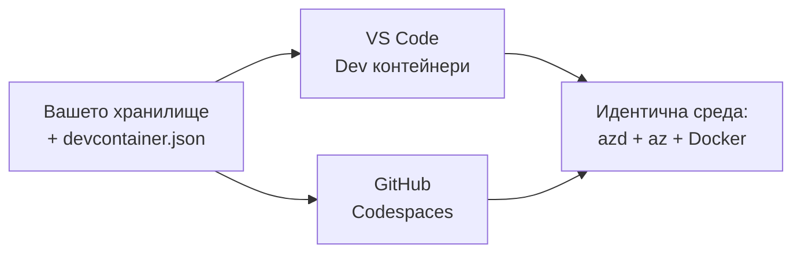

# Dev контейнери & GitHub Codespaces за azd

**Навигация на главата:**
- **📚 Начало на курса**: [AZD за начинаещи](../../README.md)
- **📖 Текуща глава**: Глава 1 - Основи и бърз старт
- **⬅️ Предишна**: [Използвайте собствено приложение](bring-your-own-app.md)
- **🚀 Следваща глава**: [Глава 2: Разработка, фокусирана върху ИИ](../chapter-02-ai-development/README.md)

> Валидирано спрямо `azd 1.25.6` през юни 2026.

## Въведение

Инсталирането на azd, подходящото runtime за езика, Docker и Azure CLI на всеки компютър е досадна задача — и това е основната причина урок, който "работи на моята машина", да не работи за някой друг. Един **dev контейнер** решава това, като описва цялата ви верига от инструменти в един файл. Всеки, който отвори проекта във VS Code или GitHub Codespaces, получава същата среда, с azd вече инсталиран. Този урок ви показва как да добавите такъв.

## Цели на обучението

Към края на този урок вие ще:
- Разберете какво е dev контейнер и защо помага при azd
- Добавите минимален `.devcontainer/devcontainer.json` към проект
- Включите azd, Azure CLI и Docker чрез Dev Container *features*
- Отворите проекта в GitHub Codespaces или VS Code

## Резултати от обучението

След завършване на урока ще можете да:
- Създадете `devcontainer.json` за azd проект
- Добавите azd и Azure инструменти без ръчни инсталации
- Стартирате `azd up` от вътре в контейнер или Codespace

---

## Какво е dev контейнер?

Dev контейнер е Docker-базирана среда за разработка, дефинирана от файл `.devcontainer/devcontainer.json` в репото ви. Когато отворите проекта:

- **VS Code** (с разширението Dev Containers) изгражда контейнера и се прикрепя към него.
- **GitHub Codespaces** изгражда същия контейнер в облака и ви дава редактор в браузъра.

И в двата случая всеки приносител получава идентични инструменти — никакво „инсталирал ли си azd?“ обезпокоително търсене на проблеми.



---

## Стъпка 1: Създаване на файла devcontainer

Създайте `.devcontainer/devcontainer.json` в корена на вашия проект:

```json
{
  "name": "azd-project",
  "image": "mcr.microsoft.com/devcontainers/base:bookworm",
  "features": {
    "ghcr.io/devcontainers/features/azure-cli:1": {},
    "ghcr.io/azure/azure-dev/azd:latest": {},
    "ghcr.io/devcontainers/features/docker-in-docker:2": {},
    "ghcr.io/devcontainers/features/node:1": {}
  },
  "customizations": {
    "vscode": {
      "extensions": [
        "ms-azuretools.azure-dev",
        "ms-azuretools.vscode-bicep"
      ]
    }
  },
  "forwardPorts": [3000],
  "postCreateCommand": "azd version"
}
```

Какво прави всяка част:

| Key | Purpose |
|-----|---------|
| `image` | Базова ОС за контейнера |
| `features` | Предварително изградени инсталатори — тук: Azure CLI, **azd**, Docker и Node.js |
| `customizations.vscode.extensions` | Автоматично инсталира разширенията azd и Bicep за VS Code |
| `forwardPorts` | Излага порта на вашето приложение към браузъра |
| `postCreateCommand` | Изпълнява се веднъж след изграждането на контейнера (тук: проверка на работоспособността) |

> Функцията `ghcr.io/azure/azure-dev/azd:latest` е официалният начин да получите azd в контейнер. Закрепете конкретна версия (например `azd:1.25.6`), ако се нуждаете от възпроизводимост.

---

## Стъпка 2: Съответствайте функцията на езика на вашето приложение

Заменете функцията `node` с каквото използва вашето приложение:

```jsonc
// Python project
"ghcr.io/devcontainers/features/python:1": {},

// .NET project
"ghcr.io/devcontainers/features/dotnet:2": {},

// Java project
"ghcr.io/devcontainers/features/java:1": {},

// Go project
"ghcr.io/devcontainers/features/go:1": {}
```

Запазете `docker-in-docker`, ако вашият `host` е `containerapp`, `aks` или нещо, което изгражда контейнерно изображение — azd се нуждае от Docker, за да изгражда и качва изображения.

---

## Стъпка 3: Отворете го

**В VS Code:**
1. Инсталирайте разширението **Dev Containers**.
2. Отворете папката на проекта.
3. Щракнете **Reopen in Container** когато бъдете подканени (или изпълнете *Dev Containers: Reopen in Container*).

**В GitHub Codespaces:**
1. Пушнете репото в GitHub.
2. Щракнете **Code → Codespaces → Create codespace on main**.
3. Изчакайте контейнерът да се изгради — azd е готов в терминала.

---

## Стъпка 4: Разгръщане от контейнера

Контейнерът има azd предварително инсталиран, така че обичайният работен процес работи както обикновено:

```bash
azd auth login --use-device-code   # кодът за устройство е удобен в Codespaces
azd up
```

> **Защо `--use-device-code`?** В отдалечен контейнер или Codespace няма локален браузър за пренасочване, затова влизането чрез device-code е надежден начин. Ще поставите код в раздел на браузъра, за да завършите влизането.

---

## Чести проблеми

| Проблем | Решение |
|---------|--------|
| `azd up` не може да изгради контейнерно изображение | Добавете функцията `docker-in-docker` |
| Влизането през браузър заседава в Codespaces | Използвайте `azd auth login --use-device-code` |
| Инструментите се различават между членовете на екипа | Фиксирайте версиите на функциите (напр. `azd:1.25.6`) |
| Приложението не е достъпно в браузъра | Добавете порта към `forwardPorts` |

---

## Обобщение

- Dev контейнер прави вашата azd верига от инструменти възпроизводима за всички.
- Добавете azd, Azure CLI и Docker чрез Dev Container *features*.
- Съответствайте езиковата функция на вашето приложение и пазете `docker-in-docker` за хостове на контейнери.
- Използвайте влизане чрез device-code, когато работите вътре в Codespaces.

---

## 🔗 Навигация

| Direction | Resource |
|-----------|----------|
| **Previous** | [Използвайте собствено приложение](bring-your-own-app.md) |
| **Chapter Home** | [Глава 1: Основи и бърз старт](README.md) |
| **Next Chapter** | [Глава 2: Разработка, фокусирана върху ИИ](../chapter-02-ai-development/README.md) |

## 📖 Свързани ресурси

- [Инсталация и настройка](installation.md)
- [Шпаргалка с команди](../../resources/cheat-sheet.md)
- [Официална спецификация на Dev Containers](https://containers.dev/)
- [Функция за Dev Container на azd](https://github.com/Azure/azure-dev/tree/main/ext/devcontainer)

---

<!-- CO-OP TRANSLATOR DISCLAIMER START -->
**Отказ от отговорност**:
Този документ е преведен с помощта на AI преводачески услуга [Co-op Translator](https://github.com/Azure/co-op-translator). Въпреки че се стремим към точност, моля имайте предвид, че автоматизираните преводи могат да съдържат грешки или неточности. Оригиналният документ на неговия роден език трябва да се счита за авторитетен източник. За критична информация се препоръчва професионален човешки превод. Ние не носим отговорност за каквито и да е недоразумения или неправилни тълкувания, произтичащи от използването на този превод.
<!-- CO-OP TRANSLATOR DISCLAIMER END -->