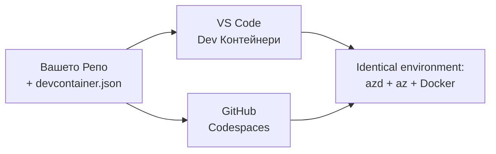

# Dev Containers & GitHub Codespaces за azd

**Навигация в Главата:**
- **📚 Начало на Курса**: [AZD за начинаещи](../../README.md)
- **📖 Текуща Глава**: Глава 1 - Основи и Бърз Старт
- **⬅️ Предишна**: [Използване на собствено приложение](bring-your-own-app.md)
- **🚀 Следваща Глава**: [Глава 2: Разработка с приоритет на ИИ](../chapter-02-ai-development/README.md)

> Валидирано срещу `azd 1.27.1` през юли 2026.

## Въведение

Инсталирането на azd, правилната програмна среда, Docker и Azure CLI на всяка машина е досадна задача — и това е основната причина уроци, които "работят на моята машина", да не работят на други. Един **dev container** решава този проблем, като описва целия ви инструментариум в един файл. Всеки, който отвори проекта във VS Code или GitHub Codespaces, получава точно същата среда, с предварително инсталиран azd. Този урок ви показва как да добавите такъв.

## Учебни цели

В края на този урок ще:
- Разберете какво е dev container и защо помага с azd
- Добавите минимален `.devcontainer/devcontainer.json` към проект
- Включите azd, Azure CLI и Docker чрез Dev Container *features*
- Отворите проекта в GitHub Codespaces или VS Code

## Резултати от обучението

След завършване на този урок ще можете:
- Да създадете `devcontainer.json` за проект с azd
- Да добавите инструменти за azd и Azure без ръчни инсталации
- Да стартирате `azd up` от вътре в контейнер или Codespace

---

## Какво е Dev Container?

Dev container е базирана на Docker среда за разработка, дефинирана чрез файл `.devcontainer/devcontainer.json` в репото ви. Когато отворите проекта:

- **VS Code** (с разширението Dev Containers) изгражда контейнера и се свързва с него.
- **GitHub Codespaces** изгражда същия контейнер в облака и ви предоставя редактор в браузъра.

Във всеки случай всеки съработник получава идентични инструменти — няма нужда да се пита "инсталирал ли си azd?".



---

## Стъпка 1: Създаване на файла devcontainer

Създайте `.devcontainer/devcontainer.json` в корена на вашия проект:

```json
{
  "name": "azd-project",
  "image": "mcr.microsoft.com/devcontainers/base:bookworm",
  "features": {
    "ghcr.io/devcontainers/features/azure-cli:1": {},
    "ghcr.io/azure/azure-dev/azd:latest": {},
    "ghcr.io/devcontainers/features/docker-in-docker:2": {},
    "ghcr.io/devcontainers/features/node:1": {}
  },
  "customizations": {
    "vscode": {
      "extensions": [
        "ms-azuretools.azure-dev",
        "ms-azuretools.vscode-bicep"
      ]
    }
  },
  "forwardPorts": [3000],
  "postCreateCommand": "azd version"
}
```

Какво прави всяка част:

| Ключ | Цел |
|-----|---------|
| `image` | Базова операционна система за контейнера |
| `features` | Предварително изградени инсталатори — тук: Azure CLI, **azd**, Docker и Node.js |
| `customizations.vscode.extensions` | Автоинсталира разширенията azd и Bicep за VS Code |
| `forwardPorts` | Отваря порт на вашето приложение за браузъра |
| `postCreateCommand` | Изпълнява се веднъж след изграждането на контейнера (тук, проверка за здрав разум) |

> `ghcr.io/azure/azure-dev/azd:latest` е официалният начин за получаване на azd в контейнер. За възпроизводимост можете да посочите конкретна версия (например `azd:1.27.1`).

---

## Стъпка 2: Съответствие на функцията с езика на приложението

Заменете `node` функцията с тази, която ползва вашето приложение:

```jsonc
// Python project
"ghcr.io/devcontainers/features/python:1": {},

// .NET project
"ghcr.io/devcontainers/features/dotnet:2": {},

// Java project
"ghcr.io/devcontainers/features/java:1": {},

// Go project
"ghcr.io/devcontainers/features/go:1": {}
```

Запазете `docker-in-docker`, ако `host` е `containerapp`, `aks` или нещо, което строи контейнерен образ — azd използва Docker за създаване и публикуване на образи.

---

## Стъпка 3: Отворете го

**Във VS Code:**
1. Инсталирайте разширението **Dev Containers**.
2. Отворете папката на проекта.
3. Кликнете **Reopen in Container**, когато се появи, или стартирайте *Dev Containers: Reopen in Container*.

**В GitHub Codespaces:**
1. Избутайте репото в GitHub.
2. Кликнете **Code → Codespaces → Create codespace on main**.
3. Изчакайте контейнерът да се изгради — azd е готов в терминала.

---

## Стъпка 4: Деплойване от вътре в контейнера

Контейнерът има предварително инсталиран azd, така че нормалната работа е изцяло възможна:

```bash
azd auth login --use-device-code   # кодът за устройството е удобен вътре в Codespaces
azd up
```

> **Защо `--use-device-code`?** В отдалечен контейнер или Codespace няма локален браузър за пренасочване, затова влизането чрез device-code е надежден метод. Ще въведете код в браузър, за да завършите влизането.

---

## Често срещани проблеми

| Проблем | Решение |
|---------|-----|
| `azd up` не може да създаде образ | Добавете функцията `docker-in-docker` |
| Влизането с браузър се задържа в Codespaces | Използвайте `azd auth login --use-device-code` |
| Инструментите се различават между колегите | Закрепете версии на функциите (напр. `azd:1.27.1`) |
| Приложението не е достъпно в браузър | Добавете порта в `forwardPorts` |

---

## Обобщение

- Dev container прави вашия azd инструментариум възпроизводим за всеки.
- Добавете azd, Azure CLI и Docker чрез Dev Container *features*.
- Съобразете функцията с езика на приложението и запазете `docker-in-docker` за контейнерни хостове.
- Използвайте device-code влизане при работа вътре в Codespaces.

---

## 🔗 Навигация

| Посока | Ресурс |
|-----------|----------|
| **Предишна** | [Използване на собствено приложение](bring-your-own-app.md) |
| **Начало на глава** | [Глава 1: Основи и Бърз Старт](README.md) |
| **Следваща глава** | [Глава 2: Разработка с приоритет на ИИ](../chapter-02-ai-development/README.md) |

## 📖 Свързани ресурси

- [Инсталиране и настройка](installation.md)
- [Списък с команди](../../resources/cheat-sheet.md)
- [Официална спецификация на Dev Containers](https://containers.dev/)
- [azd Dev Container функция](https://github.com/Azure/azure-dev/tree/main/ext/devcontainer)

---

<!-- CO-OP TRANSLATOR DISCLAIMER START -->
**Отказ от отговорност**:
Този документ е преведен с помощта на AI преводачески услуга [Co-op Translator](https://github.com/Azure/co-op-translator). Въпреки че се стремим към точност, моля имайте предвид, че автоматизираните преводи могат да съдържат грешки или неточности. Оригиналният документ на неговия роден език трябва да се счита за авторитетен източник. За критична информация се препоръчва професионален човешки превод. Ние не носим отговорност за каквито и да е недоразумения или неправилни тълкувания, произтичащи от използването на този превод.
<!-- CO-OP TRANSLATOR DISCLAIMER END -->