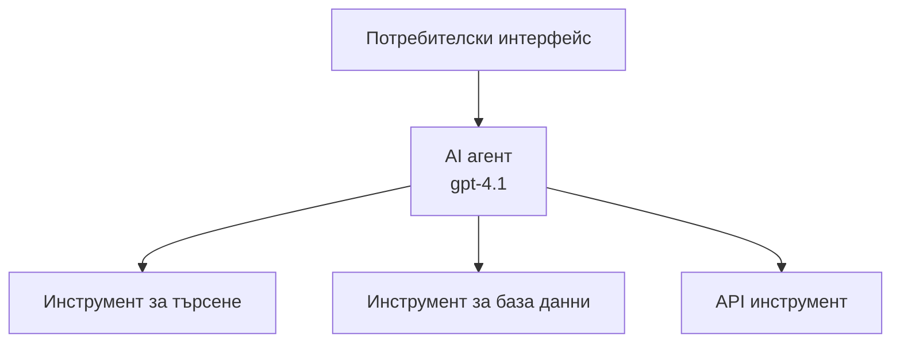
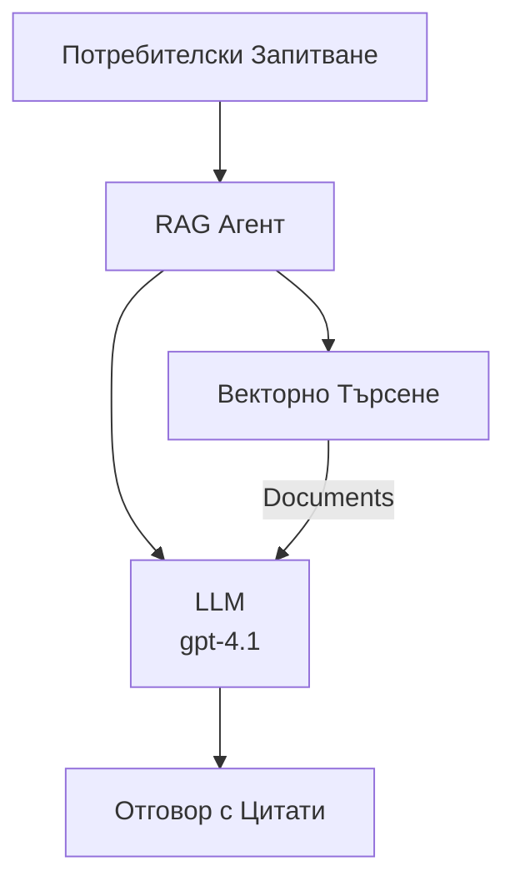
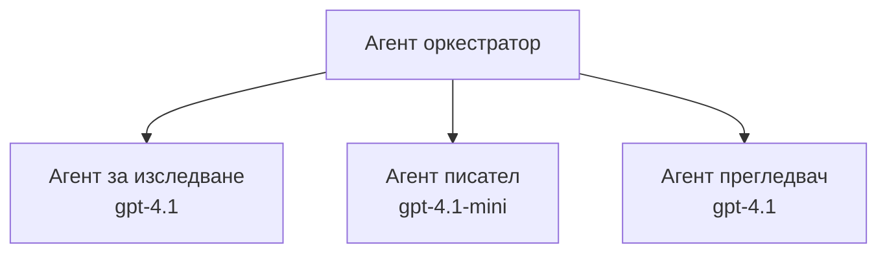

# AI Агенти с Azure Developer CLI

**Навигация в глава:**
- **📚 Начало на курса**: [AZD За начинаещи](../../README.md)
- **📖 Текуща глава**: Глава 2 - AI-Първо разработване
- **⬅️ Предишна**: [Интеграция на Microsoft Foundry](microsoft-foundry-integration.md)
- **➡️ Следваща**: [Деплоймънт на AI модел](ai-model-deployment.md)
- **🚀 Напреднали**: [Решения с множество агенти](../../examples/retail-scenario.md)

---

## Въведение

AI агентите са автономни програми, които могат да възприемат околната среда, да вземат решения и да предприемат действия за постигане на конкретни цели. За разлика от простите чатботове, които отговарят на заявки, агентите могат:

- **Да използват инструменти** - Извикване на API-та, търсене в бази данни, изпълнение на код
- **Да планират и разсъждават** - Разбиване на сложни задачи на стъпки
- **Да се учат от контекста** - Поддържане на памет и адаптиране на поведението
- **Да сътрудничат** - Работа с други агенти (мултиагентни системи)

Тази инструкция показва как да разположите AI агенти в Azure с помощта на Azure Developer CLI (azd).

> **Бележка за валидиране (2026-07-13):** Тази инструкция е проверена с `azd` версия `1.27.1` и `azure.ai.agents` версия `1.0.0-beta.5`. Понастоящем опитът с `azd ai` все още е в предварителен преглед, затова проверявайте помощта на разширението ако вашите инсталирани флагове се различават.

## Цели на обучението

След изпълнението на това ръководство, вие ще:
- Разберете какво са AI агентите и как се различават от чатботове
- Разположите предварително изградени шаблони за AI агенти с помощта на AZD
- Конфигурирате Foundry агенти за персонализирани агенти
- Имплементирате основни агентски модели (използване на инструменти, RAG, мултиагент)
- Монитирате и отстранявате грешки на разположени агенти

## Очаквани резултати

След завършване, ще можете:
- Да разположите AI агент приложения в Azure с една команда
- Да конфигурирате агентски инструменти и способности
- Да имплементирате retrieval-augmented generation (RAG) с агенти
- Да проектирате мултиагентни архитектури за сложни работни процеси
- Да отстранявате често срещани проблеми при разполагането на агенти

---

## 🤖 Какво прави един агент различен от чатбот?

| Характеристика | Чатбот | AI агент |
|---------|---------|----------|
| **Поведение** | Отговаря на заявки | Предприема автономни действия |
| **Инструменти** | Няма | Може да извиква API-та, да търси, да изпълнява код |
| **Памет** | Само базирана на сесия | Постоянна памет между сесиите |
| **Планиране** | Еднократен отговор | Многостъпков процес на разсъждение |
| **Сътрудничество** | Единична единица | Може да работи с други агенти |

### Проста аналогия

- **Чатбот** = Полезен човек, който отговаря на въпроси на информационно бюро
- **AI агент** = Личен асистент, който може да прави обаждания, да резервира срещи и да изпълнява задачи за вас

---

## 🚀 Бърз старт: Разположете първия си агент

### Опция 1: Шаблон Foundry Agents (Препоръчително)

```bash
# Инициализирайте шаблона за AI агенти
azd init --template get-started-with-ai-agents

# Разположете в Azure
azd up
```

**Какво се разполага:**
- ✅ Foundry агенти
- ✅ Microsoft Foundry модели (gpt-4.1)
- ✅ Azure AI Search (за RAG)
- ✅ Azure Container Apps (уеб интерфейс)
- ✅ Application Insights (мониторинг)

**Време:** ~15-20 минути
**Цена:** ~$100-150/месец (разработка)

### Опция 2: OpenAI Агент с Prompty

```bash
# Инициализирайте шаблона на агента, базиран на Prompty
azd init --template agent-openai-python-prompty

# Разположете в Azure
azd up
```

**Какво се разполага:**
- ✅ Azure Functions (безсървърно изпълнение на агент)
- ✅ Microsoft Foundry модели
- ✅ Файлове за конфигурация на Prompty
- ✅ Примерна имплементация на агент

**Време:** ~10-15 минути
**Цена:** ~$50-100/месец (разработка)

### Опция 3: RAG Чат агент

```bash
# Инициализиране на RAG чат шаблон
azd init --template azure-search-openai-demo

# Разгръщане в Azure
azd up
```

**Какво се разполага:**
- ✅ Microsoft Foundry модели
- ✅ Azure AI Search със примерни данни
- ✅ Пайплайн за обработка на документи
- ✅ Чат интерфейс с цитирания

**Време:** ~15-25 минути
**Цена:** ~$80-150/месец (разработка)

### Опция 4: AZD AI Agent Init (Преглед на базата на манифест или шаблон)

Ако имате манифест файл за агент, можете да използвате командата `azd ai`, за да скелетирате проект Foundry Agent Service директно. Последните версии в предварителен преглед добавиха и поддръжка на инициализация на базата на шаблони, така че точният поток на заявки може да варира леко според версията на разширението, която имате.

```bash
# Инсталирайте разширението AI агенти
azd extension install azure.ai.agents

# По желание: проверете инсталираната предварителна версия
azd extension show azure.ai.agents

# Инициализирайте от манифест на агент
azd ai agent init -m agent-manifest.yaml

# Разположете в Azure
azd up

# Тествайте разположения агент (показва закъснение + време до първия байт)
azd ai agent invoke
```

**Кога да използвате `azd ai agent init` спрямо `azd init --template`:**

| Подход | Най-подходящ за | Как работи |
|----------|----------|------|
| `azd init --template` | Започване от работещ пример приложение | Клонира цял шаблон на репо с код + инфраструктура |
| `azd ai agent init -m` | Изграждане от собствен агентски манифест | Създава структура на проекта от дефиницията на агента ви |

> **Съвет:** Използвайте `azd init --template`, когато учите (Опции 1-3 по-горе). Използвайте `azd ai agent init`, когато изграждате продукционни агенти със собствени манифести.

След `azd up`, същото разширение ви води през останалия жизнен цикъл на агента: `azd ai agent invoke` за тестване, `azd ai agent eval generate` и `azd ai agent optimize` за измерване и подобряване на качеството и `azd ai agent delete` за почистване. Вижте [AZD AI CLI Команди](../chapter-08-production/production-ai-practices.md#azd-ai-cli-commands-and-extensions) за пълния справочник.

---

## 🏗️ Архитектурни модели на агенти

### Модел 1: Един агент с инструменти

Най-простият модел на агент - един агент, който може да използва множество инструменти.



**Най-подходящ за:**
- Ботове за клиентска поддръжка
- Изследователски асистенти
- Данни анализиращи агенти

**AZD Шаблон:** `azure-search-openai-demo`

### Модел 2: RAG агент (генерация с добавено извличане)

Агент, който извлича релевантни документи преди да генерира отговори.



**Най-подходящ за:**
- Корпоративни бази знания
- Системи за въпроси и отговори с документи
- Съответствие и юридически изследвания

**AZD Шаблон:** `azure-search-openai-demo`

### Модел 3: Мултиагентна система

Несколько специализирани агенти, които работят заедно по сложни задачи.



**Най-подходящ за:**
- Сложно генериране на съдържание
- Многостъпкови работни процеси
- Задачи, изискващи различни експертизи

**Научете повече:** [Патерни за координация на мултиагенти](../chapter-06-pre-deployment/coordination-patterns.md)

---

## ⚙️ Конфигуриране на агентски инструменти

Агентите стават мощни, когато могат да използват инструменти. Ето как да конфигурирате общи инструменти:

### Конфигурация на инструменти във Foundry агенти

```python
# agent_config.py
from azure.ai.projects import AIProjectClient
from azure.ai.projects.models import FunctionTool, CodeInterpreterTool

# Дефиниране на потребителски инструменти
search_tool = FunctionTool(
    name="search_knowledge_base",
    description="Search the company knowledge base for relevant documents",
    parameters={
        "type": "object",
        "properties": {
            "query": {
                "type": "string",
                "description": "The search query"
            }
        },
        "required": ["query"]
    }
)

# Създаване на агент с инструменти
agent = project_client.agents.create_agent(
    model="gpt-4.1",
    name="Support Agent",
    instructions="You are a helpful support agent. Use the search tool to find relevant information.",
    tools=[search_tool, CodeInterpreterTool()]
)
```

### Конфигуриране на среда

```bash
# Настройте специфични за агента променливи на околната среда
azd env set AZURE_OPENAI_MODEL "gpt-4.1"
azd env set AGENT_INSTRUCTIONS "You are a helpful assistant..."
azd env set ENABLE_CODE_INTERPRETER "true"
azd env set ENABLE_FILE_SEARCH "true"

# Разположете с актуализирана конфигурация
azd deploy
```

---

## 📊 Мониторинг на агенти

### Интеграция с Application Insights

Всички AZD шаблони за агенти включват Application Insights за мониторинг:

```bash
# Отворете таблото за наблюдение
azd monitor --overview

# Преглед на живи дневници
azd monitor --logs

# Преглед на живи метрики
azd monitor --live
```

### Ключови метрики за наблюдение

| Метрика | Описание | Цел |
|--------|-------------|--------|
| Задържане на отговор | Време за генериране на отговор | < 5 секунди |
| Използване на токени | Токени на заявка | Мониторинг за разходи |
| Процент успешни извиквания на инструмент | % успешно изпълнени инструменти | > 95% |
| Процент на грешки | Провалили се заявки към агент | < 1% |
| Удовлетвореност на потребител | Оценки и обратна връзка | > 4.0/5.0 |

### Персонализирано логване за агенти

```python
import os
from azure.monitor.opentelemetry import configure_azure_monitor
from opentelemetry import trace

# Конфигуриране на Azure Monitor с OpenTelemetry
configure_azure_monitor(
    connection_string=os.environ["APPLICATIONINSIGHTS_CONNECTION_STRING"]
)

tracer = trace.get_tracer(__name__)

def log_agent_interaction(user_query, agent_response, tools_used, latency_ms):
    with tracer.start_as_current_span("agent_interaction") as span:
        span.set_attributes({
            "user_query": user_query,
            "response_length": len(agent_response),
            "tools_used": tools_used,
            "latency_ms": latency_ms
        })
```

> **Бележка:** Инсталирайте нужните пакети: `pip install azure-monitor-opentelemetry opentelemetry`

---

## 💰 Финансови съображения

### Оценка на месечните разходи според модел

| Модел | Среда за разработка | Продукция |
|---------|-----------------|------------|
| Един агент | $50-100 | $200-500 |
| RAG агент | $80-150 | $300-800 |
| Мултиагентна система (2-3 агенти) | $150-300 | $500-1,500 |
| Корпоративна мултиагентна | $300-500 | $1,500-5,000+ |

### Съвети за оптимизация на разходите

1. **Използвайте gpt-4.1-mini за прости задачи**
   ```bash
   azd env set AZURE_OPENAI_MODEL "gpt-4.1-mini"
   ```

2. **Имплементирайте кеширане за повторни заявки**
   ```python
   from functools import lru_cache
   
   @lru_cache(maxsize=1000)
   def get_cached_response(query_hash):
       return agent.run(query_hash)
   ```

3. **Задайте лимити на токените за всяко изпълнение**
   ```python
   # Задайте max_completion_tokens при стартиране на агента, не по време на създаването
   run = project_client.agents.create_run(
       thread_id=thread.id,
       agent_id=agent.id,
       max_completion_tokens=1000  # Ограничете дължината на отговора
   )
   ```

4. **Мащабирайте до нула, когато не използвате**
   ```bash
   # Контейнерните приложения автоматично се мащабират до нула
   azd env set MIN_REPLICAS "0"
   ```

---

## 🔧 Отстраняване на проблеми с агенти

### Често срещани проблеми и решения

<details>
<summary><strong>❌ Агентът не отговаря на извиквания на инструменти</strong></summary>

```bash
# Проверете дали инструментите са правилно регистрирани
azd show

# Проверете внедряването на OpenAI
az cognitiveservices account deployment list \
  --name $AZURE_OPENAI_NAME \
  --resource-group $RG_NAME

# Проверете регистрационните файлове на агента
azd monitor --logs
```

**Чести причини:**
- Несъвпадение в подписа на функцията за инструмента
- Липсващи нужни разрешения
- API крайна точка недостъпна
</details>

<details>
<summary><strong>❌ Висока латентност в отговорите на агента</strong></summary>

```bash
# Проверете Application Insights за тесни места
azd monitor --live

# Помислете за използване на по-бърз модел
azd env set AZURE_OPENAI_MODEL "gpt-4.1-mini"
azd deploy
```

**Съвети за оптимизация:**
- Използвайте стрийминг отговори
- Имплементирайте кеширане на отговори
- Намалете размера на контекстния прозорец
</details>

<details>
<summary><strong>❌ Агент върши грешна или халюцинирана информация</strong></summary>

```python
# Подобряване с по-добри системни подсказки
instructions = """
You are a helpful assistant. IMPORTANT:
- Only answer based on provided context
- If you don't know, say "I don't know"
- Always cite your sources
- Never make up information
"""

# Добавяне на извличане за основаване
agent = project_client.agents.create_agent(
    model="gpt-4.1",
    instructions=instructions,
    tools=[FileSearchTool()]  # Основаване на отговорите в документи
)
```
</details>

<details>
<summary><strong>❌ Грешки за превишен лимит на токени</strong></summary>

```python
# Имплементиране на управление на контекстното прозорче
def truncate_context(messages, max_tokens=8000, model="gpt-4.1"):
    """Keep only recent messages within token limit."""
    import tiktoken
    encoding = tiktoken.encoding_for_model(model)
    total_tokens = 0
    truncated = []
    
    for msg in reversed(messages):
        msg_tokens = len(encoding.encode(msg.content))
        if total_tokens + msg_tokens > max_tokens:
            break
        truncated.insert(0, msg)
        total_tokens += msg_tokens
    
    return truncated
```
</details>

---

## 🎓 Практически упражнения

### Упражнение 1: Разгръщане на основен агент (20 минути)

**Цел:** Разположете първия си AI агент с AZD

```bash
# Стъпка 1: Инициализиране на шаблона
azd init --template get-started-with-ai-agents

# Стъпка 2: Вход в Azure
azd auth login
# Ако работите с няколко клиента, добавете --tenant-id <tenant-id>

# Стъпка 3: Разгръщане
azd up

# Стъпка 4: Тествайте агента
# Очакван изход след разгръщане:
#   Разгръщането е завършено!
#   Крайна точка: https://<app-name>.<region>.azurecontainerapps.io
# Отворете URL адреса, показан в изхода, и опитайте да зададете въпрос

# Стъпка 5: Преглед на мониторинга
azd monitor --overview

# Стъпка 6: Изчистване
azd down --force --purge
```

**Критерии за успех:**
- [ ] Агентът отговаря на въпроси
- [ ] Достъп до таблото за мониторинг чрез `azd monitor`
- [ ] Ресурсите са почистени успешно

### Упражнение 2: Добавяне на персонализиран инструмент (30 минути)

**Цел:** Разширете агента с персонализиран инструмент

1. Разположете шаблона на агента:
   ```bash
   azd init --template get-started-with-ai-agents
   azd up
   ```
2. Създайте нова функция за инструмент в кода на агента:
   ```python
   def get_weather(location: str) -> str:
       """Get current weather for a location."""
       # API повикване към метеорологична услуга
       return f"Weather in {location}: Sunny, 72°F"
   ```
3. Регистрирайте инструмента с агента:
   ```python
   from azure.ai.projects.models import FunctionTool

   weather_tool = FunctionTool(
       name="get_weather",
       description="Get current weather for a location",
       parameters={
           "type": "object",
           "properties": {
               "location": {"type": "string", "description": "City name"}
           },
           "required": ["location"]
       }
   )

   agent = project_client.agents.create_agent(
       model="gpt-4.1",
       name="Weather Agent",
       tools=[weather_tool]
   )
   ```
4. Реразположете и тествайте:
   ```bash
   azd deploy
   # Попитайте: "Какво е времето в Сиатъл?"
   # Очаквано: Агентът извиква get_weather("Seattle") и връща информация за времето
   ```

**Критерии за успех:**
- [ ] Агентът разпознава заявки свързани с времето
- [ ] Инструментът се извиква правилно
- [ ] Отговорът включва информация за времето

### Упражнение 3: Създайте RAG агент (45 минути)

**Цел:** Създайте агент, който отговаря на въпроси от вашите документи

```bash
# Стъпка 1: Разгръщане на RAG шаблон
azd init --template azure-search-openai-demo
azd up

# Стъпка 2: Качете вашите документи
# Поставете PDF/TXT файлове в директорията data/, след което изпълнете:
python scripts/prepdocs.py

# Стъпка 3: Тествайте с въпроси, специфични за домейна
# Отворете URL адреса на уеб приложението от изхода на azd up
# Задавайте въпроси за качените от вас документи
# Отговорите трябва да включват позовавания като [doc.pdf]
```

**Критерии за успех:**
- [ ] Агентът отговаря от качени документи
- [ ] Отговорите включват цитирания
- [ ] Няма халюцинации при въпроси извън обсега

---

## 📚 Следващи стъпки

След като разбирате AI агентите, разгледайте тези напреднали теми:

| Тема | Описание | Връзка |
|-------|-------------|------|
| **Мултиагентни системи** | Изграждане на системи с множество взаимодействащи агенти | [Пример за мултиагентна търговия](../../examples/retail-scenario.md) |
| **Координационни патерни** | Научете модели за оркестрация и комуникация | [Координационни патерни](../chapter-06-pre-deployment/coordination-patterns.md) |
| **Деплоймънт в продукция** | Агентско разполагане, готово за бизнеса | [Практики за продукционен AI](../chapter-08-production/production-ai-practices.md) |
| **Оценка на агенти** | Тест и оценка на производителността на агенти | [Отстраняване на проблеми с AI](../chapter-07-troubleshooting/ai-troubleshooting.md) |
| **AI Workshop Lab** | Практическа: Направете AI решението си готово за AZD | [AI Workshop Lab](ai-workshop-lab.md) |

---

## 📖 Допълнителни ресурси

### Официална документация
- [Microsoft Foundry Agent Service](https://learn.microsoft.com/azure/ai-services/agents/)
- [Microsoft Foundry Agent Service Бърз старт](https://learn.microsoft.com/azure/ai-services/agents/quickstart)
- [Semantic Kernel Agent Framework](https://learn.microsoft.com/semantic-kernel/)

### AZD шаблони за агенти
- [Започнете с AI агенти](https://github.com/Azure-Samples/get-started-with-ai-agents)
- [Agent OpenAI Python Prompty](https://github.com/Azure-Samples/agent-openai-python-prompty)
- [Azure Search OpenAI Demo](https://github.com/Azure-Samples/azure-search-openai-demo)

### Ресурси на общността
- [Awesome AZD - Agent Templates](https://azure.github.io/awesome-azd/?tags=ai-agents)
- [Azure AI Discord](https://discord.gg/microsoft-azure)
- [Microsoft Foundry Discord](https://discord.gg/nTYy5BXMWG)

### Агентски умения за вашия редактор
- [**Microsoft Azure Agent Skills**](https://skills.sh/microsoft/github-copilot-for-azure) - Инсталирайте преизползваеми AI агентски умения за разработка в Azure в GitHub Copilot, Cursor или всеки поддържан агент. Включва умения за [Azure AI](https://skills.sh/microsoft/github-copilot-for-azure/azure-ai), [Microsoft Foundry](https://skills.sh/microsoft/github-copilot-for-azure/microsoft-foundry), [деплоймънт](https://skills.sh/microsoft/github-copilot-for-azure/azure-deploy) и [диагностика](https://skills.sh/microsoft/github-copilot-for-azure/azure-diagnostics):
  ```bash
  npx skills add microsoft/github-copilot-for-azure
  ```

---

**Навигация**
- **Предишен урок**: [Интеграция Microsoft Foundry](microsoft-foundry-integration.md)
- **Следващ урок**: [Деплоймънт на AI модел](ai-model-deployment.md)

---

<!-- CO-OP TRANSLATOR DISCLAIMER START -->
**Отказ от отговорност**:
Този документ е преведен с помощта на AI преводачески услуга [Co-op Translator](https://github.com/Azure/co-op-translator). Въпреки че се стремим към точност, моля имайте предвид, че автоматизираните преводи могат да съдържат грешки или неточности. Оригиналният документ на неговия роден език трябва да се счита за авторитетен източник. За критична информация се препоръчва професионален човешки превод. Ние не носим отговорност за каквито и да е недоразумения или неправилни тълкувания, произтичащи от използването на този превод.
<!-- CO-OP TRANSLATOR DISCLAIMER END -->