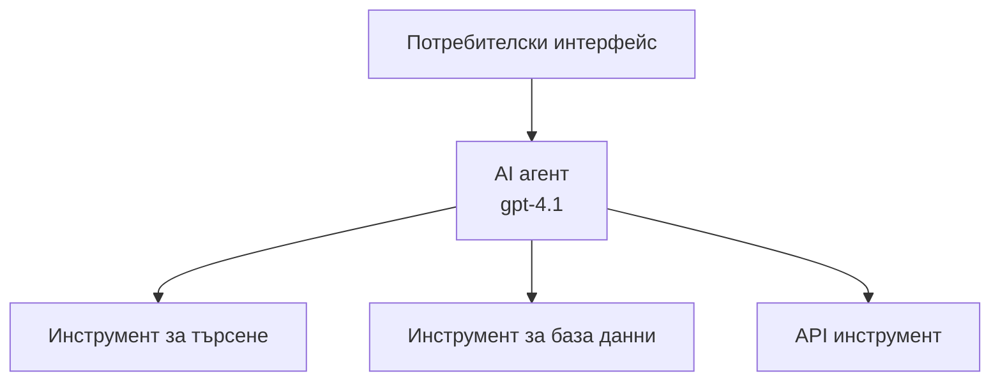
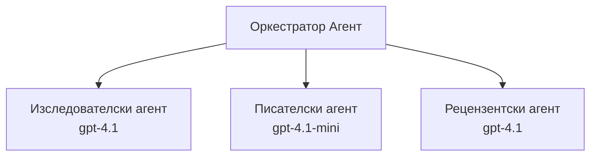

# AI агенти с Azure Developer CLI

**Навигация в глава:**
- **📚 Начална страница на курса**: [AZD For Beginners](../../README.md)
- **📖 Текуща глава**: Глава 2 - AI-First Development
- **⬅️ Предишна**: [Microsoft Foundry Integration](microsoft-foundry-integration.md)
- **➡️ Следваща**: [AI Model Deployment](ai-model-deployment.md)
- **🚀 Разширено**: [Multi-Agent Solutions](../../examples/retail-scenario.md)

---

## Въведение

AI агентите са автономни програми, които могат да възприемат средата си, да вземат решения и да предприемат действия за постигане на конкретни цели. За разлика от простите чатботове, които отговарят на подканвания, агентите могат да:

- **Използват инструменти** - Извикват API-та, търсят в бази данни, изпълняват код
- **Планират и разсъждават** - Разбиват сложни задачи на стъпки
- **Учaт от контекста** - Поддържат памет и адаптират поведението си
- **Сътрудничат** - Работят с други агенти (мулти-агентни системи)

Това ръководство показва как да разположите AI агенти в Azure, използвайки Azure Developer CLI (azd).

> **Забележка за валидиране (2026-03-25):** Това ръководство е прегледано спрямо `azd` `1.23.12` и `azure.ai.agents` `0.1.18-preview`. Изживяването `azd ai` все още е в предварителен преглед, така че проверете помощта на разширението, ако наличните ви флагове се различават.

## Цели на обучението

Като завършите това ръководство, вие ще:
- Разберете какво представляват AI агентите и как се различават от чатботовете
- Разположите предварително изградени шаблони за AI агенти с AZD
- Конфигурирате Foundry Agents за персонализирани агенти
- Реализирате основни модели за агенти (използване на инструменти, RAG, мулти-агент)
- Наблюдавате и отстранявате грешки при разположени агенти

## Резултати от обучението

След завършване ще можете да:
- Разположите AI агент приложения в Azure с една команда
- Конфигурирате инструменти и възможности на агента
- Реализирате retrieval-augmented generation (RAG) с агенти
- Проектирате мулти-агентни архитектури за сложни работни потоци
- Отстранявате често срещани проблеми при разполагане на агенти

---

## 🤖 Какво прави агента различен от чатбот?

| Характеристика | Чатбот | AI агент |
|---------|---------|----------|
| **Поведение** | Отговаря на подканвания | Извършва автономни действия |
| **Инструменти** | Няма | Може да извиква API-та, да търси, да изпълнява код |
| **Памет** | Само на сесия | Постоянна памет между сесии |
| **Планиране** | Единствен отговор | Многостъпково разсъждение |
| **Сътрудничество** | Единствен субект | Може да работи с други агенти |

### Проста аналогия

- **Чатбот** = Полезен човек, отговарящ на въпроси на информационно гише
- **AI агент** = Личен асистент, който може да прави обаждания, да запазва часове и да изпълнява задачи вместо вас

---

## 🚀 Бърз старт: Разположете първия си агент

### Опция 1: Шаблон Foundry Agents (Препоръчително)

```bash
# Инициализиране на шаблона за ИИ агенти
azd init --template get-started-with-ai-agents

# Разгръщане в Azure
azd up
```

**Какво се разгръща:**
- ✅ Foundry Agents
- ✅ Microsoft Foundry Models (gpt-4.1)
- ✅ Azure AI Search (за RAG)
- ✅ Azure Container Apps (уеб интерфейс)
- ✅ Application Insights (мониторинг)

**Време:** ~15-20 минути
**Цена:** ~$100-150/месец (разработка)

### Опция 2: OpenAI агент с Prompty

```bash
# Инициализирайте шаблона на агент, базиран на Prompty
azd init --template agent-openai-python-prompty

# Разположете в Azure
azd up
```

**Какво се разгръща:**
- ✅ Azure Functions (serverless изпълнение на агента)
- ✅ Microsoft Foundry Models
- ✅ Prompty конфигурационни файлове
- ✅ Примерна реализация на агент

**Време:** ~10-15 минути
**Цена:** ~$50-100/месец (разработка)

### Опция 3: RAG чат агент

```bash
# Инициализиране на шаблон за RAG чат
azd init --template azure-search-openai-demo

# Разгръщане в Azure
azd up
```

**Какво се разгръща:**
- ✅ Microsoft Foundry Models
- ✅ Azure AI Search с примерни данни
- ✅ Пайплайн за обработка на документи
- ✅ Чат интерфейс с цитиране на източници

**Време:** ~15-25 минути
**Цена:** ~$80-150/месец (разработка)

### Опция 4: AZD AI Agent Init (Предварителен преглед, базиран на манифест или шаблон)

Ако имате агентен манифест файл, можете да използвате командата `azd ai`, за да скелетирате проект на Foundry Agent Service директно. Последните предварителни версии също добавиха поддръжка за инициализация, базирана на шаблони, така че точният поток на подканите може да се различава леко в зависимост от версията на разширението, която сте инсталирали.

```bash
# Инсталирайте разширението за AI агенти
azd extension install azure.ai.agents

# По избор: проверете инсталираната предварителна версия
azd extension show azure.ai.agents

# Инициализирайте от манифест на агент
azd ai agent init -m agent-manifest.yaml

# Разположете в Azure
azd up

# Тествайте разположения агент (показва закъснение + време до първия байт)
azd ai agent invoke
```

**Кога да използвате `azd ai agent init` vs `azd init --template`:**

| Подход | Подходящо за | Как работи |
|----------|----------|------|
| `azd init --template` | Започване от работещ примерен проект | Клонира пълно репо с шаблон с код + инфраструктура |
| `azd ai agent init -m` | Изграждане от ваш собствен агентен манифест | Скелетира структура на проекта от вашето агентно определение |

> **Съвет:** Използвайте `azd init --template`, когато учите (Опции 1-3 по-горе). Използвайте `azd ai agent init`, когато изграждате продукционни агенти със собствените си манифести.

След `azd up`, същото разширение ви води през останалия жизнен цикъл на агента: `azd ai agent invoke` за тестване, `azd ai agent eval generate` и `azd ai agent optimize` за измерване и подобряване на качеството и `azd ai agent delete` за почистване. Вижте [AZD AI CLI Commands](../chapter-08-production/production-ai-practices.md#azd-ai-cli-commands-and-extensions) за пълната справка.

---

## 🏗️ Шаблони на архитектурата на агенти

### Шаблон 1: Един агент с инструменти

Най-простият шаблон - един агент, който може да използва множество инструменти.



**Подходящо за:**
- Ботове за обслужване на клиенти
- Асистенти за изследвания
- Агенти за анализ на данни

**AZD шаблон:** `azure-search-openai-demo`

### Шаблон 2: RAG агент (Retrieval-Augmented Generation)

Агент, който извлича релевантни документи преди да генерира отговори.


**Подходящо за:**
- Корпоративни бази знания
- Системи за въпроси и отговори върху документи
- Проучвания по съответствие и правни изследвания

**AZD шаблон:** `azure-search-openai-demo`

### Шаблон 3: Мулти-агентна система

Няколко специализирани агента, работещи заедно по сложни задачи.



**Подходящо за:**
- Сложно генериране на съдържание
- Многостъпкови работни процеси
- Задачи, изискващи различни области на експертиза

**Научете повече:** [Multi-Agent Coordination Patterns](../chapter-06-pre-deployment/coordination-patterns.md)

---

## ⚙️ Конфигуриране на инструменти за агенти

Агентите стават мощни, когато могат да използват инструменти. Ето как да конфигурирате често използвани инструменти:

### Конфигурация на инструменти в Foundry Agents

```python
# agent_config.py
from azure.ai.projects import AIProjectClient
from azure.ai.projects.models import FunctionTool, CodeInterpreterTool

# Дефиниране на персонализирани инструменти
search_tool = FunctionTool(
    name="search_knowledge_base",
    description="Search the company knowledge base for relevant documents",
    parameters={
        "type": "object",
        "properties": {
            "query": {
                "type": "string",
                "description": "The search query"
            }
        },
        "required": ["query"]
    }
)

# Създаване на агент с инструменти
agent = project_client.agents.create_agent(
    model="gpt-4.1",
    name="Support Agent",
    instructions="You are a helpful support agent. Use the search tool to find relevant information.",
    tools=[search_tool, CodeInterpreterTool()]
)
```

### Конфигурация на средата

```bash
# Задаване на специфични за агента променливи на средата
azd env set AZURE_OPENAI_MODEL "gpt-4.1"
azd env set AGENT_INSTRUCTIONS "You are a helpful assistant..."
azd env set ENABLE_CODE_INTERPRETER "true"
azd env set ENABLE_FILE_SEARCH "true"

# Разгръщане с актуализирана конфигурация
azd deploy
```

---

## 📊 Наблюдение на агенти

### Интеграция с Application Insights

Всички AZD шаблони за агенти включват Application Insights за мониторинг:

```bash
# Отвори таблото за наблюдение
azd monitor --overview

# Прегледай логовете в реално време
azd monitor --logs

# Прегледай метриките в реално време
azd monitor --live
```

### Ключови метрики за проследяване

| Метрика | Описание | Цел |
|--------|-------------|--------|
| Забавяне на отговора | Време за генериране на отговор | < 5 секунди |
| Използване на токени | Токени на заявка | Следете за разходи |
| Процент успешни повиквания на инструменти | % успешни изпълнения на инструменти | > 95% |
| Процент грешки | Неуспешни заявки към агента | < 1% |
| Удовлетвореност на потребителите | Оценки от обратна връзка | > 4.0/5.0 |

### Персонализирано логиране за агенти

```python
import os
from azure.monitor.opentelemetry import configure_azure_monitor
from opentelemetry import trace

# Конфигурирайте Azure Monitor с OpenTelemetry
configure_azure_monitor(
    connection_string=os.environ["APPLICATIONINSIGHTS_CONNECTION_STRING"]
)

tracer = trace.get_tracer(__name__)

def log_agent_interaction(user_query, agent_response, tools_used, latency_ms):
    with tracer.start_as_current_span("agent_interaction") as span:
        span.set_attributes({
            "user_query": user_query,
            "response_length": len(agent_response),
            "tools_used": tools_used,
            "latency_ms": latency_ms
        })
```

> **Бележка:** Инсталирайте необходимите пакети: `pip install azure-monitor-opentelemetry opentelemetry`

---

## 💰 Съображения за разходи

### Прогнозни месечни разходи по шаблон

| Шаблон | Среда за разработка | Продукция |
|---------|-----------------|------------|
| Един агент | $50-100 | $200-500 |
| RAG агент | $80-150 | $300-800 |
| Мулти-агент (2-3 агента) | $150-300 | $500-1,500 |
| Корпоративен мулти-агент | $300-500 | $1,500-5,000+ |

### Съвети за оптимизация на разходите

1. **Използвайте gpt-4.1-mini за прости задачи**
   ```bash
   azd env set AZURE_OPENAI_MODEL "gpt-4.1-mini"
   ```

2. **Реализирайте кеширане за повтарящи се заявки**
   ```python
   from functools import lru_cache
   
   @lru_cache(maxsize=1000)
   def get_cached_response(query_hash):
       return agent.run(query_hash)
   ```

3. **Задайте лимити на токените на изпълнение**
   ```python
   # Задайте max_completion_tokens при изпълнение на агента, а не при създаване
   run = project_client.agents.create_run(
       thread_id=thread.id,
       agent_id=agent.id,
       max_completion_tokens=1000  # Ограничете дължината на отговора
   )
   ```

4. **Мащабирайте до нула, когато не се използва**
   ```bash
   # Контейнерните приложения автоматично се скалират до нула
   azd env set MIN_REPLICAS "0"
   ```

---

## 🔧 Отстраняване на проблеми с агентите

### Често срещани проблеми и решения

<details>
<summary><strong>❌ Агентът не отговаря на повикванията към инструменти</strong></summary>

```bash
# Проверете дали инструментите са регистрирани правилно
azd show

# Проверете внедряването на OpenAI
az cognitiveservices account deployment list \
  --name $AZURE_OPENAI_NAME \
  --resource-group $RG_NAME

# Проверете логовете на агента
azd monitor --logs
```

**Чести причини:**
- Несъответствие в подписа на функцията на инструмента
- Липсващи необходими разрешения
- API крайна точка недостъпна
</details>

<details>
<summary><strong>❌ Високо забавяне в отговорите на агента</strong></summary>

```bash
# Проверете Application Insights за тесни места
azd monitor --live

# Помислете за използване на по-бърз модел
azd env set AZURE_OPENAI_MODEL "gpt-4.1-mini"
azd deploy
```

**Съвети за оптимизация:**
- Използвайте стрийминг отговори
- Реализирайте кеширане на отговорите
- Намалете размера на контекстния прозорец
</details>

<details>
<summary><strong>❌ Агентът връща неверни или халюцинирани информации</strong></summary>

```python
# Подобрете чрез по-добри системни подсказки
instructions = """
You are a helpful assistant. IMPORTANT:
- Only answer based on provided context
- If you don't know, say "I don't know"
- Always cite your sources
- Never make up information
"""

# Добавете извличане за обвързване с източници
agent = project_client.agents.create_agent(
    model="gpt-4.1",
    instructions=instructions,
    tools=[FileSearchTool()]  # Обвържете отговорите с документи
)
```
</details>

<details>
<summary><strong>❌ Грешки: надвишен лимит на токени</strong></summary>

```python
# Реализирайте управление на контекстния прозорец
def truncate_context(messages, max_tokens=8000, model="gpt-4.1"):
    """Keep only recent messages within token limit."""
    import tiktoken
    encoding = tiktoken.encoding_for_model(model)
    total_tokens = 0
    truncated = []
    
    for msg in reversed(messages):
        msg_tokens = len(encoding.encode(msg.content))
        if total_tokens + msg_tokens > max_tokens:
            break
        truncated.insert(0, msg)
        total_tokens += msg_tokens
    
    return truncated
```
</details>

---

## 🎓 Практически упражнения

### Упражнение 1: Разположете базов агент (20 минути)

**Цел:** Разположете първия си AI агент с помощта на AZD

```bash
# Стъпка 1: Инициализиране на шаблона
azd init --template get-started-with-ai-agents

# Стъпка 2: Вход в Azure
azd auth login
# Ако работите с различни наематели, добавете --tenant-id <tenant-id>

# Стъпка 3: Разгръщане
azd up

# Стъпка 4: Тестване на агента
# Очакван изход след разгръщане:
#   Разгръщането е завършено!
#   Крайна точка: https://<app-name>.<region>.azurecontainerapps.io
# Отворете URL адреса, показан в изхода, и опитайте да зададете въпрос

# Стъпка 5: Преглед на мониторинга
azd monitor --overview

# Стъпка 6: Почистване
azd down --force --purge
```

**Критерии за успех:**
- [ ] Агентът отговаря на въпроси
- [ ] Можете да получите достъп до таблото за мониторинг чрез `azd monitor`
- [ ] Ресурсите са почистени успешно

### Упражнение 2: Добавете персонализиран инструмент (30 минути)

**Цел:** Разширете агент с персонализиран инструмент

1. Разположете шаблона на агента:
   ```bash
   azd init --template get-started-with-ai-agents
   azd up
   ```
2. Създайте нова функция за инструмент в кода на агента:
   ```python
   def get_weather(location: str) -> str:
       """Get current weather for a location."""
       # API повикване към метеорологична услуга
       return f"Weather in {location}: Sunny, 72°F"
   ```
3. Регистрирайте инструмента с агента:
   ```python
   from azure.ai.projects.models import FunctionTool

   weather_tool = FunctionTool(
       name="get_weather",
       description="Get current weather for a location",
       parameters={
           "type": "object",
           "properties": {
               "location": {"type": "string", "description": "City name"}
           },
           "required": ["location"]
       }
   )

   agent = project_client.agents.create_agent(
       model="gpt-4.1",
       name="Weather Agent",
       tools=[weather_tool]
   )
   ```
4. Прекомпозирайте и тествайте:
   ```bash
   azd deploy
   # Попитайте: "Какво е времето в Сиатъл?"
   # Очаквано: Агентът извиква get_weather("Seattle") и връща информация за времето
   ```

**Критерии за успех:**
- [ ] Агентът разпознава заявки, свързани с времето
- [ ] Инструментът се извиква правилно
- [ ] Отговорът включва информация за времето

### Упражнение 3: Създайте RAG агент (45 минути)

**Цел:** Създайте агент, който отговаря на въпроси от вашите документи

```bash
# Стъпка 1: Разгърнете RAG шаблона
azd init --template azure-search-openai-demo
azd up

# Стъпка 2: Качете документите си
# Поставете PDF/TXT файловете в директорията data/, след това изпълнете:
python scripts/prepdocs.py

# Стъпка 3: Тествайте с въпроси, специфични за домейна
# Отворете URL адреса на уеб приложението от изхода на azd up
# Задавайте въпроси за качените си документи
# Отговорите трябва да включват препратки за цитиране като [doc.pdf]
```

**Критерии за успех:**
- [ ] Агентът отговаря въз основа на качени документи
- [ ] Отговорите съдържат цитати
- [ ] Няма халюцинации при въпроси извън обхвата

---

## 📚 Следващи стъпки

Сега, когато разбирате AI агентите, разгледайте тези разширени теми:

| Тема | Описание | Връзка |
|-------|-------------|------|
| **Мулти-агентни системи** | Изграждане на системи с множество сътрудничещи агенти | [Retail Multi-Agent Example](../../examples/retail-scenario.md) |
| **Шаблони за координация** | Научете оркестрационни и комуникационни модели | [Coordination Patterns](../chapter-06-pre-deployment/coordination-patterns.md) |
| **Продукционно разгръщане** | Разгръщане на агенти, пригодено за предприятия | [Production AI Practices](../chapter-08-production/production-ai-practices.md) |
| **Оценка на агенти** | Тествайте и оценете производителността на агентите | [AI Troubleshooting](../chapter-07-troubleshooting/ai-troubleshooting.md) |
| **AI Workshop Lab** | Практическо: Направете AI решението си готово за AZD | [AI Workshop Lab](ai-workshop-lab.md) |

---

## 📖 Допълнителни ресурси

### Официална документация
- [Microsoft Foundry Agent Service](https://learn.microsoft.com/azure/ai-services/agents/)
- [Microsoft Foundry Agent Service Quickstart](https://learn.microsoft.com/azure/ai-services/agents/quickstart)
- [Semantic Kernel Agent Framework](https://learn.microsoft.com/semantic-kernel/)

### AZD шаблони за агенти
- [Get Started with AI Agents](https://github.com/Azure-Samples/get-started-with-ai-agents)
- [Agent OpenAI Python Prompty](https://github.com/Azure-Samples/agent-openai-python-prompty)
- [Azure Search OpenAI Demo](https://github.com/Azure-Samples/azure-search-openai-demo)

### Общностни ресурси
- [Awesome AZD - Agent Templates](https://azure.github.io/awesome-azd/?tags=ai-agents)
- [Azure AI Discord](https://discord.gg/microsoft-azure)
- [Microsoft Foundry Discord](https://discord.gg/nTYy5BXMWG)

### Умения за агенти за вашия редактор
- [**Microsoft Azure Agent Skills**](https://skills.sh/microsoft/github-copilot-for-azure) - Инсталирайте многократно използваеми умения за AI агенти за разработка в Azure в GitHub Copilot, Cursor или всеки поддържан агент. Включва умения за [Azure AI](https://skills.sh/microsoft/github-copilot-for-azure/azure-ai), [Microsoft Foundry](https://skills.sh/microsoft/github-copilot-for-azure/microsoft-foundry), [deployment](https://skills.sh/microsoft/github-copilot-for-azure/azure-deploy), и [diagnostics](https://skills.sh/microsoft/github-copilot-for-azure/azure-diagnostics):
  ```bash
  npx skills add microsoft/github-copilot-for-azure
  ```

---

**Навигация**
- **Предишен урок**: [Microsoft Foundry Integration](microsoft-foundry-integration.md)
- **Следващ урок**: [AI Model Deployment](ai-model-deployment.md)

---

<!-- CO-OP TRANSLATOR DISCLAIMER START -->
**Отказ от отговорност**:
Този документ е преведен с помощта на AI преводачески услуга [Co-op Translator](https://github.com/Azure/co-op-translator). Въпреки че се стремим към точност, моля имайте предвид, че автоматизираните преводи могат да съдържат грешки или неточности. Оригиналният документ на неговия роден език трябва да се счита за авторитетен източник. За критична информация се препоръчва професионален човешки превод. Ние не носим отговорност за каквито и да е недоразумения или неправилни тълкувания, произтичащи от използването на този превод.
<!-- CO-OP TRANSLATOR DISCLAIMER END -->