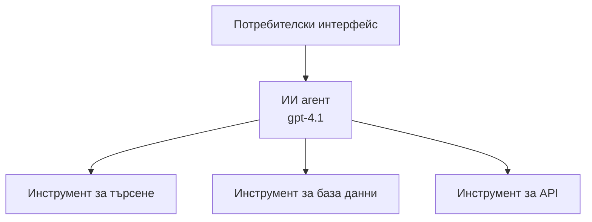
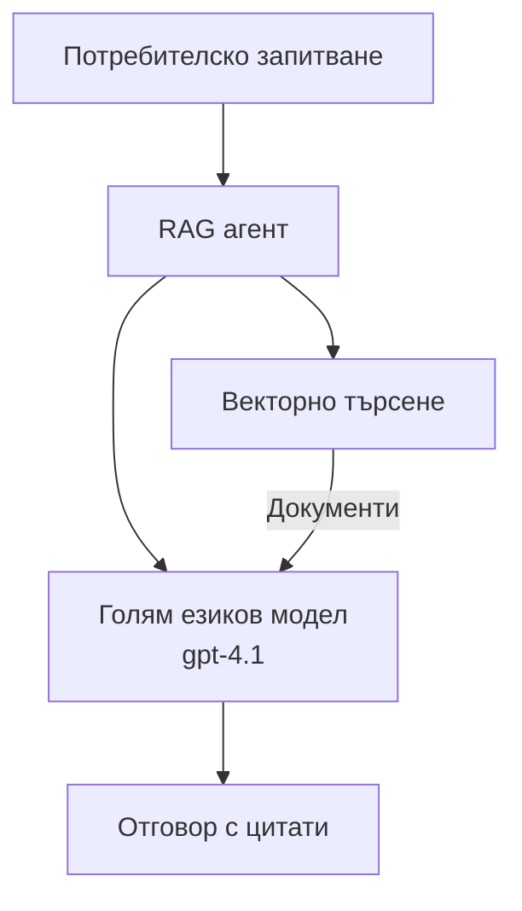

# AI агенти с Azure Developer CLI

**Навигация в главите:**
- **📚 Начало на курса**: [AZD за начинаещи](../../README.md)
- **📖 Текуща глава**: Глава 2 - Разработка, ориентирана към AI
- **⬅️ Предишна**: [Интеграция с Microsoft Foundry](microsoft-foundry-integration.md)
- **➡️ Следваща**: [Разгръщане на AI модел](ai-model-deployment.md)
- **🚀 Разширено**: [Многоагентни решения](../../examples/retail-scenario.md)

---

## Въведение

AI агентите са автономни програми, които могат да възприемат околната среда, да вземат решения и да предприемат действия за постигане на конкретни цели. За разлика от простите чатботове, които отговарят на заявки, агентите могат:

- **Използват инструменти** - Извикват API, търсят в бази данни, изпълняват код
- **Планират и разсъждават** - Разбиват сложни задачи на стъпки
- **Учaт от контекста** - Поддържат памет и адаптират поведението
- **Сътрудничат** - Работят с други агенти (многоагентни системи)

Това ръководство показва как да разположите AI агенти в Azure, използвайки Azure Developer CLI (azd).

## Цели за учене

След като завършите това ръководство, вие ще:
- Разберете какво представляват AI агентите и как се различават от чатботовете
- Разположите предварително изградени шаблони за AI агенти с помощта на AZD
- Конфигурирате Foundry Agents за персонализирани агенти
- Имплементирате базови модели за агенти (използване на инструменти, RAG, многоагентни системи)
- Наблюдавате и отстранявате грешки при разположени агенти

## Очаквани резултати от обучението

След завършване ще можете:
- Да разположите AI агентски приложения в Azure с една команда
- Да конфигурирате инструментите и възможностите на агента
- Да имплементирате retrieval-augmented generation (RAG) с агенти
- Да проектирате многоагентни архитектури за комплексни работни потоци
- Да отстранявате често срещани проблеми при разгръщане на агенти

---

## 🤖 Какво различава агента от чатбота?

| Характеристика | Чатбот | AI агент |
|---------|---------|----------|
| **Поведение** | Отговаря на заявки | Извършва автономни действия |
| **Инструменти** | Няма | Може да извиква API, да търси, да изпълнява код |
| **Памет** | Само сесийна | Постоянна памет между сесии |
| **Планиране** | Едностъпково разсъждение | Многостъпково разсъждение |
| **Сътрудничество** | Самостоятелен | Може да работи с други агенти |

### Проста аналогия

- **Чатбот** = Полезен човек, който отговаря на въпроси на информационно бюро
- **AI агент** = Личен асистент, който може да прави обаждания, да резервира срещи и да изпълнява задачи вместо вас

---

## 🚀 Бърз старт: Разположете първия си агент

### Опция 1: Шаблон Foundry Agents (Препоръчително)

```bash
# Инициализиране на шаблона за AI агенти
azd init --template get-started-with-ai-agents

# Разгръщане в Azure
azd up
```

**Какво се разгръща:**
- ✅ Foundry Agents
- ✅ Microsoft Foundry Models (gpt-4.1)
- ✅ Azure AI Search (за RAG)
- ✅ Azure Container Apps (уеб интерфейс)
- ✅ Application Insights (наблюдение)

**Време:** ~15-20 минути
**Разходи:** ~$100-150/месец (разработка)

### Опция 2: OpenAI агент с Prompty

```bash
# Инициализиране на шаблона за агент, базиран на Prompty
azd init --template agent-openai-python-prompty

# Разгръщане в Azure
azd up
```

**Какво се разгръща:**
- ✅ Azure Functions (безсървърно изпълнение на агента)
- ✅ Microsoft Foundry Models
- ✅ Файлове за конфигурация на Prompty
- ✅ Примерна реализация на агент

**Време:** ~10-15 минути
**Разходи:** ~$50-100/месец (разработка)

### Опция 3: RAG чат агент

```bash
# Инициализиране на RAG чат шаблон
azd init --template azure-search-openai-demo

# Разгръщане в Azure
azd up
```

**Какво се разгръща:**
- ✅ Microsoft Foundry Models
- ✅ Azure AI Search със примерни данни
- ✅ Конвейер за обработка на документи
- ✅ Чат интерфейс с цитиране на източници

**Време:** ~15-25 минути
**Разходи:** ~$80-150/месец (разработка)

### Опция 4: AZD AI Agent Init (базиран на манифест)

Ако имате файл с агент-манифест, можете да използвате командата `azd ai`, за да генерирате структурата на проект Foundry Agent Service директно:

```bash
# Инсталирайте разширението за ИИ агенти
azd extension install azure.ai.agents

# Инициализирайте от манифест на агент
azd ai agent init -m agent-manifest.yaml

# Разположете в Azure
azd up
```

**Кога да използвате `azd ai agent init` vs `azd init --template`:**

| Подход | Най-подходящ за | Как работи |
|----------|----------|------|
| `azd init --template` | Започване от работещ примерен app | Клонира пълен шаблонен репозитори с код + инфраструктура |
| `azd ai agent init -m` | Създаване от ваш собствен манифест на агент | Генерира структура на проекта от вашата дефиниция на агента |

> **Съвет:** Използвайте `azd init --template` когато учите (Опции 1-3 по-горе). Използвайте `azd ai agent init` при изграждане на продукционни агенти с ваши манифести. Вижте [AZD AI CLI команди](../chapter-08-production/production-ai-practices.md#azd-ai-cli-commands-and-extensions) за пълна справка.

---

## 🏗️ Архитектурни модели за агенти

### Модел 1: Един агент с инструменти

Най-простият модел за агент - един агент, който може да използва множество инструменти.


**Най-подходящ за:**
- Чатботове за клиентска поддръжка
- Асистенти за изследвания
- Агенти за анализ на данни

**AZD шаблон:** `azure-search-openai-demo`

### Модел 2: RAG агент (Retrieval-Augmented Generation)

Агент, който извлича релевантни документи преди да генерира отговори.


**Най-подходящ за:**
- Бази от знания за предприятия
- Системи за Q&A върху документи
- Спазване на изисквания и правни проучвания

**AZD шаблон:** `azure-search-openai-demo`

### Модел 3: Многоагентна система

Няколко специализирани агента, работещи заедно по сложни задачи.


**Най-подходящ за:**
- Генериране на комплексно съдържание
- Многостъпкови работни потоци
- Задачи, изискващи различни експертизи

**Научете повече:** [Патерни за координация на многоагентни системи](../chapter-06-pre-deployment/coordination-patterns.md)

---

## ⚙️ Конфигуриране на инструментите на агента

Агентите стават мощни, когато могат да използват инструменти. Ето как да конфигурирате често използвани инструменти:

### Конфигурация на инструменти във Foundry Agents

```python
# agent_config.py
from azure.ai.projects import AIProjectClient
from azure.ai.projects.models import FunctionTool, CodeInterpreterTool

# Дефинирайте персонализирани инструменти
search_tool = FunctionTool(
    name="search_knowledge_base",
    description="Search the company knowledge base for relevant documents",
    parameters={
        "type": "object",
        "properties": {
            "query": {
                "type": "string",
                "description": "The search query"
            }
        },
        "required": ["query"]
    }
)

# Създайте агент с инструменти
agent = project_client.agents.create_agent(
    model="gpt-4.1",
    name="Support Agent",
    instructions="You are a helpful support agent. Use the search tool to find relevant information.",
    tools=[search_tool, CodeInterpreterTool()]
)
```

### Конфигурация на средата

```bash
# Настройте специфични за агента променливи на средата
azd env set AZURE_OPENAI_MODEL "gpt-4.1"
azd env set AGENT_INSTRUCTIONS "You are a helpful assistant..."
azd env set ENABLE_CODE_INTERPRETER "true"
azd env set ENABLE_FILE_SEARCH "true"

# Разгрънете с актуализирана конфигурация
azd deploy
```

---

## 📊 Наблюдение на агенти

### Интеграция с Application Insights

Всички шаблони за AZD агенти включват Application Insights за наблюдение:

```bash
# Отвори таблото за наблюдение
azd monitor --overview

# Прегледай логовете в реално време
azd monitor --logs

# Прегледай метриките в реално време
azd monitor --live
```

### Ключови метрики за следене

| Метрика | Описание | Цел |
|--------|-------------|--------|
| Забавяне на отговор | Време за генериране на отговор | < 5 секунди |
| Използване на токени | Токени на заявка | Наблюдавайте за разходи |
| Процент успешни извиквания на инструменти | % от успешните изпълнения на инструменти | > 95% |
| Процент грешки | Провалени заявки към агента | < 1% |
| Удовлетвореност на потребителя | Оценки от обратна връзка | > 4.0/5.0 |

### Персонализирано логване за агенти

```python
import os
from azure.monitor.opentelemetry import configure_azure_monitor
from opentelemetry import trace

# Конфигурирайте Azure Monitor с OpenTelemetry
configure_azure_monitor(
    connection_string=os.environ["APPLICATIONINSIGHTS_CONNECTION_STRING"]
)

tracer = trace.get_tracer(__name__)

def log_agent_interaction(user_query, agent_response, tools_used, latency_ms):
    with tracer.start_as_current_span("agent_interaction") as span:
        span.set_attributes({
            "user_query": user_query,
            "response_length": len(agent_response),
            "tools_used": tools_used,
            "latency_ms": latency_ms
        })
```

> **Бележка:** Инсталирайте необходимите пакети: `pip install azure-monitor-opentelemetry opentelemetry`

---

## 💰 Съображения за разходите

### Прогнозни месечни разходи по модел

| Модел | Околна среда за разработка | Продукция |
|---------|-----------------|------------|
| Един агент | $50-100 | $200-500 |
| RAG агент | $80-150 | $300-800 |
| Многоагентна (2-3 агента) | $150-300 | $500-1,500 |
| Многоагентна за предприятия | $300-500 | $1,500-5,000+ |

### Съвети за оптимизиране на разходите

1. **Използвайте gpt-4.1-mini за прости задачи**
   ```bash
   azd env set AZURE_OPENAI_MODEL "gpt-4.1-mini"
   ```

2. **Реализирайте кеширане за повтарящи се заявки**
   ```python
   from functools import lru_cache
   
   @lru_cache(maxsize=1000)
   def get_cached_response(query_hash):
       return agent.run(query_hash)
   ```

3. **Задайте лимити на токени на изпълнение**
   ```python
   # Задайте max_completion_tokens при стартиране на агента, а не при неговото създаване
   run = project_client.agents.create_run(
       thread_id=thread.id,
       agent_id=agent.id,
       max_completion_tokens=1000  # Ограничете дължината на отговора
   )
   ```

4. **Намалете до нула, когато не се използва**
   ```bash
   # Container Apps автоматично се мащабират до нула
   azd env set MIN_REPLICAS "0"
   ```

---

## 🔧 Отстраняване на проблеми с агенти

### Често срещани проблеми и решения

<details>
<summary><strong>❌ Агентът не отговаря на повиквания към инструменти</strong></summary>

```bash
# Проверете дали инструментите са правилно регистрирани
azd show

# Проверете внедряването на OpenAI
az cognitiveservices account deployment list \
  --name $AZURE_OPENAI_NAME \
  --resource-group $RG_NAME

# Проверете логовете на агента
azd monitor --logs
```

**Чести причини:**
- Несъответствие в подписа на функцията на инструмента
- Липсващи задължителни разрешения
- Крайна точка на API не е достъпна
</details>

<details>
<summary><strong>❌ Висока латентност в отговорите на агента</strong></summary>

```bash
# Проверете Application Insights за тесни места
azd monitor --live

# Помислете да използвате по-бърз модел
azd env set AZURE_OPENAI_MODEL "gpt-4.1-mini"
azd deploy
```

**Съвети за оптимизация:**
- Използвайте стрийминг отговори
- Реализирайте кеширане на отговори
- Намалете размера на контекстния прозорец
</details>

<details>
<summary><strong>❌ Агентът връща неправилна или халюцинирана информация</strong></summary>

```python
# Подобрете чрез по-добри системни подсказки
instructions = """
You are a helpful assistant. IMPORTANT:
- Only answer based on provided context
- If you don't know, say "I don't know"
- Always cite your sources
- Never make up information
"""

# Добавете извличане за обосновка
agent = project_client.agents.create_agent(
    model="gpt-4.1",
    instructions=instructions,
    tools=[FileSearchTool()]  # Основавайте отговорите върху документи
)
```
</details>

<details>
<summary><strong>❌ Превишен лимит на токени</strong></summary>

```python
# Реализирайте управление на контекстния прозорец
def truncate_context(messages, max_tokens=8000, model="gpt-4.1"):
    """Keep only recent messages within token limit."""
    import tiktoken
    encoding = tiktoken.encoding_for_model(model)
    total_tokens = 0
    truncated = []
    
    for msg in reversed(messages):
        msg_tokens = len(encoding.encode(msg.content))
        if total_tokens + msg_tokens > max_tokens:
            break
        truncated.insert(0, msg)
        total_tokens += msg_tokens
    
    return truncated
```
</details>

---

## 🎓 Практически упражнения

### Упражнение 1: Разположете базов агент (20 минути)

**Цел:** Разположете първия си AI агент, използвайки AZD

```bash
# Стъпка 1: Инициализирайте шаблона
azd init --template get-started-with-ai-agents

# Стъпка 2: Влезте в Azure
azd auth login

# Стъпка 3: Разположете
azd up

# Стъпка 4: Тествайте агента
# Очакван изход след разполагането:
#   Разполагането е завършено!
#   Крайна точка: https://<app-name>.<region>.azurecontainerapps.io
# Отворете URL адреса, показан в изхода, и опитайте да зададете въпрос

# Стъпка 5: Прегледайте мониторинга
azd monitor --overview

# Стъпка 6: Почистете
azd down --force --purge
```

**Критерии за успех:**
- [ ] Агентът отговаря на въпроси
- [ ] Може да достъпи таблото за наблюдение чрез `azd monitor`
- [ ] Ресурсите са успешно почистени

### Упражнение 2: Добавете персонализиран инструмент (30 минути)

**Цел:** Разширете агент с персонализиран инструмент

1. Разположете шаблона на агента:
   ```bash
   azd init --template get-started-with-ai-agents
   azd up
   ```
2. Създайте нова функция на инструмент в кода на агента:
   ```python
   def get_weather(location: str) -> str:
       """Get current weather for a location."""
       # API повикване към метеорологична услуга
       return f"Weather in {location}: Sunny, 72°F"
   ```
3. Регистрирайте инструмента с агента:
   ```python
   from azure.ai.projects.models import FunctionTool

   weather_tool = FunctionTool(
       name="get_weather",
       description="Get current weather for a location",
       parameters={
           "type": "object",
           "properties": {
               "location": {"type": "string", "description": "City name"}
           },
           "required": ["location"]
       }
   )

   agent = project_client.agents.create_agent(
       model="gpt-4.1",
       name="Weather Agent",
       tools=[weather_tool]
   )
   ```
4. Преразположете и тествайте:
   ```bash
   azd deploy
   # Попитайте: "Какво е времето в Сиатъл?"
   # Очаквано: Агент извиква get_weather("Seattle") и връща информация за времето
   ```

**Критерии за успех:**
- [ ] Агентът разпознава въпроси, свързани с времето
- [ ] Инструментът се извиква правилно
- [ ] Отговорът включва информация за времето

### Упражнение 3: Създайте RAG агент (45 минути)

**Цел:** Създайте агент, който отговаря на въпроси от вашите документи

```bash
# Стъпка 1: Разгръщане на RAG шаблона
azd init --template azure-search-openai-demo
azd up

# Стъпка 2: Качете вашите документи
# Поставете PDF/TXT файлове в директорията data/, след това изпълнете:
python scripts/prepdocs.py

# Стъпка 3: Тествайте с въпроси, специфични за домейна
# Отворете URL адреса на уеб приложението от изхода на azd up
# Задавайте въпроси за вашите качени документи
# Отговорите трябва да включват препратки към цитати като [doc.pdf]
```

**Критерии за успех:**
- [ ] Агентът отговаря въз основа на качени документи
- [ ] Отговорите включват цитати на източници
- [ ] Няма халюцинации при въпроси извън обхвата

---

## 📚 Следващи стъпки

Сега, когато разбирате AI агентите, разгледайте тези напреднали теми:

| Тема | Описание | Линк |
|-------|-------------|------|
| **Многоагентни системи** | Изградете системи с множество взаимодействащи агенти | [Пример за многоагентна търговия на дребно](../../examples/retail-scenario.md) |
| **Патерни за координация** | Научете оркестрация и комуникационни модели | [Патерни за координация](../chapter-06-pre-deployment/coordination-patterns.md) |
| **Продукционно разгръщане** | Разгръщане на агенти, готови за предприятия | [Практики за продукционно използване на AI](../chapter-08-production/production-ai-practices.md) |
| **Оценка на агенти** | Тествайте и оценете представянето на агента | [Отстраняване на проблеми с AI](../chapter-07-troubleshooting/ai-troubleshooting.md) |
| **AI Workshop Lab** | Практическо: Подгответе AI решението си за AZD | [AI Workshop Lab](ai-workshop-lab.md) |

---

## 📖 Допълнителни ресурси

### Официална документация
- [Azure AI Agent Service](https://learn.microsoft.com/azure/ai-services/agents/)
- [Azure AI Foundry Agent Service Quickstart](https://learn.microsoft.com/azure/ai-services/agents/quickstart)
- [Semantic Kernel Agent Framework](https://learn.microsoft.com/semantic-kernel/)

### AZD шаблони за агенти
- [Get Started with AI Agents](https://github.com/Azure-Samples/get-started-with-ai-agents)
- [Agent OpenAI Python Prompty](https://github.com/Azure-Samples/agent-openai-python-prompty)
- [Azure Search OpenAI Demo](https://github.com/Azure-Samples/azure-search-openai-demo)

### Ресурси от общността
- [Awesome AZD - Agent Templates](https://azure.github.io/awesome-azd/?tags=ai-agents)
- [Azure AI Discord](https://discord.gg/microsoft-azure)
- [Microsoft Foundry Discord](https://discord.gg/nTYy5BXMWG)

### Умения за агенти за вашия редактор
- [**Microsoft Azure Agent Skills**](https://skills.sh/microsoft/github-copilot-for-azure) - Инсталирайте преизползваеми умения за AI агенти за разработка в Azure в GitHub Copilot, Cursor или всеки поддържан агент. Включва умения за [Azure AI](https://skills.sh/microsoft/github-copilot-for-azure/azure-ai), [Microsoft Foundry](https://skills.sh/microsoft/github-copilot-for-azure/microsoft-foundry), [deployment](https://skills.sh/microsoft/github-copilot-for-azure/azure-deploy), и [diagnostics](https://skills.sh/microsoft/github-copilot-for-azure/azure-diagnostics):
  ```bash
  npx skills add microsoft/github-copilot-for-azure
  ```

---

**Навигация**
- **Предишен урок**: [Интеграция с Microsoft Foundry](microsoft-foundry-integration.md)
- **Следващ урок**: [Разгръщане на AI модел](ai-model-deployment.md)

---

<!-- CO-OP TRANSLATOR DISCLAIMER START -->
**Отказ от отговорност**:
Този документ е преведен с помощта на услугата за автоматичен превод на ИИ [Co-op Translator](https://github.com/Azure/co-op-translator). Въпреки че се стремим към точност, имайте предвид, че автоматизираните преводи може да съдържат грешки или неточности. Оригиналният документ в неговия първичен език трябва да се счита за авторитетен източник. За критична информация се препоръчва професионален човешки превод. Не носим отговорност за каквито и да е недоразумения или погрешни тълкувания, възникнали в резултат на използването на този превод.
<!-- CO-OP TRANSLATOR DISCLAIMER END -->