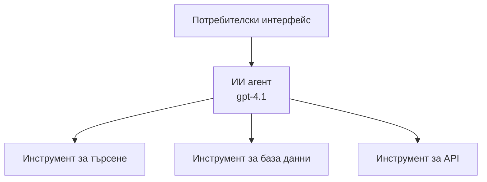
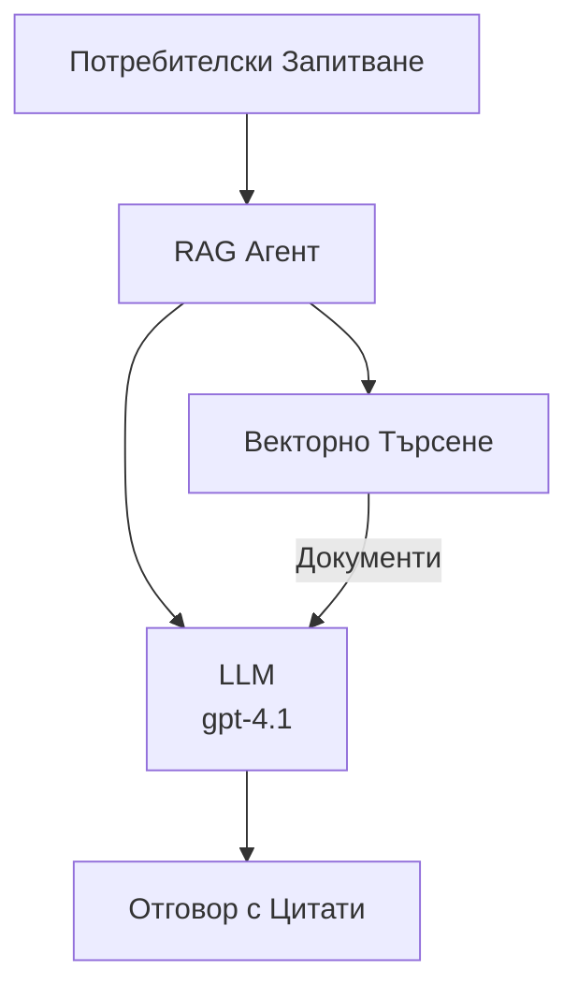
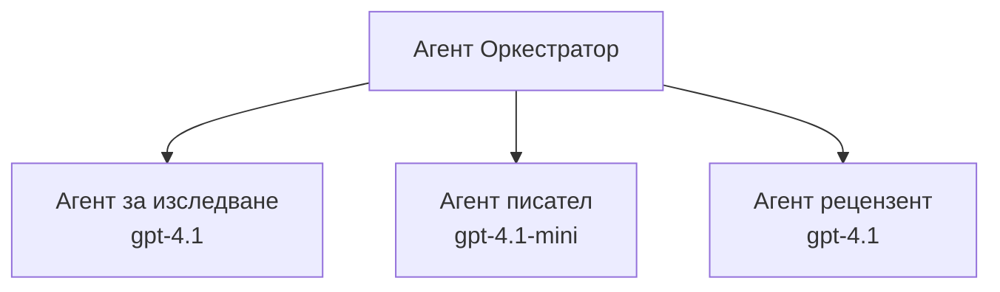

# AI агенти с Azure Developer CLI

**Навигация в главата:**
- **📚 Начало на курса**: [AZD За начинаещи](../../README.md)
- **📖 Текуща глава**: Глава 2 - AI-ориентирана разработка
- **⬅️ Предишна**: [Интеграция с Microsoft Foundry](microsoft-foundry-integration.md)
- **➡️ Следваща**: [Деплоймънт на AI модели](ai-model-deployment.md)
- **🚀 Разширени**: [Мулти-агентни решения](../../examples/retail-scenario.md)

---

## Въведение

AI агентите са автономни програми, които могат да възприемат околната среда, да взимат решения и да предприемат действия за постигане на конкретни цели. За разлика от простите чатботове, които отговарят на командни въвеждания, агентите могат:

- **Да използват инструменти** - Вика APIs, търсят в бази данни, изпълняват код
- **Да планират и разсъждават** - Разбиват сложни задачи на стъпки
- **Да учат от контекста** - Поддържат памет и адаптират поведението си
- **Да си сътрудничат** - Работят с други агенти (мулти-агентни системи)

Това ръководство ви показва как да деплойнете AI агенти в Azure, използвайки Azure Developer CLI (azd).

> **Бележка за валидация (25.03.2026):** Това ръководство е проверено с `azd` `1.23.12` и `azure.ai.agents` `0.1.18-preview`. Опитът с `azd ai` все още е в предварителен етап, затова проверявайте помощта на разширението, ако вашите инсталирани версии се различават.

## Цели на обучението

След завършване на това ръководство, ще можете да:
- Разберете какво представляват AI агентите и как се различават от чатботовете
- Деплойнете предварително изградени AI шаблони за агенти чрез AZD
- Конфигурирате Foundry агенти за персонализирани агенти
- Имплементирате основни модели на агенти (използване на инструменти, RAG, мулти-агент)
- Наблюдавате и отстранявате проблеми с деплойнатите агенти

## Резултати от обучението

След завършване, ще можете да:
- Деплойнете AI агент приложения в Azure с една команда
- Конфигурирате инструменти и възможности на агенти
- Имплементирате retrieval-augmented generation (RAG) с агенти
- Проектирате мулти-агентни архитектури за комплексни работни потоци
- Отстранявате често срещани проблеми при деплойване на агенти

---

## 🤖 Какво прави един агент различен от чатбот?

| Характеристика | Чатбот | AI агент |
|----------------|---------|----------|
| **Поведение** | Отговаря на въвеждания | Предприема автономни действия |
| **Инструменти** | Няма | Може да вика API-та, търси, изпълнява код |
| **Памет** | Само сесийна | Постоянна памет през сесии |
| **Планиране** | Един отговор | Многостъпково разсъждение |
| **Сътрудничество** | Самостоятелен | Може да работи с други агенти |

### Просто сравнение

- **Чатбот** = Помощник, който отговаря на въпроси на информационното бюро
- **AI агент** = Личен асистент, който може да прави обаждания, да урежда срещи и да завършва задачи за вас

---

## 🚀 Бърз старт: Деплойнете първия си агент

### Опция 1: Foundry Agents шаблон (Препоръчително)

```bash
# Инициализирайте шаблона за AI агенти
azd init --template get-started-with-ai-agents

# Разположете в Azure
azd up
```

**Какво се деплойва:**
- ✅ Foundry Agents
- ✅ Microsoft Foundry модели (gpt-4.1)
- ✅ Azure AI Search (за RAG)
- ✅ Azure Container Apps (уеб интерфейс)
- ✅ Application Insights (мониторинг)

**Време:** ~15-20 минути
**Цена:** ~$100-150/месец (за разработка)

### Опция 2: OpenAI агент с Prompty

```bash
# Инициализирайте шаблона на агента, базиран на Prompty
azd init --template agent-openai-python-prompty

# Разположете в Azure
azd up
```

**Какво се деплойва:**
- ✅ Azure Functions (безсървърно изпълнение на агента)
- ✅ Microsoft Foundry модели
- ✅ Конфигурационни файлове за Prompty
- ✅ Примерна имплементация на агент

**Време:** ~10-15 минути
**Цена:** ~$50-100/месец (за разработка)

### Опция 3: RAG Chat агент

```bash
# Инициализиране на шаблон за RAG чат
azd init --template azure-search-openai-demo

# Разгръщане в Azure
azd up
```

**Какво се деплойва:**
- ✅ Microsoft Foundry модели
- ✅ Azure AI Search с примерни данни
- ✅ Пайплайн за обработка на документи
- ✅ Чат интерфейс с цитати

**Време:** ~15-25 минути
**Цена:** ~$80-150/месец (за разработка)

### Опция 4: AZD AI Agent Init (Преглед с манифест или шаблон)

Ако имате манифестен файл на агент, можете да използвате командата `azd ai` за директно създаване на проект Foundry Agent Service. Последните предварителни издания добавиха поддръжка за инициализация на базата на шаблон, така че точният поток на указанията може леко да се различава в зависимост от инсталираната версия на разширението.

```bash
# Инсталирайте разширението за AI агенти
azd extension install azure.ai.agents

# По избор: проверете инсталираната предварителна версия
azd extension show azure.ai.agents

# Инициализиране от манифест на агент
azd ai agent init -m agent-manifest.yaml

# Разгръщане в Azure
azd up
```

**Кога да използвате `azd ai agent init` срещу `azd init --template`:**

| Подход | Най-подходящ за | Как работи |
|--------|-----------------|------------|
| `azd init --template` | Стартиране от работещ пример | Клонира пълен репо с шаблон с код + инфраструктура |
| `azd ai agent init -m` | Създаване по ваш манифест за агент | Генерира структура на проект от вашето описание на агент |

> **Съвет:** Използвайте `azd init --template`, когато учите (Опции 1-3 по-горе). Използвайте `azd ai agent init`, когато създавате продукционни агенти с ваши манифести. Вижте [AZD AI CLI команди](../chapter-08-production/production-ai-practices.md#azd-ai-cli-commands-and-extensions) за пълна справка.

---

## 🏗️ Архитектурни модели на агенти

### Модел 1: Един агент с инструменти

Най-простият агентен модел - един агент, който може да използва няколко инструмента.


**Подходящ за:**
- Ботове за обслужване на клиенти
- Изследователски асистенти
- Агенти за анализ на данни

**AZD шаблон:** `azure-search-openai-demo`

### Модел 2: RAG агент (retrieval-augmented generation)

Агент, който извлича релевантни документи преди да генерира отговори.


**Подходящ за:**
- Корпоративни бази знания
- Системи за въпроси и отговори върху документи
- Правно и съвместимо изследване

**AZD шаблон:** `azure-search-openai-demo`

### Модел 3: Мулти-агентна система

Множество специализирани агенти, които работят заедно по сложни задачи.


**Подходящ за:**
- Комплексно генериране на съдържание
- Многостъпкови работни процеси
- Задачи изискващи различна експертиза

**Научете повече:** [Модели за координация на мулти-агенти](../chapter-06-pre-deployment/coordination-patterns.md)

---

## ⚙️ Конфигуриране на инструменти за агенти

Агентите стават мощни, когато могат да използват инструменти. Ето как да конфигурирате често използвани инструменти:

### Конфигурация на инструменти във Foundry Agents

```python
# agent_config.py
from azure.ai.projects import AIProjectClient
from azure.ai.projects.models import FunctionTool, CodeInterpreterTool

# Дефинирай персонализирани инструменти
search_tool = FunctionTool(
    name="search_knowledge_base",
    description="Search the company knowledge base for relevant documents",
    parameters={
        "type": "object",
        "properties": {
            "query": {
                "type": "string",
                "description": "The search query"
            }
        },
        "required": ["query"]
    }
)

# Създай агент с инструменти
agent = project_client.agents.create_agent(
    model="gpt-4.1",
    name="Support Agent",
    instructions="You are a helpful support agent. Use the search tool to find relevant information.",
    tools=[search_tool, CodeInterpreterTool()]
)
```

### Конфигурация на средата

```bash
# Настройване на специфични за агента променливи на околната среда
azd env set AZURE_OPENAI_MODEL "gpt-4.1"
azd env set AGENT_INSTRUCTIONS "You are a helpful assistant..."
azd env set ENABLE_CODE_INTERPRETER "true"
azd env set ENABLE_FILE_SEARCH "true"

# Разгръщане с актуализирана конфигурация
azd deploy
```

---

## 📊 Наблюдение на агенти

### Интеграция с Application Insights

Всички AZD шаблони за агенти включват Application Insights за мониторинг:

```bash
# Отворете контролния панел за наблюдение
azd monitor --overview

# Преглед на живи записи
azd monitor --logs

# Преглед на живи метрики
azd monitor --live
```

### Ключови метрики за проследяване

| Метрика | Описание | Цел |
|---------|----------|-----|
| Забавяне на отговор | Време за генериране на отговор | < 5 секунди |
| Използване на токени | Токени на заявка | Следене на разходите |
| Процент успешни извиквания на инструменти | % успешни изпълнения на инструменти | > 95% |
| Процент грешки | Провалени заявки към агента | < 1% |
| Удовлетвореност на потребителите | Резултати от обратна връзка | > 4.0/5.0 |

### Персонализирано логване за агенти

```python
import os
from azure.monitor.opentelemetry import configure_azure_monitor
from opentelemetry import trace

# Конфигурирайте Azure Monitor с OpenTelemetry
configure_azure_monitor(
    connection_string=os.environ["APPLICATIONINSIGHTS_CONNECTION_STRING"]
)

tracer = trace.get_tracer(__name__)

def log_agent_interaction(user_query, agent_response, tools_used, latency_ms):
    with tracer.start_as_current_span("agent_interaction") as span:
        span.set_attributes({
            "user_query": user_query,
            "response_length": len(agent_response),
            "tools_used": tools_used,
            "latency_ms": latency_ms
        })
```

> **Забележка:** Инсталирайте нужните пакети: `pip install azure-monitor-opentelemetry opentelemetry`

---

## 💰 Финансови съображения

### Прогнозни месечни разходи по модел

| Модел | Разработка | Продукция |
|-------|------------|-----------|
| Един агент | $50-100 | $200-500 |
| RAG агент | $80-150 | $300-800 |
| Мулти-агент (2-3 агента) | $150-300 | $500-1,500 |
| Корпоративен мулти-агент | $300-500 | $1,500-5,000+ |

### Съвети за оптимизация на разходи

1. **Използвайте gpt-4.1-mini за прости задачи**
   ```bash
   azd env set AZURE_OPENAI_MODEL "gpt-4.1-mini"
   ```

2. **Използвайте кеширане за повторни заявки**
   ```python
   from functools import lru_cache
   
   @lru_cache(maxsize=1000)
   def get_cached_response(query_hash):
       return agent.run(query_hash)
   ```

3. **Задайте лимити на токени на изпълнение**
   ```python
   # Задайте max_completion_tokens при стартиране на агента, а не по време на създаването му
   run = project_client.agents.create_run(
       thread_id=thread.id,
       agent_id=agent.id,
       max_completion_tokens=1000  # Ограничете дължината на отговора
   )
   ```

4. **Автоматично изключване когато не се използва**
   ```bash
   # Контейнерните приложения автоматично скалират до нула
   azd env set MIN_REPLICAS "0"
   ```

---

## 🔧 Отстраняване на проблеми с агенти

### Често срещани проблеми и решения

<details>
<summary><strong>❌ Агентът не отговаря на извиквания на инструменти</strong></summary>

```bash
# Проверете дали инструментите са правилно регистрирани
azd show

# Проверете внедряването на OpenAI
az cognitiveservices account deployment list \
  --name $AZURE_OPENAI_NAME \
  --resource-group $RG_NAME

# Проверете дневниците на агента
azd monitor --logs
```

**Чести причини:**
- Несъответствие на подписа на функцията на инструмента
- Липса на нужни разрешения
- API крайна точка не е достъпна
</details>

<details>
<summary><strong>❌ Висока латентност в отговорите на агента</strong></summary>

```bash
# Проверете Application Insights за тесни места
azd monitor --live

# Помислете за използване на по-бърз модел
azd env set AZURE_OPENAI_MODEL "gpt-4.1-mini"
azd deploy
```

**Съвети за оптимизация:**
- Използвайте стрийминг отговори
- Реализирайте кеширане на отговорите
- Намалете размера на контекстния прозорец
</details>

<details>
<summary><strong>❌ Агентът връща неправилна или халюцинирана информация</strong></summary>

```python
# Подобрете с по-добри системни подсказки
instructions = """
You are a helpful assistant. IMPORTANT:
- Only answer based on provided context
- If you don't know, say "I don't know"
- Always cite your sources
- Never make up information
"""

# Добавете извличане за основа
agent = project_client.agents.create_agent(
    model="gpt-4.1",
    instructions=instructions,
    tools=[FileSearchTool()]  # Основане на отговорите в документи
)
```
</details>

<details>
<summary><strong>❌ Грешки за превишаване на лимита на токени</strong></summary>

```python
# Изпълнете управление на контекстния прозорец
def truncate_context(messages, max_tokens=8000, model="gpt-4.1"):
    """Keep only recent messages within token limit."""
    import tiktoken
    encoding = tiktoken.encoding_for_model(model)
    total_tokens = 0
    truncated = []
    
    for msg in reversed(messages):
        msg_tokens = len(encoding.encode(msg.content))
        if total_tokens + msg_tokens > max_tokens:
            break
        truncated.insert(0, msg)
        total_tokens += msg_tokens
    
    return truncated
```
</details>

---

## 🎓 Практически упражнения

### Упражнение 1: Деплойване на базов агент (20 минути)

**Цел:** Деплойнете първия си AI агент с AZD

```bash
# Стъпка 1: Инициализиране на шаблона
azd init --template get-started-with-ai-agents

# Стъпка 2: Вход в Azure
azd auth login
# Ако работите с няколко наематели, добавете --tenant-id <tenant-id>

# Стъпка 3: Деплойване
azd up

# Стъпка 4: Тествайте агента
# Очакван изход след деплойване:
#   Деплойването е завършено!
#   Крайна точка: https://<app-name>.<region>.azurecontainerapps.io
# Отворете URL адреса, показан в изхода, и опитайте да зададете въпрос

# Стъпка 5: Преглед на мониторинга
azd monitor --overview

# Стъпка 6: Почистване
azd down --force --purge
```

**Критерии за успех:**
- [ ] Агентът отговаря на въпроси
- [ ] Имате достъп до таблото за мониторинг чрез `azd monitor`
- [ ] Ресурсите са успешно почистени

### Упражнение 2: Добавяне на потребителски инструмент (30 минути)

**Цел:** Разширете агент с потребителски инструмент

1. Деплойнете шаблона на агента:
   ```bash
   azd init --template get-started-with-ai-agents
   azd up
   ```
2. Създайте нова функция за инструмент в кода на агента:
   ```python
   def get_weather(location: str) -> str:
       """Get current weather for a location."""
       # API повикване към метеорологична услуга
       return f"Weather in {location}: Sunny, 72°F"
   ```
3. Регистрирайте инструмента с агента:
   ```python
   from azure.ai.projects.models import FunctionTool

   weather_tool = FunctionTool(
       name="get_weather",
       description="Get current weather for a location",
       parameters={
           "type": "object",
           "properties": {
               "location": {"type": "string", "description": "City name"}
           },
           "required": ["location"]
       }
   )

   agent = project_client.agents.create_agent(
       model="gpt-4.1",
       name="Weather Agent",
       tools=[weather_tool]
   )
   ```
4. Пре-деплойнете и тествайте:
   ```bash
   azd deploy
   # Попитайте: "Какво е времето в Сиатъл?"
   # Очаквано: Агента извиква get_weather("Seattle") и връща информация за времето
   ```

**Критерии за успех:**
- [ ] Агентът разпознава запитвания свързани с времето
- [ ] Инструментът се вика правилно
- [ ] Отговорите включват информация за времето

### Упражнение 3: Изграждане на RAG агент (45 минути)

**Цел:** Създайте агент, който отговаря на въпроси от вашите документи

```bash
# Стъпка 1: Разгръщане на RAG шаблон
azd init --template azure-search-openai-demo
azd up

# Стъпка 2: Качете вашите документи
# Поставете PDF/TXT файлове в директорията data/, след което изпълнете:
python scripts/prepdocs.py

# Стъпка 3: Тествайте с въпроси, свързани със специфичната област
# Отворете URL адреса на уеб приложението от изхода на azd up
# Задавайте въпроси за вашите качени документи
# Отговорите трябва да включват цитати с препратки като [doc.pdf]
```

**Критерии за успех:**
- [ ] Агентът отговаря въз основа на качени документи
- [ ] Отговорите включват цитати
- [ ] Няма халюцинации при въпроси извън обхвата

---

## 📚 Следващи стъпки

Сега, когато разбирате AI агентите, разгледайте тези разширени теми:

| Тема | Описание | Връзка |
|-------|----------|--------|
| **Мулти-агентни системи** | Създаване на системи с множество сътрудничещи агенти | [Пример за мулти-агент в търговията](../../examples/retail-scenario.md) |
| **Координационни модели** | Научете модели за оркестрация и комуникация | [Координационни модели](../chapter-06-pre-deployment/coordination-patterns.md) |
| **Производствен деплоймънт** | Деплоймънт на агенти за предприятия | [Практики за продукшен AI](../chapter-08-production/production-ai-practices.md) |
| **Оценка на агенти** | Тестване и оценка на производителността на агенти | [Откриване на проблеми с AI](../chapter-07-troubleshooting/ai-troubleshooting.md) |
| **AI лаборатория работилница** | Практическо: направете AI решението си готово за AZD | [AI лаборатория](ai-workshop-lab.md) |

---

## 📖 Допълнителни ресурси

### Официална документация
- [Услуга за AI агенти в Azure](https://learn.microsoft.com/azure/ai-services/agents/)
- [Бърз старт с Azure AI Foundry Agent Service](https://learn.microsoft.com/azure/ai-services/agents/quickstart)
- [Semantic Kernel Agent Framework](https://learn.microsoft.com/semantic-kernel/)

### AZD шаблони за агенти
- [Започнете с AI агенти](https://github.com/Azure-Samples/get-started-with-ai-agents)
- [Agent OpenAI Python Prompty](https://github.com/Azure-Samples/agent-openai-python-prompty)
- [Azure Search OpenAI Demo](https://github.com/Azure-Samples/azure-search-openai-demo)

### Общностни ресурси
- [Awesome AZD - AI шаблони за агенти](https://azure.github.io/awesome-azd/?tags=ai-agents)
- [Azure AI Discord](https://discord.gg/microsoft-azure)
- [Microsoft Foundry Discord](https://discord.gg/nTYy5BXMWG)

### Умения за агенти за редактора ви
- [**Microsoft Azure Agent Skills**](https://skills.sh/microsoft/github-copilot-for-azure) - Инсталирайте преизползваеми AI умения за агенти за Azure разработка в GitHub Copilot, Cursor или друг поддържан агент. Включва умения за [Azure AI](https://skills.sh/microsoft/github-copilot-for-azure/azure-ai), [Microsoft Foundry](https://skills.sh/microsoft/github-copilot-for-azure/microsoft-foundry), [деплоймънт](https://skills.sh/microsoft/github-copilot-for-azure/azure-deploy) и [диагностика](https://skills.sh/microsoft/github-copilot-for-azure/azure-diagnostics):
  ```bash
  npx skills add microsoft/github-copilot-for-azure
  ```

---

**Навигация**
- **Предишен урок**: [Интеграция с Microsoft Foundry](microsoft-foundry-integration.md)
- **Следващ урок**: [Деплоймънт на AI модели](ai-model-deployment.md)

---

<!-- CO-OP TRANSLATOR DISCLAIMER START -->
**Отказ от отговорност**:  
Този документ е преведен с помощта на AI преводаческа услуга [Co-op Translator](https://github.com/Azure/co-op-translator). Въпреки че се стремим към точност, моля, имайте предвид, че автоматизираните преводи може да съдържат грешки или неточности. Оригиналният документ на неговия език трябва да се счита за авторитетен източник. За критична информация се препоръчва професионален човешки превод. Ние не носим отговорност за никакви недоразумения или погрешни тълкувания, произтичащи от използването на този превод.
<!-- CO-OP TRANSLATOR DISCLAIMER END -->