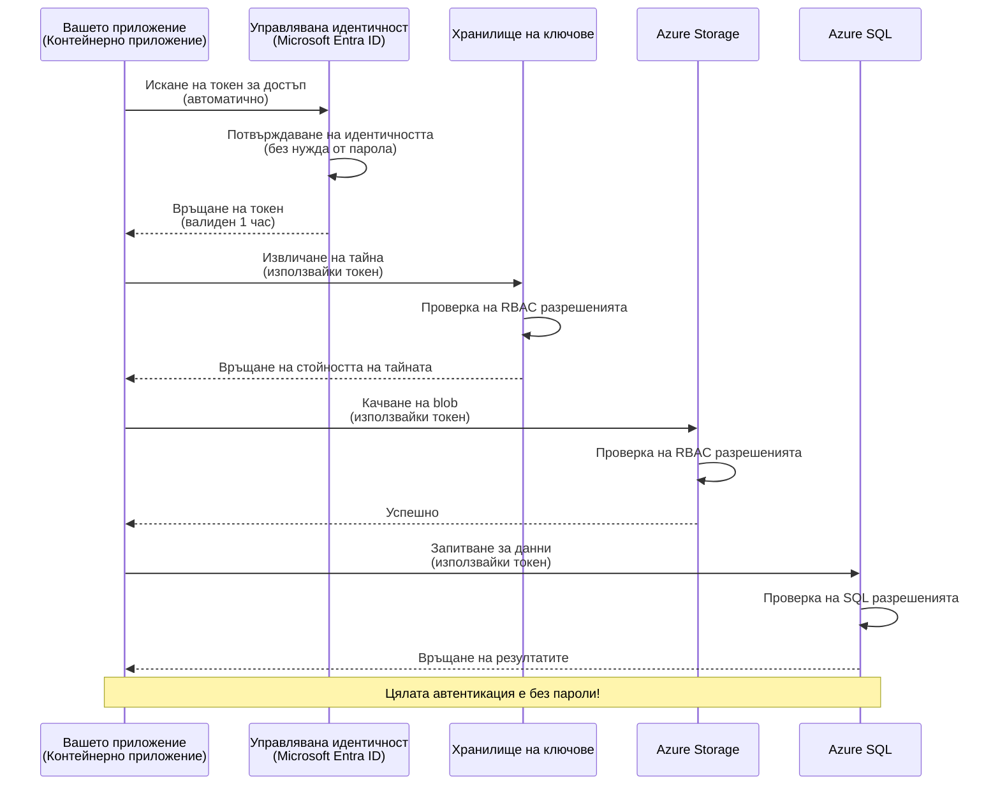
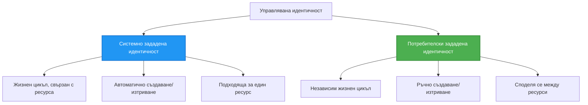

# Authentication Patterns and Managed Identity

⏱️ **Оценено време**: 45-60 минути | 💰 **Влияние върху разходите**: Безплатно (няма допълнителни такси) | ⭐ **Сложност**: Средно

**📚 Път на обучение:**
- ← Предишна: [Configuration Management](configuration.md) - Управление на променливи на средата и тайни
- 🎯 **Тук сте**: Аутентикация и сигурност (Managed Identity, Key Vault, сигурни модели)
- → Следваща: [First Project](first-project.md) - Създайте първото си AZD приложение
- 🏠 [Course Home](../../README.md)

---

## Какво ще научите

Като завършите този урок, ще:
- Разберете моделите за аутентикация в Azure (ключове, connection strings, managed identity)
- Имплементирате **Managed Identity** за автентикация без пароли
- Защитите тайните с интеграция на **Azure Key Vault**
- Конфигурирате **ролево базиран контрол на достъпа (RBAC)** за AZD разгръщания
- Приложите добри практики за сигурност в Container Apps и Azure услуги
- Мигрирате от автентикация с ключове към базирана на идентичност автентикация

## Защо Managed Identity е важно

### Проблемът: Традиционна аутентикация

**Преди Managed Identity:**
```javascript
// ❌ РИСК ЗА СИГУРНОСТ: Твърдо зададени тайни в кода
const connectionString = "Server=mydb.database.windows.net;User=admin;Password=P@ssw0rd123";
const storageKey = "xK7mN9pQ2wR5tY8uI0oP3aS6dF1gH4jK...";
const cosmosKey = "C2x7B9n4M1p8Q5w3E6r0T2y5U8i1O4p7...";
```

**Проблеми:**
- 🔴 **Изложени тайни** в кода, конфигурационни файлове, променливи на средата
- 🔴 **Ротация на идентификационни данни** изисква промени в кода и повторно разгръщане
- 🔴 **Кошмар при одити** - кой е имал достъп до какво и кога?
- 🔴 **Разпокъсаност** - тайните разпръснати в множество системи
- 🔴 **Рискове за съответствие** - не преминава сигурностни одити

### Решението: Managed Identity

**След Managed Identity:**
```javascript
// ✅ БЕЗОПАСНО: Няма тайни в кода
const credential = new DefaultAzureCredential();
const client = new BlobServiceClient(
  "https://mystorageaccount.blob.core.windows.net",
  credential  // Azure автоматично се грижи за удостоверяването
);
```

**Предимства:**
- ✅ **Никакви тайни** в кода или конфигурацията
- ✅ **Автоматична ротация** - Azure се грижи за това
- ✅ **Пълен одитен след** в логовете на Microsoft Entra ID
- ✅ **Централизирана сигурност** - управление в Azure Portal
- ✅ **Готово за съответствие** - отговаря на стандарти за сигурност

**Аналогия**: Традиционната аутентикация е като носене на множество физически ключове за различни врати. Managed Identity е като служебна пропуск, която автоматично дава достъп в зависимост от това кой сте — без ключове, които да се губят, копират или въртят.

---

## Преглед на архитектурата

### Поток на аутентикация с Managed Identity



### Видове Managed Identities



| Feature | System-Assigned | User-Assigned |
|---------|----------------|---------------|
| **Lifecycle** | Свързан с ресурса | Независим |
| **Creation** | Автоматично с ресурса | Ръчно създаване |
| **Deletion** | Изтрива се с ресурса | Запазва се след изтриване на ресурса |
| **Sharing** | Само един ресурс | Множество ресурси |
| **Use Case** | Прости сценарии | Комплексни сценарии с множество ресурси |
| **AZD Default** | ✅ Препоръчително | По избор |

---

## Предварителни изисквания

### Необходими инструменти

Трябва вече да имате инсталирано следното от предишните уроци:

```bash
# Проверете Azure Developer CLI
azd version
# ✅ Очаквано: azd версия 1.0.0 или по-нова

# Проверете Azure CLI
az --version
# ✅ Очаквано: azure-cli 2.50.0 или по-нова
```

### Изисквания за Azure

- Активен абонамент в Azure
- Права да:
  - Създавате managed identities
  - Присвоявате RBAC роли
  - Създавате Key Vault ресурси
  - Разгръщате Container Apps

### Предишни знания

Трябва да сте завършили:
- [Installation Guide](installation.md) - Настройка на AZD
- [AZD Basics](azd-basics.md) - Основни концепции
- [Configuration Management](configuration.md) - Променливи на средата

---

## Урок 1: Разбиране на моделите за аутентикация

### Модел 1: Connection Strings (Остарял - да се избягва)

**Как работи:**
```bash
# Низът за връзка съдържа учетни данни
STORAGE_CONNECTION_STRING="DefaultEndpointsProtocol=https;AccountName=myaccount;AccountKey=xK7mN9pQ2wR5..."
COSMOS_CONNECTION_STRING="AccountEndpoint=https://myaccount.documents.azure.com:443/;AccountKey=C2x7..."
SQL_CONNECTION_STRING="Server=myserver.database.windows.net;User=admin;Password=P@ssw0rd..."
```

**Проблеми:**
- ❌ Тайните видими в променливите на средата
- ❌ Логнати в системи за разгръщане
- ❌ Трудно за ротация
- ❌ Няма одитен след на достъпа

**Кога да се използва:** Само за локална разработка, никога в продукция.

---

### Модел 2: Key Vault References (По-добър)

**Как работи:**
```bicep
// Store secret in Key Vault
resource keyVault 'Microsoft.KeyVault/vaults@2023-02-01' = {
  name: 'mykv'
  properties: {
    enableRbacAuthorization: true
  }
}

// Reference in Container App
env: [
  {
    name: 'STORAGE_KEY'
    secretRef: 'storage-key'  // References Key Vault
  }
]
```

**Предимства:**
- ✅ Тайните съхранявани сигурно в Key Vault
- ✅ Централизирано управление на тайни
- ✅ Ротация без промени в кода

**Ограничения:**
- ⚠️ Все още се използват ключове/пароли
- ⚠️ Трябва да се управлява достъп до Key Vault

**Кога да се използва:** Стъпка за трансформация от connection strings към managed identity.

---

### Модел 3: Managed Identity (Най-добра практика)

**Как работи:**
```bicep
// Enable managed identity
resource containerApp 'Microsoft.App/containerApps@2023-05-01' = {
  name: 'myapp'
  identity: {
    type: 'SystemAssigned'  // Automatically creates identity
  }
}

// Grant permissions
resource roleAssignment 'Microsoft.Authorization/roleAssignments@2022-04-01' = {
  scope: storageAccount
  properties: {
    roleDefinitionId: storageBlobDataContributorRole
    principalId: containerApp.identity.principalId
  }
}
```

**Код на приложението:**
```javascript
// Няма нужда от тайни!
const { DefaultAzureCredential } = require('@azure/identity');
const { BlobServiceClient } = require('@azure/storage-blob');

const credential = new DefaultAzureCredential();
const blobServiceClient = new BlobServiceClient(
  'https://mystorageaccount.blob.core.windows.net',
  credential
);
```

**Предимства:**
- ✅ Никакви тайни в код/конфигурация
- ✅ Автоматична ротация на идентификационни данни
- ✅ Пълен одитен след
- ✅ Разрешения базирани на RBAC
- ✅ Готово за съответствие

**Кога да се използва:** Винаги, за продукционни приложения.

---

### Модел 4: Service Principals (CI/CD и автоматизация)

Managed identity е златният стандарт за ресурси, работещи в Azure. Но какво да правим с неща, които работят извън Azure — като CI/CD pipeline на билд агент, или скрипт на лаптоп, който не може да използва интерактивно вписване? Тук влиза **service principal**: не-хуманна идентичност със собствени идентификационни данни, в чие име автоматизиран процес може да се впише.

**Как работи:**

Създайте service principal с обхват на resource group (най-малко привилегии):

```bash
az ad sp create-for-rbac \
  --name "myapp-cicd" \
  --role contributor \
  --scopes /subscriptions/<sub-id>/resourceGroups/<rg-name>
```

Това отпечатва client ID, client secret и tenant ID. azd може да се впише с тях неинтерактивно:

```bash
azd auth login \
  --client-id "<appId>" \
  --client-secret "<password>" \
  --tenant-id "<tenant>"
```

**Предпочитайте федеративни данни за удостоверяване (OIDC) пред тайни.** Вместо дългоживеещ client secret, конфигурирайте федеративно удостоверяване, така че pipeline-ът да обменя късовременен токен — няма тайна, която да изтече или да се върти:

```bash
azd auth login \
  --client-id "<appId>" \
  --federated-credential-provider "github" \
  --tenant-id "<tenant>"
```

> `azd pipeline config` конфигурира това автоматично за вас. Вижте CI/CD уроците в [Глава 8](../chapter-08-production/production-ai-practices.md).

**Предимства:**
- ✅ Работи извън Azure (билд агенти, on-prem, други облаци)
- ✅ Може да се ограничи до една resource group с една роля
- ✅ Федеративната (OIDC) версия не използва съхранявана тайна

**Размени:**
- ⚠️ Вариант с тайна изисква внимателно съхранение и ротация
- ⚠️ Изтекла тайна дава възможност да се извършат всички действия, които SP може да прави — пазете обхватите стегнати

**Кога да се използва:** CI/CD pipelines и автоматизации, които не могат да използват managed identity. Винаги предпочитайте варианта с **federated/OIDC** пред client secret и предпочитайте managed identity, когато товара работи в Azure.

**Съхраняване на идентификационните данни безопасно:**
- Никога не коммитвайте тайни — използвайте секретното хранилище на вашия pipeline (GitHub Actions secrets, Azure DevOps variable groups / Key Vault).
- Ограничете SP до най-малката роля и resource group, от които се нуждае.
- Задайте срок на валидност и ротация, или премахнете тайната напълно с OIDC.

---

## Урок 2: Имплементиране на Managed Identity с AZD

### Стъпка по стъпка имплементация

Нека изградим сигурен Container App, който използва managed identity за достъп до Azure Storage и Key Vault.

### Структура на проекта

```
secure-app/
├── azure.yaml                 # AZD configuration
├── infra/
│   ├── main.bicep            # Main infrastructure
│   ├── core/
│   │   ├── identity.bicep    # Managed identity setup
│   │   ├── keyvault.bicep    # Key Vault configuration
│   │   └── storage.bicep     # Storage with RBAC
│   └── app/
│       └── container-app.bicep
└── src/
    ├── app.js                # Application code
    ├── package.json
    └── Dockerfile
```

### 1. Конфигуриране на AZD (azure.yaml)

```yaml
name: secure-app
metadata:
  template: secure-app@1.0.0

services:
  api:
    project: ./src
    language: js
    host: containerapp

# Enable managed identity (AZD handles this automatically)
```

### 2. Инфраструктура: Активиране на Managed Identity

**Файл: `infra/main.bicep`**

```bicep
targetScope = 'subscription'

param environmentName string
param location string = 'eastus'

var tags = { 'azd-env-name': environmentName }

// Resource group
resource rg 'Microsoft.Resources/resourceGroups@2021-04-01' = {
  name: 'rg-${environmentName}'
  location: location
  tags: tags
}

// Storage Account
module storage './core/storage.bicep' = {
  name: 'storage'
  scope: rg
  params: {
    name: 'st${uniqueString(rg.id)}'
    location: location
    tags: tags
  }
}

// Key Vault
module keyVault './core/keyvault.bicep' = {
  name: 'keyvault'
  scope: rg
  params: {
    name: 'kv-${uniqueString(rg.id)}'
    location: location
    tags: tags
  }
}

// Container App with Managed Identity
module containerApp './app/container-app.bicep' = {
  name: 'container-app'
  scope: rg
  params: {
    name: 'ca-${environmentName}'
    location: location
    tags: tags
    storageAccountName: storage.outputs.name
    keyVaultName: keyVault.outputs.name
  }
}

// Grant Container App access to Storage
module storageRoleAssignment './core/role-assignment.bicep' = {
  name: 'storage-role'
  scope: rg
  params: {
    principalId: containerApp.outputs.identityPrincipalId
    roleDefinitionId: 'ba92f5b4-2d11-453d-a403-e96b0029c9fe'  // Storage Blob Data Contributor
    targetResourceId: storage.outputs.id
  }
}

// Grant Container App access to Key Vault
module kvRoleAssignment './core/role-assignment.bicep' = {
  name: 'kv-role'
  scope: rg
  params: {
    principalId: containerApp.outputs.identityPrincipalId
    roleDefinitionId: '4633458b-17de-408a-b874-0445c86b69e6'  // Key Vault Secrets User
    targetResourceId: keyVault.outputs.id
  }
}

// Outputs
output AZURE_STORAGE_ACCOUNT_NAME string = storage.outputs.name
output AZURE_KEY_VAULT_NAME string = keyVault.outputs.name
output APP_URL string = containerApp.outputs.url
```

### 3. Container App със системно присвоена идентичност

**Файл: `infra/app/container-app.bicep`**

```bicep
param name string
param location string
param tags object = {}
param storageAccountName string
param keyVaultName string

resource containerApp 'Microsoft.App/containerApps@2023-05-01' = {
  name: name
  location: location
  tags: tags
  identity: {
    type: 'SystemAssigned'  // 🔑 Enable managed identity
  }
  properties: {
    configuration: {
      ingress: {
        external: true
        targetPort: 3000
      }
    }
    template: {
      containers: [
        {
          name: 'api'
          image: 'myregistry.azurecr.io/api:latest'
          resources: {
            cpu: json('0.5')
            memory: '1Gi'
          }
          env: [
            {
              name: 'AZURE_STORAGE_ACCOUNT_NAME'
              value: storageAccountName
            }
            {
              name: 'AZURE_KEY_VAULT_NAME'
              value: keyVaultName
            }
            // 🔑 No secrets - managed identity handles authentication!
          ]
        }
      ]
    }
  }
}

// Output the identity for RBAC assignments
output identityPrincipalId string = containerApp.identity.principalId
output id string = containerApp.id
output url string = 'https://${containerApp.properties.configuration.ingress.fqdn}'
```

### 4. Модул за присвояване на RBAC роли

**Файл: `infra/core/role-assignment.bicep`**

```bicep
param principalId string
param roleDefinitionId string  // Azure built-in role ID
param targetResourceId string

resource roleAssignment 'Microsoft.Authorization/roleAssignments@2022-04-01' = {
  name: guid(principalId, roleDefinitionId, targetResourceId)
  scope: resourceId('Microsoft.Resources/resourceGroups', resourceGroup().name)
  properties: {
    roleDefinitionId: subscriptionResourceId('Microsoft.Authorization/roleDefinitions', roleDefinitionId)
    principalId: principalId
    principalType: 'ServicePrincipal'
  }
}

output id string = roleAssignment.id
```

### 5. Код на приложението с Managed Identity

**Файл: `src/app.js`**

```javascript
const express = require('express');
const { DefaultAzureCredential } = require('@azure/identity');
const { BlobServiceClient } = require('@azure/storage-blob');
const { SecretClient } = require('@azure/keyvault-secrets');

const app = express();
const PORT = process.env.PORT || 3000;

// 🔑 Инициализиране на удостоверение (работи автоматично с управлявана идентичност)
const credential = new DefaultAzureCredential();

// Настройка на Azure Storage
const storageAccountName = process.env.AZURE_STORAGE_ACCOUNT_NAME;
const blobServiceClient = new BlobServiceClient(
  `https://${storageAccountName}.blob.core.windows.net`,
  credential  // Ключове не са необходими!
);

// Настройка на Key Vault
const keyVaultName = process.env.AZURE_KEY_VAULT_NAME;
const secretClient = new SecretClient(
  `https://${keyVaultName}.vault.azure.net`,
  credential  // Ключове не са необходими!
);

// Проверка на здравето
app.get('/health', (req, res) => {
  res.json({ status: 'healthy', authentication: 'managed-identity' });
});

// Качване на файл в Blob хранилище
app.post('/upload', async (req, res) => {
  try {
    const containerClient = blobServiceClient.getContainerClient('uploads');
    await containerClient.createIfNotExists();
    
    const blobName = `file-${Date.now()}.txt`;
    const blockBlobClient = containerClient.getBlockBlobClient(blobName);
    
    await blockBlobClient.upload('Hello from managed identity!', 30);
    
    res.json({
      success: true,
      blobName: blobName,
      message: 'File uploaded using managed identity!'
    });
  } catch (error) {
    console.error('Upload error:', error);
    res.status(500).json({ error: error.message });
  }
});

// Извличане на тайна от Key Vault
app.get('/secret/:name', async (req, res) => {
  try {
    const secretName = req.params.name;
    const secret = await secretClient.getSecret(secretName);
    
    res.json({
      name: secretName,
      value: secret.value,
      message: 'Secret retrieved using managed identity!'
    });
  } catch (error) {
    console.error('Secret error:', error);
    res.status(500).json({ error: error.message });
  }
});

// Изброяване на blob контейнери (демонстрира достъп за четене)
app.get('/containers', async (req, res) => {
  try {
    const containers = [];
    for await (const container of blobServiceClient.listContainers()) {
      containers.push(container.name);
    }
    
    res.json({
      containers: containers,
      count: containers.length,
      message: 'Containers listed using managed identity!'
    });
  } catch (error) {
    console.error('List error:', error);
    res.status(500).json({ error: error.message });
  }
});

app.listen(PORT, () => {
  console.log(`Secure API listening on port ${PORT}`);
  console.log('Authentication: Managed Identity (passwordless)');
});
```

**Файл: `src/package.json`**

```json
{
  "name": "secure-app",
  "version": "1.0.0",
  "dependencies": {
    "express": "^4.18.2",
    "@azure/identity": "^4.0.0",
    "@azure/storage-blob": "^12.17.0",
    "@azure/keyvault-secrets": "^4.7.0"
  },
  "scripts": {
    "start": "node app.js"
  }
}
```

### 6. Разгръщане и тест

```bash
# Инициализиране на AZD среда
azd init

# Разгръщане на инфраструктурата и приложението
azd up

# Получаване на URL на приложението
APP_URL=$(azd env get-values | grep APP_URL | cut -d '=' -f2 | tr -d '"')

# Тестване на проверката за здраве
curl $APP_URL/health
```

**✅ Очакван изход:**
```json
{
  "status": "healthy",
  "authentication": "managed-identity"
}
```

**Тест за качване на blob:**
```bash
curl -X POST $APP_URL/upload
```

**✅ Очакван изход:**
```json
{
  "success": true,
  "blobName": "file-1700404800000.txt",
  "message": "File uploaded using managed identity!"
}
```

**Тест за изброяване на контейнери:**
```bash
curl $APP_URL/containers
```

**✅ Очакван изход:**
```json
{
  "containers": ["uploads"],
  "count": 1,
  "message": "Containers listed using managed identity!"
}
```

---

## Често срещани Azure RBAC роли

### Вградени Role ID-та за Managed Identity

| Service | Role Name | Role ID | Permissions |
|---------|-----------|---------|-------------|
| **Storage** | Storage Blob Data Reader | `2a2b9908-6b94-4a3d-8e5a-a7d8f8cc8a12` | Четене на blob-ове и контейнери |
| **Storage** | Storage Blob Data Contributor | `ba92f5b4-2d11-453d-a403-e96b0029c9fe` | Четене, запис, изтриване на blob-ове |
| **Storage** | Storage Queue Data Contributor | `974c5e8b-45b9-4653-ba55-5f855dd0fb88` | Четене, запис, изтриване на съобщения в опашки |
| **Key Vault** | Key Vault Secrets User | `4633458b-17de-408a-b874-0445c86b69e6` | Четене на тайни |
| **Key Vault** | Key Vault Secrets Officer | `b86a8fe4-44ce-4948-aee5-eccb2c155cd7` | Четене, запис, изтриване на тайни |
| **Cosmos DB** | Cosmos DB Built-in Data Reader | `00000000-0000-0000-0000-000000000001` | Четене на данни в Cosmos DB |
| **Cosmos DB** | Cosmos DB Built-in Data Contributor | `00000000-0000-0000-0000-000000000002` | Четене и запис на данни в Cosmos DB |
| **SQL Database** | SQL DB Contributor | `9b7fa17d-e63e-47b0-bb0a-15c516ac86ec` | Управление на SQL бази данни |
| **Service Bus** | Azure Service Bus Data Owner | `090c5cfd-751d-490a-894a-3ce6f1109419` | Изпращане, получаване и управление на съобщения |

### Как да откриете Role ID-та

```bash
# Изброи всички вградени роли
az role definition list --query "[].{Name:roleName, ID:name}" --output table

# Търси конкретна роля
az role definition list --query "[?contains(roleName, 'Storage Blob')].{Name:roleName, ID:name}" --output table

# Вземи подробности за ролята
az role definition list --name "Storage Blob Data Contributor"
```

---

## Практически упражнения

### Упражнение 1: Активиране на Managed Identity за съществуващо приложение ⭐⭐ (Средно)

**Цел**: Добавете managed identity към съществуващо разгръщане на Container App

**Сценарий**: Имате Container App, който използва connection strings. Превърнете го в managed identity.

**Изходна точка**: Container App с тази конфигурация:

```bicep
// ❌ Current: Using connection string
env: [
  {
    name: 'STORAGE_CONNECTION_STRING'
    secretRef: 'storage-connection'
  }
]
```

**Стъпки**:

1. **Активирайте managed identity в Bicep:**

```bicep
resource containerApp 'Microsoft.App/containerApps@2023-05-01' = {
  name: 'myapp'
  identity: {
    type: 'SystemAssigned'  // Add this
  }
  // ... rest of configuration
}
```

2. **Дайте достъп до Storage:**

```bicep
// Get storage account reference
resource storageAccount 'Microsoft.Storage/storageAccounts@2023-01-01' existing = {
  name: storageAccountName
}

// Assign role
resource roleAssignment 'Microsoft.Authorization/roleAssignments@2022-04-01' = {
  name: guid(containerApp.id, 'ba92f5b4-2d11-453d-a403-e96b0029c9fe', storageAccount.id)
  scope: storageAccount
  properties: {
    roleDefinitionId: subscriptionResourceId('Microsoft.Authorization/roleDefinitions', 'ba92f5b4-2d11-453d-a403-e96b0029c9fe')
    principalId: containerApp.identity.principalId
    principalType: 'ServicePrincipal'
  }
}
```

3. **Актуализирайте кода на приложението:**

**Преди (connection string):**
```javascript
const { BlobServiceClient } = require('@azure/storage-blob');

const blobServiceClient = BlobServiceClient.fromConnectionString(
  process.env.STORAGE_CONNECTION_STRING
);
```

**След (managed identity):**
```javascript
const { DefaultAzureCredential } = require('@azure/identity');
const { BlobServiceClient } = require('@azure/storage-blob');

const credential = new DefaultAzureCredential();
const blobServiceClient = new BlobServiceClient(
  `https://${process.env.STORAGE_ACCOUNT_NAME}.blob.core.windows.net`,
  credential
);
```

4. **Актуализирайте променливите на средата:**

```bicep
env: [
  {
    name: 'STORAGE_ACCOUNT_NAME'
    value: storageAccountName  // Just the name, no secrets!
  }
  // Remove STORAGE_CONNECTION_STRING
]
```

5. **Разгръщане и тест:**

```bash
# Повторно разгръщане
azd up

# Провери дали все още работи
curl https://myapp.azurecontainerapps.io/upload
```

**✅ Критерии за успех:**
- ✅ Приложението се разгръща без грешки
- ✅ Операциите със Storage работят (качване, изброяване, изтегляне)
- ✅ Няма connection strings в променливите на средата
- ✅ Идентичността е видима в Azure Portal под "Identity" панела

**Потвърждение:**

```bash
# Проверете дали управляваната идентичност е активирана
az containerapp show \
  --name myapp \
  --resource-group rg-myapp \
  --query "identity.type"
# ✅ Очаквано: "SystemAssigned"

# Проверете присвояването на роля
az role assignment list \
  --assignee $(az containerapp show --name myapp --resource-group rg-myapp --query "identity.principalId" -o tsv) \
  --scope /subscriptions/{sub-id}/resourceGroups/rg-myapp/providers/Microsoft.Storage/storageAccounts/mystorageaccount
# ✅ Очаквано: Показва ролята "Storage Blob Data Contributor"
```

**Време**: 20-30 минути

---

### Упражнение 2: Мулти-услугов достъп с User-Assigned Identity ⭐⭐⭐ (Напреднал)

**Цел**: Създайте user-assigned identity, споделена между множество Container Apps

**Сценарий**: Имате 3 микросервиза, които всички се нуждаят от достъп до същия Storage акаунт и Key Vault.

**Стъпки**:

1. **Създайте user-assigned identity:**

**Файл: `infra/core/identity.bicep`**

```bicep
param name string
param location string
param tags object = {}

resource userAssignedIdentity 'Microsoft.ManagedIdentity/userAssignedIdentities@2023-01-31' = {
  name: name
  location: location
  tags: tags
}

output id string = userAssignedIdentity.id
output principalId string = userAssignedIdentity.properties.principalId
output clientId string = userAssignedIdentity.properties.clientId
```

2. **Присвоете роли на user-assigned identity:**

```bicep
// In main.bicep
module userIdentity './core/identity.bicep' = {
  name: 'user-identity'
  scope: rg
  params: {
    name: 'id-${environmentName}'
    location: location
    tags: tags
  }
}

// Grant Storage access
resource storageRoleAssignment 'Microsoft.Authorization/roleAssignments@2022-04-01' = {
  name: guid(userIdentity.outputs.principalId, 'storage-contributor')
  scope: storageAccount
  properties: {
    roleDefinitionId: subscriptionResourceId('Microsoft.Authorization/roleDefinitions', 'ba92f5b4-2d11-453d-a403-e96b0029c9fe')
    principalId: userIdentity.outputs.principalId
    principalType: 'ServicePrincipal'
  }
}

// Grant Key Vault access
resource kvRoleAssignment 'Microsoft.Authorization/roleAssignments@2022-04-01' = {
  name: guid(userIdentity.outputs.principalId, 'kv-secrets-user')
  scope: keyVault
  properties: {
    roleDefinitionId: subscriptionResourceId('Microsoft.Authorization/roleDefinitions', '4633458b-17de-408a-b874-0445c86b69e6')
    principalId: userIdentity.outputs.principalId
    principalType: 'ServicePrincipal'
  }
}
```

3. **Присвоете идентичността на множество Container Apps:**

```bicep
resource apiGateway 'Microsoft.App/containerApps@2023-05-01' = {
  name: 'api-gateway'
  identity: {
    type: 'UserAssigned'
    userAssignedIdentities: {
      '${userIdentity.outputs.id}': {}
    }
  }
  // ... rest of config
}

resource productService 'Microsoft.App/containerApps@2023-05-01' = {
  name: 'product-service'
  identity: {
    type: 'UserAssigned'
    userAssignedIdentities: {
      '${userIdentity.outputs.id}': {}
    }
  }
  // ... rest of config
}

resource orderService 'Microsoft.App/containerApps@2023-05-01' = {
  name: 'order-service'
  identity: {
    type: 'UserAssigned'
    userAssignedIdentities: {
      '${userIdentity.outputs.id}': {}
    }
  }
  // ... rest of config
}
```

4. **Код на приложението (всички услуги използват един и същ модел):**

```javascript
const { DefaultAzureCredential, ManagedIdentityCredential } = require('@azure/identity');

// За потребителски присвоена идентичност, посочете идентификатора на клиента
const credential = new ManagedIdentityCredential(
  process.env.AZURE_CLIENT_ID  // Идентификатор на клиента за потребителски присвоена идентичност
);

// Или използвайте DefaultAzureCredential (автоматично открива)
const credential = new DefaultAzureCredential();

const blobServiceClient = new BlobServiceClient(
  `https://${process.env.STORAGE_ACCOUNT_NAME}.blob.core.windows.net`,
  credential
);
```

5. **Разгръщане и проверка:**

```bash
azd up

# Проверете дали всички услуги имат достъп до хранилището
curl https://api-gateway.azurecontainerapps.io/upload
curl https://product-service.azurecontainerapps.io/upload
curl https://order-service.azurecontainerapps.io/upload
```

**✅ Критерии за успех:**
- ✅ Една идентичност, споделена между 3 услуги
- ✅ Всички услуги могат да достъпват Storage и Key Vault
- ✅ Идентичността се запазва ако изтриете една услуга
- ✅ Централизирано управление на разрешенията

**Предимства на User-Assigned Identity:**
- Една идентичност за управление
- Последователни разрешения между услуги
- Оцеляване при изтриване на услуга
- По-подходящо за сложни архитектури

**Време**: 30-40 минути

---

### Упражнение 3: Имплементиране на ротация на тайни в Key Vault ⭐⭐⭐ (Напреднал)

**Цел**: Съхранявайте API ключове на трети страни в Key Vault и ги достъпвайте чрез managed identity

**Сценарий**: Вашето приложение трябва да извиква външен API (OpenAI, Stripe, SendGrid), който изисква API ключове.

**Стъпки**:

1. **Създайте Key Vault с RBAC:**

**Файл: `infra/core/keyvault.bicep`**

```bicep
param name string
param location string
param tags object = {}

resource keyVault 'Microsoft.KeyVault/vaults@2023-02-01' = {
  name: name
  location: location
  tags: tags
  properties: {
    enableRbacAuthorization: true  // Use RBAC instead of access policies
    sku: {
      family: 'A'
      name: 'standard'
    }
    tenantId: subscription().tenantId
    enableSoftDelete: true
    softDeleteRetentionInDays: 90
  }
}

// Allow Container App to read secrets
output id string = keyVault.id
output name string = keyVault.name
output uri string = keyVault.properties.vaultUri
```

2. **Съхраняване на тайни в Key Vault:**

```bash
# Получете името на Key Vault
KV_NAME=$(azd env get-values | grep AZURE_KEY_VAULT_NAME | cut -d '=' -f2 | tr -d '"')

# Съхранете API ключове от трети страни
az keyvault secret set \
  --vault-name $KV_NAME \
  --name "OpenAI-ApiKey" \
  --value "sk-proj-xxxxxxxxxxxxx"

az keyvault secret set \
  --vault-name $KV_NAME \
  --name "Stripe-ApiKey" \
  --value "sk_live_xxxxxxxxxxxxx"

az keyvault secret set \
  --vault-name $KV_NAME \
  --name "SendGrid-ApiKey" \
  --value "SG.xxxxxxxxxxxxx"
```

3. **Код на приложението за извличане на тайни:**

**Файл: `src/config.js`**

```javascript
const { DefaultAzureCredential } = require('@azure/identity');
const { SecretClient } = require('@azure/keyvault-secrets');

class Config {
  constructor() {
    this.credential = new DefaultAzureCredential();
    this.secretClient = new SecretClient(
      `https://${process.env.AZURE_KEY_VAULT_NAME}.vault.azure.net`,
      this.credential
    );
    this.cache = {};
  }

  async getSecret(secretName) {
    // Проверете първо кеша
    if (this.cache[secretName]) {
      return this.cache[secretName];
    }

    try {
      const secret = await this.secretClient.getSecret(secretName);
      this.cache[secretName] = secret.value;
      console.log(`✅ Retrieved secret: ${secretName}`);
      return secret.value;
    } catch (error) {
      console.error(`❌ Failed to get secret ${secretName}:`, error.message);
      throw error;
    }
  }

  async getOpenAIKey() {
    return this.getSecret('OpenAI-ApiKey');
  }

  async getStripeKey() {
    return this.getSecret('Stripe-ApiKey');
  }

  async getSendGridKey() {
    return this.getSecret('SendGrid-ApiKey');
  }
}

module.exports = new Config();
```

4. **Използване на тайните в приложението:**

**Файл: `src/app.js`**

```javascript
const express = require('express');
const config = require('./config');
const { OpenAI } = require('openai');

const app = express();

// Инициализирайте OpenAI с ключ от Key Vault
let openaiClient;

async function initializeServices() {
  const openaiKey = await config.getOpenAIKey();
  openaiClient = new OpenAI({ apiKey: openaiKey });
  console.log('✅ Services initialized with secrets from Key Vault');
}

// Извикайте при стартиране
initializeServices().catch(console.error);

app.post('/chat', async (req, res) => {
  try {
    const completion = await openaiClient.chat.completions.create({
      model: 'gpt-4.1',
      messages: [{ role: 'user', content: 'Hello!' }]
    });
    
    res.json({
      response: completion.choices[0].message.content,
      authentication: 'Key from Key Vault via Managed Identity'
    });
  } catch (error) {
    res.status(500).json({ error: error.message });
  }
});

app.listen(3000, () => {
  console.log('Secure API with Key Vault integration running');
});
```

5. **Разгръщане и тест:**

```bash
azd up

# Проверете дали API ключовете работят
curl -X POST https://myapp.azurecontainerapps.io/chat \
  -H "Content-Type: application/json" \
  -d '{"message":"Hello AI"}'
```

**✅ Критерии за успех:**
- ✅ Никакви API ключове в кода или променливите на средата
- ✅ Приложението извлича ключовете от Key Vault
- ✅ Външните API работят правилно
- ✅ Може да въртите ключове без промени в кода

**Въртене на таен ключ:**

```bash
# Актуализирайте тайната в Key Vault
az keyvault secret set \
  --vault-name $KV_NAME \
  --name "OpenAI-ApiKey" \
  --value "sk-proj-NEW_KEY_HERE"

# Рестартирайте приложението, за да приложи новия ключ
az containerapp revision restart \
  --name myapp \
  --resource-group rg-myapp
```

**Време**: 25-35 минути

---

## Проверка на знанията

### 1. Модели за удостоверяване ✓

Проверете разбирането си:

- [ ] **Q1**: Кои са трите основни модела за удостоверяване?
  - **A**: Connection strings (остарял), Key Vault references (преход), Managed Identity (най-добър)

- [ ] **Q2**: Защо managed identity е по-добър от connection strings?
  - **A**: Няма тайни в кода, автоматично въртене, пълен одит, RBAC разрешения

- [ ] **Q3**: Кога бихте използвали user-assigned identity вместо system-assigned?
  - **A**: Когато споделяте идентичност между няколко ресурса или когато жизненият цикъл на идентичността е независим от жизнения цикъл на ресурса

**Практическа проверка:**
```bash
# Проверете какъв тип идентичност използва вашето приложение
az containerapp show \
  --name myapp \
  --resource-group rg-myapp \
  --query "identity.type"

# Избройте всички назначения на роли за идентичността
az role assignment list \
  --assignee $(az containerapp show --name myapp --resource-group rg-myapp --query "identity.principalId" -o tsv)
```

---

### 2. RBAC и разрешения ✓

Проверете разбирането си:

- [ ] **Q1**: Какъв е role ID за "Storage Blob Data Contributor"?
  - **A**: `ba92f5b4-2d11-453d-a403-e96b0029c9fe`

- [ ] **Q2**: Какви разрешения дава "Key Vault Secrets User"?
  - **A**: Достъп само за четене до тайните (не може да създава, обновява или изтрива)

- [ ] **Q3**: Как да дадете на Container App достъп до Azure SQL?
  - **A**: Присвоете ролята "SQL DB Contributor" или конфигурирайте удостоверяване на Microsoft Entra ID за SQL

**Практическа проверка:**
```bash
# Намери конкретна роля
az role definition list --name "Storage Blob Data Contributor"

# Провери кои роли са присвоени на вашата идентичност
PRINCIPAL_ID=$(az containerapp show --name myapp --resource-group rg-myapp --query "identity.principalId" -o tsv)
az role assignment list --assignee $PRINCIPAL_ID --output table
```

---

### 3. Интеграция с Key Vault ✓

Проверете разбирането си:

- [ ] **Q1**: Как да активирате RBAC за Key Vault вместо access policies?
  - **A**: Задайте `enableRbacAuthorization: true` в Bicep

- [ ] **Q2**: Коя библиотека на Azure SDK обработва удостоверяване с managed identity?
  - **A**: `@azure/identity` с класа `DefaultAzureCredential`

- [ ] **Q3**: Колко дълго тайните от Key Vault остават в кеша?
  - **A**: Зависимо от приложението; имплементирайте собствена стратегия за кеширане

**Практическа проверка:**
```bash
# Тествай достъпа до Key Vault
az keyvault secret show \
  --vault-name $KV_NAME \
  --name "OpenAI-ApiKey" \
  --query "value"

# Провери дали RBAC е активиран
az keyvault show \
  --name $KV_NAME \
  --query "properties.enableRbacAuthorization"
# ✅ Очаквано: true
```

---

## Най-добри практики за сигурност

### ✅ ДА:

1. **Винаги използвайте managed identity в продукция**
   ```bicep
   identity: {
     type: 'SystemAssigned'
   }
   ```

2. **Използвайте RBAC роли с най-малко необходими права**
   - Използвайте роли "Reader", когато е възможно
   - Избягвайте "Owner" или "Contributor", освен ако не са необходими

3. **Съхранявайте ключовете на трети страни в Key Vault**
   ```javascript
   const apiKey = await secretClient.getSecret('ThirdPartyApiKey');
   ```

4. **Включете запис на одит**
   ```bicep
   diagnosticSettings: {
     logs: [{ category: 'AuditEvent', enabled: true }]
   }
   ```

5. **Използвайте различни идентичности за dev/staging/prod**
   ```bash
   azd env new dev
   azd env new staging
   azd env new prod
   ```

6. **Въртете тайните редовно**
   - Задавайте срок на валидност на тайните в Key Vault
   - Автоматизирайте въртенето с Azure Functions

### ❌ НЕ ПРАВЕТЕ:

1. **Никога не вградувайте тайни в кода**
   ```javascript
   // ❌ ЛОШО
   const apiKey = "sk-proj-xxxxxxxxxxxxx";
   ```

2. **Не използвайте connection strings в продукция**
   ```javascript
   // ❌ ЛОШО
   BlobServiceClient.fromConnectionString(process.env.STORAGE_CONNECTION_STRING)
   ```

3. **Не давайте прекомерни разрешения**
   ```bicep
   // ❌ BAD - too much access
   roleDefinitionId: 'Owner'
   
   // ✅ GOOD - least privilege
   roleDefinitionId: 'Storage Blob Data Reader'
   ```

4. **Не логвайте тайни**
   ```javascript
   // ❌ ЛОШО
   console.log('API Key:', apiKey);
   
   // ✅ ДОБРО
   console.log('API Key retrieved successfully');
   ```

5. **Не споделяйте production идентичности между среди**
   ```bicep
   // ❌ BAD - same identity for dev and prod
   // ✅ GOOD - separate identities per environment
   ```

---

## Ръководство за отстраняване на проблеми

### Проблем: "Unauthorized" при достъп до Azure Storage

**Симптоми:**
```
Error: Unauthorized (403)
AuthorizationPermissionMismatch: This request is not authorized to perform this operation
```

**Диагноза:**

```bash
# Проверете дали управляваната идентичност е активирана
az containerapp show \
  --name myapp \
  --resource-group rg-myapp \
  --query "identity.type"
# ✅ Очаквано: "SystemAssigned" или "UserAssigned"

# Проверете присвояванията на роли
PRINCIPAL_ID=$(az containerapp show --name myapp --resource-group rg-myapp --query "identity.principalId" -o tsv)
az role assignment list --assignee $PRINCIPAL_ID

# Очаквано: Трябва да виждате "Storage Blob Data Contributor" или подобна роля
```

**Решения:**

1. **Дайте правилната RBAC роля:**
```bash
STORAGE_ID=$(az storage account show --name mystorageaccount --resource-group rg-myapp --query "id" -o tsv)
az role assignment create \
  --assignee $PRINCIPAL_ID \
  --role "Storage Blob Data Contributor" \
  --scope $STORAGE_ID
```

2. **Изчакайте разпространение (може да отнеме 5-10 минути):**
```bash
# Проверете статуса на назначаването на ролята
az role assignment list --assignee $PRINCIPAL_ID --scope $STORAGE_ID
```

3. **Проверете дали кодът на приложението използва правилния credential:**
```javascript
// Уверете се, че използвате DefaultAzureCredential
const credential = new DefaultAzureCredential();
```

---

### Проблем: Достъпът до Key Vault е отказан

**Симптоми:**
```
Error: Forbidden (403)
The user, group or application does not have secrets get permission
```

**Диагноза:**

```bash
# Проверете дали RBAC за Key Vault е активирано
az keyvault show \
  --name $KV_NAME \
  --query "properties.enableRbacAuthorization"
# ✅ Очаквано: true

# Проверете назначенията на роли
az role assignment list \
  --assignee $PRINCIPAL_ID \
  --scope /subscriptions/{sub-id}/resourceGroups/rg-myapp/providers/Microsoft.KeyVault/vaults/$KV_NAME
```

**Решения:**

1. **Активирайте RBAC на Key Vault:**
```bash
az keyvault update \
  --name $KV_NAME \
  --enable-rbac-authorization true
```

2. **Дайте ролята Key Vault Secrets User:**
```bash
KV_ID=$(az keyvault show --name $KV_NAME --query "id" -o tsv)
az role assignment create \
  --assignee $PRINCIPAL_ID \
  --role "Key Vault Secrets User" \
  --scope $KV_ID
```

---

### Проблем: DefaultAzureCredential не работи локално

**Симптоми:**
```
Error: DefaultAzureCredential failed to retrieve a token
CredentialUnavailableError: No credential available
```

**Диагноза:**

```bash
# Проверете дали сте влезли
az account show

# Проверете удостоверяването на Azure CLI
az ad signed-in-user show
```

**Решения:**

1. **Влезте в Azure CLI:**
```bash
az login
```

2. **Задайте абонамента в Azure:**
```bash
az account set --subscription "Your Subscription Name"
```

3. **За локална разработка използвайте променливи на средата:**
```bash
export AZURE_TENANT_ID="your-tenant-id"
export AZURE_CLIENT_ID="your-client-id"
export AZURE_CLIENT_SECRET="your-client-secret"
```

4. **Или използвайте различен credential локално:**
```javascript
const { DefaultAzureCredential, AzureCliCredential } = require('@azure/identity');

// Използвайте AzureCliCredential за локална разработка
const credential = process.env.NODE_ENV === 'production' 
  ? new DefaultAzureCredential()
  : new AzureCliCredential();
```

---

### Проблем: Присвояването на роля отнема твърде дълго за разпространение

**Симптоми:**
- Ролята е присвоена успешно
- Все още получавате 403 грешки
- Нестабилен достъп (понякога работи, понякога не)

**Обяснение:**
Промените в Azure RBAC могат да отнемат 5-10 минути за глобално разпространение.

**Решение:**

```bash
# Изчакайте и опитайте отново
echo "Waiting for RBAC propagation..."
sleep 300  # Изчакайте 5 минути

# Тествайте достъпа
curl https://myapp.azurecontainerapps.io/upload

# Ако все още не работи, рестартирайте приложението
az containerapp revision restart \
  --name myapp \
  --resource-group rg-myapp
```

---

## Съображения за разходи

### Разходи за Managed Identity

| Resource | Cost |
|----------|------|
| **Managed Identity** | 🆓 **БЕЗПЛАТНО** - Няма такса |
| **RBAC Role Assignments** | 🆓 **БЕЗПЛАТНО** - Няма такса |
| **Microsoft Entra ID Token Requests** | 🆓 **БЕЗПЛАТНО** - Включено |
| **Key Vault Operations** | $0.03 per 10,000 operations |
| **Key Vault Storage** | $0.024 per secret per month |

**Managed identity спестява пари като:**
- ✅ Премахва Key Vault операции за удостоверяване услуга-към-услуга
- ✅ Намалява инцидентите със сигурността (няма изтекли креденции)
- ✅ Намалява оперативното натоварване (няма ръчно въртене)

**Примерно сравнение на разходите (месечно):**

| Scenario | Connection Strings | Managed Identity | Savings |
|----------|-------------------|-----------------|---------|
| Small app (1M requests) | ~$50 (Key Vault + ops) | ~$0 | $50/month |
| Medium app (10M requests) | ~$200 | ~$0 | $200/month |
| Large app (100M requests) | ~$1,500 | ~$0 | $1,500/month |

---

## Научете повече

### Официална документация
- [Azure Managed Identity](https://learn.microsoft.com/entra/identity/managed-identities-azure-resources/overview)
- [Azure RBAC](https://learn.microsoft.com/azure/role-based-access-control/overview)
- [Azure Key Vault](https://learn.microsoft.com/azure/key-vault/general/overview)
- [DefaultAzureCredential](https://learn.microsoft.com/dotnet/api/azure.identity.defaultazurecredential)

### SDK документация
- [@azure/identity (Node.js)](https://www.npmjs.com/package/@azure/identity)
- [Azure.Identity (C#)](https://www.nuget.org/packages/Azure.Identity/)
- [azure-identity (Python)](https://pypi.org/project/azure-identity/)

### Следващи стъпки в този курс
- ← Предишна: [Configuration Management](configuration.md)
- → Следваща: [First Project](first-project.md)
- 🏠 [Course Home](../../README.md)

### Свързани примери
- [Microsoft Foundry Models Chat Example](../../../../examples/azure-openai-chat) - Използва управлявана идентичност за Microsoft Foundry Models
- [Microservices Example](../../../../examples/microservices) - Примери за удостоверяване в многоуслуги

---

## Обобщение

**Вие научихте:**
- ✅ Трите модела за удостоверяване (connection strings, Key Vault, управлявана идентичност)
- ✅ Как да активирате и конфигурирате managed identity в AZD
- ✅ Присвоявания на RBAC роли за Azure услуги
- ✅ Интеграция с Key Vault за тайни на трети страни
- ✅ User-assigned срещу system-assigned идентичности
- ✅ Най-добри практики за сигурност и отстраняване на проблеми

**Ключови изводи:**
1. **Винаги използвайте managed identity в продукция** - Никакви тайни, автоматично въртене
2. **Използвайте RBAC роли с най-малко необходими права** - Давайте само необходимите разрешения
3. **Съхранявайте ключовете на трети страни в Key Vault** - Централизирано управление на тайните
4. **Разделяйте идентичностите по среди** - Изолация за dev, staging, prod
5. **Включете запис на одит** - Проследявайте кой и какво е достъпвал

**Следващи стъпки:**
1. Завършете практическите упражнения по-горе
2. Мигрирайте съществуващо приложение от connection strings към managed identity
3. Създайте първия си AZD проект със сигурност от първия ден: [First Project](first-project.md)

---

<!-- CO-OP TRANSLATOR DISCLAIMER START -->
**Отказ от отговорност**:
Този документ е преведен с помощта на AI преводачески услуга [Co-op Translator](https://github.com/Azure/co-op-translator). Въпреки че се стремим към точност, моля имайте предвид, че автоматизираните преводи могат да съдържат грешки или неточности. Оригиналният документ на неговия роден език трябва да се счита за авторитетен източник. За критична информация се препоръчва професионален човешки превод. Ние не носим отговорност за каквито и да е недоразумения или неправилни тълкувания, произтичащи от използването на този превод.
<!-- CO-OP TRANSLATOR DISCLAIMER END -->