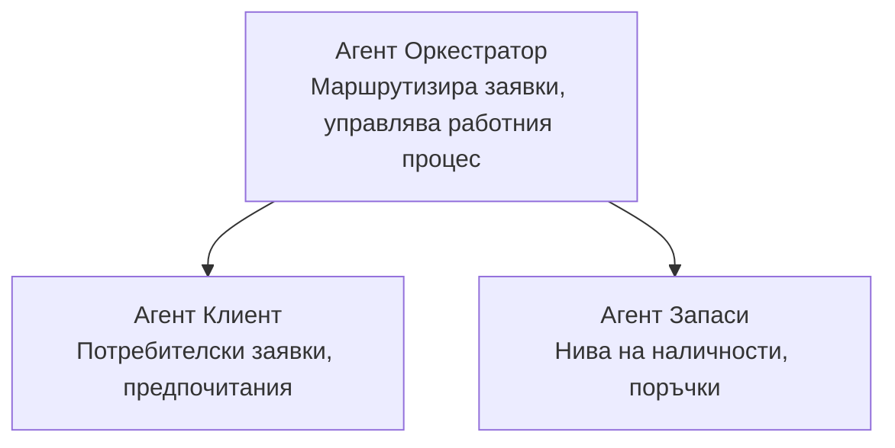

# Глава 5: Многоагентни AI решения

**📚 Курс**: [AZD За начинаещи](../../README.md) | **⏱️ Продължителност**: 2-3 часа | **⭐ Ниво на сложност**: Напреднали

---

## Преглед

Тази глава разглежда напреднали многоагентни архитектурни модели, оркестрация на агенти и готови за производство AI внедрения за сложни сценарии.

> Валидирано с `azd 1.23.12` през март 2026 г.

## Учебни цели

След завършване на тази глава вие ще:
- Разбирате многоагентни архитектурни модели
- Внедрите координирани системи от AI агенти
- Изпълните комуникация между агенти
- Създадете готови за производство многоагентни решения

---

## 📚 Уроци

| # | Урок | Описание | Време |
|---|--------|-------------|------|
| 1 | [Многоагентно решение за търговия](../../examples/retail-scenario.md) | Пълно ръководство за изпълнение | 90 мин |
| 2 | [Модели за координация](../chapter-06-pre-deployment/coordination-patterns.md) | Стратегии за оркестрация на агенти | 30 мин |
| 3 | [Внедряване с ARM шаблон](../../examples/retail-multiagent-arm-template/README.md) | Внедряване с един клик | 30 мин |

---

## 🚀 Бърз старт

```bash
# Опция 1: Разгръщане от шаблон
azd init --template agent-openai-python-prompty
azd up

# Опция 2: Разгръщане от агент манифест (изисква разширение azure.ai.agents)
azd extension install azure.ai.agents
azd ai agent init -m agent-manifest.yaml
azd up
```

> **Кой подход?** Използвайте `azd init --template` за да започнете с работещ пример. Използвайте `azd ai agent init`, когато имате свой собствен манифест на агент. Вижте [AZD AI CLI справката](../chapter-08-production/production-ai-practices.md#azd-ai-cli-commands-and-extensions) за пълен детайл.

---

## 🤖 Многоагентна архитектура


---

## 🎯 Представено решение: Многоагентно за търговия

[Многоагентното решение за търговия](../../examples/retail-scenario.md) демонстрира:

- **Агент Клиент**: Управлява взаимодействия и предпочитания на потребителя
- **Агент Инвентар**: Управлява наличности и обработка на поръчки
- **Оркестратор**: Координира между агентите
- **Споделена памет**: Управление на контекст между агенти

### Използвани услуги

| Услуга | Цел |
|---------|---------|
| Microsoft Foundry Models | Разбиране на езика |
| Azure AI Search | Каталог с продукти |
| Cosmos DB | Състояние и памет на агенти |
| Container Apps | Хостинг на агенти |
| Application Insights | Наблюдение |

---

## 🔗 Навигация

| Посока | Глава |
|-----------|---------|
| **Предишна** | [Глава 4: Инфраструктура](../chapter-04-infrastructure/README.md) |
| **Следваща** | [Глава 6: Предварително внедряване](../chapter-06-pre-deployment/README.md) |

---

## 📖 Свързани ресурси

- [Ръководство за AI агенти](../chapter-02-ai-development/agents.md)
- [Практики за производство на AI](../chapter-08-production/production-ai-practices.md)
- [Отстраняване на проблеми с AI](../chapter-07-troubleshooting/ai-troubleshooting.md)

---

<!-- CO-OP TRANSLATOR DISCLAIMER START -->
**Отказ от отговорност**:  
Този документ е преведен с помощта на AI преводаческа услуга [Co-op Translator](https://github.com/Azure/co-op-translator). Въпреки че се стремим към точност, имайте предвид, че автоматизираните преводи може да съдържат грешки или неточности. Оригиналният документ на неговия роден език трябва да се счита за авторитетен източник. За критична информация се препоръчва професионален превод от човек. Не носим отговорност за никакви недоразумения или погрешни тълкувания, произтичащи от използването на този превод.
<!-- CO-OP TRANSLATOR DISCLAIMER END -->