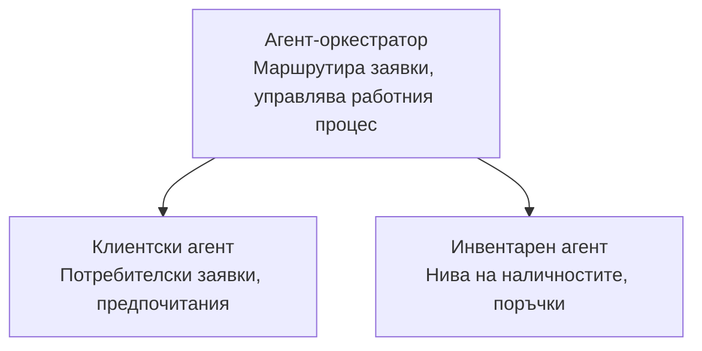

# Глава 5: Многоагентни AI решения

**📚 Курс**: [AZD For Beginners](../../README.md) | **⏱️ Продължителност**: 2-3 часа | **⭐ Сложност**: Напреднал

---

## Преглед

Тази глава обхваща напреднали шаблони за многоагентна архитектура, оркестрация на агенти и AI разгръщания, готови за продукция, за сложни сценарии.

## Учебни цели

След като завършите тази глава, ще:
- Разберете шаблоните за многоагентна архитектура
- Разположите координирани системи от AI агенти
- Реализирате комуникация между агенти
- Изградите готови за продукция многоагентни решения

---

## 📚 Уроци

| # | Урок | Описание | Време |
|---|--------|-------------|------|
| 1 | [Многоагентно решение за търговия на дребно](../../examples/retail-scenario.md) | Пълен преглед на имплементацията | 90 мин |
| 2 | [Шаблони за координация](../chapter-06-pre-deployment/coordination-patterns.md) | Стратегии за оркестрация на агенти | 30 мин |
| 3 | [Разгръщане с ARM шаблон](../../examples/retail-multiagent-arm-template/README.md) | Разгръщане с един клик | 30 мин |

---

## 🚀 Бърз старт

```bash
# Опция 1: Разгръщане от шаблон
azd init --template agent-openai-python-prompty
azd up

# Опция 2: Разгръщане от манифест на агент (изисква разширение azure.ai.agents)
azd extension install azure.ai.agents
azd ai agent init -m agent-manifest.yaml
azd up
```

> **Кой подход?** Използвайте `azd init --template` да започнете от работещ пример. Използвайте `azd ai agent init`, когато имате собствен агентен манифест. Вижте [Справочник за AZD AI CLI](../chapter-08-production/production-ai-practices.md#azd-ai-cli-commands-and-extensions) за пълни подробности.

---

## 🤖 Многоагентна архитектура


---

## 🎯 Представено решение: Многоагентно решение за търговия на дребно

The [Многоагентно решение за търговия на дребно](../../examples/retail-scenario.md) демонстрира:

- **Клиентски агент**: Обработва взаимодействията с потребителите и предпочитанията
- **Агент за инвентар**: Управлява наличностите и обработката на поръчки
- **Оркестратор**: Координира взаимодействията между агентите
- **Споделена памет**: Управление на контекст между агентите

### Използвани услуги

| Service | Purpose |
|---------|---------|
| Microsoft Foundry Models | Разбиране на естествен език |
| Azure AI Search | Продуктов каталог |
| Cosmos DB | Състояние и памет на агента |
| Container Apps | Хостване на агенти |
| Application Insights | Мониторинг |

---

## 🔗 Навигация

| Direction | Chapter |
|-----------|---------|
| **Предишна** | [Глава 4: Инфраструктура](../chapter-04-infrastructure/README.md) |
| **Следваща** | [Глава 6: Предварително разгръщане](../chapter-06-pre-deployment/README.md) |

---

## 📖 Свързани ресурси

- [Ръководство за AI агенти](../chapter-02-ai-development/agents.md)
- [Практики за продукционен AI](../chapter-08-production/production-ai-practices.md)
- [Отстраняване на проблеми с AI](../chapter-07-troubleshooting/ai-troubleshooting.md)

---

<!-- CO-OP TRANSLATOR DISCLAIMER START -->
**Отказ от отговорност**:
Този документ е преведен с помощта на AI преводаческа услуга [Co-op Translator](https://github.com/Azure/co-op-translator). Въпреки че се стремим към точност, моля, имайте предвид, че автоматизираните преводи могат да съдържат грешки или неточности. Оригиналният документ на оригиналния му език трябва да се счита за авторитетен източник. За критична информация се препоръчва професионален превод, извършен от човешки преводач. Не носим отговорност за каквито и да е недоразумения или погрешни тълкувания, възникнали от използването на този превод.
<!-- CO-OP TRANSLATOR DISCLAIMER END -->