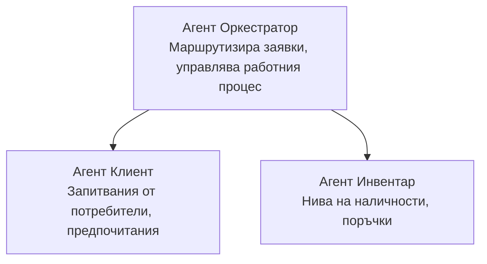

# Глава 5: Многоагентни AI решения

**📚 Курс**: [AZD за начинаещи](../../README.md) | **⏱️ Продължителност**: 2-3 часа | **⭐ Сложност**: Напреднал

---

## Преглед

Тази глава разглежда усъвършенствани многоагентни архитектурни модели, оркестрация на агенти и AI внедрявания, готови за продукция, за сложни сценарии.

> Проверено с `azd 1.27.1` през юли 2026 г.

## Учебни цели

След като завършите тази глава, ще можете:
- Да разбирате многоагентни архитектурни модели
- Да внедрявате координирани AI агентски системи
- Да реализирате комуникация между агенти
- Да изграждате многоагентни решения, готови за продукция

---

## 📚 Уроци

| # | Урок | Описание | Време |
|---|--------|-------------|------|
| 1 | [Основи на многоагентните системи](multi-agent-basics.md) | Практическо: внедрете работещо многоагентно приложение с `azd up` | 45 мин |
| 2 | [Координационни модели](../chapter-06-pre-deployment/coordination-patterns.md) | Стратегии за оркестрация на агенти (продължава в Глава 6) | 30 мин |
| 3 | [Внедряване чрез ARM шаблон](../../examples/retail-multiagent-arm-template/README.md) | Пример за внедряване с един клик | 30 мин |

> **Започнете с урок 1.** Това е единственият изцяло практичен урок, който може да бъде внедрен в тази глава. Урок 2 е в Глава 6 (споделен с планирането преди внедряване), а [Retail Multi-Agent Solution](../../examples/retail-scenario.md) е архитектурен план — дизайн справочник, а не еднокоманден шаблон.

---

## 🚀 Бърз старт

```bash
# Опция 1: Разгръщане от шаблон
azd init --template agent-openai-python-prompty
azd up

# Опция 2: Разгръщане от агентен манифест (изисква azure.ai.agents разширение)
azd extension install azure.ai.agents
azd ai agent init -m agent-manifest.yaml
azd up
```

> **Кой подход?** Използвайте `azd init --template`, за да започнете от работещ пример. Използвайте `azd ai agent init`, когато имате собствен агентски манифест. Вижте пълните подробности в [AZD AI CLI справочника](../chapter-08-production/production-ai-practices.md#azd-ai-cli-commands-and-extensions).

---

## 🤖 Многоагентна архитектура



---

## 🎯 Избрано решение: Retail многоагентна система

[Retail Multi-Agent Solution](../../examples/retail-scenario.md) демонстрира:

- **Клиентски агент**: Управлява потребителските взаимодействия и предпочитания
- **Агент инвентаризация**: Управлява запасите и обработката на поръчки
- **Оркестратор**: Координира взаимодействието между агентите
- **Споделена памет**: Управление на контекста между агенти

### Използвани услуги

| Услуга | Цел |
|---------|---------|
| Microsoft Foundry Models | Разбиране на език |
| Azure AI Search | Каталог с продукти |
| Cosmos DB | Състояние и памет на агента |
| Container Apps | Хостване на агенти |
| Application Insights | Мониторинг |

---

## 🔗 Навигация

| Посока | Глава |
|-----------|---------|
| **Предишна** | [Глава 4: Инфраструктура](../chapter-04-infrastructure/README.md) |
| **Следваща** | [Глава 6: Предварително внедряване](../chapter-06-pre-deployment/README.md) |

---

## 📖 Свързани ресурси

- [Ръководство за AI агенти](../chapter-02-ai-development/agents.md)
- [Практики за продукционен AI](../chapter-08-production/production-ai-practices.md)
- [Отстраняване на неизправности при AI](../chapter-07-troubleshooting/ai-troubleshooting.md)

---

<!-- CO-OP TRANSLATOR DISCLAIMER START -->
**Отказ от отговорност**:
Този документ е преведен с помощта на AI преводачески услуга [Co-op Translator](https://github.com/Azure/co-op-translator). Въпреки че се стремим към точност, моля имайте предвид, че автоматизираните преводи могат да съдържат грешки или неточности. Оригиналният документ на неговия роден език трябва да се счита за авторитетен източник. За критична информация се препоръчва професионален човешки превод. Ние не носим отговорност за каквито и да е недоразумения или неправилни тълкувания, произтичащи от използването на този превод.
<!-- CO-OP TRANSLATOR DISCLAIMER END -->