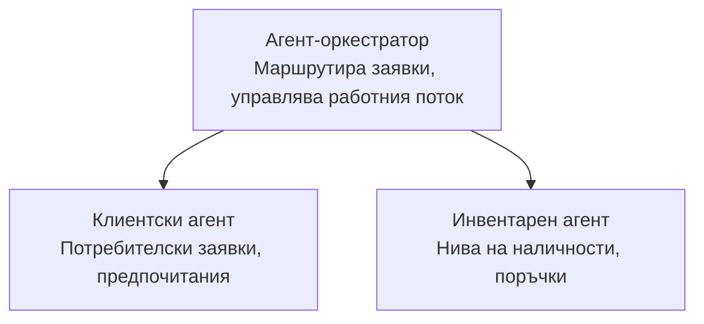

# Глава 5: Многоагентни AI решения

**📚 Курс**: [AZD За начинаещи](../../README.md) | **⏱️ Продължителност**: 2-3 часа | **⭐ Сложност**: Напреднало

---

## Преглед

Тази глава обхваща напреднали модели на многоагентна архитектура, оркестрация на агенти и AI внедрявания, готови за продукция за сложни сценарии.

> Валидирано срещу `azd 1.25.6` през юни 2026 г.

## Учебни цели

След завършване на тази глава, ще:
- Разберете шаблоните на многоагентна архитектура
- Разгрънете координирани AI агентни системи
- Реализирате комуникация между агенти
- Изградите многоагентни решения, готови за продукция

---

## 📚 Уроци

| # | Урок | Описание | Време |
|---|--------|-------------|------|
| 1 | [Основи на многоагентни системи](multi-agent-basics.md) | Практическо: разгърнете работещо многоагентно приложение с `azd up` | 45 мин |
| 2 | [Шаблони за координация](../chapter-06-pre-deployment/coordination-patterns.md) | Стратегии за оркестрация на агенти (продължава в Глава 6) | 30 мин |
| 3 | [Разгръщане с ARM шаблон](../../examples/retail-multiagent-arm-template/README.md) | Пример за разгръщане с едно кликване | 30 мин |

> **Започнете с Урок 1.** Това е единственият напълно практичен, разгръщаем урок в тази глава. Урок 2 е в Глава 6 (споделя се с планирането преди разгръщане), а [Многоагентно решение за търговия на дребно](../../examples/retail-scenario.md) е архитектурен чертеж — справка за дизайн, не шаблон за разгръщане с една команда.

---

## 🚀 Бърз старт

```bash
# Опция 1: Разгръщане от шаблон
azd init --template agent-openai-python-prompty
azd up

# Опция 2: Разгръщане от манифест на агент (изисква разширението azure.ai.agents)
azd extension install azure.ai.agents
azd ai agent init -m agent-manifest.yaml
azd up
```

> **Кой подход?** Използвайте `azd init --template` за да започнете от работещ пример. Използвайте `azd ai agent init`, когато имате собствен агентски манифест. Вижте [Ръководство за AZD AI CLI](../chapter-08-production/production-ai-practices.md#azd-ai-cli-commands-and-extensions) за пълни подробности.

---

## 🤖 Многоагентна архитектура



---

## 🎯 Представено решение: Многоагентно решение за търговия на дребно

Решението за многоагентна търговия на дребно демонстрира:

- **Клиентски агент**: Обработва взаимодействия с потребителите и предпочитанията им
- **Агент за наличности**: Управлява наличности и обработка на поръчки
- **Оркестратор**: Координира между агентите
- **Споделена памет**: Управление на контекст между агентите

### Използвани услуги

| Услуга | Цел |
|---------|---------|
| Microsoft Foundry Models | Езиково разбиране |
| Azure AI Search | Каталог с продукти |
| Cosmos DB | Състояние и памет на агентите |
| Container Apps | Хостинг на агенти |
| Application Insights | Мониторинг |

---

## 🔗 Навигация

| Посока | Глава |
|-----------|---------|
| **Предишна** | [Глава 4: Инфраструктура](../chapter-04-infrastructure/README.md) |
| **Следваща** | [Глава 6: Предварително разгръщане](../chapter-06-pre-deployment/README.md) |

---

## 📖 Свързани ресурси

- [Ръководство за AI агенти](../chapter-02-ai-development/agents.md)
- [Практики за продукционен AI](../chapter-08-production/production-ai-practices.md)
- [Отстраняване на проблеми с AI](../chapter-07-troubleshooting/ai-troubleshooting.md)

---

<!-- CO-OP TRANSLATOR DISCLAIMER START -->
**Отказ от отговорност**:
Този документ е преведен с помощта на AI преводачески услуга [Co-op Translator](https://github.com/Azure/co-op-translator). Въпреки че се стремим към точност, моля имайте предвид, че автоматизираните преводи могат да съдържат грешки или неточности. Оригиналният документ на неговия роден език трябва да се счита за авторитетен източник. За критична информация се препоръчва професионален човешки превод. Ние не носим отговорност за каквито и да е недоразумения или неправилни тълкувания, произтичащи от използването на този превод.
<!-- CO-OP TRANSLATOR DISCLAIMER END -->