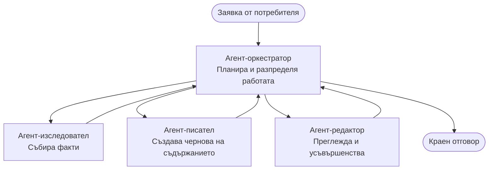

# Multi-Agent Basics - Deploy Your First Coordinated AI System

**Chapter Navigation:**
- **📚 Course Home**: [AZD For Beginners](../../README.md)
- **📖 Current Chapter**: Глава 5 - Многoагентни AI решения
- **⬅️ Previous**: [Chapter 4: Infrastructure](../chapter-04-infrastructure/README.md)
- **➡️ Next**: [Coordination Patterns](../chapter-06-pre-deployment/coordination-patterns.md)

> Валидирано с `azd 1.25.6` през юни 2026.

## Въведение

В по-ранните глави разгръщахте едно приложение—а в Глава 2 разгръщахте един AI агент. Този урок прави следващата стъпка: разгъване на **многоагентна система**, където няколко специализирани агента работят заедно, за да решат проблем, който един агент не би могъл да реши добре сам.

Добрата новина за начинаещите: **не ви трябват нови команди.** Многоагентното решение все още е проект azd. Ще правите `azd init`, `azd up`, тест и `azd down`—същия работен поток, който вече знаете. Променя се само *формата* на приложението вътре.

## Учебни цели

Към края на този урок ще:
- Разберете какво означава "многоагентен" и кога си струва допълнителната сложност
- Разпознаете общите роли в многоагентна система (оркестратор + специалисти)
- Разгърнете реален, работещ многоагентен шаблон с `azd up`
- Разберете Azure ресурсите, които поддържат многоагентното приложение
- Знаете как да проверите, персонализирате и демонтирате решението безопасно

## Учебни резултати

След завършване на този урок ще можете да:
- Обясните разликата между един агент и многоагентна система
- Изберете между един агент с инструменти и истински многоагентен дизайн
- Разгърнете и тествате многоагентен шаблон от край до край с azd
- Идентифицирате къде работи всеки агент и как комуникират помежду си
- Почиствате всички ресурси, за да избегнете продължаващи такси

---

## Какво е многоагентна система?

Един AI агент е един модел с набор от инструкции и (опционално) някои инструменти. Това работи добре за фокусирани задачи. Но когато задачата нараства—проучване, след това писане, после редакция и проверка на факти—напъхването на всичко в един промпт прави агента по-бавен, по-малко надежден и по-труден за отстраняване на грешки.

A **многоагентна система** разделя работата на специалисти, които всеки вършат една задача добре, координирани от оркестратор:



### Двете роли, които винаги ще видите

| Role | Job | Example |
|------|-----|---------|
| **Orchestrator** | Decides *what happens next* and routes work between agents | "First research, then write, then edit" |
| **Specialist** | Does one focused job and returns a result | A "researcher" that only gathers facts |

### Наистина ли ви трябват няколко агента?

Започнете просто. Прилагайте многоагентен подход **само** когато едно от следните е вярно:

- ✅ Задачата има **отделни етапи**, които печелят от различни инструкции (проучване срещу писане срещу преглед)
- ✅ Искате специалистите да работят **паралелно**, за да спестите време
- ✅ Различни стъпки изискват **различни инструменти или източници на данни**
- ✅ Нуждаете се всяка стъпка да е **независимо тестируема и отстраняема**

Ако задачата ви е един въпрос и отговор или просто повикване на инструмент, **един агент с инструменти** (Глава 2) е по-прост, по-евтин и по-лесен за експлоатация.

> **Съвет за начинаещи:** "Повече агенти" не значи "по-добре." Всеки агент добавя латентност, разходи и още една неща за наблюдение. Добавяйте агенти само когато проблемът ясно се дели на части.

---

## Два начина да изградите многоагентно в Azure

| Approach | What it is | Best for |
|----------|-----------|----------|
| **Single agent + tools** | One Foundry agent that calls functions/tools | Simple workflows, getting started |
| **Multiple coordinated agents** | Several agents with an orchestrator | Distinct stages, parallel work, specialization |

Този урок се фокусира върху втория подход, използвайки **готов шаблон**, за да видите реална многоагентна система в действие преди да изградите своя собствена.

---

## Практическо: Разгръщане на работещо многоагентно приложение

Ще разгърнем **Contoso Creative Writer**, официален пример на Azure, който използва няколко агента (изследовател, писател, редактор), координирани да произведат статия. Това е отличен първи многоагентен пример, защото ролите са лесни за разбиране.

### Стъпка 1: Инициализирайте шаблона

```bash
# Създайте работна папка
mkdir creative-writer && cd creative-writer

# Инициализирайте от официалния многоагентен шаблон
azd init --template contoso-creative-writer
```

> Прегледайте повече многоагентни шаблони по всяко време в [Awesome AZD AI gallery](https://azure.github.io/awesome-azd/?tags=ai). Други подходящи за начинаещи опции включват `get-started-with-ai-agents` и `azure-ai-travel-agents`.

### Стъпка 2: Удостоверяване

```bash
# Необходимо за azd workflows
azd auth login
```

### Стъпка 3: Създайте среда

```bash
azd env new dev
```

### Стъпка 4: Преглед, след това разгърнете

```bash
# Вижте какво ще бъде създадено, преди да похарчите каквото и да е (препоръчително)
azd provision --preview

# Осигурете инфраструктурата и разположете всички агенти в една стъпка
azd up
```

`azd up` ще поиска абонамент и регион, след което ще осигури Azure ресурсите и ще разгърне приложението. AI разгърнатия може да отнеме повече време от просто уеб приложение—ако разгъвате по-големи модели, можете да удължите времето за изчакване на разгъването:

```bash
azd deploy --timeout 1800
```

> **Внимание относно разходи и капацитет:** Многоагентните приложения разгъщат AI модели, които използват квота и генерират разходи. Ако `azd up` се провали поради квота за модел, вижте [AI Troubleshooting](../chapter-07-troubleshooting/ai-troubleshooting.md) за решения за регион и квоти, и Глава 6 [Capacity Planning](../chapter-06-pre-deployment/capacity-planning.md).

---

## Какво сте разгърнали

Типично многоагентно приложение като това осигурява набор от Azure ресурси, които съответстват директно на отговорностите в диаграмата по-горе:

| Resource | Why it's there |
|----------|----------------|
| **Microsoft Foundry / Models** | Хоства езиковите модели, които използва всеки агент |
| **Azure AI Search** | Дава на изследователския агент осезаеми данни за търсене |
| **Container Apps** (or App Service) | Хоства оркестратора и кода на агентите |
| **Cosmos DB** (in some samples) | Съхранява споделеното състояние/памет, предавана между агентите |
| **Application Insights** | Проследява заявките *през* агентите, за да можете да отстранявате потока на изпълнение |

### Как агентите комуникират помежду си

В повечето azd многоагентни примери, **оркестраторът работи във вашия код на приложението** (например, използвайки рамка като Semantic Kernel или Microsoft Agent Framework). Оркестраторът вика всеки специализиран агент последователно, предава резултатите и сглобява крайния отговор. Агентите споделят контекст чрез:

- **Function/tool calls** — оркестраторът извиква специализиран агент и получава резултат обратно
- **Shared memory** — база данни (често Cosmos DB) съхранява състояние, което и двата агента могат да четат
- **Messages/events** — за по-слабо свързване агентите комуникират чрез опашка или Service Bus

> **Защо това е важно за отстраняване на грешки:** тъй като всяка стъпка е отделна, Application Insights ви показва *кой* агент е бил бавен или се е провалил. Това е основна причина да разделите работата между агенти.

---

## Проверете разгъването

Потвърдете, че системата наистина работи, преди да продължите:

```bash
# Покажи разположените крайни точки
azd show

# Отвори таблото за мониторинг на приложението
azd monitor

# Проследи логовете ако нещо изглежда нередно
azd monitor --logs
```

След това отворете URL адреса на приложението от `azd show` и опитайте заявка, която упражнява всички агенти (за Creative Writer, помолете го да напише кратка статия по тема). В Application Insights **transaction search** трябва да видите как заявката се разпределя през стъпките изследовател, писател и редактор.

**Критерии за успех:**
- ✅ `azd show` изброява достъпен крайна точка
- ✅ Заявка произвежда резултат, който явно е преминал през множество етапи
- ✅ Application Insights показва трасета за повече от една стъпка на агент

---

## Персонализиране: Добавяне или настройка на агент

Тъй като всеки агент е просто инструкции плюс инструменти, персонализирането е достъпно:

1. **Намерете дефинициите на агентите** в шаблона (често набор от файлове `prompts/`, `agents/` или `*.prompty`).
2. **Настройте инструкциите на агента** — например, кажете на редактора да налага конкретен тон или брой думи.
3. **Преразгънете само кода** (инфраструктурата остава непроменена):

   ```bash
   azd deploy
   ```

За да продължите и да изградите агенти от *собствения* си манифест, използвайте разширението за агенти и целия му жизнен цикъл:

```bash
azd extension install azure.ai.agents
azd ai agent init -m agent-manifest.yaml
azd up
azd ai agent invoke      # тест, с време за отговор
```

Вижте [Chapter 2: Agents](../chapter-02-ai-development/agents.md) и [AZD AI CLI reference](../chapter-08-production/production-ai-practices.md#azd-ai-cli-commands-and-extensions) за пълния жизнен цикъл на агента (`invoke`, `eval generate`, `optimize`, `delete`).

---

## Почистване

Многоагентните приложения изпълняват множество таксуеми услуги. Демонтирайте всичко, когато приключите:

```bash
azd down --force --purge
```

Флагът `--purge` също премахва ресурси с меко изтриване (като Foundry/Azure AI Services акаунти), за да не блокират бъдещо разгъване или да продължават да генерират разходи.

---

## Бележка за продукционни многоагентни системи

[Retail Multi-Agent Solution](../../examples/retail-scenario.md) в това хранилище е **архитектурен план**, а не шаблон с една команда—той документира как би бил изграден производствен търговски система (и е ясно, че пълната реализация е значително усилие). Използвайте го като дизайн референция *след* като сте разгърнали работещ пример тук. За продукционни въпроси (устойчивост, разходи, наблюдение, управление), продължете към [Chapter 8: Production AI Practices](../chapter-08-production/production-ai-practices.md).

---

## Резюме

- Многоагентната система разделя работата между специалисти, координирани от оркестратор.
- Използвайте я само когато задачата има отделни етапи, паралелизъм или различни инструменти за всяка стъпка—в противен случай предпочитайте един агент.
- Работният поток azd не се променя: `azd init` → `azd up` → тест → `azd down`.
- Реален шаблон като `contoso-creative-writer` ви позволява да видите и персонализирате работещо многоагентно приложение още днес.
- Application Insights трасировката през агентите е едно от най-големите практични предимства на многоагентния дизайн.

---

## 🔗 Navigation

| Direction | Lesson |
|-----------|--------|
| **Previous** | [Chapter 4: Infrastructure](../chapter-04-infrastructure/README.md) |
| **Next** | [Coordination Patterns](../chapter-06-pre-deployment/coordination-patterns.md) |

## 📖 Свързани ресурси

- [AI Agents Guide](../chapter-02-ai-development/agents.md)
- [Coordination Patterns](../chapter-06-pre-deployment/coordination-patterns.md)
- [Production AI Practices](../chapter-08-production/production-ai-practices.md)
- [AI Troubleshooting](../chapter-07-troubleshooting/ai-troubleshooting.md)

---

<!-- CO-OP TRANSLATOR DISCLAIMER START -->
**Отказ от отговорност**:
Този документ е преведен с помощта на AI преводачески услуга [Co-op Translator](https://github.com/Azure/co-op-translator). Въпреки че се стремим към точност, моля имайте предвид, че автоматизираните преводи могат да съдържат грешки или неточности. Оригиналният документ на неговия роден език трябва да се счита за авторитетен източник. За критична информация се препоръчва професионален човешки превод. Ние не носим отговорност за каквито и да е недоразумения или неправилни тълкувания, произтичащи от използването на този превод.
<!-- CO-OP TRANSLATOR DISCLAIMER END -->