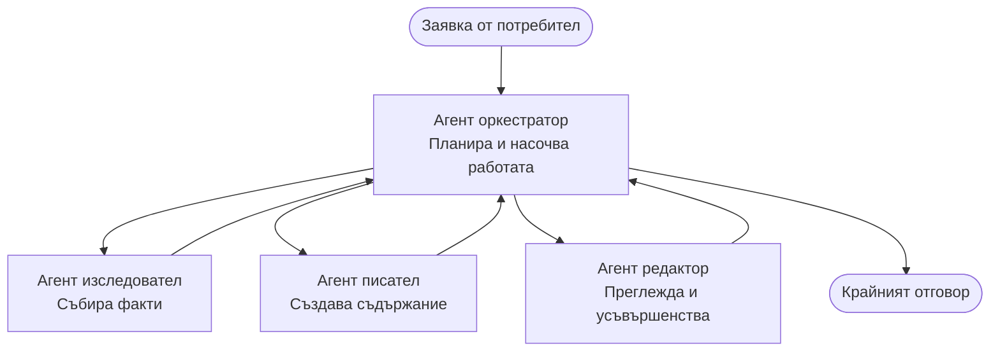

# Основи на мултиагентните системи - Разгръщане на първата ви координирана AI система

**Навигация в главата:**
- **📚 Начало на курса**: [AZD за начинаещи](../../README.md)
- **📖 Текуща глава**: Глава 5 - Мултиагентни AI решения
- **⬅️ Предишна**: [Глава 4: Инфраструктура](../chapter-04-infrastructure/README.md)
- **➡️ Следваща**: [Патерни за координация](../chapter-06-pre-deployment/coordination-patterns.md)

> Валидирано с `azd 1.27.1` през юли 2026 г.

## Въведение

В по-ранните глави разгръщахте едно приложение—а в Глава 2 разгръщахте един AI агент. Този урок прави следващата стъпка: разгръщане на **мултиагентна система**, където няколко специализирани агента работят заедно, за да решат проблем, който един агент не би могъл да се справи добре сам.

Добрата новина за начинаещите: **няма нужда от нови команди.** Мултиагентното решение все още е azd проект. Ще правите `azd init`, `azd up`, тестване и `azd down`—точно така, както вече знаете. Промяната е в *структурата* на приложението вътре.

## Цели на обучението

В края на този урок ще:
- Разберете какво означава "мултиагентен" и кога си струва допълнителната сложност
- Разпознавате общите роли в мултиагентна система (оркестратор + специалисти)
- Разгърнете работещ мултиагентен шаблон с `azd up`
- Разбирате Azure ресурсите, които поддържат мултиагентно приложение
- Знаете как да проверите, персонализирате и демонтирате решението безопасно

## Резултати от обучението

След завършване на урока ще можете:
- Да обясните разликата между единичен агент и мултиагентна система
- Да избирате между единичен агент с инструменти и истински мултиагентен дизайн
- Да разгърнете и тествате мултиагентен шаблон изцяло с azd
- Да идентифицирате къде се изпълнява всеки агент и как комуникират
- Да почистите всички ресурси, за да избегнете текущи разходи

---

## Какво е мултиагентна система?

Един AI агент е един модел с набор от инструкции и (по избор) някои инструменти. Това работи добре за фокусирани задачи. Но с развитието на задачата—проучване, после писане, после редакция, после проверка на факти—събирането на всичко в една заявка прави агента по-бавен, по-малко надежден и по-труден за дебъгване.

**Мултиагентна система** разделя работата на специалисти, които всеки върши една работа добре, координирани от оркестратор:



### Двете роли, които винаги ще видите

| Роля | Работа | Пример |
|------|-------|---------|
| **Оркестратор** | Решава *какво да се случи след това* и маршрутизира работата между агентите | "Първо проучване, после писане, после редакция" |
| **Специалист** | Извършва една фокусирана задача и връща резултат | "изследовател", който събира само факти |

### Дали наистина ви трябват няколко агента?

Започнете просто. Прилагайте мултиагентна система **само** когато е вярно едно от следните:

- ✅ Задачата има **отделни етапи**, които се нуждаят от различни инструкции (проучване срещу писане срещу ревю)
- ✅ Искате специалистите да работят **паралелно** за пестене на време
- ✅ Различни стъпки изискват **различни инструменти или източници на данни**
- ✅ Всеки етап трябва да е **самостоятелно тестваме и дебъгваем**

Ако задачата е само въпрос и отговор или просто повикване на инструмент, **единичен агент с инструменти** (Глава 2) е по-прост, по-евтин и по-лесен за работа.

> **Съвет за начинаещи:** "Повече агенти" не означава "по-добре." Всеки агент добавя забавяне, разходи и нов елемент за наблюдение. Добавяйте агенти само когато проблемът явно се разделя на части.

---

## Два начина за изграждане на мултиагентна система в Azure

| Подход | Какво представлява | Най-подходящ за |
|---------|------------------|---------------|
| **Единичен агент + инструменти** | Един Foundry агент, който вика функции/инструменти | Лесни работни потоци, начало |
| **Няколко координирани агенти** | Няколко агенти с оркестратор | Отделни етапи, паралелна работа, специализация |

Този урок се фокусира върху втория подход с помощта на **готов шаблон**, за да видите как работи истинска мултиагентна система, преди да изградите своя собствена.

---

## Практика: Разгръщане на работещо мултиагентно приложение

Ще разгърнем **Contoso Creative Writer**, официален Azure пример, който използва няколко агента (изследовател, писател, редактор), координирани да създадат статия. Това е чудесно първо мултиагентно приложение, защото ролите са лесни за разбиране.

### Стъпка 1: Инициализиране на шаблона

```bash
# Създайте работна папка
mkdir creative-writer && cd creative-writer

# Инициализирайте от официалния многоагентен шаблон
azd init --template contoso-creative-writer
```

> Разглеждайте повече мултиагентни шаблони по всяко време в [Awesome AZD AI галерия](https://azure.github.io/awesome-azd/?tags=ai). Други подходящи за начинаещи опции са `get-started-with-ai-agents` и `azure-ai-travel-agents`.

### Стъпка 2: Удостоверяване

```bash
# Задължително за azd работни потоци
azd auth login
```

### Стъпка 3: Създаване на среда

```bash
azd env new dev
```

### Стъпка 4: Преглед, след което разгръщане

```bash
# Вижте какво ще бъде създадено преди да похарчите нещо (препоръчително)
azd provision --preview

# Осигурете инфраструктура и инсталирайте всички агенти в една стъпка
azd up
```

`azd up` ще поиска абонамент и регион, след което ще осигури Azure ресурсите и ще разгрърне приложението. Разгръщанията на AI могат да отнемат повече време от просто уеб приложение—ако разгръщате по-големи модели, можете да удължите тайм-аута на разгръщането:

```bash
azd deploy --timeout 1800
```

> **Внимание за разходи и капацитет:** Мултиагентните приложения разгръщат AI модели, които консумират квоти и генерират разходи. Ако `azd up` се провали за квота на модел, вижте [Отстраняване на проблеми с AI](../chapter-07-troubleshooting/ai-troubleshooting.md) за поправки на регион и квоти, както и Глава 6 [Планиране на капацитет](../chapter-06-pre-deployment/capacity-planning.md).

---

## Разбиране на разгърнатото

Типично мултиагентно приложение като това осигурява набор от Azure ресурси, които съответстват директно на отговорностите в горната диаграма:

| Ресурс | Защо е там |
|---------|--------------|
| **Microsoft Foundry / Модели** | Хоства езиковите модели, които всеки агент използва |
| **Azure AI Search** | Дава на агента изследовател достъп до базирани на факти данни за търсене |
| **Container Apps** (или App Service) | Хоства оркестраторния и агентския код |
| **Cosmos DB** (в някои примери) | Съхранява споделено състояние/памет, предавана между агентите |
| **Application Insights** | Проследява заявки *през* агентите, за да можете да дебъгвате потока |

### Как агентите комуникират помежду си

В повечето azd мултиагентни примери, **оркестраторът работи в кода на вашето приложение** (например, чрез рамки като Semantic Kernel или Microsoft Agent Framework). Оркестраторът вика всеки специализиран агент поред, предава резултатите и събира крайния отговор. Агентите споделят контекст чрез:

- **Викания на функции/инструменти** — оркестраторът вика специалист и получава резултат
- **Споделена памет** — база данни (често Cosmos DB) държи състояние, което двата агента могат да четат
- **Съобщения/събития** — за по-експлозивна връзка, агентите комуникират чрез опашка или Service Bus

> **Защо това е важно за дебъгване:** понеже всяка стъпка е отделна, Application Insights ви показва *кой* агент е бавен или е имал проблем. Това е основна причина за разпределяне на работата между агенти.

---

## Проверка на разгръщането

Потвърдете, че системата работи, преди да продължите:

```bash
# Покажи разположените крайни точки
azd show

# Отвори таблото за мониторинг на приложението
azd monitor

# Проследявай логовете, ако нещо изглежда нередно
azd monitor --logs
```

След това отворете URL адреса на приложението от `azd show` и опитайте заявка, която използва всички агенти (за Creative Writer, помолете да напише кратка статия по тема). В **Търсене на транзакции** в Application Insights би трябвало да видите заявката разпределена през стъпките изследовател, писател и редактор.

**Критерии за успех:**
- ✅ `azd show` показва достижима крайна точка
- ✅ Заявка дава резултат, който очевидно е преминал през няколко етапа
- ✅ Application Insights показва следи от повече от един агентски етап

---

## Персонализиране: Добавяне или настройване на агент

Понеже всеки агент е само инструкции плюс инструменти, персонализирането е достъпно:

1. **Намерете дефинициите на агента** в шаблона (често в папки `prompts/`, `agents/` или файлове `*.prompty`).
2. **Настройте инструкциите на агента** — например, кажете на редактора да прилага определен тон или брой думи.
3. **Само препубликувайте кода** (инфраструктурата остава същата):

   ```bash
   azd deploy
   ```

За по-нататъшно развитие и създаване на агенти от *собствен* манифест, използвайте agent разширението и целия му жизнен цикъл:

```bash
azd extension install azure.ai.agents
azd ai agent init -m agent-manifest.yaml
azd up
azd ai agent invoke      # тест, с времетраене на отговора
```

Вижте [Глава 2: Агенти](../chapter-02-ai-development/agents.md) и [AZD AI CLI справочник](../chapter-08-production/production-ai-practices.md#azd-ai-cli-commands-and-extensions) за пълния жизнен цикъл на агенти (`invoke`, `eval generate`, `optimize`, `delete`).

---

## Почистване

Мултиагентните приложения пускат няколко платими услуги. Разгърнете всичко когато приключите:

```bash
azd down --force --purge
```

Флагът `--purge` също премахва AI ресурси, изтрити „меко“ (като Foundry/Azure AI Services акаунти), за да не блокират бъдещи разгръщания и да не трупат разходи.

---

## Забележка относно производствени мултиагентни системи

[Retail Multi-Agent Solution](../../examples/retail-scenario.md) в това хранилище е **архитектурен образец**, а не шаблон за една команда—това показва как би бил изграден производствен търговския система (и ясно показва, че пълното построяване е голямо усилие). Използвайте го като дизайнерски референс *след* като сте разгръщали работещ пример тук. За производствени въпроси (издръжливост, разходи, наблюдение, управление), продължете към [Глава 8: Производствени AI практики](../chapter-08-production/production-ai-practices.md).

---

## Обобщение

- Мултиагентна система разделя работата между специалисти, координирани от оркестратор.
- Използвайте я само когато задачата има отделни етапи, паралелна работа или различни инструменти на етап—иначе предпочетете единичен агент.
- Работният поток със azd остава същият: `azd init` → `azd up` → тест → `azd down`.
- Истински шаблон като `contoso-creative-writer` ви позволява днес да видите и персонализирате работещо мултиагентно приложение.
- Application Insights проследяването между агентите е една от най-големите практични ползи от мултиагентния дизайн.

---

## 🔗 Навигация

| Посока | Урок |
|---------|------|
| **Предишен** | [Глава 4: Инфраструктура](../chapter-04-infrastructure/README.md) |
| **Следващ** | [Патерни за координация](../chapter-06-pre-deployment/coordination-patterns.md) |

## 📖 Свързани ресурси

- [Наръчник за AI агенти](../chapter-02-ai-development/agents.md)
- [Патерни за координация](../chapter-06-pre-deployment/coordination-patterns.md)
- [Производствени AI практики](../chapter-08-production/production-ai-practices.md)
- [Отстраняване на AI проблеми](../chapter-07-troubleshooting/ai-troubleshooting.md)

---

<!-- CO-OP TRANSLATOR DISCLAIMER START -->
**Отказ от отговорност**:
Този документ е преведен с помощта на AI преводачески услуга [Co-op Translator](https://github.com/Azure/co-op-translator). Въпреки че се стремим към точност, моля имайте предвид, че автоматизираните преводи могат да съдържат грешки или неточности. Оригиналният документ на неговия роден език трябва да се счита за авторитетен източник. За критична информация се препоръчва професионален човешки превод. Ние не носим отговорност за каквито и да е недоразумения или неправилни тълкувания, произтичащи от използването на този превод.
<!-- CO-OP TRANSLATOR DISCLAIMER END -->