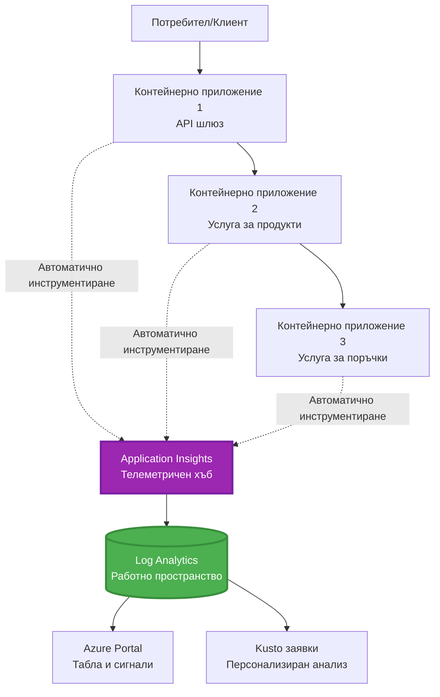
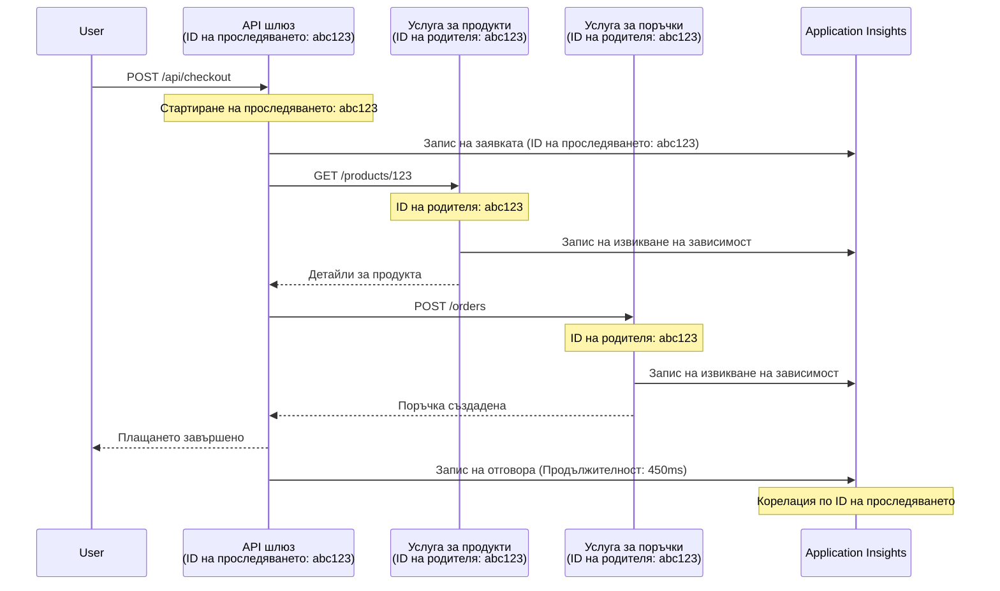

# Интеграция на Application Insights с AZD

⏱️ **Прегледно време**: 40-50 минути | 💰 **Влияние на разходите**: ~$5-15/месец | ⭐ **Сложност**: Средно

**📚 Път на обучение:**
- ← Предишна: [Preflight Checks](preflight-checks.md) - Предварителна проверка преди разгръщане
- 🎯 **Вие сте тук**: Интеграция на Application Insights (Мониторинг, телеметрия, отстраняване на грешки)
- → Следваща: [Deployment Guide](../chapter-04-infrastructure/deployment-guide.md) - Разгръщане в Azure
- 🏠 [Course Home](../../README.md)

---

## Какво ще научите

Чрез завършване на този урок, вие ще:
- Интегрирате автоматично **Application Insights** в проекти с AZD
- Конфигурирате **разпределено проследяване** за микросървисите
- Имплементирате **персонализирана телеметрия** (метрики, събития, зависимости)
- Настроите **Live Metrics** за наблюдение в реално време
- Създадете **аларми и табла** от AZD разгръщания
- Отстранявате проблеми в продукция с помощта на **заявки за телеметрия**
- Оптимизирате **разходите и стратегии за семплиране**
- Наблюдавате **AI/LLM приложения** (tokens, латентност, разходи)

## Защо Application Insights с AZD е важно

### Предизвикателството: Наблюдаемост в продукция

**Без Application Insights:**
```
❌ No visibility into production behavior
❌ Manual log aggregation across services
❌ Reactive debugging (wait for customer complaints)
❌ No performance metrics
❌ Cannot trace requests across services
❌ Unknown failure rates and bottlenecks
```

**С Application Insights + AZD:**
```
✅ Automatic telemetry collection
✅ Centralized logs from all services
✅ Proactive issue detection
✅ End-to-end request tracing
✅ Performance metrics and insights
✅ Real-time dashboards
✅ AZD provisions everything automatically
```

**Аналогия**: Application Insights е като „черна кутия“ за полет + табло в пилотската кабина за вашето приложение. Виждате всичко, което се случва в реално време, и можете да пресъздадете всеки инцидент.

---

## Преглед на архитектурата

### Application Insights в архитектурата на AZD


### Какво се наблюдава автоматично

| Тип телеметрия | Какво улавя | Използване |
|----------------|-------------|-----------|
| **Requests** | HTTP заявки, статус кодове, продължителност | Мониторинг на производителността на API |
| **Dependencies** | Външни извиквания (DB, API, storage) | Идентифициране на тесни места |
| **Exceptions** | Неразрешени грешки със стек тракове | Отстраняване на грешки |
| **Custom Events** | Бизнес събития (регистрация, покупка) | Анализи и фунии |
| **Metrics** | Счетчици за производителност, персонализирани метрики | Планиране на капацитета |
| **Traces** | Лог съобщения с ниво на сериозност | Отстраняване на грешки и одит |
| **Availability** | Тестове за наличност и време за отговор | Мониторинг на SLA |

---

## Предварителни изисквания

### Задължителни инструменти

```bash
# Проверете Azure Developer CLI
azd version
# ✅ Очаква се: azd версия 1.0.0 или по-нова

# Проверете Azure CLI
az --version
# ✅ Очаква се: azure-cli 2.50.0 или по-нова
```

### Изисквания за Azure

- Активен абонамент в Azure
- Права за създаване на:
  - Ресурси Application Insights
  - Log Analytics workspaces
  - Container Apps
  - Resource groups

### Предварителни знания

Трябва да сте завършили:
- [AZD Basics](../chapter-01-foundation/azd-basics.md) - Основни концепции на AZD
- [Configuration](../chapter-03-configuration/configuration.md) - Настройка на средата
- [First Project](../chapter-01-foundation/first-project.md) - Основно разгръщане

---

## Урок 1: Автоматичен Application Insights с AZD

### Как AZD предвижда Application Insights

AZD автоматично създава и конфигурира Application Insights при разгръщане. Нека видим как работи.

### Структура на проекта

```
monitored-app/
├── azure.yaml                     # AZD configuration
├── infra/
│   ├── main.bicep                # Main infrastructure
│   ├── core/
│   │   └── monitoring.bicep      # Application Insights + Log Analytics
│   └── app/
│       └── api.bicep             # Container App with monitoring
└── src/
    ├── app.py                    # Application with telemetry
    ├── requirements.txt
    └── Dockerfile
```

---

### Стъпка 1: Конфигурирайте AZD (azure.yaml)

**Файл: `azure.yaml`**

```yaml
name: monitored-app
metadata:
  template: monitored-app@1.0.0

services:
  api:
    project: ./src
    language: python
    host: containerapp

# AZD automatically provisions monitoring!
```

**Това е всичко!** AZD ще създаде Application Insights по подразбиране. Няма нужда от допълнителна конфигурация за базов мониторинг.

---

### Стъпка 2: Инфраструктура за мониторинг (Bicep)

**Файл: `infra/core/monitoring.bicep`**

```bicep
param logAnalyticsName string
param applicationInsightsName string
param location string = resourceGroup().location
param tags object = {}

// Log Analytics Workspace (required for Application Insights)
resource logAnalytics 'Microsoft.OperationalInsights/workspaces@2022-10-01' = {
  name: logAnalyticsName
  location: location
  tags: tags
  properties: {
    sku: {
      name: 'PerGB2018'  // Pay-as-you-go pricing
    }
    retentionInDays: 30  // Keep logs for 30 days
    features: {
      enableLogAccessUsingOnlyResourcePermissions: true
    }
  }
}

// Application Insights
resource applicationInsights 'Microsoft.Insights/components@2020-02-02' = {
  name: applicationInsightsName
  location: location
  tags: tags
  kind: 'web'
  properties: {
    Application_Type: 'web'
    WorkspaceResourceId: logAnalytics.id
    IngestionMode: 'LogAnalytics'
    publicNetworkAccessForIngestion: 'Enabled'
    publicNetworkAccessForQuery: 'Enabled'
  }
}

// Outputs for Container Apps
output logAnalyticsWorkspaceId string = logAnalytics.id
output logAnalyticsWorkspaceName string = logAnalytics.name
output applicationInsightsConnectionString string = applicationInsights.properties.ConnectionString
output applicationInsightsInstrumentationKey string = applicationInsights.properties.InstrumentationKey
output applicationInsightsName string = applicationInsights.name
```

---

### Стъпка 3: Свържете Container App към Application Insights

**Файл: `infra/app/api.bicep`**

```bicep
param name string
param location string
param tags object = {}
param containerAppsEnvironmentName string
param applicationInsightsConnectionString string

resource containerApp 'Microsoft.App/containerApps@2023-05-01' = {
  name: name
  location: location
  tags: tags
  properties: {
    configuration: {
      ingress: {
        external: true
        targetPort: 8000
      }
      secrets: [
        {
          name: 'appinsights-connection-string'
          value: applicationInsightsConnectionString
        }
      ]
    }
    template: {
      containers: [
        {
          name: 'api'
          image: 'myregistry.azurecr.io/api:latest'
          resources: {
            cpu: json('0.5')
            memory: '1Gi'
          }
          env: [
            {
              name: 'APPLICATIONINSIGHTS_CONNECTION_STRING'
              secretRef: 'appinsights-connection-string'
            }
            {
              name: 'APPLICATIONINSIGHTS_ENABLED'
              value: 'true'
            }
          ]
        }
      ]
    }
  }
}

output uri string = 'https://${containerApp.properties.configuration.ingress.fqdn}'
```

---

### Стъпка 4: Приложение с телеметрия

**Файл: `src/app.py`**

```python
from flask import Flask, request, jsonify
from opencensus.ext.azure.log_exporter import AzureLogHandler
from opencensus.ext.azure.trace_exporter import AzureExporter
from opencensus.ext.flask.flask_middleware import FlaskMiddleware
from opencensus.trace.samplers import ProbabilitySampler
import logging
import os

app = Flask(__name__)

# Получаване на низ за връзка на Application Insights
connection_string = os.environ.get('APPLICATIONINSIGHTS_CONNECTION_STRING')

if connection_string:
    # Конфигуриране на разпределено проследяване
    middleware = FlaskMiddleware(
        app,
        exporter=AzureExporter(connection_string=connection_string),
        sampler=ProbabilitySampler(rate=1.0)  # 100% семплиране за разработка
    )
    
    # Конфигуриране на логиране
    logger = logging.getLogger(__name__)
    logger.addHandler(AzureLogHandler(connection_string=connection_string))
    logger.setLevel(logging.INFO)
    
    print("✅ Application Insights enabled")
else:
    logger = logging.getLogger(__name__)
    logger.setLevel(logging.INFO)
    print("⚠️ Application Insights not configured")

@app.route('/health')
def health():
    logger.info('Health check endpoint called')
    return jsonify({'status': 'healthy', 'monitoring': 'enabled'})

@app.route('/api/products')
def get_products():
    logger.info('Fetching products')
    
    # Симулация на извикване към база данни (автоматично проследявано като зависимост)
    products = [
        {'id': 1, 'name': 'Laptop', 'price': 999.99},
        {'id': 2, 'name': 'Mouse', 'price': 29.99},
        {'id': 3, 'name': 'Keyboard', 'price': 79.99}
    ]
    
    logger.info(f'Returned {len(products)} products')
    return jsonify(products)

@app.route('/api/error-test')
def error_test():
    """Test error tracking"""
    logger.error('Testing error tracking')
    try:
        raise ValueError('This is a test exception')
    except Exception as e:
        logger.exception('Exception occurred in error-test endpoint')
        return jsonify({'error': str(e)}), 500

@app.route('/api/slow')
def slow_endpoint():
    """Test performance tracking"""
    import time
    logger.info('Slow endpoint called')
    time.sleep(3)  # Симулация на бавна операция
    logger.warning('Endpoint took 3 seconds to respond')
    return jsonify({'message': 'Slow operation completed'})

if __name__ == '__main__':
    app.run(host='0.0.0.0', port=8000)
```

**Файл: `src/requirements.txt`**

```txt
Flask==3.0.0
opencensus-ext-azure==1.1.13
opencensus-ext-flask==0.8.1
gunicorn==21.2.0
```

---

### Стъпка 5: Разгръщане и проверка

```bash
# Инициализиране на AZD
azd init

# Разгръщане (автоматично предоставя Application Insights)
azd up

# Получаване на URL на приложението
APP_URL=$(azd env get-values | grep API_URL | cut -d '=' -f2 | tr -d '"')

# Генериране на телеметрия
curl $APP_URL/health
curl $APP_URL/api/products
curl $APP_URL/api/error-test
curl $APP_URL/api/slow
```

**✅ Очакван изход:**
```json
{
  "status": "healthy",
  "monitoring": "enabled"
}
```

---

### Стъпка 6: Преглед на телеметрията в Azure Portal

```bash
# Вземете подробности за Application Insights
azd env get-values | grep APPLICATIONINSIGHTS

# Отворете в портала на Azure
az monitor app-insights component show \
  --app $(azd env get-values | grep APPLICATIONINSIGHTS_NAME | cut -d '=' -f2 | tr -d '"') \
  --resource-group $(azd env get-values | grep AZURE_RESOURCE_GROUP | cut -d '=' -f2 | tr -d '"') \
  --query "appId" -o tsv
```

**Навигирайте до Azure Portal → Application Insights → Transaction Search**

Трябва да видите:
- ✅ HTTP заявки със статус кодове
- ✅ Продължителност на заявките (3+ секунди за `/api/slow`)
- ✅ Детайли за изключенията от `/api/error-test`
- ✅ Персонализирани лог съобщения

---

## Урок 2: Персонализирана телеметрия и събития

### Проследяване на бизнес събития

Нека добавим персонализирана телеметрия за критични бизнес събития.

**Файл: `src/telemetry.py`**

```python
from opencensus.ext.azure import metrics_exporter
from opencensus.stats import aggregation as aggregation_module
from opencensus.stats import measure as measure_module
from opencensus.stats import stats as stats_module
from opencensus.stats import view as view_module
from opencensus.tags import tag_map as tag_map_module
from opencensus.ext.azure.log_exporter import AzureLogHandler
from opencensus.ext.azure.trace_exporter import AzureExporter
from opencensus.trace import tracer as tracer_module
import logging
import os

class TelemetryClient:
    """Custom telemetry client for Application Insights"""
    
    def __init__(self, connection_string=None):
        self.connection_string = connection_string or os.environ.get('APPLICATIONINSIGHTS_CONNECTION_STRING')
        
        if not self.connection_string:
            print("⚠️ Application Insights connection string not found")
            return
        
        # Настройка на логера
        self.logger = logging.getLogger(__name__)
        self.logger.addHandler(AzureLogHandler(connection_string=self.connection_string))
        self.logger.setLevel(logging.INFO)
        
        # Настройка на експортер за метрики
        self.stats = stats_module.stats
        self.view_manager = self.stats.view_manager
        self.stats_recorder = self.stats.stats_recorder
        
        exporter = metrics_exporter.new_metrics_exporter(
            connection_string=self.connection_string
        )
        self.view_manager.register_exporter(exporter)
        
        # Настройка на трасера
        self.tracer = tracer_module.Tracer(
            exporter=AzureExporter(connection_string=self.connection_string)
        )
        
        print("✅ Custom telemetry client initialized")
    
    def track_event(self, event_name: str, properties: dict = None):
        """Track custom business event"""
        properties = properties or {}
        self.logger.info(
            f"CustomEvent: {event_name}",
            extra={
                'custom_dimensions': {
                    'event_name': event_name,
                    **properties
                }
            }
        )
    
    def track_metric(self, metric_name: str, value: float, properties: dict = None):
        """Track custom metric"""
        properties = properties or {}
        self.logger.info(
            f"CustomMetric: {metric_name} = {value}",
            extra={
                'custom_dimensions': {
                    'metric_name': metric_name,
                    'value': value,
                    **properties
                }
            }
        )
    
    def track_dependency(self, name: str, dependency_type: str, duration: float, success: bool):
        """Track external dependency call"""
        with self.tracer.span(name=name) as span:
            span.add_attribute('dependency.type', dependency_type)
            span.add_attribute('duration', duration)
            span.add_attribute('success', success)

# Глобален клиент за телеметрия
telemetry = TelemetryClient()
```

### Актуализиране на приложението с персонализирани събития

**Файл: `src/app.py` (подобрено)**

```python
from flask import Flask, request, jsonify
from telemetry import telemetry
import time
import random

app = Flask(__name__)

@app.route('/api/purchase', methods=['POST'])
def purchase():
    """Track purchase event with custom telemetry"""
    data = request.json
    product_id = data.get('product_id')
    quantity = data.get('quantity', 1)
    price = data.get('price', 0)
    
    # Проследяване на бизнес събитие
    telemetry.track_event('Purchase', {
        'product_id': product_id,
        'quantity': quantity,
        'total_amount': price * quantity,
        'user_id': request.headers.get('X-User-Id', 'anonymous')
    })
    
    # Проследяване на метрика за приходи
    telemetry.track_metric('Revenue', price * quantity, {
        'product_id': product_id,
        'currency': 'USD'
    })
    
    return jsonify({
        'order_id': f'ORD-{random.randint(1000, 9999)}',
        'status': 'confirmed',
        'total': price * quantity
    })

@app.route('/api/search')
def search():
    """Track search queries"""
    query = request.args.get('q', '')
    
    start_time = time.time()
    
    # Симулация на търсене (би била реална заявка към базата данни)
    results = [{'id': 1, 'name': f'Result for {query}'}]
    
    duration = (time.time() - start_time) * 1000  # Конвертиране в милисекунди
    
    # Проследяване на събитие за търсене
    telemetry.track_event('Search', {
        'query': query,
        'results_count': len(results),
        'duration_ms': duration
    })
    
    # Проследяване на метрика за производителността на търсенето
    telemetry.track_metric('SearchDuration', duration, {
        'query_length': len(query)
    })
    
    return jsonify({'results': results, 'count': len(results)})

@app.route('/api/external-call')
def external_call():
    """Track external API dependency"""
    import requests
    
    start_time = time.time()
    success = True
    
    try:
        # Симулация на извикване на външно API
        response = requests.get('https://api.example.com/data', timeout=5)
        result = response.json()
    except Exception as e:
        success = False
        result = {'error': str(e)}
    
    duration = (time.time() - start_time) * 1000
    
    # Проследяване на зависимост
    telemetry.track_dependency(
        name='ExternalAPI',
        dependency_type='HTTP',
        duration=duration,
        success=success
    )
    
    return jsonify(result)

if __name__ == '__main__':
    app.run(host='0.0.0.0', port=8000)
```

### Тестване на персонализираната телеметрия

```bash
# Проследяване на събитие за покупка
curl -X POST $APP_URL/api/purchase \
  -H "Content-Type: application/json" \
  -H "X-User-Id: user123" \
  -d '{"product_id": 1, "quantity": 2, "price": 29.99}'

# Проследяване на събитие за търсене
curl "$APP_URL/api/search?q=laptop"

# Проследяване на външна зависимост
curl $APP_URL/api/external-call
```

**Преглед в Azure Portal:**

Навигирайте до Application Insights → Logs, след това изпълнете:

```kusto
// View purchase events
traces
| where customDimensions.event_name == "Purchase"
| project 
    timestamp,
    product_id = tostring(customDimensions.product_id),
    total_amount = todouble(customDimensions.total_amount),
    user_id = tostring(customDimensions.user_id)
| order by timestamp desc

// View revenue metrics
traces
| where customDimensions.metric_name == "Revenue"
| summarize TotalRevenue = sum(todouble(customDimensions.value)) by bin(timestamp, 1h)
| render timechart

// View search performance
traces
| where customDimensions.event_name == "Search"
| summarize 
    AvgDuration = avg(todouble(customDimensions.duration_ms)),
    SearchCount = count()
  by bin(timestamp, 5m)
| render timechart
```

---

## Урок 3: Разпределено проследяване за микросървиси

### Активиране на проследяване между услуги

За микросървисите, Application Insights автоматично корелира заявките между услугите.

**Файл: `infra/main.bicep`**

```bicep
targetScope = 'subscription'

param environmentName string
param location string = 'eastus'

var tags = { 'azd-env-name': environmentName }

resource rg 'Microsoft.Resources/resourceGroups@2021-04-01' = {
  name: 'rg-${environmentName}'
  location: location
  tags: tags
}

// Monitoring (shared by all services)
module monitoring './core/monitoring.bicep' = {
  name: 'monitoring'
  scope: rg
  params: {
    logAnalyticsName: 'log-${environmentName}'
    applicationInsightsName: 'appi-${environmentName}'
    location: location
    tags: tags
  }
}

// API Gateway
module apiGateway './app/api-gateway.bicep' = {
  name: 'api-gateway'
  scope: rg
  params: {
    name: 'ca-gateway-${environmentName}'
    location: location
    tags: union(tags, { 'azd-service-name': 'gateway' })
    applicationInsightsConnectionString: monitoring.outputs.applicationInsightsConnectionString
  }
}

// Product Service
module productService './app/product-service.bicep' = {
  name: 'product-service'
  scope: rg
  params: {
    name: 'ca-products-${environmentName}'
    location: location
    tags: union(tags, { 'azd-service-name': 'products' })
    applicationInsightsConnectionString: monitoring.outputs.applicationInsightsConnectionString
  }
}

// Order Service
module orderService './app/order-service.bicep' = {
  name: 'order-service'
  scope: rg
  params: {
    name: 'ca-orders-${environmentName}'
    location: location
    tags: union(tags, { 'azd-service-name': 'orders' })
    applicationInsightsConnectionString: monitoring.outputs.applicationInsightsConnectionString
  }
}

output APPLICATIONINSIGHTS_CONNECTION_STRING string = monitoring.outputs.applicationInsightsConnectionString
output GATEWAY_URL string = apiGateway.outputs.uri
```

### Преглед на цялостна транзакция от край до край


**Заявка за проследяване от край до край:**

```kusto
// Find complete request flow
let traceId = "abc123...";  // Get from response header
dependencies
| union requests
| where operation_Id == traceId
| project 
    timestamp,
    type = itemType,
    name,
    duration,
    success,
    cloud_RoleName
| order by timestamp asc
```

---

## Урок 4: Live Metrics и мониторинг в реално време

### Активиране на Live Metrics Stream

Live Metrics предоставя телеметрия в реално време с латентност <1 секунда.

**Достъп до Live Metrics:**

```bash
# Получете ресурс на Application Insights
APPI_NAME=$(azd env get-values | grep APPLICATIONINSIGHTS_NAME | cut -d '=' -f2 | tr -d '"')

# Получете група ресурси
RG_NAME=$(azd env get-values | grep AZURE_RESOURCE_GROUP | cut -d '=' -f2 | tr -d '"')

echo "Navigate to: Azure Portal → Resource Groups → $RG_NAME → $APPI_NAME → Live Metrics"
```

**Какво виждате в реално време:**
- ✅ Честота на входящите заявки (requests/sec)
- ✅ Изходящи извиквания на зависимости
- ✅ Брой изключения
- ✅ Използване на CPU и памет
- ✅ Брой активни сървъри
- ✅ Примерна телеметрия

### Генериране на натоварване за тестове

```bash
# Генерирайте натоварване, за да видите показатели в реално време
for i in {1..100}; do
  curl $APP_URL/api/products &
  curl $APP_URL/api/search?q=test$i &
done

# Прегледайте показатели в реално време в портала на Azure
# Трябва да видите скок в честотата на заявките
```

---

## Практически упражнения

### Упражнение 1: Настройване на аларми ⭐⭐ (Средно)

**Цел**: Създайте аларми за висок процент грешки и бавни отговори.

**Стъпки:**

1. **Създаване на аларма за процент грешки:**

```bash
# Получете идентификатора на ресурса на Application Insights
APPI_ID=$(az monitor app-insights component show \
  --app $APPI_NAME \
  --resource-group $RG_NAME \
  --query "id" -o tsv)

# Създайте аларма за метрика за неуспешни заявки
az monitor metrics alert create \
  --name "High-Error-Rate" \
  --resource-group $RG_NAME \
  --scopes $APPI_ID \
  --condition "count requests/failed > 10" \
  --window-size 5m \
  --evaluation-frequency 1m \
  --description "Alert when error rate exceeds 10 per 5 minutes"
```

2. **Създаване на аларма за бавни отговори:**

```bash
az monitor metrics alert create \
  --name "Slow-Responses" \
  --resource-group $RG_NAME \
  --scopes $APPI_ID \
  --condition "avg requests/duration > 3000" \
  --window-size 5m \
  --evaluation-frequency 1m \
  --description "Alert when average response time exceeds 3 seconds"
```

3. **Създаване на аларма чрез Bicep (предпочитано за AZD):**

**Файл: `infra/core/alerts.bicep`**

```bicep
param applicationInsightsId string
param actionGroupId string = ''
param location string = resourceGroup().location

// High error rate alert
resource errorRateAlert 'Microsoft.Insights/metricAlerts@2018-03-01' = {
  name: 'high-error-rate'
  location: 'global'
  properties: {
    description: 'Alert when error rate exceeds threshold'
    severity: 2
    enabled: true
    scopes: [
      applicationInsightsId
    ]
    evaluationFrequency: 'PT1M'
    windowSize: 'PT5M'
    criteria: {
      'odata.type': 'Microsoft.Azure.Monitor.SingleResourceMultipleMetricCriteria'
      allOf: [
        {
          name: 'Error rate'
          metricName: 'requests/failed'
          operator: 'GreaterThan'
          threshold: 10
          timeAggregation: 'Count'
        }
      ]
    }
    actions: actionGroupId != '' ? [
      {
        actionGroupId: actionGroupId
      }
    ] : []
  }
}

// Slow response alert
resource slowResponseAlert 'Microsoft.Insights/metricAlerts@2018-03-01' = {
  name: 'slow-responses'
  location: 'global'
  properties: {
    description: 'Alert when response time is too high'
    severity: 3
    enabled: true
    scopes: [
      applicationInsightsId
    ]
    evaluationFrequency: 'PT1M'
    windowSize: 'PT5M'
    criteria: {
      'odata.type': 'Microsoft.Azure.Monitor.SingleResourceMultipleMetricCriteria'
      allOf: [
        {
          name: 'Response duration'
          metricName: 'requests/duration'
          operator: 'GreaterThan'
          threshold: 3000
          timeAggregation: 'Average'
        }
      ]
    }
  }
}

output errorAlertId string = errorRateAlert.id
output slowResponseAlertId string = slowResponseAlert.id
```

4. **Тестване на алармите:**

```bash
# Генерирай грешки
for i in {1..20}; do
  curl $APP_URL/api/error-test
done

# Генерирай бавни отговори
for i in {1..10}; do
  curl $APP_URL/api/slow
done

# Провери състоянието на алармата (изчакай 5-10 минути)
az monitor metrics alert list \
  --resource-group $RG_NAME \
  --query "[].{Name:name, Enabled:enabled, State:properties.enabled}" \
  --output table
```

**✅ Критерии за успех:**
- ✅ Алармите са създадени успешно
- ✅ Алармите се задействат при превишаване на праговете
- ✅ Може да видите историята на алармите в Azure Portal
- ✅ Интегрирани с разгръщането чрез AZD

**Време**: 20-25 минути

---

### Упражнение 2: Създаване на персонализирано табло ⭐⭐ (Средно)

**Цел**: Създайте табло, показващо ключови метрики на приложението.

**Стъпки:**

1. **Създаване на табло чрез Azure Portal:**

Навигирайте до: Azure Portal → Dashboards → New Dashboard

2. **Добавете панелчета за ключови метрики:**

- Брой заявки (за последните 24 часа)
- Средно време за отговор
- Процент грешки
- Топ 5 най-бавни операции
- Географско разпределение на потребителите

3. **Създаване на табло чрез Bicep:**

**Файл: `infra/core/dashboard.bicep`**

```bicep
param dashboardName string
param applicationInsightsId string
param location string = resourceGroup().location

resource dashboard 'Microsoft.Portal/dashboards@2020-09-01-preview' = {
  name: dashboardName
  location: location
  properties: {
    lenses: [
      {
        order: 0
        parts: [
          // Request count
          {
            position: { x: 0, y: 0, rowSpan: 4, colSpan: 6 }
            metadata: {
              type: 'Extension/Microsoft_OperationsManagementSuite_Workspace/PartType/LogsDashboardPart'
              inputs: [
                {
                  name: 'resourceId'
                  value: applicationInsightsId
                }
                {
                  name: 'query'
                  value: '''
                    requests
                    | summarize RequestCount = count() by bin(timestamp, 1h)
                    | render timechart
                  '''
                }
              ]
            }
          }
          // Error rate
          {
            position: { x: 6, y: 0, rowSpan: 4, colSpan: 6 }
            metadata: {
              type: 'Extension/Microsoft_OperationsManagementSuite_Workspace/PartType/LogsDashboardPart'
              inputs: [
                {
                  name: 'resourceId'
                  value: applicationInsightsId
                }
                {
                  name: 'query'
                  value: '''
                    requests
                    | summarize 
                        Total = count(),
                        Failed = countif(success == false)
                    | extend ErrorRate = (Failed * 100.0) / Total
                    | project ErrorRate
                  '''
                }
              ]
            }
          }
        ]
      }
    ]
  }
}

output dashboardId string = dashboard.id
```

4. **Разгръщане на таблото:**

```bash
# Добавете в main.bicep
module dashboard './core/dashboard.bicep' = {
  name: 'dashboard'
  scope: rg
  params: {
    dashboardName: 'dashboard-${environmentName}'
    applicationInsightsId: monitoring.outputs.applicationInsightsId
    location: location
  }
}

# Разгръщане
azd up
```

**✅ Критерии за успех:**
- ✅ Таблото показва ключовите метрики
- ✅ Може да бъде прикрепено към началната страница на Azure Portal
- ✅ Обновява се в реално време
- ✅ Може да бъде разгърнато чрез AZD

**Време**: 25-30 минути

---

### Упражнение 3: Наблюдение на AI/LLM приложение ⭐⭐⭐ (Напреднало)

**Цел**: Проследяване на използването на Microsoft Foundry Models (tokens, разходи, латентност).

**Стъпки:**

1. **Създаване на AI мониторингов обвивка:**

**Файл: `src/ai_telemetry.py`**

```python
from telemetry import telemetry
from openai import AzureOpenAI
import time

class MonitoredAzureOpenAI:
    """Microsoft Foundry Models client with automatic telemetry"""
    
    def __init__(self, api_key, endpoint, api_version="2024-02-01"):
        self.client = AzureOpenAI(
            api_key=api_key,
            api_version=api_version,
            azure_endpoint=endpoint
        )
    
    def chat_completion(self, model: str, messages: list, **kwargs):
        """Track chat completion with telemetry"""
        start_time = time.time()
        
        try:
            # Извикване на модели на Microsoft Foundry
            response = self.client.chat.completions.create(
                model=model,
                messages=messages,
                **kwargs
            )
            
            duration = (time.time() - start_time) * 1000  # ms
            
            # Извличане на данни за използване
            usage = response.usage
            prompt_tokens = usage.prompt_tokens
            completion_tokens = usage.completion_tokens
            total_tokens = usage.total_tokens
            
            # Изчисляване на разходите (ценообразуване за gpt-4.1)
            prompt_cost = (prompt_tokens / 1000) * 0.03  # $0.03 за 1K токена
            completion_cost = (completion_tokens / 1000) * 0.06  # $0.06 за 1K токена
            total_cost = prompt_cost + completion_cost
            
            # Проследяване на персонализирано събитие
            telemetry.track_event('OpenAI_Request', {
                'model': model,
                'prompt_tokens': prompt_tokens,
                'completion_tokens': completion_tokens,
                'total_tokens': total_tokens,
                'duration_ms': duration,
                'cost_usd': total_cost,
                'success': True
            })
            
            # Проследяване на показатели
            telemetry.track_metric('OpenAI_Tokens', total_tokens, {
                'model': model,
                'type': 'total'
            })
            
            telemetry.track_metric('OpenAI_Cost', total_cost, {
                'model': model,
                'currency': 'USD'
            })
            
            telemetry.track_metric('OpenAI_Duration', duration, {
                'model': model
            })
            
            return response
            
        except Exception as e:
            duration = (time.time() - start_time) * 1000
            
            telemetry.track_event('OpenAI_Request', {
                'model': model,
                'duration_ms': duration,
                'success': False,
                'error': str(e)
            })
            
            raise
```

2. **Използване на наблюдаван клиент:**

```python
from flask import Flask, request, jsonify
from ai_telemetry import MonitoredAzureOpenAI
import os

app = Flask(__name__)

# Инициализиране на наблюдаван клиент на OpenAI
openai_client = MonitoredAzureOpenAI(
    api_key=os.environ['AZURE_OPENAI_API_KEY'],
    endpoint=os.environ['AZURE_OPENAI_ENDPOINT']
)

@app.route('/api/chat', methods=['POST'])
def chat():
    data = request.json
    user_message = data.get('message')
    
    # Извикване с автоматично наблюдение
    response = openai_client.chat_completion(
        model='gpt-4.1',
        messages=[
            {'role': 'user', 'content': user_message}
        ]
    )
    
    return jsonify({
        'response': response.choices[0].message.content,
        'tokens': response.usage.total_tokens
    })
```

3. **Заявка за AI метрики:**

```kusto
// Total AI spend over time
traces
| where customDimensions.event_name == "OpenAI_Request"
| where customDimensions.success == "True"
| summarize TotalCost = sum(todouble(customDimensions.cost_usd)) by bin(timestamp, 1h)
| render timechart

// Token usage by model
traces
| where customDimensions.event_name == "OpenAI_Request"
| summarize 
    TotalTokens = sum(toint(customDimensions.total_tokens)),
    RequestCount = count()
  by Model = tostring(customDimensions.model)

// Average latency
traces
| where customDimensions.event_name == "OpenAI_Request"
| summarize AvgDuration = avg(todouble(customDimensions.duration_ms))
| project AvgDurationSeconds = AvgDuration / 1000

// Cost per request
traces
| where customDimensions.event_name == "OpenAI_Request"
| extend Cost = todouble(customDimensions.cost_usd)
| summarize 
    TotalCost = sum(Cost),
    RequestCount = count(),
    AvgCostPerRequest = avg(Cost)
```

**✅ Критерии за успех:**
- ✅ Всяко извикване към OpenAI се проследява автоматично
- ✅ Използването на tokens и разходите са видими
- ✅ Латентността е наблюдавана
- ✅ Може да се зададат бюджетни аларми

**Време**: 35-45 минути

---

## Оптимизация на разходите

### Стратегии за семплиране

Контролирайте разходите чрез семплиране на телеметрията:

```python
from opencensus.trace.samplers import ProbabilitySampler

# Разработка: 100% семплиране
sampler = ProbabilitySampler(rate=1.0)

# Продукция: 10% семплиране (намаляване на разходите с 90%)
sampler = ProbabilitySampler(rate=0.1)

# Адаптивно семплиране (автоматично се настройва)
from opencensus.trace.samplers import AdaptiveSampler
sampler = AdaptiveSampler()
```

**В Bicep:**

```bicep
resource applicationInsights 'Microsoft.Insights/components@2020-02-02' = {
  name: applicationInsightsName
  properties: {
    SamplingPercentage: 10  // 10% sampling
  }
}
```

### Задържане на данни

```bicep
resource logAnalytics 'Microsoft.OperationalInsights/workspaces@2022-10-01' = {
  name: logAnalyticsName
  properties: {
    retentionInDays: 30  // Minimum (cheapest)
    // Options: 30, 31, 60, 90, 120, 180, 270, 365, 550, 730
  }
}
```

### Месечни ориентировъчни разходи

| Обем данни | Задържане | Месечна цена |
|------------|----------|--------------|
| 1 GB/месец | 30 дни | ~$2-5 |
| 5 GB/месец | 30 дни | ~$10-15 |
| 10 GB/месец | 90 дни | ~$25-40 |
| 50 GB/месец | 90 дни | ~$100-150 |

**Безплатен план**: 5 GB/месец включени

---

## Контролна точка за знания

### 1. Основна интеграция ✓

Проверете разбирането си:

- [ ] **Q1**: Как AZD предвижда Application Insights?
  - **A**: Автоматично чрез Bicep шаблони в `infra/core/monitoring.bicep`

- [ ] **Q2**: Коя средна променлива активира Application Insights?
  - **A**: `APPLICATIONINSIGHTS_CONNECTION_STRING`

- [ ] **Q3**: Кои са трите основни типа телеметрия?
  - **A**: Requests (HTTP извиквания), Dependencies (външни извиквания), Exceptions (грешки)

**Практическа проверка:**
```bash
# Проверете дали Application Insights е конфигуриран
azd env get-values | grep APPLICATIONINSIGHTS

# Проверете дали телеметрията се предава
az monitor app-insights metrics show \
  --app $APPI_NAME \
  --resource-group $RG_NAME \
  --metric "requests/count"
```

---

### 2. Персонализирана телеметрия ✓

Проверете разбирането си:

- [ ] **Q1**: Как проследявате персонализирани бизнес събития?
  - **A**: Използвайте logger с `custom_dimensions` или `TelemetryClient.track_event()`

- [ ] **Q2**: Каква е разликата между събития и метрики?
  - **A**: Събитията са дискретни събития, метриките са числени измервания

- [ ] **Q3**: Как корелирате телеметрия между услугите?
  - **A**: Application Insights автоматично използва `operation_Id` за корелация

**Практическа проверка:**
```kusto
// Verify custom events
traces
| where customDimensions.event_name != ""
| summarize count() by tostring(customDimensions.event_name)
```

---

### 3. Мониторинг в продукция ✓

Проверете разбирането си:

- [ ] **Q1**: Какво е семплиране и защо да го използваме?
  - **A**: Семплирането намалява обема на данните (и разходите), като улавя само процент от телеметрията

- [ ] **Q2**: Как се настройват аларми?
  - **A**: Използвайте metric alerts в Bicep или Azure Portal, базирани на Application Insights метрики

- [ ] **Q3**: Каква е разликата между Log Analytics и Application Insights?
  - **A**: Application Insights съхранява данни в Log Analytics workspace; App Insights предоставя изгледи, специфични за приложението

**Практическа проверка:**
```bash
# Проверете конфигурацията за семплиране
az monitor app-insights component show \
  --app $APPI_NAME \
  --resource-group $RG_NAME \
  --query "properties.SamplingPercentage"
```

---

## Най-добри практики

### ✅ Правете:

1. **Използвайте correlation IDs**
   ```python
   logger.info('Processing order', extra={
       'custom_dimensions': {
           'order_id': order_id,
           'user_id': user_id
       }
   })
   ```

2. **Настройте аларми за критични метрики**
   ```bicep
   // Error rate, slow responses, availability
   ```

3. **Използвайте структурирано логиране**
   ```python
   # ✅ ДОБРО: Структурирано
   logger.info('User signup', extra={'custom_dimensions': {'user_id': 123}})
   
   # ❌ ЛОШО: Неструктурирано
   logger.info(f'User 123 signed up')
   ```

4. **Наблюдавайте зависимости**
   ```python
   # Автоматично проследяване на извиквания към бази данни, HTTP заявки и т.н.
   ```

5. **Използвайте Live Metrics по време на разгръщания**

### ❌ Не правете:

1. **Не логвайте чувствителни данни**
   ```python
   # ❌ ЛОШО
   logger.info(f'Login: {username}:{password}')
   
   # ✅ ДОБРО
   logger.info('Login attempt', extra={'custom_dimensions': {'username': username}})
   ```

2. **Не използвайте 100% семплиране в продукция**
   ```python
   # ❌ Скъпо
   sampler = ProbabilitySampler(rate=1.0)
   
   # ✅ Рентабилно
   sampler = ProbabilitySampler(rate=0.1)
   ```

3. **Не игнорирайте dead letter опашки**

4. **Не забравяйте да зададете лимити за задържане на данни**

---

## Отстраняване на неизправности

### Проблем: Няма да се появява телеметрия

**Диагноза:**
```bash
# Проверете дали низът за връзка е зададен
azd env get-values | grep APPLICATIONINSIGHTS

# Проверете логовете на приложението чрез Azure Monitor
azd monitor --logs

# Или използвайте Azure CLI за Container Apps:
az containerapp logs show --name $APP_NAME --resource-group $RG_NAME --tail 50
```

**Решение:**
```bash
# Проверете низа за връзка в Container App
az containerapp show \
  --name $APP_NAME \
  --resource-group $RG_NAME \
  --query "properties.template.containers[0].env" \
  | grep -i applicationinsights
```

---

### Проблем: Високи разходи

**Диагноза:**
```bash
# Проверете въвеждането на данни
az monitor app-insights metrics show \
  --app $APPI_NAME \
  --resource-group $RG_NAME \
  --metric "availabilityResults/count"
```

**Решение:**
- Намалете процента на семплиране
- Намалете периода на задържане
- Премахнете подробното логиране

---

## Научете повече

### Официална документация
- [Application Insights Overview](https://learn.microsoft.com/azure/azure-monitor/app/app-insights-overview)
- [Application Insights for Python](https://learn.microsoft.com/azure/azure-monitor/app/opencensus-python)
- [Kusto Query Language](https://learn.microsoft.com/azure/data-explorer/kusto/query/)
- [AZD Monitoring](https://learn.microsoft.com/azure/developer/azure-developer-cli/monitor-your-app)

### Следващи стъпки в този курс
- ← Предишна: [Preflight Checks](preflight-checks.md)
- → Следваща: [Deployment Guide](../chapter-04-infrastructure/deployment-guide.md)
- 🏠 [Course Home](../../README.md)

### Свързани примери
- [Microsoft Foundry Models Example](../../../../examples/azure-openai-chat) - AI телеметрия
- [Microservices Example](../../../../examples/microservices) - Разпределено проследяване

---

## Резюме

**Научихте:**
- ✅ Автоматично предвиждане на Application Insights с AZD
- ✅ Персонализирана телеметрия (събития, метрики, зависимости)
- ✅ Разпределено проследяване между микросървиси
- ✅ Live Metrics и наблюдение в реално време
- ✅ Аларми и табла
- ✅ Наблюдение на AI/LLM приложения
- ✅ Стратегии за оптимизация на разходите

**Ключови изводи:**
1. **AZD автоматично осигурява мониторинг** - Няма ръчна конфигурация
2. **Използвайте структурирано логиране** - Прави заявките по-лесни
3. **Проследявайте бизнес събития** - Не само технически метрики
4. **Наблюдавайте разходите за AI** - Проследявайте токени и разходи
5. **Настройте аларми** - Бъдете проактивни, а не реактивни
6. **Оптимизирайте разходите** - Използвайте семплиране и лимити за задържане

**Следващи стъпки:**
1. Завършете практическите упражнения
2. Добавете Application Insights към вашите AZD проекти
3. Създайте персонализирани табла за вашия екип
4. Прочетете [Ръководството за внедряване](../chapter-04-infrastructure/deployment-guide.md)

---

<!-- CO-OP TRANSLATOR DISCLAIMER START -->
**Отказ от отговорност**:
Този документ е преведен с помощта на AI преводаческа услуга [Co-op Translator](https://github.com/Azure/co-op-translator). Въпреки че се стремим към точност, имайте предвид, че автоматизираните преводи може да съдържат грешки или неточности. Оригиналният документ на езика, на който е написан, трябва да се счита за авторитетен източник. За критична информация се препоръчва професионален превод, извършен от човешки преводач. Не носим отговорност за каквито и да е недоразумения или погрешни тълкувания, произтичащи от използването на този превод.
<!-- CO-OP TRANSLATOR DISCLAIMER END -->