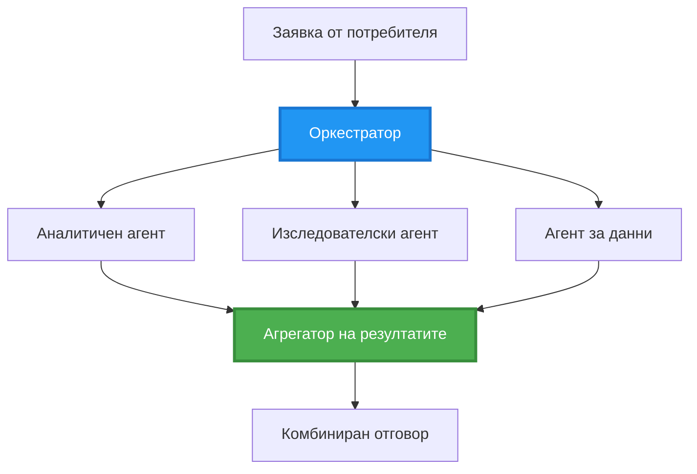
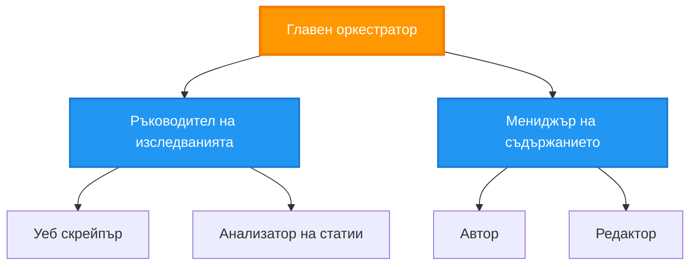
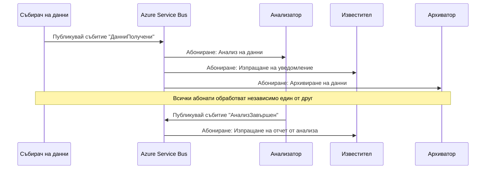
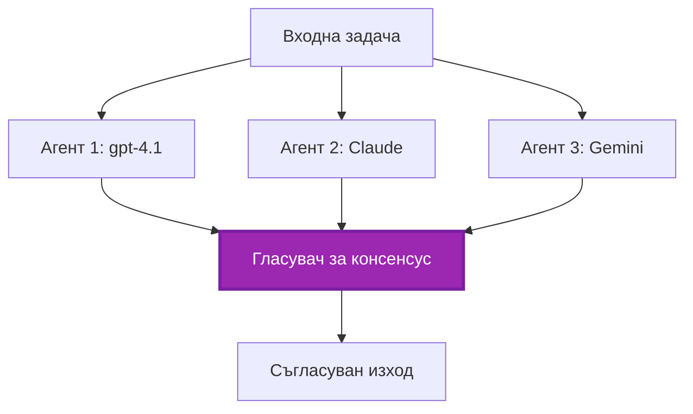
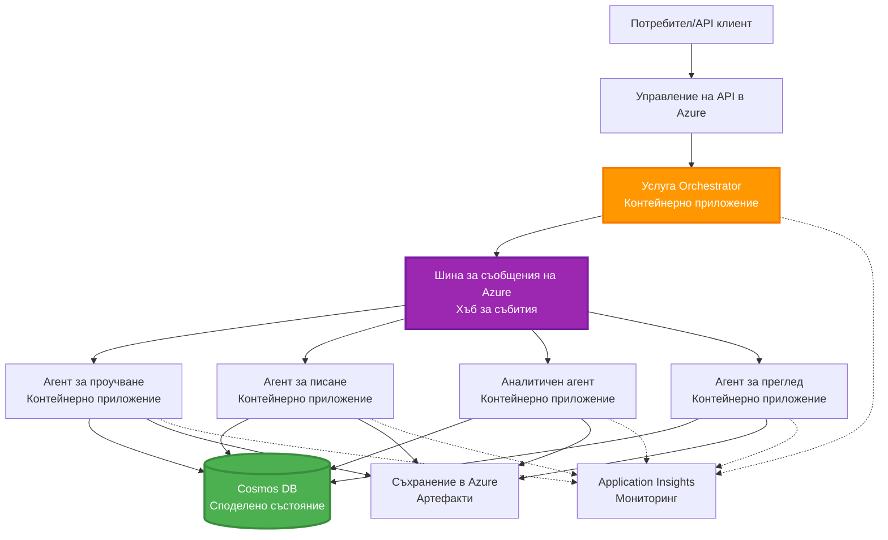

# Модели за координация на многoагентни системи

⏱️ **Прогнозирано време**: 60-75 minutes | 💰 **Оценена цена**: ~$100-300/month | ⭐ **Сложност**: Напреднала

**📚 Учебен път:**
- ← Предишен: [Планиране на капацитет](capacity-planning.md) - Оценка на ресурси и стратегии за скалиране
- 🎯 **Вие сте тук**: Модели за координация на многоагентни системи (оркестрация, комуникация, управление на състоянието)
- → Напред: [Избор на SKU](sku-selection.md) - Избор на подходящите Azure услуги
- 🏠 [Начало на курса](../../README.md)

---

## Какво ще научите

След завършване на този урок, ще:
- Разбирате моделите на **многоагентна архитектура** и кога да ги използвате
- Реализирате **оркестрационни модели** (централизирани, децентрализирани, йерархични)
- Проектирате стратегии за **комуникация между агенти** (синхронна, асинхронна, събитийно-ориентирана)
- Управлявате **споделено състояние** между разпределени агенти
- Разгръщате **многоагентни системи** в Azure с AZD
- Прилагате **координационни модели** в реални AI сценарии
- Наблюдавате и отстранявате грешки в разпределени агентни системи

## Защо координацията на многоагентни системи е важна

### Еволюцията: От единичен агент към многоагентна система

**Единичен агент (Прост):**
```
User → Agent → Response
```
- ✅ Лесен за разбиране и внедряване
- ✅ Бърз за прости задачи
- ❌ Ограничен от възможностите на единичния модел
- ❌ Не може да паралелизира сложни задачи
- ❌ Липсва специализация

**Многоагентна система (Напреднала):**
```mermaid
graph TD
    Orchestrator[Оркестратор] --> Agent1[Агент1<br/>План]
    Orchestrator --> Agent2[Агент2<br/>Код]
    Orchestrator --> Agent3[Агент3<br/>Преглед]
```- ✅ Специализирани агенти за конкретни задачи
- ✅ Паралелно изпълнение за по-висока скорост
- ✅ Модулна и лесна за поддръжка
- ✅ По-добра при сложни работни потоци
- ⚠️ Изисква логика за координация

**Аналогия**: Единичният агент е като един човек, който върши всички задачи. Многоагентната система е като екип, където всеки член има специализирани умения (изследовател, програмист, рецензент, писател), работещи заедно.

---

## Основни модели за координация

### Модел 1: Последователна координация (Верига на отговорност)

**Кога да се използва**: Задачите трябва да се изпълнят в определен ред, всеки агент надгражда върху изхода на предишния.

```mermaid
sequenceDiagram
    participant User
    participant Orchestrator
    participant Agent1 as Изследователски агент
    participant Agent2 as Писателски агент
    participant Agent3 as Редакторски агент
    
    User->>Orchestrator: "Напиши статия за ИИ"
    Orchestrator->>Agent1: Проучи темата
    Agent1-->>Orchestrator: Резултати от проучването
    Orchestrator->>Agent2: Напиши чернова (използвайки проучването)
    Agent2-->>Orchestrator: Чернова на статията
    Orchestrator->>Agent3: Редактирай и подобри
    Agent3-->>Orchestrator: Окончателна статия
    Orchestrator-->>User: Полирана статия
    
    Note over User,Agent3: Последователно: Всеки етап изчаква предишния
```
**Ползи:**
- ✅ Ясен поток на данни
- ✅ Лесно за отстраняване на грешки
- ✅ Предвидим ред на изпълнение

**Ограничения:**
- ❌ По-бавно (без паралелизъм)
- ❌ Една грешка блокира цялата верига
- ❌ Не може да обработва взаимнозависими задачи

**Примери за употреба:**
- Поток за създаване на съдържание (изследване → писане → редакция → публикуване)
- Генериране на код (планиране → имплементация → тест → разгръщане)
- Генериране на отчети (събиране на данни → анализ → визуализация → резюме)

---

### Модел 2: Паралелна координация (Fan-Out/Fan-In)

**Кога да се използва**: Независими задачи могат да се изпълняват едновременно, резултатите се комбинират накрая.


**Ползи:**
- ✅ Бързо (паралелно изпълнение)
- ✅ Толерантност към грешки (частични резултати са приемливи)
- ✅ Мащабируемо хоризонтално

**Ограничения:**
- ⚠️ Резултатите могат да пристигнат в различен ред
- ⚠️ Нужна е логика за агрегиране
- ⚠️ Сложно управление на състоянието

**Примери за употреба:**
- Събиране на данни от множество източници (APIs + бази данни + уеб скрейпинг)
- Конкурентен анализ (няколко модела генерират решения, избира се най-доброто)
- Услуги за превод (превеждане на множество езици едновременно)

---

### Модел 3: Йерархична координация (Мениджър-Работник)

**Кога да се използва**: Сложни работни потоци със подзадачи, нужда от делегиране.


**Ползи:**
- ✅ Справя се със сложни работни потоци
- ✅ Модулна и лесна за поддръжка
- ✅ Ясни граници на отговорност

**Ограничения:**
- ⚠️ По-сложна архитектура
- ⚠️ По-голяма латентност (множество координационни слоеве)
- ⚠️ Изисква по-софистицирана оркестрация

**Примери за употреба:**
- Обработка на корпоративни документи (класифициране → маршрутизиране → обработка → архивиране)
- Многостадийни данни потоци (ингест → почистване → трансформация → анализ → отчет)
- Сложни автоматизационни работни потоци (планиране → разпределение на ресурси → изпълнение → мониторинг)

---

### Модел 4: Събитийно-ориентирана координация (Публикуване-Абониране)

**Кога да се използва**: Агентите трябва да реагират на събития, желателно е слабо свързване.


**Ползи:**
- ✅ Слабо свързване между агентите
- ✅ Лесно добавяне на нови агенти (просто се абонират)
- ✅ Асинхронна обработка
- ✅ Устойчивост (персистентност на съобщения)

**Ограничения:**
- ⚠️ Временна консистентност
- ⚠️ По-сложно отстраняване на грешки
- ⚠️ Предизвикателства с подредбата на съобщенията

**Примери за употреба:**
- Системи за мониторинг в реално време (аларми, табла, логове)
- Многоканални нотификации (имейл, SMS, push, Slack)
- Данни потоци за обработка (няколко потребителя на едни и същи данни)

---

### Модел 5: Координация, базирана на консенсус (Гласуване/Кворум)

**Кога да се използва**: Необходимо е съгласие от множество агенти преди да се продължи.


**Ползи:**
- ✅ По-висока точност (няколко мнения)
- ✅ Толерантност към грешки (приемливи са малцинствени провали)
- ✅ Вградена осигуровка за качество

**Ограничения:**
- ❌ Скъпо (множество извиквания към модели)
- ❌ По-бавно (чакане за всички агенти)
- ⚠️ Нужда от разрешаване на конфликти

**Примери за употреба:**
- Модерация на съдържание (няколко модела преглеждат съдържание)
- Преглед на код (няколко линтера/анализатори)
- Медицинска диагностика (няколко AI модела, експертна валидация)

---

## Преглед на архитектурата

### Пълна многоагентна система в Azure


**Ключови компоненти:**

| Компонент | Предназначение | Услуга в Azure |
|-----------|---------|---------------|
| **API Gateway** | Входна точка, ограничаване на честотата, удостоверяване | API Management |
| **Orchestrator** | Координира работните потоци на агентите | Container Apps |
| **Message Queue** | Асинхронна комуникация | Service Bus / Event Hubs |
| **Agents** | Специализирани AI работници | Container Apps / Functions |
| **State Store** | Споделено състояние, проследяване на задачи | Cosmos DB |
| **Artifact Storage** | Документи, резултати, логове | Blob Storage |
| **Monitoring** | Разпределено проследяване, логове | Application Insights |

---

## Предпоставки

### Необходими инструменти

```bash
# Проверете Azure Developer CLI
azd version
# ✅ Очаква се: azd версия 1.0.0 или по-нова

# Проверете Azure CLI
az --version
# ✅ Очаква се: azure-cli 2.50.0 или по-нова

# Проверете Docker (за локално тестване)
docker --version
# ✅ Очаква се: Docker версия 20.10 или по-нова
```

### Изисквания за Azure

- Активен абонамент в Azure
- Права за създаване на:
  - Container Apps
  - Service Bus namespaces
  - Cosmos DB accounts
  - Storage accounts
  - Application Insights

### Необходими познания

Трябва да сте завършили:
- [Управление на конфигурацията](../chapter-03-configuration/configuration.md)
- [Аутентикация & Сигурност](../chapter-03-configuration/authsecurity.md)
- [Пример за микросервизи](../../../../examples/microservices)

---

## Ръководство за изпълнение

### Структура на проекта

```
multi-agent-system/
├── azure.yaml                    # AZD configuration
├── infra/
│   ├── main.bicep               # Main infrastructure
│   ├── core/
│   │   ├── servicebus.bicep     # Message queue
│   │   ├── cosmos.bicep         # State store
│   │   ├── storage.bicep        # Artifact storage
│   │   └── monitoring.bicep     # Application Insights
│   └── app/
│       ├── orchestrator.bicep   # Orchestrator service
│       └── agent.bicep          # Agent template
└── src/
    ├── orchestrator/            # Orchestration logic
    │   ├── app.py
    │   ├── workflows.py
    │   └── Dockerfile
    ├── agents/
    │   ├── research/            # Research agent
    │   ├── writer/              # Writer agent
    │   ├── analyst/             # Analyst agent
    │   └── reviewer/            # Reviewer agent
    └── shared/
        ├── state_manager.py     # Shared state logic
        └── message_handler.py   # Message handling
```

---

## Урок 1: Модел на последователна координация

### Имплементация: Поток за създаване на съдържание

Нека изградим последователен поток: Изследване → Писане → Редакция → Публикуване

### 1. Конфигурация на AZD

**Файл: `azure.yaml`**

```yaml
name: content-pipeline
metadata:
  template: multi-agent-sequential@1.0.0

services:
  orchestrator:
    project: ./src/orchestrator
    language: python
    host: containerapp
  
  research-agent:
    project: ./src/agents/research
    language: python
    host: containerapp
  
  writer-agent:
    project: ./src/agents/writer
    language: python
    host: containerapp
  
  editor-agent:
    project: ./src/agents/editor
    language: python
    host: containerapp
```

### 2. Инфраструктура: Service Bus за координация

**Файл: `infra/core/servicebus.bicep`**

```bicep
param name string
param location string
param tags object = {}

resource serviceBusNamespace 'Microsoft.ServiceBus/namespaces@2022-10-01-preview' = {
  name: name
  location: location
  tags: tags
  sku: {
    name: 'Standard'
    tier: 'Standard'
  }
  properties: {
    minimumTlsVersion: '1.2'
  }
}

// Queue for orchestrator → research agent
resource researchQueue 'Microsoft.ServiceBus/namespaces/queues@2022-10-01-preview' = {
  parent: serviceBusNamespace
  name: 'research-tasks'
  properties: {
    maxDeliveryCount: 3
    lockDuration: 'PT5M'
    deadLetteringOnMessageExpiration: true
  }
}

// Queue for research agent → writer agent
resource writerQueue 'Microsoft.ServiceBus/namespaces/queues@2022-10-01-preview' = {
  parent: serviceBusNamespace
  name: 'writer-tasks'
  properties: {
    maxDeliveryCount: 3
    lockDuration: 'PT5M'
  }
}

// Queue for writer agent → editor agent
resource editorQueue 'Microsoft.ServiceBus/namespaces/queues@2022-10-01-preview' = {
  parent: serviceBusNamespace
  name: 'editor-tasks'
  properties: {
    maxDeliveryCount: 3
    lockDuration: 'PT5M'
  }
}

output namespace string = serviceBusNamespace.name
output connectionString string = listKeys('${serviceBusNamespace.id}/AuthorizationRules/RootManageSharedAccessKey', serviceBusNamespace.apiVersion).primaryConnectionString
```

### 3. Мениджър на споделено състояние

**Файл: `src/shared/state_manager.py`**

```python
from azure.cosmos import CosmosClient, PartitionKey
from datetime import datetime
import os

class StateManager:
    """Manages shared state across agents using Cosmos DB"""
    
    def __init__(self):
        endpoint = os.environ['COSMOS_ENDPOINT']
        key = os.environ['COSMOS_KEY']
        
        self.client = CosmosClient(endpoint, key)
        self.database = self.client.get_database_client('agent-state')
        self.container = self.database.get_container_client('tasks')
    
    def create_task(self, task_id: str, task_type: str, input_data: dict):
        """Create a new task"""
        task = {
            'id': task_id,
            'type': task_type,
            'status': 'pending',
            'input': input_data,
            'created_at': datetime.utcnow().isoformat(),
            'steps': []
        }
        self.container.create_item(task)
        return task
    
    def update_task_step(self, task_id: str, step_name: str, result: dict):
        """Update task with completed step"""
        task = self.container.read_item(task_id, partition_key=task_id)
        
        task['steps'].append({
            'name': step_name,
            'completed_at': datetime.utcnow().isoformat(),
            'result': result
        })
        
        self.container.replace_item(task_id, task)
        return task
    
    def complete_task(self, task_id: str, final_result: dict):
        """Mark task as complete"""
        task = self.container.read_item(task_id, partition_key=task_id)
        task['status'] = 'completed'
        task['result'] = final_result
        task['completed_at'] = datetime.utcnow().isoformat()
        self.container.replace_item(task_id, task)
        return task
    
    def get_task(self, task_id: str):
        """Retrieve task state"""
        return self.container.read_item(task_id, partition_key=task_id)
```

### 4. Оркестратор услуга

**Файл: `src/orchestrator/app.py`**

```python
from flask import Flask, request, jsonify
from azure.servicebus import ServiceBusClient, ServiceBusMessage
import json
import uuid
import os
from shared.state_manager import StateManager

app = Flask(__name__)
state_manager = StateManager()

# Връзка към Service Bus
servicebus_connection_str = os.environ['SERVICEBUS_CONNECTION_STRING']
servicebus_client = ServiceBusClient.from_connection_string(servicebus_connection_str)

@app.route('/health', methods=['GET'])
def health():
    return jsonify({'status': 'healthy', 'service': 'orchestrator'})

@app.route('/create-content', methods=['POST'])
def create_content():
    """
    Sequential workflow: Research → Write → Edit → Publish
    """
    data = request.json
    topic = data.get('topic')
    
    if not topic:
        return jsonify({'error': 'Topic required'}), 400
    
    # Създаване на задача в хранилището за състояния
    task_id = str(uuid.uuid4())
    task = state_manager.create_task(
        task_id=task_id,
        task_type='content_creation',
        input_data={'topic': topic}
    )
    
    # Изпращане на съобщение до изследователски агент (първа стъпка)
    sender = servicebus_client.get_queue_sender('research-tasks')
    message = ServiceBusMessage(
        body=json.dumps({
            'task_id': task_id,
            'topic': topic,
            'next_queue': 'writer-tasks'  # Къде да се изпращат резултатите
        }),
        content_type='application/json'
    )
    
    with sender:
        sender.send_messages(message)
    
    return jsonify({
        'task_id': task_id,
        'status': 'started',
        'workflow': 'sequential',
        'steps': ['research', 'write', 'edit', 'publish'],
        'message': 'Content creation pipeline initiated'
    }), 202

@app.route('/task/<task_id>', methods=['GET'])
def get_task_status(task_id):
    """Check task status"""
    try:
        task = state_manager.get_task(task_id)
        return jsonify(task)
    except Exception as e:
        return jsonify({'error': str(e)}), 404

if __name__ == '__main__':
    app.run(host='0.0.0.0', port=8080)
```

### 5. Агент за изследване

**Файл: `src/agents/research/app.py`**

```python
from azure.servicebus import ServiceBusClient, ServiceBusMessage
from openai import AzureOpenAI
import json
import os
import time
from shared.state_manager import StateManager

# Инициализиране на клиенти
state_manager = StateManager()
servicebus_client = ServiceBusClient.from_connection_string(
    os.environ['SERVICEBUS_CONNECTION_STRING']
)

openai_client = AzureOpenAI(
    api_key=os.environ['AZURE_OPENAI_API_KEY'],
    api_version="2024-02-01",
    azure_endpoint=os.environ['AZURE_OPENAI_ENDPOINT']
)

def process_research_task(message_data):
    """Process research request and pass to writer"""
    task_id = message_data['task_id']
    topic = message_data['topic']
    next_queue = message_data['next_queue']
    
    print(f"🔬 Researching: {topic}")
    
    # Извикване на Microsoft Foundry Models за проучване
    response = openai_client.chat.completions.create(
        model="gpt-4.1",
        messages=[
            {"role": "system", "content": "You are a research assistant. Provide comprehensive research on the given topic."},
            {"role": "user", "content": f"Research this topic thoroughly: {topic}"}
        ],
        max_tokens=1500
    )
    
    research_results = response.choices[0].message.content
    
    # Актуализиране на състоянието
    state_manager.update_task_step(
        task_id=task_id,
        step_name='research',
        result={'research': research_results}
    )
    
    # Изпращане към следващия агент (писател)
    sender = servicebus_client.get_queue_sender(next_queue)
    message = ServiceBusMessage(
        body=json.dumps({
            'task_id': task_id,
            'topic': topic,
            'research': research_results,
            'next_queue': 'editor-tasks'
        }),
        content_type='application/json'
    )
    
    with sender:
        sender.send_messages(message)
    
    print(f"✅ Research complete for task {task_id}")

def main():
    """Listen to research queue"""
    receiver = servicebus_client.get_queue_receiver('research-tasks')
    
    print("🔬 Research Agent started, listening for tasks...")
    
    with receiver:
        while True:
            messages = receiver.receive_messages(max_wait_time=5)
            for message in messages:
                try:
                    message_data = json.loads(str(message))
                    process_research_task(message_data)
                    receiver.complete_message(message)
                except Exception as e:
                    print(f"❌ Error processing message: {e}")
                    receiver.abandon_message(message)

if __name__ == '__main__':
    main()
```

### 6. Агент писател

**Файл: `src/agents/writer/app.py`**

```python
from azure.servicebus import ServiceBusClient, ServiceBusMessage
from openai import AzureOpenAI
import json
import os
from shared.state_manager import StateManager

state_manager = StateManager()
servicebus_client = ServiceBusClient.from_connection_string(
    os.environ['SERVICEBUS_CONNECTION_STRING']
)

openai_client = AzureOpenAI(
    api_key=os.environ['AZURE_OPENAI_API_KEY'],
    api_version="2024-02-01",
    azure_endpoint=os.environ['AZURE_OPENAI_ENDPOINT']
)

def process_writing_task(message_data):
    """Write article based on research"""
    task_id = message_data['task_id']
    topic = message_data['topic']
    research = message_data['research']
    next_queue = message_data['next_queue']
    
    print(f"✍️ Writing article: {topic}")
    
    # Извикайте Microsoft Foundry Models, за да се напише статия
    response = openai_client.chat.completions.create(
        model="gpt-4.1",
        messages=[
            {"role": "system", "content": "You are a professional writer. Write engaging, well-structured articles."},
            {"role": "user", "content": f"Based on this research:\n\n{research}\n\nWrite a comprehensive article about: {topic}"}
        ],
        max_tokens=2000
    )
    
    article_draft = response.choices[0].message.content
    
    # Актуализирайте състоянието
    state_manager.update_task_step(
        task_id=task_id,
        step_name='writing',
        result={'draft': article_draft}
    )
    
    # Изпратете на редактора
    sender = servicebus_client.get_queue_sender(next_queue)
    message = ServiceBusMessage(
        body=json.dumps({
            'task_id': task_id,
            'topic': topic,
            'draft': article_draft
        }),
        content_type='application/json'
    )
    
    with sender:
        sender.send_messages(message)
    
    print(f"✅ Article draft complete for task {task_id}")

def main():
    """Listen to writer queue"""
    receiver = servicebus_client.get_queue_receiver('writer-tasks')
    
    print("✍️ Writer Agent started, listening for tasks...")
    
    with receiver:
        while True:
            messages = receiver.receive_messages(max_wait_time=5)
            for message in messages:
                try:
                    message_data = json.loads(str(message))
                    process_writing_task(message_data)
                    receiver.complete_message(message)
                except Exception as e:
                    print(f"❌ Error: {e}")
                    receiver.abandon_message(message)

if __name__ == '__main__':
    main()
```

### 7. Агент редактор

**Файл: `src/agents/editor/app.py`**

```python
from azure.servicebus import ServiceBusClient
from openai import AzureOpenAI
import json
import os
from shared.state_manager import StateManager

state_manager = StateManager()
servicebus_client = ServiceBusClient.from_connection_string(
    os.environ['SERVICEBUS_CONNECTION_STRING']
)

openai_client = AzureOpenAI(
    api_key=os.environ['AZURE_OPENAI_API_KEY'],
    api_version="2024-02-01",
    azure_endpoint=os.environ['AZURE_OPENAI_ENDPOINT']
)

def process_editing_task(message_data):
    """Edit and finalize article"""
    task_id = message_data['task_id']
    topic = message_data['topic']
    draft = message_data['draft']
    
    print(f"📝 Editing article: {topic}")
    
    # Извикайте Microsoft Foundry Models за редактиране
    response = openai_client.chat.completions.create(
        model="gpt-4.1",
        messages=[
            {"role": "system", "content": "You are an expert editor. Improve grammar, clarity, and structure."},
            {"role": "user", "content": f"Edit and improve this article:\n\n{draft}"}
        ],
        max_tokens=2000
    )
    
    final_article = response.choices[0].message.content
    
    # Маркирайте задачата като завършена
    state_manager.complete_task(
        task_id=task_id,
        final_result={
            'topic': topic,
            'final_article': final_article,
            'word_count': len(final_article.split())
        }
    )
    
    print(f"✅ Article finalized for task {task_id}")

def main():
    """Listen to editor queue"""
    receiver = servicebus_client.get_queue_receiver('editor-tasks')
    
    print("📝 Editor Agent started, listening for tasks...")
    
    with receiver:
        while True:
            messages = receiver.receive_messages(max_wait_time=5)
            for message in messages:
                try:
                    message_data = json.loads(str(message))
                    process_editing_task(message_data)
                    receiver.complete_message(message)
                except Exception as e:
                    print(f"❌ Error: {e}")
                    receiver.abandon_message(message)

if __name__ == '__main__':
    main()
```

### 8. Разгръщане и тестване

```bash
# Опция A: Разгръщане, базирано на шаблон
azd init
azd up

# Опция B: Разгръщане на агентски манифест (изисква разширение)
azd extension install azure.ai.agents
azd ai agent init -m agent-manifest.yaml
azd up
```

> Вижте [AZD AI CLI команди](../chapter-08-production/production-ai-practices.md#azd-ai-cli-commands-and-extensions) за всички флагове и опции на `azd ai`.

```bash
# Вземи URL на оркестратора
ORCHESTRATOR_URL=$(azd env get-values | grep ORCHESTRATOR_URL | cut -d '=' -f2 | tr -d '"')

# Създай съдържание
curl -X POST $ORCHESTRATOR_URL/create-content \
  -H "Content-Type: application/json" \
  -d '{"topic": "The Future of AI in Healthcare"}'
```

**✅ Очакван изход:**
```json
{
  "task_id": "a1b2c3d4-e5f6-7890-abcd-ef1234567890",
  "status": "started",
  "workflow": "sequential",
  "steps": ["research", "write", "edit", "publish"],
  "message": "Content creation pipeline initiated"
}
```

**Проверете прогреса на задачата:**
```bash
TASK_ID="a1b2c3d4-e5f6-7890-abcd-ef1234567890"
curl $ORCHESTRATOR_URL/task/$TASK_ID
```

**✅ Очакван изход (завършено):**
```json
{
  "id": "a1b2c3d4-e5f6-7890-abcd-ef1234567890",
  "type": "content_creation",
  "status": "completed",
  "steps": [
    {
      "name": "research",
      "completed_at": "2025-11-19T10:30:00Z",
      "result": {"research": "..."}
    },
    {
      "name": "writing",
      "completed_at": "2025-11-19T10:32:00Z",
      "result": {"draft": "..."}
    }
  ],
  "result": {
    "topic": "The Future of AI in Healthcare",
    "final_article": "...",
    "word_count": 1500
  }
}
```

---

## Урок 2: Модел на паралелна координация

### Имплементация: Агрегатор за мулти-източниково изследване

Нека изградим паралелна система, която събира информация от множество източници едновременно.

### Паралелен оркестратор

**Файл: `src/orchestrator/parallel_workflow.py`**

```python
from flask import Flask, request, jsonify
from azure.servicebus import ServiceBusClient, ServiceBusMessage
import json
import uuid
import os
from shared.state_manager import StateManager

app = Flask(__name__)
state_manager = StateManager()

servicebus_client = ServiceBusClient.from_connection_string(
    os.environ['SERVICEBUS_CONNECTION_STRING']
)

@app.route('/research-parallel', methods=['POST'])
def research_parallel():
    """
    Parallel workflow: Multiple agents work simultaneously
    """
    data = request.json
    query = data.get('query')
    
    task_id = str(uuid.uuid4())
    task = state_manager.create_task(
        task_id=task_id,
        task_type='parallel_research',
        input_data={
            'query': query,
            'agents': ['web', 'academic', 'news', 'social']
        }
    )
    
    # Разклоняване: Изпратете до всички агенти едновременно
    agents = [
        ('web-research-queue', 'web'),
        ('academic-research-queue', 'academic'),
        ('news-research-queue', 'news'),
        ('social-research-queue', 'social')
    ]
    
    for queue_name, agent_type in agents:
        sender = servicebus_client.get_queue_sender(queue_name)
        message = ServiceBusMessage(
            body=json.dumps({
                'task_id': task_id,
                'query': query,
                'agent_type': agent_type,
                'result_queue': 'aggregation-queue'
            }),
            content_type='application/json'
        )
        
        with sender:
            sender.send_messages(message)
    
    return jsonify({
        'task_id': task_id,
        'status': 'started',
        'workflow': 'parallel',
        'agents_dispatched': 4,
        'message': 'Parallel research initiated'
    }), 202

if __name__ == '__main__':
    app.run(host='0.0.0.0', port=8080)
```

### Логика за агрегиране

**Файл: `src/agents/aggregator/app.py`**

```python
from azure.servicebus import ServiceBusClient
import json
import os
from collections import defaultdict
from shared.state_manager import StateManager

state_manager = StateManager()
servicebus_client = ServiceBusClient.from_connection_string(
    os.environ['SERVICEBUS_CONNECTION_STRING']
)

# Проследявайте резултатите за всяка задача
task_results = defaultdict(list)
expected_agents = 4  # уеб, академичен, новинарски, социален

def process_result(message_data):
    """Aggregate results from parallel agents"""
    task_id = message_data['task_id']
    agent_type = message_data['agent_type']
    result = message_data['result']
    
    # Запиши резултата
    task_results[task_id].append({
        'agent': agent_type,
        'data': result
    })
    
    print(f"📊 Received result from {agent_type} agent ({len(task_results[task_id])}/{expected_agents})")
    
    # Провери дали всички агенти са завършили (fan-in)
    if len(task_results[task_id]) == expected_agents:
        print(f"✅ All agents completed for task {task_id}. Aggregating...")
        
        # Комбинирай резултатите
        aggregated = {
            'query': message_data['query'],
            'sources': task_results[task_id],
            'summary': generate_summary(task_results[task_id])
        }
        
        # Отбележи като завършено
        state_manager.complete_task(task_id, aggregated)
        
        # Почисти
        del task_results[task_id]
        
        print(f"✅ Aggregation complete for task {task_id}")

def generate_summary(results):
    """Generate summary from all sources"""
    summaries = [r['data'].get('summary', '') for r in results]
    return '\n\n'.join(summaries)

def main():
    """Listen to aggregation queue"""
    receiver = servicebus_client.get_queue_receiver('aggregation-queue')
    
    print("📊 Aggregator started, listening for results...")
    
    with receiver:
        while True:
            messages = receiver.receive_messages(max_wait_time=5)
            for message in messages:
                try:
                    message_data = json.loads(str(message))
                    process_result(message_data)
                    receiver.complete_message(message)
                except Exception as e:
                    print(f"❌ Error: {e}")
                    receiver.abandon_message(message)

if __name__ == '__main__':
    main()
```

**Ползи от паралелния модел:**
- ⚡ **4x по-бързо** (агентите работят едновременно)
- 🔄 **Толерантен към грешки** (частични резултати са приемливи)
- 📈 **Мащабируем** (лесно добавяне на още агенти)

---

## Практически упражнения

### Упражнение 1: Добавяне на обработка на таймаут ⭐⭐ (Средно)

**Цел**: Реализирайте логика за таймаут, така че агрегаторът да не чака вечно за бавни агенти.

**Стъпки**:

1. **Добавете проследяване на таймаути в агрегатора:**

```python
from datetime import datetime, timedelta

task_timeouts = {}  # task_id -> време на изтичане

def process_result(message_data):
    task_id = message_data['task_id']
    
    # Задаване на таймаут за първия резултат
    if task_id not in task_timeouts:
        task_timeouts[task_id] = datetime.utcnow() + timedelta(seconds=30)
    
    task_results[task_id].append({
        'agent': message_data['agent_type'],
        'data': message_data['result']
    })
    
    # Проверка дали е завършено ИЛИ е изтекло времето
    if len(task_results[task_id]) == expected_agents or \
       datetime.utcnow() > task_timeouts[task_id]:
        
        print(f"📊 Aggregating with {len(task_results[task_id])}/{expected_agents} results")
        
        aggregated = {
            'query': message_data['query'],
            'sources': task_results[task_id],
            'completed_agents': len(task_results[task_id]),
            'timed_out': len(task_results[task_id]) < expected_agents
        }
        
        state_manager.complete_task(task_id, aggregated)
        
        # Почистване
        del task_results[task_id]
        del task_timeouts[task_id]
```

2. **Тествайте с изкуствени забавяния:**

```python
# При един агент добавете забавяне, за да симулирате бавно обработване
import time
time.sleep(35)  # Превишава 30-секунден таймаут
```

3. **Разгърнете и проверете:**

```bash
azd deploy aggregator

# Подай задачата
curl -X POST $ORCHESTRATOR_URL/research-parallel \
  -H "Content-Type: application/json" \
  -d '{"query": "AI safety research"}'

# Провери резултатите след 30 секунди
curl $ORCHESTRATOR_URL/task/$TASK_ID
```

**✅ Критерии за успех:**
- ✅ Задачата завършва след 30 секунди, дори ако агенти са непълни
- ✅ Отговорът показва частични резултати (`"timed_out": true`)
- ✅ Наличните резултати се връщат (3 от 4 агента)

**Време**: 20-25 минути

---

### Упражнение 2: Реализиране на логика за повторни опити ⭐⭐⭐ (Напреднало)

**Цел**: Автоматично повтаряне на неуспешни задачи на агентите преди да се откаже.

**Стъпки**:

1. **Добавете проследяване на повторни опити в оркестратора:**

```python
from dataclasses import dataclass
from typing import Dict

@dataclass
class RetryConfig:
    max_retries: int = 3
    backoff_seconds: int = 5

retry_counts: Dict[str, int] = {}  # идентификатор_на_съобщение -> брой_опити

def send_with_retry(queue_name: str, message_data: dict, retry_config: RetryConfig):
    """Send message with retry metadata"""
    message_id = message_data.get('message_id', str(uuid.uuid4()))
    message_data['message_id'] = message_id
    message_data['retry_count'] = retry_counts.get(message_id, 0)
    message_data['max_retries'] = retry_config.max_retries
    
    sender = servicebus_client.get_queue_sender(queue_name)
    message = ServiceBusMessage(
        body=json.dumps(message_data),
        content_type='application/json',
        message_id=message_id
    )
    
    with sender:
        sender.send_messages(message)
```

2. **Добавете обработчик за повторни опити в агентите:**

```python
def process_with_retry(message, receiver, process_func):
    """Process message with automatic retry on failure"""
    try:
        message_data = json.loads(str(message))
        
        # Обработи съобщението
        process_func(message_data)
        
        # Успешно - завършено
        receiver.complete_message(message)
        
    except Exception as e:
        message_id = message.message_id
        retry_count = message_data.get('retry_count', 0)
        max_retries = message_data.get('max_retries', 3)
        
        if retry_count < max_retries:
            # Опитай отново: откажи и постави отново в опашката с увеличен брояч
            print(f"⚠️ Retry {retry_count + 1}/{max_retries} for message {message_id}")
            
            message_data['retry_count'] = retry_count + 1
            
            # Изпрати обратно в същата опашка със забавяне
            time.sleep(5 * (retry_count + 1))  # Експоненциално забавяне
            send_with_retry(queue_name, message_data, RetryConfig())
            
            receiver.complete_message(message)  # Премахни оригинала
        else:
            # Максималният брой опити е превишен - премести в опашката за неуспешни съобщения
            print(f"❌ Max retries exceeded for message {message_id}")
            receiver.dead_letter_message(
                message,
                reason="MaxRetriesExceeded",
                error_description=str(e)
            )
```

3. **Монтирайте dead letter опашката:**

```python
def monitor_dead_letters():
    """Check dead letter queue for failed messages"""
    receiver = servicebus_client.get_queue_receiver(
        'research-queue',
        sub_queue='deadletter'
    )
    
    with receiver:
        messages = receiver.receive_messages(max_wait_time=5)
        for message in messages:
            print(f"☠️ Dead letter: {message.message_id}")
            print(f"Reason: {message.dead_letter_reason}")
            print(f"Description: {message.dead_letter_error_description}")
```

**✅ Критерии за успех:**
- ✅ Неуспешните задачи се повтарят автоматично (до 3 пъти)
- ✅ Експоненциално отлагане между повторните опити (5s, 10s, 15s)
- ✅ След достигане на максимум повторни опити, съобщенията отиват в dead letter опашка
- ✅ Dead letter опашката може да се наблюдава и повторно пуска

**Време**: 30-40 минути

---

### Упражнение 3: Реализиране на Circuit Breaker ⭐⭐⭐ (Напреднало)

**Цел**: Предотвратяване на каскадни повреди чрез спиране на заявките към неуспешни агенти.

**Стъпки**:

1. **Създайте клас за circuit breaker:**

```python
from enum import Enum
from datetime import datetime, timedelta

class CircuitState(Enum):
    CLOSED = "closed"      # Нормална работа
    OPEN = "open"          # Грешка, отхвърляне на заявки
    HALF_OPEN = "half_open"  # Тестване дали е възстановен

class CircuitBreaker:
    def __init__(self, failure_threshold=5, timeout_seconds=60):
        self.failure_threshold = failure_threshold
        self.timeout_seconds = timeout_seconds
        self.failure_count = 0
        self.last_failure_time = None
        self.state = CircuitState.CLOSED
    
    def call(self, func):
        """Execute function with circuit breaker protection"""
        if self.state == CircuitState.OPEN:
            # Провери дали таймаутът е изтекъл
            if datetime.utcnow() - self.last_failure_time > timedelta(seconds=self.timeout_seconds):
                self.state = CircuitState.HALF_OPEN
                print("🔄 Circuit breaker: HALF_OPEN (testing)")
            else:
                raise Exception(f"Circuit breaker OPEN for agent. Try again in {self.timeout_seconds}s")
        
        try:
            result = func()
            
            # Успех
            if self.state == CircuitState.HALF_OPEN:
                self.state = CircuitState.CLOSED
                self.failure_count = 0
                print("✅ Circuit breaker: CLOSED (recovered)")
            
            return result
            
        except Exception as e:
            self.failure_count += 1
            self.last_failure_time = datetime.utcnow()
            
            if self.failure_count >= self.failure_threshold:
                self.state = CircuitState.OPEN
                print(f"🔴 Circuit breaker: OPEN (too many failures)")
            
            raise e
```

2. **Приложете към извикванията на агентите:**

```python
# В оркестратора
agent_circuits = {
    'web': CircuitBreaker(failure_threshold=5, timeout_seconds=60),
    'academic': CircuitBreaker(failure_threshold=5, timeout_seconds=60),
    'news': CircuitBreaker(failure_threshold=5, timeout_seconds=60),
    'social': CircuitBreaker(failure_threshold=5, timeout_seconds=60)
}

def send_to_agent(agent_type, message_data):
    """Send with circuit breaker protection"""
    circuit = agent_circuits[agent_type]
    
    try:
        circuit.call(lambda: send_message(agent_type, message_data))
    except Exception as e:
        print(f"⚠️ Skipping {agent_type} agent: {e}")
        # Продължете с другите агенти
```

3. **Тествайте circuit breaker:**

```bash
# Симулирайте повтарящи се откази (спрете един агент)
az containerapp stop --name web-research-agent --resource-group rg-agents

# Изпратете множество заявки
for i in {1..10}; do
  curl -X POST $ORCHESTRATOR_URL/research-parallel \
    -H "Content-Type: application/json" \
    -d '{"query": "test query '$i'"}'
  sleep 2
done

# Проверете логовете - трябва да видите, че верижният прекъсвач е отворен след 5 отказа
# Използвайте Azure CLI за логовете на Container App:
az containerapp logs show --name orchestrator --resource-group $RG_NAME --tail 50
```

**✅ Критерии за успех:**
- ✅ След 5 неуспеха, прекъсвачът се отваря (отхвърля заявки)
- ✅ След 60 секунди, прекъсвачът става полуотворен (тества възстановяването)
- ✅ Останалите агенти продължават да работят нормално
- ✅ Прекъсвачът се затваря автоматично, когато агентът се възстанови

**Време**: 40-50 минути

---

## Мониторинг и отстраняване на грешки

### Разпределено проследяване с Application Insights

**Файл: `src/shared/tracing.py`**

```python
from opencensus.ext.azure.log_exporter import AzureLogHandler
from opencensus.ext.azure.trace_exporter import AzureExporter
from opencensus.trace import config_integration
from opencensus.trace.tracer import Tracer
from opencensus.trace.samplers import AlwaysOnSampler
import logging
import os

# Конфигуриране на проследяване
config_integration.trace_integrations(['requests', 'logging'])

connection_string = os.environ.get('APPLICATIONINSIGHTS_CONNECTION_STRING')

# Създаване на проследител
tracer = Tracer(
    exporter=AzureExporter(connection_string=connection_string),
    sampler=AlwaysOnSampler()
)

# Конфигуриране на логиране
logger = logging.getLogger(__name__)
logger.addHandler(AzureLogHandler(connection_string=connection_string))
logger.setLevel(logging.INFO)

def trace_agent_call(agent_name, task_id, operation):
    """Trace agent operations"""
    with tracer.span(name=f'{agent_name}.{operation}') as span:
        span.add_attribute('agent', agent_name)
        span.add_attribute('task_id', task_id)
        span.add_attribute('operation', operation)
        
        try:
            result = operation()
            span.add_attribute('status', 'success')
            return result
        except Exception as e:
            span.add_attribute('status', 'error')
            span.add_attribute('error', str(e))
            raise
```

### Запитвания в Application Insights

**Проследяване на работни потоци на многоагентни системи:**

```kusto
// Trace complete workflow for a task
traces
| where customDimensions.task_id == "a1b2c3d4-..."
| project timestamp, message, customDimensions.agent, customDimensions.operation
| order by timestamp asc
```

**Сравнение на производителността на агентите:**

```kusto
// Compare agent execution times
dependencies
| where name contains "agent"
| summarize 
    avg_duration = avg(duration),
    p95_duration = percentile(duration, 95),
    count = count()
  by agent = tostring(customDimensions.agent)
| order by avg_duration desc
```

**Анализ на неизправности:**

```kusto
// Find which agents fail most
exceptions
| where customDimensions.agent != ""
| summarize 
    failure_count = count(),
    unique_errors = dcount(outerMessage)
  by agent = tostring(customDimensions.agent)
| order by failure_count desc
```

---

## Анализ на разходи

### Разходи за многоагентна система (месечни оценки)

| Component | Configuration | Cost |
|-----------|--------------|------|
| **Orchestrator** | 1 Container App (1 vCPU, 2GB) | $30-50 |
| **4 Agents** | 4 Container Apps (0.5 vCPU, 1GB each) | $60-120 |
| **Service Bus** | Standard tier, 10M messages | $10-20 |
| **Cosmos DB** | Serverless, 5GB storage, 1M RUs | $25-50 |
| **Blob Storage** | 10GB storage, 100K operations | $5-10 |
| **Application Insights** | 5GB ingestion | $10-15 |
| **Microsoft Foundry Models** | gpt-4.1, 10M tokens | $100-300 |
| **Total** | | **$240-565/month** |

### Стратегии за оптимизация на разходите

1. **Използвайте serverless, когато е възможно:**
   ```bicep
   // Cosmos DB serverless (no minimum cost)
   properties: {
     databaseAccountOfferType: 'Standard'
     capabilities: [{ name: 'EnableServerless' }]
   }
   ```

2. **Мащабирайте агентите до нула, когато са неактивни:**
   ```bicep
   scale: {
     minReplicas: 0  // Scale to zero when no messages
     maxReplicas: 10
   }
   ```

3. **Използвайте пакетна обработка за Service Bus:**
   ```python
   # Изпращайте съобщения в пакети (по-евтино)
   sender.send_messages([message1, message2, message3])
   ```

4. **Кеширайте често използваните резултати:**
   ```python
   # Използвайте Azure Cache за Redis
   if cache.exists(query_hash):
       return cache.get(query_hash)
   ```

---

## Най-добри практики

### ✅ НАПРАВЕТЕ:

1. **Използвайте идемпотентни операции**
   ```python
   # Агентът може безопасно да обработва едно и също съобщение многократно
   def process_task(task_id):
       if state_manager.task_exists(task_id):
           print(f"Task {task_id} already processed, skipping")
           return
       # Обработва задача...
   ```

2. **Реализирайте изчерпателно логване**
   ```python
   logger.info(f"Agent: {agent_name}, Task: {task_id}, Action: {action}")
   ```

3. **Използвайте идентификатори за корелация**
   ```python
   # Прехвърлете task_id през целия работен поток
   message_data = {
       'task_id': task_id,  # Идентификатор за корелация
       'timestamp': datetime.utcnow().isoformat()
   }
   ```

4. **Задайте TTL (време на живот) на съобщенията**
   ```bicep
   properties: {
     defaultMessageTimeToLive: 'PT1H'  // 1 hour max
   }
   ```

5. **Наблюдавайте dead letter опашките**
   ```python
   # Редовно наблюдение на неуспешни съобщения
   monitor_dead_letters()
   ```

### ❌ НЕ ПРАВЕТЕ:

1. **Не създавайте кръгови зависимости**
   ```python
   # ❌ ЛОШО: Агент A → Агент B → Агент A (безкраен цикъл)
   # ✅ ДОБРО: Дефинирайте ясен насочен ацикличен граф (DAG)
   ```

2. **Не блокирайте нишките на агентите**
   ```python
   # ❌ ЛОШО: Синхронно изчакване
   while not task_complete:
       time.sleep(1)
   
   # ✅ ДОБРО: Използвайте обратни повиквания от опашката за съобщения
   ```

3. **Не игнорирайте частичните неуспехи**
   ```python
   # ❌ ЛОШО: Провал на целия работен процес, ако един от агентите се провали
   # ✅ ДОБРО: Връщане на частични резултати с индикатори за грешки
   ```

4. **Не използвайте безкрайни повторни опити**
   ```python
   # ❌ ЛОШО: повтаря се безкрайно
   # ✅ ДОБРО: max_retries = 3, след това в опашка за мъртви писма
   ```

---

## Ръководство за отстраняване на неизправности

### Проблем: Съобщения заседнали в опашката

**Симптоми:**
- Съобщенията се натрупват в опашката
- Агентите не обработват
- Състоянието на задачата е заседнало на "pending"

**Диагноза:**
```bash
# Проверете дълбочината на опашката
az servicebus queue show \
  --namespace-name mybus \
  --name research-tasks \
  --query "countDetails"

# Проверете логовете на агента, използвайки Azure CLI
az containerapp logs show --name research-agent --resource-group $RG_NAME --tail 50
```

**Решения:**

1. **Увеличете броя на репликите на агентите:**
   ```bash
   az containerapp update \
     --name research-agent \
     --min-replicas 3 \
     --max-replicas 10
   ```

2. **Проверете dead-letter опашката:**
   ```bash
   az servicebus queue show \
     --namespace-name mybus \
     --name research-tasks \
     --query "countDetails.deadLetterMessageCount"
   ```

---

### Проблем: Таймаут на задача/никога не се завършва

**Симптоми:**
- Състоянието на задачата остава "in_progress"
- Някои агенти завършват, други не
- Няма съобщения за грешки

**Диагноза:**
```bash
# Провери състоянието на задачата
curl $ORCHESTRATOR_URL/task/$TASK_ID

# Провери Application Insights
# Изпълни заявка: traces | where customDimensions.task_id == "..."
```

**Решения:**

1. **Реализирайте таймаут в агрегатора (Упражнение 1)**

2. **Проверете за сривове на агентите с помощта на Azure Monitor:**
   ```bash
   # Прегледайте логовете чрез azd monitor
   azd monitor --logs
   
   # Или използвайте Azure CLI, за да проверите логовете на конкретно контейнерно приложение
   az containerapp logs show --name <agent-name> --resource-group $RG_NAME --follow | grep "ERROR\|FAIL"
   ```

3. **Проверете дали всички агенти работят:**
   ```bash
   az containerapp list \
     --resource-group rg-agents \
     --query "[].{name:name, status:properties.runningStatus}"
   ```

---

## Научете повече

### Официална документация
- [Azure Service Bus](https://learn.microsoft.com/azure/service-bus-messaging/service-bus-messaging-overview)
- [Cosmos DB](https://learn.microsoft.com/azure/cosmos-db/introduction)
- [Container Apps DAPR](https://learn.microsoft.com/azure/container-apps/dapr-overview)
- [Дизайн модели за мулти-агентни системи](https://learn.microsoft.com/azure/architecture/guide/ai/multi-agent-systems)

### Следващи стъпки в този курс
- ← Предишно: [Планиране на капацитета](capacity-planning.md)
- → Следващо: [Избор на SKU](sku-selection.md)
- 🏠 [Начална страница на курса](../../README.md)

### Свързани примери
- [Пример за микросървиси](../../../../examples/microservices) - Модели за комуникация между услуги
- [Пример с Microsoft Foundry Models](../../../../examples/azure-openai-chat) - Интеграция на ИИ

---

## Обобщение

**Научихте:**
- ✅ Пет модела за координация (последователен, паралелен, йерархичен, събитийно-ориентиран, консенсусен)
- ✅ Многоагентна архитектура в Azure (Service Bus, Cosmos DB, Container Apps)
- ✅ Управление на състоянието в разпределени агенти
- ✅ Обработка на таймаути, повторни опити и механизми като circuit breakers
- ✅ Наблюдение и отстраняване на грешки в разпределени системи
- ✅ Стратегии за оптимизация на разходите

**Основни изводи:**
1. **Изберете подходящия модел** - последователен за подредени работни потоци, паралелен за бързина, събитийно-ориентиран за гъвкавост
2. **Управлявайте състоянието внимателно** - използвайте Cosmos DB или подобно за споделено състояние
3. **Обработвайте грешките елегантно** - таймаути, повторни опити, circuit breakers, dead-letter опашки
4. **Наблюдавайте всичко** - разпределеното трасиране е от съществено значение за отстраняване на грешки
5. **Оптимизирайте разходите** - мащабиране до нула, използвайте serverless, внедрете кеширане

**Следващи стъпки:**
1. Завършете практическите упражнения
2. Създайте многоагентна система за вашия случай на употреба
3. Проучете [Избор на SKU](sku-selection.md) за оптимизация на производителността и разходите

---

<!-- CO-OP TRANSLATOR DISCLAIMER START -->
**Отказ от отговорност**:
Този документ е преведен с помощта на AI преводаческа услуга [Co-op Translator](https://github.com/Azure/co-op-translator). Въпреки че полагаме усилия за точност, имайте предвид, че автоматизираните преводи могат да съдържат грешки или неточности. Оригиналният документ на оригиналния му език трябва да се счита за авторитетен източник. За критична информация се препоръчва професионален превод, извършен от човек. Ние не носим отговорност за каквито и да е недоразумения или неправилни тълкувания, произтичащи от използването на този превод.
<!-- CO-OP TRANSLATOR DISCLAIMER END -->