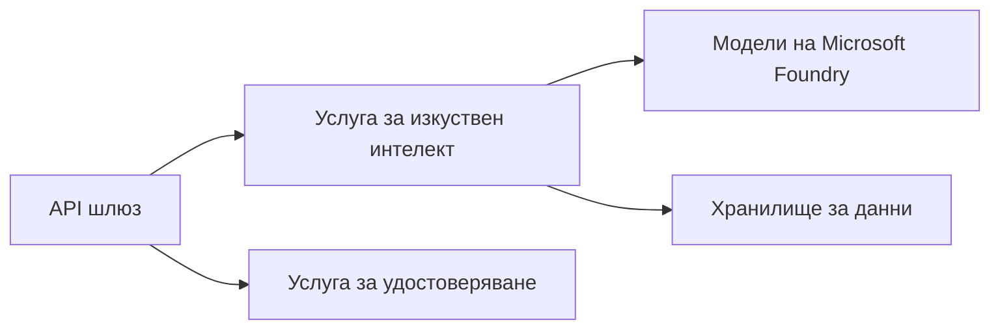
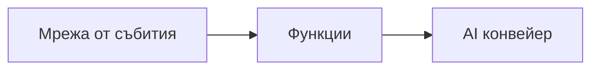

# Глава 8: Производствени и корпоративни шаблони

**📚 Курс**: [AZD For Beginners](../../README.md) | **⏱️ Продължителност**: 2-3 часа | **⭐ Сложност**: Напреднала

---

## Преглед

Тази глава обхваща готови за предприятия модели за разгръщане, втвърдяване на сигурността, мониторинг и оптимизация на разходите за продукционни ИИ натоварвания.

## Учебни цели

Като завършите тази глава, вие ще:
- Разположите устойчиви многорегионални приложения
- Прилагате корпоративни модели за сигурност
- Конфигурирате изчерпателно наблюдение
- Оптимизирате разходите в мащаб
- Настроите CI/CD конвейери с AZD

---

## 📚 Уроци

| # | Урок | Описание | Време |
|---|--------|-------------|------|
| 1 | [Производствени практики за ИИ](production-ai-practices.md) | Корпоративни модели за внедряване | 90 мин |

---

## 🚀 Контролен списък за продукция

- [ ] Многорегионално разполагане за устойчивост
- [ ] Управлявана идентичност за удостоверяване (без ключове)
- [ ] Application Insights за наблюдение
- [ ] Конфигурирани бюджети и сигнали за разходи
- [ ] Включено сканиране за сигурност
- [ ] Интеграция на CI/CD конвейер
- [ ] План за възстановяване при бедствия

---

## 🏗️ Архитектурни шаблони

### Шаблон 1: Микросървиси за ИИ


### Шаблон 2: Събитийно-ориентиран ИИ


---

## 🔐 Най-добри практики за сигурност

```bicep
// Use managed identity
identity: {
  type: 'SystemAssigned'
}

// Private endpoints for AI services
properties: {
  publicNetworkAccess: 'Disabled'
  networkAcls: {
    defaultAction: 'Deny'
  }
}
```

---

## 💰 Оптимизация на разходите

| Стратегия | Спестявания |
|----------|---------|
| Мащабиране до нула (Container Apps) | 60-80% |
| Използвайте консумационни нива за разработка | 50-70% |
| Планирано мащабиране | 30-50% |
| Запазен капацитет | 20-40% |

```bash
# Настройте бюджетни известия
az consumption budget create \
  --budget-name "AI-Budget" \
  --amount 500 \
  --category Cost \
  --time-grain Monthly
```

---

## 📊 Настройка на наблюдението

```bash
# Показване на логове в реално време
azd monitor --logs

# Проверете Application Insights
azd monitor

# Преглед на метрики
az monitor metrics list --resource <resource-id>
```

---

## 🔗 Навигация

| Посока | Глава |
|-----------|---------|
| **Предишна** | [Глава 7: Отстраняване на неизправности](../chapter-07-troubleshooting/README.md) |
| **Курс завършен** | [Начало на курса](../../README.md) |

---

## 📖 Свързани ресурси

- [Ръководство за агенти на ИИ](../chapter-02-ai-development/agents.md)
- [Application Insights](../chapter-06-pre-deployment/application-insights.md)
- [Решения с множество агенти](../chapter-05-multi-agent/README.md)
- [Пример за микросървиси](../../examples/microservices/README.md)

---

<!-- CO-OP TRANSLATOR DISCLAIMER START -->
**Отказ от отговорност**:
Този документ е преведен с използване на AI преводаческа услуга [Co-op Translator](https://github.com/Azure/co-op-translator). Въпреки че се стремим към точност, моля имайте предвид, че автоматичните преводи може да съдържат грешки или неточности. Оригиналният документ на оригиналния език трябва да се счита за авторитетен източник. За критична информация се препоръчва професионален човешки превод. Ние не носим отговорност за каквито и да е недоразумения или погрешни тълкувания, произтичащи от използването на този превод.
<!-- CO-OP TRANSLATOR DISCLAIMER END -->