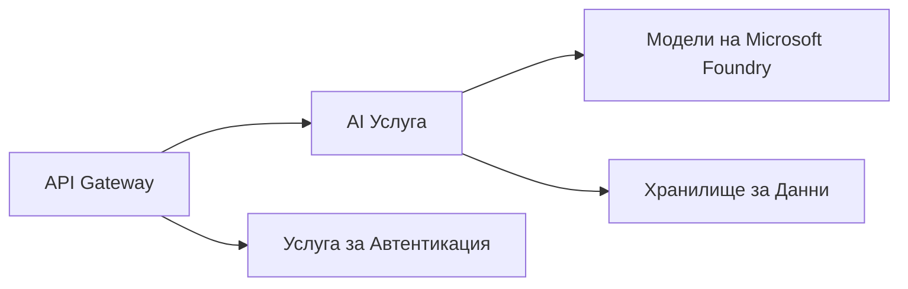

# Глава 8: Патерни за производство и предприятия

**📚 Курс**: [AZD за начинаещи](../../README.md) | **⏱️ Продължителност**: 2-3 часа | **⭐ Сложност**: Напреднал

---

## Преглед

Тази глава обхваща патерни за внедряване, готови за предприятия, усилване на сигурността, мониторинг и оптимизация на разходите за производствени AI натоварвания.

> Проверено с `azd 1.23.12` през март 2026 г.

## Учебни цели

След завършване на тази глава, ще можете да:
- Внедрите приложения с устойчива многорегионална архитектура
- Прилагате патерни за сигурност на ниво предприятие
- Конфигурирате всеобхватен мониторинг
- Оптимизирате разходите в мащаб
- Настроите CI/CD пайплайни с AZD

---

## 📚 Уроци

| # | Урок | Описание | Време |
|---|--------|-------------|------|
| 1 | [Практики за производство на AI](production-ai-practices.md) | Патерни за внедряване на ниво предприятие | 90 мин |

---

## 🚀 Контролен списък за производство

- [ ] Многорегионално внедряване за устойчивост
- [ ] Управлявана идентичност за удостоверяване (без ключове)
- [ ] Application Insights за мониторинг
- [ ] Конфигурирани бюджети и сигнали за разходи
- [ ] Активирано сканиране за сигурност
- [ ] Интеграция на CI/CD пайплайн
- [ ] План за възстановяване при бедствия

---

## 🏗️ Архитектурни патерни

### Патерн 1: Микросервизи AI


### Патерн 2: Събитийно-управляван AI


---

## 🔐 Най-добри практики за сигурност

```bicep
// Use managed identity
identity: {
  type: 'SystemAssigned'
}

// Private endpoints for AI services
properties: {
  publicNetworkAccess: 'Disabled'
  networkAcls: {
    defaultAction: 'Deny'
  }
}
```

---

## 💰 Оптимизация на разходите

| Стратегия | Спестявания |
|----------|---------|
| Скалиране до нула (Container Apps) | 60-80% |
| Използване на потребление за dev | 50-70% |
| Планирано скалиране | 30-50% |
| Резервирана вместимост | 20-40% |

```bash
# Настройте бюджетни предупреждения
az consumption budget create \
  --budget-name "AI-Budget" \
  --amount 500 \
  --category Cost \
  --time-grain Monthly
```

---

## 📊 Настройка на мониторинг

```bash
# Потокови логове
azd monitor --logs

# Проверете Application Insights
azd monitor --overview

# Преглед на метрики
az monitor metrics list --resource <resource-id>
```

---

## 🔗 Навигация

| Посока | Глава |
|-----------|---------|
| **Предишна** | [Глава 7: Отстраняване на проблеми](../chapter-07-troubleshooting/README.md) |
| **Край на курса** | [Начало на курса](../../README.md) |

---

## 📖 Свързани ресурси

- [Ръководство за AI агенти](../chapter-02-ai-development/agents.md)
- [Application Insights](../chapter-06-pre-deployment/application-insights.md)
- [Решения с множество агенти](../chapter-05-multi-agent/README.md)
- [Пример с микросервизи](../../examples/microservices/README.md)

---

<!-- CO-OP TRANSLATOR DISCLAIMER START -->
**Отказ от отговорност**:  
Този документ е преведен с помощта на AI преводаческа услуга [Co-op Translator](https://github.com/Azure/co-op-translator). Въпреки че се стремим към точност, моля, имайте предвид, че автоматизираните преводи могат да съдържат грешки или неточности. Оригиналният документ на неговия оригинален език трябва да се счита за авторитетен източник. За критична информация се препоръчва професионален човешки превод. Ние не носим отговорност за никакви недоразумения или неправилни тълкувания, произтичащи от използването на този превод.
<!-- CO-OP TRANSLATOR DISCLAIMER END -->