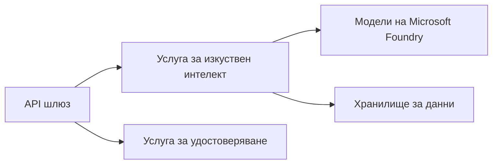
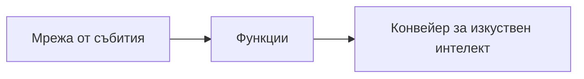

# Глава 8: Модели за продукция и корпоративни практики

**📚 Курс**: [AZD For Beginners](../../README.md) | **⏱️ Продължителност**: 2-3 часа | **⭐ Сложност**: Напреднала

---

## Преглед

Тази глава обхваща готови за предприятия модели за разгръщане, затягане на сигурността, наблюдение и оптимизация на разходите за продукционни AI натоварвания.

> Валидирано срещу `azd 1.25.6` през юни 2026 г.

## Учебни цели

След завършване на тази глава ще:
- Разгърнете устойчиви приложения в няколко региона
- Прилагате корпоративни модели за сигурност
- Конфигурирате цялостно наблюдение
- Оптимизирате разходите в мащаб
- Настроите CI/CD конвейери с AZD

---

## 📚 Уроци

| # | Урок | Описание | Време |
|---|------|----------|------|
| 1 | [Production AI Practices](production-ai-practices.md) | Корпоративни модели за внедряване | 90 мин |

---

## 🚀 Контролен списък за продукция

- [ ] Разгръщане в няколко региона за повишена устойчивост
- [ ] Управлявана идентичност за удостоверяване (без ключове)
- [ ] Application Insights за наблюдение
- [ ] Конфигурирани бюджети за разходи и аларми
- [ ] Активирано сканиране за сигурност
- [ ] Интеграция на CI/CD конвейер
- [ ] План за възстановяване при бедствия

---

## 🏗️ Архитектурни модели

### Модел 1: Микросървисен ИИ



### Модел 2: Събитийно-ориентиран ИИ



---

## 🔐 Най-добри практики за сигурност

```bicep
// Use managed identity
identity: {
  type: 'SystemAssigned'
}

// Private endpoints for AI services
properties: {
  publicNetworkAccess: 'Disabled'
  networkAcls: {
    defaultAction: 'Deny'
  }
}
```

---

## 💰 Оптимизация на разходите

| Strategy | Savings |
|----------|---------|
| Scale to zero (Container Apps) | 60-80% |
| Use consumption tiers for dev | 50-70% |
| Scheduled scaling | 30-50% |
| Reserved capacity | 20-40% |

```bash
# Задайте бюджетни предупреждения
az consumption budget create \
  --budget-name "AI-Budget" \
  --amount 500 \
  --category Cost \
  --time-grain Monthly
```

---

## 📊 Настройка на наблюдение

```bash
# Поточно показване на логове
azd monitor --logs

# Проверка на Application Insights
azd monitor --overview

# Преглед на показатели
az monitor metrics list --resource <resource-id>
```

---

## 🔗 Навигация

| Direction | Chapter |
|-----------|---------|
| **Предишна** | [Глава 7: Отстраняване на проблеми](../chapter-07-troubleshooting/README.md) |
| **Курсът завършен** | [Начална страница на курса](../../README.md) |

---

## 📖 Свързани ресурси

- [Ръководство за ИИ агенти](../chapter-02-ai-development/agents.md)
- [Application Insights](../chapter-06-pre-deployment/application-insights.md)
- [Многоагентни решения](../chapter-05-multi-agent/README.md)
- [Пример за микросървиси](../../examples/microservices/README.md)

---

<!-- CO-OP TRANSLATOR DISCLAIMER START -->
**Отказ от отговорност**:
Този документ е преведен с помощта на AI преводачески услуга [Co-op Translator](https://github.com/Azure/co-op-translator). Въпреки че се стремим към точност, моля имайте предвид, че автоматизираните преводи могат да съдържат грешки или неточности. Оригиналният документ на неговия роден език трябва да се счита за авторитетен източник. За критична информация се препоръчва професионален човешки превод. Ние не носим отговорност за каквито и да е недоразумения или неправилни тълкувания, произтичащи от използването на този превод.
<!-- CO-OP TRANSLATOR DISCLAIMER END -->