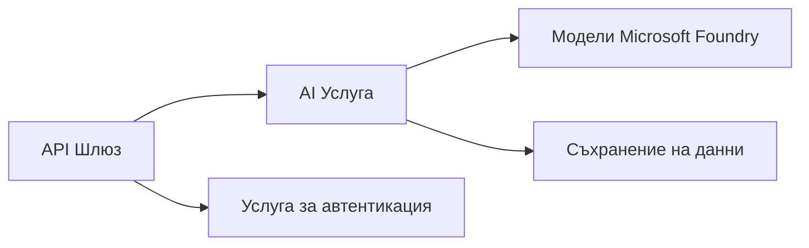
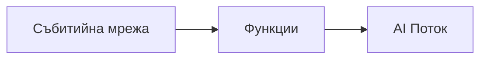

# Глава 8: Производствени и корпоративни модели

**📚 Курс**: [AZD за начинаещи](../../README.md) | **⏱️ Продължителност**: 2-3 часа | **⭐ Ниво на сложност**: Напреднали

---

## Преглед

Тази глава обхваща модели за внедряване, готови за корпоративна употреба, засилване на сигурността, мониторинг и оптимизация на разходите за производствени AI натоварвания.

> Проверено с `azd 1.27.1` през юли 2026 г.

## Учебни цели

След като завършите тази глава, ще можете:
- Да внедрявате устойчиви приложения в няколко региона
- Да прилагате корпоративни модели за сигурност
- Да конфигурирате цялостен мониторинг
- Да оптимизирате разходите в голям мащаб
- Да настроите CI/CD потоци с AZD

---

## 📚 Уроци

| # | Урок | Описание | Време |
|---|--------|-------------|------|
| 1 | [Практики за производство на AI](production-ai-practices.md) | Корпоративни модели за внедряване | 90 мин |

---

## 🚀 Производствен контролен списък

- [ ] Внедряване в няколко региона за устойчивост
- [ ] Управлявана идентичност за автентикация (без ключове)
- [ ] Application Insights за мониторинг
- [ ] Конфигурирани бюджети и известия за разходи
- [ ] Активирано сканиране за сигурност
- [ ] Интеграция на CI/CD потоци
- [ ] План за възстановяване при бедствия

---

## 🏗️ Модели на архитектурата

### Модел 1: Микросервизи AI



### Модел 2: Събитийно-ориентиран AI



---

## 🔐 Най-добри практики за сигурност

```bicep
// Use managed identity
identity: {
  type: 'SystemAssigned'
}

// Private endpoints for AI services
properties: {
  publicNetworkAccess: 'Disabled'
  networkAcls: {
    defaultAction: 'Deny'
  }
}
```

---

## 💰 Оптимизация на разходи

| Стратегия | Спестявания |
|----------|---------|
| Масштабиране до нула (Container Apps) | 60-80% |
| Използване на потребителски слоеве за разработка | 50-70% |
| Планирано мащабиране | 30-50% |
| Резервирана вместимост | 20-40% |

```bash
# Настройте предупреждения за бюджет
az consumption budget create \
  --budget-name "AI-Budget" \
  --amount 500 \
  --category Cost \
  --time-grain Monthly
```

---

## 📊 Настройка на мониторинг

```bash
# Потокови дневници
azd monitor --logs

# Проверете Application Insights
azd monitor --overview

# Преглед на метрики
az monitor metrics list --resource <resource-id>
```

---

## 🔗 Навигация

| Посока | Глава |
|-----------|---------|
| **Предишна** | [Глава 7: Отстраняване на неизправности](../chapter-07-troubleshooting/README.md) |
| **Курс завършен** | [Начало на курса](../../README.md) |

---

## 📖 Свързани ресурси

- [Ръководство за AI агенти](../chapter-02-ai-development/agents.md)
- [Application Insights](../chapter-06-pre-deployment/application-insights.md)
- [Решения с множество агенти](../chapter-05-multi-agent/README.md)
- [Пример с микросервизи](../../examples/microservices/README.md)

---

<!-- CO-OP TRANSLATOR DISCLAIMER START -->
**Отказ от отговорност**:
Този документ е преведен с помощта на AI преводачески услуга [Co-op Translator](https://github.com/Azure/co-op-translator). Въпреки че се стремим към точност, моля имайте предвид, че автоматизираните преводи могат да съдържат грешки или неточности. Оригиналният документ на неговия роден език трябва да се счита за авторитетен източник. За критична информация се препоръчва професионален човешки превод. Ние не носим отговорност за каквито и да е недоразумения или неправилни тълкувания, произтичащи от използването на този превод.
<!-- CO-OP TRANSLATOR DISCLAIMER END -->