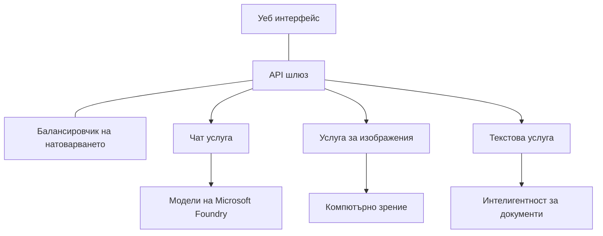

# Най-добри практики за продукционни AI натоварвания с AZD

**Навигация в главите:**
- **📚 Начало на курса**: [AZD за начинаещи](../../README.md)
- **📖 Текуща глава**: Глава 8 - Шаблони за продукция и корпоративни решения
- **⬅️ Предишна глава**: [Глава 7: Отстраняване на проблеми](../chapter-07-troubleshooting/debugging.md)
- **⬅️ Също свързано**: [Лаборатория AI Workshop](ai-workshop-lab.md)
- **🎯 Курс завършен**: [AZD за начинаещи](../../README.md)

## Преглед

Това ръководство предоставя изчерпателни най-добри практики за внедряване на продукционно готови AI натоварвания с помощта на Azure Developer CLI (AZD). Въз основа на обратната връзка от общността в Microsoft Foundry Discord и реални внедрявания при клиенти, тези практики адресират най-често срещаните предизвикателства в продукционните AI системи.

## Основни предизвикателства

Въз основа на резултатите от нашата анкета в общността, това са основните предизвикателства, с които се сблъскват разработчиците:

- **45%** се затрудняват с внедрявания на AI с множество услуги
- **38%** имат проблеми с управлението на идентификационни данни и секрети  
- **35%** намират подготовката за продукция и мащабиране за трудни
- **32%** имат нужда от по-добри стратегии за оптимизация на разходите
- **29%** изискват подобрено наблюдение и отстраняване на проблеми

## Архитектурни шаблони за продукционни AI системи

### Шаблон 1: Микросървисна AI архитектура

**Кога да използвате**: Сложни AI приложения с множество възможности


**Реализация в AZD**:

```yaml
# azure.yaml
name: enterprise-ai-platform
services:
  web:
    project: ./web
    host: staticwebapp
  api-gateway:
    project: ./api-gateway
    host: containerapp
  chat-service:
    project: ./services/chat
    host: containerapp
  vision-service:
    project: ./services/vision
    host: containerapp
  text-service:
    project: ./services/text
    host: containerapp
```

### Шаблон 2: Събитийно ориентирана AI обработка

**Кога да използвате**: Пакетна обработка, анализ на документи, асинхронни работни потоци

```bicep
// Event Hub for AI processing pipeline
resource eventHub 'Microsoft.EventHub/namespaces@2023-01-01-preview' = {
  name: eventHubNamespaceName
  location: location
  sku: {
    name: 'Standard'
    tier: 'Standard'
    capacity: 1
  }
}

// Service Bus for reliable message processing
resource serviceBus 'Microsoft.ServiceBus/namespaces@2022-10-01-preview' = {
  name: serviceBusNamespaceName
  location: location
  sku: {
    name: 'Premium'
    tier: 'Premium'
    capacity: 1
  }
}

// Function App for processing
resource functionApp 'Microsoft.Web/sites@2023-01-01' = {
  name: functionAppName
  location: location
  kind: 'functionapp,linux'
  properties: {
    siteConfig: {
      appSettings: [
        {
          name: 'FUNCTIONS_EXTENSION_VERSION'
          value: '~4'
        }
        {
          name: 'AZURE_OPENAI_ENDPOINT'
          value: '@Microsoft.KeyVault(VaultName=${keyVault.name};SecretName=openai-endpoint)'
        }
      ]
    }
  }
}
```

## Отчитане на състоянието на AI агента

Когато традиционно уеб приложение се срине, симптомите са познати: страница не зарежда, API връща грешка или внедряване се проваля. AI-задвижваните приложения могат да се повредят по всички тези същите начини — но могат и да се държат неправилно по по-фини начини, които не генерират очевидни съобщения за грешка.

Този раздел ви помага да изградите ментален модел за наблюдение на AI натоварвания, така че да знаете къде да търсите, когато нещо не изглежда правилно.

### Как здравето на агента се различава от здравето на традиционно приложение

Традиционното приложение или работи, или не. AI агентът може да изглежда, че работи, но да дава лоши резултати. Помислете за здравето на агента в два слоя:

| Ниво | Какво да наблюдавате | Къде да търсите |
|-------|--------------|---------------|
| **Инфраструктурно здраве** | Работи ли услугата? Ресурсите осигурени ли са? Достъпни ли са крайните точки? | `azd monitor`, състоянието на ресурса в Azure Portal, журнали на контейнера/приложението |
| **Поведенческо здраве** | Отговаря ли агентът точно? Навременни ли са отговорите? Вика ли се моделът правилно? | трасета в Application Insights, метрики за латентност при извикване на модела, журнали за качество на отговорите |

Инфраструктурното здраве е познато — то е едно и също за всяко azd приложение. Поведенческото здраве е новият слой, който въвеждат AI натоварванията.

### Къде да търсите когато AI приложенията не се държат както се очаква

Ако вашето AI приложение не дава очакваните резултати, ето един концептуален контролен списък:

1. **Започнете с основите.** Работи ли приложението? Може ли да достигне зависимостите си? Проверете `azd monitor` и състоянието на ресурсите, както бихте направили за всяко приложение.
2. **Проверете връзката към модела.** Успешно ли вашето приложение извиква AI модела? Неуспешните или изтеклите по време извиквания на модела са най-честата причина за проблеми в AI приложенията и ще се покажат в логовете на приложението ви.
3. **Вижте какво е получил моделът.** AI отговорите зависят от входа (подсказката и всеки извлечен контекст). Ако изходът е грешен, входът обикновено е грешен. Проверете дали приложението ви изпраща правилните данни към модела.
4. **Прегледайте латентността на отговорите.** Извикванията към AI моделите са по-бавни от типичните API извиквания. Ако приложението ви се усеща бавно, проверете дали времето за отговор на модела се е увеличило — това може да индикира тротлиране, капацитетни ограничения или задръстване на регионално ниво.
5. **Наблюдавайте сигналите за разходи.** Неочаквани скокове в използването на токени или API извиквания могат да индикират цикъл, неправилно конфигурирана подсказка или прекалено много опити за повторение.

Не е нужно да овладеете инструментите за наблюдаемост веднага. Основната идея е, че AI приложенията имат допълнителен слой поведение за наблюдение, а вграденото наблюдение на azd (`azd monitor`) ви дава отправна точка за разследване на двата слоя.

---

## Най-добри практики за сигурност

### 1. Модел за сигурност Zero-Trust

**Стратегия за внедряване**:
- Няма комуникация услуга-услуга без автентикация
- Всички API извиквания използват управлявани идентичности
- Мрежова изолация с частни крайни точки
- Контрол на достъпа по принципа на най-малките привилегии

```bicep
// Managed Identity for each service
resource chatServiceIdentity 'Microsoft.ManagedIdentity/userAssignedIdentities@2023-01-31' = {
  name: 'chat-service-identity'
  location: location
}

// Role assignments with minimal permissions
resource openAIUserRole 'Microsoft.Authorization/roleAssignments@2022-04-01' = {
  scope: openAIAccount
  name: guid(openAIAccount.id, chatServiceIdentity.id, openAIUserRoleDefinitionId)
  properties: {
    roleDefinitionId: subscriptionResourceId('Microsoft.Authorization/roleDefinitions', '5e0bd9bd-7b93-4f28-af87-19fc36ad61bd')
    principalId: chatServiceIdentity.properties.principalId
    principalType: 'ServicePrincipal'
  }
}
```

### 2. Сигурно управление на секрети

**Шаблон за интеграция с Key Vault**:

```bicep
// Key Vault with proper access policies
resource keyVault 'Microsoft.KeyVault/vaults@2023-02-01' = {
  name: keyVaultName
  location: location
  properties: {
    tenantId: tenant().tenantId
    sku: {
      family: 'A'
      name: 'premium'  // Use premium for production
    }
    enableRbacAuthorization: true  // Use RBAC instead of access policies
    enablePurgeProtection: true    // Prevent accidental deletion
    enableSoftDelete: true
    softDeleteRetentionInDays: 90
  }
}

// Store all AI service credentials
resource openAIKeySecret 'Microsoft.KeyVault/vaults/secrets@2023-02-01' = {
  parent: keyVault
  name: 'openai-api-key'
  properties: {
    value: openAIAccount.listKeys().key1
    attributes: {
      enabled: true
    }
  }
}
```

### 3. Мрежова сигурност

**Конфигурация на частни крайни точки**:

```bicep
// Virtual Network for AI services
resource virtualNetwork 'Microsoft.Network/virtualNetworks@2023-04-01' = {
  name: vnetName
  location: location
  properties: {
    addressSpace: {
      addressPrefixes: ['10.0.0.0/16']
    }
    subnets: [
      {
        name: 'ai-services-subnet'
        properties: {
          addressPrefix: '10.0.1.0/24'
          privateEndpointNetworkPolicies: 'Disabled'
        }
      }
      {
        name: 'app-services-subnet'
        properties: {
          addressPrefix: '10.0.2.0/24'
          delegations: [
            {
              name: 'Microsoft.Web/serverFarms'
              properties: {
                serviceName: 'Microsoft.Web/serverFarms'
              }
            }
          ]
        }
      }
    ]
  }
}

// Private endpoints for all AI services
resource openAIPrivateEndpoint 'Microsoft.Network/privateEndpoints@2023-04-01' = {
  name: '${openAIAccountName}-pe'
  location: location
  properties: {
    subnet: {
      id: virtualNetwork.properties.subnets[0].id
    }
    privateLinkServiceConnections: [
      {
        name: 'openai-connection'
        properties: {
          privateLinkServiceId: openAIAccount.id
          groupIds: ['account']
        }
      }
    ]
  }
}
```

## Производителност и мащабиране

### 1. Стратегии за автоматично мащабиране

**Автоматично мащабиране на Container Apps**:

```bicep
resource containerApp 'Microsoft.App/containerApps@2023-05-01' = {
  name: containerAppName
  location: location
  properties: {
    configuration: {
      ingress: {
        external: true
        targetPort: 8000
        transport: 'http'
      }
    }
    template: {
      scale: {
        minReplicas: 2  // Always have 2 instances minimum
        maxReplicas: 50 // Scale up to 50 for high load
        rules: [
          {
            name: 'http-scaling'
            http: {
              metadata: {
                concurrentRequests: '20'  // Scale when >20 concurrent requests
              }
            }
          }
          {
            name: 'cpu-scaling'
            custom: {
              type: 'cpu'
              metadata: {
                type: 'Utilization'
                value: '70'  // Scale when CPU >70%
              }
            }
          }
        ]
      }
    }
  }
}
```

### 2. Стратегии за кеширане

**Redis кеш за AI отговори**:

```bicep
// Redis Premium for production workloads
resource redisCache 'Microsoft.Cache/redis@2023-04-01' = {
  name: redisCacheName
  location: location
  properties: {
    sku: {
      name: 'Premium'
      family: 'P'
      capacity: 1
    }
    enableNonSslPort: false
    minimumTlsVersion: '1.2'
    redisConfiguration: {
      'maxmemory-policy': 'allkeys-lru'
    }
    // Enable clustering for high availability
    redisVersion: '6.0'
    shardCount: 2
  }
}

// Cache configuration in application
var cacheConnectionString = '${redisCache.properties.hostName}:6380,password=${redisCache.listKeys().primaryKey},ssl=True,abortConnect=False'
```

### 3. Балансиране на натоварването и управление на трафика

**Application Gateway с WAF**:

```bicep
// Application Gateway with Web Application Firewall
resource applicationGateway 'Microsoft.Network/applicationGateways@2023-04-01' = {
  name: appGatewayName
  location: location
  properties: {
    sku: {
      name: 'WAF_v2'
      tier: 'WAF_v2'
      capacity: 2
    }
    webApplicationFirewallConfiguration: {
      enabled: true
      firewallMode: 'Prevention'
      ruleSetType: 'OWASP'
      ruleSetVersion: '3.2'
    }
    // Backend pools for AI services
    backendAddressPools: [
      {
        name: 'ai-services-pool'
        properties: {
          backendAddresses: [
            {
              fqdn: '${containerApp.properties.configuration.ingress.fqdn}'
            }
          ]
        }
      }
    ]
  }
}
```

## 💰 Оптимизация на разходите

### 1. Правилно оразмеряване на ресурсите

**Конфигурации специфични за средата**:

```bash
# Среда за разработка
azd env new development
azd env set AZURE_OPENAI_SKU "S0"
azd env set AZURE_OPENAI_CAPACITY 10
azd env set AZURE_SEARCH_SKU "basic"
azd env set CONTAINER_CPU 0.5
azd env set CONTAINER_MEMORY 1.0

# Продукционна среда
azd env new production
azd env set AZURE_OPENAI_SKU "S0"
azd env set AZURE_OPENAI_CAPACITY 100
azd env set AZURE_SEARCH_SKU "standard"
azd env set CONTAINER_CPU 2.0
azd env set CONTAINER_MEMORY 4.0
```

### 2. Наблюдение на разходите и бюджети

```bicep
// Cost management and budgets
resource budget 'Microsoft.Consumption/budgets@2023-05-01' = {
  name: 'ai-workload-budget'
  properties: {
    timePeriod: {
      startDate: '2024-01-01'
      endDate: '2024-12-31'
    }
    timeGrain: 'Monthly'
    amount: 2000  // $2000 monthly budget
    category: 'Cost'
    notifications: {
      warning: {
        enabled: true
        operator: 'GreaterThan'
        threshold: 80
        contactEmails: [
          'finance@company.com'
          'engineering@company.com'
        ]
        contactRoles: [
          'Owner'
          'Contributor'
        ]
      }
      critical: {
        enabled: true
        operator: 'GreaterThan'
        threshold: 95
        contactEmails: [
          'cto@company.com'
        ]
      }
    }
  }
}
```

### 3. Оптимизация на използването на токени

**Управление на разходите за OpenAI**:

```typescript
// Оптимизация на токените на ниво приложение
class TokenOptimizer {
  private readonly maxTokens = 4000;
  private readonly reserveTokens = 500;
  
  optimizePrompt(userInput: string, context: string): string {
    const availableTokens = this.maxTokens - this.reserveTokens;
    const estimatedTokens = this.estimateTokens(userInput + context);
    
    if (estimatedTokens > availableTokens) {
      // Съкратете контекста, не входа на потребителя
      context = this.truncateContext(context, availableTokens - this.estimateTokens(userInput));
    }
    
    return `${context}\n\nUser: ${userInput}`;
  }
  
  private estimateTokens(text: string): number {
    // Приблизителна оценка: 1 токен ≈ 4 символа
    return Math.ceil(text.length / 4);
  }
}
```

## Наблюдение и наблюдаемост

### 1. Изчерпателен Application Insights

```bicep
// Application Insights with advanced features
resource applicationInsights 'Microsoft.Insights/components@2020-02-02' = {
  name: applicationInsightsName
  location: location
  kind: 'web'
  properties: {
    Application_Type: 'web'
    WorkspaceResourceId: logAnalyticsWorkspace.id
    SamplingPercentage: 100  // Full sampling for AI apps
    DisableIpMasking: false  // Enable for security
  }
}

// Custom metrics for AI operations
resource aiMetricAlerts 'Microsoft.Insights/metricAlerts@2018-03-01' = {
  name: 'ai-high-error-rate'
  location: 'global'
  properties: {
    description: 'Alert when AI service error rate is high'
    severity: 2
    enabled: true
    scopes: [
      applicationInsights.id
    ]
    evaluationFrequency: 'PT1M'
    windowSize: 'PT5M'
    criteria: {
      'odata.type': 'Microsoft.Azure.Monitor.SingleResourceMultipleMetricCriteria'
      allOf: [
        {
          name: 'high-error-rate'
          metricName: 'requests/failed'
          operator: 'GreaterThan'
          threshold: 10
          timeAggregation: 'Count'
        }
      ]
    }
  }
}
```

### 2. Наблюдение специфично за AI

**Персонализирани табла за AI метрики**:

```json
// Dashboard configuration for AI workloads
{
  "dashboard": {
    "name": "AI Application Monitoring",
    "tiles": [
      {
        "name": "OpenAI Request Volume",
        "query": "requests | where name contains 'openai' | summarize count() by bin(timestamp, 5m)"
      },
      {
        "name": "AI Response Latency",
        "query": "requests | where name contains 'openai' | summarize avg(duration) by bin(timestamp, 5m)"
      },
      {
        "name": "Token Usage",
        "query": "customMetrics | where name == 'openai_tokens_used' | summarize sum(value) by bin(timestamp, 1h)"
      },
      {
        "name": "Cost per Hour",
        "query": "customMetrics | where name == 'openai_cost' | summarize sum(value) by bin(timestamp, 1h)"
      }
    ]
  }
}
```

### 3. Проверки на здравето и наблюдение на наличността

```bicep
// Application Insights availability tests
resource availabilityTest 'Microsoft.Insights/webtests@2022-06-15' = {
  name: 'ai-app-availability-test'
  location: location
  tags: {
    'hidden-link:${applicationInsights.id}': 'Resource'
  }
  properties: {
    SyntheticMonitorId: 'ai-app-availability-test'
    Name: 'AI Application Availability Test'
    Description: 'Tests AI application endpoints'
    Enabled: true
    Frequency: 300  // 5 minutes
    Timeout: 120    // 2 minutes
    Kind: 'ping'
    Locations: [
      {
        Id: 'us-east-2-azr'
      }
      {
        Id: 'us-west-2-azr'
      }
    ]
    Configuration: {
      WebTest: '''
        <WebTest Name="AI Health Check" 
                 Id="8d2de8d2-a2b0-4c2e-9a0d-8f9c9a0b8c8d" 
                 Enabled="True" 
                 CssProjectStructure="" 
                 CssIteration="" 
                 Timeout="120" 
                 WorkItemIds="" 
                 xmlns="http://microsoft.com/schemas/VisualStudio/TeamTest/2010" 
                 Description="" 
                 CredentialUserName="" 
                 CredentialPassword="" 
                 PreAuthenticate="True" 
                 Proxy="default" 
                 StopOnError="False" 
                 RecordedResultFile="" 
                 ResultsLocale="">
          <Items>
            <Request Method="GET" 
                     Guid="a5f10126-e4cd-570d-961c-cea43999a200" 
                     Version="1.1" 
                     Url="${webApp.properties.defaultHostName}/health" 
                     ThinkTime="0" 
                     Timeout="120" 
                     ParseDependentRequests="True" 
                     FollowRedirects="True" 
                     RecordResult="True" 
                     Cache="False" 
                     ResponseTimeGoal="0" 
                     Encoding="utf-8" 
                     ExpectedHttpStatusCode="200" 
                     ExpectedResponseUrl="" 
                     ReportingName="" 
                     IgnoreHttpStatusCode="False" />
          </Items>
        </WebTest>
      '''
    }
  }
}
```

## Възстановяване след бедствия и висока наличност

### 1. Разгръщане в множество региони

```yaml
# azure.yaml - Multi-region configuration
name: ai-app-multiregion
services:
  api-primary:
    project: ./api
    host: containerapp
    env:
      - AZURE_REGION=eastus
  api-secondary:
    project: ./api
    host: containerapp
    env:
      - AZURE_REGION=westus2
```

```bicep
// Traffic Manager for global load balancing
resource trafficManager 'Microsoft.Network/trafficManagerProfiles@2022-04-01' = {
  name: trafficManagerProfileName
  location: 'global'
  properties: {
    profileStatus: 'Enabled'
    trafficRoutingMethod: 'Priority'
    dnsConfig: {
      relativeName: trafficManagerProfileName
      ttl: 30
    }
    monitorConfig: {
      protocol: 'HTTPS'
      port: 443
      path: '/health'
      intervalInSeconds: 30
      toleratedNumberOfFailures: 3
      timeoutInSeconds: 10
    }
    endpoints: [
      {
        name: 'primary-endpoint'
        type: 'Microsoft.Network/trafficManagerProfiles/azureEndpoints'
        properties: {
          targetResourceId: primaryAppService.id
          endpointStatus: 'Enabled'
          priority: 1
        }
      }
      {
        name: 'secondary-endpoint'
        type: 'Microsoft.Network/trafficManagerProfiles/azureEndpoints'
        properties: {
          targetResourceId: secondaryAppService.id
          endpointStatus: 'Enabled'
          priority: 2
        }
      }
    ]
  }
}
```

### 2. Архивиране и възстановяване на данни

```bicep
// Backup configuration for critical data
resource backupVault 'Microsoft.DataProtection/backupVaults@2023-05-01' = {
  name: backupVaultName
  location: location
  identity: {
    type: 'SystemAssigned'
  }
  properties: {
    storageSettings: [
      {
        datastoreType: 'VaultStore'
        type: 'LocallyRedundant'
      }
    ]
  }
}

// Backup policy for AI models and data
resource backupPolicy 'Microsoft.DataProtection/backupVaults/backupPolicies@2023-05-01' = {
  parent: backupVault
  name: 'ai-data-backup-policy'
  properties: {
    policyRules: [
      {
        backupParameters: {
          backupType: 'Full'
          objectType: 'AzureBackupParams'
        }
        trigger: {
          schedule: {
            repeatingTimeIntervals: [
              'R/2024-01-01T02:00:00+00:00/P1D'  // Daily at 2 AM
            ]
          }
          objectType: 'ScheduleBasedTriggerContext'
        }
        dataStore: {
          datastoreType: 'VaultStore'
          objectType: 'DataStoreInfoBase'
        }
        name: 'BackupDaily'
        objectType: 'AzureBackupRule'
      }
    ]
  }
}
```

## DevOps и интеграция на CI/CD

### 1. GitHub Actions работен поток

```yaml
# .github/workflows/deploy-ai-app.yml
name: Deploy AI Application

on:
  push:
    branches: [main]
  pull_request:
    branches: [main]

jobs:
  test:
    runs-on: ubuntu-latest
    steps:
      - uses: actions/checkout@v4
      
      - name: Setup Python
        uses: actions/setup-python@v4
        with:
          python-version: '3.11'
          
      - name: Install dependencies
        run: |
          pip install -r requirements.txt
          pip install pytest
          
      - name: Run tests
        run: pytest tests/
        
      - name: AI Safety Tests
        run: |
          python scripts/test_ai_safety.py
          python scripts/validate_prompts.py

  deploy-staging:
    needs: test
    if: github.event_name == 'pull_request'
    runs-on: ubuntu-latest
    steps:
      - uses: actions/checkout@v4
      
      - name: Setup AZD
        uses: Azure/setup-azd@v1.0.0
        
      - name: Login to Azure
        uses: azure/login@v1
        with:
          creds: ${{ secrets.AZURE_CREDENTIALS }}
          
      - name: Deploy to Staging
        run: |
          azd env select staging
          azd deploy

  deploy-production:
    needs: test
    if: github.ref == 'refs/heads/main'
    runs-on: ubuntu-latest
    steps:
      - uses: actions/checkout@v4
      
      - name: Setup AZD
        uses: Azure/setup-azd@v1.0.0
        
      - name: Login to Azure
        uses: azure/login@v1
        with:
          creds: ${{ secrets.AZURE_CREDENTIALS }}
          
      - name: Deploy to Production
        run: |
          azd env select production
          azd deploy
          
      - name: Run Production Health Checks
        run: |
          python scripts/health_check.py --env production
```

### 2. Валидация на инфраструктурата

```bash
# scripts/validate_infrastructure.sh
#!/bin/bash

echo "Validating AI infrastructure deployment..."

# Проверете дали всички необходими услуги работят
services=("openai" "search" "storage" "keyvault")
for service in "${services[@]}"; do
    echo "Checking $service..."
    if ! az resource list --resource-type "Microsoft.CognitiveServices/accounts" --query "[?contains(name, '$service')]" -o tsv; then
        echo "ERROR: $service not found"
        exit 1
    fi
done

# Проверете разгръщанията на моделите на OpenAI
echo "Validating OpenAI model deployments..."
models=$(az cognitiveservices account deployment list --name $AZURE_OPENAI_NAME --resource-group $AZURE_RESOURCE_GROUP --query "[].name" -o tsv)
if [[ ! $models == *"gpt-35-turbo"* ]]; then
    echo "ERROR: Required model gpt-35-turbo not deployed"
    exit 1
fi

# Тествайте свързаността на услугата за ИИ
echo "Testing AI service connectivity..."
python scripts/test_connectivity.py

echo "Infrastructure validation completed successfully!"
```

## Контролен списък за готовност за продукция

### Сигурност ✅
- [ ] Всички услуги използват управлявани идентичности
- [ ] Секретите са съхранени в Key Vault
- [ ] Конфигурирани частни крайни точки
- [ ] Внедрени групи за мрежова сигурност
- [ ] RBAC с принципа на най-малките привилегии
- [ ] WAF активиран на публичните крайни точки

### Производителност ✅
- [ ] Конфигурирано автоматично мащабиране
- [ ] Внедрено кеширане
- [ ] Настроено балансиране на натоварването
- [ ] CDN за статично съдържание
- [ ] Пул на връзки към базата данни
- [ ] Оптимизация на използването на токени

### Наблюдение ✅
- [ ] Конфигуриран Application Insights
- [ ] Дефинирани персонализирани метрики
- [ ] Настроени правила за алармиране
- [ ] Създадено табло
- [ ] Внедрени проверки на здравето
- [ ] Политики за задържане на логове

### Надеждност ✅
- [ ] Разгръщане в множество региони
- [ ] План за архивиране и възстановяване
- [ ] Внедрени circuit breakers
- [ ] Конфигурирани политики за повторение
- [ ] Контролирано деградиране
- [ ] Крайни точки за проверки на здравето

### Управление на разходите ✅
- [ ] Конфигурирани бюджетни известия
- [ ] Правилно оразмеряване на ресурсите
- [ ] Приложени отстъпки за dev/test
- [ ] Закупени резервирани инстанции
- [ ] Табло за наблюдение на разходите
- [ ] Редовни прегледи на разходите

### Съответствие ✅
- [ ] Спазени изисквания за местонахождение на данните
- [ ] Разрешено водене на одит логове
- [ ] Прилагани политики за съответствие
- [ ] Внедрени базови мерки за сигурност
- [ ] Редовни оценки на сигурността
- [ ] План за реакция при инциденти

## Бенчмаркове за производителност

### Типични продукционни метрики

| Метрика | Цел | Наблюдение |
|--------|--------|------------|
| **Време за отговор** | < 2 секунди | Application Insights |
| **Наличност** | 99.9% | Наблюдение на наличността |
| **Процент грешки** | < 0.1% | Логове на приложението |
| **Използване на токени** | < $500/месец | Управление на разходите |
| **Паралелни потребители** | 1000+ | Натоварващо тестване |
| **Време за възстановяване** | < 1 час | Тестове за възстановяване след бедствие |

### Натоварващо тестване

```bash
# Скрипт за натоварващо тестване на приложения за изкуствен интелект
python scripts/load_test.py \
  --endpoint https://your-ai-app.azurewebsites.net \
  --concurrent-users 100 \
  --duration 300 \
  --ramp-up 60
```

## 🤝 Общностни най-добри практики

Въз основа на обратната връзка от общността в Microsoft Foundry Discord:

### Основни препоръки от общността:

1. **Започнете малко, мащабирайте постепенно**: Започнете с базови SKU-та и скалирайте нагоре въз основа на реалната употреба
2. **Наблюдавайте всичко**: Настройте изчерпателно наблюдение от първия ден
3. **Автоматизирайте сигурността**: Използвайте инфраструктура като код за последователна сигурност
4. **Тествайте обстойно**: Включете AI-специфично тестване в своя пайплайн
5. **Планирайте разходите**: Наблюдавайте използването на токени и задайте бюджетни известия рано

### Чести капани, които да избягвате:

- ❌ Вкарване на API ключове в кода
- ❌ Неправилно или липсващо наблюдение
- ❌ Игнориране на оптимизацията на разходите
- ❌ Некоректно тестване на сценарии за отказ
- ❌ Внедряване без проверки на здравето

## AZD AI CLI команди и разширения

AZD включва разрастващ се набор от AI-специфични команди и разширения, които рационализират работните потоци за продукционни AI натоварвания. Тези инструменти запълват пропастта между локалната разработка и продукционното внедряване за AI натоварвания.

### Разширения на AZD за AI

AZD използва система от разширения за добавяне на AI-специфични възможности. Инсталирайте и управлявайте разширения с:

```bash
# Избройте всички налични разширения (включително AI)
azd extension list

# Инсталирайте разширението Foundry agents
azd extension install azure.ai.agents

# Инсталирайте разширението за фино настройване
azd extension install azure.ai.finetune

# Инсталирайте разширението за персонализирани модели
azd extension install azure.ai.models

# Актуализирайте всички инсталирани разширения
azd extension upgrade --all
```

**Налични AI разширения:**

| Разширение | Цел | Статус |
|-----------|---------|--------|
| `azure.ai.agents` | Управление на Foundry Agent Service | Преглед |
| `azure.ai.finetune` | Тунинг на модели във Foundry | Преглед |
| `azure.ai.models` | Персонализирани модели във Foundry | Преглед |
| `azure.coding-agent` | Конфигурация на coding agent | Наличен |

### Инициализиране на агентни проекти с `azd ai agent init`

Командата `azd ai agent init` създава скелет на продукционно готов AI агент проект, интегриран с Microsoft Foundry Agent Service:

```bash
# Инициализирайте нов проект за агент от агентски манифест
azd ai agent init -m <manifest-path-or-uri>

# Инициализирайте и насочете към конкретен Foundry проект
azd ai agent init -m agent-manifest.yaml --project-id <foundry-project-id>

# Инициализирайте с персонализирана директория за изходния код
azd ai agent init -m agent-manifest.yaml --src ./agents/my-agent

# Насочете Container Apps като хост
azd ai agent init -m agent-manifest.yaml --host containerapp
```

**Ключови флагове:**

| Флаг | Описание |
|------|-------------|
| `-m, --manifest` | Път или URI до манифест на агент за добавяне в проекта ви |
| `-p, --project-id` | Съществуващ Microsoft Foundry Project ID за вашата azd среда |
| `-s, --src` | Директория за изтегляне на дефиницията на агента (по подразбиране `src/<agent-id>`) |
| `--host` | Замества подразбиращия се хост (например `containerapp`) |
| `-e, --environment` | azd средата, която да се използва |

**Съвет за продукция**: Използвайте `--project-id` за директно свързване с вече съществуващ Foundry проект, като държите кода на агента и облачните ресурси свързани от самото начало.

### Model Context Protocol (MCP) с `azd mcp`

AZD включва вградена поддръжка за MCP сървър (Alpha), позволяваща на AI агенти и инструменти да взаимодействат с вашите Azure ресурси чрез стандартизиран протокол:

```bash
# Стартирайте MCP сървъра за вашия проект
azd mcp start

# Управлявайте съгласието на инструментите за операции на MCP
azd mcp consent
```

MCP сървърът излага контекста на вашия azd проект — среди, услуги и Azure ресурси — към инструменти за разработка с AI възможности. Това позволява:

- **AI-подпомогнато внедряване**: Позволява на агенти за кодиране да запитват състоянието на проекта и да задействат внедрявания
- **Откриване на ресурси**: Инструментите за AI могат да открият какви Azure ресурси използва проектът ви
- **Управление на среди**: Агентите могат да превключват между dev/staging/production среди

### Генериране на инфраструктура с `azd infra generate`

За продукционни AI натоварвания можете да генерирате и персонализирате Infrastructure as Code вместо да разчитате на автоматично осигуряване:

```bash
# Генерирайте файлове Bicep/Terraform от дефиницията на вашия проект
azd infra generate
```

Това записва IaC на диск, така че да можете:
- Да прегледате и одитирате инфраструктурата преди внедряване
- Да добавите персонализирани правила за сигурност (мрежови правила, частни крайни точки)
- Да интегрирате с съществуващи процеси за преглед на IaC
- Да контролирате версиите на инфраструктурните промени отделно от кода на приложението

### Хуки за производствен жизнен цикъл

AZD хуковете ви позволяват да вмъквате персонализирана логика във всеки етап от жизнения цикъл на внедряване — критично за работните потоци в продукционни AI среди:

```yaml
# azure.yaml - Production hooks example
name: ai-production-app
hooks:
  preprovision:
    shell: sh
    run: scripts/validate-quotas.sh    # Check AI model quota before provisioning
  postprovision:
    shell: sh
    run: scripts/configure-networking.sh  # Set up private endpoints
  predeploy:
    shell: sh
    run: scripts/run-ai-safety-tests.sh  # Run prompt safety checks
  postdeploy:
    shell: sh
    run: scripts/smoke-test.sh           # Verify agent responses post-deploy
services:
  agent-api:
    project: ./src/agent
    host: containerapp
    hooks:
      predeploy:
        shell: sh
        run: scripts/validate-model-access.sh  # Per-service hook
```

```bash
# Стартирайте конкретен hook ръчно по време на разработка
azd hooks run predeploy
```

**Препоръчани хукове за продукция за AI натоварвания:**

| Hook | Пример за използване |
|------|----------|
| `preprovision` | Валидиране на квоти в абонамента за капацитет на AI моделите |
| `postprovision` | Конфигуриране на частни крайни точки, внедряване на тежести на модели |
| `predeploy` | Стартиране на AI safety тестове, валидиране на шаблони за подсказки |
| `postdeploy` | Smoke тест на отговорите на агента, проверка на свързаността към модела |

### Конфигурация на CI/CD пайплайн

Използвайте `azd pipeline config`, за да свържете проекта си с GitHub Actions или Azure Pipelines със сигурна Azure автентикация:

```bash
# Конфигуриране на CI/CD пайплайн (интерактивно)
azd pipeline config

# Конфигуриране с конкретен доставчик
azd pipeline config --provider github
```

Тази команда:
- Създава service principal с най-малко привилегии
- Конфигурира федеративни идентификационни данни (без съхранени тайни)
- Генерира или обновява вашия файл за дефиниция на пайплайна
- Задава необходимите променливи на средата в CI/CD системата ви

**Процес за продукция с pipeline config:**

```bash
# 1. Настройте продукционната среда
azd env new production
azd env set AZURE_OPENAI_CAPACITY 100

# 2. Конфигурирайте пайплайна
azd pipeline config --provider github

# 3. Пайплайнът изпълнява azd deploy при всеки push към main
```

### Добавяне на компоненти с `azd add`

Инкрементално добавяйте Azure услуги към съществуващ проект:

```bash
# Добавете нов компонент на услугата интерактивно
azd add
```

Това е особено полезно за разширяване на продукционни AI приложения — например добавяне на векторна търсачка, нов агент крайна точка или компонент за наблюдение към съществуващо разгръщане.

## Допълнителни ресурси
- **Azure Well-Architected Framework**: [AI workload guidance](https://learn.microsoft.com/azure/well-architected/ai/)
- **Microsoft Foundry Documentation**: [Official docs](https://learn.microsoft.com/azure/ai-studio/)
- **Community Templates**: [Azure Samples](https://github.com/Azure-Samples)
- **Discord Community**: [#Azure channel](https://discord.gg/microsoft-azure)
- **Agent Skills for Azure**: [microsoft/github-copilot-for-azure в skills.sh](https://skills.sh/microsoft/github-copilot-for-azure) - 37 отворени агентски умения за Azure, Foundry, внедряване, оптимизиране на разходите и диагностика. Инсталирайте в редактора си:
  ```bash
  npx skills add microsoft/github-copilot-for-azure
  ```

---

**Chapter Navigation:**
- **📚 Course Home**: [AZD за начинаещи](../../README.md)
- **📖 Current Chapter**: Глава 8 - Производствени и корпоративни шаблони
- **⬅️ Previous Chapter**: [Глава 7: Отстраняване на неизправности](../chapter-07-troubleshooting/debugging.md)
- **⬅️ Also Related**: [Лаборатория за AI Workshop](ai-workshop-lab.md)
- **� Course Complete**: [AZD за начинаещи](../../README.md)

**Remember**: Производствените AI натоварвания изискват внимателно планиране, мониторинг и непрекъсната оптимизация. Започнете с тези шаблони и ги адаптирайте към вашите конкретни изисквания.

---

<!-- CO-OP TRANSLATOR DISCLAIMER START -->
**Отказ от отговорност**:
Този документ е преведен с помощта на AI преводаческа услуга [Co-op Translator](https://github.com/Azure/co-op-translator). Въпреки че се стремим към точност, моля обърнете внимание, че автоматичните преводи може да съдържат грешки или неточности. Оригиналният документ на неговия изходен език трябва да се счита за авторитетен източник. За критична информация се препоръчва професионален човешки превод. Ние не носим отговорност за всякакви недоразумения или погрешни тълкувания, произтичащи от използването на този превод.
<!-- CO-OP TRANSLATOR DISCLAIMER END -->