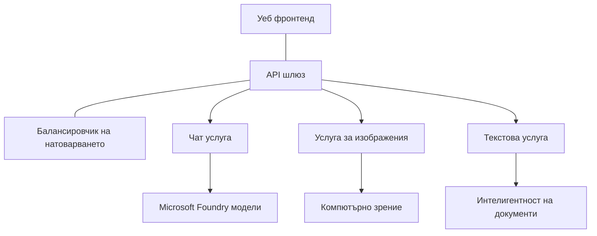

# Най-добри практики за продукционни AI натоварвания с AZD

**Навигация в главата:**
- **📚 Начало на курса**: [AZD За начинаещи](../../README.md)
- **📖 Текуща глава**: Глава 8 - Производствени и корпоративни модели
- **⬅️ Предишна глава**: [Глава 7: Отстраняване на неизправности](../chapter-07-troubleshooting/debugging.md)
- **⬅️ Също свързано**: [AI Workshop Lab](ai-workshop-lab.md)
- **🎯 Курсът е завършен**: [AZD За начинаещи](../../README.md)

## Преглед

Това ръководство предоставя изчерпателни най-добри практики за внедряване на продукционни AI натоварвания с помощта на Azure Developer CLI (AZD). Въз основа на обратната връзка от общността на Microsoft Foundry Discord и реалните внедрения на клиенти, тези практики адресират най-честите предизвикателства в продукционните AI системи.

## Основни предизвикателства, които се разглеждат

Според резултатите от нашата общностна анкета, това са основните предизвикателства, с които се сблъскват разработчиците:

- **45%** имат затруднения с многослойни AI внедрения
- **38%** имат проблеми с управлението на идентификационни данни и секрети  
- **35%** намират подготовката за продукция и мащабиране за трудни
- **32%** се нуждаят от по-добри стратегии за оптимизация на разходите
- **29%** изискват подобрен мониторинг и отстраняване на неизправности

## Архитектурни модели за продукционен AI

### Модел 1: Микросервизни AI архитектури

**Кога да се използва**: Сложни AI приложения с множество възможности


**Реализация с AZD**:

```yaml
# azure.yaml
name: enterprise-ai-platform
services:
  web:
    project: ./web
    host: staticwebapp
  api-gateway:
    project: ./api-gateway
    host: containerapp
  chat-service:
    project: ./services/chat
    host: containerapp
  vision-service:
    project: ./services/vision
    host: containerapp
  text-service:
    project: ./services/text
    host: containerapp
```

### Модел 2: Събитиен AI процесинг

**Кога да се използва**: Партидни обработки, анализ на документи, асинхронни работни потоци

```bicep
// Event Hub for AI processing pipeline
resource eventHub 'Microsoft.EventHub/namespaces@2023-01-01-preview' = {
  name: eventHubNamespaceName
  location: location
  sku: {
    name: 'Standard'
    tier: 'Standard'
    capacity: 1
  }
}

// Service Bus for reliable message processing
resource serviceBus 'Microsoft.ServiceBus/namespaces@2022-10-01-preview' = {
  name: serviceBusNamespaceName
  location: location
  sku: {
    name: 'Premium'
    tier: 'Premium'
    capacity: 1
  }
}

// Function App for processing
resource functionApp 'Microsoft.Web/sites@2023-01-01' = {
  name: functionAppName
  location: location
  kind: 'functionapp,linux'
  properties: {
    siteConfig: {
      appSettings: [
        {
          name: 'FUNCTIONS_EXTENSION_VERSION'
          value: '~4'
        }
        {
          name: 'AZURE_OPENAI_ENDPOINT'
          value: '@Microsoft.KeyVault(VaultName=${keyVault.name};SecretName=openai-endpoint)'
        }
      ]
    }
  }
}
```

## Размисли за здравето на AI агента

Когато традиционно уеб приложение се повреди, симптомите са познати: страница не се зарежда, API връща грешка или внедряването се проваля. AI-захранваните приложения могат да се повредят по същите начини—но също така могат да се държат по-неуловимо, без да генерират явни съобщения за грешки.

Този раздел ви помага да изградите умствен модел за мониторинг на AI натоварвания, за да знаете къде да търсите, когато нещо изглежда нередно.

### Как здравето на агента се различава от здравето на традиционно приложение

Традиционното приложение или работи, или не. AI агентът може да изглежда, че работи, но да произвежда слаби резултати. Разгледайте здравето на агента на два слоя:

| Слой | Какво да наблюдавате | Къде да търсите |
|-------|--------------|---------------|
| **Здраве на инфраструктурата** | Сървисът работи ли? Ресурсите осигурени ли са? Ендпойнтите достижими ли са? | `azd monitor`, здраве на ресурси в Azure Portal, контейнер/логове на приложения |
| **Здраве на поведението** | Агентът отговаря ли точно? Отговорите навреме ли са? Моделът вика ли се правилно? | Application Insights трасирания, метрики за латентност на повиквания към модела, логове за качество на отговора |

Здравето на инфраструктурата е познато—същото е за всяко azd приложение. Здравето на поведението е новият слой, който AI натоварванията въвеждат.

### Къде да търсите, когато AI приложения не се държат според очакванията

Ако вашето AI приложение не произвежда очакваните резултати, ето концептуален контролен списък:

1. **Започнете с основното.** Работи ли приложението? Може ли да достигне зависимостите си? Проверете `azd monitor` и здравето на ресурсите, както бихте направили с всяко приложение.
2. **Проверете връзката с модела.** Успешно ли прилага приложението повиквания към AI модела? Неуспешните или изтекли повиквания към модела са най-честата причина за проблеми и ще се покажат в логовете на приложението.
3. **Погледнете какво е получено от модела.** AI отговорите зависят от входа (промпта и който и да е контекст, извлечен). Ако изходът е грешен, обикновено входът е грешен. Проверете дали приложението изпраща правилните данни към модела.
4. **Прегледайте латентността на отговора.** Повикванията към AI модели са по-бавни от типичните API обаждания. Ако приложението се усеща мудно, проверете дали времето за отговор на модела се е увеличило—това може да индикира ограничаване, капацитетни лимити или задръстване на регионално ниво.
5. **Наблюдавайте сигналите за разходи.** Неочаквани скокове в употребата на токени или API повикванията могат да означават цикъл, неправилно конфигуриран промпт или прекомерни опити за повторение.

Не е нужно веднага да владеете инструментите за наблюдение. Ключовото е, че AI приложенията имат допълнителен слой поведение за наблюдение, а вграденото наблюдение на azd (`azd monitor`) ви дава отправна точка за изследване и на двата слоя.

---

## Най-добри практики за сигурност

### 1. Модел за сигурност с нулево доверие (Zero-Trust)

**Стратегия за имплементация**:
- Няма комуникация между услуги без удостоверяване
- Всички API повиквания използват управлявани идентичности
- Мрежова изолация с частни крайни точки
- Контрол на достъпа с най-малко привилегии

```bicep
// Managed Identity for each service
resource chatServiceIdentity 'Microsoft.ManagedIdentity/userAssignedIdentities@2023-01-31' = {
  name: 'chat-service-identity'
  location: location
}

// Role assignments with minimal permissions
resource openAIUserRole 'Microsoft.Authorization/roleAssignments@2022-04-01' = {
  scope: openAIAccount
  name: guid(openAIAccount.id, chatServiceIdentity.id, openAIUserRoleDefinitionId)
  properties: {
    roleDefinitionId: subscriptionResourceId('Microsoft.Authorization/roleDefinitions', '5e0bd9bd-7b93-4f28-af87-19fc36ad61bd')
    principalId: chatServiceIdentity.properties.principalId
    principalType: 'ServicePrincipal'
  }
}
```

### 2. Сигурно управление на тайни

**Модел за интеграция с Key Vault**:

```bicep
// Key Vault with proper access policies
resource keyVault 'Microsoft.KeyVault/vaults@2023-02-01' = {
  name: keyVaultName
  location: location
  properties: {
    tenantId: tenant().tenantId
    sku: {
      family: 'A'
      name: 'premium'  // Use premium for production
    }
    enableRbacAuthorization: true  // Use RBAC instead of access policies
    enablePurgeProtection: true    // Prevent accidental deletion
    enableSoftDelete: true
    softDeleteRetentionInDays: 90
  }
}

// Store all AI service credentials
resource openAIKeySecret 'Microsoft.KeyVault/vaults/secrets@2023-02-01' = {
  parent: keyVault
  name: 'openai-api-key'
  properties: {
    value: openAIAccount.listKeys().key1
    attributes: {
      enabled: true
    }
  }
}
```

### 3. Мрежова сигурност

**Конфигурация на частна крайна точка**:

```bicep
// Virtual Network for AI services
resource virtualNetwork 'Microsoft.Network/virtualNetworks@2023-04-01' = {
  name: vnetName
  location: location
  properties: {
    addressSpace: {
      addressPrefixes: ['10.0.0.0/16']
    }
    subnets: [
      {
        name: 'ai-services-subnet'
        properties: {
          addressPrefix: '10.0.1.0/24'
          privateEndpointNetworkPolicies: 'Disabled'
        }
      }
      {
        name: 'app-services-subnet'
        properties: {
          addressPrefix: '10.0.2.0/24'
          delegations: [
            {
              name: 'Microsoft.Web/serverFarms'
              properties: {
                serviceName: 'Microsoft.Web/serverFarms'
              }
            }
          ]
        }
      }
    ]
  }
}

// Private endpoints for all AI services
resource openAIPrivateEndpoint 'Microsoft.Network/privateEndpoints@2023-04-01' = {
  name: '${openAIAccountName}-pe'
  location: location
  properties: {
    subnet: {
      id: virtualNetwork.properties.subnets[0].id
    }
    privateLinkServiceConnections: [
      {
        name: 'openai-connection'
        properties: {
          privateLinkServiceId: openAIAccount.id
          groupIds: ['account']
        }
      }
    ]
  }
}
```

## Производителност и мащабиране

### 1. Стратегии за автоматично мащабиране

**Автоматично мащабиране на контейнерни приложения**:

```bicep
resource containerApp 'Microsoft.App/containerApps@2023-05-01' = {
  name: containerAppName
  location: location
  properties: {
    configuration: {
      ingress: {
        external: true
        targetPort: 8000
        transport: 'http'
      }
    }
    template: {
      scale: {
        minReplicas: 2  // Always have 2 instances minimum
        maxReplicas: 50 // Scale up to 50 for high load
        rules: [
          {
            name: 'http-scaling'
            http: {
              metadata: {
                concurrentRequests: '20'  // Scale when >20 concurrent requests
              }
            }
          }
          {
            name: 'cpu-scaling'
            custom: {
              type: 'cpu'
              metadata: {
                type: 'Utilization'
                value: '70'  // Scale when CPU >70%
              }
            }
          }
        ]
      }
    }
  }
}
```

### 2. Стратегии за кеширане

**Redis кеш за AI отговори**:

```bicep
// Redis Premium for production workloads
resource redisCache 'Microsoft.Cache/redis@2023-04-01' = {
  name: redisCacheName
  location: location
  properties: {
    sku: {
      name: 'Premium'
      family: 'P'
      capacity: 1
    }
    enableNonSslPort: false
    minimumTlsVersion: '1.2'
    redisConfiguration: {
      'maxmemory-policy': 'allkeys-lru'
    }
    // Enable clustering for high availability
    redisVersion: '6.0'
    shardCount: 2
  }
}

// Cache configuration in application
var cacheConnectionString = '${redisCache.properties.hostName}:6380,password=${redisCache.listKeys().primaryKey},ssl=True,abortConnect=False'
```

### 3. Баланс на натоварването и управление на трафика

**Application Gateway с WAF**:

```bicep
// Application Gateway with Web Application Firewall
resource applicationGateway 'Microsoft.Network/applicationGateways@2023-04-01' = {
  name: appGatewayName
  location: location
  properties: {
    sku: {
      name: 'WAF_v2'
      tier: 'WAF_v2'
      capacity: 2
    }
    webApplicationFirewallConfiguration: {
      enabled: true
      firewallMode: 'Prevention'
      ruleSetType: 'OWASP'
      ruleSetVersion: '3.2'
    }
    // Backend pools for AI services
    backendAddressPools: [
      {
        name: 'ai-services-pool'
        properties: {
          backendAddresses: [
            {
              fqdn: '${containerApp.properties.configuration.ingress.fqdn}'
            }
          ]
        }
      }
    ]
  }
}
```

## 💰 Оптимизация на разходите

### 1. Правилно оразмеряване на ресурсите

**Конфигурации за специфична среда**:

```bash
# Среда за разработка
azd env new development
azd env set AZURE_OPENAI_SKU "S0"
azd env set AZURE_OPENAI_CAPACITY 10
azd env set AZURE_SEARCH_SKU "basic"
azd env set CONTAINER_CPU 0.5
azd env set CONTAINER_MEMORY 1.0

# Производствена среда
azd env new production
azd env set AZURE_OPENAI_SKU "S0"
azd env set AZURE_OPENAI_CAPACITY 100
azd env set AZURE_SEARCH_SKU "standard"
azd env set CONTAINER_CPU 2.0
azd env set CONTAINER_MEMORY 4.0
```

### 2. Мониторинг на разходи и бюджети

```bicep
// Cost management and budgets
resource budget 'Microsoft.Consumption/budgets@2023-05-01' = {
  name: 'ai-workload-budget'
  properties: {
    timePeriod: {
      startDate: '2024-01-01'
      endDate: '2024-12-31'
    }
    timeGrain: 'Monthly'
    amount: 2000  // $2000 monthly budget
    category: 'Cost'
    notifications: {
      warning: {
        enabled: true
        operator: 'GreaterThan'
        threshold: 80
        contactEmails: [
          'finance@company.com'
          'engineering@company.com'
        ]
        contactRoles: [
          'Owner'
          'Contributor'
        ]
      }
      critical: {
        enabled: true
        operator: 'GreaterThan'
        threshold: 95
        contactEmails: [
          'cto@company.com'
        ]
      }
    }
  }
}
```

### 3. Оптимизация на употребата на токени

**Управление на разходите в OpenAI**:

```typescript
// Оптимизация на токените на ниво приложение
class TokenOptimizer {
  private readonly maxTokens = 4000;
  private readonly reserveTokens = 500;
  
  optimizePrompt(userInput: string, context: string): string {
    const availableTokens = this.maxTokens - this.reserveTokens;
    const estimatedTokens = this.estimateTokens(userInput + context);
    
    if (estimatedTokens > availableTokens) {
      // Отсечете контекста, а не потребителския вход
      context = this.truncateContext(context, availableTokens - this.estimateTokens(userInput));
    }
    
    return `${context}\n\nUser: ${userInput}`;
  }
  
  private estimateTokens(text: string): number {
    // Приблизителна оценка: 1 токен ≈ 4 знака
    return Math.ceil(text.length / 4);
  }
}
```

## Мониторинг и наблюдаемост

### 1. Изчерпателен Application Insights

```bicep
// Application Insights with advanced features
resource applicationInsights 'Microsoft.Insights/components@2020-02-02' = {
  name: applicationInsightsName
  location: location
  kind: 'web'
  properties: {
    Application_Type: 'web'
    WorkspaceResourceId: logAnalyticsWorkspace.id
    SamplingPercentage: 100  // Full sampling for AI apps
    DisableIpMasking: false  // Enable for security
  }
}

// Custom metrics for AI operations
resource aiMetricAlerts 'Microsoft.Insights/metricAlerts@2018-03-01' = {
  name: 'ai-high-error-rate'
  location: 'global'
  properties: {
    description: 'Alert when AI service error rate is high'
    severity: 2
    enabled: true
    scopes: [
      applicationInsights.id
    ]
    evaluationFrequency: 'PT1M'
    windowSize: 'PT5M'
    criteria: {
      'odata.type': 'Microsoft.Azure.Monitor.SingleResourceMultipleMetricCriteria'
      allOf: [
        {
          name: 'high-error-rate'
          metricName: 'requests/failed'
          operator: 'GreaterThan'
          threshold: 10
          timeAggregation: 'Count'
        }
      ]
    }
  }
}
```

### 2. AI-специфичен мониторинг

**Потребителски табла за AI метрики**:

```json
// Dashboard configuration for AI workloads
{
  "dashboard": {
    "name": "AI Application Monitoring",
    "tiles": [
      {
        "name": "OpenAI Request Volume",
        "query": "requests | where name contains 'openai' | summarize count() by bin(timestamp, 5m)"
      },
      {
        "name": "AI Response Latency",
        "query": "requests | where name contains 'openai' | summarize avg(duration) by bin(timestamp, 5m)"
      },
      {
        "name": "Token Usage",
        "query": "customMetrics | where name == 'openai_tokens_used' | summarize sum(value) by bin(timestamp, 1h)"
      },
      {
        "name": "Cost per Hour",
        "query": "customMetrics | where name == 'openai_cost' | summarize sum(value) by bin(timestamp, 1h)"
      }
    ]
  }
}
```

### 3. Проверки на здравето и мониторинг на работоспособността

```bicep
// Application Insights availability tests
resource availabilityTest 'Microsoft.Insights/webtests@2022-06-15' = {
  name: 'ai-app-availability-test'
  location: location
  tags: {
    'hidden-link:${applicationInsights.id}': 'Resource'
  }
  properties: {
    SyntheticMonitorId: 'ai-app-availability-test'
    Name: 'AI Application Availability Test'
    Description: 'Tests AI application endpoints'
    Enabled: true
    Frequency: 300  // 5 minutes
    Timeout: 120    // 2 minutes
    Kind: 'ping'
    Locations: [
      {
        Id: 'us-east-2-azr'
      }
      {
        Id: 'us-west-2-azr'
      }
    ]
    Configuration: {
      WebTest: '''
        <WebTest Name="AI Health Check" 
                 Id="8d2de8d2-a2b0-4c2e-9a0d-8f9c9a0b8c8d" 
                 Enabled="True" 
                 CssProjectStructure="" 
                 CssIteration="" 
                 Timeout="120" 
                 WorkItemIds="" 
                 xmlns="http://microsoft.com/schemas/VisualStudio/TeamTest/2010" 
                 Description="" 
                 CredentialUserName="" 
                 CredentialPassword="" 
                 PreAuthenticate="True" 
                 Proxy="default" 
                 StopOnError="False" 
                 RecordedResultFile="" 
                 ResultsLocale="">
          <Items>
            <Request Method="GET" 
                     Guid="a5f10126-e4cd-570d-961c-cea43999a200" 
                     Version="1.1" 
                     Url="${webApp.properties.defaultHostName}/health" 
                     ThinkTime="0" 
                     Timeout="120" 
                     ParseDependentRequests="True" 
                     FollowRedirects="True" 
                     RecordResult="True" 
                     Cache="False" 
                     ResponseTimeGoal="0" 
                     Encoding="utf-8" 
                     ExpectedHttpStatusCode="200" 
                     ExpectedResponseUrl="" 
                     ReportingName="" 
                     IgnoreHttpStatusCode="False" />
          </Items>
        </WebTest>
      '''
    }
  }
}
```

## Възстановяване при бедствия и висока наличност

### 1. Многорегионално внедряване

```yaml
# azure.yaml - Multi-region configuration
name: ai-app-multiregion
services:
  api-primary:
    project: ./api
    host: containerapp
    env:
      - AZURE_REGION=eastus
  api-secondary:
    project: ./api
    host: containerapp
    env:
      - AZURE_REGION=westus2
```

```bicep
// Traffic Manager for global load balancing
resource trafficManager 'Microsoft.Network/trafficManagerProfiles@2022-04-01' = {
  name: trafficManagerProfileName
  location: 'global'
  properties: {
    profileStatus: 'Enabled'
    trafficRoutingMethod: 'Priority'
    dnsConfig: {
      relativeName: trafficManagerProfileName
      ttl: 30
    }
    monitorConfig: {
      protocol: 'HTTPS'
      port: 443
      path: '/health'
      intervalInSeconds: 30
      toleratedNumberOfFailures: 3
      timeoutInSeconds: 10
    }
    endpoints: [
      {
        name: 'primary-endpoint'
        type: 'Microsoft.Network/trafficManagerProfiles/azureEndpoints'
        properties: {
          targetResourceId: primaryAppService.id
          endpointStatus: 'Enabled'
          priority: 1
        }
      }
      {
        name: 'secondary-endpoint'
        type: 'Microsoft.Network/trafficManagerProfiles/azureEndpoints'
        properties: {
          targetResourceId: secondaryAppService.id
          endpointStatus: 'Enabled'
          priority: 2
        }
      }
    ]
  }
}
```

### 2. Архивиране и възстановяване на данни

```bicep
// Backup configuration for critical data
resource backupVault 'Microsoft.DataProtection/backupVaults@2023-05-01' = {
  name: backupVaultName
  location: location
  identity: {
    type: 'SystemAssigned'
  }
  properties: {
    storageSettings: [
      {
        datastoreType: 'VaultStore'
        type: 'LocallyRedundant'
      }
    ]
  }
}

// Backup policy for AI models and data
resource backupPolicy 'Microsoft.DataProtection/backupVaults/backupPolicies@2023-05-01' = {
  parent: backupVault
  name: 'ai-data-backup-policy'
  properties: {
    policyRules: [
      {
        backupParameters: {
          backupType: 'Full'
          objectType: 'AzureBackupParams'
        }
        trigger: {
          schedule: {
            repeatingTimeIntervals: [
              'R/2024-01-01T02:00:00+00:00/P1D'  // Daily at 2 AM
            ]
          }
          objectType: 'ScheduleBasedTriggerContext'
        }
        dataStore: {
          datastoreType: 'VaultStore'
          objectType: 'DataStoreInfoBase'
        }
        name: 'BackupDaily'
        objectType: 'AzureBackupRule'
      }
    ]
  }
}
```

## DevOps и CI/CD интеграция

### 1. Работен поток на GitHub Actions

```yaml
# .github/workflows/deploy-ai-app.yml
name: Deploy AI Application

on:
  push:
    branches: [main]
  pull_request:
    branches: [main]

jobs:
  test:
    runs-on: ubuntu-latest
    steps:
      - uses: actions/checkout@v4
      
      - name: Setup Python
        uses: actions/setup-python@v4
        with:
          python-version: '3.11'
          
      - name: Install dependencies
        run: |
          pip install -r requirements.txt
          pip install pytest
          
      - name: Run tests
        run: pytest tests/
        
      - name: AI Safety Tests
        run: |
          python scripts/test_ai_safety.py
          python scripts/validate_prompts.py

  deploy-staging:
    needs: test
    if: github.event_name == 'pull_request'
    runs-on: ubuntu-latest
    steps:
      - uses: actions/checkout@v4
      
      - name: Setup AZD
        uses: Azure/setup-azd@v2
        
      - name: Login to Azure
        uses: azure/login@v1
        with:
          creds: ${{ secrets.AZURE_CREDENTIALS }}
          
      - name: Deploy to Staging
        run: |
          azd env select staging
          azd deploy

  deploy-production:
    needs: test
    if: github.ref == 'refs/heads/main'
    runs-on: ubuntu-latest
    steps:
      - uses: actions/checkout@v4
      
      - name: Setup AZD
        uses: Azure/setup-azd@v2
        
      - name: Login to Azure
        uses: azure/login@v1
        with:
          creds: ${{ secrets.AZURE_CREDENTIALS }}
          
      - name: Deploy to Production
        run: |
          azd env select production
          azd deploy
          
      - name: Run Production Health Checks
        run: |
          python scripts/health_check.py --env production
```

### 2. Валидация на инфраструктурата

```bash
# scripts/validate_infrastructure.sh
#!/bin/bash

echo "Validating AI infrastructure deployment..."

# Проверете дали всички необходими услуги работят
services=("openai" "search" "storage" "keyvault")
for service in "${services[@]}"; do
    echo "Checking $service..."
    if ! az resource list --resource-type "Microsoft.CognitiveServices/accounts" --query "[?contains(name, '$service')]" -o tsv; then
        echo "ERROR: $service not found"
        exit 1
    fi
done

# Валидирайте разгръщанията на моделите на OpenAI
echo "Validating OpenAI model deployments..."
models=$(az cognitiveservices account deployment list --name $AZURE_OPENAI_NAME --resource-group $AZURE_RESOURCE_GROUP --query "[].name" -o tsv)
if [[ ! $models == *"gpt-4.1-mini"* ]]; then
  echo "ERROR: Required model gpt-4.1-mini not deployed"
    exit 1
fi

# Тествайте свързаността на AI услугата
echo "Testing AI service connectivity..."
python scripts/test_connectivity.py

echo "Infrastructure validation completed successfully!"
```

## Контролен списък за готовност за продукция

### Сигурност ✅
- [ ] Всички услуги използват управлявани идентичности
- [ ] Тайни съхранявани в Key Vault
- [ ] Конфигурирани частни крайни точки
- [ ] Внедрени мрежови сигурностни групи
- [ ] RBAC с най-малко привилегии
- [ ] WAF активиран на публични крайни точки

### Производителност ✅
- [ ] Конфигурирано авто-мащабиране
- [ ] Внедрено кеширане
- [ ] Настроено балансиране на натоварването
- [ ] CDN за статично съдържание
- [ ] Пул на връзки към база данни
- [ ] Оптимизация на употребата на токени

### Мониторинг ✅
- [ ] Конфигуриран Application Insights
- [ ] Дефинирани потребителски метрики
- [ ] Настроени правила за алармиране
- [ ] Създадено табло
- [ ] Внедрени проверки на здравето
- [ ] Политики за задържане на логове

### Надеждност ✅
- [ ] Многорегионално внедряване
- [ ] План за архивиране и възстановяване
- [ ] Внедрени circuit breakers
- [ ] Конфигурирани retry политики
- [ ] Грациозно деградиране
- [ ] Ендпойнти за здравен чек

### Управление на разходите ✅
- [ ] Конфигурирани бюджетни аларми
- [ ] Правилно оразмеряване на ресурсите
- [ ] Приложени отстъпки за разработка/тест
- [ ] Закупени резервирани инстанции
- [ ] Табло за мониторинг на разходи
- [ ] Редовни прегледи на разходите

### Съответствие ✅
- [ ] Спазване на изисквания за местоположение на данните
- [ ] Включено одитно логване
- [ ] Приложени политики за съответствие
- [ ] Внедрени базови политики за сигурност
- [ ] Редовни оценки на сигурността
- [ ] План за реагиране при инциденти

## Показатели за производителност

### Типични производствени метрики

| Метрика | Цел | Мониторинг |
|--------|--------|------------|
| **Време за отговор** | < 2 секунди | Application Insights |
| **Достъпност** | 99.9% | Мониторинг на наличност |
| **Процент грешки** | < 0.1% | Логове на приложения |
| **Употреба на токени** | < $500/месец | Управление на разходи |
| **Паралелни потребители** | 1000+ | Тестове за натоварване |
| **Време за възстановяване** | < 1 час | Тестове за възстановяване след бедствия |

### Тестове за натоварване

```bash
# Скрипт за натоварващо тестване на AI приложения
python scripts/load_test.py \
  --endpoint https://your-ai-app.azurewebsites.net \
  --concurrent-users 100 \
  --duration 300 \
  --ramp-up 60
```

## 🤝 Най-добри практики в общността

Въз основа на обратната връзка от общността на Microsoft Foundry Discord:

### Топ препоръки от общността:

1. **Започнете с малко, мащабирайте постепенно**: Започнете с базови SKU-та и разгъвайте според реалната употреба
2. **Мониторирайте всичко**: Настройте обширен мониторинг още от първия ден
3. **Автоматизирайте сигурността**: Използвайте инфраструктура като код за последователна сигурност
4. **Тествайте обстойно**: Включете AI-специфично тестване в pipeline-а си
5. **Планирайте разходите**: Следете употребата на токени и настройте бюджетни аларми рано

### Често допускани грешки, които да избегнете:

- ❌ Втвърдяване на API ключове в кода
- ❌ Липса на подходящ мониторинг
- ❌ Игнориране на оптимизация на разходите
- ❌ Липса на тестове при откази
- ❌ Внедряване без проверки на здравето

## Команди и разширения на AZD AI CLI

AZD включва разрастващ се набор от AI-специфични команди и разширения, които опростяват продукционните AI работни потоци. Тези инструменти свързват локалната разработка и продукционното внедряване за AI натоварвания.

### AI разширения за AZD

AZD използва система за разширения за добавяне на AI-специфични възможности. Инсталирайте и управлявайте разширения с:

```bash
# Изброяване на всички налични разширения (включително AI)
azd extension list

# Преглед на подробности за инсталирано разширение
azd extension show azure.ai.agents

# Инсталиране на разширението за агенти на Foundry
azd extension install azure.ai.agents

# Инсталиране на разширението за финно настройване
azd extension install azure.ai.finetune

# Инсталиране на разширението за персонализирани модели
azd extension install azure.ai.models

# Надграждане на всички инсталирани разширения
azd extension upgrade --all
```

**Налични AI разширения:**

| Разширение | Цел | Статус |
|-----------|---------|--------|
| `azure.ai.agents` | Управление на Foundry Agent Service | Преглед |
| `azure.ai.finetune` | Финна настройка на Foundry модел | Преглед |
| `azure.ai.models` | Персонализирани модели на Foundry | Преглед |
| `azure.coding-agent` | Конфигурация на coding агент | Наличен |

### Инициализация на агентски проекти с `azd ai agent init`

Командата `azd ai agent init` скелетира продукционен AI агент проект, интегриран с Microsoft Foundry Agent Service:

```bash
# Инициализиране на нов проект за агент от манифест на агент
azd ai agent init -m <manifest-path-or-uri>

# Инициализиране и насочване към конкретен проект на Foundry
azd ai agent init -m agent-manifest.yaml --project-id <foundry-project-id>

# Инициализиране с персонална директория за изходен код
azd ai agent init -m agent-manifest.yaml --src ./agents/my-agent

# Насочване към Container Apps като хост
azd ai agent init -m agent-manifest.yaml --host containerapp
```

**Основни флагове:**

| Флаг | Описание |
|------|-------------|
| `-m, --manifest` | Път или URI към агентски манифест за добавяне към проекта |
| `-p, --project-id` | Съществуващ Microsoft Foundry Project ID за вашата azd среда |
| `-s, --src` | Директория за сваляне на дефиницията на агента (по подразбиране `src/<agent-id>`) |
| `--host` | Презаписване на стандартния хост (например `containerapp`) |
| `-e, --environment` | Използваната азд среда |

**Съвет за продукция**: Използвайте `--project-id`, за да се свържете директно със съществуващ Foundry проект, като така държите кода на агента и облачните ресурси свързани от самото начало.

### Протокол за контекст на модела (MCP) с `azd mcp`

AZD включва вградена поддръжка на MCP сървър (Alpha), която позволява на AI агенти и инструменти да взаимодействат с вашите Azure ресурси чрез стандартизиран протокол:

```bash
# Стартирайте MCP сървъра за вашия проект
azd mcp start

# Прегледайте текущите правила за съгласие на Copilot за изпълнение на инструменти
azd copilot consent list
```

MCP сървърът разкрива контекста на вашия azd проект—средите, услугите и Azure ресурсите—към AI-захранваните инструменти за разработка. Това позволява:

- **AI подпомогнато внедряване**: Позволете на coding агенти да запитват състоянието на проекта и да инициират внедряване
- **Откриване на ресурси**: AI инструменти могат да откриват какви Azure ресурси използва вашият проект
- **Управление на среди**: Агентите могат да превключват между dev/staging/production среди

### Генериране на инфраструктура с `azd infra generate`

За продукционни AI натоварвания можете да генерирате и персонализирате инфраструктура като код, вместо да разчитате на автоматично осигуряване:

```bash
# Генерирайте Bicep/Terraform файлове от вашето проектно определение
azd infra generate
```

Тази команда записва IaC на диск, за да можете:
- Да прегледате и одитирате инфраструктурата преди внедряване
- Да добавите персонализирани политики за сигурност (мрежови правила, частни крайни точки)
- Да интегрирате с процесите за преглед на IaC
- Да контролирате версиите на инфраструктурни промени отделно от приложния код

### Hooks за жизнения цикъл на продукцията

AZD hooks ви позволяват да инжектирате персонализирана логика на всеки етап от жизнения цикъл на внедряване—критично за продукционни AI работни потоци:

```yaml
# azure.yaml - Production hooks example
name: ai-production-app
hooks:
  preprovision:
    shell: sh
    run: scripts/validate-quotas.sh    # Check AI model quota before provisioning
  postprovision:
    shell: sh
    run: scripts/configure-networking.sh  # Set up private endpoints
  predeploy:
    shell: sh
    run: scripts/run-ai-safety-tests.sh  # Run prompt safety checks
  postdeploy:
    shell: sh
    run: scripts/smoke-test.sh           # Verify agent responses post-deploy
services:
  agent-api:
    project: ./src/agent
    host: containerapp
    hooks:
      predeploy:
        shell: sh
        run: scripts/validate-model-access.sh  # Per-service hook
```

```bash
# Стартирайте конкретен куки ръчно по време на разработка
azd hooks run predeploy
```

**Препоръчани hooks за продукционни AI натоварвания:**

| Hook | Употреба |
|------|----------|
| `preprovision` | Валидация на квоти на абонамента за капацитет на AI модела |
| `postprovision` | Конфигуриране на частни крайни точки, внедряване на тежести на модели |
| `predeploy` | Изпълнение на AI safety тестове, валидация на шаблони за промпти |
| `postdeploy` | Бързи тестове на отговорите на агента, проверка на връзката с модела |

### Конфигурация на CI/CD pipeline

Използвайте `azd pipeline config` за свързване на проекта си с GitHub Actions или Azure Pipelines с безопасна Azure автентикация:

```bash
# Конфигуриране на CI/CD пайплайн (интерактивно)
azd pipeline config

# Конфигуриране с конкретен доставчик
azd pipeline config --provider github
```

Тази команда:
- Създава service principal с най-малко привилегии
- Конфигурира федеративни идентификации (без съхранени тайни)
- Генерира или актуализира конфигурационния файл на pipeline-а
- Задава необходимите променливи на средата във вашата CI/CD система

**Продукционен работен процес със pipeline config:**

```bash
# 1. Настройте продукционна среда
azd env new production
azd env set AZURE_OPENAI_CAPACITY 100

# 2. Конфигурирайте тръбопровода
azd pipeline config --provider github

# 3. Тръбопроводът изпълнява azd deploy при всяко натискане към main
```

### Добавяне на компоненти с `azd add`

Добавяйте постепенно Azure услуги към съществуващ проект:

```bash
# Добавете нов компонент на услугата интерактивно
azd add
```

Това е особено полезно за разширяване на продукционни AI приложения—например добавяне на векторна услуги за търсене, нов модел агент ендпойнт или мониторинг компонент към вече внедрено приложение.

## Допълнителни ресурси
- **Azure Well-Architected Framework**: [Указания за AI работни натоварвания](https://learn.microsoft.com/azure/well-architected/ai/)
- **Microsoft Foundry Documentation**: [Официална документация](https://learn.microsoft.com/azure/ai-studio/)
- **Community Templates**: [Azure Примери](https://github.com/Azure-Samples)
- **Discord Community**: [#Azure канал](https://discord.gg/microsoft-azure)
- **Agent Skills for Azure**: [microsoft/github-copilot-for-azure on skills.sh](https://skills.sh/microsoft/github-copilot-for-azure) - 37 отворени умения за агенти за Azure AI, Foundry, деплоймънт, оптимизация на разходи и диагностика. Инсталирайте във вашия редактор:
  ```bash
  npx skills add microsoft/github-copilot-for-azure
  ```

---

**Глава Навигация:**
- **📚 Начало на курса**: [AZD За начинаещи](../../README.md)
- **📖 Текуща глава**: Глава 8 - Производствени & Предприятни модели
- **⬅️ Предишна глава**: [Глава 7: Отстраняване на грешки](../chapter-07-troubleshooting/debugging.md)
- **⬅️ Също свързано**: [AI Workshop Lab](ai-workshop-lab.md)
- **� Курс завършен**: [AZD За начинаещи](../../README.md)

**Запомнете**: Производствените AI работни натоварвания изискват внимателно планиране, наблюдение и непрекъсната оптимизация. Започнете с тези модели и ги адаптирайте към вашите специфични изисквания.

---

<!-- CO-OP TRANSLATOR DISCLAIMER START -->
**Отказ от отговорност**:  
Този документ е преведен с помощта на AI преводаческа услуга [Co-op Translator](https://github.com/Azure/co-op-translator). Въпреки че се стремим към точност, моля имайте предвид, че автоматизираните преводи може да съдържат грешки или неточности. Оригиналният документ на неговия оригинален език трябва да се счита за авторитетен източник. За критична информация се препоръчва професионален човешки превод. Не носим отговорност за каквито и да е недоразумения или неправилни тълкувания, произтичащи от използването на този превод.
<!-- CO-OP TRANSLATOR DISCLAIMER END -->