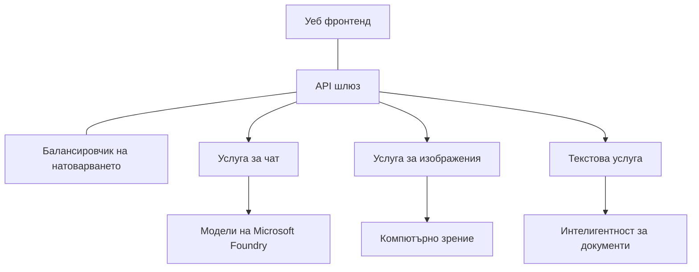

# Най-добри практики за производствено натоварване на AI с AZD

**Навигация в главата:**
- **📚 Начало на курса**: [AZD за начинаещи](../../README.md)
- **📖 Текуща глава**: Глава 8 - Производствени и корпоративни модели
- **⬅️ Предишна глава**: [Глава 7: Отстраняване на неизправности](../chapter-07-troubleshooting/debugging.md)
- **⬅️ Също свързано**: [AI Workshop Lab](ai-workshop-lab.md)
- **🎯 Краят на курса**: [AZD за начинаещи](../../README.md)

## Преглед

Това ръководство предоставя изчерпателни най-добри практики за внедряване на готови за производство AI натоварвания с помощта на Azure Developer CLI (AZD). Въз основа на обратната връзка от общността Microsoft Foundry в Discord и реални внедрявания при клиенти, тези практики адресират най-често срещаните предизвикателства в производствените AI системи.

## Ключови предизвикателства

Въз основа на резултатите от нашата анкета в общността, това са основните предизвикателства, пред които са изправени разработчиците:

- **45%** имат затруднения с разгръщане на AI с множество услуги
- **38%** имат проблеми с управлението на идентификационни данни и тайни  
- **35%** намират подготовката за продукция и мащабирането за трудни
- **32%** се нуждаят от по-добри стратегии за оптимизация на разходите
- **29%** изискват подобрено наблюдение и отстраняване на неизправности

## Архитектурни модели за производствен AI

### Модел 1: Микросервизна AI архитектура

**Кога да се използва**: Сложни AI приложения с множество възможности



**Реализация в AZD**:

```yaml
# azure.yaml
name: enterprise-ai-platform
services:
  web:
    project: ./web
    host: staticwebapp
  api-gateway:
    project: ./api-gateway
    host: containerapp
  chat-service:
    project: ./services/chat
    host: containerapp
  vision-service:
    project: ./services/vision
    host: containerapp
  text-service:
    project: ./services/text
    host: containerapp
```

### Модел 2: Събитийно-управлявана AI обработка

**Кога да се използва**: Партична обработка, анализ на документи, асинхронни работни потоци

```bicep
// Event Hub for AI processing pipeline
resource eventHub 'Microsoft.EventHub/namespaces@2023-01-01-preview' = {
  name: eventHubNamespaceName
  location: location
  sku: {
    name: 'Standard'
    tier: 'Standard'
    capacity: 1
  }
}

// Service Bus for reliable message processing
resource serviceBus 'Microsoft.ServiceBus/namespaces@2022-10-01-preview' = {
  name: serviceBusNamespaceName
  location: location
  sku: {
    name: 'Premium'
    tier: 'Premium'
    capacity: 1
  }
}

// Function App for processing
resource functionApp 'Microsoft.Web/sites@2023-01-01' = {
  name: functionAppName
  location: location
  kind: 'functionapp,linux'
  properties: {
    siteConfig: {
      appSettings: [
        {
          name: 'FUNCTIONS_EXTENSION_VERSION'
          value: '~4'
        }
        {
          name: 'AZURE_OPENAI_ENDPOINT'
          value: '@Microsoft.KeyVault(VaultName=${keyVault.name};SecretName=openai-endpoint)'
        }
      ]
    }
  }
}
```

## Разглеждане на здравето на AI агентите

Когато традиционно уеб приложение спре да работи, симптомите са познати: една страница не се зарежда, API връща грешка или разгръщането се проваля. AI-захранваните приложения могат да се повредят по всички тези същите начини — но също така могат да се държат неправилно по по-фини начини, които не произвеждат очевидни съобщения за грешки.

Този раздел ви помага да изградите ментален модел за наблюдение на AI натоварвания, така че да знаете къде да търсите, когато нещо не е наред.

### Как здравето на агентите се различава от здравето на традиционните приложения

Традиционното приложение или работи, или не. AI агентът може да изглежда, че работи, но да дава лоши резултати. Мислете за здравето на агента в два слоя:

| Слой | Какво да наблюдавате | Къде да търсите |
|-------|--------------|---------------|
| **Здраве на инфраструктурата** | Работи ли услугата? Осигурени ли са ресурсите? Достъпни ли са крайните точки? | `azd monitor`, състоянието на ресурса в Azure Portal, логове на контейнера/приложението |
| **Здраве на поведението** | Отговаря ли агентът точно? Отговарят ли отговорите навреме? Извиква ли се моделът правилно? | Проследявания в Application Insights, метрики за латентността на повиквания към модел, логове за качество на отговорите |

Здравето на инфраструктурата е познато — то е същото за всяко azd приложение. Здравето на поведението е новият слой, който въвеждат AI натоварванията.

### Къде да търсите, когато AI приложенията не се държат както се очаква

Ако вашето AI приложение не произвежда очакваните резултати, ето един концептуален контролен списък:

1. **Започнете с основите.** Работи ли приложението? Може ли да достигне зависимостите си? Проверете `azd monitor` и състоянието на ресурсите, както бихте направили за всяко приложение.
2. **Проверете връзката към модела.** Успешно ли приложението ви извиква AI модела? Неуспешни или изтекли повиквания към модела са най-честата причина за проблеми с AI приложенията и ще се покажат в логовете на приложението ви.
3. **Погледнете какво е получил моделът.** AI отговорите зависят от входа (подаването и всеки извлечен контекст). Ако изходът е грешен, входът обикновено е грешен. Проверете дали приложението ви изпраща правилните данни към модела.
4. **Прегледайте латентността на отговорите.** Повикванията към AI моделите са по-бавни от типичните API повиквания. Ако приложението ви се усеща бавно, проверете дали времето за отговор на модела е нараснало — това може да е индикатор за ограничаване, лимити на капацитета или задръстване на регионално ниво.
5. **Наблюдавайте сигналите за разходи.** Неочаквани скокове в използването на токени или API повиквания могат да сигнализират за цикъл, неправилно конфигуриран prompt или прекомерни повторни опити.

Не е нужно да овладеете инструментите за наблюдение веднага. Основният извод е, че AI приложенията имат допълнителен слой поведение за наблюдение, а вграденото наблюдение на azd (`azd monitor`) ви дава отправна точка за разследване на двата слоя.

---

## Най-добри практики за сигурност

### 1. Модел за нулево доверие

**Стратегия за реализация**:
- Никаква комуникация услуга-към-услуга без автентикация
- Всички API повиквания използват управлявани идентичности
- Мрежова изолация с частни крайни точки
- Контроли за достъп с минимални привилегии

```bicep
// Managed Identity for each service
resource chatServiceIdentity 'Microsoft.ManagedIdentity/userAssignedIdentities@2023-01-31' = {
  name: 'chat-service-identity'
  location: location
}

// Role assignments with minimal permissions
resource openAIUserRole 'Microsoft.Authorization/roleAssignments@2022-04-01' = {
  scope: openAIAccount
  name: guid(openAIAccount.id, chatServiceIdentity.id, openAIUserRoleDefinitionId)
  properties: {
    roleDefinitionId: subscriptionResourceId('Microsoft.Authorization/roleDefinitions', '5e0bd9bd-7b93-4f28-af87-19fc36ad61bd')
    principalId: chatServiceIdentity.properties.principalId
    principalType: 'ServicePrincipal'
  }
}
```

### 2. Сигурно управление на тайни

**Патерн за интеграция с Key Vault**:

```bicep
// Key Vault with proper access policies
resource keyVault 'Microsoft.KeyVault/vaults@2023-02-01' = {
  name: keyVaultName
  location: location
  properties: {
    tenantId: tenant().tenantId
    sku: {
      family: 'A'
      name: 'premium'  // Use premium for production
    }
    enableRbacAuthorization: true  // Use RBAC instead of access policies
    enablePurgeProtection: true    // Prevent accidental deletion
    enableSoftDelete: true
    softDeleteRetentionInDays: 90
  }
}

// Store all AI service credentials
resource openAIKeySecret 'Microsoft.KeyVault/vaults/secrets@2023-02-01' = {
  parent: keyVault
  name: 'openai-api-key'
  properties: {
    value: openAIAccount.listKeys().key1
    attributes: {
      enabled: true
    }
  }
}
```

### 3. Мрежова сигурност

**Конфигурация на частни крайни точки**:

```bicep
// Virtual Network for AI services
resource virtualNetwork 'Microsoft.Network/virtualNetworks@2023-04-01' = {
  name: vnetName
  location: location
  properties: {
    addressSpace: {
      addressPrefixes: ['10.0.0.0/16']
    }
    subnets: [
      {
        name: 'ai-services-subnet'
        properties: {
          addressPrefix: '10.0.1.0/24'
          privateEndpointNetworkPolicies: 'Disabled'
        }
      }
      {
        name: 'app-services-subnet'
        properties: {
          addressPrefix: '10.0.2.0/24'
          delegations: [
            {
              name: 'Microsoft.Web/serverFarms'
              properties: {
                serviceName: 'Microsoft.Web/serverFarms'
              }
            }
          ]
        }
      }
    ]
  }
}

// Private endpoints for all AI services
resource openAIPrivateEndpoint 'Microsoft.Network/privateEndpoints@2023-04-01' = {
  name: '${openAIAccountName}-pe'
  location: location
  properties: {
    subnet: {
      id: virtualNetwork.properties.subnets[0].id
    }
    privateLinkServiceConnections: [
      {
        name: 'openai-connection'
        properties: {
          privateLinkServiceId: openAIAccount.id
          groupIds: ['account']
        }
      }
    ]
  }
}
```

## Производителност и скалиране

### 1. Стратегии за автоматично мащабиране

**Автоматично мащабиране за Container Apps**:

```bicep
resource containerApp 'Microsoft.App/containerApps@2023-05-01' = {
  name: containerAppName
  location: location
  properties: {
    configuration: {
      ingress: {
        external: true
        targetPort: 8000
        transport: 'http'
      }
    }
    template: {
      scale: {
        minReplicas: 2  // Always have 2 instances minimum
        maxReplicas: 50 // Scale up to 50 for high load
        rules: [
          {
            name: 'http-scaling'
            http: {
              metadata: {
                concurrentRequests: '20'  // Scale when >20 concurrent requests
              }
            }
          }
          {
            name: 'cpu-scaling'
            custom: {
              type: 'cpu'
              metadata: {
                type: 'Utilization'
                value: '70'  // Scale when CPU >70%
              }
            }
          }
        ]
      }
    }
  }
}
```

### 2. Стратегии за кеширане

**Redis кеш за AI отговори**:

```bicep
// Redis Premium for production workloads
resource redisCache 'Microsoft.Cache/redis@2023-04-01' = {
  name: redisCacheName
  location: location
  properties: {
    sku: {
      name: 'Premium'
      family: 'P'
      capacity: 1
    }
    enableNonSslPort: false
    minimumTlsVersion: '1.2'
    redisConfiguration: {
      'maxmemory-policy': 'allkeys-lru'
    }
    // Enable clustering for high availability
    redisVersion: '6.0'
    shardCount: 2
  }
}

// Cache configuration in application
var cacheConnectionString = '${redisCache.properties.hostName}:6380,password=${redisCache.listKeys().primaryKey},ssl=True,abortConnect=False'
```

### 3. Балансиране на натоварването и управление на трафика

**Application Gateway с WAF**:

```bicep
// Application Gateway with Web Application Firewall
resource applicationGateway 'Microsoft.Network/applicationGateways@2023-04-01' = {
  name: appGatewayName
  location: location
  properties: {
    sku: {
      name: 'WAF_v2'
      tier: 'WAF_v2'
      capacity: 2
    }
    webApplicationFirewallConfiguration: {
      enabled: true
      firewallMode: 'Prevention'
      ruleSetType: 'OWASP'
      ruleSetVersion: '3.2'
    }
    // Backend pools for AI services
    backendAddressPools: [
      {
        name: 'ai-services-pool'
        properties: {
          backendAddresses: [
            {
              fqdn: '${containerApp.properties.configuration.ingress.fqdn}'
            }
          ]
        }
      }
    ]
  }
}
```

## 💰 Оптимизация на разходите

### 1. Оптимален размер на ресурсите

**Конфигурации специфични за средата**:

```bash
# Среда за разработка
azd env new development
azd env set AZURE_OPENAI_SKU "S0"
azd env set AZURE_OPENAI_CAPACITY 10
azd env set AZURE_SEARCH_SKU "basic"
azd env set CONTAINER_CPU 0.5
azd env set CONTAINER_MEMORY 1.0

# Производствена среда
azd env new production
azd env set AZURE_OPENAI_SKU "S0"
azd env set AZURE_OPENAI_CAPACITY 100
azd env set AZURE_SEARCH_SKU "standard"
azd env set CONTAINER_CPU 2.0
azd env set CONTAINER_MEMORY 4.0
```

### 2. Наблюдение на разходите и бюджети

```bicep
// Cost management and budgets
resource budget 'Microsoft.Consumption/budgets@2023-05-01' = {
  name: 'ai-workload-budget'
  properties: {
    timePeriod: {
      startDate: '2024-01-01'
      endDate: '2024-12-31'
    }
    timeGrain: 'Monthly'
    amount: 2000  // $2000 monthly budget
    category: 'Cost'
    notifications: {
      warning: {
        enabled: true
        operator: 'GreaterThan'
        threshold: 80
        contactEmails: [
          'finance@company.com'
          'engineering@company.com'
        ]
        contactRoles: [
          'Owner'
          'Contributor'
        ]
      }
      critical: {
        enabled: true
        operator: 'GreaterThan'
        threshold: 95
        contactEmails: [
          'cto@company.com'
        ]
      }
    }
  }
}
```

### 3. Оптимизация на използването на токени

**Управление на разходите за OpenAI**:

```typescript
// Оптимизация на токените на ниво приложение
class TokenOptimizer {
  private readonly maxTokens = 4000;
  private readonly reserveTokens = 500;
  
  optimizePrompt(userInput: string, context: string): string {
    const availableTokens = this.maxTokens - this.reserveTokens;
    const estimatedTokens = this.estimateTokens(userInput + context);
    
    if (estimatedTokens > availableTokens) {
      // Съкратете контекста, не входа на потребителя
      context = this.truncateContext(context, availableTokens - this.estimateTokens(userInput));
    }
    
    return `${context}\n\nUser: ${userInput}`;
  }
  
  private estimateTokens(text: string): number {
    // Груба оценка: 1 токен ≈ 4 символа
    return Math.ceil(text.length / 4);
  }
}
```

## Наблюдение и проследимост

### 1. Изчерпателен Application Insights

```bicep
// Application Insights with advanced features
resource applicationInsights 'Microsoft.Insights/components@2020-02-02' = {
  name: applicationInsightsName
  location: location
  kind: 'web'
  properties: {
    Application_Type: 'web'
    WorkspaceResourceId: logAnalyticsWorkspace.id
    SamplingPercentage: 100  // Full sampling for AI apps
    DisableIpMasking: false  // Enable for security
  }
}

// Custom metrics for AI operations
resource aiMetricAlerts 'Microsoft.Insights/metricAlerts@2018-03-01' = {
  name: 'ai-high-error-rate'
  location: 'global'
  properties: {
    description: 'Alert when AI service error rate is high'
    severity: 2
    enabled: true
    scopes: [
      applicationInsights.id
    ]
    evaluationFrequency: 'PT1M'
    windowSize: 'PT5M'
    criteria: {
      'odata.type': 'Microsoft.Azure.Monitor.SingleResourceMultipleMetricCriteria'
      allOf: [
        {
          name: 'high-error-rate'
          metricName: 'requests/failed'
          operator: 'GreaterThan'
          threshold: 10
          timeAggregation: 'Count'
        }
      ]
    }
  }
}
```

### 2. AI-специфично наблюдение

**Персонализирани табла за AI метрики**:

```json
// Dashboard configuration for AI workloads
{
  "dashboard": {
    "name": "AI Application Monitoring",
    "tiles": [
      {
        "name": "OpenAI Request Volume",
        "query": "requests | where name contains 'openai' | summarize count() by bin(timestamp, 5m)"
      },
      {
        "name": "AI Response Latency",
        "query": "requests | where name contains 'openai' | summarize avg(duration) by bin(timestamp, 5m)"
      },
      {
        "name": "Token Usage",
        "query": "customMetrics | where name == 'openai_tokens_used' | summarize sum(value) by bin(timestamp, 1h)"
      },
      {
        "name": "Cost per Hour",
        "query": "customMetrics | where name == 'openai_cost' | summarize sum(value) by bin(timestamp, 1h)"
      }
    ]
  }
}
```

### 3. Проверки на здравето и наблюдение на наличността

```bicep
// Application Insights availability tests
resource availabilityTest 'Microsoft.Insights/webtests@2022-06-15' = {
  name: 'ai-app-availability-test'
  location: location
  tags: {
    'hidden-link:${applicationInsights.id}': 'Resource'
  }
  properties: {
    SyntheticMonitorId: 'ai-app-availability-test'
    Name: 'AI Application Availability Test'
    Description: 'Tests AI application endpoints'
    Enabled: true
    Frequency: 300  // 5 minutes
    Timeout: 120    // 2 minutes
    Kind: 'ping'
    Locations: [
      {
        Id: 'us-east-2-azr'
      }
      {
        Id: 'us-west-2-azr'
      }
    ]
    Configuration: {
      WebTest: '''
        <WebTest Name="AI Health Check" 
                 Id="8d2de8d2-a2b0-4c2e-9a0d-8f9c9a0b8c8d" 
                 Enabled="True" 
                 CssProjectStructure="" 
                 CssIteration="" 
                 Timeout="120" 
                 WorkItemIds="" 
                 xmlns="http://microsoft.com/schemas/VisualStudio/TeamTest/2010" 
                 Description="" 
                 CredentialUserName="" 
                 CredentialPassword="" 
                 PreAuthenticate="True" 
                 Proxy="default" 
                 StopOnError="False" 
                 RecordedResultFile="" 
                 ResultsLocale="">
          <Items>
            <Request Method="GET" 
                     Guid="a5f10126-e4cd-570d-961c-cea43999a200" 
                     Version="1.1" 
                     Url="${webApp.properties.defaultHostName}/health" 
                     ThinkTime="0" 
                     Timeout="120" 
                     ParseDependentRequests="True" 
                     FollowRedirects="True" 
                     RecordResult="True" 
                     Cache="False" 
                     ResponseTimeGoal="0" 
                     Encoding="utf-8" 
                     ExpectedHttpStatusCode="200" 
                     ExpectedResponseUrl="" 
                     ReportingName="" 
                     IgnoreHttpStatusCode="False" />
          </Items>
        </WebTest>
      '''
    }
  }
}
```

## Възстановяване при бедствия и висока наличност

### 1. Разгръщане в множество региони

```yaml
# azure.yaml - Multi-region configuration
name: ai-app-multiregion
services:
  api-primary:
    project: ./api
    host: containerapp
    env:
      - AZURE_REGION=eastus
  api-secondary:
    project: ./api
    host: containerapp
    env:
      - AZURE_REGION=westus2
```

```bicep
// Traffic Manager for global load balancing
resource trafficManager 'Microsoft.Network/trafficManagerProfiles@2022-04-01' = {
  name: trafficManagerProfileName
  location: 'global'
  properties: {
    profileStatus: 'Enabled'
    trafficRoutingMethod: 'Priority'
    dnsConfig: {
      relativeName: trafficManagerProfileName
      ttl: 30
    }
    monitorConfig: {
      protocol: 'HTTPS'
      port: 443
      path: '/health'
      intervalInSeconds: 30
      toleratedNumberOfFailures: 3
      timeoutInSeconds: 10
    }
    endpoints: [
      {
        name: 'primary-endpoint'
        type: 'Microsoft.Network/trafficManagerProfiles/azureEndpoints'
        properties: {
          targetResourceId: primaryAppService.id
          endpointStatus: 'Enabled'
          priority: 1
        }
      }
      {
        name: 'secondary-endpoint'
        type: 'Microsoft.Network/trafficManagerProfiles/azureEndpoints'
        properties: {
          targetResourceId: secondaryAppService.id
          endpointStatus: 'Enabled'
          priority: 2
        }
      }
    ]
  }
}
```

### 2. Архивиране и възстановяване на данни

```bicep
// Backup configuration for critical data
resource backupVault 'Microsoft.DataProtection/backupVaults@2023-05-01' = {
  name: backupVaultName
  location: location
  identity: {
    type: 'SystemAssigned'
  }
  properties: {
    storageSettings: [
      {
        datastoreType: 'VaultStore'
        type: 'LocallyRedundant'
      }
    ]
  }
}

// Backup policy for AI models and data
resource backupPolicy 'Microsoft.DataProtection/backupVaults/backupPolicies@2023-05-01' = {
  parent: backupVault
  name: 'ai-data-backup-policy'
  properties: {
    policyRules: [
      {
        backupParameters: {
          backupType: 'Full'
          objectType: 'AzureBackupParams'
        }
        trigger: {
          schedule: {
            repeatingTimeIntervals: [
              'R/2024-01-01T02:00:00+00:00/P1D'  // Daily at 2 AM
            ]
          }
          objectType: 'ScheduleBasedTriggerContext'
        }
        dataStore: {
          datastoreType: 'VaultStore'
          objectType: 'DataStoreInfoBase'
        }
        name: 'BackupDaily'
        objectType: 'AzureBackupRule'
      }
    ]
  }
}
```

## DevOps и интеграция на CI/CD

### 1. Workflow за GitHub Actions

```yaml
# .github/workflows/deploy-ai-app.yml
name: Deploy AI Application

on:
  push:
    branches: [main]
  pull_request:
    branches: [main]

jobs:
  test:
    runs-on: ubuntu-latest
    steps:
      - uses: actions/checkout@v4
      
      - name: Setup Python
        uses: actions/setup-python@v4
        with:
          python-version: '3.11'
          
      - name: Install dependencies
        run: |
          pip install -r requirements.txt
          pip install pytest
          
      - name: Run tests
        run: pytest tests/
        
      - name: AI Safety Tests
        run: |
          python scripts/test_ai_safety.py
          python scripts/validate_prompts.py

  deploy-staging:
    needs: test
    if: github.event_name == 'pull_request'
    runs-on: ubuntu-latest
    steps:
      - uses: actions/checkout@v4
      
      - name: Setup AZD
        uses: Azure/setup-azd@v2
        
      - name: Login to Azure
        uses: azure/login@v1
        with:
          creds: ${{ secrets.AZURE_CREDENTIALS }}
          
      - name: Deploy to Staging
        run: |
          azd env select staging
          azd deploy

  deploy-production:
    needs: test
    if: github.ref == 'refs/heads/main'
    runs-on: ubuntu-latest
    steps:
      - uses: actions/checkout@v4
      
      - name: Setup AZD
        uses: Azure/setup-azd@v2
        
      - name: Login to Azure
        uses: azure/login@v1
        with:
          creds: ${{ secrets.AZURE_CREDENTIALS }}
          
      - name: Deploy to Production
        run: |
          azd env select production
          azd deploy
          
      - name: Run Production Health Checks
        run: |
          python scripts/health_check.py --env production
```

### 2. Валидация на инфраструктурата

```bash
# scripts/validate_infrastructure.sh
#!/bin/bash

echo "Validating AI infrastructure deployment..."

# Проверете дали всички необходими услуги работят
services=("openai" "search" "storage" "keyvault")
for service in "${services[@]}"; do
    echo "Checking $service..."
    if ! az resource list --resource-type "Microsoft.CognitiveServices/accounts" --query "[?contains(name, '$service')]" -o tsv; then
        echo "ERROR: $service not found"
        exit 1
    fi
done

# Проверете внедряванията на моделите на OpenAI
echo "Validating OpenAI model deployments..."
models=$(az cognitiveservices account deployment list --name $AZURE_OPENAI_NAME --resource-group $AZURE_RESOURCE_GROUP --query "[].name" -o tsv)
if [[ ! $models == *"gpt-4.1-mini"* ]]; then
  echo "ERROR: Required model gpt-4.1-mini not deployed"
    exit 1
fi

# Тествайте свързаността със AI услугата
echo "Testing AI service connectivity..."
python scripts/test_connectivity.py

echo "Infrastructure validation completed successfully!"
```

## Контролен списък за готовност за производство

### Сигурност ✅
- [ ] Всички услуги използват управлявани идентичности
- [ ] Тайни съхранявани в Key Vault
- [ ] Частни крайни точки конфигурирани
- [ ] Имплементирани групи за мрежова сигурност
- [ ] RBAC с минимални привилегии
- [ ] WAF активиран на публични крайни точки

### Производителност ✅
- [ ] Конфигурирано автоматично мащабиране
- [ ] Имплементирано кеширане
- [ ] Настройка за балансиране на натоварването
- [ ] CDN за статично съдържание
- [ ] Пул за връзки към базата данни
- [ ] Оптимизация на използването на токени

### Наблюдение ✅
- [ ] Конфигуриран Application Insights
- [ ] Дефинирани персонализирани метрики
- [ ] Настроени правила за алармиране
- [ ] Създадено табло
- [ ] Имплементирани проверки на здравето
- [ ] Политики за задържане на логове

### Надеждност ✅
- [ ] Разгръщане в множество региони
- [ ] План за архивиране и възстановяване
- [ ] Имплементирани circuit breakers
- [ ] Конфигурирани retry политики
- [ ] Грациозно деградиране
- [ ] Крайни точки за проверки на здравето

### Управление на разходите ✅
- [ ] Настроени аларми за бюджет
- [ ] Правилен размер на ресурсите
- [ ] Приложени отстъпки за dev/test
- [ ] Закупени reserved инстанции
- [ ] Табло за наблюдение на разходите
- [ ] Редовни прегледи на разходите

### Съответствие ✅
- [ ] Спазени изисквания за местоположение на данните
- [ ] Включено регистриране за одит
- [ ] Приложени политики за съответствие
- [ ] Имплементирани базови линии за сигурност
- [ ] Редовни оценки на сигурността
- [ ] План за реакция при инциденти

## Бенчмаркове за производителност

### Типични производствени метрики

| Метрика | Цел | Наблюдение |
|--------|--------|------------|
| **Време за отговор** | < 2 секунди | Application Insights |
| **Наличност** | 99.9% | Наблюдение на наличността |
| **Честота на грешки** | < 0.1% | Логове на приложението |
| **Използване на токени** | < $500/month | Управление на разходите |
| **Паралелни потребители** | 1000+ | Тестове за натоварване |
| **Време за възстановяване** | < 1 час | Тестове за възстановяване при бедствия |

### Тестове за натоварване

```bash
# Скрипт за натоварващо тестване на приложения за изкуствен интелект
python scripts/load_test.py \
  --endpoint https://your-ai-app.azurewebsites.net \
  --concurrent-users 100 \
  --duration 300 \
  --ramp-up 60
```

## 🤝 Най-добри практики от общността

Въз основа на обратната връзка от общността Microsoft Foundry Discord:

### Топ препоръки от общността:

1. **Започнете малко, мащабирайте постепенно**: Започнете с базови SKU и мащабирайте в зависимост от реалната употреба
2. **Наблюдавайте всичко**: Настройте изчерпателно наблюдение от първия ден
3. **Автоматизирайте сигурността**: Използвайте инфраструктура като код за последователна сигурност
4. **Тествайте щателно**: Включете AI-специфично тестване в своя pipeline
5. **Планирайте за разходите**: Наблюдавайте използването на токени и настройте бюджетни аларми рано

### Чести грешки, които да избегнете:

- ❌ Вграждане на API ключове в кода
- ❌ Липса на правилно наблюдение
- ❌ Игнориране на оптимизацията на разходите
- ❌ Недостатъчно тестване на сценарии на отказ
- ❌ Разгръщане без проверки на здравето

## AZD AI CLI команди и разширения

AZD включва разширяващ се набор от AI-специфични команди и разширения, които опростяват производствените AI работни потоци. Тези инструменти свързват пропастта между локалната разработка и производственото разгръщане за AI натоварвания.

### AZD разширения за AI

AZD използва система за разширения, за да добавя AI-специфични възможности. Инсталирайте и управлявайте разширенията с:

```bash
# Изброете всички налични разширения (включително AI)
azd extension list

# Прегледайте подробностите за инсталираното разширение
azd extension show azure.ai.agents

# Инсталирайте разширението Foundry agents
azd extension install azure.ai.agents

# Инсталирайте разширението за фина настройка
azd extension install azure.ai.finetune

# Инсталирайте разширението за персонализирани модели
azd extension install azure.ai.models

# Актуализирайте всички инсталирани разширения
azd extension upgrade --all
```

**Налични AI разширения:**

| Разширение | Цел | Състояние |
|-----------|---------|--------|
| `azure.ai.agents` | Управление на Foundry Agent Service | Предварителна версия |
| `azure.ai.skills` | Повторно използваеми умения за агенти | Предварителна версия |
| `azure.ai.connections` | Foundry връзки (източници на данни, инструменти) | Предварителна версия |
| `azure.ai.finetune` | Фина настройка на модели във Foundry | Предварителна версия |
| `azure.ai.models` | Персонализирани модели в Foundry | Предварителна версия |
| `azure.coding-agent` | Конфигурация на кодиращ агент | Достъпно |

> Разширението `azure.ai.agents` се развива бързо. Този курс е валидиран спрямо `0.1.40-preview`. Стартирайте `azd extension upgrade --all`, за да получите най-новия набор от команди, и `azd extension show azure.ai.agents`, за да потвърдите инсталираната версия.

**Какви са новите разширения `skills` и `connections`?**

Две разширения в предварителна версия се появиха заедно с инструментите за агенти и си струва да ги разберете дори като начинаещ:

- **`azure.ai.skills`** — Едно **умение** е повторно използваема възможност (опакован инструмент или поведение), която можете да прикачите към един или повече агенти, вместо да я реализирате всеки път наново. Мислете за него като за споделен строителен блок: дефинирайте "търси в документацията" или "провери поръчка" умение веднъж и след това го използвайте повторно при различни агенти. Това поддържа системите с много агенти (Глава 5) последователни и избягва копи-пейст.
- **`azure.ai.connections`** — Една **връзка** е управлявана връзка от вашия Foundry проект към външен ресурс, от който вашите агенти се нуждаят — източник на данни (като Azure AI Search), крайна точка на инструмент или друга услуга. Връзките централизираят *къде* и *как* агентите достъпват данни, така че идентификационните данни и крайните точки да живеят на едно управляемо място, а не разпилени в кода.

Не се нуждаете от тези, за да разположите първите си агенти — останете с `azure.ai.agents`, докато учите. Обърнете се към `skills`, когато откриете, че дублирате един и същ инструмент при различни агенти, и към `connections`, когато няколко агента споделят един и същи източник на данни.

### Инициализиране на проекти с агенти с `azd ai agent init`

Командата `azd ai agent init` скелетира production-ready AI агент проект, интегриран с Microsoft Foundry Agent Service:

```bash
# Инициализирайте нов агентски проект от агентен манифест
azd ai agent init -m <manifest-path-or-uri>

# Инициализирайте и насочете към конкретен проект на Foundry
azd ai agent init -m agent-manifest.yaml --project-id <foundry-project-id>

# Инициализирайте с персонализирана директория за изходния код
azd ai agent init -m agent-manifest.yaml --src ./agents/my-agent

# Насочете към Container Apps като хост
azd ai agent init -m agent-manifest.yaml --host containerapp
```

**Ключови флагове:**

| Флаг | Описание |
|------|-------------|
| `-m, --manifest` | Път или URI до агентен манифест за добавяне към вашия проект |
| `-p, --project-id` | Съществуващо Microsoft Foundry Project ID за вашата azd среда |
| `-s, --src` | Директория за изтегляне на дефиницията на агента (по подразбиране `src/<agent-id>`) |
| `--host` | Замени подразбиращия се хост (например `containerapp`) |
| `-e, --environment` | azd средата, която да се използва |

**Съвет за продукция**: Използвайте `--project-id`, за да се свържете директно със съществуващ Foundry проект, като поддържате кода на вашия агент и облачните ресурси свързани от самото начало.

### Управление на жизнения цикъл на агента

Освен `init`, разширението `azure.ai.agents` предоставя команди за целия жизнен цикъл на хостван агент — тестване, оценяване, оптимизиране и оттегляне:

```bash
# Извикайте разположен агент и вижте времето за отговор на сървъра
# (обща латентност и време до първи байт)
azd ai agent invoke

# Покажете конфигурацията на живата крайна точка преди да я промените
azd ai agent endpoint show

# Генерирайте оценъчен набор от данни за агента
azd ai agent eval generate --dataset ./eval/dataset.jsonl

# Оптимизирайте инструкциите на агента спрямо вашите оценъчни данни
# (изисква optimization_model в проекта на агента)
azd ai agent optimize

# Изтеглете разположения изходен код на хостван агент, базиран на код
# (с проверка SHA-256)
azd ai agent code download

# Изтрийте хостван агент и всички негови версии
# (--force прекратява активните сесии)
azd ai agent delete --force
```

**Жизнен цикъл накратко:**

| Етап | Команда | Използване в продукция |
|-------|---------|----------------|
| Тест | `azd ai agent invoke` | Валидирайте отговорите и измерете латентността преди пускане |
| Инспектиране | `azd ai agent endpoint show` | Прегледайте автентикацията/конфигурацията на крайната точка; откривайте промени, които биха я нарушили |
| Измерване | `azd ai agent eval generate` | Създайте повторяем набор за оценка от реални трасета |
| Подобряване | `azd ai agent optimize` | Настройте инструкциите спрямо измереното качество |
| Възстановяване | `azd ai agent code download` | Вземете точното разположено изходно копие за одит/връщане към предишна версия |
| Премахване | `azd ai agent delete --force` | Премахнете агент и неговите версии чисто |

> Това са команди в предварителна версия и могат да се променят между издания на разширението. Стартирайте `azd ai agent --help`, за да видите точните подкоманди, налични във вашата инсталирана версия.

### Протокол за контекст на модела (MCP) с `azd mcp`
AZD включва вградена поддръжка на MCP сървър (Алфа), което позволява на AI агенти и инструменти да взаимодействат с вашите ресурси в Azure чрез стандартизиран протокол:

```bash
# Стартирайте MCP сървъра за вашия проект
azd mcp start

# Прегледайте текущите правила за съгласие на Copilot относно изпълнението на инструменти
azd copilot consent list
```

MCP сървърът разкрива контекста на вашия azd проект—среди, услуги и ресурси в Azure—на инструменти за разработка с изкуствен интелект. Това позволява:

- **AI-помощ при внедряване**: Позволете на кодиращи агенти да запитват състоянието на проекта ви и да задействат внедрявания
- **Откриване на ресурси**: AI инструментите могат да открият кои ресурси в Azure използва вашият проект
- **Управление на среди**: Агенти могат да превключват между dev/staging/production среди

### Генериране на инфраструктура с `azd infra generate`

За продукционни AI натоварвания можете да генерирате и персонализирате инфраструктура като код, вместо да разчитате на автоматично провизиране:

```bash
# Генерирайте Bicep/Terraform файлове от дефиницията на вашия проект
azd infra generate
```

Това записва IaC на диск, за да можете:
- Преглеждате и одитирате инфраструктурата преди внедряване
- Добавите персонализирани политики за сигурност (мрежови правила, частни крайни точки)
- Интегрирате се с вече съществуващи процеси за преглед на IaC
- Контролирате версиите на промените в инфраструктурата отделно от кода на приложението

### Hook-ове за продукционния жизнен цикъл

AZD hook-овете ви позволяват да вмъкнете персонализирана логика на всеки етап от жизнения цикъл на разгръщане—критично за продукционни AI работни потоци:

```yaml
# azure.yaml - Production hooks example
name: ai-production-app
hooks:
  preprovision:
    shell: sh
    run: scripts/validate-quotas.sh    # Check AI model quota before provisioning
  postprovision:
    shell: sh
    run: scripts/configure-networking.sh  # Set up private endpoints
  predeploy:
    shell: sh
    run: scripts/run-ai-safety-tests.sh  # Run prompt safety checks
  postdeploy:
    shell: sh
    run: scripts/smoke-test.sh           # Verify agent responses post-deploy
services:
  agent-api:
    project: ./src/agent
    host: containerapp
    hooks:
      predeploy:
        shell: sh
        run: scripts/validate-model-access.sh  # Per-service hook
```

```bash
# Изпълнете конкретен hook ръчно по време на разработка
azd hooks run predeploy
```

**Препоръчани hooks за продукционни AI натоварвания:**

| Hook | Използване |
|------|----------|
| `preprovision` | Проверка на квотите на абонамента за капацитета на AI модели |
| `postprovision` | Конфигуриране на частни крайни точки, внедряване на теглата на модела |
| `predeploy` | Стартиране на AI тестове за безопасност, валидиране на шаблони за подсказки |
| `postdeploy` | Smoke тест на отговорите на агента, проверка на свързаността с модела |

### Конфигуриране на CI/CD пайплайн

Използвайте `azd pipeline config`, за да свържете проекта си с GitHub Actions или Azure Pipelines с защитена Azure автентикация:

```bash
# Конфигуриране на CI/CD конвейер (интерактивно)
azd pipeline config

# Конфигуриране с конкретен доставчик
azd pipeline config --provider github
```

Тази команда:
- Създава service principal с минимални привилегии
- Конфигурира федеративни удостоверения (без съхранявани тайни)
- Генерира или обновява файла с дефиниция на вашия пайплайн
- Задава необходимите променливи на средата във вашата CI/CD система

#### Стъпка по стъпка: вашият първи GitHub Actions пайплайн

Ето пълното ръководство от работещ azd проект до автоматизирани внедрявания при всяко push.

**1. Уверете се, че проектът ви е в GitHub**

```bash
git init
git add .
git commit -m "Initial azd project"
gh repo create my-ai-app --private --source=. --push
```

**2. Стартирайте pipeline config**

```bash
azd pipeline config --provider github
```

azd ще, интерактивно:
- Ще попита кой Azure абонамент и коя среда да се използват
- Ще създаде Entra **app registration + service principal** за пайплайна
- Настройва **federated credentials (OIDC)**—така GitHub ще се автентикира към Azure със краткотрайни токени и **не се съхраняват тайни**
- Добавя необходимите **променливи** във вашето GitHub репо (`AZURE_CLIENT_ID`, `AZURE_TENANT_ID`, `AZURE_SUBSCRIPTION_ID`, `AZURE_ENV_NAME`, `AZURE_LOCATION`)

**3. Разберете генерирания workflow**

azd добавя `.github/workflows/azure-dev.yml`. Ключовите части изглеждат така:

```yaml
# .github/workflows/azure-dev.yml
on:
  push:
    branches: [ main ]
  workflow_dispatch:        # lets you run it manually too

permissions:
  id-token: write           # required for OIDC federated login
  contents: read

jobs:
  build:
    runs-on: ubuntu-latest
    env:
      AZURE_CLIENT_ID: ${{ vars.AZURE_CLIENT_ID }}
      AZURE_TENANT_ID: ${{ vars.AZURE_TENANT_ID }}
      AZURE_SUBSCRIPTION_ID: ${{ vars.AZURE_SUBSCRIPTION_ID }}
      AZURE_ENV_NAME: ${{ vars.AZURE_ENV_NAME }}
      AZURE_LOCATION: ${{ vars.AZURE_LOCATION }}
    steps:
      - uses: actions/checkout@v4
      - name: Install azd
        uses: Azure/setup-azd@v2
      - name: Log in with OIDC
        run: azd auth login --client-id "$AZURE_CLIENT_ID" --federated-credential-provider "github" --tenant-id "$AZURE_TENANT_ID"
      - name: Provision infrastructure
        run: azd provision --no-prompt
      - name: Deploy application
        run: azd deploy --no-prompt
```

**4. Проверете, че работи**

```bash
# Качете промяна, за да задействате конвейера
git commit -am "Trigger pipeline" --allow-empty
git push
```

Отворете таба **Actions** в GitHub репото си и наблюдавайте как workflow автоматично изпълнява `azd provision` и `azd deploy`.

> **Защо федеративните удостоверения са важни:** по-старите пайплайни съхраняваха клиентски таен ключ в GitHub. OIDC федеративните удостоверения премахват напълно този таен ключ—GitHub заявява краткотраен токен по време на изпълнение, което е по-сигурно и няма нищо за ротация или за изтичане. Това е настройката по подразбиране, която `azd pipeline config` създава.

> **Тайни срещу променливи:** не-чувствителните идентификатори (`AZURE_CLIENT_ID`, и т.н.) трябва да се поставят в **променливи** на репото. Ако вашето приложение наистина се нуждае от таен ключ по време на билд, добавете го като GitHub **secret** и го реферирайте с `${{ secrets.NAME }}`—но предпочитайте Key Vault + managed identity по време на изпълнение (вижте [Глава 3](../chapter-03-configuration/authsecurity.md)).

**Production workflow with pipeline config:**

```bash
# 1. Настройте производствената среда
azd env new production
azd env set AZURE_OPENAI_CAPACITY 100

# 2. Конфигурирайте пайплайна
azd pipeline config --provider github

# 3. Пайплайнът изпълнява azd deploy при всяко push към main
```

#### Стъпка по стъпка: Azure DevOps Pipelines

Предпочитате Azure DevOps пред GitHub Actions? azd го поддържа нативно чрез `azdo` provider. Потокът е почти идентичен—azd генерира файлa на пайплайна, създава service connection и настройва автентикацията.

**1. Уверете се, че имате Azure DevOps проект**

Трябва ви организация и проект на `https://dev.azure.com/<your-org>`. Генерирайте Personal Access Token (PAT) със скопове **Build (Read & execute)**, **Code (Read & write)**, и **Service Connections (Read, query & manage)**—azd ще ви го поиска.

**2. Конфигурирайте пайплайна**

```bash
azd pipeline config --provider azdo
```

azd ще:
- Ще попита за вашата Azure DevOps организация и проект
- Ще създаде (или използва повторно) a **service connection** към Azure, използвайки service principal
- Ще конфигурира **workload identity federation (OIDC)** така че да не се съхранява клиентски таен ключ
- Ще комитне дефиниция на пайплайн `azure-dev.yml` в репото ви

**3. Прегледайте генерирания `azure-dev.yml`**

azd записва пайплайн, който провизира и внедрява при всяко push към `main`:

```yaml
# azure-dev.yml
trigger:
  - main

pool:
  vmImage: ubuntu-latest

steps:
  - task: setup-azd@1
    displayName: Install azd

  - script: azd provision --no-prompt
    displayName: Provision Infrastructure
    env:
      AZURE_SUBSCRIPTION_ID: $(AZURE_SUBSCRIPTION_ID)
      AZURE_ENV_NAME: $(AZURE_ENV_NAME)
      AZURE_LOCATION: $(AZURE_LOCATION)

  - script: azd deploy --no-prompt
    displayName: Deploy Application
    env:
      AZURE_SUBSCRIPTION_ID: $(AZURE_SUBSCRIPTION_ID)
      AZURE_ENV_NAME: $(AZURE_ENV_NAME)
      AZURE_LOCATION: $(AZURE_LOCATION)
```

**4. Откъде идват променливите**

azd съхранява стойностите на средата (`AZURE_ENV_NAME`, `AZURE_LOCATION`, `AZURE_SUBSCRIPTION_ID`) като a **variable group** в Azure DevOps така че пайплайнът да може да ги чете. Можете да ги прегледате и редактирате в **Pipelines → Library**.

> **Същото OIDC предимство както при GitHub:** `azdo` provider-ът също конфигурира workload identity federation по подразбиране, така че в service connection не се съхранява клиентски таен ключ—Azure DevOps обменя краткотраен токен при изпълнение. Използвайте `--auth-type client-credentials` само ако вашата организация все още не може да използва OIDC.

**5. Стартирайте го**

```bash
git commit -am "Add Azure DevOps pipeline" --allow-empty
git push
```

Отворете **Pipelines** в Azure DevOps, за да наблюдавате изпълнението на `azd provision` и `azd deploy`.

### Добавяне на компоненти с `azd add`

Добавяйте постепенно Azure услуги към съществуващ проект:

```bash
# Добавете нов компонент на услуга интерактивно
azd add
```

Това е особено полезно за разширяване на продукционни AI приложения—for example, adding a vector search service, a new agent endpoint, or a monitoring component to an existing deployment.

## Допълнителни ресурси

- **Azure Well-Architected Framework**: [Ръководство за AI натоварвания](https://learn.microsoft.com/azure/well-architected/ai/)
- **Microsoft Foundry Documentation**: [Официална документация](https://learn.microsoft.com/azure/ai-studio/)
- **Шаблони от общността**: [Azure Samples](https://github.com/Azure-Samples)
- **Discord общност**: [#Azure канал](https://discord.gg/microsoft-azure)
- **Agent Skills for Azure**: [microsoft/github-copilot-for-azure on skills.sh](https://skills.sh/microsoft/github-copilot-for-azure) - 37 отворени агентни умения за Azure AI, Foundry, внедряване, оптимизация на разходите и диагностика. Инсталирайте в редактора си:
  ```bash
  npx skills add microsoft/github-copilot-for-azure
  ```

---

**Навигация в главите:**
- **📚 Начало на курса**: [AZD за начинаещи](../../README.md)
- **📖 Текуща глава**: Глава 8 - Продукционни и корпоративни модели
- **⬅️ Предишна глава**: [Глава 7: Отстраняване на неизправности](../chapter-07-troubleshooting/debugging.md)
- **⬅️ Също свързано**: [AI Workshop Lab](ai-workshop-lab.md)
- **� Курсът завършен**: [AZD за начинаещи](../../README.md)

**Запомнете**: Продукционните AI натоварвания изискват внимателно планиране, наблюдение и непрекъсната оптимизация. Започнете с тези модели и ги адаптирайте към вашите конкретни изисквания.

---

<!-- CO-OP TRANSLATOR DISCLAIMER START -->
**Отказ от отговорност**:
Този документ е преведен с помощта на AI преводачески услуга [Co-op Translator](https://github.com/Azure/co-op-translator). Въпреки че се стремим към точност, моля имайте предвид, че автоматизираните преводи могат да съдържат грешки или неточности. Оригиналният документ на неговия роден език трябва да се счита за авторитетен източник. За критична информация се препоръчва професионален човешки превод. Ние не носим отговорност за каквито и да е недоразумения или неправилни тълкувания, произтичащи от използването на този превод.
<!-- CO-OP TRANSLATOR DISCLAIMER END -->