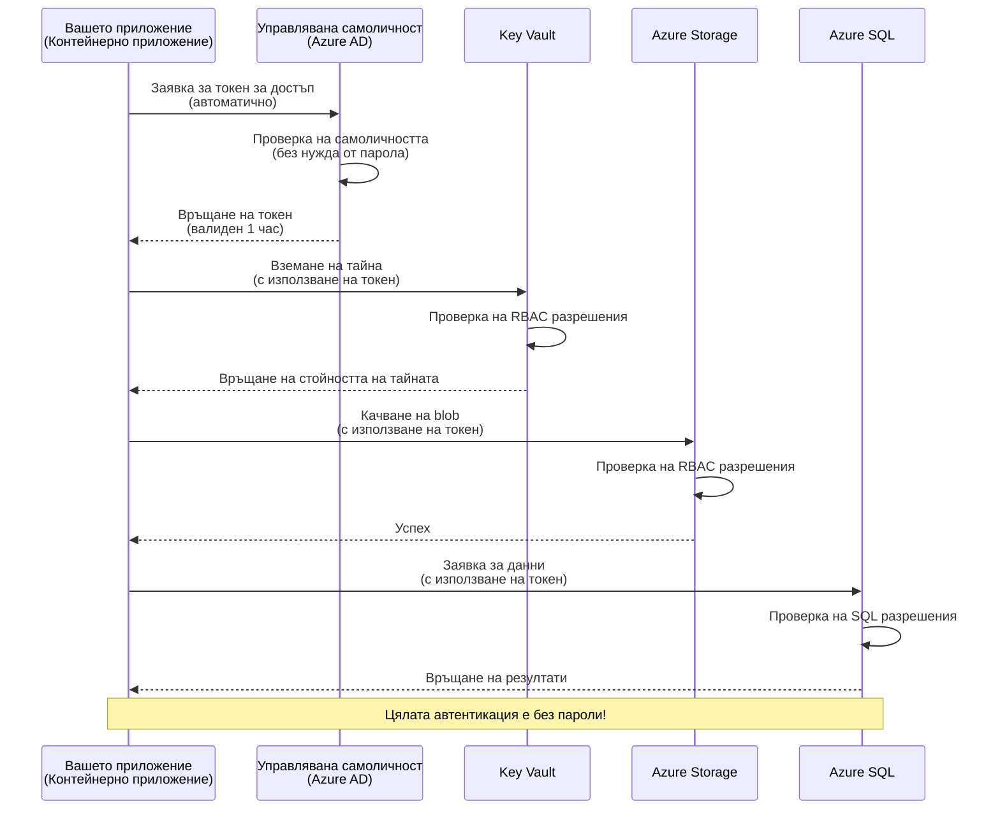
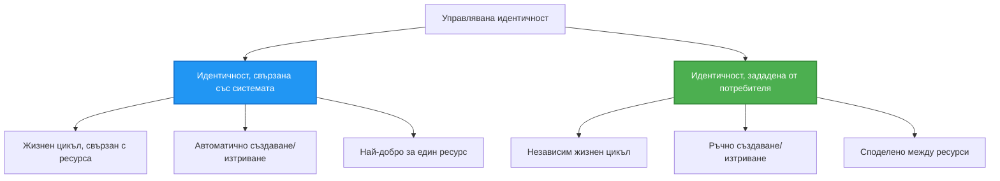

# Шаблони за удостоверяване и Управлявана идентичност

⏱️ **Очаквано време**: 45-60 минути | 💰 **Въздействие върху разходите**: Безплатно (без допълнителни такси) | ⭐ **Сложност**: Средно ниво

**📚 Учебен път:**
- ← Предишно: [Управление на конфигурации](configuration.md) - Управление на променливи на средата и тайни
- 🎯 **Тук сте**: Удостоверяване и сигурност (Управлявана идентичност, Key Vault, сигурни шаблони)
- → Следващо: [Първи проект](first-project.md) - Създайте първото си AZD приложение
- 🏠 [Начало на курса](../../README.md)

---

## Какво ще научите

След завършване на този урок ще:
- Разберете шаблоните за удостоверяване в Azure (ключове, низове за връзка, управлявана идентичност)
- Реализирате **Управлявана идентичност** за удостоверяване без пароли
- Защитите тайни с интеграция на **Azure Key Vault**
- Конфигурирате **контрол на достъпа на базата на роли (RBAC)** за AZD внедрения
- Приложите най-добрите практики за сигурност в Container Apps и Azure услуги
- Мигрирате от удостоверяване на базата на ключове към удостоверяване на базата на идентичност

## Защо Управляваната идентичност е важна

### Проблемът: Традиционно удостоверяване

**Преди Управляваната идентичност:**
```javascript
// ❌ РИСК ЗА СИГУРНОСТ: Харкодирани тайни в кода
const connectionString = "Server=mydb.database.windows.net;User=admin;Password=P@ssw0rd123";
const storageKey = "xK7mN9pQ2wR5tY8uI0oP3aS6dF1gH4jK...";
const cosmosKey = "C2x7B9n4M1p8Q5w3E6r0T2y5U8i1O4p7...";
```

**Проблеми:**
- 🔴 **Изложени тайни** в кода, конфигурационни файлове, променливи на средата
- 🔴 **Ротация на идентификационни данни** изисква промени в кода и повторно внедряване
- 🔴 **Кошмар за одит** - кой е имал достъп до какво и кога?
- 🔴 **Разпръснатост** - тайни, разпръснати в множество системи
- 🔴 **Рискове за съответствие** - не преминава одити за сигурност

### Решението: Управлявана идентичност

**След Управляваната идентичност:**
```javascript
// ✅ СИГУРНО: Няма тайни в кода
const credential = new DefaultAzureCredential();
const client = new BlobServiceClient(
  "https://mystorageaccount.blob.core.windows.net",
  credential  // Azure автоматично обработва удостоверяването
);
```

**Ползи:**
- ✅ **Никакви тайни** в кода или конфигурацията
- ✅ **Автоматична ротация** - Azure се грижи за това
- ✅ **Пълен одитен запис** в Azure AD логове
- ✅ **Централизирана сигурност** - управление в Azure Portal
- ✅ **Готовност за съответствие** - отговаря на стандартите за сигурност

**Аналогия**: Традиционното удостоверяване е като да носите множество физически ключове за различни врати. Управляваната идентичност е като да имате пропуск за сигурност, който автоматично предоставя достъп въз основа на това кой сте - без ключове за губене, копиране или ротация.

---

## Преглед на архитектурата

### Поток на удостоверяване с Управлявана идентичност


### Видове Управлявани идентичности


| Характеристика | Системно-присвоена | Потребителско-присвоена |
|----------------|---------------------|-------------------------|
| **Жизнен цикъл** | Свързан с ресурса | Независим |
| **Създаване** | Автоматично с ресурса | Ръчно създаване |
| **Изтриване** | Изтрива се с ресурса | Остава след изтриване на ресурса |
| **Споделяне** | Само един ресурс | Множество ресурси |
| **Случай на употреба** | Прости сценарии | Сложни сценарии с множество ресурси |
| **AZD по подразбиране** | ✅ Препоръчително | Опционално |

---

## Предварителни изисквания

### Необходими инструменти

Трябва вече да сте инсталирали следните от предишни уроци:

```bash
# Проверете Azure Developer CLI
azd version
# ✅ Очаквано: azd версия 1.0.0 или по-висока

# Проверете Azure CLI
az --version
# ✅ Очаквано: azure-cli 2.50.0 или по-висока
```

### Изисквания към Azure

- Активен Azure абонамент
- Разрешения за:
  - Създаване на управлявани идентичности
  - Присвояване на RBAC роли
  - Създаване на Key Vault ресурси
  - Внедряване на Container Apps

### Необходими знания

Трябва да сте завършили:
- [Ръководство за инсталация](installation.md) - Настройка на AZD
- [Основи на AZD](azd-basics.md) - Основни концепции
- [Управление на конфигурации](configuration.md) - Променливи на средата

---

## Урок 1: Разбиране на шаблоните за удостоверяване

### Шаблон 1: Низове за връзка (Остарял - Избягвайте)

**Как работи:**
```bash
# Низът за връзка съдържа идентификационни данни
STORAGE_CONNECTION_STRING="DefaultEndpointsProtocol=https;AccountName=myaccount;AccountKey=xK7mN9pQ2wR5..."
COSMOS_CONNECTION_STRING="AccountEndpoint=https://myaccount.documents.azure.com:443/;AccountKey=C2x7..."
SQL_CONNECTION_STRING="Server=myserver.database.windows.net;User=admin;Password=P@ssw0rd..."
```

**Проблеми:**
- ❌ Тайните са видими в променливите на средата
- ❌ Логват се в системите за внедряване
- ❌ Трудни за ротация
- ❌ Няма одитен запис за достъп

**Кога да използвате:** Само за локална разработка, никога в продукция.

---

### Шаблон 2: Препратки към Key Vault (По-добър)

**Как работи:**
```bicep
// Store secret in Key Vault
resource keyVault 'Microsoft.KeyVault/vaults@2023-02-01' = {
  name: 'mykv'
  properties: {
    enableRbacAuthorization: true
  }
}

// Reference in Container App
env: [
  {
    name: 'STORAGE_KEY'
    secretRef: 'storage-key'  // References Key Vault
  }
]
```

**Ползи:**
- ✅ Тайните се съхраняват сигурно в Key Vault
- ✅ Централизирано управление на тайните
- ✅ Ротация без промени в кода

**Ограничения:**
- ⚠️ Все още използвате ключове/пароли
- ⚠️ Трябва да управлявате достъпа до Key Vault

**Кога да използвате:** Преходна стъпка от низове за връзка към управлявана идентичност.

---

### Шаблон 3: Управлявана идентичност (Най-добра практика)

**Как работи:**
```bicep
// Enable managed identity
resource containerApp 'Microsoft.App/containerApps@2023-05-01' = {
  name: 'myapp'
  identity: {
    type: 'SystemAssigned'  // Automatically creates identity
  }
}

// Grant permissions
resource roleAssignment 'Microsoft.Authorization/roleAssignments@2022-04-01' = {
  scope: storageAccount
  properties: {
    roleDefinitionId: storageBlobDataContributorRole
    principalId: containerApp.identity.principalId
  }
}
```

**Код на приложението:**
```javascript
// Не са необходими тайни!
const { DefaultAzureCredential } = require('@azure/identity');
const { BlobServiceClient } = require('@azure/storage-blob');

const credential = new DefaultAzureCredential();
const blobServiceClient = new BlobServiceClient(
  'https://mystorageaccount.blob.core.windows.net',
  credential
);
```

**Ползи:**
- ✅ Никакви тайни в кода/конфигурацията
- ✅ Автоматична ротация на идентификационни данни
- ✅ Пълен одитен запис
- ✅ Разрешения на базата на RBAC
- ✅ Готовност за съответствие

**Кога да използвате:** Винаги, за продукционни приложения.

---

## Урок 2: Реализиране на Управлявана идентичност с AZD

### Стъпка по стъпка реализация

Нека създадем сигурно Container App, което използва управлявана идентичност за достъп до Azure Storage и Key Vault.

### Структура на проекта

```
secure-app/
├── azure.yaml                 # AZD configuration
├── infra/
│   ├── main.bicep            # Main infrastructure
│   ├── core/
│   │   ├── identity.bicep    # Managed identity setup
│   │   ├── keyvault.bicep    # Key Vault configuration
│   │   └── storage.bicep     # Storage with RBAC
│   └── app/
│       └── container-app.bicep
└── src/
    ├── app.js                # Application code
    ├── package.json
    └── Dockerfile
```

### 1. Конфигуриране на AZD (azure.yaml)

```yaml
name: secure-app
metadata:
  template: secure-app@1.0.0

services:
  api:
    project: ./src
    language: js
    host: containerapp

# Enable managed identity (AZD handles this automatically)
```

### 2. Инфраструктура: Активиране на Управлявана идентичност

**Файл: `infra/main.bicep`**

```bicep
targetScope = 'subscription'

param environmentName string
param location string = 'eastus'

var tags = { 'azd-env-name': environmentName }

// Resource group
resource rg 'Microsoft.Resources/resourceGroups@2021-04-01' = {
  name: 'rg-${environmentName}'
  location: location
  tags: tags
}

// Storage Account
module storage './core/storage.bicep' = {
  name: 'storage'
  scope: rg
  params: {
    name: 'st${uniqueString(rg.id)}'
    location: location
    tags: tags
  }
}

// Key Vault
module keyVault './core/keyvault.bicep' = {
  name: 'keyvault'
  scope: rg
  params: {
    name: 'kv-${uniqueString(rg.id)}'
    location: location
    tags: tags
  }
}

// Container App with Managed Identity
module containerApp './app/container-app.bicep' = {
  name: 'container-app'
  scope: rg
  params: {
    name: 'ca-${environmentName}'
    location: location
    tags: tags
    storageAccountName: storage.outputs.name
    keyVaultName: keyVault.outputs.name
  }
}

// Grant Container App access to Storage
module storageRoleAssignment './core/role-assignment.bicep' = {
  name: 'storage-role'
  scope: rg
  params: {
    principalId: containerApp.outputs.identityPrincipalId
    roleDefinitionId: 'ba92f5b4-2d11-453d-a403-e96b0029c9fe'  // Storage Blob Data Contributor
    targetResourceId: storage.outputs.id
  }
}

// Grant Container App access to Key Vault
module kvRoleAssignment './core/role-assignment.bicep' = {
  name: 'kv-role'
  scope: rg
  params: {
    principalId: containerApp.outputs.identityPrincipalId
    roleDefinitionId: '4633458b-17de-408a-b874-0445c86b69e6'  // Key Vault Secrets User
    targetResourceId: keyVault.outputs.id
  }
}

// Outputs
output AZURE_STORAGE_ACCOUNT_NAME string = storage.outputs.name
output AZURE_KEY_VAULT_NAME string = keyVault.outputs.name
output APP_URL string = containerApp.outputs.url
```

### 3. Container App със системно-присвоена идентичност

**Файл: `infra/app/container-app.bicep`**

```bicep
param name string
param location string
param tags object = {}
param storageAccountName string
param keyVaultName string

resource containerApp 'Microsoft.App/containerApps@2023-05-01' = {
  name: name
  location: location
  tags: tags
  identity: {
    type: 'SystemAssigned'  // 🔑 Enable managed identity
  }
  properties: {
    configuration: {
      ingress: {
        external: true
        targetPort: 3000
      }
    }
    template: {
      containers: [
        {
          name: 'api'
          image: 'myregistry.azurecr.io/api:latest'
          resources: {
            cpu: json('0.5')
            memory: '1Gi'
          }
          env: [
            {
              name: 'AZURE_STORAGE_ACCOUNT_NAME'
              value: storageAccountName
            }
            {
              name: 'AZURE_KEY_VAULT_NAME'
              value: keyVaultName
            }
            // 🔑 No secrets - managed identity handles authentication!
          ]
        }
      ]
    }
  }
}

// Output the identity for RBAC assignments
output identityPrincipalId string = containerApp.identity.principalId
output id string = containerApp.id
output url string = 'https://${containerApp.properties.configuration.ingress.fqdn}'
```

### 4. Модул за присвояване на RBAC роли

**Файл: `infra/core/role-assignment.bicep`**

```bicep
param principalId string
param roleDefinitionId string  // Azure built-in role ID
param targetResourceId string

resource roleAssignment 'Microsoft.Authorization/roleAssignments@2022-04-01' = {
  name: guid(principalId, roleDefinitionId, targetResourceId)
  scope: resourceId('Microsoft.Resources/resourceGroups', resourceGroup().name)
  properties: {
    roleDefinitionId: subscriptionResourceId('Microsoft.Authorization/roleDefinitions', roleDefinitionId)
    principalId: principalId
    principalType: 'ServicePrincipal'
  }
}

output id string = roleAssignment.id
```

### 5. Код на приложението с Управлявана идентичност

**Файл: `src/app.js`**

```javascript
const express = require('express');
const { DefaultAzureCredential } = require('@azure/identity');
const { BlobServiceClient } = require('@azure/storage-blob');
const { SecretClient } = require('@azure/keyvault-secrets');

const app = express();
const PORT = process.env.PORT || 3000;

// 🔑 Инициализиране на идентификационни данни (работи автоматично с управлявана идентичност)
const credential = new DefaultAzureCredential();

// Настройка на Azure Storage
const storageAccountName = process.env.AZURE_STORAGE_ACCOUNT_NAME;
const blobServiceClient = new BlobServiceClient(
  `https://${storageAccountName}.blob.core.windows.net`,
  credential  // Не са необходими ключове!
);

// Настройка на Key Vault
const keyVaultName = process.env.AZURE_KEY_VAULT_NAME;
const secretClient = new SecretClient(
  `https://${keyVaultName}.vault.azure.net`,
  credential  // Не са необходими ключове!
);

// Проверка на състоянието
app.get('/health', (req, res) => {
  res.json({ status: 'healthy', authentication: 'managed-identity' });
});

// Качване на файл в blob storage
app.post('/upload', async (req, res) => {
  try {
    const containerClient = blobServiceClient.getContainerClient('uploads');
    await containerClient.createIfNotExists();
    
    const blobName = `file-${Date.now()}.txt`;
    const blockBlobClient = containerClient.getBlockBlobClient(blobName);
    
    await blockBlobClient.upload('Hello from managed identity!', 30);
    
    res.json({
      success: true,
      blobName: blobName,
      message: 'File uploaded using managed identity!'
    });
  } catch (error) {
    console.error('Upload error:', error);
    res.status(500).json({ error: error.message });
  }
});

// Получаване на тайна от Key Vault
app.get('/secret/:name', async (req, res) => {
  try {
    const secretName = req.params.name;
    const secret = await secretClient.getSecret(secretName);
    
    res.json({
      name: secretName,
      value: secret.value,
      message: 'Secret retrieved using managed identity!'
    });
  } catch (error) {
    console.error('Secret error:', error);
    res.status(500).json({ error: error.message });
  }
});

// Списък с blob контейнери (демонстрира достъп за четене)
app.get('/containers', async (req, res) => {
  try {
    const containers = [];
    for await (const container of blobServiceClient.listContainers()) {
      containers.push(container.name);
    }
    
    res.json({
      containers: containers,
      count: containers.length,
      message: 'Containers listed using managed identity!'
    });
  } catch (error) {
    console.error('List error:', error);
    res.status(500).json({ error: error.message });
  }
});

app.listen(PORT, () => {
  console.log(`Secure API listening on port ${PORT}`);
  console.log('Authentication: Managed Identity (passwordless)');
});
```

**Файл: `src/package.json`**

```json
{
  "name": "secure-app",
  "version": "1.0.0",
  "dependencies": {
    "express": "^4.18.2",
    "@azure/identity": "^4.0.0",
    "@azure/storage-blob": "^12.17.0",
    "@azure/keyvault-secrets": "^4.7.0"
  },
  "scripts": {
    "start": "node app.js"
  }
}
```

### 6. Внедряване и тестване

```bash
# Инициализиране на AZD среда
azd init

# Разгръщане на инфраструктура и приложение
azd up

# Вземете URL адреса на приложението
APP_URL=$(azd env get-values | grep APP_URL | cut -d '=' -f2 | tr -d '"')

# Тествайте проверката на здравето
curl $APP_URL/health
```

**✅ Очакван резултат:**
```json
{
  "status": "healthy",
  "authentication": "managed-identity"
}
```

**Тестване на качване на blob:**
```bash
curl -X POST $APP_URL/upload
```

**✅ Очакван резултат:**
```json
{
  "success": true,
  "blobName": "file-1700404800000.txt",
  "message": "File uploaded using managed identity!"
}
```

**Тестване на изброяване на контейнери:**
```bash
curl $APP_URL/containers
```

**✅ Очакван резултат:**
```json
{
  "containers": ["uploads"],
  "count": 1,
  "message": "Containers listed using managed identity!"
}
```

---

## Често срещани Azure RBAC роли

### Вградени Role ID за Управлявана идентичност

| Услуга | Име на роля | Role ID | Разрешения |
|--------|-------------|---------|------------|
| **Storage** | Storage Blob Data Reader | `2a2b9908-6b94-4a3d-8e5a-a7d8f8cc8a12` | Четене на blob и контейнери |
| **Storage** | Storage Blob Data Contributor | `ba92f5b4-2d11-453d-a403-e96b0029c9fe` | Четене, писане, изтриване на blob |
| **Storage** | Storage Queue Data Contributor | `974c5e8b-45b9-4653-ba55-5f855dd0fb88` | Четене, писане, изтриване на съобщения в опашки |
| **Key Vault** | Key Vault Secrets User | `4633458b-17de-408a-b874-0445c86b69e6` | Четене на тайни |
| **Key Vault** | Key Vault Secrets Officer | `b86a8fe4-44ce-4948-aee5-eccb2c155cd7` | Четене, писане, изтриване на тайни |
| **Cosmos DB** | Cosmos DB Built-in Data Reader | `00000000-0000-0000-0000-000000000001` | Четене на данни от Cosmos DB |
| **Cosmos DB** | Cosmos DB Built-in Data Contributor | `00000000-0000-0000-0000-000000000002` | Четене, писане на данни от Cosmos DB |
| **SQL Database** | SQL DB Contributor | `9b7fa17d-e63e-47b0-bb0a-15c516ac86ec` | Управление на SQL бази данни |
| **Service Bus** | Azure Service Bus Data Owner | `090c5cfd-751d-490a-894a-3ce6f1109419` | Изпращане, получаване, управление на съобщения |

### Как да намерите Role ID

```bash
# Избройте всички вградени роли
az role definition list --query "[].{Name:roleName, ID:name}" --output table

# Търсене на конкретна роля
az role definition list --query "[?contains(roleName, 'Storage Blob')].{Name:roleName, ID:name}" --output table

# Получаване на подробности за ролята
az role definition list --name "Storage Blob Data Contributor"
```

---

## Практически упражнения

### Упражнение 1: Активиране на Управлявана идентичност за съществуващо приложение ⭐⭐ (Средно)

**Цел**: Добавете управлявана идентичност към съществуващо внедряване на Container App

**Сценарий**: Имате Container App, който използва низове за връзка. Конвертирайте го към управлявана идентичност.

**Начална точка**: Container App с тази конфигурация:

```bicep
// ❌ Current: Using connection string
env: [
  {
    name: 'STORAGE_CONNECTION_STRING'
    secretRef: 'storage-connection'
  }
]
```

**Стъпки**:

1. **Активирайте управлявана идентичност в Bicep:**

```bicep
resource containerApp 'Microsoft.App/containerApps@2023-05-01' = {
  name: 'myapp'
  identity: {
    type: 'SystemAssigned'  // Add this
  }
  // ... rest of configuration
}
```

2. **Дайте достъп до Storage:**

```bicep
// Get storage account reference
resource storageAccount 'Microsoft.Storage/storageAccounts@2023-01-01' existing = {
  name: storageAccountName
}

// Assign role
resource roleAssignment 'Microsoft.Authorization/roleAssignments@2022-04-01' = {
  name: guid(containerApp.id, 'ba92f5b4-2d11-453d-a403-e96b0029c9fe', storageAccount.id)
  scope: storageAccount
  properties: {
    roleDefinitionId: subscriptionResourceId('Microsoft.Authorization/roleDefinitions', 'ba92f5b4-2d11-453d-a403-e96b0029c9fe')
    principalId: containerApp.identity.principalId
    principalType: 'ServicePrincipal'
  }
}
```

3. **Актуализирайте кода на приложението:**

**Преди (низ за връзка):**
```javascript
const { BlobServiceClient } = require('@azure/storage-blob');

const blobServiceClient = BlobServiceClient.fromConnectionString(
  process.env.STORAGE_CONNECTION_STRING
);
```

**След (управлявана идентичност):**
```javascript
const { DefaultAzureCredential } = require('@azure/identity');
const { BlobServiceClient } = require('@azure/storage-blob');

const credential = new DefaultAzureCredential();
const blobServiceClient = new BlobServiceClient(
  `https://${process.env.STORAGE_ACCOUNT_NAME}.blob.core.windows.net`,
  credential
);
```

4. **Актуализирайте променливите на средата:**

```bicep
env: [
  {
    name: 'STORAGE_ACCOUNT_NAME'
    value: storageAccountName  // Just the name, no secrets!
  }
  // Remove STORAGE_CONNECTION_STRING
]
```

5. **Внедрете и тествайте:**

```bash
# Преразположи
azd up

# Тествай дали все още работи
curl https://myapp.azurecontainerapps.io/upload
```

**✅ Критерии за успех:**
- ✅ Приложението се внедрява без грешки
- ✅ Операциите със Storage работят (качване, изброяване, изтегляне)
- ✅ Няма низове за връзка в променливите на средата
- ✅ Идентичността е видима в Azure Portal под раздела "Identity"

**Проверка:**

```bash
# Проверете дали управляваната идентичност е активирана
az containerapp show \
  --name myapp \
  --resource-group rg-myapp \
  --query "identity.type"
# ✅ Очаквано: "SystemAssigned"

# Проверете назначението на ролята
az role assignment list \
  --assignee $(az containerapp show --name myapp --resource-group rg-myapp --query "identity.principalId" -o tsv) \
  --scope /subscriptions/{sub-id}/resourceGroups/rg-myapp/providers/Microsoft.Storage/storageAccounts/mystorageaccount
# ✅ Очаквано: Показва ролята "Storage Blob Data Contributor"
```

**Време**: 20-30 минути

---

### Упражнение 2: Достъп до множество услуги с потребителско-присвоена идентичност ⭐⭐⭐ (Напреднало)

**Цел**: Създайте потребителско-присвоена идентичност, споделена между множество Container Apps

**Сценарий**: Имате 3 микросервиса, които всички трябва да имат достъп до един и същ Storage акаунт и Key Vault.

**Стъпки**:

1. **Създайте потребителско-присвоена идентичност:**

**Файл: `infra/core/identity.bicep`**

```bicep
param name string
param location string
param tags object = {}

resource userAssignedIdentity 'Microsoft.ManagedIdentity/userAssignedIdentities@2023-01-31' = {
  name: name
  location: location
  tags: tags
}

output id string = userAssignedIdentity.id
output principalId string = userAssignedIdentity.properties.principalId
output clientId string = userAssignedIdentity.properties.clientId
```

2. **Присвояване на роли към потребителско-присвоената идентичност:**

```bicep
// In main.bicep
module userIdentity './core/identity.bicep' = {
  name: 'user-identity'
  scope: rg
  params: {
    name: 'id-${environmentName}'
    location: location
    tags: tags
  }
}

// Grant Storage access
resource storageRoleAssignment 'Microsoft.Authorization/roleAssignments@2022-04-01' = {
  name: guid(userIdentity.outputs.principalId, 'storage-contributor')
  scope: storageAccount
  properties: {
    roleDefinitionId: subscriptionResourceId('Microsoft.Authorization/roleDefinitions', 'ba92f5b4-2d11-453d-a403-e96b0029c9fe')
    principalId: userIdentity.outputs.principalId
    principalType: 'ServicePrincipal'
  }
}

// Grant Key Vault access
resource kvRoleAssignment 'Microsoft.Authorization/roleAssignments@2022-04-01' = {
  name: guid(userIdentity.outputs.principalId, 'kv-secrets-user')
  scope: keyVault
  properties: {
    roleDefinitionId: subscriptionResourceId('Microsoft.Authorization/roleDefinitions', '4633458b-17de-408a-b874-0445c86b69e6')
    principalId: userIdentity.outputs.principalId
    principalType: 'ServicePrincipal'
  }
}
```

3. **Присвояване на идентичността към множество Container Apps:**

```bicep
resource apiGateway 'Microsoft.App/containerApps@2023-05-01' = {
  name: 'api-gateway'
  identity: {
    type: 'UserAssigned'
    userAssignedIdentities: {
      '${userIdentity.outputs.id}': {}
    }
  }
  // ... rest of config
}

resource productService 'Microsoft.App/containerApps@2023-05-01' = {
  name: 'product-service'
  identity: {
    type: 'UserAssigned'
    userAssignedIdentities: {
      '${userIdentity.outputs.id}': {}
    }
  }
  // ... rest of config
}

resource orderService 'Microsoft.App/containerApps@2023-05-01' = {
  name: 'order-service'
  identity: {
    type: 'UserAssigned'
    userAssignedIdentities: {
      '${userIdentity.outputs.id}': {}
    }
  }
  // ... rest of config
}
```

4. **Код на приложението (всички услуги използват един и същ шаблон):**

```javascript
const { DefaultAzureCredential, ManagedIdentityCredential } = require('@azure/identity');

// За потребителско зададена идентичност, посочете клиентския ID
const credential = new ManagedIdentityCredential(
  process.env.AZURE_CLIENT_ID  // Клиентски ID за потребителско зададена идентичност
);

// Или използвайте DefaultAzureCredential (автоматично открива)
const credential = new DefaultAzureCredential();

const blobServiceClient = new BlobServiceClient(
  `https://${process.env.STORAGE_ACCOUNT_NAME}.blob.core.windows.net`,
  credential
);
```

5. **Внедрете и проверете:**

```bash
azd up

# Тествайте дали всички услуги имат достъп до хранилището
curl https://api-gateway.azurecontainerapps.io/upload
curl https://product-service.azurecontainerapps.io/upload
curl https://order-service.azurecontainerapps.io/upload
```

**✅ Критерии за успех:**
- ✅ Една идентичност, споделена между 3 услуги
- ✅ Всички услуги имат достъп до Storage и Key Vault
- ✅ Идентичността остава, ако изтриете една услуга
- ✅ Централизирано управление на разрешенията

**Ползи от потребителско-присвоената идентичност:**
- Една идентичност за управление
- Последователни разрешения между услугите
- Остава след изтриване на услуга
- По-добро за сложни архитектури

**Време**: 30-40 минути

---

### Упражнение 3: Реализиране на ротация на тайни в Key Vault ⭐⭐⭐ (Напреднало)

**Цел**: Съхранявайте API ключове на трети страни в Key Vault и ги достъпвайте с управлявана идентичност

**Сценарий**: Вашето приложение трябва да извиква външен API (OpenAI, Stripe, SendGrid), който изисква API ключове.

**Стъпки**:

1. **Създайте Key Vault с RBAC:**

**Файл: `infra/core/keyvault.bicep`**

```bicep
param name string
param location string
param tags object = {}

resource keyVault 'Microsoft.KeyVault/vaults@2023-02-01' = {
  name: name
  location: location
  tags: tags
  properties: {
    enableRbacAuthorization: true  // Use RBAC instead of access policies
    sku: {
      family: 'A'
      name: 'standard'
    }
    tenantId: subscription().tenantId
    enableSoftDelete: true
    softDeleteRetentionInDays: 90
  }
}

// Allow Container App to read secrets
output id string = keyVault.id
output name string = keyVault.name
output uri string = keyVault.properties.vaultUri
```

2. **Съхранете тайни в Key Vault:**

```bash
# Вземете името на Key Vault
KV_NAME=$(azd env get-values | grep AZURE_KEY_VAULT_NAME | cut -d '=' -f2 | tr -d '"')

# Съхранявайте API ключове на трети страни
az keyvault secret set \
  --vault-name $KV_NAME \
  --name "OpenAI-ApiKey" \
  --value "sk-proj-xxxxxxxxxxxxx"

az keyvault secret set \
  --vault-name $KV_NAME \
  --name "Stripe-ApiKey" \
  --value "sk_live_xxxxxxxxxxxxx"

az keyvault secret set \
  --vault-name $KV_NAME \
  --name "SendGrid-ApiKey" \
  --value "SG.xxxxxxxxxxxxx"
```

3. **Код на приложението за извличане на тайни:**

**Файл: `src/config.js`**

```javascript
const { DefaultAzureCredential } = require('@azure/identity');
const { SecretClient } = require('@azure/keyvault-secrets');

class Config {
  constructor() {
    this.credential = new DefaultAzureCredential();
    this.secretClient = new SecretClient(
      `https://${process.env.AZURE_KEY_VAULT_NAME}.vault.azure.net`,
      this.credential
    );
    this.cache = {};
  }

  async getSecret(secretName) {
    // Проверете кеша първо
    if (this.cache[secretName]) {
      return this.cache[secretName];
    }

    try {
      const secret = await this.secretClient.getSecret(secretName);
      this.cache[secretName] = secret.value;
      console.log(`✅ Retrieved secret: ${secretName}`);
      return secret.value;
    } catch (error) {
      console.error(`❌ Failed to get secret ${secretName}:`, error.message);
      throw error;
    }
  }

  async getOpenAIKey() {
    return this.getSecret('OpenAI-ApiKey');
  }

  async getStripeKey() {
    return this.getSecret('Stripe-ApiKey');
  }

  async getSendGridKey() {
    return this.getSecret('SendGrid-ApiKey');
  }
}

module.exports = new Config();
```

4. **Използвайте тайните в приложението:**

**Файл: `src/app.js`**

```javascript
const express = require('express');
const config = require('./config');
const { OpenAI } = require('openai');

const app = express();

// Инициализирайте OpenAI с ключ от Key Vault
let openaiClient;

async function initializeServices() {
  const openaiKey = await config.getOpenAIKey();
  openaiClient = new OpenAI({ apiKey: openaiKey });
  console.log('✅ Services initialized with secrets from Key Vault');
}

// Извикайте при стартиране
initializeServices().catch(console.error);

app.post('/chat', async (req, res) => {
  try {
    const completion = await openaiClient.chat.completions.create({
      model: 'gpt-4',
      messages: [{ role: 'user', content: 'Hello!' }]
    });
    
    res.json({
      response: completion.choices[0].message.content,
      authentication: 'Key from Key Vault via Managed Identity'
    });
  } catch (error) {
    res.status(500).json({ error: error.message });
  }
});

app.listen(3000, () => {
  console.log('Secure API with Key Vault integration running');
});
```

5. **Внедрете и тествайте:**

```bash
azd up

# Тествайте дали API ключовете работят
curl -X POST https://myapp.azurecontainerapps.io/chat \
  -H "Content-Type: application/json" \
  -d '{"message":"Hello AI"}'
```

**✅ Критерии за успех:**
- ✅ Няма API ключове в кода или променливите на средата
- ✅ Приложението извлича ключове от Key Vault
- ✅ Външните API работят правилно
- ✅ Можете да ротирате ключове без промени в кода

**Ротация на таен ключ:**

```bash
# Актуализирай тайния ключ в Key Vault
az keyvault secret set \
  --vault-name $KV_NAME \
  --name "OpenAI-ApiKey" \
  --value "sk-proj-NEW_KEY_HERE"

# Рестартирай приложението, за да вземе новия ключ
az containerapp revision restart \
  --name myapp \
  --resource-group rg-myapp
```

**Време**: 25-35 минути

---

## Проверка на знанията

### 1. Шаблони за удостоверяване ✓

Тествайте разбирането си:

- [ ] **Въпрос 1**: Кои са трите основни шаблона за удостоверяване? 
  - **Отговор**: Низове за връзка (остарял), Препратки към Key Vault (преходен), Управлявана идентичност (най-добър)

- [ ] **Въпрос 2**: Защо управляваната идентичност е по-добра от низовете за връзка?
  - **Отговор**: Няма тайни в кода, автоматична ротация, пълен одитен запис, разрешения на базата на RBAC

- [ ] **Въпрос 3**: Кога бихте използвали потребителско-присвоена идентичност вместо системно-присвоена?
  - **Отговор**: Когато споделяте идентичност между множество ресурси или когато жизненият цикъл на идентичността е независим от жизнения цикъл на ресурса

**Практическа проверка:**
```bash
# Проверете какъв тип идентичност използва вашето приложение
az containerapp show \
  --name myapp \
  --resource-group rg-myapp \
  --query "identity.type"

# Избройте всички назначения на роли за идентичността
az role assignment list \
  --assignee $(az containerapp show --name myapp --resource-group rg-myapp --query "identity.principalId" -o tsv)
```

---

### 2. RBAC и разрешения ✓

Тествайте разбирането си:

- [ ] **Въпрос 1**: Какъв е Role ID за "Storage Blob Data Contributor"?
  - **Отговор**: `ba92f5b4-2d11-453d-a403-e96b0029c9fe`

- [ ] **Въпрос 2**: Какви разрешения предоставя "Key Vault Secrets User"?
  - **Отговор**: Само за четене на тайни (не може да създава, актуализира или изтрива)

- [ ] **Въпрос 3**: Как предоставяте достъп на Container App до Azure SQL?
  - **Отговор**: Присвояване на роля "SQL DB Contributor" или конфигуриране на удостоверяване чрез Azure AD за SQL

**Практическа проверка:**
```bash
# Намерете конкретна роля
az role definition list --name "Storage Blob Data Contributor"

# Проверете какви роли са присвоени на вашата идентичност
PRINCIPAL_ID=$(az containerapp show --name myapp --resource-group rg-myapp --query "identity.principalId" -o tsv)
az role assignment list --assignee $PRINCIPAL_ID --output table
```

---

### 3. Интеграция с Key
- [ ] **Въпрос 1**: Как да активирате RBAC за Key Vault вместо политики за достъп?
  - **Отговор**: Задайте `enableRbacAuthorization: true` в Bicep

- [ ] **Въпрос 2**: Коя библиотека на Azure SDK обработва удостоверяване с управлявана идентичност?
  - **Отговор**: `@azure/identity` с класа `DefaultAzureCredential`

- [ ] **Въпрос 3**: Колко дълго се съхраняват тайните на Key Vault в кеша?
  - **Отговор**: Зависи от приложението; внедрете собствена стратегия за кеширане

**Практическа проверка:**
```bash
# Тествайте достъпа до Key Vault
az keyvault secret show \
  --vault-name $KV_NAME \
  --name "OpenAI-ApiKey" \
  --query "value"

# Проверете дали RBAC е активиран
az keyvault show \
  --name $KV_NAME \
  --query "properties.enableRbacAuthorization"
# ✅ Очаквано: вярно
```

---

## Най-добри практики за сигурност

### ✅ ПРАВЕТЕ:

1. **Винаги използвайте управлявана идентичност в продукция**
   ```bicep
   identity: {
     type: 'SystemAssigned'
   }
   ```

2. **Използвайте роли с минимални привилегии в RBAC**
   - Използвайте роли като "Reader", когато е възможно
   - Избягвайте роли като "Owner" или "Contributor", освен ако не са абсолютно необходими

3. **Съхранявайте ключове на трети страни в Key Vault**
   ```javascript
   const apiKey = await secretClient.getSecret('ThirdPartyApiKey');
   ```

4. **Активирайте регистриране на одити**
   ```bicep
   diagnosticSettings: {
     logs: [{ category: 'AuditEvent', enabled: true }]
   }
   ```

5. **Използвайте различни идентичности за разработка, тестване и продукция**
   ```bash
   azd env new dev
   azd env new staging
   azd env new prod
   ```

6. **Редовно въртете тайните**
   - Задайте дати на изтичане за тайните в Key Vault
   - Автоматизирайте въртенето с Azure Functions

### ❌ НЕ ПРАВЕТЕ:

1. **Никога не вграждайте тайни в кода**
   ```javascript
   // ❌ ЛОШО
   const apiKey = "sk-proj-xxxxxxxxxxxxx";
   ```

2. **Не използвайте низове за връзка в продукция**
   ```javascript
   // ❌ ЛОШО
   BlobServiceClient.fromConnectionString(process.env.STORAGE_CONNECTION_STRING)
   ```

3. **Не предоставяйте прекомерни права**
   ```bicep
   // ❌ BAD - too much access
   roleDefinitionId: 'Owner'
   
   // ✅ GOOD - least privilege
   roleDefinitionId: 'Storage Blob Data Reader'
   ```

4. **Не записвайте тайни в логовете**
   ```javascript
   // ❌ ЛОШО
   console.log('API Key:', apiKey);
   
   // ✅ ДОБРО
   console.log('API Key retrieved successfully');
   ```

5. **Не споделяйте идентичности за продукция между различни среди**
   ```bicep
   // ❌ BAD - same identity for dev and prod
   // ✅ GOOD - separate identities per environment
   ```

---

## Ръководство за отстраняване на проблеми

### Проблем: "Unauthorized" при достъп до Azure Storage

**Симптоми:**
```
Error: Unauthorized (403)
AuthorizationPermissionMismatch: This request is not authorized to perform this operation
```

**Диагноза:**

```bash
# Проверете дали управляваната идентичност е активирана
az containerapp show \
  --name myapp \
  --resource-group rg-myapp \
  --query "identity.type"
# ✅ Очаквано: "SystemAssigned" или "UserAssigned"

# Проверете назначенията на роли
PRINCIPAL_ID=$(az containerapp show --name myapp --resource-group rg-myapp --query "identity.principalId" -o tsv)
az role assignment list --assignee $PRINCIPAL_ID

# Очаквано: Трябва да видите "Storage Blob Data Contributor" или подобна роля
```

**Решения:**

1. **Предоставете правилната RBAC роля:**
```bash
STORAGE_ID=$(az storage account show --name mystorageaccount --resource-group rg-myapp --query "id" -o tsv)
az role assignment create \
  --assignee $PRINCIPAL_ID \
  --role "Storage Blob Data Contributor" \
  --scope $STORAGE_ID
```

2. **Изчакайте за разпространение (може да отнеме 5-10 минути):**
```bash
# Проверете състоянието на назначаването на роля
az role assignment list --assignee $PRINCIPAL_ID --scope $STORAGE_ID
```

3. **Уверете се, че приложението използва правилните идентификационни данни:**
```javascript
// Уверете се, че използвате DefaultAzureCredential
const credential = new DefaultAzureCredential();
```

---

### Проблем: Достъпът до Key Vault е отказан

**Симптоми:**
```
Error: Forbidden (403)
The user, group or application does not have secrets get permission
```

**Диагноза:**

```bash
# Проверете дали RBAC за Key Vault е активиран
az keyvault show \
  --name $KV_NAME \
  --query "properties.enableRbacAuthorization"
# ✅ Очаквано: вярно

# Проверете назначенията на роли
az role assignment list \
  --assignee $PRINCIPAL_ID \
  --scope /subscriptions/{sub-id}/resourceGroups/rg-myapp/providers/Microsoft.KeyVault/vaults/$KV_NAME
```

**Решения:**

1. **Активирайте RBAC за Key Vault:**
```bash
az keyvault update \
  --name $KV_NAME \
  --enable-rbac-authorization true
```

2. **Предоставете роля Key Vault Secrets User:**
```bash
KV_ID=$(az keyvault show --name $KV_NAME --query "id" -o tsv)
az role assignment create \
  --assignee $PRINCIPAL_ID \
  --role "Key Vault Secrets User" \
  --scope $KV_ID
```

---

### Проблем: DefaultAzureCredential не работи локално

**Симптоми:**
```
Error: DefaultAzureCredential failed to retrieve a token
CredentialUnavailableError: No credential available
```

**Диагноза:**

```bash
# Проверете дали сте влезли
az account show

# Проверете удостоверяването на Azure CLI
az ad signed-in-user show
```

**Решения:**

1. **Влезте в Azure CLI:**
```bash
az login
```

2. **Задайте Azure абонамент:**
```bash
az account set --subscription "Your Subscription Name"
```

3. **За локална разработка използвайте променливи на средата:**
```bash
export AZURE_TENANT_ID="your-tenant-id"
export AZURE_CLIENT_ID="your-client-id"
export AZURE_CLIENT_SECRET="your-client-secret"
```

4. **Или използвайте различни идентификационни данни локално:**
```javascript
const { DefaultAzureCredential, AzureCliCredential } = require('@azure/identity');

// Използвайте AzureCliCredential за локална разработка
const credential = process.env.NODE_ENV === 'production' 
  ? new DefaultAzureCredential()
  : new AzureCliCredential();
```

---

### Проблем: Присвояването на роля отнема твърде дълго за разпространение

**Симптоми:**
- Ролята е успешно присвоена
- Все още получавате грешки 403
- Непостоянен достъп (понякога работи, понякога не)

**Обяснение:**
Промените в Azure RBAC могат да отнемат 5-10 минути за глобално разпространение.

**Решение:**

```bash
# Изчакайте и опитайте отново
echo "Waiting for RBAC propagation..."
sleep 300  # Изчакайте 5 минути

# Тествайте достъпа
curl https://myapp.azurecontainerapps.io/upload

# Ако все още не работи, рестартирайте приложението
az containerapp revision restart \
  --name myapp \
  --resource-group rg-myapp
```

---

## Разходи

### Разходи за управлявана идентичност

| Ресурс | Разход |
|--------|--------|
| **Управлявана идентичност** | 🆓 **БЕЗПЛАТНО** - Без такса |
| **RBAC роли** | 🆓 **БЕЗПЛАТНО** - Без такса |
| **Заявки за токени на Azure AD** | 🆓 **БЕЗПЛАТНО** - Включено |
| **Операции с Key Vault** | $0.03 за 10,000 операции |
| **Съхранение в Key Vault** | $0.024 на тайна на месец |

**Управляваната идентичност спестява пари чрез:**
- ✅ Елиминиране на операциите с Key Vault за удостоверяване между услуги
- ✅ Намаляване на инцидентите със сигурността (без изтичане на идентификационни данни)
- ✅ Намаляване на оперативните разходи (без ръчно въртене)

**Примерно сравнение на разходите (месечно):**

| Сценарий | Низове за връзка | Управлявана идентичност | Спестявания |
|----------|------------------|-------------------------|-------------|
| Малко приложение (1M заявки) | ~$50 (Key Vault + операции) | ~$0 | $50/месец |
| Средно приложение (10M заявки) | ~$200 | ~$0 | $200/месец |
| Голямо приложение (100M заявки) | ~$1,500 | ~$0 | $1,500/месец |

---

## Научете повече

### Официална документация
- [Azure Managed Identity](https://learn.microsoft.com/entra/identity/managed-identities-azure-resources/overview)
- [Azure RBAC](https://learn.microsoft.com/azure/role-based-access-control/overview)
- [Azure Key Vault](https://learn.microsoft.com/azure/key-vault/general/overview)
- [DefaultAzureCredential](https://learn.microsoft.com/dotnet/api/azure.identity.defaultazurecredential)

### Документация за SDK
- [@azure/identity (Node.js)](https://www.npmjs.com/package/@azure/identity)
- [Azure.Identity (C#)](https://www.nuget.org/packages/Azure.Identity/)
- [azure-identity (Python)](https://pypi.org/project/azure-identity/)

### Следващи стъпки в този курс
- ← Предишно: [Управление на конфигурации](configuration.md)
- → Следващо: [Първи проект](first-project.md)
- 🏠 [Начало на курса](../../README.md)

### Свързани примери
- [Пример за Azure OpenAI Chat](../../../../examples/azure-openai-chat) - Използва управлявана идентичност за Azure OpenAI
- [Пример за микросервизи](../../../../examples/microservices) - Модели за удостоверяване между услуги

---

## Обобщение

**Научихте:**
- ✅ Три модела за удостоверяване (низове за връзка, Key Vault, управлявана идентичност)
- ✅ Как да активирате и конфигурирате управлявана идентичност в AZD
- ✅ Присвояване на роли в RBAC за Azure услуги
- ✅ Интеграция на Key Vault за тайни на трети страни
- ✅ Разлика между потребителски и системно присвоени идентичности
- ✅ Най-добри практики за сигурност и отстраняване на проблеми

**Основни изводи:**
1. **Винаги използвайте управлявана идентичност в продукция** - Без тайни, автоматично въртене
2. **Използвайте роли с минимални привилегии в RBAC** - Предоставяйте само необходимите права
3. **Съхранявайте ключове на трети страни в Key Vault** - Централизирано управление на тайни
4. **Разделяйте идентичности за различни среди** - Изолация за разработка, тестване и продукция
5. **Активирайте регистриране на одити** - Проследявайте кой е достъпвал какво

**Следващи стъпки:**
1. Завършете практическите упражнения по-горе
2. Мигрирайте съществуващо приложение от низове за връзка към управлявана идентичност
3. Създайте първия си AZD проект със сигурност от първия ден: [Първи проект](first-project.md)

---

<!-- CO-OP TRANSLATOR DISCLAIMER START -->
**Отказ от отговорност**:  
Този документ е преведен с помощта на AI услуга за превод [Co-op Translator](https://github.com/Azure/co-op-translator). Въпреки че се стремим към точност, моля, имайте предвид, че автоматизираните преводи може да съдържат грешки или неточности. Оригиналният документ на неговия роден език трябва да се счита за авторитетен източник. За критична информация се препоръчва професионален човешки превод. Ние не носим отговорност за каквито и да е недоразумения или погрешни интерпретации, произтичащи от използването на този превод.
<!-- CO-OP TRANSLATOR DISCLAIMER END -->