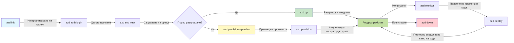
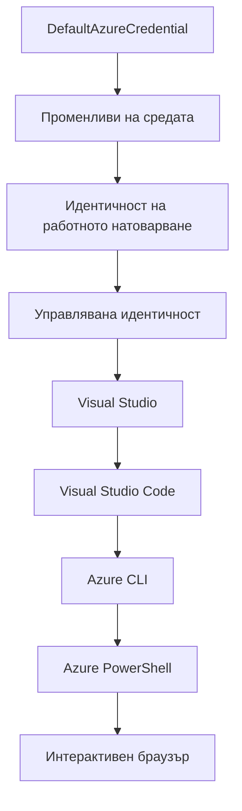

# AZD Основи - Разбиране на Azure Developer CLI

# AZD Основи - Основни концепции и принципи

**Навигация по главата:**
- **📚 Начало на курса**: [AZD За начинаещи](../../README.md)
- **📖 Текуща глава**: Глава 1 - Основи и бърз старт
- **⬅️ Предишна**: [Преглед на курса](../../README.md#-chapter-1-foundation--quick-start)
- **➡️ Следваща**: [Инсталация и настройка](installation.md)
- **🚀 Следваща глава**: [Глава 2: Разработка с приоритет на AI](../microsoft-foundry/microsoft-foundry-integration.md)

## Въведение

Този урок ви запознава с Azure Developer CLI (azd), мощен инструмент за команден ред, който ускорява прехода ви от локална разработка към внедряване в Azure. Ще научите основните концепции, ключовите функции и как azd опростява внедряването на облачни приложения.

## Цели на обучението

До края на този урок ще:
- Разберете какво представлява Azure Developer CLI и основната му цел
- Научите основните концепции за шаблони, среди и услуги
- Изследвате ключови функции като разработка, базирана на шаблони, и инфраструктура като код
- Разберете структурата и работния процес на проектите в azd
- Бъдете готови да инсталирате и конфигурирате azd за вашата среда за разработка

## Резултати от обучението

След завършване на урока ще можете:
- Да обясните ролята на azd в съвременните работни процеси за облачна разработка
- Да идентифицирате компонентите на структурата на проектите в azd
- Да опишете как шаблоните, средите и услугите работят заедно
- Да разберете предимствата на инфраструктурата като код с azd
- Да разпознаете различни команди на azd и техните цели

## Какво е Azure Developer CLI (azd)?

Azure Developer CLI (azd) е инструмент за команден ред, създаден да ускори прехода ви от локална разработка към внедряване в Azure. Той опростява процеса на изграждане, внедряване и управление на облачни приложения в Azure.

### 🎯 Защо да използвате AZD? Сравнение с реалния свят

Нека сравним внедряването на просто уеб приложение с база данни:

#### ❌ БЕЗ AZD: Ръчно внедряване в Azure (30+ минути)

```bash
# Стъпка 1: Създайте ресурсна група
az group create --name myapp-rg --location eastus

# Стъпка 2: Създайте план за App Service
az appservice plan create --name myapp-plan \
  --resource-group myapp-rg \
  --sku B1 --is-linux

# Стъпка 3: Създайте уеб приложение
az webapp create --name myapp-web-unique123 \
  --resource-group myapp-rg \
  --plan myapp-plan \
  --runtime "NODE:18-lts"

# Стъпка 4: Създайте акаунт в Cosmos DB (10-15 минути)
az cosmosdb create --name myapp-cosmos-unique123 \
  --resource-group myapp-rg \
  --kind MongoDB

# Стъпка 5: Създайте база данни
az cosmosdb mongodb database create \
  --account-name myapp-cosmos-unique123 \
  --resource-group myapp-rg \
  --name tododb

# Стъпка 6: Създайте колекция
az cosmosdb mongodb collection create \
  --account-name myapp-cosmos-unique123 \
  --resource-group myapp-rg \
  --database-name tododb \
  --name todos

# Стъпка 7: Вземете низ за връзка
CONN_STR=$(az cosmosdb keys list \
  --name myapp-cosmos-unique123 \
  --resource-group myapp-rg \
  --type connection-strings \
  --query "connectionStrings[0].connectionString" -o tsv)

# Стъпка 8: Конфигурирайте настройките на приложението
az webapp config appsettings set \
  --name myapp-web-unique123 \
  --resource-group myapp-rg \
  --settings MONGODB_URI="$CONN_STR"

# Стъпка 9: Активирайте логването
az webapp log config --name myapp-web-unique123 \
  --resource-group myapp-rg \
  --application-logging filesystem \
  --detailed-error-messages true

# Стъпка 10: Настройте Application Insights
az monitor app-insights component create \
  --app myapp-insights \
  --location eastus \
  --resource-group myapp-rg

# Стъпка 11: Свържете App Insights с уеб приложението
INSTRUMENTATION_KEY=$(az monitor app-insights component show \
  --app myapp-insights \
  --resource-group myapp-rg \
  --query "instrumentationKey" -o tsv)

az webapp config appsettings set \
  --name myapp-web-unique123 \
  --resource-group myapp-rg \
  --settings APPINSIGHTS_INSTRUMENTATIONKEY="$INSTRUMENTATION_KEY"

# Стъпка 12: Създайте приложението локално
npm install
npm run build

# Стъпка 13: Създайте пакет за разгръщане
zip -r app.zip . -x "*.git*" "node_modules/*"

# Стъпка 14: Разгърнете приложението
az webapp deployment source config-zip \
  --resource-group myapp-rg \
  --name myapp-web-unique123 \
  --src app.zip

# Стъпка 15: Изчакайте и се молете да работи 🙏
# (Няма автоматична валидация, изисква се ръчно тестване)
```

**Проблеми:**
- ❌ 15+ команди за запомняне и изпълнение в правилен ред
- ❌ 30-45 минути ръчна работа
- ❌ Лесно е да се допуснат грешки (грешки при писане, неправилни параметри)
- ❌ Стойности за връзка се показват в историята на терминала
- ❌ Няма автоматично връщане назад, ако нещо се провали
- ❌ Трудно за възпроизвеждане от членовете на екипа
- ❌ Различно всеки път (не е възпроизводимо)

#### ✅ С AZD: Автоматизирано внедряване (5 команди, 10-15 минути)

```bash
# Стъпка 1: Инициализиране от шаблон
azd init --template todo-nodejs-mongo

# Стъпка 2: Удостоверяване
azd auth login

# Стъпка 3: Създаване на среда
azd env new dev

# Стъпка 4: Преглед на промените (по избор, но препоръчително)
azd provision --preview

# Стъпка 5: Разгръщане на всичко
azd up

# ✨ Готово! Всичко е разположено, конфигурирано и наблюдавано
```

**Предимства:**
- ✅ **5 команди** срещу 15+ ръчни стъпки
- ✅ **10-15 минути** общо време (предимно чакане за Azure)
- ✅ **Нулеви грешки** - автоматизирано и тествано
- ✅ **Секрети управлявани сигурно** чрез Key Vault
- ✅ **Автоматично връщане назад** при неуспехи
- ✅ **Напълно възпроизводимо** - същият резултат всеки път
- ✅ **Готово за екип** - всеки може да внедри със същите команди
- ✅ **Инфраструктура като код** - контролирани версии на шаблони Bicep
- ✅ **Вградено наблюдение** - Application Insights конфигуриран автоматично

### 📊 Намаляване на време и грешки

| Метрика | Ръчно внедряване | Внедряване с AZD | Подобрение |
|:-------|:------------------|:---------------|:------------|
| **Команди** | 15+ | 5 | 67% по-малко |
| **Време** | 30-45 мин | 10-15 мин | 60% по-бързо |
| **Честота на грешки** | ~40% | <5% | 88% намаление |
| **Последователност** | Ниска (ръчно) | 100% (автоматизирано) | Перфектно |
| **Обучение на екипа** | 2-4 часа | 30 минути | 75% по-бързо |
| **Време за връщане назад** | 30+ мин (ръчно) | 2 мин (автоматизирано) | 93% по-бързо |

## Основни концепции

### Шаблони
Шаблоните са основата на azd. Те съдържат:
- **Код на приложението** - Вашият изходен код и зависимости
- **Определения на инфраструктурата** - Ресурси в Azure, дефинирани в Bicep или Terraform
- **Конфигурационни файлове** - Настройки и променливи на средата
- **Скриптове за внедряване** - Автоматизирани работни процеси за внедряване

### Среда
Средите представляват различни цели за внедряване:
- **Разработка** - За тестване и разработка
- **Стаджинг** - Предпроизводствена среда
- **Продукция** - Жива производствена среда

Всяка среда поддържа свои собствени:
- Група ресурси в Azure
- Конфигурационни настройки
- Състояние на внедряване

### Услуги
Услугите са градивните елементи на вашето приложение:
- **Фронтенд** - Уеб приложения, SPAs
- **Бекенд** - API-та, микросървиси
- **База данни** - Решения за съхранение на данни
- **Съхранение** - Файлово и блоб съхранение

## Ключови функции

### 1. Разработка, базирана на шаблони
```bash
# Преглед на наличните шаблони
azd template list

# Инициализиране от шаблон
azd init --template <template-name>
```

### 2. Инфраструктура като код
- **Bicep** - Специализиран език на Azure
- **Terraform** - Инструмент за инфраструктура за множество облаци
- **ARM Templates** - Шаблони на Azure Resource Manager

### 3. Интегрирани работни процеси
```bash
# Завършете работния процес на внедряване
azd up            # Осигуряване + Внедряване това е автоматично за първоначална настройка

# 🧪 НОВО: Преглед на промените в инфраструктурата преди внедряване (БЕЗОПАСНО)
azd provision --preview    # Симулирайте внедряването на инфраструктура без да правите промени

azd provision     # Създайте ресурси в Azure, ако актуализирате инфраструктурата, използвайте това
azd deploy        # Внедрете код на приложението или повторно внедрете код на приложението след актуализация
azd down          # Почистете ресурсите
```

#### 🛡️ Безопасно планиране на инфраструктура с Preview
Командата `azd provision --preview` е революционна за безопасни внедрявания:
- **Анализ на сухо изпълнение** - Показва какво ще бъде създадено, модифицирано или изтрито
- **Нулев риск** - Няма реални промени в средата на Azure
- **Сътрудничество в екип** - Споделяне на резултати от предварителен преглед преди внедряване
- **Оценка на разходите** - Разбиране на разходите за ресурси преди ангажимент

```bash
# Примерен работен процес за предварителен преглед
azd provision --preview           # Вижте какво ще се промени
# Прегледайте резултата, обсъдете с екипа
azd provision                     # Прилагайте промените с увереност
```

### 📊 Визуализация: Работен процес на разработка с AZD


**Обяснение на работния процес:**
1. **Init** - Започнете с шаблон или нов проект
2. **Auth** - Удостоверяване с Azure
3. **Environment** - Създаване на изолирана среда за внедряване
4. **Preview** - 🆕 Винаги предварително преглеждайте промените в инфраструктурата (безопасна практика)
5. **Provision** - Създаване/актуализиране на ресурси в Azure
6. **Deploy** - Изпращане на кода на приложението
7. **Monitor** - Наблюдение на производителността на приложението
8. **Iterate** - Правене на промени и повторно внедряване на кода
9. **Cleanup** - Премахване на ресурси, когато сте готови

### 4. Управление на средата
```bash
# Създаване и управление на среди
azd env new <environment-name>
azd env select <environment-name>
azd env list
```

## 📁 Структура на проекта

Типична структура на проект в azd:
```
my-app/
├── .azd/                    # azd configuration
│   └── config.json
├── .azure/                  # Azure deployment artifacts
├── .devcontainer/          # Development container config
├── .github/workflows/      # GitHub Actions
├── .vscode/               # VS Code settings
├── infra/                 # Infrastructure code
│   ├── main.bicep        # Main infrastructure template
│   ├── main.parameters.json
│   └── modules/          # Reusable modules
├── src/                  # Application source code
│   ├── api/             # Backend services
│   └── web/             # Frontend application
├── azure.yaml           # azd project configuration
└── README.md
```

## 🔧 Конфигурационни файлове

### azure.yaml
Основният конфигурационен файл на проекта:
```yaml
name: my-awesome-app
metadata:
  template: my-template@1.0.0

services:
  web:
    project: ./src/web
    language: js
    host: appservice
  api:
    project: ./src/api
    language: js
    host: appservice

hooks:
  preprovision:
    shell: pwsh
    run: echo "Preparing to provision..."
```

### .azure/config.json
Конфигурация, специфична за средата:
```json
{
  "version": 1,
  "defaultEnvironment": "dev",
  "environments": {
    "dev": {
      "subscriptionId": "your-subscription-id",
      "location": "eastus"
    }
  }
}
```

## 🎪 Общи работни процеси с практически упражнения

> **💡 Съвет за обучение:** Следвайте тези упражнения последователно, за да развиете уменията си с AZD постепенно.

### 🎯 Упражнение 1: Инициализирайте първия си проект

**Цел:** Създайте проект в AZD и изследвайте неговата структура

**Стъпки:**
```bash
# Използвайте доказан шаблон
azd init --template todo-nodejs-mongo

# Разгледайте генерираните файлове
ls -la  # Прегледайте всички файлове, включително скритите

# Създадени ключови файлове:
# - azure.yaml (основна конфигурация)
# - infra/ (код за инфраструктурата)
# - src/ (код на приложението)
```

**✅ Успех:** Имате директории azure.yaml, infra/ и src/

---

### 🎯 Упражнение 2: Внедряване в Azure

**Цел:** Завършете внедряване от край до край

**Стъпки:**
```bash
# 1. Удостоверяване
az login && azd auth login

# 2. Създаване на среда
azd env new dev
azd env set AZURE_LOCATION eastus

# 3. Преглед на промените (ПРЕПОРЪЧИТЕЛНО)
azd provision --preview

# 4. Разгръщане на всичко
azd up

# 5. Проверка на разгръщането
azd show    # Преглед на URL адреса на приложението ви
```

**Очаквано време:** 10-15 минути  
**✅ Успех:** URL на приложението се отваря в браузъра

---

### 🎯 Упражнение 3: Множество среди

**Цел:** Внедряване в dev и staging

**Стъпки:**
```bash
# Вече има dev, създайте staging
azd env new staging
azd env set AZURE_LOCATION westus2
azd up

# Превключвайте между тях
azd env list
azd env select dev
```

**✅ Успех:** Две отделни групи ресурси в Azure Portal

---

### 🛡️ Чисто начало: `azd down --force --purge`

Когато трябва напълно да нулирате:

```bash
azd down --force --purge
```

**Какво прави:**
- `--force`: Без потвърждаващи подкани
- `--purge`: Изтрива цялото локално състояние и ресурси в Azure

**Използвайте, когато:**
- Внедряването е неуспешно по средата
- Превключвате проекти
- Нуждаете се от ново начало

---

## 🎪 Референция за оригинален работен процес

### Започване на нов проект
```bash
# Метод 1: Използвайте съществуващ шаблон
azd init --template todo-nodejs-mongo

# Метод 2: Започнете от нулата
azd init

# Метод 3: Използвайте текущата директория
azd init .
```

### Цикъл на разработка
```bash
# Настройте среда за разработка
azd auth login
azd env new dev
azd env select dev

# Разгърнете всичко
azd up

# Направете промени и разгърнете отново
azd deploy

# Почистете след като сте готови
azd down --force --purge # командата в Azure Developer CLI е **твърдо нулиране** за вашата среда—особено полезно при отстраняване на проблеми с неуспешни разгръщания, почистване на изоставени ресурси или подготовка за ново разгръщане.
```

## Разбиране на `azd down --force --purge`
Командата `azd down --force --purge` е мощен начин за напълно премахване на вашата среда в azd и всички свързани ресурси. Ето разбивка на това, което прави всеки флаг:
```
--force
```
- Пропуска потвърждаващи подкани.
- Полезно за автоматизация или скриптове, където ръчното въвеждане не е възможно.
- Гарантира, че премахването продължава без прекъсване, дори ако CLI открие несъответствия.

```
--purge
```
Изтрива **цялата свързана метаинформация**, включително:
Състояние на средата
Локална папка `.azure`
Кеширана информация за внедряване
Предотвратява "запомнянето" на предишни внедрявания от azd, което може да причини проблеми като несъответстващи групи ресурси или остарели препратки към регистри.

### Защо да използвате и двете?
Когато сте се сблъскали с проблеми с `azd up` поради остатъчно състояние или частични внедрявания, тази комбинация гарантира **чисто начало**.

Особено полезно след ръчно изтриване на ресурси в Azure Portal или при превключване на шаблони, среди или конвенции за именуване на групи ресурси.

### Управление на множество среди
```bash
# Създайте среда за тестване
azd env new staging
azd env select staging
azd up

# Върнете се към разработка
azd env select dev

# Сравнете средите
azd env list
```

## 🔐 Удостоверяване и идентификационни данни

Разбирането на удостоверяването е от решаващо значение за успешни внедрявания с azd. Azure използва множество методи за удостоверяване, а azd използва същата верига за идентификационни данни, която се използва от други инструменти на Azure.

### Удостоверяване с Azure CLI (`az login`)

Преди да използвате azd, трябва да се удостоверите с Azure. Най-често срещаният метод е чрез Azure CLI:

```bash
# Интерактивно влизане (отваря браузър)
az login

# Влизане със специфичен наемател
az login --tenant <tenant-id>

# Влизане с главен служебен акаунт
az login --service-principal -u <app-id> -p <password> --tenant <tenant-id>

# Проверка на текущия статус на влизане
az account show

# Списък на наличните абонаменти
az account list --output table

# Задаване на абонамент по подразбиране
az account set --subscription <subscription-id>
```

### Поток на удостоверяване
1. **Интерактивно влизане**: Отваря вашия браузър по подразбиране за удостоверяване
2. **Поток с код на устройство**: За среди без достъп до браузър
3. **Служебен акаунт**: За автоматизация и сценарии с CI/CD
4. **Управлявана идентичност**: За приложения, хоствани в Azure

### Верига за идентификационни данни DefaultAzureCredential

`DefaultAzureCredential` е тип идентификационни данни, който предоставя опростено удостоверяване, като автоматично опитва множество източници на идентификационни данни в определен ред:

#### Ред на веригата за идентификационни данни

#### 1. Променливи на средата
```bash
# Задайте променливи на средата за главния служебен акаунт
export AZURE_CLIENT_ID="<app-id>"
export AZURE_CLIENT_SECRET="<password>"
export AZURE_TENANT_ID="<tenant-id>"
```

#### 2. Идентичност на работното натоварване (Kubernetes/GitHub Actions)
Използва се автоматично в:
- Azure Kubernetes Service (AKS) с Workload Identity
- GitHub Actions с OIDC федерация
- Други сценарии с федеративна идентичност

#### 3. Управлявана идентичност
За ресурси в Azure като:
- Виртуални машини
- App Service
- Azure Functions
- Container Instances

```bash
# Проверете дали работите върху Azure ресурс с управлявана идентичност
az account show --query "user.type" --output tsv
# Връща: "servicePrincipal", ако се използва управлявана идентичност
```

#### 4. Интеграция с инструменти за разработка
- **Visual Studio**: Автоматично използва акаунта, с който сте влезли
- **VS Code**: Използва идентификационни данни от разширението Azure Account
- **Azure CLI**: Използва идентификационни данни от `az login` (най-често срещано за локална разработка)

### Настройка на удостоверяване с AZD

```bash
# Метод 1: Използвайте Azure CLI (Препоръчително за разработка)
az login
azd auth login  # Използва съществуващи идентификационни данни на Azure CLI

# Метод 2: Директно удостоверяване с azd
azd auth login --use-device-code  # За среди без графичен интерфейс

# Метод 3: Проверка на състоянието на удостоверяване
azd auth login --check-status

# Метод 4: Изход и повторно удостоверяване
azd auth logout
azd auth login
```

### Най-добри практики за удостоверяване

#### За локална разработка
```bash
# 1. Влезте с Azure CLI
az login

# 2. Проверете правилния абонамент
az account show
az account set --subscription "Your Subscription Name"

# 3. Използвайте azd със съществуващи идентификационни данни
azd auth login
```

#### За CI/CD тръбопроводи
```yaml
# GitHub Actions example
- name: Azure Login
  uses: azure/login@v1
  with:
    creds: ${{ secrets.AZURE_CREDENTIALS }}

- name: Deploy with azd
  run: |
    azd auth login --client-id ${{ secrets.AZURE_CLIENT_ID }} \
                    --client-secret ${{ secrets.AZURE_CLIENT_SECRET }} \
                    --tenant-id ${{ secrets.AZURE_TENANT_ID }}
    azd up --no-prompt
```

#### За производствени среди
- Използвайте **управлявана идентичност**, когато работите върху ресурси в Azure
- Използвайте **служебен акаунт** за сценарии с автоматизация
- Избягвайте съхраняването на идентификационни данни в код или конфигурационни файлове
- Използвайте **Azure Key Vault** за чувствителна конфигурация

### Чести проблеми с удостоверяването и решения

#### Проблем: "Няма намерен абонамент"
```bash
# Решение: Задайте абонамент по подразбиране
az account list --output table
az account set --subscription "<subscription-id>"
azd env set AZURE_SUBSCRIPTION_ID "<subscription-id>"
```

#### Проблем: "Недостатъчни разрешения"
```bash
# Решение: Проверете и задайте необходимите роли
az role assignment list --assignee $(az account show --query user.name --output tsv)

# Общи необходими роли:
# - Сътрудник (за управление на ресурси)
# - Администратор на потребителски достъп (за задаване на роли)
```

#### Проблем: "Токенът е изтекъл"
```bash
# Решение: Повторно удостоверяване
az logout
az login
azd auth logout
azd auth login
```

### Удостоверяване в различни сценарии

#### Локална разработка
```bash
# Сметка за личностно развитие
az login
azd auth login
```

#### Екипна разработка
```bash
# Използвайте конкретен наемател за организация
az login --tenant contoso.onmicrosoft.com
azd auth login
```

#### Сценарии с множество наематели
```bash
# Превключване между наематели
az login --tenant tenant1.onmicrosoft.com
# Разгръщане към наемател 1
azd up

az login --tenant tenant2.onmicrosoft.com  
# Разгръщане към наемател 2
azd up
```

### Съображения за сигурност

1. **Съхранение на идентификационни данни**: Никога не съхранявайте идентификационни данни в изходния код
2. **Ограничение на обхвата**: Използвайте принципа на най-малките привилегии за служебни акаунти
3. **Ротация на токени**: Редовно сменяйте секретите на служебните акаунти
4. **Одитна следа**: Наблюдавайте дейностите по удостоверяване и внедряване
5. **Мрежова сигурност**: Използвайте частни крайни точки, когато е възможно

### Отстраняване на проблеми с удостоверяването

```bash
# Отстраняване на проблеми с удостоверяване
azd auth login --check-status
az account show
az account get-access-token

# Общи диагностични команди
whoami                          # Текущ контекст на потребителя
az ad signed-in-user show      # Подробности за потребителя в Azure AD
az group list                  # Тест за достъп до ресурси
```

## Разбиране на `azd down --force --purge`

### Откриване
```bash
azd template list              # Преглед на шаблони
azd template show <template>   # Подробности за шаблона
azd init --help               # Опции за инициализация
```

### Управление на проекти
```bash
azd show                     # Преглед на проекта
azd env show                 # Текуща среда
azd config list             # Настройки за конфигурация
```

### Наблюдение
```bash
azd monitor                  # Отворете Azure портала
azd pipeline config          # Настройте CI/CD
azd logs                     # Прегледайте логовете на приложението
```

## Най-добри практики

### 1. Използвайте значими имена
```bash
# Добре
azd env new production-east
azd init --template web-app-secure

# Избягвай
azd env new env1
azd init --template template1
```

### 2. Възползвайте се от шаблони
- Започнете с налични шаблони
- Персонализирайте според нуждите си
- Създавайте повтор
- [Инсталиране и настройка](installation.md) - Инсталирайте и конфигурирайте azd
- [Вашият първи проект](first-project.md) - Практическо ръководство
- [Ръководство за конфигурация](configuration.md) - Разширени опции за конфигурация

**🎯 Готови ли сте за следващата глава?**
- [Глава 2: Разработка с приоритет на AI](../microsoft-foundry/microsoft-foundry-integration.md) - Започнете да създавате AI приложения

## Допълнителни ресурси

- [Преглед на Azure Developer CLI](https://learn.microsoft.com/en-us/azure/developer/azure-developer-cli/)
- [Галерия с шаблони](https://azure.github.io/awesome-azd/)
- [Примерни проекти от общността](https://github.com/Azure-Samples)

---

## 🙋 Често задавани въпроси

### Общи въпроси

**В: Каква е разликата между AZD и Azure CLI?**

О: Azure CLI (`az`) се използва за управление на отделни ресурси в Azure. AZD (`azd`) се използва за управление на цели приложения:

```bash
# Azure CLI - Управление на ресурси на ниско ниво
az webapp create --name myapp --resource-group rg
az sql server create --name myserver --resource-group rg
# ...необходими са много повече команди

# AZD - Управление на ниво приложение
azd up  # Разгръща цялото приложение с всички ресурси
```

**Мислете за това така:**
- `az` = Работа с отделни тухлички Lego
- `azd` = Работа с цели комплекти Lego

---

**В: Трябва ли да знам Bicep или Terraform, за да използвам AZD?**

О: Не! Започнете с шаблони:
```bash
# Използвайте съществуващ шаблон - не е необходима IaC експертиза
azd init --template todo-nodejs-mongo
azd up
```

Можете да научите Bicep по-късно, за да персонализирате инфраструктурата. Шаблоните предоставят работещи примери, от които да се учите.

---

**В: Колко струва използването на шаблони на AZD?**

О: Цените варират според шаблона. Повечето шаблони за разработка струват $50-150/месец:

```bash
# Прегледайте разходите преди разгръщане
azd provision --preview

# Винаги почиствайте, когато не използвате
azd down --force --purge  # Премахва всички ресурси
```

**Съвет:** Използвайте безплатни нива, когато е възможно:
- App Service: F1 (Безплатно) ниво
- Azure OpenAI: 50,000 токена/месец безплатно
- Cosmos DB: 1000 RU/s безплатно ниво

---

**В: Мога ли да използвам AZD с вече съществуващи ресурси в Azure?**

О: Да, но е по-лесно да започнете от нулата. AZD работи най-добре, когато управлява целия жизнен цикъл. За съществуващи ресурси:

```bash
# Опция 1: Импортиране на съществуващи ресурси (напреднали)
azd init
# След това модифицирайте infra/, за да се позовава на съществуващи ресурси

# Опция 2: Започнете отначало (препоръчително)
azd init --template matching-your-stack
azd up  # Създава нова среда
```

---

**В: Как да споделя проекта си с колеги?**

О: Качете проекта на AZD в Git (но НЕ и папката .azure):

```bash
# Вече е в .gitignore по подразбиране
.azure/        # Съдържа тайни и данни за средата
*.env          # Променливи на средата

# Членове на екипа тогава:
git clone <your-repo>
azd auth login
azd env new <their-name>-dev
azd up
```

Всички ще получат идентична инфраструктура от същите шаблони.

---

### Въпроси за отстраняване на проблеми

**В: "azd up" спря по средата. Какво да направя?**

О: Проверете грешката, поправете я и опитайте отново:

```bash
# Прегледайте подробни дневници
azd show

# Чести поправки:

# 1. Ако квотата е надвишена:
azd env set AZURE_LOCATION "westus2"  # Опитайте различен регион

# 2. Ако има конфликт на името на ресурса:
azd down --force --purge  # Започнете отначало
azd up  # Опитайте отново

# 3. Ако удостоверяването е изтекло:
az login
azd auth login
azd up
```

**Най-често срещаният проблем:** Избрана е грешна абонаментна услуга в Azure
```bash
az account list --output table
az account set --subscription "<correct-subscription>"
```

---

**В: Как да разположа само промени в кода без да преинсталирам инфраструктурата?**

О: Използвайте `azd deploy` вместо `azd up`:

```bash
azd up          # Първи път: осигуряване + разгръщане (бавно)

# Направете промени в кода...

azd deploy      # Следващи пъти: само разгръщане (бързо)
```

Сравнение на скоростта:
- `azd up`: 10-15 минути (инсталира инфраструктура)
- `azd deploy`: 2-5 минути (само код)

---

**В: Мога ли да персонализирам шаблоните за инфраструктура?**

О: Да! Редактирайте Bicep файловете в `infra/`:

```bash
# След azd init
cd infra/
code main.bicep  # Редактиране във VS Code

# Преглед на промените
azd provision --preview

# Прилагане на промените
azd provision
```

**Съвет:** Започнете с малки промени - например промяна на SKUs:
```bicep
// infra/main.bicep
sku: {
  name: 'B1'  // Change to 'P1V2' for production
}
```

---

**В: Как да изтрия всичко, създадено от AZD?**

О: Една команда премахва всички ресурси:

```bash
azd down --force --purge

# Това изтрива:
# - Всички ресурси в Azure
# - Групата ресурси
# - Състоянието на локалната среда
# - Кеширани данни за разгръщане
```

**Винаги изпълнявайте това, когато:**
- Завършите тестването на шаблон
- Преминавате към друг проект
- Искате да започнете отначало

**Спестяване на разходи:** Изтриването на неизползвани ресурси = $0 разходи

---

**В: Какво да направя, ако случайно изтрия ресурси в Azure Portal?**

О: Състоянието на AZD може да се разсинхронизира. Подход за чисто начало:

```bash
# 1. Премахнете локалното състояние
azd down --force --purge

# 2. Започнете отначало
azd up

# Алтернатива: Нека AZD открие и поправи
azd provision  # Ще създаде липсващите ресурси
```

---

### Разширени въпроси

**В: Мога ли да използвам AZD в CI/CD процеси?**

О: Да! Пример с GitHub Actions:

```yaml
# .github/workflows/deploy.yml
name: Deploy with AZD

on:
  push:
    branches: [main]

jobs:
  deploy:
    runs-on: ubuntu-latest
    steps:
      - uses: actions/checkout@v2
      
      - name: Install azd
        run: curl -fsSL https://aka.ms/install-azd.sh | bash
      
      - name: Azure Login
        run: |
          azd auth login \
            --client-id ${{ secrets.AZURE_CLIENT_ID }} \
            --client-secret ${{ secrets.AZURE_CLIENT_SECRET }} \
            --tenant-id ${{ secrets.AZURE_TENANT_ID }}
      
      - name: Deploy
        run: azd up --no-prompt
```

---

**В: Как да управлявам тайни и чувствителни данни?**

О: AZD автоматично се интегрира с Azure Key Vault:

```bash
# Тайните се съхраняват в Key Vault, а не в кода
azd env set DATABASE_PASSWORD "$(openssl rand -base64 32)"

# AZD автоматично:
# 1. Създава Key Vault
# 2. Съхранява тайна
# 3. Дава достъп на приложението чрез Управлявана идентичност
# 4. Инжектира по време на изпълнение
```

**Никога не качвайте:**
- Папката `.azure/` (съдържа данни за средата)
- `.env` файлове (местни тайни)
- Стрингове за връзка

---

**В: Мога ли да разположа в множество региони?**

О: Да, създайте среда за всеки регион:

```bash
# Среда Източен САЩ
azd env new prod-eastus
azd env set AZURE_LOCATION eastus
azd up

# Среда Западна Европа
azd env new prod-westeurope
azd env set AZURE_LOCATION westeurope
azd up

# Всяка среда е независима
azd env list
```

За истински мултирегионални приложения, персонализирайте Bicep шаблоните, за да разположите в множество региони едновременно.

---

**В: Къде мога да получа помощ, ако съм затруднен?**

1. **AZD Документация:** https://learn.microsoft.com/azure/developer/azure-developer-cli/
2. **GitHub Issues:** https://github.com/Azure/azure-dev/issues
3. **Discord:** [Azure Discord](https://discord.gg/microsoft-azure) - канал #azure-developer-cli
4. **Stack Overflow:** Таг `azure-developer-cli`
5. **Този курс:** [Ръководство за отстраняване на проблеми](../troubleshooting/common-issues.md)

**Съвет:** Преди да зададете въпрос, изпълнете:
```bash
azd show       # Показва текущото състояние
azd version    # Показва вашата версия
```
Включете тази информация във въпроса си за по-бърза помощ.

---

## 🎓 Какво следва?

Сега разбирате основите на AZD. Изберете своя път:

### 🎯 За начинаещи:
1. **Следващо:** [Инсталиране и настройка](installation.md) - Инсталирайте AZD на вашия компютър
2. **След това:** [Вашият първи проект](first-project.md) - Разположете първото си приложение
3. **Практика:** Завършете и трите упражнения в този урок

### 🚀 За AI разработчици:
1. **Пропуснете към:** [Глава 2: Разработка с приоритет на AI](../microsoft-foundry/microsoft-foundry-integration.md)
2. **Разположете:** Започнете с `azd init --template get-started-with-ai-chat`
3. **Научете:** Създавайте, докато разполагате

### 🏗️ За опитни разработчици:
1. **Прегледайте:** [Ръководство за конфигурация](configuration.md) - Разширени настройки
2. **Изследвайте:** [Инфраструктура като код](../deployment/provisioning.md) - Подробности за Bicep
3. **Създайте:** Създайте персонализирани шаблони за вашия стек

---

**Навигация по глави:**
- **📚 Начало на курса**: [AZD за начинаещи](../../README.md)
- **📖 Текуща глава**: Глава 1 - Основи и бърз старт  
- **⬅️ Предишна**: [Преглед на курса](../../README.md#-chapter-1-foundation--quick-start)
- **➡️ Следваща**: [Инсталиране и настройка](installation.md)
- **🚀 Следваща глава**: [Глава 2: Разработка с приоритет на AI](../microsoft-foundry/microsoft-foundry-integration.md)

---

<!-- CO-OP TRANSLATOR DISCLAIMER START -->
**Отказ от отговорност**:  
Този документ е преведен с помощта на AI услуга за превод [Co-op Translator](https://github.com/Azure/co-op-translator). Въпреки че се стремим към точност, моля, имайте предвид, че автоматизираните преводи може да съдържат грешки или неточности. Оригиналният документ на неговия роден език трябва да се счита за авторитетен източник. За критична информация се препоръчва професионален човешки превод. Ние не носим отговорност за каквито и да е недоразумения или погрешни интерпретации, произтичащи от използването на този превод.
<!-- CO-OP TRANSLATOR DISCLAIMER END -->