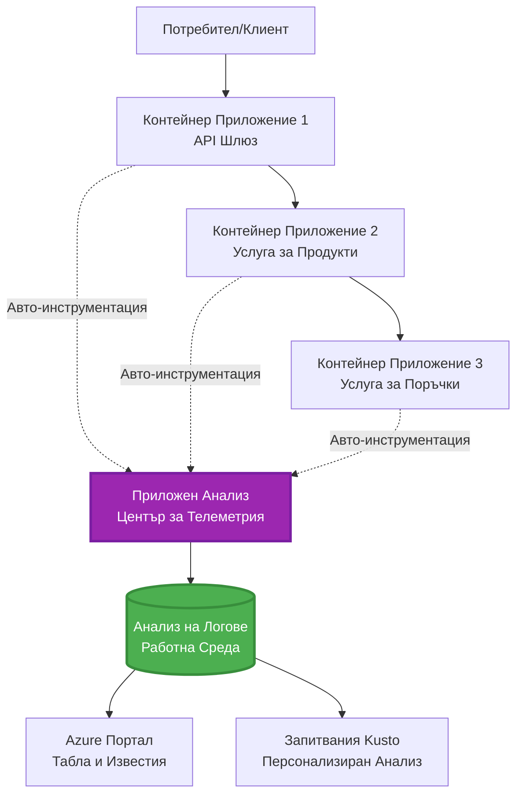
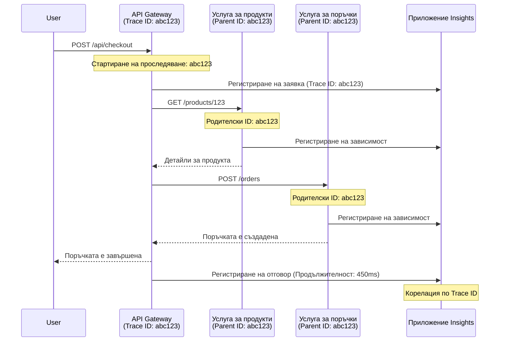

<!--
CO_OP_TRANSLATOR_METADATA:
{
  "original_hash": "e5aa37cdb6378c09099500ac31600b8c",
  "translation_date": "2025-11-23T20:09:26+00:00",
  "source_file": "docs/pre-deployment/application-insights.md",
  "language_code": "bg"
}
-->
# Интеграция на Application Insights с AZD

⏱️ **Очаквано време**: 40-50 минути | 💰 **Разходи**: ~$5-15/месец | ⭐ **Сложност**: Средно ниво

**📚 Учебен път:**
- ← Предишно: [Проверки преди стартиране](preflight-checks.md) - Валидация преди разгръщане
- 🎯 **Тук сте**: Интеграция на Application Insights (Мониторинг, телеметрия, дебъгинг)
- → Следващо: [Ръководство за разгръщане](../deployment/deployment-guide.md) - Разгръщане в Azure
- 🏠 [Начало на курса](../../README.md)

---

## Какво ще научите

След завършване на този урок ще можете:
- Да интегрирате **Application Insights** автоматично в проекти с AZD
- Да конфигурирате **разпределено проследяване** за микросървиси
- Да внедрите **персонализирана телеметрия** (метрики, събития, зависимости)
- Да настроите **живи метрики** за мониторинг в реално време
- Да създадете **сигнали и табла** от разгръщания с AZD
- Да дебъгвате проблеми в продукция с **заявки за телеметрия**
- Да оптимизирате **разходи и стратегии за семплиране**
- Да наблюдавате **AI/LLM приложения** (токени, латентност, разходи)

## Защо Application Insights с AZD е важен

### Предизвикателството: Наблюдаемост в продукция

**Без Application Insights:**
```
❌ No visibility into production behavior
❌ Manual log aggregation across services
❌ Reactive debugging (wait for customer complaints)
❌ No performance metrics
❌ Cannot trace requests across services
❌ Unknown failure rates and bottlenecks
```

**С Application Insights + AZD:**
```
✅ Automatic telemetry collection
✅ Centralized logs from all services
✅ Proactive issue detection
✅ End-to-end request tracing
✅ Performance metrics and insights
✅ Real-time dashboards
✅ AZD provisions everything automatically
```

**Аналогия**: Application Insights е като "черна кутия" за запис на полети + табло за управление на вашето приложение. Виждате всичко, което се случва в реално време, и можете да възпроизведете всякакъв инцидент.

---

## Преглед на архитектурата

### Application Insights в архитектурата на AZD


### Какво се наблюдава автоматично

| Тип телеметрия | Какво улавя | Приложение |
|----------------|-------------|------------|
| **Заявки** | HTTP заявки, статус кодове, продължителност | Мониторинг на API производителност |
| **Зависимости** | Външни повиквания (БД, API, хранилище) | Идентифициране на тесни места |
| **Изключения** | Непредвидени грешки със stack trace | Дебъгване на проблеми |
| **Персонализирани събития** | Бизнес събития (регистрация, покупка) | Аналитика и фунии |
| **Метрики** | Производителност, персонализирани метрики | Планиране на капацитет |
| **Трасета** | Лог съобщения със сериозност | Дебъгване и одит |
| **Наличност** | Тестове за време на работа и отговор | Мониторинг на SLA |

---

## Предварителни условия

### Необходими инструменти

```bash
# Проверете Azure Developer CLI
azd version
# ✅ Очаквано: azd версия 1.0.0 или по-висока

# Проверете Azure CLI
az --version
# ✅ Очаквано: azure-cli 2.50.0 или по-висока
```

### Изисквания към Azure

- Активен абонамент за Azure
- Разрешения за създаване на:
  - Ресурси за Application Insights
  - Работни пространства за Log Analytics
  - Контейнерни приложения
  - Групи ресурси

### Необходими знания

Трябва да сте завършили:
- [Основи на AZD](../getting-started/azd-basics.md) - Основни концепции на AZD
- [Конфигурация](../getting-started/configuration.md) - Настройка на среда
- [Първи проект](../getting-started/first-project.md) - Основно разгръщане

---

## Урок 1: Автоматичен Application Insights с AZD

### Как AZD създава Application Insights

AZD автоматично създава и конфигурира Application Insights при разгръщане. Нека видим как работи.

### Структура на проекта

```
monitored-app/
├── azure.yaml                     # AZD configuration
├── infra/
│   ├── main.bicep                # Main infrastructure
│   ├── core/
│   │   └── monitoring.bicep      # Application Insights + Log Analytics
│   └── app/
│       └── api.bicep             # Container App with monitoring
└── src/
    ├── app.py                    # Application with telemetry
    ├── requirements.txt
    └── Dockerfile
```

---

### Стъпка 1: Конфигуриране на AZD (azure.yaml)

**Файл: `azure.yaml`**

```yaml
name: monitored-app
metadata:
  template: monitored-app@1.0.0

services:
  api:
    project: ./src
    language: python
    host: containerapp

# AZD automatically provisions monitoring!
```

**Това е всичко!** AZD ще създаде Application Insights по подразбиране. Не е нужна допълнителна конфигурация за основен мониторинг.

---

### Стъпка 2: Инфраструктура за мониторинг (Bicep)

**Файл: `infra/core/monitoring.bicep`**

```bicep
param logAnalyticsName string
param applicationInsightsName string
param location string = resourceGroup().location
param tags object = {}

// Log Analytics Workspace (required for Application Insights)
resource logAnalytics 'Microsoft.OperationalInsights/workspaces@2022-10-01' = {
  name: logAnalyticsName
  location: location
  tags: tags
  properties: {
    sku: {
      name: 'PerGB2018'  // Pay-as-you-go pricing
    }
    retentionInDays: 30  // Keep logs for 30 days
    features: {
      enableLogAccessUsingOnlyResourcePermissions: true
    }
  }
}

// Application Insights
resource applicationInsights 'Microsoft.Insights/components@2020-02-02' = {
  name: applicationInsightsName
  location: location
  tags: tags
  kind: 'web'
  properties: {
    Application_Type: 'web'
    WorkspaceResourceId: logAnalytics.id
    IngestionMode: 'LogAnalytics'
    publicNetworkAccessForIngestion: 'Enabled'
    publicNetworkAccessForQuery: 'Enabled'
  }
}

// Outputs for Container Apps
output logAnalyticsWorkspaceId string = logAnalytics.id
output logAnalyticsWorkspaceName string = logAnalytics.name
output applicationInsightsConnectionString string = applicationInsights.properties.ConnectionString
output applicationInsightsInstrumentationKey string = applicationInsights.properties.InstrumentationKey
output applicationInsightsName string = applicationInsights.name
```

---

### Стъпка 3: Свързване на контейнерно приложение с Application Insights

**Файл: `infra/app/api.bicep`**

```bicep
param name string
param location string
param tags object = {}
param containerAppsEnvironmentName string
param applicationInsightsConnectionString string

resource containerApp 'Microsoft.App/containerApps@2023-05-01' = {
  name: name
  location: location
  tags: tags
  properties: {
    configuration: {
      ingress: {
        external: true
        targetPort: 8000
      }
      secrets: [
        {
          name: 'appinsights-connection-string'
          value: applicationInsightsConnectionString
        }
      ]
    }
    template: {
      containers: [
        {
          name: 'api'
          image: 'myregistry.azurecr.io/api:latest'
          resources: {
            cpu: json('0.5')
            memory: '1Gi'
          }
          env: [
            {
              name: 'APPLICATIONINSIGHTS_CONNECTION_STRING'
              secretRef: 'appinsights-connection-string'
            }
            {
              name: 'APPLICATIONINSIGHTS_ENABLED'
              value: 'true'
            }
          ]
        }
      ]
    }
  }
}

output uri string = 'https://${containerApp.properties.configuration.ingress.fqdn}'
```

---

### Стъпка 4: Код на приложението с телеметрия

**Файл: `src/app.py`**

```python
from flask import Flask, request, jsonify
from opencensus.ext.azure.log_exporter import AzureLogHandler
from opencensus.ext.azure.trace_exporter import AzureExporter
from opencensus.ext.flask.flask_middleware import FlaskMiddleware
from opencensus.trace.samplers import ProbabilitySampler
import logging
import os

app = Flask(__name__)

# Вземете низ за връзка с Application Insights
connection_string = os.environ.get('APPLICATIONINSIGHTS_CONNECTION_STRING')

if connection_string:
    # Конфигурирайте разпределено проследяване
    middleware = FlaskMiddleware(
        app,
        exporter=AzureExporter(connection_string=connection_string),
        sampler=ProbabilitySampler(rate=1.0)  # 100% семплиране за разработка
    )
    
    # Конфигурирайте логването
    logger = logging.getLogger(__name__)
    logger.addHandler(AzureLogHandler(connection_string=connection_string))
    logger.setLevel(logging.INFO)
    
    print("✅ Application Insights enabled")
else:
    logger = logging.getLogger(__name__)
    logger.setLevel(logging.INFO)
    print("⚠️ Application Insights not configured")

@app.route('/health')
def health():
    logger.info('Health check endpoint called')
    return jsonify({'status': 'healthy', 'monitoring': 'enabled'})

@app.route('/api/products')
def get_products():
    logger.info('Fetching products')
    
    # Симулирайте извикване на база данни (автоматично проследено като зависимост)
    products = [
        {'id': 1, 'name': 'Laptop', 'price': 999.99},
        {'id': 2, 'name': 'Mouse', 'price': 29.99},
        {'id': 3, 'name': 'Keyboard', 'price': 79.99}
    ]
    
    logger.info(f'Returned {len(products)} products')
    return jsonify(products)

@app.route('/api/error-test')
def error_test():
    """Test error tracking"""
    logger.error('Testing error tracking')
    try:
        raise ValueError('This is a test exception')
    except Exception as e:
        logger.exception('Exception occurred in error-test endpoint')
        return jsonify({'error': str(e)}), 500

@app.route('/api/slow')
def slow_endpoint():
    """Test performance tracking"""
    import time
    logger.info('Slow endpoint called')
    time.sleep(3)  # Симулирайте бавна операция
    logger.warning('Endpoint took 3 seconds to respond')
    return jsonify({'message': 'Slow operation completed'})

if __name__ == '__main__':
    app.run(host='0.0.0.0', port=8000)
```

**Файл: `src/requirements.txt`**

```txt
Flask==3.0.0
opencensus-ext-azure==1.1.13
opencensus-ext-flask==0.8.1
gunicorn==21.2.0
```

---

### Стъпка 5: Разгръщане и проверка

```bash
# Инициализирайте AZD
azd init

# Разгърнете (автоматично предоставя Application Insights)
azd up

# Вземете URL на приложението
APP_URL=$(azd env get-values | grep API_URL | cut -d '=' -f2 | tr -d '"')

# Генерирайте телеметрия
curl $APP_URL/health
curl $APP_URL/api/products
curl $APP_URL/api/error-test
curl $APP_URL/api/slow
```

**✅ Очакван резултат:**
```json
{
  "status": "healthy",
  "monitoring": "enabled"
}
```

---

### Стъпка 6: Преглед на телеметрията в Azure Portal

```bash
# Получете подробности за Application Insights
azd env get-values | grep APPLICATIONINSIGHTS

# Отворете в Azure Portal
az monitor app-insights component show \
  --app $(azd env get-values | grep APPLICATIONINSIGHTS_NAME | cut -d '=' -f2 | tr -d '"') \
  --resource-group $(azd env get-values | grep AZURE_RESOURCE_GROUP | cut -d '=' -f2 | tr -d '"') \
  --query "appId" -o tsv
```

**Навигирайте до Azure Portal → Application Insights → Търсене на транзакции**

Трябва да видите:
- ✅ HTTP заявки със статус кодове
- ✅ Продължителност на заявките (3+ секунди за `/api/slow`)
- ✅ Детайли за изключения от `/api/error-test`
- ✅ Персонализирани лог съобщения

---

## Урок 2: Персонализирана телеметрия и събития

### Проследяване на бизнес събития

Нека добавим персонализирана телеметрия за критични бизнес събития.

**Файл: `src/telemetry.py`**

```python
from opencensus.ext.azure import metrics_exporter
from opencensus.stats import aggregation as aggregation_module
from opencensus.stats import measure as measure_module
from opencensus.stats import stats as stats_module
from opencensus.stats import view as view_module
from opencensus.tags import tag_map as tag_map_module
from opencensus.ext.azure.log_exporter import AzureLogHandler
from opencensus.ext.azure.trace_exporter import AzureExporter
from opencensus.trace import tracer as tracer_module
import logging
import os

class TelemetryClient:
    """Custom telemetry client for Application Insights"""
    
    def __init__(self, connection_string=None):
        self.connection_string = connection_string or os.environ.get('APPLICATIONINSIGHTS_CONNECTION_STRING')
        
        if not self.connection_string:
            print("⚠️ Application Insights connection string not found")
            return
        
        # Настройка на регистратор
        self.logger = logging.getLogger(__name__)
        self.logger.addHandler(AzureLogHandler(connection_string=self.connection_string))
        self.logger.setLevel(logging.INFO)
        
        # Настройка на експортер на метрики
        self.stats = stats_module.stats
        self.view_manager = self.stats.view_manager
        self.stats_recorder = self.stats.stats_recorder
        
        exporter = metrics_exporter.new_metrics_exporter(
            connection_string=self.connection_string
        )
        self.view_manager.register_exporter(exporter)
        
        # Настройка на тракер
        self.tracer = tracer_module.Tracer(
            exporter=AzureExporter(connection_string=self.connection_string)
        )
        
        print("✅ Custom telemetry client initialized")
    
    def track_event(self, event_name: str, properties: dict = None):
        """Track custom business event"""
        properties = properties or {}
        self.logger.info(
            f"CustomEvent: {event_name}",
            extra={
                'custom_dimensions': {
                    'event_name': event_name,
                    **properties
                }
            }
        )
    
    def track_metric(self, metric_name: str, value: float, properties: dict = None):
        """Track custom metric"""
        properties = properties or {}
        self.logger.info(
            f"CustomMetric: {metric_name} = {value}",
            extra={
                'custom_dimensions': {
                    'metric_name': metric_name,
                    'value': value,
                    **properties
                }
            }
        )
    
    def track_dependency(self, name: str, dependency_type: str, duration: float, success: bool):
        """Track external dependency call"""
        with self.tracer.span(name=name) as span:
            span.add_attribute('dependency.type', dependency_type)
            span.add_attribute('duration', duration)
            span.add_attribute('success', success)

# Глобален клиент за телеметрия
telemetry = TelemetryClient()
```

### Актуализиране на приложението с персонализирани събития

**Файл: `src/app.py` (подобрен)**

```python
from flask import Flask, request, jsonify
from telemetry import telemetry
import time
import random

app = Flask(__name__)

@app.route('/api/purchase', methods=['POST'])
def purchase():
    """Track purchase event with custom telemetry"""
    data = request.json
    product_id = data.get('product_id')
    quantity = data.get('quantity', 1)
    price = data.get('price', 0)
    
    # Проследяване на бизнес събитие
    telemetry.track_event('Purchase', {
        'product_id': product_id,
        'quantity': quantity,
        'total_amount': price * quantity,
        'user_id': request.headers.get('X-User-Id', 'anonymous')
    })
    
    # Проследяване на метрика за приходи
    telemetry.track_metric('Revenue', price * quantity, {
        'product_id': product_id,
        'currency': 'USD'
    })
    
    return jsonify({
        'order_id': f'ORD-{random.randint(1000, 9999)}',
        'status': 'confirmed',
        'total': price * quantity
    })

@app.route('/api/search')
def search():
    """Track search queries"""
    query = request.args.get('q', '')
    
    start_time = time.time()
    
    # Симулиране на търсене (би било реална заявка към база данни)
    results = [{'id': 1, 'name': f'Result for {query}'}]
    
    duration = (time.time() - start_time) * 1000  # Преобразуване в милисекунди
    
    # Проследяване на събитие за търсене
    telemetry.track_event('Search', {
        'query': query,
        'results_count': len(results),
        'duration_ms': duration
    })
    
    # Проследяване на метрика за производителност на търсене
    telemetry.track_metric('SearchDuration', duration, {
        'query_length': len(query)
    })
    
    return jsonify({'results': results, 'count': len(results)})

@app.route('/api/external-call')
def external_call():
    """Track external API dependency"""
    import requests
    
    start_time = time.time()
    success = True
    
    try:
        # Симулиране на външно API обаждане
        response = requests.get('https://api.example.com/data', timeout=5)
        result = response.json()
    except Exception as e:
        success = False
        result = {'error': str(e)}
    
    duration = (time.time() - start_time) * 1000
    
    # Проследяване на зависимост
    telemetry.track_dependency(
        name='ExternalAPI',
        dependency_type='HTTP',
        duration=duration,
        success=success
    )
    
    return jsonify(result)

if __name__ == '__main__':
    app.run(host='0.0.0.0', port=8000)
```

### Тест на персонализирана телеметрия

```bash
# Проследяване на събитие за покупка
curl -X POST $APP_URL/api/purchase \
  -H "Content-Type: application/json" \
  -H "X-User-Id: user123" \
  -d '{"product_id": 1, "quantity": 2, "price": 29.99}'

# Проследяване на събитие за търсене
curl "$APP_URL/api/search?q=laptop"

# Проследяване на външна зависимост
curl $APP_URL/api/external-call
```

**Преглед в Azure Portal:**

Навигирайте до Application Insights → Logs, след това изпълнете:

```kusto
// View purchase events
traces
| where customDimensions.event_name == "Purchase"
| project 
    timestamp,
    product_id = tostring(customDimensions.product_id),
    total_amount = todouble(customDimensions.total_amount),
    user_id = tostring(customDimensions.user_id)
| order by timestamp desc

// View revenue metrics
traces
| where customDimensions.metric_name == "Revenue"
| summarize TotalRevenue = sum(todouble(customDimensions.value)) by bin(timestamp, 1h)
| render timechart

// View search performance
traces
| where customDimensions.event_name == "Search"
| summarize 
    AvgDuration = avg(todouble(customDimensions.duration_ms)),
    SearchCount = count()
  by bin(timestamp, 5m)
| render timechart
```

---

## Урок 3: Разпределено проследяване за микросървиси

### Активиране на проследяване между услуги

За микросървиси, Application Insights автоматично корелира заявки между услугите.

**Файл: `infra/main.bicep`**

```bicep
targetScope = 'subscription'

param environmentName string
param location string = 'eastus'

var tags = { 'azd-env-name': environmentName }

resource rg 'Microsoft.Resources/resourceGroups@2021-04-01' = {
  name: 'rg-${environmentName}'
  location: location
  tags: tags
}

// Monitoring (shared by all services)
module monitoring './core/monitoring.bicep' = {
  name: 'monitoring'
  scope: rg
  params: {
    logAnalyticsName: 'log-${environmentName}'
    applicationInsightsName: 'appi-${environmentName}'
    location: location
    tags: tags
  }
}

// API Gateway
module apiGateway './app/api-gateway.bicep' = {
  name: 'api-gateway'
  scope: rg
  params: {
    name: 'ca-gateway-${environmentName}'
    location: location
    tags: union(tags, { 'azd-service-name': 'gateway' })
    applicationInsightsConnectionString: monitoring.outputs.applicationInsightsConnectionString
  }
}

// Product Service
module productService './app/product-service.bicep' = {
  name: 'product-service'
  scope: rg
  params: {
    name: 'ca-products-${environmentName}'
    location: location
    tags: union(tags, { 'azd-service-name': 'products' })
    applicationInsightsConnectionString: monitoring.outputs.applicationInsightsConnectionString
  }
}

// Order Service
module orderService './app/order-service.bicep' = {
  name: 'order-service'
  scope: rg
  params: {
    name: 'ca-orders-${environmentName}'
    location: location
    tags: union(tags, { 'azd-service-name': 'orders' })
    applicationInsightsConnectionString: monitoring.outputs.applicationInsightsConnectionString
  }
}

output APPLICATIONINSIGHTS_CONNECTION_STRING string = monitoring.outputs.applicationInsightsConnectionString
output GATEWAY_URL string = apiGateway.outputs.uri
```

### Преглед на транзакция от край до край


**Заявка за проследяване от край до край:**

```kusto
// Find complete request flow
let traceId = "abc123...";  // Get from response header
dependencies
| union requests
| where operation_Id == traceId
| project 
    timestamp,
    type = itemType,
    name,
    duration,
    success,
    cloud_RoleName
| order by timestamp asc
```

---

## Урок 4: Живи метрики и мониторинг в реално време

### Активиране на Live Metrics Stream

Live Metrics предоставя телеметрия в реално време с <1 секунда латентност.

**Достъп до Live Metrics:**

```bash
# Вземете ресурса за Application Insights
APPI_NAME=$(azd env get-values | grep APPLICATIONINSIGHTS_NAME | cut -d '=' -f2 | tr -d '"')

# Вземете групата ресурси
RG_NAME=$(azd env get-values | grep AZURE_RESOURCE_GROUP | cut -d '=' -f2 | tr -d '"')

echo "Navigate to: Azure Portal → Resource Groups → $RG_NAME → $APPI_NAME → Live Metrics"
```

**Какво виждате в реално време:**
- ✅ Скорост на входящи заявки (заявки/сек)
- ✅ Изходящи повиквания към зависимости
- ✅ Брой изключения
- ✅ Използване на CPU и памет
- ✅ Брой активни сървъри
- ✅ Примерна телеметрия

### Генериране на натоварване за тест

```bash
# Генерирайте натоварване, за да видите живи метрики
for i in {1..100}; do
  curl $APP_URL/api/products &
  curl $APP_URL/api/search?q=test$i &
done

# Наблюдавайте живи метрики в Azure Portal
# Трябва да видите пик в скоростта на заявките
```

---

## Практически упражнения

### Упражнение 1: Настройка на сигнали ⭐⭐ (Средно)

**Цел**: Създайте сигнали за високи нива на грешки и бавни отговори.

**Стъпки:**

1. **Създаване на сигнал за ниво на грешки:**

```bash
# Вземете идентификатора на ресурса на Application Insights
APPI_ID=$(az monitor app-insights component show \
  --app $APPI_NAME \
  --resource-group $RG_NAME \
  --query "id" -o tsv)

# Създайте метрика за предупреждение за неуспешни заявки
az monitor metrics alert create \
  --name "High-Error-Rate" \
  --resource-group $RG_NAME \
  --scopes $APPI_ID \
  --condition "count requests/failed > 10" \
  --window-size 5m \
  --evaluation-frequency 1m \
  --description "Alert when error rate exceeds 10 per 5 minutes"
```

2. **Създаване на сигнал за бавни отговори:**

```bash
az monitor metrics alert create \
  --name "Slow-Responses" \
  --resource-group $RG_NAME \
  --scopes $APPI_ID \
  --condition "avg requests/duration > 3000" \
  --window-size 5m \
  --evaluation-frequency 1m \
  --description "Alert when average response time exceeds 3 seconds"
```

3. **Създаване на сигнал чрез Bicep (предпочитано за AZD):**

**Файл: `infra/core/alerts.bicep`**

```bicep
param applicationInsightsId string
param actionGroupId string = ''
param location string = resourceGroup().location

// High error rate alert
resource errorRateAlert 'Microsoft.Insights/metricAlerts@2018-03-01' = {
  name: 'high-error-rate'
  location: 'global'
  properties: {
    description: 'Alert when error rate exceeds threshold'
    severity: 2
    enabled: true
    scopes: [
      applicationInsightsId
    ]
    evaluationFrequency: 'PT1M'
    windowSize: 'PT5M'
    criteria: {
      'odata.type': 'Microsoft.Azure.Monitor.SingleResourceMultipleMetricCriteria'
      allOf: [
        {
          name: 'Error rate'
          metricName: 'requests/failed'
          operator: 'GreaterThan'
          threshold: 10
          timeAggregation: 'Count'
        }
      ]
    }
    actions: actionGroupId != '' ? [
      {
        actionGroupId: actionGroupId
      }
    ] : []
  }
}

// Slow response alert
resource slowResponseAlert 'Microsoft.Insights/metricAlerts@2018-03-01' = {
  name: 'slow-responses'
  location: 'global'
  properties: {
    description: 'Alert when response time is too high'
    severity: 3
    enabled: true
    scopes: [
      applicationInsightsId
    ]
    evaluationFrequency: 'PT1M'
    windowSize: 'PT5M'
    criteria: {
      'odata.type': 'Microsoft.Azure.Monitor.SingleResourceMultipleMetricCriteria'
      allOf: [
        {
          name: 'Response duration'
          metricName: 'requests/duration'
          operator: 'GreaterThan'
          threshold: 3000
          timeAggregation: 'Average'
        }
      ]
    }
  }
}

output errorAlertId string = errorRateAlert.id
output slowResponseAlertId string = slowResponseAlert.id
```

4. **Тест на сигналите:**

```bash
# Генериране на грешки
for i in {1..20}; do
  curl $APP_URL/api/error-test
done

# Генериране на бавни отговори
for i in {1..10}; do
  curl $APP_URL/api/slow
done

# Проверка на статус на предупреждение (изчакайте 5-10 минути)
az monitor metrics alert list \
  --resource-group $RG_NAME \
  --query "[].{Name:name, Enabled:enabled, State:properties.enabled}" \
  --output table
```

**✅ Критерии за успех:**
- ✅ Сигналите са създадени успешно
- ✅ Сигналите се активират при надвишаване на праговете
- ✅ Можете да видите историята на сигналите в Azure Portal
- ✅ Интегрирано с разгръщането чрез AZD

**Време**: 20-25 минути

---

### Упражнение 2: Създаване на персонализирано табло ⭐⭐ (Средно)

**Цел**: Създайте табло, показващо ключови метрики на приложението.

**Стъпки:**

1. **Създаване на табло чрез Azure Portal:**

Навигирайте до: Azure Portal → Dashboards → New Dashboard

2. **Добавяне на плочки за ключови метрики:**

- Брой заявки (последните 24 часа)
- Средно време за отговор
- Ниво на грешки
- Топ 5 най-бавни операции
- Географско разпределение на потребителите

3. **Създаване на табло чрез Bicep:**

**Файл: `infra/core/dashboard.bicep`**

```bicep
param dashboardName string
param applicationInsightsId string
param location string = resourceGroup().location

resource dashboard 'Microsoft.Portal/dashboards@2020-09-01-preview' = {
  name: dashboardName
  location: location
  properties: {
    lenses: [
      {
        order: 0
        parts: [
          // Request count
          {
            position: { x: 0, y: 0, rowSpan: 4, colSpan: 6 }
            metadata: {
              type: 'Extension/Microsoft_OperationsManagementSuite_Workspace/PartType/LogsDashboardPart'
              inputs: [
                {
                  name: 'resourceId'
                  value: applicationInsightsId
                }
                {
                  name: 'query'
                  value: '''
                    requests
                    | summarize RequestCount = count() by bin(timestamp, 1h)
                    | render timechart
                  '''
                }
              ]
            }
          }
          // Error rate
          {
            position: { x: 6, y: 0, rowSpan: 4, colSpan: 6 }
            metadata: {
              type: 'Extension/Microsoft_OperationsManagementSuite_Workspace/PartType/LogsDashboardPart'
              inputs: [
                {
                  name: 'resourceId'
                  value: applicationInsightsId
                }
                {
                  name: 'query'
                  value: '''
                    requests
                    | summarize 
                        Total = count(),
                        Failed = countif(success == false)
                    | extend ErrorRate = (Failed * 100.0) / Total
                    | project ErrorRate
                  '''
                }
              ]
            }
          }
        ]
      }
    ]
  }
}

output dashboardId string = dashboard.id
```

4. **Разгръщане на таблото:**

```bash
# Добавете към main.bicep
module dashboard './core/dashboard.bicep' = {
  name: 'dashboard'
  scope: rg
  params: {
    dashboardName: 'dashboard-${environmentName}'
    applicationInsightsId: monitoring.outputs.applicationInsightsId
    location: location
  }
}

# Разгърнете
azd up
```

**✅ Критерии за успех:**
- ✅ Таблото показва ключови метрики
- ✅ Може да се закачи на началната страница на Azure Portal
- ✅ Актуализира се в реално време
- ✅ Разгръщаемо чрез AZD

**Време**: 25-30 минути

---

### Упражнение 3: Мониторинг на AI/LLM приложение ⭐⭐⭐ (Напреднало)

**Цел**: Проследяване на използването на Azure OpenAI (токени, разходи, латентност).

**Стъпки:**

1. **Създаване на обвивка за мониторинг на AI:**

**Файл: `src/ai_telemetry.py`**

```python
from telemetry import telemetry
from openai import AzureOpenAI
import time

class MonitoredAzureOpenAI:
    """Azure OpenAI client with automatic telemetry"""
    
    def __init__(self, api_key, endpoint, api_version="2024-02-01"):
        self.client = AzureOpenAI(
            api_key=api_key,
            api_version=api_version,
            azure_endpoint=endpoint
        )
    
    def chat_completion(self, model: str, messages: list, **kwargs):
        """Track chat completion with telemetry"""
        start_time = time.time()
        
        try:
            # Обадете се на Azure OpenAI
            response = self.client.chat.completions.create(
                model=model,
                messages=messages,
                **kwargs
            )
            
            duration = (time.time() - start_time) * 1000  # мс
            
            # Извлечете използването
            usage = response.usage
            prompt_tokens = usage.prompt_tokens
            completion_tokens = usage.completion_tokens
            total_tokens = usage.total_tokens
            
            # Изчислете разходите (ценообразуване GPT-4)
            prompt_cost = (prompt_tokens / 1000) * 0.03  # $0.03 на 1K токена
            completion_cost = (completion_tokens / 1000) * 0.06  # $0.06 на 1K токена
            total_cost = prompt_cost + completion_cost
            
            # Проследяване на персонализирано събитие
            telemetry.track_event('OpenAI_Request', {
                'model': model,
                'prompt_tokens': prompt_tokens,
                'completion_tokens': completion_tokens,
                'total_tokens': total_tokens,
                'duration_ms': duration,
                'cost_usd': total_cost,
                'success': True
            })
            
            # Проследяване на метрики
            telemetry.track_metric('OpenAI_Tokens', total_tokens, {
                'model': model,
                'type': 'total'
            })
            
            telemetry.track_metric('OpenAI_Cost', total_cost, {
                'model': model,
                'currency': 'USD'
            })
            
            telemetry.track_metric('OpenAI_Duration', duration, {
                'model': model
            })
            
            return response
            
        except Exception as e:
            duration = (time.time() - start_time) * 1000
            
            telemetry.track_event('OpenAI_Request', {
                'model': model,
                'duration_ms': duration,
                'success': False,
                'error': str(e)
            })
            
            raise
```

2. **Използване на клиент с мониторинг:**

```python
from flask import Flask, request, jsonify
from ai_telemetry import MonitoredAzureOpenAI
import os

app = Flask(__name__)

# Инициализирайте наблюдавания клиент на OpenAI
openai_client = MonitoredAzureOpenAI(
    api_key=os.environ['AZURE_OPENAI_API_KEY'],
    endpoint=os.environ['AZURE_OPENAI_ENDPOINT']
)

@app.route('/api/chat', methods=['POST'])
def chat():
    data = request.json
    user_message = data.get('message')
    
    # Обадете се с автоматично наблюдение
    response = openai_client.chat_completion(
        model='gpt-4',
        messages=[
            {'role': 'user', 'content': user_message}
        ]
    )
    
    return jsonify({
        'response': response.choices[0].message.content,
        'tokens': response.usage.total_tokens
    })
```

3. **Заявка за AI метрики:**

```kusto
// Total AI spend over time
traces
| where customDimensions.event_name == "OpenAI_Request"
| where customDimensions.success == "True"
| summarize TotalCost = sum(todouble(customDimensions.cost_usd)) by bin(timestamp, 1h)
| render timechart

// Token usage by model
traces
| where customDimensions.event_name == "OpenAI_Request"
| summarize 
    TotalTokens = sum(toint(customDimensions.total_tokens)),
    RequestCount = count()
  by Model = tostring(customDimensions.model)

// Average latency
traces
| where customDimensions.event_name == "OpenAI_Request"
| summarize AvgDuration = avg(todouble(customDimensions.duration_ms))
| project AvgDurationSeconds = AvgDuration / 1000

// Cost per request
traces
| where customDimensions.event_name == "OpenAI_Request"
| extend Cost = todouble(customDimensions.cost_usd)
| summarize 
    TotalCost = sum(Cost),
    RequestCount = count(),
    AvgCostPerRequest = avg(Cost)
```

**✅ Критерии за успех:**
- ✅ Всяко повикване към OpenAI се проследява автоматично
- ✅ Видимо използване на токени и разходи
- ✅ Латентността се наблюдава
- ✅ Могат да се задават сигнали за бюджет

**Време**: 35-45 минути

---

## Оптимизация на разходите

### Стратегии за семплиране

Контролирайте разходите чрез семплиране на телеметрията:

```python
from opencensus.trace.samplers import ProbabilitySampler

# Разработка: 100% извадка
sampler = ProbabilitySampler(rate=1.0)

# Производство: 10% извадка (намаляване на разходите с 90%)
sampler = ProbabilitySampler(rate=0.1)

# Адаптивно вземане на проби (автоматично се настройва)
from opencensus.trace.samplers import AdaptiveSampler
sampler = AdaptiveSampler()
```

**В Bicep:**

```bicep
resource applicationInsights 'Microsoft.Insights/components@2020-02-02' = {
  name: applicationInsightsName
  properties: {
    SamplingPercentage: 10  // 10% sampling
  }
}
```

### Задържане на данни

```bicep
resource logAnalytics 'Microsoft.OperationalInsights/workspaces@2022-10-01' = {
  name: logAnalyticsName
  properties: {
    retentionInDays: 30  // Minimum (cheapest)
    // Options: 30, 31, 60, 90, 120, 180, 270, 365, 550, 730
  }
}
```

### Месечни оценки на разходите

| Обем данни | Задържане | Месечни разходи |
|------------|-----------|-----------------|
| 1 GB/месец | 30 дни | ~$2-5 |
| 5 GB/месец | 30 дни | ~$10-15 |
| 10 GB/месец | 90 дни | ~$25-40 |
| 50 GB/месец | 90 дни | ~$100-150 |

**Безплатен план**: 5 GB/месец включени

---

## Проверка на знанията

### 1. Основна интеграция ✓

Тествайте знанията си:

- [ ] **Въпрос 1**: Как AZD създава Application Insights?
  - **Отговор**: Автоматично чрез Bicep шаблони в `infra/core/monitoring.bicep`

- [ ] **Въпрос 2**: Коя променлива на средата активира Application Insights?
  - **Отговор**: `APPLICATIONINSIGHTS_CONNECTION_STRING`

- [ ] **Въпрос 3**: Кои са трите основни типа телеметрия?
  - **Отговор**: Заявки (HTTP повиквания), Зависимости (външни повиквания), Изключения (грешки)

**Практическа проверка:**
```bash
# Проверете дали Application Insights е конфигуриран
azd env get-values | grep APPLICATIONINSIGHTS

# Проверете дали телеметрията се предава
az monitor app-insights metrics show \
  --app $APPI_NAME \
  --resource-group $RG_NAME \
  --metric "requests/count"
```

---

### 2. Персонализирана телеметрия ✓

Тествайте знанията си:

- [ ] **Въпрос 1**: Как проследявате персонализирани бизнес събития?
  - **Отговор**: Използвайте logger с `custom_dimensions` или `TelemetryClient.track_event()`

- [ ] **Въпрос 2**: Каква е разликата между събития и метрики?
  - **Отговор**: Събитията са отделни случаи, метриките са числови измервания

- [ ] **Въпрос 3**: Как корелирате телеметрията между услуги?
  - **Отговор**: Application Insights автоматично използва `operation_Id` за корелация

**Практическа проверка:**
```kusto
// Verify custom events
traces
| where customDimensions.event_name != ""
| summarize count() by tostring(customDimensions.event_name)
```

---

### 3. Мониторинг в продукция ✓

Тествайте знанията си:

- [ ] **Въпрос 1**: Какво е семплиране и защо се използва?
  - **Отговор**: Семплирането намалява обема на данните (и разходите), като улавя само процент от телеметрията

- [ ] **Въпрос 2**: Как настройвате сигнали?
  - **Отговор**: Използвайте сигнали за метрики в Bicep или Azure Portal, базирани на метрики от Application Insights

- [ ] **Въпрос 3**: Каква е разликата между Log Analytics и Application Insights?
  - **Отговор**: Application Insights съхранява данни в Log Analytics workspace; App Insights предоставя специфични за приложението изгледи

**Практическа проверка:**
```bash
# Проверете конфигурацията за вземане на проби
az monitor app-insights component show \
  --app $APPI_NAME \
  --resource-group $RG_NAME \
  --query "properties.SamplingPercentage"
```

---

## Най-добри практики

### ✅ ПРАВЕТЕ:

1. **Използвайте корелационни ID**
   ```python
   logger.info('Processing order', extra={
       'custom_dimensions': {
           'order_id': order_id,
           'user_id': user_id
       }
   })
   ```

2. **Настройте сигнали за критични метрики**
   ```bicep
   // Error rate, slow responses, availability
   ```

3. **Използвайте структурирано логване**
   ```python
   # ✅ ДОБРО: Структурирано
   logger.info('User signup', extra={'custom_dimensions': {'user_id': 123}})
   
   # ❌ ЛОШО: Неструктурирано
   logger.info(f'User 123 signed up')
   ```

4. **Наблюдавайте зависимости**
   ```python
   # Автоматично проследяване на извиквания към базата данни, HTTP заявки и др.
   ```

5. **Използвайте Live Metrics по време на разгръщания**

### ❌ НЕ ПРАВЕТЕ:

1. **Не логвайте чувствителни данни**
   ```python
   # ❌ ЛОШО
   logger.info(f'Login: {username}:{password}')
   
   # ✅ ДОБРО
   logger.info('Login attempt', extra={'custom_dimensions': {'username': username}})
   ```

2. **Не използвайте 100% семплиране в продукция**
   ```python
   # ❌ Скъпо
   sampler = ProbabilitySampler(rate=1.0)
   
   # ✅ Рентабилно
   sampler = ProbabilitySampler(rate=0.1)
   ```

3. **Не игнорирайте опашки за неуспешни съобщения**

4. **Не забравяйте да зададете лимити за задържане на данни**

---

## Отстраняване на проблеми

### Проблем: Няма телеметрия

**Диагноза:**
```bash
# Проверете дали е зададен низът за връзка
azd env get-values | grep APPLICATIONINSIGHTS

# Проверете дневниците на приложението
azd logs api --tail 50
```

**Решение:**
```bash
# Проверете низът за връзка в Container App
az containerapp show \
  --name $APP_NAME \
  --resource-group $RG_NAME \
  --query "properties.template.containers[0].env" \
  | grep -i applicationinsights
```

---

### Проблем: Високи разходи

**Диагноза:**
```bash
# Проверете поглъщането на данни
az monitor app-insights metrics show \
  --app $APPI_NAME \
  --resource-group $RG_NAME \
  --metric "availabilityResults/count"
```

**Решение:**
- Намалете процента на семплиране
- Намалете периода на задържане
- Премахнете подробното логване

---

## Научете повече

### Официална документация
- [Преглед на Application Insights](https://learn.microsoft.com/azure/azure-monitor/app/app-insights-overview)
- [Application Insights за Python](https://learn.microsoft.com/azure/azure-monitor/app/opencensus-python)
- [Kusto Query Language](https://learn.microsoft.com/azure/data-explorer/kusto/query/)
- [Мониторинг с AZD](https://learn.microsoft.com/azure/developer/azure-developer-cli/monitor-your-app)

### Следващи стъпки в курса
- ← Предишно: [Проверки преди стартиране](preflight-checks.md)
- → Следващо: [Ръководство за разгръщане](../deployment/deployment-guide.md)
- 🏠 [Начало на курса](../../README.md)

### Свързани примери
- [Пример за Azure OpenAI](../../../../examples/azure-openai-chat) - AI телеметрия
- [Пример за микросървиси](../../../../examples/microservices) - Разпределено проследяване

---

## Резюме

**Научихте:**
- ✅ Автоматично създаване на Application Insights с AZD
- ✅ Персонализирана телеметрия (събития, метрики, зависимости)
- ✅ Разпределено проследяване между микросървиси
- ✅ Живи метрики и мониторинг в реално време
- ✅ Сигнали и табла
- ✅ Мониторинг на приложения с AI/LLM
- ✅ Стратегии за оптимизация на разходите

**Основни изводи:**
1. **AZD автоматично настройва мониторинга** - Без ръчна конфигурация
2. **Използвайте структурирано логване** - Улеснява заявките
3. **Проследявайте бизнес събития** - Не само технически метрики
4. **Следете разходите за AI** - Проследявайте токени и разходи
5. **Настройте известия** - Бъдете проактивни, а не реактивни
6. **Оптимизирайте разходите** - Използвайте семплиране и ограничения за съхранение

**Следващи стъпки:**
1. Завършете практическите упражнения
2. Добавете Application Insights към вашите AZD проекти
3. Създайте персонализирани табла за вашия екип
4. Научете [Ръководство за внедряване](../deployment/deployment-guide.md)

---

<!-- CO-OP TRANSLATOR DISCLAIMER START -->
**Отказ от отговорност**:  
Този документ е преведен с помощта на AI услуга за превод [Co-op Translator](https://github.com/Azure/co-op-translator). Въпреки че се стремим към точност, моля, имайте предвид, че автоматизираните преводи може да съдържат грешки или неточности. Оригиналният документ на неговия роден език трябва да се счита за авторитетен източник. За критична информация се препоръчва професионален човешки превод. Не носим отговорност за недоразумения или погрешни интерпретации, произтичащи от използването на този превод.
<!-- CO-OP TRANSLATOR DISCLAIMER END -->