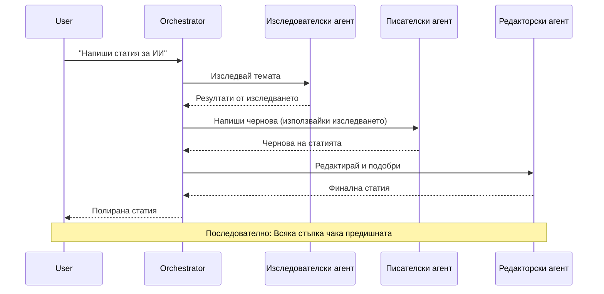
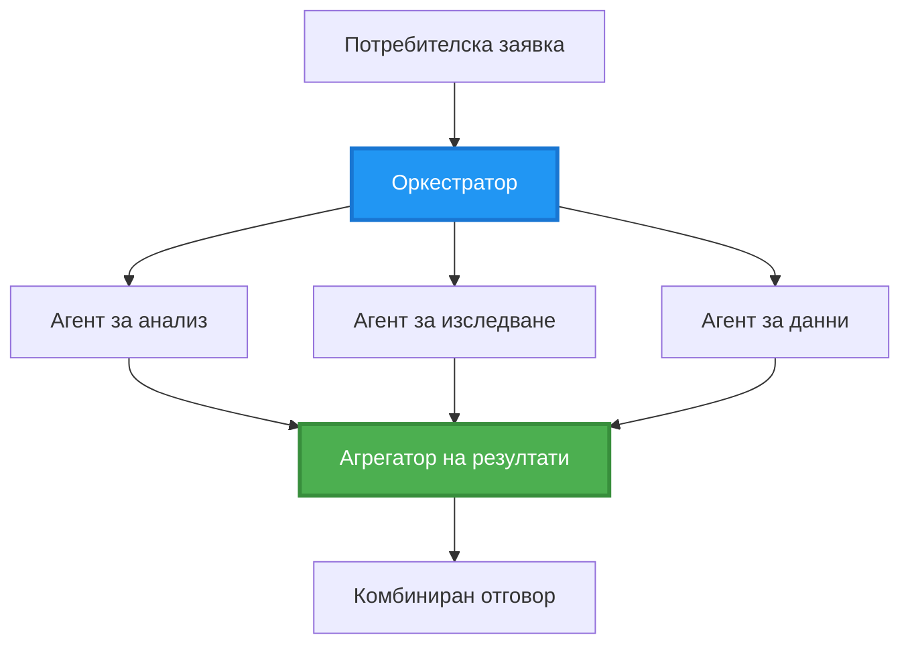
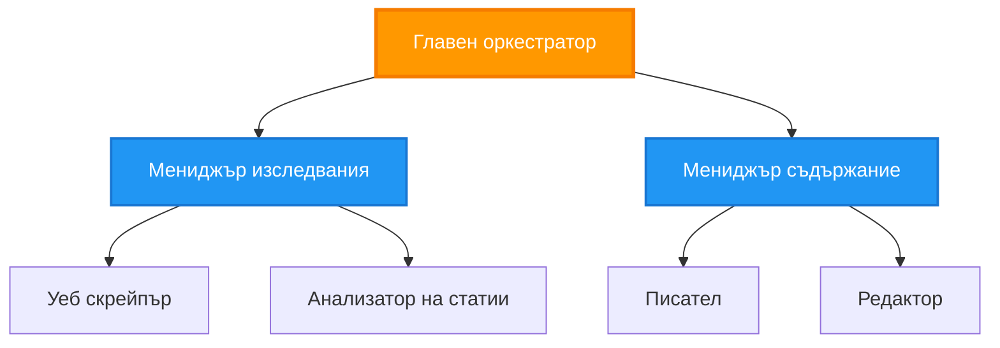
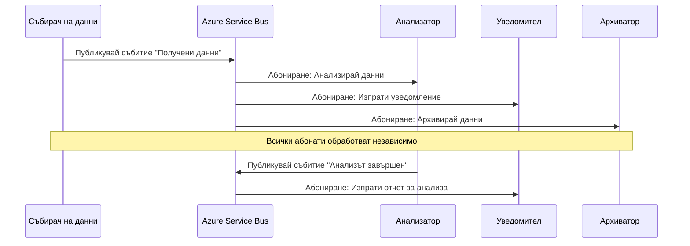
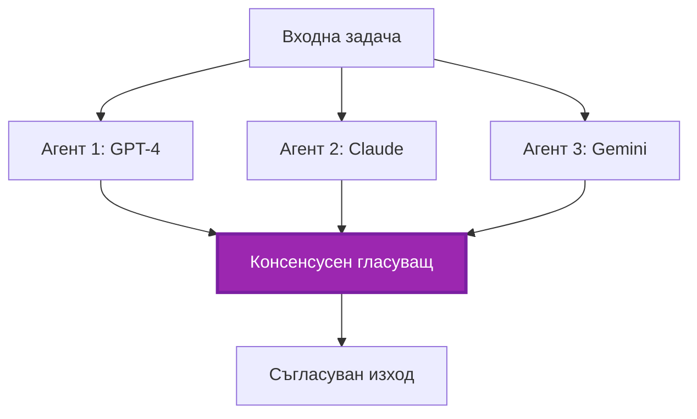
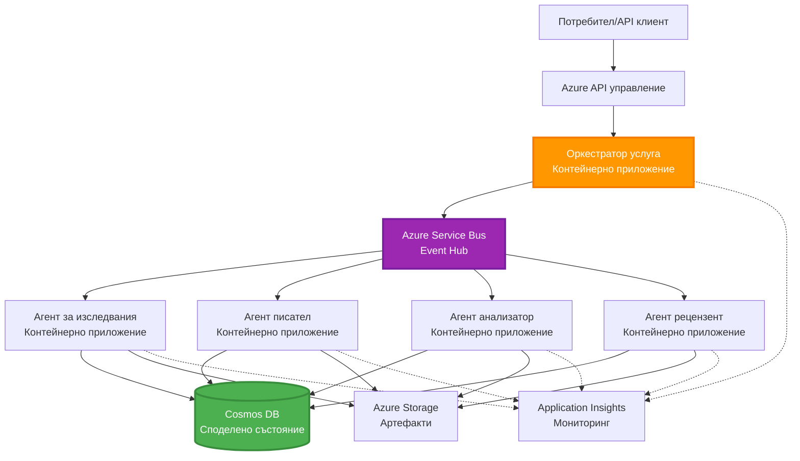

<!--
CO_OP_TRANSLATOR_METADATA:
{
  "original_hash": "bcefbd5d0107691ef3e6e33ba694d6f4",
  "translation_date": "2025-11-23T20:00:52+00:00",
  "source_file": "docs/pre-deployment/coordination-patterns.md",
  "language_code": "bg"
}
-->
# Модели за координация на многоагентни системи

⏱️ **Прогнозно време**: 60-75 минути | 💰 **Прогнозна цена**: ~$100-300/месец | ⭐ **Сложност**: Напреднала

**📚 Учебен път:**
- ← Предишно: [Планиране на капацитет](capacity-planning.md) - Стратегии за размер и мащабиране на ресурси
- 🎯 **Тук сте**: Модели за координация на многоагентни системи (Оркестрация, комуникация, управление на състояние)
- → Следващо: [Избор на SKU](sku-selection.md) - Избор на подходящи услуги в Azure
- 🏠 [Начало на курса](../../README.md)

---

## Какво ще научите

След завършване на този урок ще:
- Разберете **архитектурни модели за многоагентни системи** и кога да ги използвате
- Реализирате **модели за оркестрация** (централизирана, децентрализирана, йерархична)
- Проектирате **стратегии за комуникация между агенти** (синхронна, асинхронна, базирана на събития)
- Управлявате **споделено състояние** между разпределени агенти
- Разгърнете **многоагентни системи** в Azure с AZD
- Приложите **модели за координация** в реални AI сценарии
- Наблюдавате и отстранявате проблеми в разпределени системи от агенти

## Защо координацията на многоагентни системи е важна

### Еволюцията: От единичен агент към многоагентна система

**Единичен агент (Прост):**
```
User → Agent → Response
```
- ✅ Лесен за разбиране и реализация
- ✅ Бърз за прости задачи
- ❌ Ограничен от възможностите на един модел
- ❌ Не може да паралелизира сложни задачи
- ❌ Липса на специализация

**Многоагентна система (Напреднала):**
```
           ┌─────────────┐
           │ Orchestrator│
           └──────┬──────┘
        ┌─────────┼─────────┐
        │         │         │
    ┌───▼──┐  ┌──▼───┐  ┌──▼────┐
    │Agent1│  │Agent2│  │Agent3 │
    │(Plan)│  │(Code)│  │(Review)│
    └──────┘  └──────┘  └───────┘
```
- ✅ Специализирани агенти за конкретни задачи
- ✅ Паралелно изпълнение за скорост
- ✅ Модулна и лесна за поддръжка
- ✅ По-добра при сложни работни потоци
- ⚠️ Изисква логика за координация

**Аналогия**: Единичният агент е като един човек, който върши всички задачи. Многоагентната система е като екип, където всеки член има специализирани умения (изследовател, програмист, редактор, писател), работещи заедно.

---

## Основни модели за координация

### Модел 1: Последователна координация (Верига на отговорност)

**Кога да използвате**: Задачите трябва да се изпълняват в определен ред, като всеки агент надгражда върху предишния изход.


**Ползи:**
- ✅ Ясен поток от данни
- ✅ Лесен за отстраняване на проблеми
- ✅ Предсказуем ред на изпълнение

**Ограничения:**
- ❌ По-бавен (липса на паралелизъм)
- ❌ Един провал блокира цялата верига
- ❌ Не може да обработва взаимозависими задачи

**Примери за употреба:**
- Процес на създаване на съдържание (изследване → писане → редактиране → публикуване)
- Генериране на код (планиране → имплементация → тестване → разгръщане)
- Генериране на отчети (събиране на данни → анализ → визуализация → обобщение)

---

### Модел 2: Паралелна координация (Разделяне/Събиране)

**Кога да използвате**: Независими задачи могат да се изпълняват едновременно, резултатите се комбинират накрая.


**Ползи:**
- ✅ Бърз (паралелно изпълнение)
- ✅ Устойчив на грешки (приемливи частични резултати)
- ✅ Хоризонтално мащабируем

**Ограничения:**
- ⚠️ Резултатите може да пристигат в различен ред
- ⚠️ Нужна е логика за агрегиране
- ⚠️ Сложно управление на състоянието

**Примери за употреба:**
- Събиране на данни от множество източници (API-та + бази данни + уеб скрапинг)
- Конкурентен анализ (множество модели генерират решения, най-доброто се избира)
- Услуги за превод (превод на множество езици едновременно)

---

### Модел 3: Йерархична координация (Мениджър-Работник)

**Кога да използвате**: Сложни работни потоци с подзадачи, нужда от делегиране.


**Ползи:**
- ✅ Обработва сложни работни потоци
- ✅ Модулен и лесен за поддръжка
- ✅ Ясно разпределение на отговорностите

**Ограничения:**
- ⚠️ По-сложна архитектура
- ⚠️ По-висока латентност (множество слоеве на координация)
- ⚠️ Изисква усъвършенствана оркестрация

**Примери за употреба:**
- Обработка на документи в предприятия (класифициране → маршрутизиране → обработка → архивиране)
- Многоетапни потоци от данни (въвеждане → почистване → трансформация → анализ → отчет)
- Сложни автоматизирани работни потоци (планиране → разпределение на ресурси → изпълнение → мониторинг)

---

### Модел 4: Координация, базирана на събития (Публикуване-Абониране)

**Кога да използвате**: Агенти трябва да реагират на събития, желана е слаба свързаност.


**Ползи:**
- ✅ Слаба свързаност между агенти
- ✅ Лесно добавяне на нови агенти (само абониране)
- ✅ Асинхронна обработка
- ✅ Устойчивост (запазване на съобщения)

**Ограничения:**
- ⚠️ Съгласуваност в крайна сметка
- ⚠️ Сложно отстраняване на проблеми
- ⚠️ Предизвикателства с реда на съобщенията

**Примери за употреба:**
- Системи за мониторинг в реално време (сигнали, табла, логове)
- Многоканални известия (имейл, SMS, push, Slack)
- Поток от данни за обработка (множество потребители на едни и същи данни)

---

### Модел 5: Координация, базирана на консенсус (Гласуване/Кворум)

**Кога да използвате**: Нужда от съгласие между множество агенти преди продължаване.


**Ползи:**
- ✅ По-висока точност (множество мнения)
- ✅ Устойчивост на грешки (приемливи малцинствени провали)
- ✅ Вградена проверка на качеството

**Ограничения:**
- ❌ Скъпо (множество повиквания към модели)
- ❌ По-бавно (изчакване на всички агенти)
- ⚠️ Нужна е логика за разрешаване на конфликти

**Примери за употреба:**
- Модериране на съдържание (множество модели преглеждат съдържание)
- Преглед на код (множество линтери/анализатори)
- Медицинска диагностика (множество AI модели, валидиране от експерти)

---

## Преглед на архитектурата

### Пълна многоагентна система в Azure


**Основни компоненти:**

| Компонент | Цел | Услуга в Azure |
|-----------|-----|----------------|
| **API Gateway** | Входна точка, ограничаване на скоростта, удостоверяване | API Management |
| **Оркестратор** | Координира работните потоци на агенти | Container Apps |
| **Message Queue** | Асинхронна комуникация | Service Bus / Event Hubs |
| **Агенти** | Специализирани AI работници | Container Apps / Functions |
| **State Store** | Споделено състояние, проследяване на задачи | Cosmos DB |
| **Artifact Storage** | Документи, резултати, логове | Blob Storage |
| **Monitoring** | Разпределено проследяване, логове | Application Insights |

---

## Предварителни изисквания

### Необходими инструменти

```bash
# Проверете Azure Developer CLI
azd version
# ✅ Очаквано: azd версия 1.0.0 или по-висока

# Проверете Azure CLI
az --version
# ✅ Очаквано: azure-cli 2.50.0 или по-висока

# Проверете Docker (за локално тестване)
docker --version
# ✅ Очаквано: Docker версия 20.10 или по-висока
```

### Изисквания за Azure

- Активен абонамент за Azure
- Разрешения за създаване на:
  - Container Apps
  - Service Bus namespaces
  - Cosmos DB accounts
  - Storage accounts
  - Application Insights

### Предварителни знания

Трябва да сте завършили:
- [Управление на конфигурации](../getting-started/configuration.md)
- [Удостоверяване и сигурност](../getting-started/authsecurity.md)
- [Пример за микросервиси](../../../../examples/microservices)

---

## Ръководство за реализация

### Структура на проекта

```
multi-agent-system/
├── azure.yaml                    # AZD configuration
├── infra/
│   ├── main.bicep               # Main infrastructure
│   ├── core/
│   │   ├── servicebus.bicep     # Message queue
│   │   ├── cosmos.bicep         # State store
│   │   ├── storage.bicep        # Artifact storage
│   │   └── monitoring.bicep     # Application Insights
│   └── app/
│       ├── orchestrator.bicep   # Orchestrator service
│       └── agent.bicep          # Agent template
└── src/
    ├── orchestrator/            # Orchestration logic
    │   ├── app.py
    │   ├── workflows.py
    │   └── Dockerfile
    ├── agents/
    │   ├── research/            # Research agent
    │   ├── writer/              # Writer agent
    │   ├── analyst/             # Analyst agent
    │   └── reviewer/            # Reviewer agent
    └── shared/
        ├── state_manager.py     # Shared state logic
        └── message_handler.py   # Message handling
```

---

## Урок 1: Модел за последователна координация

### Реализация: Процес на създаване на съдържание

Да изградим последователен процес: Изследване → Писане → Редактиране → Публикуване

### 1. Конфигурация на AZD

**Файл: `azure.yaml`**

```yaml
name: content-pipeline
metadata:
  template: multi-agent-sequential@1.0.0

services:
  orchestrator:
    project: ./src/orchestrator
    language: python
    host: containerapp
  
  research-agent:
    project: ./src/agents/research
    language: python
    host: containerapp
  
  writer-agent:
    project: ./src/agents/writer
    language: python
    host: containerapp
  
  editor-agent:
    project: ./src/agents/editor
    language: python
    host: containerapp
```

### 2. Инфраструктура: Service Bus за координация

**Файл: `infra/core/servicebus.bicep`**

```bicep
param name string
param location string
param tags object = {}

resource serviceBusNamespace 'Microsoft.ServiceBus/namespaces@2022-10-01-preview' = {
  name: name
  location: location
  tags: tags
  sku: {
    name: 'Standard'
    tier: 'Standard'
  }
  properties: {
    minimumTlsVersion: '1.2'
  }
}

// Queue for orchestrator → research agent
resource researchQueue 'Microsoft.ServiceBus/namespaces/queues@2022-10-01-preview' = {
  parent: serviceBusNamespace
  name: 'research-tasks'
  properties: {
    maxDeliveryCount: 3
    lockDuration: 'PT5M'
    deadLetteringOnMessageExpiration: true
  }
}

// Queue for research agent → writer agent
resource writerQueue 'Microsoft.ServiceBus/namespaces/queues@2022-10-01-preview' = {
  parent: serviceBusNamespace
  name: 'writer-tasks'
  properties: {
    maxDeliveryCount: 3
    lockDuration: 'PT5M'
  }
}

// Queue for writer agent → editor agent
resource editorQueue 'Microsoft.ServiceBus/namespaces/queues@2022-10-01-preview' = {
  parent: serviceBusNamespace
  name: 'editor-tasks'
  properties: {
    maxDeliveryCount: 3
    lockDuration: 'PT5M'
  }
}

output namespace string = serviceBusNamespace.name
output connectionString string = listKeys('${serviceBusNamespace.id}/AuthorizationRules/RootManageSharedAccessKey', serviceBusNamespace.apiVersion).primaryConnectionString
```

### 3. Мениджър на споделено състояние

**Файл: `src/shared/state_manager.py`**

```python
from azure.cosmos import CosmosClient, PartitionKey
from datetime import datetime
import os

class StateManager:
    """Manages shared state across agents using Cosmos DB"""
    
    def __init__(self):
        endpoint = os.environ['COSMOS_ENDPOINT']
        key = os.environ['COSMOS_KEY']
        
        self.client = CosmosClient(endpoint, key)
        self.database = self.client.get_database_client('agent-state')
        self.container = self.database.get_container_client('tasks')
    
    def create_task(self, task_id: str, task_type: str, input_data: dict):
        """Create a new task"""
        task = {
            'id': task_id,
            'type': task_type,
            'status': 'pending',
            'input': input_data,
            'created_at': datetime.utcnow().isoformat(),
            'steps': []
        }
        self.container.create_item(task)
        return task
    
    def update_task_step(self, task_id: str, step_name: str, result: dict):
        """Update task with completed step"""
        task = self.container.read_item(task_id, partition_key=task_id)
        
        task['steps'].append({
            'name': step_name,
            'completed_at': datetime.utcnow().isoformat(),
            'result': result
        })
        
        self.container.replace_item(task_id, task)
        return task
    
    def complete_task(self, task_id: str, final_result: dict):
        """Mark task as complete"""
        task = self.container.read_item(task_id, partition_key=task_id)
        task['status'] = 'completed'
        task['result'] = final_result
        task['completed_at'] = datetime.utcnow().isoformat()
        self.container.replace_item(task_id, task)
        return task
    
    def get_task(self, task_id: str):
        """Retrieve task state"""
        return self.container.read_item(task_id, partition_key=task_id)
```

### 4. Услуга за оркестрация

**Файл: `src/orchestrator/app.py`**

```python
from flask import Flask, request, jsonify
from azure.servicebus import ServiceBusClient, ServiceBusMessage
import json
import uuid
import os
from shared.state_manager import StateManager

app = Flask(__name__)
state_manager = StateManager()

# Връзка със Service Bus
servicebus_connection_str = os.environ['SERVICEBUS_CONNECTION_STRING']
servicebus_client = ServiceBusClient.from_connection_string(servicebus_connection_str)

@app.route('/health', methods=['GET'])
def health():
    return jsonify({'status': 'healthy', 'service': 'orchestrator'})

@app.route('/create-content', methods=['POST'])
def create_content():
    """
    Sequential workflow: Research → Write → Edit → Publish
    """
    data = request.json
    topic = data.get('topic')
    
    if not topic:
        return jsonify({'error': 'Topic required'}), 400
    
    # Създаване на задача в хранилището на състояния
    task_id = str(uuid.uuid4())
    task = state_manager.create_task(
        task_id=task_id,
        task_type='content_creation',
        input_data={'topic': topic}
    )
    
    # Изпращане на съобщение до изследователския агент (първа стъпка)
    sender = servicebus_client.get_queue_sender('research-tasks')
    message = ServiceBusMessage(
        body=json.dumps({
            'task_id': task_id,
            'topic': topic,
            'next_queue': 'writer-tasks'  # Къде да се изпратят резултатите
        }),
        content_type='application/json'
    )
    
    with sender:
        sender.send_messages(message)
    
    return jsonify({
        'task_id': task_id,
        'status': 'started',
        'workflow': 'sequential',
        'steps': ['research', 'write', 'edit', 'publish'],
        'message': 'Content creation pipeline initiated'
    }), 202

@app.route('/task/<task_id>', methods=['GET'])
def get_task_status(task_id):
    """Check task status"""
    try:
        task = state_manager.get_task(task_id)
        return jsonify(task)
    except Exception as e:
        return jsonify({'error': str(e)}), 404

if __name__ == '__main__':
    app.run(host='0.0.0.0', port=8080)
```

### 5. Агент за изследване

**Файл: `src/agents/research/app.py`**

```python
from azure.servicebus import ServiceBusClient, ServiceBusMessage
from openai import AzureOpenAI
import json
import os
import time
from shared.state_manager import StateManager

# Инициализиране на клиенти
state_manager = StateManager()
servicebus_client = ServiceBusClient.from_connection_string(
    os.environ['SERVICEBUS_CONNECTION_STRING']
)

openai_client = AzureOpenAI(
    api_key=os.environ['AZURE_OPENAI_API_KEY'],
    api_version="2024-02-01",
    azure_endpoint=os.environ['AZURE_OPENAI_ENDPOINT']
)

def process_research_task(message_data):
    """Process research request and pass to writer"""
    task_id = message_data['task_id']
    topic = message_data['topic']
    next_queue = message_data['next_queue']
    
    print(f"🔬 Researching: {topic}")
    
    # Обадете се на Azure OpenAI за изследване
    response = openai_client.chat.completions.create(
        model="gpt-4",
        messages=[
            {"role": "system", "content": "You are a research assistant. Provide comprehensive research on the given topic."},
            {"role": "user", "content": f"Research this topic thoroughly: {topic}"}
        ],
        max_tokens=1500
    )
    
    research_results = response.choices[0].message.content
    
    # Актуализиране на състоянието
    state_manager.update_task_step(
        task_id=task_id,
        step_name='research',
        result={'research': research_results}
    )
    
    # Изпратете към следващия агент (писател)
    sender = servicebus_client.get_queue_sender(next_queue)
    message = ServiceBusMessage(
        body=json.dumps({
            'task_id': task_id,
            'topic': topic,
            'research': research_results,
            'next_queue': 'editor-tasks'
        }),
        content_type='application/json'
    )
    
    with sender:
        sender.send_messages(message)
    
    print(f"✅ Research complete for task {task_id}")

def main():
    """Listen to research queue"""
    receiver = servicebus_client.get_queue_receiver('research-tasks')
    
    print("🔬 Research Agent started, listening for tasks...")
    
    with receiver:
        while True:
            messages = receiver.receive_messages(max_wait_time=5)
            for message in messages:
                try:
                    message_data = json.loads(str(message))
                    process_research_task(message_data)
                    receiver.complete_message(message)
                except Exception as e:
                    print(f"❌ Error processing message: {e}")
                    receiver.abandon_message(message)

if __name__ == '__main__':
    main()
```

### 6. Агент за писане

**Файл: `src/agents/writer/app.py`**

```python
from azure.servicebus import ServiceBusClient, ServiceBusMessage
from openai import AzureOpenAI
import json
import os
from shared.state_manager import StateManager

state_manager = StateManager()
servicebus_client = ServiceBusClient.from_connection_string(
    os.environ['SERVICEBUS_CONNECTION_STRING']
)

openai_client = AzureOpenAI(
    api_key=os.environ['AZURE_OPENAI_API_KEY'],
    api_version="2024-02-01",
    azure_endpoint=os.environ['AZURE_OPENAI_ENDPOINT']
)

def process_writing_task(message_data):
    """Write article based on research"""
    task_id = message_data['task_id']
    topic = message_data['topic']
    research = message_data['research']
    next_queue = message_data['next_queue']
    
    print(f"✍️ Writing article: {topic}")
    
    # Обадете се на Azure OpenAI, за да напише статия
    response = openai_client.chat.completions.create(
        model="gpt-4",
        messages=[
            {"role": "system", "content": "You are a professional writer. Write engaging, well-structured articles."},
            {"role": "user", "content": f"Based on this research:\n\n{research}\n\nWrite a comprehensive article about: {topic}"}
        ],
        max_tokens=2000
    )
    
    article_draft = response.choices[0].message.content
    
    # Актуализирайте състоянието
    state_manager.update_task_step(
        task_id=task_id,
        step_name='writing',
        result={'draft': article_draft}
    )
    
    # Изпратете на редактора
    sender = servicebus_client.get_queue_sender(next_queue)
    message = ServiceBusMessage(
        body=json.dumps({
            'task_id': task_id,
            'topic': topic,
            'draft': article_draft
        }),
        content_type='application/json'
    )
    
    with sender:
        sender.send_messages(message)
    
    print(f"✅ Article draft complete for task {task_id}")

def main():
    """Listen to writer queue"""
    receiver = servicebus_client.get_queue_receiver('writer-tasks')
    
    print("✍️ Writer Agent started, listening for tasks...")
    
    with receiver:
        while True:
            messages = receiver.receive_messages(max_wait_time=5)
            for message in messages:
                try:
                    message_data = json.loads(str(message))
                    process_writing_task(message_data)
                    receiver.complete_message(message)
                except Exception as e:
                    print(f"❌ Error: {e}")
                    receiver.abandon_message(message)

if __name__ == '__main__':
    main()
```

### 7. Агент за редактиране

**Файл: `src/agents/editor/app.py`**

```python
from azure.servicebus import ServiceBusClient
from openai import AzureOpenAI
import json
import os
from shared.state_manager import StateManager

state_manager = StateManager()
servicebus_client = ServiceBusClient.from_connection_string(
    os.environ['SERVICEBUS_CONNECTION_STRING']
)

openai_client = AzureOpenAI(
    api_key=os.environ['AZURE_OPENAI_API_KEY'],
    api_version="2024-02-01",
    azure_endpoint=os.environ['AZURE_OPENAI_ENDPOINT']
)

def process_editing_task(message_data):
    """Edit and finalize article"""
    task_id = message_data['task_id']
    topic = message_data['topic']
    draft = message_data['draft']
    
    print(f"📝 Editing article: {topic}")
    
    # Обадете се на Azure OpenAI за редактиране
    response = openai_client.chat.completions.create(
        model="gpt-4",
        messages=[
            {"role": "system", "content": "You are an expert editor. Improve grammar, clarity, and structure."},
            {"role": "user", "content": f"Edit and improve this article:\n\n{draft}"}
        ],
        max_tokens=2000
    )
    
    final_article = response.choices[0].message.content
    
    # Отбележете задачата като завършена
    state_manager.complete_task(
        task_id=task_id,
        final_result={
            'topic': topic,
            'final_article': final_article,
            'word_count': len(final_article.split())
        }
    )
    
    print(f"✅ Article finalized for task {task_id}")

def main():
    """Listen to editor queue"""
    receiver = servicebus_client.get_queue_receiver('editor-tasks')
    
    print("📝 Editor Agent started, listening for tasks...")
    
    with receiver:
        while True:
            messages = receiver.receive_messages(max_wait_time=5)
            for message in messages:
                try:
                    message_data = json.loads(str(message))
                    process_editing_task(message_data)
                    receiver.complete_message(message)
                except Exception as e:
                    print(f"❌ Error: {e}")
                    receiver.abandon_message(message)

if __name__ == '__main__':
    main()
```

### 8. Разгръщане и тестване

```bash
# Инициализирай и разположи
azd init
azd up

# Вземи URL на оркестратора
ORCHESTRATOR_URL=$(azd env get-values | grep ORCHESTRATOR_URL | cut -d '=' -f2 | tr -d '"')

# Създай съдържание
curl -X POST $ORCHESTRATOR_URL/create-content \
  -H "Content-Type: application/json" \
  -d '{"topic": "The Future of AI in Healthcare"}'
```

**✅ Очакван резултат:**
```json
{
  "task_id": "a1b2c3d4-e5f6-7890-abcd-ef1234567890",
  "status": "started",
  "workflow": "sequential",
  "steps": ["research", "write", "edit", "publish"],
  "message": "Content creation pipeline initiated"
}
```

**Проверка на напредъка на задачите:**
```bash
TASK_ID="a1b2c3d4-e5f6-7890-abcd-ef1234567890"
curl $ORCHESTRATOR_URL/task/$TASK_ID
```

**✅ Очакван резултат (завършен):**
```json
{
  "id": "a1b2c3d4-e5f6-7890-abcd-ef1234567890",
  "type": "content_creation",
  "status": "completed",
  "steps": [
    {
      "name": "research",
      "completed_at": "2025-11-19T10:30:00Z",
      "result": {"research": "..."}
    },
    {
      "name": "writing",
      "completed_at": "2025-11-19T10:32:00Z",
      "result": {"draft": "..."}
    }
  ],
  "result": {
    "topic": "The Future of AI in Healthcare",
    "final_article": "...",
    "word_count": 1500
  }
}
```

---

## Урок 2: Модел за паралелна координация

### Реализация: Агрегатор за многоизточниково изследване

Да изградим паралелна система, която събира информация от множество източници едновременно.

### Паралелен оркестратор

**Файл: `src/orchestrator/parallel_workflow.py`**

```python
from flask import Flask, request, jsonify
from azure.servicebus import ServiceBusClient, ServiceBusMessage
import json
import uuid
import os
from shared.state_manager import StateManager

app = Flask(__name__)
state_manager = StateManager()

servicebus_client = ServiceBusClient.from_connection_string(
    os.environ['SERVICEBUS_CONNECTION_STRING']
)

@app.route('/research-parallel', methods=['POST'])
def research_parallel():
    """
    Parallel workflow: Multiple agents work simultaneously
    """
    data = request.json
    query = data.get('query')
    
    task_id = str(uuid.uuid4())
    task = state_manager.create_task(
        task_id=task_id,
        task_type='parallel_research',
        input_data={
            'query': query,
            'agents': ['web', 'academic', 'news', 'social']
        }
    )
    
    # Разпределение: Изпращане до всички агенти едновременно
    agents = [
        ('web-research-queue', 'web'),
        ('academic-research-queue', 'academic'),
        ('news-research-queue', 'news'),
        ('social-research-queue', 'social')
    ]
    
    for queue_name, agent_type in agents:
        sender = servicebus_client.get_queue_sender(queue_name)
        message = ServiceBusMessage(
            body=json.dumps({
                'task_id': task_id,
                'query': query,
                'agent_type': agent_type,
                'result_queue': 'aggregation-queue'
            }),
            content_type='application/json'
        )
        
        with sender:
            sender.send_messages(message)
    
    return jsonify({
        'task_id': task_id,
        'status': 'started',
        'workflow': 'parallel',
        'agents_dispatched': 4,
        'message': 'Parallel research initiated'
    }), 202

if __name__ == '__main__':
    app.run(host='0.0.0.0', port=8080)
```

### Логика за агрегиране

**Файл: `src/agents/aggregator/app.py`**

```python
from azure.servicebus import ServiceBusClient
import json
import os
from collections import defaultdict
from shared.state_manager import StateManager

state_manager = StateManager()
servicebus_client = ServiceBusClient.from_connection_string(
    os.environ['SERVICEBUS_CONNECTION_STRING']
)

# Проследяване на резултатите за всяка задача
task_results = defaultdict(list)
expected_agents = 4  # уеб, академични, новини, социални

def process_result(message_data):
    """Aggregate results from parallel agents"""
    task_id = message_data['task_id']
    agent_type = message_data['agent_type']
    result = message_data['result']
    
    # Съхраняване на резултата
    task_results[task_id].append({
        'agent': agent_type,
        'data': result
    })
    
    print(f"📊 Received result from {agent_type} agent ({len(task_results[task_id])}/{expected_agents})")
    
    # Проверка дали всички агенти са завършили (fan-in)
    if len(task_results[task_id]) == expected_agents:
        print(f"✅ All agents completed for task {task_id}. Aggregating...")
        
        # Комбиниране на резултатите
        aggregated = {
            'query': message_data['query'],
            'sources': task_results[task_id],
            'summary': generate_summary(task_results[task_id])
        }
        
        # Отбелязване като завършено
        state_manager.complete_task(task_id, aggregated)
        
        # Почистване
        del task_results[task_id]
        
        print(f"✅ Aggregation complete for task {task_id}")

def generate_summary(results):
    """Generate summary from all sources"""
    summaries = [r['data'].get('summary', '') for r in results]
    return '\n\n'.join(summaries)

def main():
    """Listen to aggregation queue"""
    receiver = servicebus_client.get_queue_receiver('aggregation-queue')
    
    print("📊 Aggregator started, listening for results...")
    
    with receiver:
        while True:
            messages = receiver.receive_messages(max_wait_time=5)
            for message in messages:
                try:
                    message_data = json.loads(str(message))
                    process_result(message_data)
                    receiver.complete_message(message)
                except Exception as e:
                    print(f"❌ Error: {e}")
                    receiver.abandon_message(message)

if __name__ == '__main__':
    main()
```

**Ползи от паралелния модел:**
- ⚡ **4x по-бърз** (агентите работят едновременно)
- 🔄 **Устойчив на грешки** (приемливи частични резултати)
- 📈 **Мащабируем** (лесно добавяне на повече агенти)

---

## Практически упражнения

### Упражнение 1: Добавяне на логика за таймаут ⭐⭐ (Средно)

**Цел**: Реализирайте логика за таймаут, така че агрегаторът да не чака безкрайно за бавни агенти.

**Стъпки**:

1. **Добавете проследяване на таймаут към агрегатора:**

```python
from datetime import datetime, timedelta

task_timeouts = {}  # task_id -> време на изтичане

def process_result(message_data):
    task_id = message_data['task_id']
    
    # Задайте таймаут за първия резултат
    if task_id not in task_timeouts:
        task_timeouts[task_id] = datetime.utcnow() + timedelta(seconds=30)
    
    task_results[task_id].append({
        'agent': message_data['agent_type'],
        'data': message_data['result']
    })
    
    # Проверете дали е завършено ИЛИ изтекло времето
    if len(task_results[task_id]) == expected_agents or \
       datetime.utcnow() > task_timeouts[task_id]:
        
        print(f"📊 Aggregating with {len(task_results[task_id])}/{expected_agents} results")
        
        aggregated = {
            'query': message_data['query'],
            'sources': task_results[task_id],
            'completed_agents': len(task_results[task_id]),
            'timed_out': len(task_results[task_id]) < expected_agents
        }
        
        state_manager.complete_task(task_id, aggregated)
        
        # Почистване
        del task_results[task_id]
        del task_timeouts[task_id]
```

2. **Тествайте с изкуствени забавяния:**

```python
# В един агент добавете забавяне, за да симулирате бавно обработване
import time
time.sleep(35)  # Надвишава 30-секундния таймаут
```

3. **Разгърнете и проверете:**

```bash
azd deploy aggregator

# Изпратете задача
curl -X POST $ORCHESTRATOR_URL/research-parallel \
  -H "Content-Type: application/json" \
  -d '{"query": "AI safety research"}'

# Проверете резултатите след 30 секунди
curl $ORCHESTRATOR_URL/task/$TASK_ID
```

**✅ Критерии за успех:**
- ✅ Задачата се завършва след 30 секунди, дори ако агентите не са приключили
- ✅ Отговорът показва частични резултати (`"timed_out": true`)
- ✅ Наличните резултати се връщат (3 от 4 агенти)

**Време**: 20-25 минути

---

### Упражнение 2: Реализиране на логика за повторение ⭐⭐⭐ (Напреднало)

**Цел**: Автоматично повторение на неуспешни задачи на агенти преди отказ.

**Стъпки**:

1. **Добавете проследяване на повторения към оркестратора:**

```python
from dataclasses import dataclass
from typing import Dict

@dataclass
class RetryConfig:
    max_retries: int = 3
    backoff_seconds: int = 5

retry_counts: Dict[str, int] = {}  # message_id -> брой_опити

def send_with_retry(queue_name: str, message_data: dict, retry_config: RetryConfig):
    """Send message with retry metadata"""
    message_id = message_data.get('message_id', str(uuid.uuid4()))
    message_data['message_id'] = message_id
    message_data['retry_count'] = retry_counts.get(message_id, 0)
    message_data['max_retries'] = retry_config.max_retries
    
    sender = servicebus_client.get_queue_sender(queue_name)
    message = ServiceBusMessage(
        body=json.dumps(message_data),
        content_type='application/json',
        message_id=message_id
    )
    
    with sender:
        sender.send_messages(message)
```

2. **Добавете обработка на повторения към агентите:**

```python
def process_with_retry(message, receiver, process_func):
    """Process message with automatic retry on failure"""
    try:
        message_data = json.loads(str(message))
        
        # Обработете съобщението
        process_func(message_data)
        
        # Успех - завършено
        receiver.complete_message(message)
        
    except Exception as e:
        message_id = message.message_id
        retry_count = message_data.get('retry_count', 0)
        max_retries = message_data.get('max_retries', 3)
        
        if retry_count < max_retries:
            # Опитайте отново: изоставете и поставете обратно в опашката с увеличен брой
            print(f"⚠️ Retry {retry_count + 1}/{max_retries} for message {message_id}")
            
            message_data['retry_count'] = retry_count + 1
            
            # Изпратете обратно в същата опашка със закъснение
            time.sleep(5 * (retry_count + 1))  # Експоненциално забавяне
            send_with_retry(queue_name, message_data, RetryConfig())
            
            receiver.complete_message(message)  # Премахнете оригинала
        else:
            # Превишен максимален брой опити - преместете в опашката за невалидни съобщения
            print(f"❌ Max retries exceeded for message {message_id}")
            receiver.dead_letter_message(
                message,
                reason="MaxRetriesExceeded",
                error_description=str(e)
            )
```

3. **Наблюдавайте опашката за неуспешни съобщения:**

```python
def monitor_dead_letters():
    """Check dead letter queue for failed messages"""
    receiver = servicebus_client.get_queue_receiver(
        'research-queue',
        sub_queue='deadletter'
    )
    
    with receiver:
        messages = receiver.receive_messages(max_wait_time=5)
        for message in messages:
            print(f"☠️ Dead letter: {message.message_id}")
            print(f"Reason: {message.dead_letter_reason}")
            print(f"Description: {message.dead_letter_error_description}")
```

**✅ Критерии за успех:**
- ✅ Неуспешните задачи се повтарят автоматично (до 3 пъти)
- ✅ Експоненциално увеличаване на времето между повторенията (5s, 10s, 15s)
- ✅ След максималния брой повторения, съобщенията отиват в опашката за неуспешни съобщения
- ✅ Опашката за неуспешни съобщения може да се наблюдава и преиграва

**Време**: 30-40 минути

---

### Упражнение 3: Реализиране на прекъсвач ⭐⭐⭐ (Напреднало)

**Цел**: Предотвратяване на каскадни провали чрез спиране на заявки към неуспешни агенти.

**Стъпки**:

1. **Създайте клас за прекъсвач:**

```python
from enum import Enum
from datetime import datetime, timedelta

class CircuitState(Enum):
    CLOSED = "closed"      # Нормална работа
    OPEN = "open"          # Неуспех, отхвърляне на заявки
    HALF_OPEN = "half_open"  # Тестване дали е възстановено

class CircuitBreaker:
    def __init__(self, failure_threshold=5, timeout_seconds=60):
        self.failure_threshold = failure_threshold
        self.timeout_seconds = timeout_seconds
        self.failure_count = 0
        self.last_failure_time = None
        self.state = CircuitState.CLOSED
    
    def call(self, func):
        """Execute function with circuit breaker protection"""
        if self.state == CircuitState.OPEN:
            # Проверка дали времето за изчакване е изтекло
            if datetime.utcnow() - self.last_failure_time > timedelta(seconds=self.timeout_seconds):
                self.state = CircuitState.HALF_OPEN
                print("🔄 Circuit breaker: HALF_OPEN (testing)")
            else:
                raise Exception(f"Circuit breaker OPEN for agent. Try again in {self.timeout_seconds}s")
        
        try:
            result = func()
            
            # Успех
            if self.state == CircuitState.HALF_OPEN:
                self.state = CircuitState.CLOSED
                self.failure_count = 0
                print("✅ Circuit breaker: CLOSED (recovered)")
            
            return result
            
        except Exception as e:
            self.failure_count += 1
            self.last_failure_time = datetime.utcnow()
            
            if self.failure_count >= self.failure_threshold:
                self.state = CircuitState.OPEN
                print(f"🔴 Circuit breaker: OPEN (too many failures)")
            
            raise e
```

2. **Приложете към повикванията на агенти:**

```python
# В оркестратора
agent_circuits = {
    'web': CircuitBreaker(failure_threshold=5, timeout_seconds=60),
    'academic': CircuitBreaker(failure_threshold=5, timeout_seconds=60),
    'news': CircuitBreaker(failure_threshold=5, timeout_seconds=60),
    'social': CircuitBreaker(failure_threshold=5, timeout_seconds=60)
}

def send_to_agent(agent_type, message_data):
    """Send with circuit breaker protection"""
    circuit = agent_circuits[agent_type]
    
    try:
        circuit.call(lambda: send_message(agent_type, message_data))
    except Exception as e:
        print(f"⚠️ Skipping {agent_type} agent: {e}")
        # Продължете с други агенти
```

3. **Тествайте прекъсвача:**

```bash
# Симулирайте повтарящи се неуспехи (спрете един агент)
az containerapp stop --name web-research-agent --resource-group rg-agents

# Изпратете множество заявки
for i in {1..10}; do
  curl -X POST $ORCHESTRATOR_URL/research-parallel \
    -H "Content-Type: application/json" \
    -d '{"query": "test query '$i'"}'
  sleep 2
done

# Проверете логовете - трябва да видите, че веригата е отворена след 5 неуспеха
azd logs orchestrator --tail 50
```

**✅ Критерии за успех:**
- ✅ След 5 провала, прекъсвачът се отваря (отказва заявки)
- ✅ След 60 секунди, прекъсвачът преминава в полуотворено състояние (тества възстановяване)
- ✅ Другите агенти продължават да работят нормално
- ✅ Прекъсвачът се затваря автоматично, когато агентът се възстанови

**Време**: 40-50 минути

---

## Наблюдение и отстраняване на проблеми

### Разпределено проследяване с Application Insights

**Файл: `src/shared/tracing.py`**

```python
from opencensus.ext.azure.log_exporter import AzureLogHandler
from opencensus.ext.azure.trace_exporter import AzureExporter
from opencensus.trace import config_integration
from opencensus.trace.tracer import Tracer
from opencensus.trace.samplers import AlwaysOnSampler
import logging
import os

# Конфигуриране на проследяването
config_integration.trace_integrations(['requests', 'logging'])

connection_string = os.environ.get('APPLICATIONINSIGHTS_CONNECTION_STRING')

# Създаване на тракер
tracer = Tracer(
    exporter=AzureExporter(connection_string=connection_string),
    sampler=AlwaysOnSampler()
)

# Конфигуриране на регистрирането
logger = logging.getLogger(__name__)
logger.addHandler(AzureLogHandler(connection_string=connection_string))
logger.setLevel(logging.INFO)

def trace_agent_call(agent_name, task_id, operation):
    """Trace agent operations"""
    with tracer.span(name=f'{agent_name}.{operation}') as span:
        span.add_attribute('agent', agent_name)
        span.add_attribute('task_id', task_id)
        span.add_attribute('operation', operation)
        
        try:
            result = operation()
            span.add_attribute('status', 'success')
            return result
        except Exception as e:
            span.add_attribute('status', 'error')
            span.add_attribute('error', str(e))
            raise
```

### Запитвания в Application Insights

**Проследяване на работни потоци на многоагентни системи:**

```kusto
// Trace complete workflow for a task
traces
| where customDimensions.task_id == "a1b2c3d4-..."
| project timestamp, message, customDimensions.agent, customDimensions.operation
| order by timestamp asc
```

**Сравнение на производителността на агенти:**

```kusto
// Compare agent execution times
dependencies
| where name contains "agent"
| summarize 
    avg_duration = avg(duration),
    p95_duration = percentile(duration, 95),
    count = count()
  by agent = tostring(customDimensions.agent)
| order by avg_duration desc
```

**Анализ на провали:**

```kusto
// Find which agents fail most
exceptions
| where customDimensions.agent != ""
| summarize 
    failure_count = count(),
    unique_errors = dcount(outerMessage)
  by agent = tostring(customDimensions.agent)
| order by failure_count desc
```

---

## Анализ на разходите

### Месечни оценки за разходите на многоагентна система

| Компонент | Конфигурация | Цена |
|-----------|--------------|------|
| **Оркестратор** | 1 Container App (1 vCPU, 2GB) | $30-50 |
| **4 Агенти** | 4 Container Apps (0.5 vCPU, 1GB всеки) | $60-120 |
| **Service Bus** | Стандартен слой, 10M съобщения | $10-20 |
| **Cosmos DB** | Serverless, 5GB съхранение, 1M RUs | $25-50 |
| **Blob Storage** | 10GB съхранение, 100K операции | $5-10 |
| **Application Insights** | 5GB данни | $10-15 |
| **Azure OpenAI** | GPT-4, 10M токени | $100-300 |
| **Общо** | | **$240-565/месец** |

### Стратегии за оптимизация на разходите

1. **Използвайте serverless, където е възможно:**
   ```bicep
   // Cosmos DB serverless (no minimum cost)
   properties: {
     databaseAccountOfferType: 'Standard'
     capabilities: [{ name: 'EnableServerless' }]
   }
   ```

2. **Мащабира
## Ръководство за отстраняване на проблеми

### Проблем: Съобщенията са блокирани в опашката

**Симптоми:**
- Съобщенията се натрупват в опашката
- Агенти не обработват
- Статусът на задачата остава "в очакване"

**Диагноза:**
```bash
# Проверете дълбочината на опашката
az servicebus queue show \
  --namespace-name mybus \
  --name research-tasks \
  --query "countDetails"

# Проверете здравето на агента
azd logs research-agent --tail 50
```

**Решения:**

1. **Увеличете броя на репликите на агентите:**
   ```bash
   az containerapp update \
     --name research-agent \
     --min-replicas 3 \
     --max-replicas 10
   ```

2. **Проверете опашката за неуспешни съобщения:**
   ```bash
   az servicebus queue show \
     --namespace-name mybus \
     --name research-tasks \
     --query "countDetails.deadLetterMessageCount"
   ```

---

### Проблем: Таймаут на задачата/никога не завършва

**Симптоми:**
- Статусът на задачата остава "в процес"
- Някои агенти завършват, други не
- Няма съобщения за грешка

**Диагноза:**
```bash
# Проверете състоянието на задачата
curl $ORCHESTRATOR_URL/task/$TASK_ID

# Проверете Application Insights
# Изпълнете заявка: traces | where customDimensions.task_id == "..."
```

**Решения:**

1. **Реализирайте таймаут в агрегатора (Упражнение 1)**

2. **Проверете за неуспехи на агентите:**
   ```bash
   azd logs --follow | grep "ERROR\|FAIL"
   ```

3. **Уверете се, че всички агенти работят:**
   ```bash
   az containerapp list \
     --resource-group rg-agents \
     --query "[].{name:name, status:properties.runningStatus}"
   ```

---

## Научете повече

### Официална документация
- [Azure Service Bus](https://learn.microsoft.com/azure/service-bus-messaging/service-bus-messaging-overview)
- [Cosmos DB](https://learn.microsoft.com/azure/cosmos-db/introduction)
- [Container Apps DAPR](https://learn.microsoft.com/azure/container-apps/dapr-overview)
- [Модели за дизайн на многоагентни системи](https://learn.microsoft.com/azure/architecture/guide/ai/multi-agent-systems)

### Следващи стъпки в този курс
- ← Предишно: [Планиране на капацитет](capacity-planning.md)
- → Следващо: [Избор на SKU](sku-selection.md)
- 🏠 [Начало на курса](../../README.md)

### Свързани примери
- [Пример за микросервиси](../../../../examples/microservices) - Модели за комуникация между услуги
- [Пример за Azure OpenAI](../../../../examples/azure-openai-chat) - Интеграция на AI

---

## Резюме

**Научихте:**
- ✅ Пет модела за координация (последователен, паралелен, йерархичен, базиран на събития, консенсус)
- ✅ Многоагентна архитектура в Azure (Service Bus, Cosmos DB, Container Apps)
- ✅ Управление на състоянието между разпределени агенти
- ✅ Обработка на таймаути, повторни опити и прекъсвачи
- ✅ Мониторинг и отстраняване на проблеми в разпределени системи
- ✅ Стратегии за оптимизация на разходите

**Основни изводи:**
1. **Изберете правилния модел** - Последователен за подредени работни потоци, паралелен за скорост, базиран на събития за гъвкавост
2. **Управлявайте състоянието внимателно** - Използвайте Cosmos DB или подобен за споделено състояние
3. **Обработвайте неуспехите с внимание** - Таймаути, повторни опити, прекъсвачи, опашки за неуспешни съобщения
4. **Мониторирайте всичко** - Разпределеното проследяване е от съществено значение за отстраняване на проблеми
5. **Оптимизирайте разходите** - Скалирайте до нула, използвайте безсървърни решения, внедрете кеширане

**Следващи стъпки:**
1. Завършете практическите упражнения
2. Създайте многоагентна система за вашия случай
3. Проучете [Избор на SKU](sku-selection.md), за да оптимизирате производителността и разходите

---

<!-- CO-OP TRANSLATOR DISCLAIMER START -->
**Отказ от отговорност**:  
Този документ е преведен с помощта на AI услуга за превод [Co-op Translator](https://github.com/Azure/co-op-translator). Въпреки че се стремим към точност, моля, имайте предвид, че автоматизираните преводи може да съдържат грешки или неточности. Оригиналният документ на неговия роден език трябва да се счита за авторитетен източник. За критична информация се препоръчва професионален човешки превод. Не носим отговорност за недоразумения или погрешни интерпретации, произтичащи от използването на този превод.
<!-- CO-OP TRANSLATOR DISCLAIMER END -->