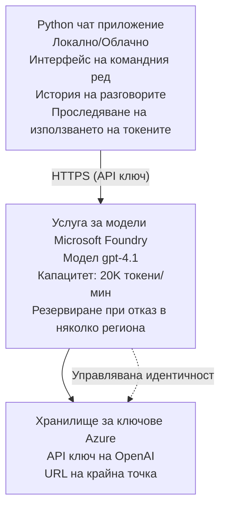

# Чат приложение на Microsoft Foundry Models

**Път за обучение:** Междинно ⭐⭐ | **Време:** 35-45 минути | **Цена:** $50-200/месец

Пълно чат приложение с Microsoft Foundry Models, разположено с помощта на Azure Developer CLI (azd). Този пример демонстрира разполагане на gpt-4.1, защитен достъп до API и прост чат интерфейс.

## 🎯 Какво ще научите

- Разположете Microsoft Foundry Models Service с модел gpt-4.1
- Защитете OpenAI API ключовете с Key Vault
- Създайте прост чат интерфейс с Python
- Наблюдавайте използването на токени и разходите
- Реализирайте ограничаване на скоростта и обработка на грешки

## 📦 Какво е включено

✅ **Microsoft Foundry Models Service** - разполагане на модел gpt-4.1  
✅ **Python Chat App** - Прост чат интерфейс в командния ред  
✅ **Key Vault Integration** - Сигурно съхранение на API ключове  
✅ **ARM Templates** - Пълна инфраструктура като код  
✅ **Cost Monitoring** - Проследяване на използването на токени  
✅ **Rate Limiting** - Предотвратяване на изчерпване на квотата  

## Архитектура



## Изисквания

### Необходими

- **Azure Developer CLI (azd)** - [Инструкции за инсталиране](https://learn.microsoft.com/azure/developer/azure-developer-cli/install-azd)
- **Azure subscription** с достъп до OpenAI - [Заявете достъп](https://aka.ms/oai/access)
- **Python 3.9+** - [Инсталирайте Python](https://www.python.org/downloads/)

### Проверете изискванията

```bash
# Проверете версията на azd (трябва да е 1.5.0 или по-нова)
azd version

# Проверете влизането в Azure
azd auth login

# Проверете версията на Python
python --version  # или python3 --version

# Проверете достъпа до OpenAI (проверете в Azure портала)
az cognitiveservices account list-skus \
  --kind OpenAI \
  --location eastus
```

> **⚠️ Важно:** Microsoft Foundry Models изисква одобрение на заявлението. Ако не сте подали заявка, посетете [aka.ms/oai/access](https://aka.ms/oai/access). Одобрението обикновено отнема 1-2 работни дни.

## ⏱️ Времева линия на разгръщане

| Phase | Duration | What Happens |
|-------|----------|--------------|
| Prerequisites check | 2-3 minutes | Verify OpenAI quota availability |
| Deploy infrastructure | 8-12 minutes | Create OpenAI, Key Vault, model deployment |
| Configure application | 2-3 minutes | Set up environment and dependencies |
| **Total** | **12-18 minutes** | Ready to chat with gpt-4.1 |

**Бележка:** Първото разполагане на OpenAI може да отнеме повече време поради подготовка на модела.

## Бърз старт

```bash
# Отидете до примера
cd examples/azure-openai-chat

# Инициализирайте средата
azd env new myopenai

# Разположете всичко (инфраструктура + конфигурация)
azd up
# Ще бъдете подканени да:
# 1. Изберете абонамент в Azure
# 2. Изберете местоположение с наличност на OpenAI (например eastus, eastus2, westus)
# 3. Изчакайте 12-18 минути за разполагането

# Инсталирайте зависимостите на Python
pip install -r requirements.txt

# Започнете да чатите!
python chat.py
```

**Очакван изход:**
```
🤖 Microsoft Foundry Models Chat Application
Connected to: gpt-4.1 (eastus)
Type your message (or 'quit' to exit)

You: Hello! Tell me about Microsoft Foundry Models.
Assistant: Microsoft Foundry Models Service provides REST API access to OpenAI's powerful language models including gpt-4.1, GPT-3.5-Turbo, and Embeddings...

[Tokens used: 145 | Estimated cost: $0.0044]
```

## ✅ Проверка на разгръщането

### Стъпка 1: Проверете ресурсите в Azure

```bash
# Преглед на внедрените ресурси
azd show

# Очакваният изход показва:
# - OpenAI услуга: (име на ресурса)
# - Хранилище за ключове: (име на ресурса)
# - Разгръщане: gpt-4.1
# - Местоположение: eastus (или избраният от вас регион)
```

### Стъпка 2: Тествайте OpenAI API

```bash
# Вземете крайна точка и ключ за OpenAI
OPENAI_ENDPOINT=$(azd env get-value AZURE_OPENAI_ENDPOINT)
OPENAI_KEY=$(azd env get-value AZURE_OPENAI_API_KEY)

# Тествайте извикване на API
curl "$OPENAI_ENDPOINT/openai/deployments/gpt-4.1/chat/completions?api-version=2024-08-01-preview" \
  -H "Content-Type: application/json" \
  -H "api-key: $OPENAI_KEY" \
  -d '{
    "messages": [{"role": "user", "content": "Say hello!"}],
    "max_tokens": 50
  }'
```

**Очакван отговор:**
```json
{
  "choices": [
    {
      "message": {
        "role": "assistant",
        "content": "Hello! How can I assist you today?"
      }
    }
  ],
  "usage": {
    "prompt_tokens": 8,
    "completion_tokens": 9,
    "total_tokens": 17
  }
}
```

### Стъпка 3: Проверете достъпа до Key Vault

```bash
# Изброяване на тайни в Key Vault
KV_NAME=$(azd env get-value AZURE_KEY_VAULT_NAME)

az keyvault secret list \
  --vault-name $KV_NAME \
  --query "[].name" \
  --output table
```

**Очаквани тайни:**
- `openai-api-key`
- `openai-endpoint`

**Критерии за успех:**
- ✅ Услугата OpenAI е разположена с gpt-4.1
- ✅ Извикване на API връща валиден отговор
- ✅ Тайните са съхранени в Key Vault
- ✅ Проследяването на използването на токени работи

## Структура на проекта

```
azure-openai-chat/
├── README.md                   ✅ This guide
├── azure.yaml                  ✅ AZD configuration
├── infra/                      ✅ Infrastructure as Code
│   ├── main.bicep             ✅ Main Bicep template
│   ├── main.parameters.json   ✅ Parameters
│   └── openai.bicep           ✅ OpenAI resource definition
├── src/                        ✅ Application code
│   ├── chat.py                ✅ Chat interface
│   ├── config.py              ✅ Configuration loader
│   └── requirements.txt       ✅ Python dependencies
└── .gitignore                  ✅ Git ignore rules
```

## Функции на приложението

### Чат интерфейс (`chat.py`)

Чат приложението включва:

- **История на разговора** - Поддържа контекст между съобщенията
- **Броене на токени** - Следи използването и оценява разходите
- **Обработка на грешки** - Гладко справяне с ограниченията и грешките от API
- **Оценка на разходите** - Изчисление на разходите в реално време за съобщение
- **Поддръжка на стрийминг** - По желание стрийминг отговори

### Команди

По време на чат можете да използвате:
- `quit` or `exit` - Прекратете сесията
- `clear` - Изчистете историята на разговора
- `tokens` - Покажи общото използване на токени
- `cost` - Покажи приблизителната обща цена

### Конфигурация (`config.py`)

Зарежда конфигурацията от променливи на средата:
```python
AZURE_OPENAI_ENDPOINT  # От Key Vault
AZURE_OPENAI_API_KEY   # От Key Vault
AZURE_OPENAI_MODEL     # По подразбиране: gpt-4.1
AZURE_OPENAI_MAX_TOKENS # По подразбиране: 800
```

## Примери за използване

### Основен чат

```bash
python chat.py
```

### Чат с персонализиран модел

```bash
export AZURE_OPENAI_MODEL=gpt-35-turbo
python chat.py
```

### Чат със стрийминг

```bash
python chat.py --stream
```

### Примерен разговор

```
You: Explain Microsoft Foundry Models Service in 3 sentences.
Assistant: Microsoft Foundry Models Service is Microsoft Azure's cloud platform offering 
that provides access to OpenAI's powerful language models. It enables developers 
to integrate capabilities like gpt-4.1 into their applications with enterprise-grade 
security and compliance. The service includes features for content filtering, 
abuse monitoring, and responsible AI practices.

[Tokens used: 89 | Estimated cost: $0.0027]

You: What models are available?
Assistant: Microsoft Foundry Models Service offers several model families including gpt-4.1 
(most capable), GPT-3.5-Turbo (faster and cost-effective), and Embeddings models 
for vector search. Each model has different capabilities, pricing, and token limits.

[Tokens used: 67 | Estimated cost: $0.0020]

Total session: 156 tokens | $0.0047
```

## Управление на разходите

### Ценообразуване на токените (gpt-4.1)

| Model | Input (per 1K tokens) | Output (per 1K tokens) |
|-------|----------------------|------------------------|
| gpt-4.1 | $0.03 | $0.06 |
| GPT-3.5-Turbo | $0.0015 | $0.002 |

### Прогнозирани месечни разходи

Въз основа на модели на използване:

| Usage Level | Messages/Day | Tokens/Day | Monthly Cost |
|-------------|--------------|------------|--------------|
| **Леко** | 20 messages | 3,000 tokens | $3-5 |
| **Умерено** | 100 messages | 15,000 tokens | $15-25 |
| **Интензивно** | 500 messages | 75,000 tokens | $75-125 |

**Базова инфраструктурна цена:** $1-2/месец (Key Vault + минимален изчислителен ресурс)

### Съвети за оптимизация на разходите

```bash
# 1. Използвайте GPT-3.5-Turbo за по-прости задачи (20 пъти по-евтино)
export AZURE_OPENAI_MODEL=gpt-35-turbo

# 2. Намалете максималния брой токени за по-кратки отговори
export AZURE_OPENAI_MAX_TOKENS=400

# 3. Следете използването на токени
python chat.py --show-tokens

# 4. Настройте бюджетни предупреждения
az consumption budget create \
  --budget-name "openai-budget" \
  --amount 50 \
  --time-grain Monthly
```

## Наблюдение

### Преглед на използването на токени

```bash
# В портала на Azure:
# OpenAI ресурс → Метрики → Изберете "Token Transaction"

# Или чрез Azure CLI:
az monitor metrics list \
  --resource $(azd env get-value AZURE_OPENAI_RESOURCE_ID) \
  --metric "TokenTransaction" \
  --start-time $(date -u -d '1 hour ago' '+%Y-%m-%dT%H:%M:%S') \
  --interval PT1M
```

### Преглед на логовете на API

```bash
# Поток от диагностични журнали
az monitor diagnostic-settings create \
  --resource $(azd env get-value AZURE_OPENAI_RESOURCE_ID) \
  --name openai-logs \
  --logs '[{"category": "Audit", "enabled": true}]' \
  --workspace $(azd env get-value LOG_ANALYTICS_WORKSPACE_ID)

# Журнали на заявки
az monitor log-analytics query \
  --workspace $(azd env get-value LOG_ANALYTICS_WORKSPACE_ID) \
  --analytics-query "AzureDiagnostics | where Category == 'Audit' | top 10 by TimeGenerated"
```

## Отстраняване на проблеми

### Проблем: "Access Denied" Error

**Симптоми:** 403 Forbidden при извикване на API

**Решения:**
```bash
# 1. Проверете дали достъпът до OpenAI е одобрен
az cognitiveservices account show \
  --name $(azd env get-value AZURE_OPENAI_NAME) \
  --resource-group $(azd env get-value AZURE_RESOURCE_GROUP)

# 2. Проверете дали API ключът е правилен
azd env get-value AZURE_OPENAI_API_KEY

# 3. Проверете формата на URL адреса на крайната точка
azd env get-value AZURE_OPENAI_ENDPOINT
# Трябва да бъде: https://[name].openai.azure.com/
```

### Проблем: "Rate Limit Exceeded"

**Симптоми:** 429 Too Many Requests

**Решения:**
```bash
# 1. Проверете текущата квота
az cognitiveservices account deployment show \
  --name $(azd env get-value AZURE_OPENAI_NAME) \
  --resource-group $(azd env get-value AZURE_RESOURCE_GROUP) \
  --deployment-name gpt-4.1

# 2. Заявете увеличение на квотата (ако е необходимо)
# Отидете в Azure портала → Ресурс OpenAI → Квоти → Заявка за увеличение

# 3. Реализирайте логика за повторни опити (вече в chat.py)
# Приложението автоматично повтаря опитите с експоненциално изчакване
```

### Проблем: "Model Not Found"

**Симптоми:** 404 грешка при разполагане

**Решения:**
```bash
# 1. Изброяване на наличните разгръщания
az cognitiveservices account deployment list \
  --name $(azd env get-value AZURE_OPENAI_NAME) \
  --resource-group $(azd env get-value AZURE_RESOURCE_GROUP)

# 2. Проверете името на модела в средата
echo $AZURE_OPENAI_MODEL

# 3. Актуализирайте до правилното име на разгръщането
export AZURE_OPENAI_MODEL=gpt-4.1  # или gpt-35-turbo
```

### Проблем: Висока латентност

**Симптоми:** Бавно време за отговор (>5 секунди)

**Решения:**
```bash
# 1. Проверете регионалната латентност
# Разположете в региона, най-близък до потребителите

# 2. Намалете max_tokens за по-бързи отговори
export AZURE_OPENAI_MAX_TOKENS=400

# 3. Използвайте стрийминг за по-добро потребителско изживяване
python chat.py --stream
```

## Най-добри практики за сигурност

### 1. Защитете API ключовете

```bash
# Никога не добавяйте ключове в системата за контрол на версиите
# Използвайте Key Vault (вече е конфигуриран)

# Редовно сменяйте ключовете
az cognitiveservices account keys regenerate \
  --name $(azd env get-value AZURE_OPENAI_NAME) \
  --resource-group $(azd env get-value AZURE_RESOURCE_GROUP) \
  --key-name key1
```

### 2. Внедрете филтриране на съдържанието

```python
# Microsoft Foundry Models включва вградено филтриране на съдържание
# Конфигурирайте в портала на Azure:
# Ресурс на OpenAI → Филтри за съдържание → Създаване на персонализиран филтър

# Категории: Омраза, Сексуално съдържание, Насилие, Самонараняване
# Нива на филтриране: Ниско, Средно, Високо
```

### 3. Използвайте управлявана идентичност (в продукция)

```bash
# За продукционни разгръщания използвайте управлявана идентичност
# вместо API ключове (изисква хостване на приложението в Azure)

# Актуализирайте infra/openai.bicep, за да включва:
# identity: { type: 'SystemAssigned' }
```

## Разработка

### Стартирайте локално

```bash
# Инсталирайте зависимостите
pip install -r src/requirements.txt

# Задайте променливите на средата
export AZURE_OPENAI_ENDPOINT="https://[name].openai.azure.com/"
export AZURE_OPENAI_API_KEY="your-api-key"
export AZURE_OPENAI_MODEL="gpt-4.1"

# Стартирайте приложението
python src/chat.py
```

### Стартирайте тестове

```bash
# Инсталиране на тестови зависимости
pip install pytest pytest-cov

# Изпълнение на тестове
pytest tests/ -v

# С покритие на кода
pytest tests/ --cov=src --cov-report=html
```

### Актуализирайте разполагането на модела

```bash
# Разгръщане на различна версия на модела
az cognitiveservices account deployment create \
  --name $(azd env get-value AZURE_OPENAI_NAME) \
  --resource-group $(azd env get-value AZURE_RESOURCE_GROUP) \
  --deployment-name gpt-35-turbo \
  --model-name gpt-35-turbo \
  --model-version "0613" \
  --model-format OpenAI \
  --sku-capacity 20 \
  --sku-name "Standard"
```

## Изчистване

```bash
# Изтрийте всички ресурси в Azure
azd down --force --purge

# Това премахва:
# - OpenAI услуга
# - Key Vault (с 90-дневно меко изтриване)
# - Група ресурси
# - Всички разгръщания и конфигурации
```

## Следващи стъпки

### Разширете този пример

1. **Добавете уеб интерфейс** - Създайте frontend с React/Vue
   ```bash
   # Добавете фронтенд услуга към azure.yaml
   # Разположете в Azure Static Web Apps
   ```

2. **Реализирайте RAG** - Добавете търсене в документи с Azure AI Search
   ```python
   # Интегриране на Azure AI Search
   # Качване на документи и създаване на векторен индекс
   ```

3. **Добавете извикване на функции** - Активирайте използване на инструменти
   ```python
   # Дефинирайте функции в chat.py
   # Позволете на gpt-4.1 да извиква външни API
   ```

4. **Поддръжка на няколко модела** - Разположете няколко модела
   ```bash
   # Добавете gpt-35-turbo и модели за вграждания
   # Реализирайте логиката за маршрутизиране на моделите
   ```

### Свързани примери

- **[Retail Multi-Agent](../retail-scenario.md)** - Разширена архитектура с множество агенти
- **[Database App](../../../../examples/database-app)** - Добавете трайно съхранение
- **[Container Apps](../../../../examples/container-app)** - Разположете като контейнеризирана услуга

### Ресурси за учене

- 📚 [AZD For Beginners Course](../../README.md) - Основна начална страница на курса
- 📚 [Microsoft Foundry Models Documentation](https://learn.microsoft.com/azure/ai-services/openai/) - Официална документация
- 📚 [OpenAI API Reference](https://platform.openai.com/docs/api-reference) - Подробности за API
- 📚 [Responsible AI](https://www.microsoft.com/ai/responsible-ai) - Най-добри практики

## Допълнителни ресурси

### Документация
- **[Microsoft Foundry Models Service](https://learn.microsoft.com/azure/ai-services/openai/)** - Пълен наръчник
- **[gpt-4.1 Models](https://learn.microsoft.com/azure/ai-services/openai/concepts/models)** - Възможности на модела
- **[Content Filtering](https://learn.microsoft.com/azure/ai-services/openai/concepts/content-filter)** - Функции за безопасност
- **[Azure Developer CLI](https://learn.microsoft.com/azure/developer/azure-developer-cli/)** - Справочник за azd

### Уроци
- **[OpenAI Quickstart](https://learn.microsoft.com/azure/ai-services/openai/quickstart)** - Първо разполагане
- **[Chat Completions](https://learn.microsoft.com/azure/ai-services/openai/how-to/chatgpt)** - Създаване на чат приложения
- **[Function Calling](https://learn.microsoft.com/azure/ai-services/openai/how-to/function-calling)** - Разширени функции

### Инструменти
- **[Microsoft Foundry Models Studio](https://oai.azure.com/)** - Уеб-базиран плейграунд
- **[Prompt Engineering Guide](https://platform.openai.com/docs/guides/prompt-engineering)** - Как да създавате по-добри подканвания
- **[Token Calculator](https://platform.openai.com/tokenizer)** - Оценка на използването на токени

### Общност
- **[Azure AI Discord](https://discord.gg/azure)** - Получете помощ от общността
- **[GitHub Discussions](https://github.com/Azure-Samples/openai/discussions)** - Форум за въпроси и отговори
- **[Azure Blog](https://azure.microsoft.com/blog/tag/azure-openai-service/)** - Последни новини

---

**🎉 Успех!** Вече разположихте Microsoft Foundry Models и създадохте работещо чат приложение. Започнете да изследвате възможностите на gpt-4.1 и експериментирайте с различни подканвания и сценарии на използване.

**Въпроси?** [Отворете issue](https://github.com/microsoft/AZD-for-beginners/issues) или проверете [FAQ](../../resources/faq.md)

**Предупреждение за разходи:** Не забравяйте да изпълните `azd down`, когато приключите с тестовете, за да избегнете текущи такси (~$50-100/месец при активно използване).

---

<!-- CO-OP TRANSLATOR DISCLAIMER START -->
**Отказ от отговорност**:
Този документ е преведен с помощта на AI преводачески услуга [Co-op Translator](https://github.com/Azure/co-op-translator). Въпреки че се стремим към точност, моля имайте предвид, че автоматизираните преводи могат да съдържат грешки или неточности. Оригиналният документ на неговия роден език трябва да се счита за авторитетен източник. За критична информация се препоръчва професионален човешки превод. Ние не носим отговорност за каквито и да е недоразумения или неправилни тълкувания, произтичащи от използването на този превод.
<!-- CO-OP TRANSLATOR DISCLAIMER END -->