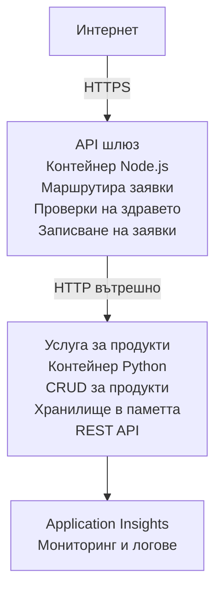

# Архитектура на микросервизи - Пример с Container App

⏱️ **Прогнозно време**: 25-35 минути | 💰 **Прогнозна цена**: ~$50-100/month | ⭐ **Сложност**: Напреднало

Това е **опростена, но функционална** архитектура на микросервизи, разгърната в Azure Container Apps с помощта на AZD CLI. Този пример демонстрира комуникация между услуги, оркестрация на контейнери и наблюдение с практична конфигурация от 2 услуги.

> **📚 Подход за учене**: Този пример започва с минимална архитектура от 2 услуги (API Gateway + Backend Service), която можете реално да разгърнете и изучите. След като усвоите тази основа, даваме насоки за разширяване до пълна екосистема от микросервизи.

## Какво ще научите

Като завършите този пример, ще:
- Разгърнете множество контейнери в Azure Container Apps
- Реализирате комуникация между услуги чрез вътрешна мрежа
- Конфигурирате скалиране и проверки на здравето на база среда
- Наблюдавате разпределени приложения с Application Insights
- Разберете модели за разгръщане на микросервизи и добри практики
- Научите как постепенно да разширявате от проста към комплексна архитектура

## Архитектура

### Фаза 1: Какво изграждаме (включено в този пример)


**Защо да започнем просто?**
- ✅ Разгръщане и разбиране бързо (25-35 минути)
- ✅ Научете основните модели на микросервизи без сложност
- ✅ Работещ код, който можете да променяте и експериментирате с
- ✅ По-ниска цена за обучение (~$50-100/месец спрямо $300-1400/месец)
- ✅ Изградете увереност преди да добавяте бази данни и опашки за съобщения

**Аналогия**: Помислете за това като да учите да шофирате. Започвате с празен паркинг (2 услуги), овладявате основите, след което преминавате към градски трафик (5+ услуги с бази данни).

### Фаза 2: Бъдещо разширяване (референтна архитектура)

След като усвоите архитектурата с 2 услуги, можете да я разширите до:

```
Full Architecture (Not Included - For Reference)
├── API Gateway (✅ Included)
├── Product Service (✅ Included)
├── Order Service (🔜 Add next)
├── User Service (🔜 Add next)
├── Notification Service (🔜 Add last)
├── Azure Service Bus (🔜 For async communication)
├── Cosmos DB (🔜 For product persistence)
├── Azure SQL (🔜 For order management)
└── Azure Storage (🔜 For file storage)
```

Вижте раздела "Ръководство за разширяване" в края за стъпка-по-стъпка инструкции.

## Включени функции

✅ **Откриване на услуги**: Автоматично откриване базирано на DNS между контейнерите  
✅ **Баланс на натоварването**: Вграден баланс на натоварване между репликите  
✅ **Автоскалиране**: Независимо скалиране за всяка услуга на база HTTP заявки  
✅ **Мониторинг на здравето**: Liveness и readiness проверки за двете услуги  
✅ **Разпределено логване**: Централизирано логване с Application Insights  
✅ **Вътрешна мрежа**: Сигурна комуникация между услуги  
✅ **Оркестрация на контейнери**: Автоматично разгръщане и скалиране  
✅ **Актуализации без прекъсване**: Rolling updates с управление на ревизиите  

## Предварителни изисквания

### Задължителни инструменти

Преди да започнете, уверете се, че имате инсталирани следните инструменти:

1. **[Azure Developer CLI (azd)](https://learn.microsoft.com/azure/developer/azure-developer-cli/install-azd)** (версия 1.0.0 или по-нова)
   ```bash
   azd version
   # Очакван изход: azd версия 1.0.0 или по-нова
   ```

2. **[Azure CLI](https://learn.microsoft.com/cli/azure/install-azure-cli)** (версия 2.50.0 или по-нова)
   ```bash
   az --version
   # Очакван изход: azure-cli 2.50.0 или по-нова
   ```

3. **[Docker](https://www.docker.com/get-started)** (за локално разработване/тестване - по избор)
   ```bash
   docker --version
   # Очакван изход: Docker версия 20.10 или по-нова
   ```

### Изисквания за Azure

- Активен **абонамент за Azure** ([създайте безплатен акаунт](https://azure.microsoft.com/free/))
- Права за създаване на ресурси в абонамента ви
- Роля **Contributor** върху абонамента или групата за ресурси

### Предварителни познания

Това е пример за **напреднало ниво**. Трябва да имате:
- Завършен [Simple Flask API example](../../../../../examples/container-app/simple-flask-api) 
- Основно разбиране на архитектурата на микросервизи
- Запознатост с REST API и HTTP
- Разбиране на концепциите за контейнери

**Ново в Container Apps?** Започнете първо с примера [Simple Flask API example](../../../../../examples/container-app/simple-flask-api), за да научите основите.

## Бърз старт (стъпка по стъпка)

### Стъпка 1: Клониране и навигиране

```bash
git clone https://github.com/microsoft/AZD-for-beginners.git
cd AZD-for-beginners/examples/container-app/microservices
```

**✓ Проверка за успех**: Уверете се, че виждате `azure.yaml`:
```bash
ls
# Очаквано: README.md, azure.yaml, infra/, src/
```

### Стъпка 2: Удостоверяване в Azure

```bash
azd auth login
```

Това отваря вашия браузър за удостоверяване в Azure. Влезте с вашите Azure идентификационни данни.

**✓ Проверка за успех**: Трябва да видите:
```
Logged in to Azure.
```

### Стъпка 3: Инициализиране на средата

```bash
azd init
```

**Подканите, които ще видите**:
- **Име на средата**: Въведете кратко име (например `microservices-dev`)
- **Azure subscription**: Изберете вашия абонамент
- **Azure location**: Изберете регион (например `eastus`, `westeurope`)

**✓ Проверка за успех**: Трябва да видите:
```
SUCCESS: New project initialized!
```

### Стъпка 4: Разгръщане на инфраструктурата и услугите

```bash
azd up
```

**Какво се случва** (отнема 8-12 минути):
1. Създава Container Apps среда
2. Създава Application Insights за наблюдение
3. Изгражда контейнера на API Gateway (Node.js)
4. Изгражда контейнера на Product Service (Python)
5. Разгръща двата контейнера в Azure
6. Конфигурира мрежата и проверки на здравето
7. Настройва наблюдение и логване

**✓ Проверка за успех**: Трябва да видите:
```
SUCCESS: Your application was deployed to Azure in X minutes Y seconds.
Endpoint: https://api-gateway-<unique-id>.azurecontainerapps.io
```

**⏱️ Време**: 8-12 минути

### Стъпка 5: Тестване на разгръщането

```bash
# Вземете крайната точка на шлюза
GATEWAY_URL=$(azd env get-values | grep API_GATEWAY_URL | cut -d '=' -f2 | tr -d '"')

# Проверете здравето на API шлюза
curl $GATEWAY_URL/health

# Очакван изход:
# {"status":"здрав","service":"api-gateway","timestamp":"2025-11-19T10:30:00Z"}
```

**Тествайте продуктовата услуга чрез API Gateway**:
```bash
# Списък с продукти
curl $GATEWAY_URL/api/products

# Очакван изход:
# [
#   {"id":1,"name":"Лаптоп","price":999.99,"stock":50},
#   {"id":2,"name":"Мишка","price":29.99,"stock":200},
#   {"id":3,"name":"Клавиатура","price":79.99,"stock":150}
# ]
```

**✓ Проверка за успех**: И двете крайни точки връщат JSON данни без грешки.

---

**🎉 Поздравления!** Разгърнахте архитектура на микросервизи в Azure!

## Структура на проекта

Всички файлове за имплементация са включени — това е завършен, работещ пример:

```
microservices/
│
├── README.md                         # This file
├── azure.yaml                        # AZD configuration
├── .gitignore                        # Git ignore patterns
│
├── infra/                           # Infrastructure as Code (Bicep)
│   ├── main.bicep                   # Main orchestration
│   ├── abbreviations.json           # Naming conventions
│   ├── core/                        # Shared infrastructure
│   │   ├── container-apps-environment.bicep  # Container environment + registry
│   │   └── monitor.bicep            # Application Insights + Log Analytics
│   └── app/                         # Service definitions
│       ├── api-gateway.bicep        # API Gateway container app
│       └── product-service.bicep    # Product Service container app
│
└── src/                             # Application source code
    ├── api-gateway/                 # Node.js API Gateway
    │   ├── app.js                   # Express server with routing
    │   ├── package.json             # Node dependencies
    │   └── Dockerfile               # Container definition
    └── product-service/             # Python Product Service
        ├── main.py                  # Flask API with product data
        ├── requirements.txt         # Python dependencies
        └── Dockerfile               # Container definition
```

**Какво прави всеки компонент:**

**Инфраструктура (infra/)**:
- `main.bicep`: Оркестрира всички Azure ресурси и техните зависимости
- `core/container-apps-environment.bicep`: Създава Container Apps средата и Azure Container Registry
- `core/monitor.bicep`: Настройва Application Insights за разпределено логване
- `app/*.bicep`: Индивидуални дефиниции на container app с настройки за скалиране и проверки на здравето

**API Gateway (src/api-gateway/)**:
- Публична услуга, която маршрутизира заявки към бекенд услуги
- Реализира логване, обработка на грешки и препращане на заявки
- Демонстрира комуникация между услуги по HTTP

**Product Service (src/product-service/)**:
- Вътрешна услуга с каталог от продукти (в паметта за простота)
- REST API с проверки на здравето
- Пример за бекенд микросервисен модел

## Преглед на услугите

### API Gateway (Node.js/Express)

**Порт**: 8080  
**Достъп**: Публичен (външен вход)  
**Цел**: Маршрутизира входящи заявки към подходящите бекенд услуги  

**Крайни точки**:
- `GET /` - Информация за услугата
- `GET /health` - Крайна точка за проверка на здравето
- `GET /api/products` - Препраща към продуктовата услуга (изброяване на всички)
- `GET /api/products/:id` - Препраща към продуктовата услуга (вземане по ID)

**Основни функции**:
- Маршрутизиране на заявки с axios
- Централизирано логване
- Обработка на грешки и управление на таймаути
- Откриване на услуги чрез променливи на средата
- Интеграция с Application Insights

**Извадка от кода** (`src/api-gateway/app.js`):
```javascript
// Вътрешна комуникация между услуги
app.get('/api/products', async (req, res) => {
  const response = await axios.get(`${PRODUCT_SERVICE_URL}/products`);
  res.json(response.data);
});
```

### Product Service (Python/Flask)

**Порт**: 8000  
**Достъп**: Само вътрешен (без външен вход)  
**Цел**: Управлява продуктов каталог с данни в паметта  

**Крайни точки**:
- `GET /` - Информация за услугата
- `GET /health` - Крайна точка за проверка на здравето
- `GET /products` - Изброява всички продукти
- `GET /products/<id>` - Връща продукт по ID

**Основни функции**:
- RESTful API с Flask
- Съхранение на продукти в паметта (опростено, без нужда от база данни)
- Наблюдение на здравето с проверки
- Структурирано логване
- Интеграция с Application Insights

**Модел на данните**:
```python
{
  "id": 1,
  "name": "Laptop",
  "description": "High-performance laptop",
  "price": 999.99,
  "stock": 50
}
```

**Защо само вътрешна?**
Продуктовата услуга не е изложена публично. Всички заявки трябва да минават през API Gateway, който предоставя:
- Сигурност: Контролиран достъп
- Гъвкавост: Можете да променяте бекенда без да засягате клиентите
- Наблюдение: Централизирано логване на заявки

## Разбиране на комуникацията между услугите

### Как услугите си комуникират

В този пример API Gateway комуникира с Product Service чрез **вътрешни HTTP повиквания**:

```javascript
// API шлюз (src/api-gateway/app.js)
const PRODUCT_SERVICE_URL = process.env.PRODUCT_SERVICE_URL;

// Извърши вътрешна HTTP заявка
const response = await axios.get(`${PRODUCT_SERVICE_URL}/products`);
```

**Ключови точки**:

1. **Откриване базирано на DNS**: Container Apps автоматично предоставя DNS за вътрешни услуги
   - Product Service FQDN: `product-service.internal.<environment>.azurecontainerapps.io`
   - Оптимизирано като: `http://product-service` (Container Apps го резолвва)

2. **Без публично изложение**: Product Service има `external: false` в Bicep
   - Достъпна само в рамките на Container Apps средата
   - Няма достъп от интернет

3. **Променливи на средата**: URL адресите на услугите се вкарват по време на разгръщане
   - Bicep предава вътрешния FQDN към gateway-а
   - Няма жорстко кодирани URL адреси в приложния код

**Аналогия**: Помислете за това като за офисни стаи. API Gateway е рецепцията (публична), а Product Service е офис стая (само вътрешна). Посетителите трябва да минат през рецепцията, за да достигнат до някоя стая.

## Опции за разгръщане

### Пълно разгръщане (препоръчително)

```bash
# Разположете инфраструктурата и двете услуги
azd up
```

Това разгръща:
1. Container Apps среда
2. Application Insights
3. Container Registry
4. Контейнер на API Gateway
5. Контейнер на Product Service

**Време**: 8-12 минути

### Разгръщане на отделна услуга

```bash
# Разгръщайте само една услуга (след първоначалното azd up)
azd deploy api-gateway

# Или разгръщайте продуктовата услуга
azd deploy product-service
```

**Сценарий на използване**: Когато сте обновили кода в една услуга и искате да разгърнете само тази услуга.

### Актуализиране на конфигурацията

```bash
# Променете параметрите за мащабиране
azd env set GATEWAY_MAX_REPLICAS 30

# Разгърнете отново с новата конфигурация
azd up
```

## Конфигурация

### Конфигурация на скалирането

И двете услуги са конфигурирани с HTTP-базирано автоскалиране в техните Bicep файлове:

**API Gateway**:
- Минимален брой реплики: 2 (винаги поне 2 за наличност)
- Максимален брой реплики: 20
- Тригер за скалиране: 50 едновременно заявки на реплика

**Product Service**:
- Минимален брой реплики: 1 (може да скалира до нула при нужда)
- Максимален брой реплики: 10
- Тригер за скалиране: 100 едновременно заявки на реплика

**Персонализиране на скалирането** (в `infra/app/*.bicep`):
```bicep
scale: {
  minReplicas: 1
  maxReplicas: 10
  rules: [
    {
      name: 'http-scale-rule'
      http: {
        metadata: {
          concurrentRequests: '100'  // Adjust this
        }
      }
    }
  ]
}
```

### Разпределение на ресурси

**API Gateway**:
- CPU: 1.0 vCPU
- Памет: 2 GiB
- Причина: Обработва целия външен трафик

**Product Service**:
- CPU: 0.5 vCPU
- Памет: 1 GiB
- Причина: Леки операции в паметта

### Проверки на здравето

И двете услуги включват проверки за liveness и readiness:

```bicep
probes: [
  {
    type: 'Liveness'
    httpGet: {
      path: '/health'
      port: 8080
    }
    initialDelaySeconds: 10
    periodSeconds: 30
  }
  {
    type: 'Readiness'
    httpGet: {
      path: '/health'
      port: 8080
    }
    initialDelaySeconds: 5
    periodSeconds: 10
  }
]
```

**Какво означава това**:
- **Liveness**: Ако проверката на здравето се провали, Container Apps рестартира контейнера
- **Readiness**: Ако не е готов, Container Apps спира маршрутизирането на трафик към тази реплика


## Мониторинг и наблюдаемост

### Преглед на логовете на услугите

```bash
# Прегледайте логовете с azd monitor
azd monitor --logs

# Или използвайте Azure CLI за конкретни контейнерни приложения:
# Потоково предаване на логове от API Gateway
az containerapp logs show --name api-gateway --resource-group $RG_NAME --follow

# Прегледайте последните логове на продуктовата услуга
az containerapp logs show --name product-service --resource-group $RG_NAME --tail 100
```

**Очакван изход**:
```
[api-gateway] API Gateway listening on port 8080
[api-gateway] Product Service URL: http://product-service
[api-gateway] GET /api/products 200 - 45ms
[product-service] Retrieved 5 products
```

### Заявки в Application Insights

Достъпете Application Insights в Azure портала, след това изпълнете следните заявки:

**Намерете бавни заявки**:
```kusto
requests
| where timestamp > ago(1h)
| where duration > 1000  // Requests taking >1 second
| summarize count() by name, cloud_RoleName
| order by count_ desc
```

**Проследете повиквания между услуги**:
```kusto
dependencies
| where timestamp > ago(1h)
| where type == "Http"
| project timestamp, name, target, duration, success
| order by timestamp desc
```

**Процент грешки по услуга**:
```kusto
exceptions
| where timestamp > ago(24h)
| summarize errorCount = count() by cloud_RoleName, type
| order by errorCount desc
```

**Обем заявки във времето**:
```kusto
requests
| where timestamp > ago(1h)
| summarize requestCount = count() by bin(timestamp, 5m), cloud_RoleName
| render timechart
```

### Достъп до таблото за мониторинг

```bash
# Получете подробности за Application Insights
azd env get-values | grep APPLICATIONINSIGHTS

# Отворете мониторинга в портала на Azure
az monitor app-insights component show \
  --app $(azd env get-values | grep APPLICATIONINSIGHTS_CONNECTION_STRING | cut -d '=' -f2) \
  --resource-group $(azd env get-values | grep AZURE_RESOURCE_GROUP | cut -d '=' -f2) \
  --query "appId" -o tsv
```

### Метрики в реално време

1. Отворете Application Insights в Azure портала
2. Кликнете "Live Metrics"
3. Вижте заявки в реално време, неуспехи и производителност
4. Тествайте като изпълните: `curl $(azd env get-values | grep API_GATEWAY_URL | cut -d '=' -f2 | tr -d '"')/api/products`

## Практически упражнения

[Забележка: Вижте пълните упражнения по-горе в секцията "Практически упражнения" за подробни стъпка-по-стъпка упражнения, включително проверка на разгръщането, модифициране на данни, тестове за авто-скалиране, обработка на грешки и добавяне на трета услуга.]

## Анализ на разходите

### Прогнозни месечни разходи (за този пример с 2 услуги)

| Ресурс | Конфигурация | Прогнозни разходи |
|----------|--------------|----------------|
| API Gateway | 2-20 реплики, 1 vCPU, 2GB RAM | $30-150 |
| Product Service | 1-10 реплики, 0.5 vCPU, 1GB RAM | $15-75 |
| Container Registry | Базово ниво | $5 |
| Application Insights | 1-2 GB/month | $5-10 |
| Log Analytics | 1 GB/month | $3 |
| **Общо** | | **$58-243/month** |

**Разбивка на разходите по използване**:
- **Слаб трафик** (тест/обучение): ~ $60/month
- **Умерен трафик** (малък прод): ~ $120/month
- **Висок трафик** (натоварени периоди): ~ $240/month

### Съвети за оптимизация на разходите

1. **Скалиране до нула за разработка**:
   ```bicep
   scale: {
     minReplicas: 0  // Save $30-40/month when not in use
     maxReplicas: 10
   }
   ```

2. **Използвайте Consumption Plan за Cosmos DB** (когато го добавите):
   - Плащате само за това, което използвате
   - Няма минимално плащане

3. **Задайте семплинг в Application Insights**:
   ```javascript
   appInsights.defaultClient.config.samplingPercentage = 50; // Вземете проба от 50% от заявките
   ```

4. **Почистване, когато не е необходимо**:
   ```bash
   azd down
   ```

### Опции за безплатен план

За обучение/тестване, обмислете:
- Използвайте безплатните кредити на Azure (първите 30 дни)
- Ограничете броя на репликите до минимум
- Изтрийте след тестове (без текущи такси)

---

## Почистване

За да избегнете текущи такси, изтрийте всички ресурси:

```bash
azd down --force --purge
```

**Подканване за потвърждение**:
```
? Total resources to delete: 6, are you sure you want to continue? (y/N)
```

Въведете `y`, за да потвърдите.

**Какво ще бъде изтрито**:
- Container Apps Environment
- И двете Container Apps (gateway и product service)
- Container Registry
- Application Insights
- Log Analytics Workspace
- Resource Group

**✓ Проверете почистването**:
```bash
az group list --query "[?starts_with(name,'rg-microservices')]" --output table
```

Трябва да върне празно.

---

## Ръководство за разширяване: От 2 до 5+ услуги

След като овладеете тази архитектура с 2 услуги, ето как да разширите:

### Фаза 1: Добавяне на постоянство на данните (следваща стъпка)

**Добавете Cosmos DB за Product Service**:

1. Create `infra/core/cosmos.bicep`:
   ```bicep
   resource cosmosAccount 'Microsoft.DocumentDB/databaseAccounts@2023-04-15' = {
     name: name
     location: location
     kind: 'GlobalDocumentDB'
     properties: {
       databaseAccountOfferType: 'Standard'
       locations: [{ locationName: location, failoverPriority: 0 }]
     }
   }
   ```

2. Актуализирайте product service да използва Cosmos DB вместо данни в паметта

3. Прогнозна допълнителна цена: ~$25/month (serverless)

### Фаза 2: Добавяне на трета услуга (Управление на поръчки)

**Създайте Order Service**:

1. Нова папка: `src/order-service/` (Python/Node.js/C#)
2. Нов Bicep: `infra/app/order-service.bicep`
3. Актуализирайте API Gateway да рутира `/api/orders`
4. Добавете Azure SQL Database за съхранение на поръчките

**Архитектурата става**:
```
API Gateway → Product Service (Cosmos DB)
           → Order Service (Azure SQL)
```

### Фаза 3: Добавяне на асинхронна комуникация (Service Bus)

**Реализирайте архитектура, базирана на събития**:

1. Добавете Azure Service Bus: `infra/core/servicebus.bicep`
2. Product Service публикува събития "ProductCreated"
3. Order Service се абонира за продуктови събития
4. Добавете Notification Service за обработка на събитията

**Шаблон**: Request/Response (HTTP) + Event-Driven (Service Bus)

### Фаза 4: Добавяне на удостоверяване на потребители

**Реализирайте User Service**:

1. Създайте `src/user-service/` (Go/Node.js)
2. Добавете Azure AD B2C или персонализирано JWT удостоверяване
3. API Gateway валидира токените
4. Услугите проверяват потребителските разрешения

### Фаза 5: Готовност за продукция

**Добавете следните компоненти**:
- Azure Front Door (глобално балансиране на натоварването)
- Azure Key Vault (управление на тайни)
- Azure Monitor Workbooks (персонализирани табла)
- CI/CD Pipeline (GitHub Actions)
- Blue-Green Deployments
- Managed Identity за всички услуги

**Пълна цена за продукционна архитектура**: ~$300-1,400/месец

---

## Научете повече

### Съответна документация
- [Документация за Azure Container Apps](https://learn.microsoft.com/azure/container-apps/)
- [Ръководство за архитектура на микросервизи](https://learn.microsoft.com/azure/architecture/guide/architecture-styles/microservices)
- [Application Insights за разпределено проследяване](https://learn.microsoft.com/azure/azure-monitor/app/distributed-tracing)
- [Документация за Azure Developer CLI](https://learn.microsoft.com/azure/developer/azure-developer-cli/)

### Следващи стъпки в този курс
- ← Предишен: [Simple Flask API](../../../../../examples/container-app/simple-flask-api) - Пример за начинаещи с едноконтейнерно приложение
- → Следващ: [AI Integration Guide](../../../../../examples/docs/ai-foundry) - Добавяне на AI възможности
- 🏠 [Начало на курса](../../README.md)

### Сравнение: Кога да използвате кое

**Single Container App** (Simple Flask API example):
- ✅ Прости приложения
- ✅ Монолитна архитектура
- ✅ Бързо за разгръщане
- ❌ Ограничена мащабируемост
- **Цена**: ~$15-50/месец

**Microservices** (This example):
- ✅ Сложни приложения
- ✅ Независимо мащабиране на всяка услуга
- ✅ Автономия на екипите (различни услуги, различни екипи)
- ❌ По-сложно за управление
- **Цена**: ~$60-250/месец

**Kubernetes (AKS)**:
- ✅ Максимален контрол и гъвкавост
- ✅ Портируемост между облаци
- ✅ Разширено мрежово управление
- ❌ Изисква експертиза по Kubernetes
- **Цена**: минимум ~$150-500/месец

**Препоръка**: Започнете с Container Apps (този пример), преминете към AKS само ако имате нужда от функции специфични за Kubernetes.

---

## Често задавани въпроси

**В: Защо само 2 услуги вместо 5+?**  
О: Поради образователна прогресия. Овладейте основите (комуникация между услуги, наблюдение, мащабиране) с прост пример преди да добавяте сложност. Шаблоните, които научавате тук, се прилагат и към архитектури с 100 услуги.

**В: Мога ли аз да добавя още услуги?**  
О: Разбира се! Следвайте ръководството за разширяване по-горе. Всяка нова услуга следва същия модел: създайте src папка, създайте Bicep файл, актуализирайте azure.yaml, деплойвайте.

**В: Подходящо ли е за продукция?**  
О: Това е стабилна основа. За продукция добавете: managed identity, Key Vault, постоянни бази данни, CI/CD pipeline, аларми за наблюдение и стратегия за архивиране.

**В: Защо да не използвам Dapr или друг service mesh?**  
О: Дръжте го опростено за обучение. След като разберете нативната мрежова архитектура на Container Apps, можете да добавите Dapr за по-напреднали сценарии.

**В: Как да дебъгна локално?**  
О: Стартирайте услугите локално с Docker:
```bash
cd src/api-gateway
docker build -t local-gateway .
docker run -p 8080:8080 -e PRODUCT_SERVICE_URL=http://localhost:8000 local-gateway
```

**В: Мога ли да използвам различни програмни езици?**  
О: Да! Този пример показва Node.js (gateway) + Python (product service). Можете да смесвате всички езици, които работят в контейнери.

**В: А ако нямам кредити за Azure?**  
О: Използвайте безплатния слой на Azure (първите 30 дни за нови акаунти) или разгръщайте за кратки тестови периоди и изтривайте незабавно.

---

> **🎓 Резюме на учебния път**: Вие научихте как да разположите архитектура с множество услуги с автоматично мащабиране, вътрешна мрежа, централизирано наблюдение и модели готови за продукция. Тази основа ви подготвя за сложни разпределени системи и корпоративни архитектури от микросервизи.

**📚 Навигация в курса:**
- ← Предишен: [Simple Flask API](../../../../../examples/container-app/simple-flask-api)
- → Следващ: [Database Integration Example](../../../../../examples/database-app)
- 🏠 [Начало на курса](../../../README.md)
- 📖 [Най-добри практики за Container Apps](../../../docs/chapter-04-infrastructure/deployment-guide.md)

---

<!-- CO-OP TRANSLATOR DISCLAIMER START -->
**Отказ от отговорност**:
Този документ е преведен с помощта на AI преводаческа услуга [Co-op Translator](https://github.com/Azure/co-op-translator). Въпреки че се стремим към точност, моля, имайте предвид, че автоматизираните преводи могат да съдържат грешки или неточности. Оригиналният документ на оригиналния език трябва да се счита за авторитетен източник. За критична информация се препоръчва професионален човешки превод. Ние не носим отговорност за каквито и да е недоразумения или погрешни тълкувания, произтичащи от използването на този превод.
<!-- CO-OP TRANSLATOR DISCLAIMER END -->