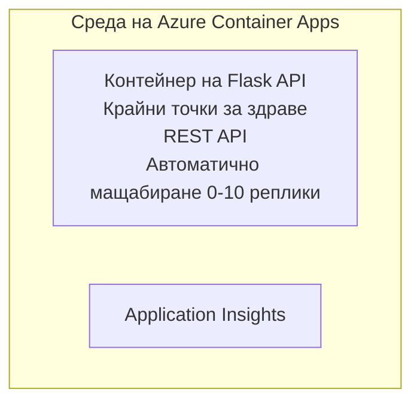

# Simple Flask API - Container App Example

**Учебен път:** За начинаещи ⭐ | **Време:** 25-35 минути | **Цена:** $0-15/месец

Пълно, работещо Python Flask REST API, внедрено в Azure Container Apps с помощта на Azure Developer CLI (azd). Този пример демонстрира внедряване на контейнер, основи на автоматично мащабиране и наблюдение.

## 🎯 Какво ще научите

- Внедряване на контейнеризирано Python приложение в Azure
- Конфигуриране на автоматично мащабиране със скалиране до нула
- Имплементиране на health probes и readiness проверки
- Наблюдение на логове и метрики на приложението
- Използване на Azure Developer CLI за бързо внедряване

## 📦 Какво е включено

✅ **Flask Application** - Пълен REST API с CRUD операции (`src/app.py`)  
✅ **Dockerfile** - Конфигурация на контейнера, готова за продукция  
✅ **Bicep Infrastructure** - Околна среда за Container Apps и внедряване на API  
✅ **AZD Configuration** - Настройка за внедряване с една команда  
✅ **Health Probes** - Конфигурирани liveness и readiness проверки  
✅ **Auto-scaling** - 0-10 реплики според HTTP натоварване  

## Architecture


## Prerequisites

### Required
- **Azure Developer CLI (azd)** - [Инсталационни инструкции](https://learn.microsoft.com/azure/developer/azure-developer-cli/install-azd)
- **Azure subscription** - [Безплатен акаунт](https://azure.microsoft.com/free/)
- **Docker Desktop** - [Инсталирайте Docker](https://www.docker.com/products/docker-desktop/) (за локални тестове)

### Verify Prerequisites

```bash
# Проверете версията на azd (необходима е 1.5.0 или по-нова)
azd version

# Проверете влизането в Azure
azd auth login

# Проверете Docker (незадължително, за локално тестване)
docker --version
```

## ⏱️ Deployment Timeline

| Phase | Duration | What Happens |
|-------|----------|--------------||
| Environment setup | 30 seconds | Създаване на azd среда |
| Build container | 2-3 minutes | Docker билд на Flask приложението |
| Provision infrastructure | 3-5 minutes | Създаване на Container Apps, registry, мониторинг |
| Deploy application | 2-3 minutes | Push на образа и внедряване в Container Apps |
| **Total** | **8-12 minutes** | Готово внедряване |

## Quick Start

```bash
# Отидете до примера
cd examples/container-app/simple-flask-api

# Инициализирайте средата (изберете уникално име)
azd env new myflaskapi

# Разположете всичко (инфраструктура + приложение)
azd up
# Ще бъдете подканени да:
# 1. Изберете Azure абонамент
# 2. Изберете местоположение (напр., eastus2)
# 3. Изчакайте 8-12 минути за разгръщането

# Вземете URL на вашия API
azd env get-values

# Тествайте API-то
curl $(azd env get-value API_ENDPOINT)/health
```

**Очакван изход:**
```json
{
  "status": "healthy",
  "timestamp": "2025-11-19T10:30:00Z",
  "service": "simple-flask-api",
  "version": "1.0.0"
}
```

## ✅ Verify Deployment

### Step 1: Check Deployment Status

```bash
# Преглед на разположените услуги
azd show

# Очакваният изход показва:
# - Услуга: api
# - Крайна точка: https://ca-api-[env].xxx.azurecontainerapps.io
# - Състояние: Работи
```

### Step 2: Test API Endpoints

```bash
# Получаване на крайна точка на API
API_URL=$(azd env get-value API_ENDPOINT)

# Проверка на състоянието
curl $API_URL/health

# Проверка на коренната крайна точка
curl $API_URL/

# Създаване на елемент
curl -X POST $API_URL/api/items \
  -H "Content-Type: application/json" \
  -d '{"name": "Test Item", "description": "My first item"}'

# Получаване на всички елементи
curl $API_URL/api/items
```

**Критерии за успех:**
- ✅ Health endpoint връща HTTP 200
- ✅ Root endpoint показва информация за API-то
- ✅ POST създава елемент и връща HTTP 201
- ✅ GET връща създадените елементи

### Step 3: View Logs

```bash
# Предавайте логове в реално време с azd monitor
azd monitor --logs

# Или използвайте Azure CLI:
az containerapp logs show --name api --resource-group $RG_NAME --follow

# Трябва да видите:
# - Съобщения за стартиране на Gunicorn
# - Логове на HTTP заявки
# - Информационни логове на приложението
```

## Project Structure

```
simple-flask-api/
├── azure.yaml              # AZD configuration
├── infra/
│   ├── main.bicep         # Main infrastructure
│   ├── main.parameters.json
│   └── app/
│       ├── container-env.bicep
│       └── api.bicep
└── src/
    ├── app.py             # Flask application
    ├── requirements.txt
    └── Dockerfile
```

## API Endpoints

| Endpoint | Method | Description |
|----------|--------|-------------|
| `/health` | GET | Проверка на състоянието |
| `/api/items` | GET | Изброяване на всички елементи |
| `/api/items` | POST | Създаване на нов елемент |
| `/api/items/{id}` | GET | Вземане на конкретен елемент |
| `/api/items/{id}` | PUT | Актуализиране на елемент |
| `/api/items/{id}` | DELETE | Изтриване на елемент |

## Configuration

### Environment Variables

```bash
# Задайте персонална конфигурация
azd env set PORT 8000
azd env set LOG_LEVEL info
azd env set MAX_REPLICAS 20
```

### Scaling Configuration

API-то автоматично се мащабира според HTTP трафика:
- **Min Replicas**: 0 (скалира до нула, когато е бездействие)
- **Max Replicas**: 10
- **Concurrent Requests per Replica**: 50

## Development

### Run Locally

```bash
# Инсталирайте зависимости
cd src
pip install -r requirements.txt

# Стартирайте приложението
python app.py

# Тествайте локално
curl http://localhost:8000/health
```

### Build and Test Container

```bash
# Изграждане на Docker образ
docker build -t flask-api:local ./src

# Стартиране на контейнер локално
docker run -p 8000:8000 flask-api:local

# Тестване на контейнер
curl http://localhost:8000/health
```

## Deployment

### Full Deployment

```bash
# Разгръщане на инфраструктурата и приложението
azd up
```

### Code-Only Deployment

```bash
# Разгръщайте само кода на приложението (инфраструктурата остава непроменена)
azd deploy api
```

### Update Configuration

```bash
# Обновете променливите на средата
azd env set API_KEY "new-api-key"

# Разположете отново с новата конфигурация
azd deploy api
```

## Monitoring

### View Logs

```bash
# Преглеждайте в реално време логовете с azd monitor
azd monitor --logs

# Или използвайте Azure CLI за Container Apps:
az containerapp logs show --name api --resource-group $RG_NAME --follow

# Прегледайте последните 100 реда
az containerapp logs show --name api --resource-group $RG_NAME --tail 100
```

### Monitor Metrics

```bash
# Отворете таблото за управление на Azure Monitor
azd monitor --overview

# Прегледайте конкретни показатели
az monitor metrics list \
  --resource $(azd show --output json | jq -r '.services.api.resourceId') \
  --metric "Requests,ResponseTime"
```

## Testing

### Health Check

```bash
curl $(azd show --output json | jq -r '.services.api.endpoint')/health
```

Очакван отговор:
```json
{
  "status": "healthy",
  "timestamp": "2025-11-19T10:30:00Z"
}
```

### Create Item

```bash
curl -X POST $(azd show --output json | jq -r '.services.api.endpoint')/api/items \
  -H "Content-Type: application/json" \
  -d '{"name": "Test Item", "description": "A test item"}'
```

### Get All Items

```bash
curl $(azd show --output json | jq -r '.services.api.endpoint')/api/items
```

## Cost Optimization

Това внедряване използва скалиране до нула, така че плащате само когато API-то обработва заявки:

- **Разходи при бездействие**: ~ $0/месец (скалира до нула)
- **Активни разходи**: ~ $0.000024/секунда на реплика
- **Очаквани месечни разходи** (лека употреба): $5-15

### Допълнително намаляване на разходите

```bash
# Намалете максималния брой реплики за среда за разработка
azd env set MAX_REPLICAS 3

# Използвайте по-кратко време за изчакване при неактивност
azd env set SCALE_TO_ZERO_TIMEOUT 300  # 5 минути
```

## Troubleshooting

### Container Won't Start

```bash
# Проверете логовете на контейнера с помощта на Azure CLI
az containerapp logs show --name api --resource-group $RG_NAME --tail 100

# Проверете дали Docker изображението се изгражда локално
docker build -t test ./src
```

### API Not Accessible

```bash
# Проверете дали ingress е външен
az containerapp show --name api --resource-group rg-simple-flask-api \
  --query properties.configuration.ingress.external
```

### High Response Times

```bash
# Проверете използването на процесора и паметта
az monitor metrics list \
  --resource $(azd show --output json | jq -r '.services.api.resourceId') \
  --metric "CPUPercentage,MemoryPercentage"

# Увеличете ресурсите, ако е необходимо
az containerapp update --name api --resource-group rg-simple-flask-api \
  --cpu 1.0 --memory 2Gi
```

## Clean Up

```bash
# Изтрийте всички ресурси
azd down --force --purge
```

## Next Steps

### Expand This Example

1. **Добавете база данни** - Интеграция с Azure Cosmos DB или SQL Database
   ```bash
   # Добавете модула Cosmos DB в infra/main.bicep
   # Актуализирайте app.py с връзка към базата данни
   ```

2. **Добавете автентикация** - Имплементирайте Azure AD или API ключове
   ```python
   # Добавете междинен софтуер за удостоверяване в app.py
   from functools import wraps
   ```

3. **Настройте CI/CD** - GitHub Actions workflow
   ```yaml
   # Create .github/workflows/deploy.yml
   name: Deploy to Azure
   on: [push]
   ```

4. **Добавете управлявана идентичност** - Защитен достъп до Azure услуги
   ```bicep
   # Update infra/app/api.bicep
   identity: { type: 'SystemAssigned' }
   ```

### Related Examples

- **[Database App](../../../../../examples/database-app)** - Пълен пример с SQL Database
- **[Microservices](../../../../../examples/container-app/microservices)** - Архитектура с няколко услуги
- **[Container Apps Master Guide](../README.md)** - Всички шаблони за контейнерни приложения

### Learning Resources

- 📚 [AZD For Beginners Course](../../../README.md) - Главна страница на курса
- 📚 [Container Apps Patterns](../README.md) - Повече шаблони за внедряване
- 📚 [AZD Templates Gallery](https://azure.github.io/awesome-azd/) - Общностни шаблони

## Additional Resources

### Documentation
- **[Flask Documentation](https://flask.palletsprojects.com/)** - Ръководство за Flask фреймуърка
- **[Azure Container Apps](https://learn.microsoft.com/azure/container-apps/)** - Официална документация на Azure
- **[Azure Developer CLI](https://learn.microsoft.com/azure/developer/azure-developer-cli/)** - Референция за azd команди

### Tutorials
- **[Container Apps Quickstart](https://learn.microsoft.com/azure/container-apps/quickstart-portal)** - Внедрете първото си приложение
- **[Python on Azure](https://learn.microsoft.com/azure/developer/python/)** - Ръководство за разработка на Python в Azure
- **[Bicep Language](https://learn.microsoft.com/azure/azure-resource-manager/bicep/)** - Infrastructure as code

### Tools
- **[Azure Portal](https://portal.azure.com)** - Управление на ресурсите визуално
- **[VS Code Azure Extension](https://marketplace.visualstudio.com/items?itemName=ms-azuretools.vscode-azurecontainerapps)** - Интеграция в IDE

---

**🎉 Поздравления!** Вие внедрихте продукционно готов Flask API в Azure Container Apps с автоматично мащабиране и наблюдение.

**Въпроси?** [Отворете issue](https://github.com/microsoft/AZD-for-beginners/issues) или разгледайте [FAQ](../../../resources/faq.md)

---

<!-- CO-OP TRANSLATOR DISCLAIMER START -->
**Отказ от отговорност**:
Този документ е преведен с помощта на AI преводаческа услуга [Co-op Translator](https://github.com/Azure/co-op-translator). Въпреки че се стремим към точност, имайте предвид, че автоматизираните преводи могат да съдържат грешки или неточности. Оригиналният документ на оригиналния език трябва да се смята за авторитетен източник. За критична информация се препоръчва професионален човешки превод. Ние не носим отговорност за каквито и да е недоразумения или погрешни тълкувания, възникнали от използването на този превод.
<!-- CO-OP TRANSLATOR DISCLAIMER END -->