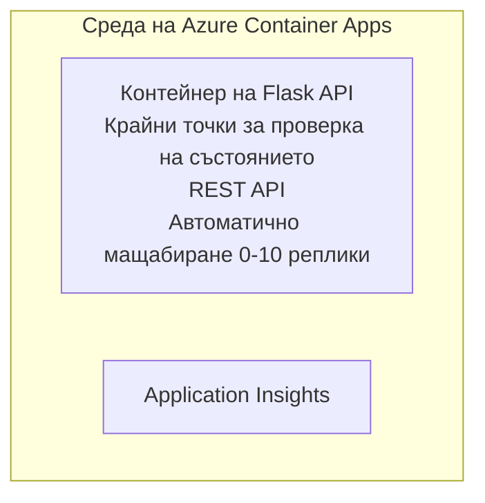

# Прост Flask API - Пример за Container App

**Път на обучение:** За начинаещи ⭐ | **Време:** 25-35 минути | **Цена:** $0-15/месец

Пълен, работещ Python Flask REST API, внедрен в Azure Container Apps с помощта на Azure Developer CLI (azd). Този пример демонстрира внедряване на контейнер, автоматично мащабиране и основи на мониторинга.

## 🎯 Какво ще научите

- Внедряване на контейнирано Python приложение в Azure
- Конфигуриране на автоматично мащабиране с мащабиране до нула
- Имплементиране на здравни проверки и readiness проверки
- Мониторинг на логове и метрики на приложението
- Използване на Azure Developer CLI за бързо внедряване

## 📦 Какво е включено

✅ **Flask приложение** - Пълен REST API с CRUD операции (`src/app.py`)  
✅ **Dockerfile** - Конфигурация на контейнера, готова за продукция  
✅ **Bicep инфраструктура** - Околна среда за Container Apps и внедряване на API  
✅ **AZD конфигурация** - Настройка за внедряване с една команда  
✅ **Проби за здраве** - Конфигурирани проверки за жизнеспособност и готовност  
✅ **Автоматично мащабиране** - 0-10 реплики в зависимост от HTTP натоварването  

## Архитектура



## Предварителни изисквания

### Задължително
- **Azure Developer CLI (azd)** - [Инсталационно ръководство](https://learn.microsoft.com/azure/developer/azure-developer-cli/install-azd)
- **Azure абонамент** - [Безплатен акаунт](https://azure.microsoft.com/free/)
- **Docker Desktop** - [Инсталирайте Docker](https://www.docker.com/products/docker-desktop/) (за локално тестване)

### Проверка на предварителните изисквания

```bash
# Проверете версията на azd (необходима е 1.5.0 или по-нова)
azd version

# Проверете влизането в Azure
azd auth login

# Проверете Docker (по избор, за локално тестване)
docker --version
```

## ⏱️ Времева рамка за внедряване

| Фаза | Продължителност | Какво се случва |
|-------|----------|--------------||
| Настройване на средата | 30 секунди | Създаване на azd среда |
| Изграждане на контейнера | 2-3 минути | Docker build на Flask приложението |
| Осигуряване на инфраструктура | 3-5 минути | Създаване на Container Apps, регистър, мониторинг |
| Внедряване на приложението | 2-3 минути | Качване на изображение и внедряване в Container Apps |
| **Общо** | **8-12 минути** | Пълното внедряване е готово |

## Бърз старт

```bash
# Отидете до примера
cd examples/container-app/simple-flask-api

# Инициализирайте средата (изберете уникално име)
azd env new myflaskapi

# Разположете всичко (инфраструктура + приложение)
azd up
# Ще бъдете подканени да:
# 1. Изберете абонамент в Azure
# 2. Изберете местоположение (напр. eastus2)
# 3. Изчакайте 8-12 минути за разгръщането

# Вземете URL на вашето API
azd env get-values

# Тествайте API-то
curl $(azd env get-value API_ENDPOINT)/health
```

**Очакван изход:**
```json
{
  "status": "healthy",
  "timestamp": "2025-11-19T10:30:00Z",
  "service": "simple-flask-api",
  "version": "1.0.0"
}
```

## ✅ Проверка на внедряването

### Стъпка 1: Проверете статуса на внедряването

```bash
# Преглед на разположените услуги
azd show

# Очакваният изход показва:
# - Услуга: api
# - Крайна точка: https://ca-api-[env].xxx.azurecontainerapps.io
# - Статус: Работи
```

### Стъпка 2: Тествайте API крайните точки

```bash
# Получаване на крайна точка на API
API_URL=$(azd env get-value API_ENDPOINT)

# Проверка на състоянието
curl $API_URL/health

# Проверка на коренната крайна точка
curl $API_URL/

# Създаване на елемент
curl -X POST $API_URL/api/items \
  -H "Content-Type: application/json" \
  -d '{"name": "Test Item", "description": "My first item"}'

# Получаване на всички елементи
curl $API_URL/api/items
```

**Критерии за успех:**
- ✅ Крайна точка за състояние връща HTTP 200
- ✅ Кореновата крайна точка показва информация за API
- ✅ POST създава елемент и връща HTTP 201
- ✅ GET връща създадените елементи

### Стъпка 3: Преглед на логовете

```bash
# Поточно предаване на живи логове чрез azd monitor
azd monitor --logs

# Или използвайте Azure CLI:
az containerapp logs show --name api --resource-group $RG_NAME --follow

# Трябва да видите:
# - Съобщения за стартиране на Gunicorn
# - Логове на HTTP заявки
# - Информационни логове на приложението
```

## Структура на проекта

```
simple-flask-api/
├── azure.yaml              # AZD configuration
├── infra/
│   ├── main.bicep         # Main infrastructure
│   ├── main.parameters.json
│   └── app/
│       ├── container-env.bicep
│       └── api.bicep
└── src/
    ├── app.py             # Flask application
    ├── requirements.txt
    └── Dockerfile
```

## Крайни точки на API

| Endpoint | Method | Description |
|----------|--------|-------------|
| `/health` | GET | Проверка на здравето |
| `/api/items` | GET | Списък с всички елементи |
| `/api/items` | POST | Създаване на нов елемент |
| `/api/items/{id}` | GET | Вземане на конкретен елемент |
| `/api/items/{id}` | PUT | Актуализиране на елемент |
| `/api/items/{id}` | DELETE | Изтриване на елемент |

## Конфигурация

### Променливи на средата

```bash
# Задайте персонализирана конфигурация
azd env set PORT 8000
azd env set LOG_LEVEL info
azd env set MAX_REPLICAS 20
```

### Конфигурация на скалиране

API-то автоматично се мащабира според HTTP трафика:
- **Мин. реплики**: 0 (мащабира до нула при неактивност)
- **Макс. реплики**: 10
- **Паралелни заявки на реплика**: 50

## Разработка

### Стартиране локално

```bash
# Инсталирайте зависимости
cd src
pip install -r requirements.txt

# Стартирайте приложението
python app.py

# Тествайте локално
curl http://localhost:8000/health
```

### Изграждане и тестване на контейнера

```bash
# Изграждане на Docker изображение
docker build -t flask-api:local ./src

# Стартиране на контейнер локално
docker run -p 8000:8000 flask-api:local

# Тестване на контейнер
curl http://localhost:8000/health
```

## Внедряване

### Пълно внедряване

```bash
# Разгръщане на инфраструктурата и приложението
azd up
```

### Внедряване само на кода

```bash
# Разгръщайте само кода на приложението (инфраструктурата остава непроменена)
azd deploy api
```

### Актуализиране на конфигурацията

```bash
# Актуализирайте променливите на средата
azd env set API_KEY "new-api-key"

# Разгърнете отново с нова конфигурация
azd deploy api
```

## Мониторинг

### Преглед на логовете

```bash
# Поточно наблюдавайте живите логове чрез azd monitor
azd monitor --logs

# Или използвайте Azure CLI за Container Apps:
az containerapp logs show --name api --resource-group $RG_NAME --follow

# Прегледайте последните 100 реда
az containerapp logs show --name api --resource-group $RG_NAME --tail 100
```

### Следене на метрики

```bash
# Отворете таблото на Azure Monitor
azd monitor --overview

# Прегледайте конкретни метрики
az monitor metrics list \
  --resource $(azd show --output json | jq -r '.services.api.resourceId') \
  --metric "Requests,ResponseTime"
```

## Тестване

### Проверка на състоянието

```bash
curl $(azd show --output json | jq -r '.services.api.endpoint')/health
```

Очакван отговор:
```json
{
  "status": "healthy",
  "timestamp": "2025-11-19T10:30:00Z"
}
```

### Създаване на елемент

```bash
curl -X POST $(azd show --output json | jq -r '.services.api.endpoint')/api/items \
  -H "Content-Type: application/json" \
  -d '{"name": "Test Item", "description": "A test item"}'
```

### Вземане на всички елементи

```bash
curl $(azd show --output json | jq -r '.services.api.endpoint')/api/items
```

## Оптимизация на разходите

Това внедряване използва мащабиране до нула, така че плащате само когато API-то обработва заявки:

- **Разход в режим на покой**: ~ $0/месец (мащабира до нула)
- **Активен разход**: ~ $0.000024/секунда на реплика
- **Очаквани месечни разходи** (лека употреба): $5-15

### Допълнително намаляване на разходите

```bash
# Намалете максималния брой реплики за dev
azd env set MAX_REPLICAS 3

# Използвайте по-кратък таймаут на неактивност
azd env set SCALE_TO_ZERO_TIMEOUT 300  # 5 минути
```

## Отстраняване на проблеми

### Контейнерът няма да стартира

```bash
# Проверете логовете на контейнера с Azure CLI
az containerapp logs show --name api --resource-group $RG_NAME --tail 100

# Проверете, че Docker изображението се изгражда локално
docker build -t test ./src
```

### API-то не е достъпно

```bash
# Проверете дали ingress е външен
az containerapp show --name api --resource-group rg-simple-flask-api \
  --query properties.configuration.ingress.external
```

### Високи времена за отговор

```bash
# Проверете използването на процесора/паметта
az monitor metrics list \
  --resource $(azd show --output json | jq -r '.services.api.resourceId') \
  --metric "CPUPercentage,MemoryPercentage"

# Увеличете ресурсите при необходимост
az containerapp update --name api --resource-group rg-simple-flask-api \
  --cpu 1.0 --memory 2Gi
```

## Почистване

```bash
# Изтрийте всички ресурси
azd down --force --purge
```

## Следващи стъпки

### Разширяване на този пример

1. **Добавяне на база данни** - Интегрирайте Azure Cosmos DB или SQL Database
   ```bash
   # Добавете модул Cosmos DB в infra/main.bicep
   # Актуализирайте app.py с връзка към базата данни
   ```

2. **Добавяне на удостоверяване** - Имплементирайте Microsoft Entra ID или API ключове
   ```python
   # Добавете междинен софтуер за удостоверяване в app.py
   from functools import wraps
   ```

3. **Настройка на CI/CD** - GitHub Actions workflow
   ```yaml
   # Create .github/workflows/deploy.yml
   name: Deploy to Azure
   on: [push]
   ```

4. **Добавяне на управлявана идентичност** - Осигурете достъп до Azure услуги
   ```bicep
   # Update infra/app/api.bicep
   identity: { type: 'SystemAssigned' }
   ```

### Свързани примери

- **[Приложение с база данни](../../../../../examples/database-app)** - Пълен пример с SQL Database
- **[Микросервизи](../../../../../examples/container-app/microservices)** - Архитектура с множество услуги
- **[Container Apps Master Guide](../README.md)** - Всички шаблони за контейнерни приложения

### Ресурси за обучение

- 📚 [Курс AZD за начинаещи](../../../README.md) - Основна страница на курса
- 📚 [Шаблони за Container Apps](../README.md) - Още шаблони за внедряване
- 📚 [AZD Templates Gallery](https://azure.github.io/awesome-azd/) - Галерия с шаблони от общността

## Допълнителни ресурси

### Документация
- **[Документация на Flask](https://flask.palletsprojects.com/)** - Ръководство за Flask
- **[Azure Container Apps](https://learn.microsoft.com/azure/container-apps/)** - Официална документация на Azure
- **[Azure Developer CLI](https://learn.microsoft.com/azure/developer/azure-developer-cli/)** - Reference за azd командите

### Уроци
- **[Container Apps Quickstart](https://learn.microsoft.com/azure/container-apps/quickstart-portal)** - Внедрете първото си приложение
- **[Python в Azure](https://learn.microsoft.com/azure/developer/python/)** - Ръководство за разработка с Python
- **[Езикът Bicep](https://learn.microsoft.com/azure/azure-resource-manager/bicep/)** - Infrastructure as code

### Инструменти
- **[Azure портал](https://portal.azure.com)** - Управление на ресурсите визуално
- **[Разширение на VS Code за Azure](https://marketplace.visualstudio.com/items?itemName=ms-azuretools.vscode-azurecontainerapps)** - Интеграция в IDE

---

**🎉 Честито!** Вие внедрихте готов за продукция Flask API в Azure Container Apps с автоматично мащабиране и мониторинг.

**Въпроси?** [Отворете issue](https://github.com/microsoft/AZD-for-beginners/issues) или вижте [Често задавани въпроси](../../../resources/faq.md)

---

<!-- CO-OP TRANSLATOR DISCLAIMER START -->
**Отказ от отговорност**:
Този документ е преведен с помощта на AI преводачески услуга [Co-op Translator](https://github.com/Azure/co-op-translator). Въпреки че се стремим към точност, моля имайте предвид, че автоматизираните преводи могат да съдържат грешки или неточности. Оригиналният документ на неговия роден език трябва да се счита за авторитетен източник. За критична информация се препоръчва професионален човешки превод. Ние не носим отговорност за каквито и да е недоразумения или неправилни тълкувания, произтичащи от използването на този превод.
<!-- CO-OP TRANSLATOR DISCLAIMER END -->