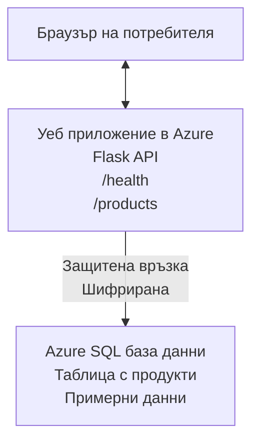

# Разгръщане на Microsoft SQL база данни и уеб приложение с AZD

⏱️ **Estimated Time**: 20-30 minutes | 💰 **Estimated Cost**: ~$15-25/month | ⭐ **Complexity**: Средно

Този **пълен, работещ пример** показва как да използвате [Azure Developer CLI (azd)](https://learn.microsoft.com/azure/developer/azure-developer-cli/) за разгръщане на Python Flask уеб приложение с Microsoft SQL Database в Azure. Целият код е включен и тестван—не са необходими външни зависимости.

## What You'll Learn

Като завършите този пример, ще:
- Разгърнете многослойно приложение (уеб приложение + база данни) с инфраструктура като код
- Конфигурирате сигурни връзки към базата данни без вграждане на тайни в кода
- Следите здравето на приложението с Application Insights
- Управлявате ефективно ресурсите в Azure с AZD CLI
- Следвате добри практики на Azure за сигурност, оптимизация на разходите и наблюдаемост

## Scenario Overview
- **Web App**: Python Flask REST API с връзка към база данни
- **Database**: Azure SQL Database с примерни данни
- **Infrastructure**: Provisioned using Bicep (модулни, за многократна употреба шаблони)
- **Deployment**: Fully automated with `azd` commands
- **Monitoring**: Application Insights за логове и телеметрия

## Prerequisites

### Required Tools

Преди да започнете, уверете се, че имате инсталирани следните инструменти:

1. **[Azure CLI](https://learn.microsoft.com/cli/azure/install-azure-cli)** (версия 2.50.0 или по-нова)
   ```sh
   az --version
   # Очакван изход: azure-cli 2.50.0 или по-нова
   ```

2. **[Azure Developer CLI (azd)](https://learn.microsoft.com/azure/developer/azure-developer-cli/install-azd)** (версия 1.0.0 или по-нова)
   ```sh
   azd version
   # Очакван изход: azd версия 1.0.0 или по-нова
   ```

3. **[Python 3.8+](https://www.python.org/downloads/)** (за локална разработка)
   ```sh
   python --version
   # Очакван изход: Python 3.8 или по-нова версия
   ```

4. **[Docker](https://www.docker.com/get-started)** (по желание, за локална контейнеризирана разработка)
   ```sh
   docker --version
   # Очакван изход: Docker версия 20.10 или по-нова
   ```

### Azure Requirements

- Активен **Azure subscription** ([create a free account](https://azure.microsoft.com/free/))
- Права за създаване на ресурси в абонамента ви
- Роля **Owner** или **Contributor** върху абонамента или ресурсната група

### Knowledge Prerequisites

Това е пример за **средно ниво**. Трябва да сте запознати с:
- Основни операции с командния ред
- Основни облачни понятия (ресурси, ресурсни групи)
- Основно разбиране за уеб приложения и бази данни

**Нови в AZD?** Започнете първо с [Ръководство за започване](../../docs/chapter-01-foundation/azd-basics.md).

## Architecture

Този пример разгръща двуслойна архитектура с уеб приложение и SQL база данни:


**Resource Deployment:**
- **Resource Group**: Контейнер за всички ресурси
- **App Service Plan**: Linux хостинг (B1 ниво за икономия)
- **Web App**: Python 3.11 runtime с Flask приложение
- **SQL Server**: Управляван сървър за бази данни с минимум TLS 1.2
- **SQL Database**: Basic ниво (2GB, подходящо за разработка/тестване)
- **Application Insights**: Мониторинг и логиране
- **Log Analytics Workspace**: Централизирано съхранение на логове

**Аналогия**: Представете си това като ресторант (уеб приложението) със складова фризерна камера (базата данни). Клиентите поръчват от менюто (API endpoints), а кухнята (Flask приложението) взема съставки (данни) от фризера. Мениджърът на ресторанта (Application Insights) следи всичко, което се случва.

## Folder Structure

Всички файлове са включени в този пример—не са необходими външни зависимости:

```
examples/database-app/
│
├── README.md                    # This file
├── azure.yaml                   # AZD configuration file
├── .env.sample                  # Sample environment variables
├── .gitignore                   # Git ignore patterns
│
├── infra/                       # Infrastructure as Code (Bicep)
│   ├── main.bicep              # Main orchestration template
│   ├── abbreviations.json      # Azure naming conventions
│   └── resources/              # Modular resource templates
│       ├── sql-server.bicep    # SQL Server configuration
│       ├── sql-database.bicep  # Database configuration
│       ├── app-service-plan.bicep  # Hosting plan
│       ├── app-insights.bicep  # Monitoring setup
│       └── web-app.bicep       # Web application
│
└── src/
    └── web/                    # Application source code
        ├── app.py              # Flask REST API
        ├── requirements.txt    # Python dependencies
        └── Dockerfile          # Container definition
```

**What Each File Does:**
- **azure.yaml**: Казва на AZD какво да разположи и къде
- **infra/main.bicep**: Оркестрира всички Azure ресурси
- **infra/resources/*.bicep**: Индивидуални дефиниции на ресурси (модулни за повторна употреба)
- **src/web/app.py**: Flask приложение с логика за база данни
- **requirements.txt**: Зависимости за Python пакети
- **Dockerfile**: Инструкции за контейнеризация за разгръщане

## Quickstart (Step-by-Step)

### Step 1: Clone and Navigate

```sh
git clone https://github.com/microsoft/AZD-for-beginners.git
cd AZD-for-beginners/examples/database-app
```

**✓ Success Check**: Verify you see `azure.yaml` and `infra/` folder:
```sh
ls
# Очаквано: README.md, azure.yaml, infra/, src/
```

### Step 2: Authenticate with Azure

```sh
azd auth login
```

Това отваря браузъра ви за удостоверяване в Azure. Впишете се със своите Azure идентификационни данни.

**✓ Success Check**: Трябва да видите:
```
Logged in to Azure.
```

### Step 3: Initialize the Environment

```sh
azd init
```

**What happens**: AZD създава локална конфигурация за вашето разполагане.

**Подканите, които ще видите**:
- **Environment name**: Въведете кратко име (напр., `dev`, `myapp`)
- **Azure subscription**: Изберете вашия абонамент от списъка
- **Azure location**: Изберете регион (напр., `eastus`, `westeurope`)

**✓ Success Check**: Трябва да видите:
```
SUCCESS: New project initialized!
```

### Step 4: Provision Azure Resources

```sh
azd provision
```

**What happens**: AZD разгръща цялата инфраструктура (отнема 5-8 минути):
1. Създава ресурсна група
2. Създава SQL Server и база данни
3. Създава App Service Plan
4. Създава Web App
5. Създава Application Insights
6. Конфигурира мрежа и сигурност

**Ще бъдете подканени за**:
- **SQL admin username**: Въведете потребителско име (напр., `sqladmin`)
- **SQL admin password**: Въведете силна парола (запазете я!)

**✓ Success Check**: Трябва да видите:
```
SUCCESS: Your application was provisioned in Azure in X minutes Y seconds.
You can view the resources created under the resource group rg-<env-name> in Azure Portal:
https://portal.azure.com/#@/resource/subscriptions/.../resourceGroups/rg-<env-name>
```

**⏱️ Време**: 5-8 минути

### Step 5: Deploy the Application

```sh
azd deploy
```

**What happens**: AZD изгражда и разгръща вашето Flask приложение:
1. Пакетира Python приложението
2. Изгражда Docker контейнера
3. Публикува в Azure Web App
4. Инициализира базата данни с примерни данни
5. Стартира приложението

**✓ Success Check**: Трябва да видите:
```
SUCCESS: Your application was deployed to Azure in X minutes Y seconds.
You can view the resources created under the resource group rg-<env-name> in Azure Portal:
https://portal.azure.com/#@/resource/subscriptions/.../resourceGroups/rg-<env-name>
```

**⏱️ Време**: 3-5 минути

### Step 6: Browse the Application

```sh
azd browse
```

Това отваря разположеното ви уеб приложение в браузъра на адрес `https://app-<unique-id>.azurewebsites.net`

**✓ Success Check**: Трябва да видите JSON изход:
```json
{
  "message": "Welcome to the Database App API",
  "endpoints": {
    "/": "This help message",
    "/health": "Health check endpoint",
    "/products": "List all products",
    "/products/<id>": "Get product by ID"
  }
}
```

### Step 7: Test the API Endpoints

**Health Check** (проверете връзката към базата данни):
```sh
curl https://app-<your-id>.azurewebsites.net/health
```

**Очакван отговор**:
```json
{
  "status": "healthy",
  "database": "connected"
}
```

**List Products** (примерни данни):
```sh
curl https://app-<your-id>.azurewebsites.net/products
```

**Очакван отговор**:
```json
[
  {
    "id": 1,
    "name": "Laptop",
    "description": "High-performance laptop",
    "price": 1299.99,
    "created_at": "2025-11-19T10:30:00"
  },
  ...
]
```

**Get Single Product**:
```sh
curl https://app-<your-id>.azurewebsites.net/products/1
```

**✓ Проверка за успех**: Всички крайни точки връщат JSON данни без грешки.

---

**🎉 Поздравления!** Успешно разположихте уеб приложение с база данни в Azure, използвайки AZD.

## Configuration Deep-Dive

### Environment Variables

Тайните се управляват сигурно чрез конфигурацията на Azure App Service—**никога не ги вграждайте в изходния код**.

**Configured Automatically by AZD**:
- `SQL_CONNECTION_STRING`: Връзка към базата данни с криптирани идентификационни данни
- `APPLICATIONINSIGHTS_CONNECTION_STRING`: Крайна точка за мониторинг и телеметрия
- `SCM_DO_BUILD_DURING_DEPLOYMENT`: Активира автоматична инсталация на зависимости

**Where Secrets Are Stored**:
1. По време на `azd provision` предоставяте SQL идентификационни данни чрез защитени подканвания
2. AZD ги съхранява във вашия локален `.azure/<env-name>/.env` файл (игнорира се от Git)
3. AZD ги инжектира в конфигурацията на Azure App Service (криптирано в покой)
4. Приложението ги чете чрез `os.getenv()` по време на изпълнение

### Local Development

За локално тестване, създайте файл `.env` от примера:

```sh
cp .env.sample .env
# Редактирайте .env с връзката към локалната база данни
```

**Local Development Workflow**:
```sh
# Инсталирайте зависимости
cd src/web
pip install -r requirements.txt

# Задайте променливи на средата
export SQL_CONNECTION_STRING="your-local-connection-string"

# Стартирайте приложението
python app.py
```

**Test locally**:
```sh
curl http://localhost:8000/health
# Очаквано: {"status": "healthy", "database": "connected"}
```

### Infrastructure as Code

Всички Azure ресурси са дефинирани в **Bicep шаблони** (`infra/` папка):

- **Modular Design**: Всеки тип ресурс има собствен файл за повторна употреба
- **Parameterized**: Персонализирайте SKU-та, региони, имена
- **Best Practices**: Следва стандарти за именуване и подразбиращи се настройки за сигурност на Azure
- **Version Controlled**: Промените в инфраструктурата се проследяват в Git

**Customization Example**:
За да промените нивото на базата данни, редактирайте `infra/resources/sql-database.bicep`:
```bicep
sku: {
  name: 'Standard'  // Changed from 'Basic'
  tier: 'Standard'
  capacity: 10
}
```

## Security Best Practices

Този пример следва най-добрите практики за сигурност в Azure:

### 1. **No Secrets in Source Code**
- ✅ Удостоверителните данни се съхраняват в конфигурацията на Azure App Service (криптирани)
- ✅ Файлове `.env` са изключени от Git чрез `.gitignore`
- ✅ Тайните се подават чрез защитени параметри по време на подготовка

### 2. **Encrypted Connections**
- ✅ TLS 1.2 минимум за SQL Server
- ✅ Задължителен HTTPS само за Web App
- ✅ Връзките към базата данни използват криптирани канали

### 3. **Network Security**
- ✅ Файъруол на SQL Server е конфигуриран да позволява само услуги на Azure
- ✅ Достъпът от публична мрежа е ограничен (може да се заключи допълнително чрез Private Endpoints)
- ✅ FTPS е деактивиран за Web App

### 4. **Authentication & Authorization**
- ⚠️ **Текущо**: SQL удостоверяване (потребител/парола)
- ✅ **Препоръка за продукция**: Използвайте Azure Managed Identity за удостоверяване без парола

**To Upgrade to Managed Identity** (за продукция):
1. Активирайте managed identity за Web App
2. Дайте права на идентичността в SQL
3. Актуализирайте connection string да използва managed identity
4. Премахнете удостоверяването с парола

### 5. **Auditing & Compliance**
- ✅ Application Insights логва всички заявки и грешки
- ✅ Аудитът за SQL Database е активиран (може да се конфигурира за съответствие)
- ✅ Всички ресурси са означени с тагове за управление

**Security Checklist Before Production**:
- [ ] Активирайте Azure Defender за SQL
- [ ] Конфигурирайте Private Endpoints за SQL Database
- [ ] Активирайте Web Application Firewall (WAF)
- [ ] Внедрете Azure Key Vault за ротация на тайни
- [ ] Конфигурирайте Azure AD удостоверяване
- [ ] Активирайте диагностично логване за всички ресурси

## Cost Optimization

**Estimated Monthly Costs** (as of November 2025):

| Resource | SKU/Tier | Estimated Cost |
|----------|----------|----------------|
| App Service Plan | B1 (Basic) | ~$13/month |
| SQL Database | Basic (2GB) | ~$5/month |
| Application Insights | Pay-as-you-go | ~$2/month (low traffic) |
| **Total** | | **~$20/month** |

**💡 Cost-Saving Tips**:

1. **Use Free Tier for Learning**:
   - App Service: F1 tier (free, limited hours)
   - SQL Database: Use Azure SQL Database serverless
   - Application Insights: 5GB/month free ingestion

2. **Stop Resources When Not in Use**:
   ```sh
   # Спри уеб приложението (базата данни все още начислява такси)
   az webapp stop --name <app-name> --resource-group <rg-name>
   
   # Рестартирай когато е необходимо
   az webapp start --name <app-name> --resource-group <rg-name>
   ```

3. **Delete Everything After Testing**:
   ```sh
   azd down
   ```
   Това премахва ВСИЧКИ ресурси и спира таксуването.

4. **Development vs. Production SKUs**:
   - **Development**: Basic tier (used in this example)
   - **Production**: Standard/Premium tier with redundancy

**Cost Monitoring**:
- Прегледайте разходите в [Azure Cost Management](https://portal.azure.com/#view/Microsoft_Azure_CostManagement)
- Настройте аларми за разходи, за да избегнете неприятни изненади
- Тагвайте всички ресурси с `azd-env-name` за проследяване

**Free Tier Alternative**:
За учебни цели можете да модифицирате `infra/resources/app-service-plan.bicep`:
```bicep
sku: {
  name: 'F1'  // Free tier
  tier: 'Free'
}
```
**Бележка**: Безплатният план има ограничения (60 мин/ден CPU, няма режим "always-on").

## Monitoring & Observability

### Application Insights Integration

Този пример включва **Application Insights** за цялостен мониторинг:

**Какво се наблюдава**:
- ✅ HTTP заявки (латентност, статус кодове, крайни точки)
- ✅ Грешки и изключения в приложението
- ✅ Персонализирано логване от Flask приложението
- ✅ Здравето на връзката към базата данни
- ✅ Метрики за производителност (CPU, памет)

**Достъп до Application Insights**:
1. Отворете [Azure Portal](https://portal.azure.com)
2. Навигирайте до вашата ресурсна група (`rg-<env-name>`)
3. Кликнете върху ресурса Application Insights (`appi-<unique-id>`)

**Полезни заявки** (Application Insights → Logs):

**View All Requests**:
```kusto
requests
| where timestamp > ago(1h)
| order by timestamp desc
| project timestamp, name, url, resultCode, duration
```

**Find Errors**:
```kusto
exceptions
| where timestamp > ago(24h)
| order by timestamp desc
| project timestamp, type, outerMessage, operation_Name
```

**Check Health Endpoint**:
```kusto
requests
| where name contains "health"
| summarize count() by resultCode, bin(timestamp, 1h)
```

### SQL Database Auditing

**Аудитът на SQL Database е активиран** за проследяване на:
- Достъпа до базата данни
- Неуспешни опити за логин
- Промени в схемата
- Достъп до данни (за съответствие)

**Достъп до журналите на одита**:
1. Azure Portal → SQL Database → Auditing
2. Преглед на логовете в Log Analytics workspace

### Real-Time Monitoring

**Преглед на Live Metrics**:
1. Application Insights → Live Metrics
2. Вижте заявки, неуспехи и производителност в реално време

**Настройване на сигнали**:
Създайте аларми за критични събития:
- HTTP 500 грешки > 5 за 5 минути
- Провали в връзката към базата данни
- Високо време за отговор (>2 секунди)

**Пример за създаване на сигнал**:
```sh
az monitor metrics alert create \
  --name "High-Response-Time" \
  --resource-group <rg-name> \
  --scopes <app-insights-resource-id> \
  --condition "avg requests/duration > 2000" \
  --description "Alert when response time exceeds 2 seconds"
```

## Troubleshooting
### Чести проблеми и решения

#### 1. `azd provision` се проваля с "Местоположение не е налично"

**Симптом**:
```
Error: The subscription is not registered for the resource type 'components' in the location 'centralus'.
```

**Решение**:
Изберете различен регион на Azure или регистрирайте доставчика на ресурси:
```sh
az provider register --namespace Microsoft.Insights
```

#### 2. SQL връзка не успява по време на разгръщане

**Симнатом**:
```
pyodbc.OperationalError: ('08001', '[08001] [Microsoft][ODBC Driver 18 for SQL Server]TCP Provider...')
```

**Решение**:
- Проверете дали защитната стена на SQL Server позволява услугите на Azure (конфигурира се автоматично)
- Уверете се, че администраторската парола за SQL е въведена правилно по време на `azd provision`
- Уверете се, че SQL Server е напълно внедрен (може да отнеме 2-3 минути)

**Проверка на връзката**:
```sh
# От портала на Azure отидете в SQL база данни → Редактор на заявки
# Опитайте да се свържете с вашите идентификационни данни
```

#### 3. Web App показва "Application Error"

**Симптом**:
Браузърът показва обща страница за грешка.

**Решение**:
Проверете логовете на приложението:
```sh
# Преглед на последните логове
az webapp log tail --name <app-name> --resource-group <rg-name>
```

**Чести причини**:
- Липсващи променливи на средата (проверете App Service → Конфигурация)
- Инсталирането на Python пакети е неуспешно (проверете логовете на разгръщането)
- Грешка при инициализация на базата данни (проверете свързаността със SQL)

#### 4. `azd deploy` се проваля с "Build Error"

**Симптом**:
```
Error: Failed to build project
```

**Решение**:
- Уверете се, че `requirements.txt` няма синтактични грешки
- Проверете, че Python 3.11 е зададен в `infra/resources/web-app.bicep`
- Уверете се, че Dockerfile използва правилното базово изображение

**Отстраняване на грешки локално**:
```sh
cd src/web
docker build -t test-app .
docker run -p 8000:8000 test-app
```

#### 5. "Unauthorized" при изпълнение на AZD команди

**Симптом**:
```
ERROR: (Unauthorized) The client '<id>' with object id '<id>' does not have authorization
```

**Решение**:
Презаверете се в Azure:
```sh
azd auth login
az login
```

Проверете дали имате правилните разрешения (рола Contributor) в абонамента.

#### 6. Високи разходи за база данни

**Симптом**:
Неочаквана сметка от Azure.

**Решение**:
- Проверете дали не сте забравили да изпълните `azd down` след тестовете
- Уверете се, че SQL Database използва Basic tier (не Premium)
- Прегледайте разходите в Azure Cost Management
- Настройте аларми за разходи

### Получаване на помощ

**Прегледайте всички AZD променливи на средата**:
```sh
azd env get-values
```

**Проверете състоянието на разгръщането**:
```sh
az webapp show --name <app-name> --resource-group <rg-name> --query state
```

**Достъп до логовете на приложението**:
```sh
az webapp log download --name <app-name> --resource-group <rg-name> --log-file app-logs.zip
```

**Нуждаете се от още помощ?**
- [AZD Troubleshooting Guide](../../docs/chapter-07-troubleshooting/common-issues.md)
- [Azure App Service Troubleshooting](https://learn.microsoft.com/azure/app-service/troubleshoot-diagnostic-logs)
- [Azure SQL Troubleshooting](https://learn.microsoft.com/azure/azure-sql/database/troubleshoot-common-errors-issues)

## Практически упражнения

### Упражнение 1: Проверете вашето разгръщане (Начинаещ)

**Цел**: Потвърдете, че всички ресурси са разположени и приложението работи.

**Стъпки**:
1. Изброете всички ресурси в вашата ресурсна група:
   ```sh
   az resource list --resource-group rg-<env-name> --output table
   ```
   **Очаквано**: 6-7 ресурса (Web App, SQL Server, SQL Database, App Service Plan, Application Insights, Log Analytics)

2. Тествайте всички API крайни точки:
   ```sh
   curl https://app-<your-id>.azurewebsites.net/
   curl https://app-<your-id>.azurewebsites.net/health
   curl https://app-<your-id>.azurewebsites.net/products
   curl https://app-<your-id>.azurewebsites.net/products/1
   ```
   **Очаквано**: Всички връщат валиден JSON без грешки

3. Проверете Application Insights:
   - Отидете в Application Insights в Azure Portal
   - Отворете "Live Metrics"
   - Обновете браузъра си върху уеб приложението
   **Очаквано**: Виждате заявки в реално време

**Критерии за успех**: Всички 6-7 ресурса съществуват, всички крайни точки връщат данни, Live Metrics показва активност.

---

### Упражнение 2: Добавете нов API крайна точка (Средно ниво)

**Цел**: Разширете Flask приложението с нова крайна точка.

**Начален код**: Текущите крайни точки в `src/web/app.py`

**Стъпки**:
1. Редактирайте `src/web/app.py` и добавете нова крайна точка след функцията `get_product()`:
   ```python
   @app.route('/products/search/<keyword>')
   def search_products(keyword):
       """Search products by name or description."""
       try:
           conn = get_db_connection()
           cursor = conn.cursor()
           cursor.execute(
               "SELECT id, name, description, price, created_at FROM products WHERE name LIKE ? OR description LIKE ?",
               (f'%{keyword}%', f'%{keyword}%')
           )
           
           products = []
           for row in cursor.fetchall():
               products.append({
                   'id': row[0],
                   'name': row[1],
                   'description': row[2],
                   'price': float(row[3]) if row[3] else None,
                   'created_at': row[4].isoformat() if row[4] else None
               })
           
           cursor.close()
           conn.close()
           
           logger.info(f"Search for '{keyword}' returned {len(products)} results")
           return jsonify(products), 200
           
       except Exception as e:
           logger.error(f"Error searching products: {str(e)}")
           return jsonify({'error': str(e)}), 500
   ```

2. Разгърнете обновеното приложение:
   ```sh
   azd deploy
   ```

3. Тествайте новата крайна точка:
   ```sh
   curl https://app-<your-id>.azurewebsites.net/products/search/laptop
   ```
   **Очаквано**: Връща продукти, съвпадащи с "laptop"

**Критерии за успех**: Новата крайна точка работи, връща филтрирани резултати, появява се в логовете на Application Insights.

---

### Упражнение 3: Добавете мониторинг и аларми (Напреднал)

**Цел**: Настройте проактивен мониторинг с аларми.

**Стъпки**:
1. Създайте аларма за HTTP 500 грешки:
   ```sh
   # Вземи ID на ресурса Application Insights
   AI_ID=$(az monitor app-insights component show \
     --app appi-<your-id> \
     --resource-group rg-<env-name> \
     --query id -o tsv)
   
   # Създай предупреждение
   az monitor metrics alert create \
     --name "High-Error-Rate" \
     --resource-group rg-<env-name> \
     --scopes $AI_ID \
     --condition "count requests/failed > 5" \
     --window-size 5m \
     --evaluation-frequency 1m \
     --description "Alert when >5 failed requests in 5 minutes"
   ```

2. Тригерирайте алармата като предизвикате грешки:
   ```sh
   # Заявка за несъществуващ продукт
   for i in {1..10}; do curl https://app-<your-id>.azurewebsites.net/products/999; done
   ```

3. Проверете дали алармата е задействана:
   - Azure Portal → Alerts → Alert Rules
   - Проверете имейла си (ако е конфигуриран)

**Критерии за успех**: Правилото за аларма е създадено, задейства се при грешки, получавате уведомления.

---

### Упражнение 4: Промени в схемата на базата данни (Напреднал)

**Цел**: Добавете нова таблица и модифицирайте приложението да я използва.

**Стъпки**:
1. Свържете се с SQL Database чрез Query Editor в Azure Portal

2. Създайте нова таблица `categories`:
   ```sql
   CREATE TABLE categories (
       id INT PRIMARY KEY IDENTITY(1,1),
       name NVARCHAR(50) NOT NULL,
       description NVARCHAR(200)
   );
   
   INSERT INTO categories (name, description) VALUES
   ('Electronics', 'Electronic devices and accessories'),
   ('Office Supplies', 'Office equipment and supplies');
   
   -- Add category to products table
   ALTER TABLE products ADD category_id INT;
   UPDATE products SET category_id = 1; -- Set all to Electronics
   ```

3. Актуализирайте `src/web/app.py`, за да включва информация за категорията в отговорите

4. Разгърнете и тествайте

**Критерии за успех**: Новата таблица съществува, продуктите показват информация за категорията, приложението продължава да работи.

---

### Упражнение 5: Имплементирайте кеширане (Експерт)

**Цел**: Добавете Azure Redis Cache за подобряване на производителността.

**Стъпки**:
1. Добавете Redis Cache в `infra/main.bicep`
2. Актуализирайте `src/web/app.py`, за да кеширате заявки за продукти
3. Измерете подобрението в производителността с Application Insights
4. Сравнете времена за отговор преди/след кеширането

**Критерии за успех**: Redis е внедрен, кеширането работи, времената за отговор се подобряват с >50%.

**Подсказка**: Започнете с [Azure Cache for Redis documentation](https://learn.microsoft.com/azure/azure-cache-for-redis/).

---

## Почистване

За да избегнете продължаващи разходи, изтрийте всички ресурси след като приключите:

```sh
azd down
```

**Подканващ въпрос за потвърждение**:
```
? Total resources to delete: 7, are you sure you want to continue? (y/N)
```

Въведете `y`, за да потвърдите.

**✓ Проверка за успех**: 
- Всички ресурси са изтрити от Azure Portal
- Няма текущи разходи
- Локалната папка `.azure/<env-name>` може да бъде изтрита

**Алтернатива** (запазете инфраструктурата, изтрийте данните):
```sh
# Изтрийте само групата с ресурси (запазете конфигурацията на AZD)
az group delete --name rg-<env-name> --yes
```
## Научете повече

### Свързана документация
- [Azure Developer CLI Documentation](https://learn.microsoft.com/azure/developer/azure-developer-cli/)
- [Azure SQL Database Documentation](https://learn.microsoft.com/azure/azure-sql/database/)
- [Azure App Service Documentation](https://learn.microsoft.com/azure/app-service/)
- [Application Insights Documentation](https://learn.microsoft.com/azure/azure-monitor/app/app-insights-overview)
- [Bicep Language Reference](https://learn.microsoft.com/azure/azure-resource-manager/bicep/)

### Следващи стъпки в този курс
- **[Container Apps Example](../../../../examples/container-app)**: Разгръщане на микросервизи с Azure Container Apps
- **[AI Integration Guide](../../../../docs/ai-foundry)**: Добавяне на AI възможности към вашето приложение
- **[Deployment Best Practices](../../docs/chapter-04-infrastructure/deployment-guide.md)**: Патерни за производствено разгръщане

### Разширени теми
- **Managed Identity**: Премахнете паролите и използвайте Azure AD автентикация
- **Private Endpoints**: Защитете връзките към базата данни в рамките на виртуална мрежа
- **CI/CD Integration**: Автоматизирайте разгръщанията с GitHub Actions или Azure DevOps
- **Multi-Environment**: Настройте dev, staging и production среди
- **Database Migrations**: Използвайте Alembic или Entity Framework за версиониране на схемата

### Сравнение с други подходи

**AZD vs. ARM Templates**:
- ✅ AZD: По-високо ниво на абстракция, по-прости команди
- ⚠️ ARM: По-разгърнат, по-гранулиран контрол

**AZD vs. Terraform**:
- ✅ AZD: Azure-native, интегриран с услугите на Azure
- ⚠️ Terraform: Поддръжка на множество облаци, по-голяма екосистема

**AZD vs. Azure Portal**:
- ✅ AZD: Повтаряем, контролира се с версиониране, може да се автоматизира
- ⚠️ Portal: Ръчни кликове, трудно за възпроизвеждане

**Мислете за AZD като**: Docker Compose за Azure — опростена конфигурация за сложни разгръщания.

---

## Често задавани въпроси

**В: Мога ли да използвам друг програмен език?**  
О: Да! Заменете `src/web/` с Node.js, C#, Go или който и да е език. Актуализирайте `azure.yaml` и Bicep съответно.

**В: Как да добавя още бази данни?**  
О: Добавете още модул за SQL Database в `infra/main.bicep` или използвайте PostgreSQL/MySQL от услугите на Azure Database.

**В: Мога ли да използвам това в продукция?**  
О: Това е отправна точка. За продукция добавете: managed identity, private endpoints, излишност, стратегия за архивиране, WAF и подобрен мониторинг.

**В: Какво ако искам да използвам контейнери вместо разгръщане на код?**  
О: Вижте [Container Apps Example](../../../../examples/container-app), който използва Docker контейнери навсякъде.

**В: Как да се свържа с базата данни от моя локален компютър?**  
О: Добавете вашия IP към защитната стена на SQL Server:
```sh
az sql server firewall-rule create \
  --resource-group rg-<env-name> \
  --server sql-<unique-id> \
  --name AllowMyIP \
  --start-ip-address <your-ip> \
  --end-ip-address <your-ip>
```

**В: Мога ли да използвам съществуваща база данни вместо да създам нова?**  
О: Да, модифицирайте `infra/main.bicep`, за да реферира съществуващ SQL Server и актуализирайте параметрите на connection string-a.

---

> **Забележка:** Този пример демонстрира добри практики за разгръщане на уеб приложение с база данни, използвайки AZD. Включва работещ код, подробна документация и практически упражнения за затвърждаване на знанията. За продукционни разгръщания прегледайте изискванията за сигурност, мащабируемост, съответствие и разходи, специфични за вашата организация.

**📚 Навигация в курса:**
- ← Предишен: [Container Apps Example](../../../../examples/container-app)
- → Следващ: [AI Integration Guide](../../../../docs/ai-foundry)
- 🏠 [Начало на курса](../../README.md)

---

<!-- CO-OP TRANSLATOR DISCLAIMER START -->
**Отказ от отговорност**:
Този документ е преведен с помощта на AI услуга за превод [Co-op Translator](https://github.com/Azure/co-op-translator). Въпреки че се стремим към точност, имайте предвид, че автоматизираните преводи могат да съдържат грешки или неточности. Оригиналният документ на първоначалния език трябва да се счита за авторитетен източник. За критична информация се препоръчва професионален човешки превод. Не носим отговорност за каквито и да е недоразумения или погрешни тълкувания, произтичащи от използването на този превод.
<!-- CO-OP TRANSLATOR DISCLAIMER END -->