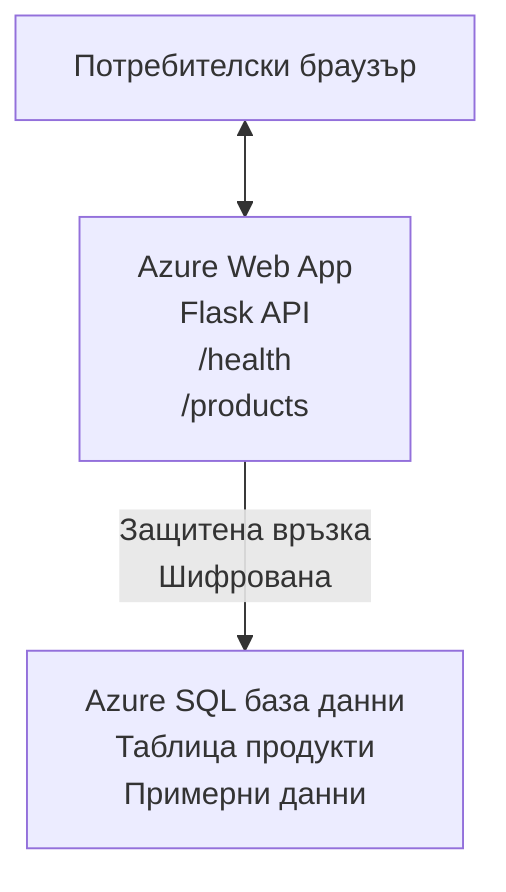

# Разгръщане на Microsoft SQL база данни и уеб приложение с AZD

⏱️ **Оценено време**: 20-30 минути | 💰 **Оценена цена**: ~$15-25/месец | ⭐ **Сложност**: Средно ниво

Този **пълен, работещ пример** демонстрира как да използвате [Azure Developer CLI (azd)](https://learn.microsoft.com/azure/developer/azure-developer-cli/) за разгръщане на Python Flask уеб приложение с Microsoft SQL база данни в Azure. Целият код е включен и тестван — не са необходими външни зависимости.

## Какво ще научите

Чрез завършване на този пример ще:
- Разгърнете многостепенно приложение (уеб приложение + база данни) чрез инфраструктура-като-код
- Конфигурирате защитени връзки към база данни без жорстко кодирани тайни
- Наблюдавате здравето на приложението с Application Insights
- Управлявате Azure ресурси ефективно с AZD CLI
- Следвате най-добрите практики на Azure за сигурност, оптимизация на разходи и наблюдение

## Обзор на сценария
- **Уеб приложение**: Python Flask REST API с връзка към база данни
- **База данни**: Azure SQL база данни със примерни данни
- **Инфраструктура**: Осигурена чрез Bicep (модулни, използваеми шаблони)
- **Разгръщане**: Напълно автоматизирано с команди `azd`
- **Наблюдение**: Application Insights за логове и телеметрия

## Предварителни условия

### Изисквани инструменти

Преди започване, проверете дали имате инсталирани тези инструменти:

1. **[Azure CLI](https://learn.microsoft.com/cli/azure/install-azure-cli)** (версия 2.50.0 или по-висока)
   ```sh
   az --version
   # Очакван изход: azure-cli 2.50.0 или по-висока версия
   ```

2. **[Azure Developer CLI (azd)](https://learn.microsoft.com/azure/developer/azure-developer-cli/install-azd)** (версия 1.0.0 или по-висока)
   ```sh
   azd version
   # Очакван изход: azd версия 1.0.0 или по-висока
   ```

3. **[Python 3.8+](https://www.python.org/downloads/)** (за локална разработка)
   ```sh
   python --version
   # Очакван изход: Python 3.8 или по-висока версия
   ```

4. **[Docker](https://www.docker.com/get-started)** (по избор, за локална контейнеризирана разработка)
   ```sh
   docker --version
   # Очакван изход: Docker версия 20.10 или по-висока
   ```

### Изисквания на Azure

- Активен **Azure абонамент** ([създаване на безплатен акаунт](https://azure.microsoft.com/free/))
- Права за създаване на ресурси в абонамента ви
- Роля **Собственик** или **Конрибутор** за абонамента или групата с ресурси

### Предварителни знания

Това е пример **на средно ниво**. Трябва да познавате:
- Основни операции в команден ред
- Основни облачни концепции (ресурси, групи с ресурси)
- Основни познания за уеб приложения и бази данни

**Нов в AZD?** Започнете първо с [Ръководството за начинаещи](../../docs/chapter-01-foundation/azd-basics.md).

## Архитектура

Примерът разгърва двустепенна архитектура с уеб приложение и SQL база данни:


**Разгръщане на ресурси:**
- **Група ресурси**: Контейнер за всички ресурси
- **App Service Plan**: Linux базиран хостинг (нюанс B1 за ефективност на разходи)
- **Уеб приложение**: Python 3.11 runtime с Flask приложение
- **SQL сървър**: Управляван SQL сървър с минимум TLS 1.2
- **SQL база данни**: Основен нюанс (2GB, подходящ за разработка/тест)
- **Application Insights**: Наблюдение и логване
- **Работно пространство за Log Analytics**: Централизирано съхранение на логове

**Аналогия**: Представете си това като ресторант (уеб приложение) с хладилна камера (база данни). Клиентите поръчват от менюто (API крайни точки), а кухнята (Flask приложението) взема съставките (данните) от камерата. Управителят на ресторанта (Application Insights) проследява всичко, което се случва.

## Структура на папките

Всички файлове са включени в този пример — не са необходими външни зависимости:

```
examples/database-app/
│
├── README.md                    # This file
├── azure.yaml                   # AZD configuration file
├── .env.sample                  # Sample environment variables
├── .gitignore                   # Git ignore patterns
│
├── infra/                       # Infrastructure as Code (Bicep)
│   ├── main.bicep              # Main orchestration template
│   ├── abbreviations.json      # Azure naming conventions
│   └── resources/              # Modular resource templates
│       ├── sql-server.bicep    # SQL Server configuration
│       ├── sql-database.bicep  # Database configuration
│       ├── app-service-plan.bicep  # Hosting plan
│       ├── app-insights.bicep  # Monitoring setup
│       └── web-app.bicep       # Web application
│
└── src/
    └── web/                    # Application source code
        ├── app.py              # Flask REST API
        ├── requirements.txt    # Python dependencies
        └── Dockerfile          # Container definition
```

**Какво прави всеки файл:**
- **azure.yaml**: Казва на AZD какво и къде да разгърне
- **infra/main.bicep**: Оркестрира всички Azure ресурси
- **infra/resources/*.bicep**: Индивидуални дефиниции на ресурси (модулни за повторно използване)
- **src/web/app.py**: Flask приложение с логика за база данни
- **requirements.txt**: Python зависимости на пакети
- **Dockerfile**: Инструкции за контейнеризация за разгръщане

## Бърз старт (стъпка по стъпка)

### Стъпка 1: Клонирайте и навигирайте

```sh
git clone https://github.com/microsoft/AZD-for-beginners.git
cd AZD-for-beginners/examples/database-app
```

**✓ Проверка за успех**: Проверете, че виждате `azure.yaml` и папка `infra/`:
```sh
ls
# Очаквани: README.md, azure.yaml, infra/, src/
```

### Стъпка 2: Аутентикация в Azure

```sh
azd auth login
```

Това отваря браузъра за аутентикация в Azure. Влезте със своите Azure идентификационни данни.

**✓ Проверка за успех**: Трябва да видите:
```
Logged in to Azure.
```

### Стъпка 3: Инициализирайте средата

```sh
azd init
```

**Какво се случва**: AZD създава локална конфигурация за разгръщането ви.

**Подканите, които ще видите**:
- **Име на среда**: Въведете кратко име (напр. `dev`, `myapp`)
- **Azure абонамент**: Изберете абонамента от списъка
- **Локация в Azure**: Изберете регион (напр. `eastus`, `westeurope`)

**✓ Проверка за успех**: Трябва да видите:
```
SUCCESS: New project initialized!
```

### Стъпка 4: Осигурете Azure ресурси

```sh
azd provision
```

**Какво се случва**: AZD разгръща цялата инфраструктура (отнема 5-8 минути):
1. Създава група ресурси
2. Създава SQL сървър и базата данни
3. Създава App Service Plan
4. Създава уеб приложението
5. Създава Application Insights
6. Конфигурира мрежа и сигурност

**Ще бъдете подканени за**:
- **Административно потребителско име за SQL**: Въведете потребителско име (напр. `sqladmin`)
- **Административна парола за SQL**: Въведете силна парола (запазете я!)

**✓ Проверка за успех**: Трябва да видите:
```
SUCCESS: Your application was provisioned in Azure in X minutes Y seconds.
You can view the resources created under the resource group rg-<env-name> in Azure Portal:
https://portal.azure.com/#@/resource/subscriptions/.../resourceGroups/rg-<env-name>
```

**⏱️ Време**: 5-8 минути

### Стъпка 5: Разгръщане на приложението

```sh
azd deploy
```

**Какво се случва**: AZD компилира и разгръща вашето Flask приложение:
1. Пакетира Python приложението
2. Създава Docker контейнера
3. Публикува в Azure Web App
4. Инициализира базата данни със примерни данни
5. Стартира приложението

**✓ Проверка за успех**: Трябва да видите:
```
SUCCESS: Your application was deployed to Azure in X minutes Y seconds.
You can view the resources created under the resource group rg-<env-name> in Azure Portal:
https://portal.azure.com/#@/resource/subscriptions/.../resourceGroups/rg-<env-name>
```

**⏱️ Време**: 3-5 минути

### Стъпка 6: Прегледайте приложението

```sh
azd browse
```

Това отваря разположеното уеб приложение в браузъра на адрес `https://app-<unique-id>.azurewebsites.net`

**✓ Проверка за успех**: Трябва да видите JSON изход:
```json
{
  "message": "Welcome to the Database App API",
  "endpoints": {
    "/": "This help message",
    "/health": "Health check endpoint",
    "/products": "List all products",
    "/products/<id>": "Get product by ID"
  }
}
```

### Стъпка 7: Тествайте API крайните точки

**Проверка на здравословното състояние** (проверете връзката с базата данни):
```sh
curl https://app-<your-id>.azurewebsites.net/health
```

**Очакван отговор**:
```json
{
  "status": "healthy",
  "database": "connected"
}
```

**Списък с продукти** (примерни данни):
```sh
curl https://app-<your-id>.azurewebsites.net/products
```

**Очакван отговор**:
```json
[
  {
    "id": 1,
    "name": "Laptop",
    "description": "High-performance laptop",
    "price": 1299.99,
    "created_at": "2025-11-19T10:30:00"
  },
  ...
]
```

**Извличане на един продукт**:
```sh
curl https://app-<your-id>.azurewebsites.net/products/1
```

**✓ Проверка за успех**: Всички крайни точки връщат JSON данни без грешки.

---

**🎉 Поздравления!** Успешно разгръхте уеб приложение с база данни в Azure с помощта на AZD.

## Подробна конфигурация

### Променливи на средата

Тайните се управляват сигурно чрез конфигурацията на Azure App Service — **никога не се жорстко кодират в сорс кода**.

**Автоматично конфигурирани от AZD**:
- `SQL_CONNECTION_STRING`: Стринг за връзка към база данни с криптирани идентификационни данни
- `APPLICATIONINSIGHTS_CONNECTION_STRING`: Крайна точка за мониторинг на телеметрия
- `SCM_DO_BUILD_DURING_DEPLOYMENT`: Позволява автоматично инсталиране на зависимости

**Къде се съхраняват тайните**:
1. По време на `azd provision` предоставяте SQL идентификационни данни чрез защитени подканяния
2. AZD ги записва във вашия локален файл `.azure/<env-name>/.env` (игнорира се от Git)
3. AZD ги инжектира в конфигурацията на Azure App Service (криптирани при съхранението)
4. Приложението ги чете чрез `os.getenv()` по време на изпълнение

### Локална разработка

За локално тестване създайте `.env` файл от примерния:

```sh
cp .env.sample .env
# Редактирайте .env с вашата локална връзка към базата данни
```

**Работен процес за локална разработка**:
```sh
# Инсталиране на зависимости
cd src/web
pip install -r requirements.txt

# Задаване на променливи на средата
export SQL_CONNECTION_STRING="your-local-connection-string"

# Стартиране на приложението
python app.py
```

**Тествайте локално**:
```sh
curl http://localhost:8000/health
# Очаквано: {"status": "healthy", "database": "connected"}
```

### Инфраструктура като код

Всички Azure ресурси са дефинирани в **Bicep шаблони** (`infra/` папка):

- **Модулен дизайн**: Всеки ресурсен тип има собствен файл за повторна употреба
- **Параметризирани**: Можете да персонализирате SKU, региони, именуване
- **Най-добри практики**: Спазва именуване и настройки на сигурност според Azure
- **Контролирани с версия**: Промените в инфраструктурата се управляват чрез Git

**Пример за персонализация**:
За да промените нивото на базата данни, редактирайте `infra/resources/sql-database.bicep`:
```bicep
sku: {
  name: 'Standard'  // Changed from 'Basic'
  tier: 'Standard'
  capacity: 10
}
```

## Най-добри практики за сигурност

Този пример следва най-добрите практики за сигурност в Azure:

### 1. **Без тайни в сорс кода**
- ✅ Идентификационните данни се съхраняват в конфигурацията на Azure App Service (криптирани)
- ✅ `.env` файловете са изключени от Git чрез `.gitignore`
- ✅ Тайните се подават чрез защитени параметри по време на осигуряването

### 2. **Криптирани връзки**
- ✅ TLS 1.2 минимум за SQL сървъра
- ✅ HTTPS само за уеб приложението
- ✅ Връзките към базата данни използват криптирани канали

### 3. **Мрежова сигурност**
- ✅ Файъруол на SQL сървъра е конфигуриран да позволява само Azure услуги
- ✅ Публичен достъп до мрежата е ограничен (може да се заключи допълнително с Private Endpoints)
- ✅ FTPS е деактивиран на Web App

### 4. **Аутентикация и авторизация**
- ⚠️ **Текущо**: SQL аутентикация (потребителско име/парола)
- ✅ **Препоръка за продукция**: Използвайте Azure Managed Identity за безпаролна аутентикация

**За надграждане до Managed Identity** (за продукция):
1. Активирайте managed identity на Web App
2. Дайте права на идентичността в SQL
3. Актуализирайте стринга за връзка за използване на managed identity
4. Премахнете аутентикацията с парола

### 5. **Одит и съответствие**
- ✅ Application Insights логва всички заявки и грешки
- ✅ Одит на SQL базата данни е включен (може да се настрои за съответствие)
- ✅ Всички ресурси са етикетирани за управление

**Контролен списък преди продукция**:
- [ ] Активирайте Azure Defender за SQL
- [ ] Конфигурирайте Private Endpoints за SQL Database
- [ ] Активирайте Web Application Firewall (WAF)
- [ ] Внедрете Azure Key Vault за ротация на тайни
- [ ] Конфигурирайте Azure AD аутентикация
- [ ] Активирайте диагностично логване за всички ресурси

## Оптимизация на разходите

**Оценени месечни разходи** (към ноември 2025):

| Ресурс | SKU/Ниво | Оценена цена |
|----------|----------|----------------|
| App Service Plan | B1 (Основен) | ~$13/месец |
| SQL база данни | Основен (2GB) | ~$5/месец |
| Application Insights | Плащане на използване | ~$2/месец (нисък трафик) |
| **Общо** | | **~$20/месец** |

**💡 Съвети за спестяване:**

1. **Използвайте безплатен слой за учене**:
   - App Service: нюанс F1 (безплатен, ограничени часове)
   - SQL база данни: използвайте Azure SQL Database serverless
   - Application Insights: 5GB/месец безплатен прием

2. **Спирайте ресурсите, когато не се използват**:
   ```sh
   # Затворете уеб приложението (базата данни все още начислява такси)
   az webapp stop --name <app-name> --resource-group <rg-name>
   
   # Рестартирайте при необходимост
   az webapp start --name <app-name> --resource-group <rg-name>
   ```

3. **Изтрийте всичко след тестване**:
   ```sh
   azd down
   ```
   Това премахва ВСИЧКИ ресурси и спира начисляването на такси.

4. **SKU за разработка срещу продукция**:
   - **Разработка**: Основен нюанс (използван в този пример)
   - **Продукция**: Стандартен/Премиум нюанс с излишък

**Мониторинг на разходите**:
- Преглеждайте разходите в [Azure Cost Management](https://portal.azure.com/#view/Microsoft_Azure_CostManagement)
- Настройте аларми за разходи, за да избегнете изненади
- Етикетирайте всички ресурси с `azd-env-name` за проследяване

**Алтернатива в безплатен слой**:
За учебни цели можете да модифицирате `infra/resources/app-service-plan.bicep`:
```bicep
sku: {
  name: 'F1'  // Free tier
  tier: 'Free'
}
```
**Забележка**: Безплатният слой има ограничения (60 минути на ден CPU, няма винаги активен режим).

## Наблюдение и осведоменост

### Интеграция с Application Insights

Този пример включва **Application Insights** за цялостно наблюдение:

**Какво се наблюдава**:
- ✅ HTTP заявки (латентност, статус кодове, крайни точки)
- ✅ Грешки и изключения в приложението
- ✅ Потребителско логване от Flask приложението
- ✅ Здраве на връзката към базата данни
- ✅ Метрики за производителност (CPU, памет)

**Достъп до Application Insights**:
1. Отворете [Azure портала](https://portal.azure.com)
2. Отидете в групата ресурси (`rg-<env-name>`)
3. Кликнете върху ресурса Application Insights (`appi-<unique-id>`)

**Полезни заявки** (Application Insights → Логове):

**Прегледайте всички заявки**:
```kusto
requests
| where timestamp > ago(1h)
| order by timestamp desc
| project timestamp, name, url, resultCode, duration
```

**Намерете грешки**:
```kusto
exceptions
| where timestamp > ago(24h)
| order by timestamp desc
| project timestamp, type, outerMessage, operation_Name
```

**Проверете здравословната крайна точка**:
```kusto
requests
| where name contains "health"
| summarize count() by resultCode, bin(timestamp, 1h)
```

### Одит на SQL база данни

**Одитът на SQL база данни е включен**, за да следи:
- Модели на достъп до базата
- Неуспешни опити за вход
- Промени в схемата
- Достъп до данни (за съответствие)

**Достъп до одитните логове**:
1. Azure Portal → SQL база данни → Одит
2. Преглеждайте логове в Log Analytics работно пространство

### Наблюдение в реално време

**Вижте живи метрики**:
1. Application Insights → Live Metrics
2. Вижте заявки, неуспехи и производителност в реално време

**Настройте аларми**:
Създайте аларми за критични събития:
- HTTP 500 грешки > 5 за 5 минути
- Провали на връзката с базата данни
- Високи времена за отговор (>2 секунди)

**Пример за създаване на аларми**:
```sh
az monitor metrics alert create \
  --name "High-Response-Time" \
  --resource-group <rg-name> \
  --scopes <app-insights-resource-id> \
  --condition "avg requests/duration > 2000" \
  --description "Alert when response time exceeds 2 seconds"
```

## Отстраняване на неизправности
### Чести проблеми и решения

#### 1. `azd provision` неуспешен със съобщение "Location not available"

**Симптом**:  
```
Error: The subscription is not registered for the resource type 'components' in the location 'centralus'.
```
  
**Решение**:  
Изберете друг регион на Azure или регистрирайте ресурсния доставчик:  
```sh
az provider register --namespace Microsoft.Insights
```
  
#### 2. Неуспешно свързване към SQL по време на деплоймънт

**Симптом**:  
```
pyodbc.OperationalError: ('08001', '[08001] [Microsoft][ODBC Driver 18 for SQL Server]TCP Provider...')
```
  
**Решение**:
- Проверете дали защитната стена на SQL сървъра позволява услуги на Azure (обикновено конфигурирано автоматично)
- Уверете се, че администраторската парола на SQL е въведена правилно при `azd provision`
- Проверете дали SQL сървърът е напълно провизиониран (може да отнеме 2-3 минути)

**Проверете връзката**:  
```sh
# От Azure портала отидете на SQL база данни → Редактор на заявки
# Опитайте да се свържете с вашите идентификационни данни
```
  
#### 3. Уеб приложението показва "Application Error"

**Симптом**:  
Браузърът показва обща страница за грешка.

**Решение**:  
Проверете логовете на приложението:  
```sh
# Преглед на последните записи в логовете
az webapp log tail --name <app-name> --resource-group <rg-name>
```
  
**Чести причини**:  
- Липсващи променливи на средата (проверете App Service → Configuration)  
- Проблем с инсталирането на Python пакети (проверете логовете от деплоймънта)  
- Грешка при инициализация на базата данни (проверете свързаността със SQL)  

#### 4. `azd deploy` неуспешен със "Build Error"

**Симптом**:  
```
Error: Failed to build project
```
  
**Решение**:  
- Уверете се, че `requirements.txt` няма синтактични грешки  
- Проверете дали Python 3.11 е указан в `infra/resources/web-app.bicep`  
- Проверете дали Dockerfile използва правилното базово изображение  

**Отстраняване на грешки локално**:  
```sh
cd src/web
docker build -t test-app .
docker run -p 8000:8000 test-app
```
  
#### 5. "Unauthorized" при изпълнение на AZD команди

**Симптом**:  
```
ERROR: (Unauthorized) The client '<id>' with object id '<id>' does not have authorization
```
  
**Решение**:  
Повторно удостоверяване в Azure:  
```sh
# Задължително за работни процеси на AZD
azd auth login

# По избор, ако също използвате Azure CLI команди директно
az login
```
  
Проверете дали имате правилните разрешения (роля Contributor) в абонамента.

#### 6. Високи разходи за база данни

**Симптом**:  
Неочаквана сметка от Azure.

**Решение**:  
- Проверете дали сте забравили да изпълните `azd down` след тестове  
- Уверете се, че SQL базата данни използва Basic tier (не Premium)  
- Прегледайте разходите в Azure Cost Management  
- Настройте предупреждения за разходи  

### Получаване на помощ

**Преглед на всички AZD променливи на средата**:  
```sh
azd env get-values
```
  
**Проверка на състоянието на деплоймънта**:  
```sh
az webapp show --name <app-name> --resource-group <rg-name> --query state
```
  
**Достъп до логове на приложението**:  
```sh
az webapp log download --name <app-name> --resource-group <rg-name> --log-file app-logs.zip
```
  
**Имате нужда от повече помощ?**  
- [Ръководство за отстраняване на проблеми с AZD](../../docs/chapter-07-troubleshooting/common-issues.md)  
- [Отстраняване на проблеми с Azure App Service](https://learn.microsoft.com/azure/app-service/troubleshoot-diagnostic-logs)  
- [Отстраняване на проблеми с Azure SQL](https://learn.microsoft.com/azure/azure-sql/database/troubleshoot-common-errors-issues)  

## Практически упражнения

### Упражнение 1: Проверка на вашия деплоймънт (Начинаещ)

**Цел**: Потвърдете, че всички ресурси са деплойнати и приложението работи.

**Стъпки**:  
1. Избройте всички ресурси в групата с ресурси:  
   ```sh
   az resource list --resource-group rg-<env-name> --output table
   ```
   
**Очаквано**: 6-7 ресурса (Web App, SQL Server, SQL Database, App Service Plan, Application Insights, Log Analytics)

2. Тествайте всички API крайни точки:  
   ```sh
   curl https://app-<your-id>.azurewebsites.net/
   curl https://app-<your-id>.azurewebsites.net/health
   curl https://app-<your-id>.azurewebsites.net/products
   curl https://app-<your-id>.azurewebsites.net/products/1
   ```
   
**Очаквано**: Всички връщат валиден JSON без грешки

3. Проверете Application Insights:  
   - Отидете в Application Insights в Azure портала  
   - Отидете на "Live Metrics"  
   - Обновете браузъра на уеб приложението  
   **Очаквано**: Да виждате заявки в реално време

**Успешен критерий**: Всички 6-7 ресурса съществуват, всички крайни точки връщат данни, Live Metrics показва активност.

---

### Упражнение 2: Добавяне на нов API крайна точка (Средно ниво)

**Цел**: Разширете Flask приложението с нова крайна точка.

**Начален код**: Текущите крайни точки в `src/web/app.py`

**Стъпки**:  
1. Редактирайте `src/web/app.py` и добавете нова крайна точка след функцията `get_product()`:  
   ```python
   @app.route('/products/search/<keyword>')
   def search_products(keyword):
       """Search products by name or description."""
       try:
           conn = get_db_connection()
           cursor = conn.cursor()
           cursor.execute(
               "SELECT id, name, description, price, created_at FROM products WHERE name LIKE ? OR description LIKE ?",
               (f'%{keyword}%', f'%{keyword}%')
           )
           
           products = []
           for row in cursor.fetchall():
               products.append({
                   'id': row[0],
                   'name': row[1],
                   'description': row[2],
                   'price': float(row[3]) if row[3] else None,
                   'created_at': row[4].isoformat() if row[4] else None
               })
           
           cursor.close()
           conn.close()
           
           logger.info(f"Search for '{keyword}' returned {len(products)} results")
           return jsonify(products), 200
           
       except Exception as e:
           logger.error(f"Error searching products: {str(e)}")
           return jsonify({'error': str(e)}), 500
   ```
  
2. Деплойнете обновеното приложение:  
   ```sh
   azd deploy
   ```
  
3. Тествайте новата крайна точка:  
   ```sh
   curl https://app-<your-id>.azurewebsites.net/products/search/laptop
   ```
   
**Очаквано**: Връща продукти, които съвпадат с "laptop"

**Успешен критерий**: Новата крайна точка работи, връща филтрирани резултати, вижда се в логовете на Application Insights.

---

### Упражнение 3: Добавяне на мониторинг и аларми (Напреднало)

**Цел**: Настройте проактивен мониторинг с аларми.

**Стъпки**:  
1. Създайте аларма за HTTP 500 грешки:  
   ```sh
   # Вземете идентификатора на ресурса на Application Insights
   AI_ID=$(az monitor app-insights component show \
     --app appi-<your-id> \
     --resource-group rg-<env-name> \
     --query id -o tsv)
   
   # Създайте аларма
   az monitor metrics alert create \
     --name "High-Error-Rate" \
     --resource-group rg-<env-name> \
     --scopes $AI_ID \
     --condition "count requests/failed > 5" \
     --window-size 5m \
     --evaluation-frequency 1m \
     --description "Alert when >5 failed requests in 5 minutes"
   ```
  
2. Активирайте алармата, като предизвикате грешки:  
   ```sh
   # Заявка за несъществуващ продукт
   for i in {1..10}; do curl https://app-<your-id>.azurewebsites.net/products/999; done
   ```
  
3. Проверете дали алармата е активирана:  
   - Azure портал → Alerts → Alert Rules  
   - Проверете имейла си (ако е конфигуриран)

**Успешен критерий**: Създадена е алармена политика, алармата се задейства при грешки, получават се известия.

---

### Упражнение 4: Промени в схемата на базата данни (Напреднало)

**Цел**: Добавете нова таблица и модифицирайте приложението да я използва.

**Стъпки**:  
1. Свържете се към SQL базата данни чрез Query Editor в Azure Portal

2. Създайте нова таблица `categories`:  
   ```sql
   CREATE TABLE categories (
       id INT PRIMARY KEY IDENTITY(1,1),
       name NVARCHAR(50) NOT NULL,
       description NVARCHAR(200)
   );
   
   INSERT INTO categories (name, description) VALUES
   ('Electronics', 'Electronic devices and accessories'),
   ('Office Supplies', 'Office equipment and supplies');
   
   -- Add category to products table
   ALTER TABLE products ADD category_id INT;
   UPDATE products SET category_id = 1; -- Set all to Electronics
   ```
  
3. Обновете `src/web/app.py`, за да включва информация за категории в отговорите

4. Деплойнете и тествайте

**Успешен критерий**: Новата таблица съществува, продуктите показват информация за категория, приложението работи правилно.

---

### Упражнение 5: Внедряване на кеширане (Експерт)

**Цел**: Добавете Azure Redis Cache за подобряване на производителността.

**Стъпки**:  
1. Добавете Redis Cache в `infra/main.bicep`  
2. Обновете `src/web/app.py` да кешира продуктови заявки  
3. Измерете подобрение в производителността с Application Insights  
4. Сравнете времето за отговор преди и след кеширането  

**Успешен критерий**: Redis е деплойнат, кеширането работи, времето за отговор се подобрява с >50%.

**Подсказка**: Започнете с [документация за Azure Cache for Redis](https://learn.microsoft.com/azure/azure-cache-for-redis/).

---

## Почистване

За да избегнете текущи разходи, изтрийте всички ресурси след приключване:  

```sh
azd down
```
  
**Потвърждение**:  
```
? Total resources to delete: 7, are you sure you want to continue? (y/N)
```
  
Въведете `y`, за да потвърдите.

**✓ Проверка за успех**:  
- Всички ресурси са изтрити от Azure портала  
- Няма текущи такси  
- Локалната папка `.azure/<env-name>` може да бъде изтрита

**Алтернатива** (запазване на инфраструктурата, изтриване на данни):  
```sh
# Изтрийте само групата ресурси (запазете конфигурацията AZD)
az group delete --name rg-<env-name> --yes
```
  
## Научете повече

### Свързана документация  
- [Документация на Azure Developer CLI](https://learn.microsoft.com/azure/developer/azure-developer-cli/)  
- [Документация за Azure SQL Database](https://learn.microsoft.com/azure/azure-sql/database/)  
- [Документация за Azure App Service](https://learn.microsoft.com/azure/app-service/)  
- [Документация за Application Insights](https://learn.microsoft.com/azure/azure-monitor/app/app-insights-overview)  
- [Референция на езика Bicep](https://learn.microsoft.com/azure/azure-resource-manager/bicep/)  

### Следващи стъпки в курса  
- **[Пример с Container Apps](../../../../examples/container-app)**: Деплой на микросървиси с Azure Container Apps  
- **[Ръководство за AI интеграция](../../../../docs/ai-foundry)**: Добавяне на AI възможности към приложението  
- **[Най-добри практики за деплоймънт](../../docs/chapter-04-infrastructure/deployment-guide.md)**: Шаблони за продукционен деплоймънт  

### Разширени теми  
- **Managed Identity**: Премахване на пароли и използване на удостоверяване чрез Azure AD  
- **Private Endpoints**: Осигуряване на връзки към базата данни вътре във виртуална мрежа  
- **CI/CD интеграция**: Автоматизиране на деплоймънти с GitHub Actions или Azure DevOps  
- **Multi-Environment**: Настройка на среда за разработка, тестване и продукция  
- **Database Migrations**: Използване на Alembic или Entity Framework за версиониране на схемата  

### Сравнение с други подходи

**AZD срещу ARM Templates**:  
- ✅ AZD: По-високо ниво на абстракция, по-прости команди  
- ⚠️ ARM: По-обширни, с повече контрол  

**AZD срещу Terraform**:  
- ✅ AZD: Нативен за Azure, интегриран с Azure услуги  
- ⚠️ Terraform: Поддръжка на много облаци, по-голяма екосистема  

**AZD срещу Azure Portal**:  
- ✅ AZD: Повтаряем, контрол на версиите, автоматизиран  
- ⚠️ Portal: Ръчни кликвания, трудно за възпроизвеждане  

**Мислете за AZD като**: Docker Compose за Azure — опростена конфигурация за сложни деплоймънти.

---

## Често задавани въпроси

**В: Мога ли да използвам друг програмен език?**  
О: Да! Заменете `src/web/` с Node.js, C#, Go или който и да е език. Обновете `azure.yaml` и Bicep съответно.

**В: Как да добавя още бази данни?**  
О: Добавете друг SQL Database модул в `infra/main.bicep` или използвайте PostgreSQL/MySQL от услугите на Azure Database.

**В: Мога ли да използвам това за продукционна среда?**  
О: Това е отправна точка. За продукция добавете: managed identity, private endpoints, резервиране, стратегия за архивиране, WAF и подобрен мониторинг.

**В: Какво ако искам да използвам контейнери вместо деплоймънт на код?**  
О: Разгледайте [Пример с Container Apps](../../../../examples/container-app), който използва Docker контейнери изцяло.

**В: Как да се свържа с базата данни от моя локален компютър?**  
О: Добавете вашия IP към защитната стена на SQL Server:  
```sh
az sql server firewall-rule create \
  --resource-group rg-<env-name> \
  --server sql-<unique-id> \
  --name AllowMyIP \
  --start-ip-address <your-ip> \
  --end-ip-address <your-ip>
```
  
**В: Мога ли да използвам съществуваща база данни вместо да създавам нова?**  
О: Да, модифицирайте `infra/main.bicep`, за да посочите съществуващ SQL сървър и обновете параметрите на връзката.

---

> **Забележка:** Този пример демонстрира най-добри практики за деплоймънт на уеб приложение с база данни, използвайки AZD. Включва работещ код, подробна документация и практически упражнения за затвърждаване на знанията. За продукционни деплоймънти прегледайте изискванията за сигурност, мащабиране, съответствие и разходи, специфични за вашата организация.

**📚 Навигация в курса:**  
- ← Предишен: [Пример с Container Apps](../../../../examples/container-app)  
- → Следващ: [Ръководство за AI интеграция](../../../../docs/ai-foundry)  
- 🏠 [Начална страница на курса](../../README.md)

---

<!-- CO-OP TRANSLATOR DISCLAIMER START -->
**Отказ от отговорност**:  
Този документ е преведен с помощта на AI услуга за превод [Co-op Translator](https://github.com/Azure/co-op-translator). Въпреки че се стремим към точност, моля имайте предвид, че автоматичните преводи могат да съдържат грешки или неточности. Оригиналният документ на родния му език трябва да се счита за авторитетен източник. За критична информация се препоръчва професионален човешки превод. Не носим отговорност за никакви недоразумения или погрешни тълкувания, произтичащи от използването на този превод.
<!-- CO-OP TRANSLATOR DISCLAIMER END -->