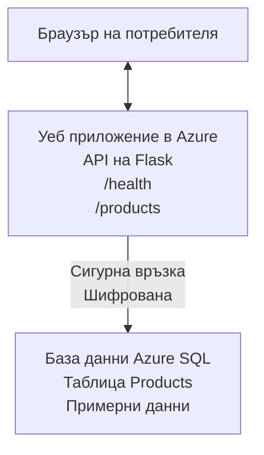

# Разгръщане на Microsoft SQL база данни и уеб приложение с AZD

⏱️ **Оценено време**: 20-30 минути | 💰 **Оценена цена**: ~$15-25/месец | ⭐ **Сложност**: Междинно

Този **пълен, работещ пример** показва как да използвате [Azure Developer CLI (azd)](https://learn.microsoft.com/azure/developer/azure-developer-cli/) за разгъване на Python Flask уеб приложение с Microsoft SQL база данни в Azure. Целият код е включен и тестван — без външни зависимости.

## Какво ще научите

Като завършите този пример, ще:
- Разгърнете многонишкова (multi-tier) архитектура (уеб приложение + база данни) чрез инфраструктура като код
- Конфигурирате защитени връзки към базата данни без вграждане на тайни в кода
- Наблюдавате състоянието на приложението с Application Insights
- Управлявате ресурсите в Azure ефективно с AZD CLI
- Следвате добри практики на Azure за сигурност, оптимизация на разходите и наблюдаемост

## Преглед на сценариото
- **Уеб приложение**: Python Flask REST API със свързване към база данни
- **База данни**: Azure SQL Database със примерни данни
- **Инфраструктура**: Провизирана с Bicep (модули, за многократна употреба)
- **Разгръщане**: Напълно автоматизирано с команди `azd`
- **Наблюдение**: Application Insights за логове и телеметрия

## Предварителни изисквания

### Задължителни инструменти

Преди да започнете, проверете дали имате инсталирани следните инструменти:

1. **[Azure CLI](https://learn.microsoft.com/cli/azure/install-azure-cli)** (версия 2.50.0 или по-нова)
   ```sh
   az --version
   # Очакван изход: azure-cli 2.50.0 или по-нова версия
   ```

2. **[Azure Developer CLI (azd)](https://learn.microsoft.com/azure/developer/azure-developer-cli/install-azd)** (версия 1.0.0 или по-нова)
   ```sh
   azd version
   # Очакван изход: azd версия 1.0.0 или по-нова
   ```

3. **[Python 3.8+](https://www.python.org/downloads/)** (за локална разработка)
   ```sh
   python --version
   # Очакван изход: Python 3.8 или по-нова
   ```

4. **[Docker](https://www.docker.com/get-started)** (по избор, за локална контейнеризирана разработка)
   ```sh
   docker --version
   # Очакван изход: Docker версия 20.10 или по-нова
   ```

### Изисквания в Azure

- Активен **абонамент за Azure** ([създайте безплатен акаунт](https://azure.microsoft.com/free/))
- Права за създаване на ресурси в абонамента ви
- Роля **Owner** или **Contributor** на абонамента или групата с ресурси

### Предварителни знания

Това е пример на **междинно ниво**. Трябва да сте запознати с:
- Основни операции в командния ред
- Основни облачни концепции (ресурси, групи ресурси)
- Основно разбиране за уеб приложения и бази данни

**Нов в AZD?** Започнете с [ръководството за започване](../../docs/chapter-01-foundation/azd-basics.md) първо.

## Архитектура

Този пример разгъва двуслойна архитектура с уеб приложение и SQL база данни:



**Разгръщане на ресурси:**
- **Resource Group**: Контейнер за всички ресурси
- **App Service Plan**: Хостинг на Linux (ниво B1 за икономия на разходи)
- **Web App**: Python 3.11 runtime с Flask приложение
- **SQL Server**: Управляем сървър за бази данни с минимум TLS 1.2
- **SQL Database**: Basic tier (2GB, подходящ за разработка/тестване)
- **Application Insights**: Мониторинг и логване
- **Log Analytics Workspace**: Централизирано съхранение на логове

**Аналогия**: Представете си това като ресторант (уеб приложението) с голям хладилен склад (базата данни). Клиентите правят поръчки от менюто (API краища), а кухнята (Flask приложението) взема съставките (данните) от хладилника. Мениджърът на ресторанта (Application Insights) следи всичко, което се случва.

## Структура на папките

Всички файлове са включени в този пример — без външни зависимости:

```
examples/database-app/
│
├── README.md                    # This file
├── azure.yaml                   # AZD configuration file
├── .env.sample                  # Sample environment variables
├── .gitignore                   # Git ignore patterns
│
├── infra/                       # Infrastructure as Code (Bicep)
│   ├── main.bicep              # Main orchestration template
│   ├── abbreviations.json      # Azure naming conventions
│   └── resources/              # Modular resource templates
│       ├── sql-server.bicep    # SQL Server configuration
│       ├── sql-database.bicep  # Database configuration
│       ├── app-service-plan.bicep  # Hosting plan
│       ├── app-insights.bicep  # Monitoring setup
│       └── web-app.bicep       # Web application
│
└── src/
    └── web/                    # Application source code
        ├── app.py              # Flask REST API
        ├── requirements.txt    # Python dependencies
        └── Dockerfile          # Container definition
```

**Какво прави всеки файл:**
- **azure.yaml**: Казва на AZD какво да разположи и къде
- **infra/main.bicep**: Оркестрация на всички Azure ресурси
- **infra/resources/*.bicep**: Индивидуални дефиниции на ресурси (модули за многократна употреба)
- **src/web/app.py**: Flask приложение с логика за базата данни
- **requirements.txt**: Python зависимости
- **Dockerfile**: Инструкции за контейнеризация за разгръщане

## Бърз старт (стъпка по стъпка)

### Стъпка 1: Клонирайте и навигирайте

```sh
git clone https://github.com/microsoft/AZD-for-beginners.git
cd AZD-for-beginners/examples/database-app
```

**✓ Проверка за успех**: Уверете се, че виждате `azure.yaml` и папката `infra/`:
```sh
ls
# Очаква се: README.md, azure.yaml, infra/, src/
```

### Стъпка 2: Аутентикация в Azure

```sh
azd auth login
```

Това отваря браузъра за автентикация в Azure. Впишете се с вашите Azure данни за достъп.

**✓ Проверка за успех**: Трябва да видите:
```
Logged in to Azure.
```

### Стъпка 3: Инициализиране на средата

```sh
azd init
```

**Какво се случва**: AZD създава локална конфигурация за вашето разгръщане.

**Подканите, които ще видите**:
- **Environment name**: Въведете кратко име (напр., `dev`, `myapp`)
- **Azure subscription**: Изберете вашия абонамент от списъка
- **Azure location**: Изберете регион (напр., `eastus`, `westeurope`)

**✓ Проверка за успех**: Трябва да видите:
```
SUCCESS: New project initialized!
```

### Стъпка 4: Провизиране на Azure ресурси

```sh
azd provision
```

**Какво се случва**: AZD разгъва цялата инфраструктура (отнема 5-8 минути):
1. Създава resource group
2. Създава SQL Server и база данни
3. Създава App Service Plan
4. Създава Web App
5. Създава Application Insights
6. Конфигурира мрежа и сигурност

**Ще бъдете подканени за**:
- **SQL admin username**: Въведете потребителско име (напр., `sqladmin`)
- **SQL admin password**: Въведете силна парола (запазете я!)

**✓ Проверка за успех**: Трябва да видите:
```
SUCCESS: Your application was provisioned in Azure in X minutes Y seconds.
You can view the resources created under the resource group rg-<env-name> in Azure Portal:
https://portal.azure.com/#@/resource/subscriptions/.../resourceGroups/rg-<env-name>
```

**⏱️ Време**: 5-8 минути

### Стъпка 5: Разгръщане на приложението

```sh
azd deploy
```

**Какво се случва**: AZD компилира и разгръща вашето Flask приложение:
1. Пакетира Python приложението
2. Изгражда Docker контейнера
3. Качва в Azure Web App
4. Инициализира базата данни с примерни данни
5. Стартира приложението

**✓ Проверка за успех**: Трябва да видите:
```
SUCCESS: Your application was deployed to Azure in X minutes Y seconds.
You can view the resources created under the resource group rg-<env-name> in Azure Portal:
https://portal.azure.com/#@/resource/subscriptions/.../resourceGroups/rg-<env-name>
```

**⏱️ Време**: 3-5 минути

### Стъпка 6: Разглеждане на приложението в браузър

```sh
azd browse
```

Това отваря вашето разгърнато уеб приложение в браузъра на `https://app-<unique-id>.azurewebsites.net`

**✓ Проверка за успех**: Трябва да видите JSON изход:
```json
{
  "message": "Welcome to the Database App API",
  "endpoints": {
    "/": "This help message",
    "/health": "Health check endpoint",
    "/products": "List all products",
    "/products/<id>": "Get product by ID"
  }
}
```

### Стъпка 7: Тестване на API краищата

**Проверка на здравето** (проверете връзката с базата данни):
```sh
curl https://app-<your-id>.azurewebsites.net/health
```

**Очакван отговор**:
```json
{
  "status": "healthy",
  "database": "connected"
}
```

**Списък с продукти** (примерни данни):
```sh
curl https://app-<your-id>.azurewebsites.net/products
```

**Очакван отговор**:
```json
[
  {
    "id": 1,
    "name": "Laptop",
    "description": "High-performance laptop",
    "price": 1299.99,
    "created_at": "2025-11-19T10:30:00"
  },
  ...
]
```

**Получаване на един продукт**:
```sh
curl https://app-<your-id>.azurewebsites.net/products/1
```

**✓ Проверка за успех**: Всички краища връщат JSON данни без грешки.

---

**🎉 Поздравления!** Успешно разгърнахте уеб приложение с база данни в Azure, използвайки AZD.

## Дълбочинен преглед на конфигурацията

### Променливи на средата

Тайните се управляват сигурно чрез конфигурацията на Azure App Service — **никога не се вграждат в изходния код**.

**Автоматично конфигурирани от AZD**:
- `SQL_CONNECTION_STRING`: Връзка към базата данни с криптирани идентификационни данни
- `APPLICATIONINSIGHTS_CONNECTION_STRING`: Крайна точка за телеметрия на мониторинга
- `SCM_DO_BUILD_DURING_DEPLOYMENT`: Позволява автоматична инсталация на зависимости по време на разгръщане

**Къде се съхраняват тайните**:
1. По време на `azd provision` въвеждате SQL идентификационни данни чрез защитени подканяния
2. AZD ги съхранява във вашия локален `.azure/<env-name>/.env` файл (игнориран от Git)
3. AZD ги инжектира в конфигурацията на Azure App Service (криптирано в покой)
4. Приложението ги чете чрез `os.getenv()` по време на изпълнение

### Локална разработка

За локално тестване, създайте `.env` файл от примерния:

```sh
cp .env.sample .env
# Редактирайте .env с локалната си връзка към базата данни
```

**Работен процес за локална разработка**:
```sh
# Инсталирайте зависимостите
cd src/web
pip install -r requirements.txt

# Задайте променливите на средата
export SQL_CONNECTION_STRING="your-local-connection-string"

# Стартирайте приложението
python app.py
```

**Тестване локално**:
```sh
curl http://localhost:8000/health
# Очаквано: {"status": "healthy", "database": "connected"}
```

### Инфраструктура като код

Всички Azure ресурси са дефинирани в **Bicep шаблони** (папка `infra/`):

- **Модулен дизайн**: Всеки тип ресурс има свой файл за многократна употреба
- **Параметризирани**: Персонализирайте SKU, региони, правила за именуване
- **Добри практики**: Следва Azure стандарти за именуване и защитни настройки по подразбиране
- **Контролирани чрез версия**: Промените в инфраструктурата се проследяват в Git

**Пример за персонализиране**:
За да промените нивото на базата данни, редактирайте `infra/resources/sql-database.bicep`:
```bicep
sku: {
  name: 'Standard'  // Changed from 'Basic'
  tier: 'Standard'
  capacity: 10
}
```

## Най-добри практики за сигурност

Този пример следва най-добрите практики за сигурност в Azure:

### 1. **Никакви тайни в изходния код**
- ✅ Идентификационните данни се съхраняват в конфигурацията на Azure App Service (криптирани)
- ✅ Файлове `.env` са изключени от Git чрез `.gitignore`
- ✅ Тайни се подават чрез защитени параметри по време на провизиране

### 2. **Криптирани връзки**
- ✅ Минимум TLS 1.2 за SQL Server
- ✅ Изискване за използване само на HTTPS за Web App
- ✅ Връзките към базата данни използват криптирани канали

### 3. **Мрежова сигурност**
- ✅ Файъруолът на SQL Server е конфигуриран да позволява само услуги на Azure
- ✅ Достъпът от публична мрежа е ограничен (може да се усили чрез Private Endpoints)
- ✅ FTPS е деактивиран на Web App

### 4. **Автентикация и авторизация**
- ⚠️ **Текущо**: SQL автентикация (потребител/парола)
- ✅ **Препоръка за продукция**: Използвайте Azure Managed Identity за автентикация без пароли

**За надграждане до Managed Identity** (за продукция):
1. Разрешете managed identity на Web App
2. Дайте на идентичността права върху SQL
3. Актуализирайте connection string да използва managed identity
4. Премахнете автентикацията с парола

### 5. **Одит и съответствие**
- ✅ Application Insights логва всички заявки и грешки
- ✅ Одитът на SQL Database е разрешен (може да се конфигурира за съответствие)
- ✅ Всички ресурси са тагнати за управление

**Контролен списък за сигурност преди продукция**:
- [ ] Разрешете Azure Defender за SQL
- [ ] Конфигурирайте Private Endpoints за SQL Database
- [ ] Разрешете Web Application Firewall (WAF)
- [ ] Имплементирайте Azure Key Vault за въртене на тайни
- [ ] Конфигурирайте Microsoft Entra ID автентикация
- [ ] Разрешете диагностично логване за всички ресурси

## Оптимизация на разходите

**Оценени месечни разходи** (към ноември 2025):

| Resource | SKU/Tier | Estimated Cost |
|----------|----------|----------------|
| App Service Plan | B1 (Basic) | ~$13/month |
| SQL Database | Basic (2GB) | ~$5/month |
| Application Insights | Pay-as-you-go | ~$2/month (low traffic) |
| **Total** | | **~$20/month** |

**💡 Съвети за пестене на разходи**:

1. **Използвайте безплатни нива за учене**:
   - App Service: F1 tier (безплатно, с ограничени часове)
   - SQL Database: Използвайте Azure SQL Database serverless
   - Application Insights: 5GB/месец безплатен прием

2. **Спирайте ресурсите, когато не се използват**:
   ```sh
   # Спрете уеб приложението (базата данни все още начислява такси)
   az webapp stop --name <app-name> --resource-group <rg-name>
   
   # Рестартирайте при нужда
   az webapp start --name <app-name> --resource-group <rg-name>
   ```

3. **Изтрийте всичко след тестване**:
   ```sh
   azd down
   ```
   Това премахва ВСИЧКИ ресурси и спира таксуването.

4. **SKU за разработка vs. продукция**:
   - **Разработка**: Basic tier (използван в този пример)
   - **Продукция**: Standard/Premium tier с излишък/редундантност

**Мониторинг на разходите**:
- Преглеждайте разходите в [Azure Cost Management](https://portal.azure.com/#view/Microsoft_Azure_CostManagement)
- Настройте аларми за разходи, за да избегнете изненади
- Тагвайте всички ресурси с `azd-env-name` за проследяване

**Алтернатива с безплатно ниво**:
За учебни цели можете да промените `infra/resources/app-service-plan.bicep`:
```bicep
sku: {
  name: 'F1'  // Free tier
  tier: 'Free'
}
```
**Забележка**: Безплатното ниво има ограничения (60 мин/ден CPU, без always-on).

## Наблюдение и наблюдаемост

### Интеграция с Application Insights

Този пример включва **Application Insights** за пълен мониторинг:

**Какво се наблюдава**:
- ✅ HTTP заявки (латентност, статус кодове, краища)
- ✅ Грешки и изключения в приложението
- ✅ Потребителски логове от Flask приложението
- ✅ Състояние на връзката с базата данни
- ✅ Метрики за производителност (CPU, памет)

**Достъп до Application Insights**:
1. Отворете [Azure Portal](https://portal.azure.com)
2. Навигирайте до вашата resource group (`rg-<env-name>`)
3. Кликнете на Application Insights ресурса (`appi-<unique-id>`)

Полезни заявки (Application Insights → Logs):

**Преглед на всички заявки**:
```kusto
requests
| where timestamp > ago(1h)
| order by timestamp desc
| project timestamp, name, url, resultCode, duration
```

**Намиране на грешки**:
```kusto
exceptions
| where timestamp > ago(24h)
| order by timestamp desc
| project timestamp, type, outerMessage, operation_Name
```

**Проверка на health endpoint**:
```kusto
requests
| where name contains "health"
| summarize count() by resultCode, bin(timestamp, 1h)
```

### Одит на SQL Database

**Одитът на SQL Database е разрешен** за проследяване на:
- Достъп до базата данни
- Неуспешни опити за влизане
- Промени в схемата
- Достъп до данни (за съответствие)

**Достъп до одит логовете**:
1. Azure Portal → SQL Database → Auditing
2. Преглед на логове в Log Analytics workspace

### Наблюдение в реално време

**Преглед на Live Metrics**:
1. Application Insights → Live Metrics
2. Вижте заявки, грешки и производителност в реално време

**Настройване на аларми**:
Създайте аларми за критични събития:
- HTTP 500 грешки > 5 в 5 минути
- Провали в свързването с базата данни
- Високи времена за отговор (>2 секунди)

**Пример за създаване на аларма**:
```sh
az monitor metrics alert create \
  --name "High-Response-Time" \
  --resource-group <rg-name> \
  --scopes <app-insights-resource-id> \
  --condition "avg requests/duration > 2000" \
  --description "Alert when response time exceeds 2 seconds"
```

## Отстраняване на проблеми
### Чести проблеми и решения

#### 1. `azd provision` fails with "Location not available"

**Симптом**:
```
Error: The subscription is not registered for the resource type 'components' in the location 'centralus'.
```

**Решение**:
Изберете друг регион на Azure или регистрирайте доставчика на ресурси:
```sh
az provider register --namespace Microsoft.Insights
```

#### 2. Неуспешна връзка към SQL по време на внедряване

**Симптом**:
```
pyodbc.OperationalError: ('08001', '[08001] [Microsoft][ODBC Driver 18 for SQL Server]TCP Provider...')
```

**Решение**:
- Уверете се, че защитната стена на SQL Server позволява услугите на Azure (конфигурирано автоматично)
- Проверете дали администраторската парола за SQL е въведена правилно по време на `azd provision`
- Уверете се, че SQL Server е напълно предоставен (може да отнеме 2-3 минути)

**Проверка на връзката**:
```sh
# От портала на Azure отидете в SQL база данни → Редактор на заявки
# Опитайте да се свържете с вашите идентификационни данни
```

#### 3. Уеб приложението показва "Application Error"

**Симптом**:
Браузърът показва обща страница за грешка.

**Решение**:
Проверете логовете на приложението:
```sh
# Преглед на последните логове
az webapp log tail --name <app-name> --resource-group <rg-name>
```

**Чести причини**:
- Липсващи променливи на средата (проверете App Service → Configuration)
- Инсталирането на Python пакети е неуспешно (проверете логовете на внедряването)
- Грешка при инициализация на базата данни (проверете свързаността с SQL)

#### 4. `azd deploy` Fails with "Build Error"

**Симптом**:
```
Error: Failed to build project
```

**Решение**:
- Уверете се, че `requirements.txt` няма синтактични грешки
- Проверете, че Python 3.11 е посочен в `infra/resources/web-app.bicep`
- Потвърдете, че Dockerfile има правилния базов образ

**Отстраняване на грешки локално**:
```sh
cd src/web
docker build -t test-app .
docker run -p 8000:8000 test-app
```

#### 5. "Unauthorized" When Running AZD Commands

**Симптом**:
```
ERROR: (Unauthorized) The client '<id>' with object id '<id>' does not have authorization
```

**Решение**:
Влезте отново в Azure:
```sh
# Необходимо за работни потоци на AZD
azd auth login

# По избор, ако също така използвате командите на Azure CLI директно
az login
```

Проверете, че имате правилните разрешения (роля Contributor) върху абонамента.

#### 6. Високи разходи за базата данни

**Симптом**:
Неочаквана фактура от Azure.

**Решение**:
- Проверете дали не сте забравили да изпълните `azd down` след тестовете
- Уверете се, че SQL Database използва Basic tier (не Premium)
- Прегледайте разходите в Azure Cost Management
- Настройте предупреждения за разходи

### Получаване на помощ

**Преглед на всички променливи на средата за AZD**:
```sh
azd env get-values
```

**Проверка на статуса на внедряването**:
```sh
az webapp show --name <app-name> --resource-group <rg-name> --query state
```

**Достъп до логовете на приложението**:
```sh
az webapp log download --name <app-name> --resource-group <rg-name> --log-file app-logs.zip
```

**Нуждаете се от повече помощ?**
- [Ръководство за отстраняване на проблеми с AZD](../../docs/chapter-07-troubleshooting/common-issues.md)
- [Отстраняване на проблеми на Azure App Service](https://learn.microsoft.com/azure/app-service/troubleshoot-diagnostic-logs)
- [Отстраняване на проблеми с Azure SQL](https://learn.microsoft.com/azure/azure-sql/database/troubleshoot-common-errors-issues)

## Практически упражнения

### Упражнение 1: Проверете вашето внедряване (Начинаещи)

**Цел**: Потвърдете, че всички ресурси са внедрени и приложението работи.

**Стъпки**:
1. Избройте всички ресурси в вашата ресурсна група:
   ```sh
   az resource list --resource-group rg-<env-name> --output table
   ```
   **Очаквано**: 6-7 resources (Web App, SQL Server, SQL Database, App Service Plan, Application Insights, Log Analytics)

2. Тествайте всички API крайни точки:
   ```sh
   curl https://app-<your-id>.azurewebsites.net/
   curl https://app-<your-id>.azurewebsites.net/health
   curl https://app-<your-id>.azurewebsites.net/products
   curl https://app-<your-id>.azurewebsites.net/products/1
   ```
   **Очаквано**: Всички връщат валиден JSON без грешки

3. Проверете Application Insights:
   - Навигирайте до Application Insights в Azure Portal
   - Отидете на "Live Metrics"
   - Презаредете страницата на уеб приложението в браузъра си
   **Очаквано**: Да видите заявки, появяващи се в реално време

**Критерии за успех**: Всички 6-7 ресурса съществуват, всички крайни точки връщат данни, Live Metrics показва активност.

---

### Упражнение 2: Добавете нов API крайна точка (Средно)

**Цел**: Разширете Flask приложението с нова крайна точка.

**Начален код**: Текущи крайни точки в `src/web/app.py`

**Стъпки**:
1. Редактирайте `src/web/app.py` и добавете нова крайна точка след функцията `get_product()`:
   ```python
   @app.route('/products/search/<keyword>')
   def search_products(keyword):
       """Search products by name or description."""
       try:
           conn = get_db_connection()
           cursor = conn.cursor()
           cursor.execute(
               "SELECT id, name, description, price, created_at FROM products WHERE name LIKE ? OR description LIKE ?",
               (f'%{keyword}%', f'%{keyword}%')
           )
           
           products = []
           for row in cursor.fetchall():
               products.append({
                   'id': row[0],
                   'name': row[1],
                   'description': row[2],
                   'price': float(row[3]) if row[3] else None,
                   'created_at': row[4].isoformat() if row[4] else None
               })
           
           cursor.close()
           conn.close()
           
           logger.info(f"Search for '{keyword}' returned {len(products)} results")
           return jsonify(products), 200
           
       except Exception as e:
           logger.error(f"Error searching products: {str(e)}")
           return jsonify({'error': str(e)}), 500
   ```

2. Внедрете актуализираното приложение:
   ```sh
   azd deploy
   ```

3. Тествайте новата крайна точка:
   ```sh
   curl https://app-<your-id>.azurewebsites.net/products/search/laptop
   ```
   **Очаквано**: Връща продукти, съответстващи на "laptop"

**Критерии за успех**: Новата крайна точка работи, връща филтрирани резултати, появява се в логовете на Application Insights.

---

### Упражнение 3: Добавяне на мониторинг и предупреждения (Напреднали)

**Цел**: Настройте проактивен мониторинг с предупреждения.

**Стъпки**:
1. Създайте правило за предупреждение за HTTP 500 грешки:
   ```sh
   # Вземете идентификатора на ресурса Application Insights
   AI_ID=$(az monitor app-insights component show \
     --app appi-<your-id> \
     --resource-group rg-<env-name> \
     --query id -o tsv)
   
   # Създайте предупреждение
   az monitor metrics alert create \
     --name "High-Error-Rate" \
     --resource-group rg-<env-name> \
     --scopes $AI_ID \
     --condition "count requests/failed > 5" \
     --window-size 5m \
     --evaluation-frequency 1m \
     --description "Alert when >5 failed requests in 5 minutes"
   ```

2. Задействайте предупреждението, като предизвикате грешки:
   ```sh
   # Заявка за несъществуващ продукт
   for i in {1..10}; do curl https://app-<your-id>.azurewebsites.net/products/999; done
   ```

3. Проверете дали предупреждението е задействано:
   - Azure Portal → Alerts → Alert Rules
   - Проверете имейла си (ако е конфигуриран)

**Критерии за успех**: Правило за предупреждение е създадено, задейства се при грешки, получават се известия.

---

### Упражнение 4: Промени в схемата на базата данни (Напреднали)

**Цел**: Добавете нова таблица и модифицирайте приложението да я използва.

**Стъпки**:
1. Свържете се с SQL Database чрез Query Editor в Azure Portal

2. Създайте нова таблица `categories`:
   ```sql
   CREATE TABLE categories (
       id INT PRIMARY KEY IDENTITY(1,1),
       name NVARCHAR(50) NOT NULL,
       description NVARCHAR(200)
   );
   
   INSERT INTO categories (name, description) VALUES
   ('Electronics', 'Electronic devices and accessories'),
   ('Office Supplies', 'Office equipment and supplies');
   
   -- Add category to products table
   ALTER TABLE products ADD category_id INT;
   UPDATE products SET category_id = 1; -- Set all to Electronics
   ```

3. Актуализирайте `src/web/app.py`, за да включва информация за категорията в отговорите

4. Внедрете и тествайте

**Критерии за успех**: Новата таблица съществува, продуктите показват информация за категорията, приложението все още работи.

---

### Упражнение 5: Реализиране на кеширане (Експерт)

**Цел**: Добавете Azure Redis Cache за подобряване на производителността.

**Стъпки**:
1. Добавете Redis Cache в `infra/main.bicep`
2. Актуализирайте `src/web/app.py`, за да кешира заявките за продукти
3. Измерете подобрението в производителността с Application Insights
4. Сравнете времето за отговор преди/след кеширането

**Критерии за успех**: Redis е внедрен, кеширането работи, времето за отговор се подобрява с над 50%.

**Подсказка**: Започнете с [Azure Cache for Redis документацията](https://learn.microsoft.com/azure/azure-cache-for-redis/).

---

## Почистване

За да избегнете продължителни такси, изтрийте всички ресурси след приключване:

```sh
azd down
```

**Подканване за потвърждение**:
```
? Total resources to delete: 7, are you sure you want to continue? (y/N)
```

Напишете `y`, за да потвърдите.

**✓ Проверка за успех**: 
- Всички ресурси са изтрити от Azure Portal
- Няма продължаващи такси
- Местната папка `.azure/<env-name>` може да бъде изтрита

**Алтернатива** (запазете инфраструктурата, изтрийте данните):
```sh
# Изтрийте само групата с ресурси (запазете конфигурацията на AZD)
az group delete --name rg-<env-name> --yes
```
## Научете повече

### Свързана документация
- [Документация за Azure Developer CLI](https://learn.microsoft.com/azure/developer/azure-developer-cli/)
- [Документация за Azure SQL Database](https://learn.microsoft.com/azure/azure-sql/database/)
- [Документация за Azure App Service](https://learn.microsoft.com/azure/app-service/)
- [Документация за Application Insights](https://learn.microsoft.com/azure/azure-monitor/app/app-insights-overview)
- [Референция на езика Bicep](https://learn.microsoft.com/azure/azure-resource-manager/bicep/)

### Следващи стъпки в този курс
- **[Пример с Container Apps](../../../../examples/container-app)**: Разгръщане на микросервиси с Azure Container Apps
- **[Ръководство за интеграция с AI](../../../../docs/ai-foundry)**: Добавете AI възможности към приложението си
- **[Добри практики за внедряване](../../docs/chapter-04-infrastructure/deployment-guide.md)**: Модели за продукционно внедряване

### Разширени теми
- **Managed Identity**: Премахнете паролите и използвайте удостоверяване с Microsoft Entra ID
- **Private Endpoints**: Защитете връзките към базата данни в рамките на виртуална мрежа
- **CI/CD Integration**: Автоматизирайте внедряванията с GitHub Actions или Azure DevOps
- **Multi-Environment**: Настройте dev, staging и production среди
- **Database Migrations**: Използвайте Alembic или Entity Framework за версиониране на схемата

### Сравнение с други подходи

**AZD vs. ARM шаблони**:
- ✅ AZD: По-високо ниво на абстракция, по-прости команди
- ⚠️ ARM: По-обемни, дава по-фино ниво на контрол

**AZD vs. Terraform**:
- ✅ AZD: Нативен за Azure, интегриран с услугите на Azure
- ⚠️ Terraform: Поддържа много облаци, по-широка екосистема

**AZD vs. Azure портал**:
- ✅ AZD: Повторяем, контролирано с версии, автоматизиран
- ⚠️ Portal: Ръчно кликване, трудно за възпроизвеждане

**Мислете за AZD като**: Docker Compose за Azure—опростена конфигурация за сложни внедрявания.

---

## Често задавани въпроси

**В: Мога ли да използвам различен програмен език?**  
О: Да! Заменете `src/web/` с Node.js, C#, Go или какъвто и да е език. Актуализирайте `azure.yaml` и Bicep съответно.

**В: Как да добавя още бази данни?**  
О: Добавете още модул за SQL Database в `infra/main.bicep` или използвайте PostgreSQL/MySQL от услугите на Azure Database.

**В: Мога ли да използвам това в продукция?**  
О: Това е отправна точка. За продукция добавете: managed identity, private endpoints, redundancy, backup strategy, WAF и разширен мониторинг.

**В: Какво ако искам да използвам контейнери вместо внедряване на код?**  
О: Вижте [Пример с Container Apps](../../../../examples/container-app), който използва Docker контейнери навсякъде.

**В: Как да се свържа с базата данни от моя локален компютър?**  
О: Добавете вашия IP към защитната стена на SQL Server:
```sh
az sql server firewall-rule create \
  --resource-group rg-<env-name> \
  --server sql-<unique-id> \
  --name AllowMyIP \
  --start-ip-address <your-ip> \
  --end-ip-address <your-ip>
```

**В: Мога ли да използвам съществуваща база данни вместо да създавам нова?**  
О: Да, модифицирайте `infra/main.bicep`, за да препратите към съществуващ SQL Server и актуализирайте параметрите на низа за връзка.

---

> **Бележка:** Този пример демонстрира най-добри практики за внедряване на уеб приложение с база данни, използвайки AZD. Включва работещ код, изчерпателна документация и практически упражнения за затвърждаване на знанията. За продукционни внедрявания прегледайте изискванията за сигурност, мащабиране, съответствие и разходи, специфични за вашата организация.

**📚 Навигация в курса:**
- ← Предишна: [Пример с Container Apps](../../../../examples/container-app)
- → Следваща: [Ръководство за интеграция с AI](../../../../docs/ai-foundry)
- 🏠 [Начало на курса](../../README.md)

---

<!-- CO-OP TRANSLATOR DISCLAIMER START -->
**Отказ от отговорност**:
Този документ е преведен с помощта на AI преводачески услуга [Co-op Translator](https://github.com/Azure/co-op-translator). Въпреки че се стремим към точност, моля имайте предвид, че автоматизираните преводи могат да съдържат грешки или неточности. Оригиналният документ на неговия роден език трябва да се счита за авторитетен източник. За критична информация се препоръчва професионален човешки превод. Ние не носим отговорност за каквито и да е недоразумения или неправилни тълкувания, произтичащи от използването на този превод.
<!-- CO-OP TRANSLATOR DISCLAIMER END -->