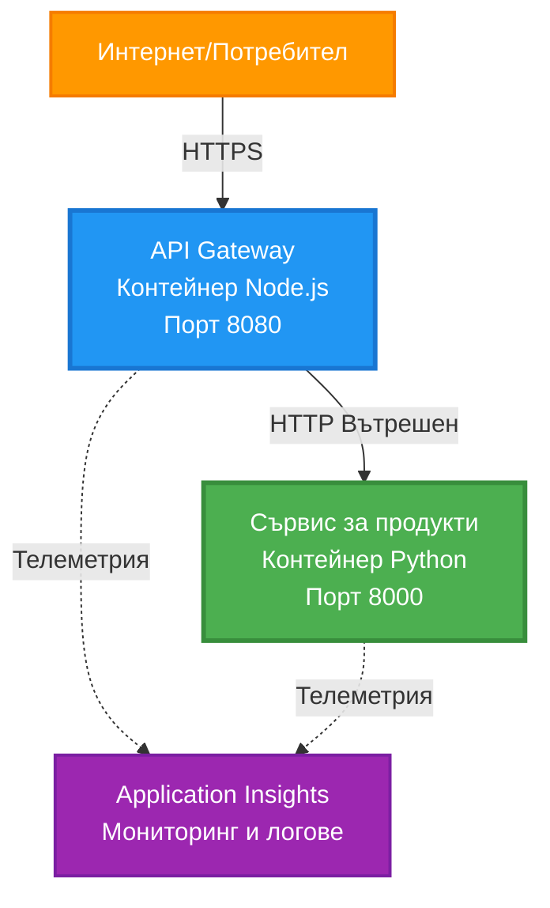
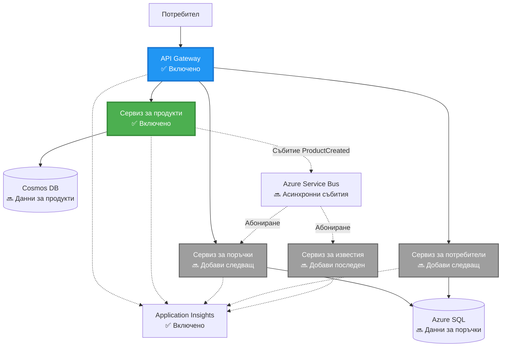
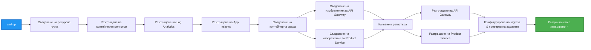
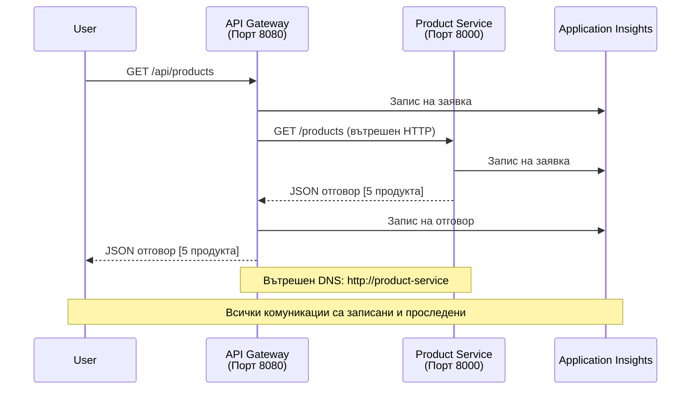

<!--
CO_OP_TRANSLATOR_METADATA:
{
  "original_hash": "eb3a4803a1e80a7f2e64f6bf63738c0f",
  "translation_date": "2025-11-23T19:39:58+00:00",
  "source_file": "examples/microservices/README.md",
  "language_code": "bg"
}
-->
# Архитектура на микросервиси - Пример за контейнерно приложение

⏱️ **Прогнозно време**: 25-35 минути | 💰 **Прогнозна цена**: ~$50-100/месец | ⭐ **Сложност**: Напреднало

**📚 Учебен път:**
- ← Предишно: [Прост Flask API](../../../../examples/container-app/simple-flask-api) - Основи на единичен контейнер
- 🎯 **Тук сте**: Архитектура на микросервиси (основа с 2 услуги)
- → Следващо: [Интеграция на AI](../../../../docs/ai-foundry) - Добавяне на интелигентност към вашите услуги
- 🏠 [Начало на курса](../../README.md)

---

**Опростена, но функционална** архитектура на микросервиси, разположена в Azure Container Apps с помощта на AZD CLI. Този пример демонстрира комуникация между услуги, оркестрация на контейнери и мониторинг с практическа настройка от 2 услуги.

> **📚 Подход за учене**: Този пример започва с минимална архитектура от 2 услуги (API Gateway + Backend Service), която можете реално да разположите и да научите. След като овладеете тази основа, предоставяме насоки за разширяване към пълна екосистема от микросервиси.

## Какво ще научите

След завършване на този пример, ще:
- Разположите множество контейнери в Azure Container Apps
- Реализирате комуникация между услуги с вътрешна мрежа
- Конфигурирате мащабиране и проверки за здраве, базирани на средата
- Мониторирате разпределени приложения с Application Insights
- Разберете модели за разполагане на микросервиси и най-добри практики
- Научите прогресивно разширяване от прости към сложни архитектури

## Архитектура

### Фаза 1: Какво изграждаме (включено в този пример)


**Детайли за компонентите:**

| Компонент | Цел | Достъп | Ресурси |
|-----------|-----|--------|---------|
| **API Gateway** | Пренасочва външни заявки към бекенд услуги | Публичен (HTTPS) | 1 vCPU, 2GB RAM, 2-20 реплики |
| **Product Service** | Управлява продуктов каталог с данни в паметта | Само вътрешен | 0.5 vCPU, 1GB RAM, 1-10 реплики |
| **Application Insights** | Централизирано логване и разпределено проследяване | Azure Portal | 1-2 GB/месец за поглъщане на данни |

**Защо да започнем просто?**
- ✅ Бързо разполагане и разбиране (25-35 минути)
- ✅ Научаване на основни модели на микросервиси без сложност
- ✅ Работещ код, който можете да модифицирате и експериментирате
- ✅ По-ниска цена за учене (~$50-100/месец срещу $300-1400/месец)
- ✅ Изграждане на увереност преди добавяне на бази данни и опашки за съобщения

**Аналогия**: Представете си, че учите да шофирате. Започвате с празен паркинг (2 услуги), овладявате основите, след което преминавате към градски трафик (5+ услуги с бази данни).

### Фаза 2: Бъдещо разширение (Референтна архитектура)

След като овладеете архитектурата с 2 услуги, можете да разширите към:


Вижте секцията "Ръководство за разширение" в края за инструкции стъпка по стъпка.

## Включени функции

✅ **Откриване на услуги**: Автоматично откриване на базата на DNS между контейнери  
✅ **Баланс на натоварването**: Вграден баланс на натоварването между реплики  
✅ **Автоматично мащабиране**: Независимо мащабиране на услуга, базирано на HTTP заявки  
✅ **Мониторинг на здравето**: Проверки за живост и готовност за двете услуги  
✅ **Разпределено логване**: Централизирано логване с Application Insights  
✅ **Вътрешна мрежа**: Сигурна комуникация между услуги  
✅ **Оркестрация на контейнери**: Автоматично разполагане и мащабиране  
✅ **Актуализации без прекъсване**: Постепенни актуализации с управление на ревизии  

## Предварителни изисквания

### Необходими инструменти

Преди да започнете, уверете се, че имате инсталирани следните инструменти:

1. **[Azure Developer CLI (azd)](https://learn.microsoft.com/azure/developer/azure-developer-cli/install-azd)** (версия 1.0.0 или по-нова)
   ```bash
   azd version
   # Очакван резултат: версия azd 1.0.0 или по-висока
   ```

2. **[Azure CLI](https://learn.microsoft.com/cli/azure/install-azure-cli)** (версия 2.50.0 или по-нова)
   ```bash
   az --version
   # Очакван резултат: azure-cli 2.50.0 или по-висока
   ```

3. **[Docker](https://www.docker.com/get-started)** (за локално разработване/тестване - по избор)
   ```bash
   docker --version
   # Очакван резултат: Docker версия 20.10 или по-висока
   ```

### Проверка на настройката

Изпълнете тези команди, за да потвърдите готовността си:

```bash
# Проверете Azure Developer CLI
azd version
# ✅ Очаквано: azd версия 1.0.0 или по-нова

# Проверете Azure CLI
az --version
# ✅ Очаквано: azure-cli 2.50.0 или по-нова

# Проверете Docker (по избор)
docker --version
# ✅ Очаквано: Docker версия 20.10 или по-нова
```

**Критерий за успех**: Всички команди връщат версии, които съответстват или надвишават минималните.

### Изисквания за Azure

- Активен **Azure абонамент** ([създайте безплатен акаунт](https://azure.microsoft.com/free/))
- Разрешения за създаване на ресурси във вашия абонамент
- **Роля на сътрудник** в абонамента или групата ресурси

### Предварителни знания

Това е пример на **напреднало ниво**. Трябва да имате:
- Завършен пример [Прост Flask API](../../../../examples/container-app/simple-flask-api) 
- Основно разбиране на архитектурата на микросервиси
- Познания за REST API и HTTP
- Разбиране на концепции за контейнери

**Нов в Container Apps?** Започнете с примера [Прост Flask API](../../../../examples/container-app/simple-flask-api), за да научите основите.

## Бърз старт (Стъпка по стъпка)

### Стъпка 1: Клониране и навигация

```bash
git clone https://github.com/microsoft/AZD-for-beginners.git
cd AZD-for-beginners/examples/microservices
```

**✓ Проверка за успех**: Уверете се, че виждате `azure.yaml`:
```bash
ls
# Очаквано: README.md, azure.yaml, infra/, src/
```

### Стъпка 2: Автентикация с Azure

```bash
azd auth login
```

Това отваря вашия браузър за автентикация в Azure. Влезте с вашите Azure идентификационни данни.

**✓ Проверка за успех**: Трябва да видите:
```
Logged in to Azure.
```

### Стъпка 3: Инициализиране на средата

```bash
azd init
```

**Подканвания, които ще видите**:
- **Име на средата**: Въведете кратко име (например `microservices-dev`)
- **Azure абонамент**: Изберете вашия абонамент
- **Azure местоположение**: Изберете регион (например `eastus`, `westeurope`)

**✓ Проверка за успех**: Трябва да видите:
```
SUCCESS: New project initialized!
```

### Стъпка 4: Разполагане на инфраструктура и услуги

```bash
azd up
```

**Какво се случва** (отнема 8-12 минути):


**✓ Проверка за успех**: Трябва да видите:
```
SUCCESS: Your application was deployed to Azure in X minutes Y seconds.
Endpoint: https://api-gateway-<unique-id>.azurecontainerapps.io
```

**⏱️ Време**: 8-12 минути

### Стъпка 5: Тестване на разполагането

```bash
# Вземете крайна точка на шлюза
GATEWAY_URL=$(azd env get-values | grep API_GATEWAY_URL | cut -d '=' -f2 | tr -d '"')

# Тествайте здравето на API шлюза
curl $GATEWAY_URL/health
```

**✅ Очакван резултат:**
```json
{
  "status": "healthy",
  "service": "api-gateway",
  "timestamp": "2025-11-19T10:30:00Z"
}
```

**Тест на продуктовата услуга през шлюза**:
```bash
# Списък с продукти
curl $GATEWAY_URL/api/products
```

**✅ Очакван резултат:**
```json
[
  {"id":1,"name":"Laptop","price":999.99,"stock":50},
  {"id":2,"name":"Mouse","price":29.99,"stock":200},
  {"id":3,"name":"Keyboard","price":79.99,"stock":150}
]
```

**✓ Проверка за успех**: И двата крайни точки връщат JSON данни без грешки.

---

**🎉 Поздравления!** Разположихте архитектура на микросервиси в Azure!

## Структура на проекта

Всички файлове за имплементация са включени—това е пълен, работещ пример:

```
microservices/
│
├── README.md                         # This file
├── azure.yaml                        # AZD configuration
├── .gitignore                        # Git ignore patterns
│
├── infra/                           # Infrastructure as Code (Bicep)
│   ├── main.bicep                   # Main orchestration
│   ├── abbreviations.json           # Naming conventions
│   ├── core/                        # Shared infrastructure
│   │   ├── container-apps-environment.bicep  # Container environment + registry
│   │   └── monitor.bicep            # Application Insights + Log Analytics
│   └── app/                         # Service definitions
│       ├── api-gateway.bicep        # API Gateway container app
│       └── product-service.bicep    # Product Service container app
│
└── src/                             # Application source code
    ├── api-gateway/                 # Node.js API Gateway
    │   ├── app.js                   # Express server with routing
    │   ├── package.json             # Node dependencies
    │   └── Dockerfile               # Container definition
    └── product-service/             # Python Product Service
        ├── main.py                  # Flask API with product data
        ├── requirements.txt         # Python dependencies
        └── Dockerfile               # Container definition
```

**Какво прави всеки компонент:**

**Инфраструктура (infra/)**:
- `main.bicep`: Оркестрира всички Azure ресурси и техните зависимости
- `core/container-apps-environment.bicep`: Създава средата за Container Apps и Azure Container Registry
- `core/monitor.bicep`: Настройва Application Insights за разпределено логване
- `app/*.bicep`: Индивидуални дефиниции на контейнерни приложения с мащабиране и проверки за здраве

**API Gateway (src/api-gateway/)**:
- Услуга с публичен достъп, която пренасочва заявки към бекенд услуги
- Имплементира логване, обработка на грешки и пренасочване на заявки
- Демонстрира HTTP комуникация между услуги

**Product Service (src/product-service/)**:
- Вътрешна услуга с продуктов каталог (в паметта за простота)
- REST API с проверки за здраве
- Пример за модел на бекенд микросервиси

## Преглед на услугите

### API Gateway (Node.js/Express)

**Порт**: 8080  
**Достъп**: Публичен (външен вход)  
**Цел**: Пренасочва входящи заявки към подходящи бекенд услуги  

**Крайни точки**:
- `GET /` - Информация за услугата
- `GET /health` - Крайна точка за проверка на здраве
- `GET /api/products` - Пренасочване към продуктова услуга (списък на всички)
- `GET /api/products/:id` - Пренасочване към продуктова услуга (получаване по ID)

**Основни функции**:
- Пренасочване на заявки с axios
- Централизирано логване
- Обработка на грешки и управление на таймаут
- Откриване на услуги чрез променливи на средата
- Интеграция с Application Insights

**Акцент в кода** (`src/api-gateway/app.js`):
```javascript
// Вътрешна комуникация на услугата
app.get('/api/products', async (req, res) => {
  const response = await axios.get(`${PRODUCT_SERVICE_URL}/products`, {
    timeout: 5000
  });
  res.json(response.data);
});
```

### Product Service (Python/Flask)

**Порт**: 8000  
**Достъп**: Само вътрешен (без външен вход)  
**Цел**: Управлява продуктов каталог с данни в паметта  

**Крайни точки**:
- `GET /` - Информация за услугата
- `GET /health` - Крайна точка за проверка на здраве
- `GET /products` - Списък на всички продукти
- `GET /products/<id>` - Получаване на продукт по ID

**Основни функции**:
- RESTful API с Flask
- Продуктов магазин в паметта (прост, без нужда от база данни)
- Мониторинг на здравето с проверки
- Структурирано логване
- Интеграция с Application Insights

**Модел на данни**:
```python
{
  "id": 1,
  "name": "Laptop",
  "description": "High-performance laptop",
  "price": 999.99,
  "stock": 50
}
```

**Защо само вътрешен достъп?**
Продуктовата услуга не е публично изложена. Всички заявки трябва да преминават през API Gateway, който предоставя:
- Сигурност: Контролиран достъп
- Гъвкавост: Може да промените бекенда без да засягате клиентите
- Мониторинг: Централизирано логване на заявки

## Разбиране на комуникацията между услуги

### Как услугите комуникират помежду си


В този пример API Gateway комуникира с Product Service чрез **вътрешни HTTP повиквания**:

```javascript
// API Gateway (src/api-gateway/app.js)
const PRODUCT_SERVICE_URL = process.env.PRODUCT_SERVICE_URL;

// Направете вътрешна HTTP заявка
const response = await axios.get(`${PRODUCT_SERVICE_URL}/products`);
```

**Основни точки**:

1. **Откриване на базата на DNS**: Container Apps автоматично предоставя DNS за вътрешни услуги
   - FQDN на продуктова услуга: `product-service.internal.<environment>.azurecontainerapps.io`
   - Опростено като: `http://product-service` (Container Apps го разрешава)

2. **Без публично излагане**: Продуктовата услуга има `external: false` в Bicep
   - Достъпна само в средата на Container Apps
   - Не може да бъде достигната от интернет

3. **Променливи на средата**: URL адресите на услугите се инжектират по време на разполагане
   - Bicep предава вътрешния FQDN към шлюза
   - Няма твърдо кодирани URL адреси в приложния код

**Аналогия**: Представете си това като офис стаи. API Gateway е рецепцията (с достъп отвън), а Product Service е офис стая (само вътрешен достъп). Посетителите трябва да преминат през рецепцията, за да достигнат до която и да е стая.

## Опции за разполагане

### Пълно разполагане (Препоръчително)

```bash
# Разгърнете инфраструктурата и двата услуги
azd up
```

Това разполага:
1. Среда за Container Apps
2. Application Insights
3. Container Registry
4. Контейнер за API Gateway
5. Контейнер за Product Service

**Време**: 8-12 минути

### Разполагане на индивидуална услуга

```bash
# Разгърнете само една услуга (след първоначалното azd up)
azd deploy api-gateway

# Или разгърнете услугата за продукти
azd deploy product-service
```

**Случай на употреба**: Когато сте актуализирали кода в една услуга и искате да разположите само тази услуга.

### Актуализиране на конфигурация

```bash
# Променете параметрите за мащабиране
azd env set GATEWAY_MAX_REPLICAS 30

# Преинсталирайте с нова конфигурация
azd up
```

## Конфигурация

### Конфигурация за мащабиране

И двете услуги са конфигурирани с автоматично мащабиране, базирано на HTTP в техните Bicep файлове:

**API Gateway**:
- Минимални реплики: 2 (винаги поне 2 за наличност)
- Максимални реплики: 20
- Тригер за мащабиране: 50 едновременни заявки на реплика

**Product Service**:
- Минимални реплики: 1 (може да се мащабира до нула, ако е необходимо)
- Максимални реплики: 10
- Тригер за мащабиране: 100 едновременни заявки на реплика

**Персонализиране на мащабирането** (в `infra/app/*.bicep`):
```bicep
scale: {
  minReplicas: 1
  maxReplicas: 10
  rules: [
    {
      name: 'http-scale-rule'
      http: {
        metadata: {
          concurrentRequests: '100'  // Adjust this
        }
      }
    }
  ]
}
```

### Разпределение на ресурси

**API Gateway**:
- CPU: 1.0 vCPU
- Памет: 2 GiB
- Причина: Обработва целия външен трафик

**Product Service**:
- CPU: 0.5 vCPU
- Памет: 1 GiB
- Причина: Леки операции в паметта

### Проверки за здраве

И двете услуги включват проверки за живост и готовност:

```bicep
probes: [
  {
    type: 'Liveness'
    httpGet: {
      path: '/health'
      port: 8080
    }
    initialDelaySeconds: 10
    periodSeconds: 30
  }
  {
    type: 'Readiness'
    httpGet: {
      path: '/health'
      port: 8080
    }
    initialDelaySeconds: 5
    periodSeconds: 10
  }
]
```

**Какво означава това**:
- **Живост**: Ако проверката за здраве се провали, Container Apps рестартира контейнера
- **Готовност**: Ако не е готов, Container Apps спира маршрутизирането на трафик към тази реплика

## Мониторинг и наблюдение

### Преглед на логовете на услугите

```bash
# Поток журнали от API Gateway
azd logs api-gateway --follow

# Преглед на последните журнали на услугата за продукти
azd logs product-service --tail 100

# Преглед на всички журнали от двете услуги
azd logs --follow
```

**Очакван резултат**:
```
[api-gateway] API Gateway listening on port 8080
[api-gateway] Product Service URL: http://product-service
[api-gateway] GET /api/products 200 - 45ms
[product-service] Retrieved 5 products
```

### Запитвания в Application Insights

Достъпете Application Insights в Azure Portal, след което изпълнете тези запитвания:

**Намиране на бавни заявки**:
```kusto
requests
| where timestamp > ago(1h)
| where duration > 1000  // Requests taking >1 second
| summarize count() by name, cloud_RoleName
| order by count_ desc
```

**Проследяване на повиквания между услуги**:
```kusto
dependencies
| where timestamp > ago(1h)
| where type == "Http"
| project timestamp, name, target, duration, success
| order by timestamp desc
```

**Процент на грешки по услуга**:
```kusto
exceptions
| where timestamp > ago(24h)
| summarize errorCount = count() by cloud_RoleName, type
| order by errorCount desc
```

**Обем на заявките във времето**:
```kusto
requests
| where timestamp > ago(1h)
| summarize requestCount = count() by bin(timestamp, 5m), cloud_RoleName
| render timechart
```

### Достъп до мониторинг табло

```bash
# Получете подробности за Application Insights
azd env get-values | grep APPLICATIONINSIGHTS

# Отворете мониторинга на Azure Portal
az monitor app-insights component show \
  --app $(azd env get-values | grep APPLICATIONINSIGHTS_CONNECTION_STRING | cut -d '=' -f2) \
  --resource-group $(azd env get-values | grep AZURE_RESOURCE_GROUP | cut -d '=' -f2) \
  --query "appId" -o tsv
```

### Жива метрика

1. Навигирайте до Application Insights в Azure Portal
2. Кликнете на "Live Metrics"
3. Вижте заявки в реално време, грешки и производителност
4. Тествайте, като изпълните: `curl $(azd env get-values | grep API_GATEWAY_URL | cut -d '=' -f2 | tr -d '"')/api/products`

## Практически упражнения

### Упражнение 1: Добавяне на нова крайна точка за продукт ⭐ (Лесно)

**Цел**: Добавете POST крайна точка за създаване на нови продукти

**Начална точка**: `src/product-service/main.py`

**Стъпки**:

1. Добавете тази крайна точка след функцията `get_product` в `main.py`:

```python
@app.route('/products', methods=['POST'])
def create_product():
    """Create a new product"""
    data = request.get_json()
    
    # Валидирайте задължителните полета
    if not data or 'name' not in data or 'price' not in data:
        return jsonify({'error': 'Missing required fields: name, price'}), 400
    
    new_id = max(p['id'] for p in products) + 1
    new_product = {
        'id': new_id,
        'name': data['name'],
        'description': data.get('description', ''),
        'price': float(data['price']),
        'stock': int(data.get('stock', 0))
    }
    products.append(new_product)
    logger.info(f"Created product {new_id}")
    return jsonify(new_product), 201
```

2. Добавете POST маршрут
3. Преинсталирайте и двете услуги:

```bash
azd deploy product-service
azd deploy api-gateway
```

4. Тествайте новия крайна точка:

```bash
GATEWAY_URL=$(azd env get-values | grep API_GATEWAY_URL | cut -d '=' -f2 | tr -d '"')

# Създайте нов продукт
curl -X POST $GATEWAY_URL/api/products \
  -H "Content-Type: application/json" \
  -d '{"name":"USB Cable","price":9.99,"stock":500}'
```

**✅ Очакван резултат:**
```json
{"id":6,"name":"USB Cable","description":"","price":9.99,"stock":500}
```

5. Уверете се, че се появява в списъка:

```bash
curl $GATEWAY_URL/api/products
# Трябва сега да показва 6 продукта, включително новия USB кабел
```

**Критерии за успех**:
- ✅ POST заявката връща HTTP 201
- ✅ Новият продукт се появява в списъка GET /api/products
- ✅ Продуктът има автоматично увеличаващ се ID

**Време**: 10-15 минути

---

### Упражнение 2: Промяна на правилата за автоматично мащабиране ⭐⭐ (Средно)

**Цел**: Променете Product Service да се мащабира по-агресивно

**Начална точка**: `infra/app/product-service.bicep`

**Стъпки**:

1. Отворете `infra/app/product-service.bicep` и намерете блока `scale` (около ред 95)

2. Променете от:
```bicep
scale: {
  minReplicas: 1
  maxReplicas: 10
  rules: [
    {
      name: 'http-scale-rule'
      http: {
        metadata: {
          concurrentRequests: '100'  // OLD
        }
      }
    }
  ]
}
```

На:
```bicep
scale: {
  minReplicas: 2  // Always have 2 running
  maxReplicas: 20  // Allow more scaling
  rules: [
    {
      name: 'http-scale-rule'
      http: {
        metadata: {
          concurrentRequests: '20'  // Scale at lower threshold
        }
      }
    }
  ]
}
```

3. Преинсталирайте инфраструктурата:

```bash
azd up
```

4. Проверете новата конфигурация за мащабиране:

```bash
az containerapp show \
  --name $(azd env get-values | grep PRODUCT_SERVICE | head -1 | cut -d '/' -f5) \
  --resource-group $(azd env get-values | grep AZURE_RESOURCE_GROUP | cut -d '=' -f2 | tr -d '"') \
  --query "properties.template.scale" -o json
```

**✅ Очакван резултат:**
```json
{
  "minReplicas": 2,
  "maxReplicas": 20,
  "rules": [...]
}
```

5. Тествайте автоматичното мащабиране с натоварване:

```bash
# Генериране на едновременни заявки
for i in {1..500}; do curl $GATEWAY_URL/api/products & done

# Наблюдавайте как се случва мащабирането
azd logs product-service --follow
# Търсете: Събития за мащабиране на Container Apps
```

**Критерии за успех**:
- ✅ Product Service винаги работи с поне 2 реплики
- ✅ При натоварване се мащабира до повече от 2 реплики
- ✅ Azure Portal показва новите правила за мащабиране

**Време**: 15-20 минути

---

### Упражнение 3: Добавяне на персонализирана заявка за мониторинг ⭐⭐ (Средно)

**Цел**: Създайте персонализирана заявка в Application Insights за проследяване на производителността на API за продукти

**Стъпки**:

1. Отидете в Application Insights в Azure Portal:
   - Влезте в Azure Portal
   - Намерете вашата ресурсна група (rg-microservices-*)
   - Кликнете върху ресурса Application Insights

2. Кликнете върху "Logs" в лявото меню

3. Създайте тази заявка:

```kusto
requests
| where timestamp > ago(1h)
| where name contains "products"
| summarize 
    RequestCount = count(),
    AvgDuration = avg(duration),
    P95Duration = percentile(duration, 95),
    SuccessRate = 100.0 * countif(success == true) / count()
  by bin(timestamp, 5m)
| render timechart
```

4. Кликнете "Run", за да изпълните заявката

5. Запазете заявката:
   - Кликнете "Save"
   - Име: "Product API Performance"
   - Категория: "Performance"

6. Генерирайте тестов трафик:

```bash
for i in {1..100}; do curl $GATEWAY_URL/api/products; sleep 1; done
```

7. Обновете заявката, за да видите данни

**✅ Очакван резултат:**
- Графика, показваща броя на заявките във времето
- Средна продължителност < 500ms
- Успеваемост = 100%
- Времеви интервали от 5 минути

**Критерии за успех**:
- ✅ Заявката показва 100+ заявки
- ✅ Успеваемостта е 100%
- ✅ Средната продължителност < 500ms
- ✅ Графиката показва времеви интервали от 5 минути

**Резултат от обучението**: Разбиране как да се наблюдава производителността на услугите с персонализирани заявки

**Време**: 10-15 минути

---

### Упражнение 4: Имплементиране на логика за повторение ⭐⭐⭐ (Напреднало)

**Цел**: Добавете логика за повторение в API Gateway, когато Product Service временно не е налична

**Начална точка**: `src/api-gateway/app.js`

**Стъпки**:

1. Инсталирайте библиотека за повторение:

```bash
cd src/api-gateway
npm install axios-retry --save
cd ../..
```

2. Актуализирайте `src/api-gateway/app.js` (добавете след импорта на axios):

```javascript
const axiosRetry = require('axios-retry');

// Конфигуриране на логиката за повторен опит
axiosRetry(axios, {
  retries: 3,
  retryDelay: (retryCount) => {
    return retryCount * 1000; // 1с, 2с, 3с
  },
  retryCondition: (error) => {
    // Повторен опит при мрежови грешки или 5xx отговори
    return axiosRetry.isNetworkOrIdempotentRequestError(error) ||
           (error.response && error.response.status >= 500);
  }
});

console.log('Retry logic configured: 3 retries with exponential backoff');
```

3. Преинсталирайте API Gateway:

```bash
azd deploy api-gateway
```

4. Тествайте поведението на повторение, като симулирате отказ на услугата:

```bash
# Намалете услугата за продукти до 0 (симулирайте отказ)
az containerapp update \
  --name $(azd env get-values | grep PRODUCT_SERVICE | head -1 | cut -d '/' -f5) \
  --resource-group $(azd env get-values | grep AZURE_RESOURCE_GROUP | cut -d '=' -f2 | tr -d '"') \
  --min-replicas 0 \
  --max-replicas 0

# Опитайте да достъпите продукти (ще опита отново 3 пъти)
time curl -v $GATEWAY_URL/api/products
# Наблюдавайте: Отговорът отнема ~6 секунди (1с + 2с + 3с повторни опити)

# Възстановете услугата за продукти
az containerapp update \
  --name $(azd env get-values | grep PRODUCT_SERVICE | head -1 | cut -d '/' -f5) \
  --resource-group $(azd env get-values | grep AZURE_RESOURCE_GROUP | cut -d '=' -f2 | tr -d '"') \
  --min-replicas 1 \
  --max-replicas 10
```

5. Прегледайте логовете за повторение:

```bash
azd logs api-gateway --tail 50
# Потърсете: Съобщения за опит за повторение
```

**✅ Очаквано поведение:**
- Заявките се повтарят 3 пъти преди да се провалят
- Всяко повторение изчаква по-дълго (1s, 2s, 3s)
- Успешни заявки след рестартиране на услугата
- Логовете показват опитите за повторение

**Критерии за успех**:
- ✅ Заявките се повтарят 3 пъти преди да се провалят
- ✅ Всяко повторение изчаква по-дълго (експоненциално изчакване)
- ✅ Успешни заявки след рестартиране на услугата
- ✅ Логовете показват опитите за повторение

**Резултат от обучението**: Разбиране на модели за устойчивост в микросервиси (циркуит брейкъри, повторения, таймаути)

**Време**: 20-25 минути

---

## Проверка на знанията

След завършване на този пример, проверете разбирането си:

### 1. Комуникация между услугите ✓

Проверете знанията си:
- [ ] Можете ли да обясните как API Gateway открива Product Service? (Откриване на услуги на базата на DNS)
- [ ] Какво се случва, ако Product Service не работи? (Gateway връща грешка 503)
- [ ] Как бихте добавили трета услуга? (Създайте нов Bicep файл, добавете го към main.bicep, създайте src папка)

**Практическа проверка**:
```bash
# Симулиране на отказ на услуга
az containerapp update --name <product-service-name> --min-replicas 0 --max-replicas 0
curl $GATEWAY_URL/api/products
# ✅ Очаквано: 503 Услугата е недостъпна

# Възстановяване на услугата
az containerapp update --name <product-service-name> --min-replicas 1 --max-replicas 10
```

### 2. Мониторинг и наблюдаемост ✓

Проверете знанията си:
- [ ] Къде виждате разпределени логове? (Application Insights в Azure Portal)
- [ ] Как проследявате бавни заявки? (Kusto заявка: `requests | where duration > 1000`)
- [ ] Можете ли да идентифицирате коя услуга е причинила грешка? (Проверете полето `cloud_RoleName` в логовете)

**Практическа проверка**:
```bash
# Генерирайте симулация на бавна заявка
curl "$GATEWAY_URL/api/products?delay=2000"

# Направете заявка към Application Insights за бавни заявки
# Навигирайте до Azure Portal → Application Insights → Logs
# Изпълнете: requests | where duration > 1000 | project timestamp, name, duration, cloud_RoleName
```

### 3. Мащабиране и производителност ✓

Проверете знанията си:
- [ ] Какво задейства автоматичното мащабиране? (Правила за едновременни HTTP заявки: 50 за gateway, 100 за product)
- [ ] Колко реплики работят в момента? (Проверете с `az containerapp revision list`)
- [ ] Как бихте мащабирали Product Service до 5 реплики? (Актуализирайте minReplicas в Bicep)

**Практическа проверка**:
```bash
# Генерирайте натоварване за тестване на автоматичното мащабиране
for i in {1..1000}; do curl $GATEWAY_URL/api/products & done

# Наблюдавайте увеличаването на репликите
azd logs api-gateway --follow
# ✅ Очаквано: Вижте събитията за мащабиране в логовете
```

**Критерии за успех**: Можете да отговорите на всички въпроси и да проверите с практически команди.

---

## Анализ на разходите

### Оценени месечни разходи (за този пример с 2 услуги)

| Ресурс | Конфигурация | Оценен разход |
|--------|--------------|---------------|
| API Gateway | 2-20 реплики, 1 vCPU, 2GB RAM | $30-150 |
| Product Service | 1-10 реплики, 0.5 vCPU, 1GB RAM | $15-75 |
| Container Registry | Basic tier | $5 |
| Application Insights | 1-2 GB/месец | $5-10 |
| Log Analytics | 1 GB/месец | $3 |
| **Общо** | | **$58-243/месец** |

### Разбивка на разходите според използването

**Лек трафик** (тестове/обучение): ~$60/месец
- API Gateway: 2 реплики × 24/7 = $30
- Product Service: 1 реплика × 24/7 = $15
- Мониторинг + Регистър = $13

**Умерен трафик** (малко производство): ~$120/месец
- API Gateway: 5 средни реплики = $75
- Product Service: 3 средни реплики = $45
- Мониторинг + Регистър = $13

**Интензивен трафик** (натоварени периоди): ~$240/месец
- API Gateway: 15 средни реплики = $225
- Product Service: 8 средни реплики = $120
- Мониторинг + Регистър = $13

### Съвети за оптимизация на разходите

1. **Мащабиране до нула за разработка**:
   ```bicep
   scale: {
     minReplicas: 0  // Save $30-40/month when not in use
     maxReplicas: 10
   }
   ```

2. **Използвайте Consumption Plan за Cosmos DB** (когато го добавите):
   - Плащате само за използваното
   - Няма минимална такса

3. **Настройте Sampling в Application Insights**:
   ```javascript
   appInsights.defaultClient.config.samplingPercentage = 50; // Извадка от 50% от заявките
   ```

4. **Изтрийте, когато не е необходимо**:
   ```bash
   azd down --force --purge
   ```

### Опции за безплатен план

За обучение/тестове, обмислете:
- ✅ Използвайте безплатни кредити на Azure ($200 за първите 30 дни с нови акаунти)
- ✅ Поддържайте минимални реплики (спестява ~50% от разходите)
- ✅ Изтрийте след тестовете (без текущи разходи)
- ✅ Мащабирайте до нула между сесиите за обучение

**Пример**: Изпълнение на този пример за 2 часа/ден × 30 дни = ~$5/месец вместо $60/месец

---

## Бърза справка за отстраняване на проблеми

### Проблем: `azd up` не успява с "Subscription not found"

**Решение**:
```bash
# Влезте отново с изричен абонамент
az account set --subscription <your-subscription-id>
azd env set AZURE_SUBSCRIPTION_ID <your-subscription-id>
azd up
```

### Проблем: API Gateway връща 503 "Product service unavailable"

**Диагностика**:
```bash
# Проверете дневниците на услугата за продукта
azd logs product-service --tail 50

# Проверете състоянието на услугата за продукта
az containerapp show \
  --name $(azd env get-values | grep PRODUCT_SERVICE | head -1 | cut -d '/' -f5) \
  --resource-group $(azd env get-values | grep AZURE_RESOURCE_GROUP | cut -d '=' -f2 | tr -d '"') \
  --query "properties.runningStatus"
```

**Чести причини**:
1. Product service не е стартирал (проверете логовете за грешки в Python)
2. Проверка на здравето не успява (уверете се, че `/health` крайна точка работи)
3. Грешка при изграждане на контейнерния образ (проверете регистъра за образа)

### Проблем: Автоматичното мащабиране не работи

**Диагностика**:
```bash
# Проверете текущия брой реплики
az containerapp revision list \
  --name $(azd env get-values | grep API_GATEWAY | head -1 | cut -d '/' -f5) \
  --resource-group $(azd env get-values | grep AZURE_RESOURCE_GROUP | cut -d '=' -f2 | tr -d '"') \
  --query "[].properties.replicas"

# Генерирайте натоварване за тест
for i in {1..1000}; do curl $GATEWAY_URL/api/products & done

# Наблюдавайте събитията за мащабиране
azd logs api-gateway --follow | grep -i scale
```

**Чести причини**:
1. Натоварването не е достатъчно високо, за да задейства правилото за мащабиране (необходимо е >50 едновременни заявки)
2. Достигнат е максималният брой реплики (проверете конфигурацията в Bicep)
3. Неправилно конфигурирано правило за мащабиране в Bicep (проверете стойността на concurrentRequests)

### Проблем: Application Insights не показва логове

**Диагностика**:
```bash
# Проверете дали низът за връзка е зададен
azd env get-values | grep APPLICATIONINSIGHTS

# Проверете дали услугите изпращат телеметрия
az monitor app-insights component show \
  --app $(azd env get-values | grep APPLICATIONINSIGHTS_NAME | cut -d '=' -f2 | tr -d '"') \
  --resource-group $(azd env get-values | grep AZURE_RESOURCE_GROUP | cut -d '=' -f2 | tr -d '"') \
  --query "properties.InstrumentationKey"
```

**Чести причини**:
1. Стрингът за връзка не е предаден на контейнера (проверете променливите на средата)
2. Application Insights SDK не е конфигуриран (проверете импорта в кода)
3. Firewall блокира телеметрията (рядко, проверете мрежовите правила)

### Проблем: Docker build не успява локално

**Диагностика**:
```bash
# Тест на изграждането на API Gateway
cd src/api-gateway
docker build -t test-gateway .

# Тест на изграждането на Product Service
cd ../product-service
docker build -t test-product .
```

**Чести причини**:
1. Липсващи зависимости в package.json/requirements.txt
2. Грешки в синтаксиса на Dockerfile
3. Проблеми с мрежата при изтегляне на зависимости

**Все още имате проблеми?** Вижте [Ръководство за често срещани проблеми](../../docs/troubleshooting/common-issues.md) или [Отстраняване на проблеми с Azure Container Apps](https://learn.microsoft.com/azure/container-apps/troubleshooting)

---

## Почистване

За да избегнете текущи разходи, изтрийте всички ресурси:

```bash
azd down --force --purge
```

**Потвърждение**:
```
? Total resources to delete: 6, are you sure you want to continue? (y/N)
```

Въведете `y`, за да потвърдите.

**Какво ще бъде изтрито**:
- Container Apps Environment
- Двете Container Apps (gateway & product service)
- Container Registry
- Application Insights
- Log Analytics Workspace
- Resource Group

**✓ Проверка на почистването**:
```bash
az group list --query "[?starts_with(name,'rg-microservices')]" --output table
```

Трябва да върне празно.

---

## Ръководство за разширение: От 2 до 5+ услуги

След като овладеете тази архитектура с 2 услуги, ето как да я разширите:

### Фаза 1: Добавяне на база данни за съхранение (Следваща стъпка)

**Добавете Cosmos DB за Product Service**:

1. Създайте `infra/core/cosmos.bicep`:
   ```bicep
   resource cosmosAccount 'Microsoft.DocumentDB/databaseAccounts@2023-04-15' = {
     name: name
     location: location
     kind: 'GlobalDocumentDB'
     properties: {
       databaseAccountOfferType: 'Standard'
       consistencyPolicy: { defaultConsistencyLevel: 'Session' }
       locations: [{ locationName: location, failoverPriority: 0 }]
     }
   }
   ```

2. Актуализирайте Product Service да използва Azure Cosmos DB Python SDK вместо данни в паметта

3. Оценени допълнителни разходи: ~$25/месец (serverless)

### Фаза 2: Добавяне на трета услуга (Управление на поръчки)

**Създайте Order Service**:

1. Нова папка: `src/order-service/` (Python/Node.js/C#)
2. Нов Bicep: `infra/app/order-service.bicep`
3. Актуализирайте API Gateway да маршрутизира `/api/orders`
4. Добавете Azure SQL Database за съхранение на поръчки

**Архитектурата става**:
```
API Gateway → Product Service (Cosmos DB)
           → Order Service (Azure SQL)
```

### Фаза 3: Добавяне на асинхронна комуникация (Service Bus)

**Имплементирайте архитектура, базирана на събития**:

1. Добавете Azure Service Bus: `infra/core/servicebus.bicep`
2. Product Service публикува събития "ProductCreated"
3. Order Service се абонира за събитията на продуктите
4. Добавете Notification Service за обработка на събития

**Модел**: Заявка/Отговор (HTTP) + Архитектура, базирана на събития (Service Bus)

### Фаза 4: Добавяне на потребителска автентикация

**Имплементирайте User Service**:

1. Създайте `src/user-service/` (Go/Node.js)
2. Добавете Azure AD B2C или персонализирана JWT автентикация
3. API Gateway валидира токените преди маршрутизация
4. Услугите проверяват правата на потребителите

### Фаза 5: Готовност за продукция

**Добавете тези компоненти**:
- ✅ Azure Front Door (глобално балансиране на натоварването)
- ✅ Azure Key Vault (управление на тайни)
- ✅ Azure Monitor Workbooks (персонализирани табла)
- ✅ CI/CD Pipeline (GitHub Actions)
- ✅ Blue-Green Deployments
- ✅ Managed Identity за всички услуги

**Пълна архитектура за продукция разходи**: ~$300-1,400/месец

---

## Научете повече

### Свързана документация
- [Документация за Azure Container Apps](https://learn.microsoft.com/azure/container-apps/)
- [Ръководство за микросервиси архитектура](https://learn.microsoft.com/azure/architecture/guide/architecture-styles/microservices)
- [Application Insights за разпределено проследяване](https://learn.microsoft.com/azure/azure-monitor/app/distributed-tracing)
- [Документация за Azure Developer CLI](https://learn.microsoft.com/azure/developer/azure-developer-cli/)

### Следващи стъпки в този курс
- ← Предишно: [Прост Flask API](../../../../examples/container-app/simple-flask-api) - Пример за начинаещи с един контейнер
- → Следващо: [Ръководство за интеграция на AI](../../../../docs/ai-foundry) - Добавяне на AI възможности
- 🏠 [Начало на курса](../../README.md)

### Сравнение: Кога да използвате какво

| Функция | Един контейнер | Микросервиси (Това) | Kubernetes (AKS) |
|---------|----------------|---------------------|------------------|
| **Приложение** | Прости приложения | Сложни приложения | Корпоративни приложения |
| **Мащабируемост** | Една услуга | Мащабиране на услуга | Максимална гъвкавост |
| **Сложност** | Ниска | Средна | Висока |
| **Размер на екипа** | 1-3 разработчици | 3-10 разработчици | 10+ разработчици |
| **Разходи** | ~$15-50/месец | ~$60-250/месец | ~$150-500/месец |
| **Време за внедряване** | 5-10 минути | 8-12 минути | 15-30 минути |
| **Най-добро за** | MVPs, прототипи | Приложения за продукция | Мулти-облачни, напреднала мрежова свързаност |

**Препоръка**: Започнете с Container Apps (този пример), преминете към AKS само ако ви трябват специфични функции на Kubernetes.

---

## Често задавани въпроси

**В: Защо само 2 услуги вместо 5+?**  
О: Образователна прогресия. Овладейте основите (комуникация между услуги, мониторинг, мащабиране) с прост пример, преди да добавите сложност. Моделите, които научите тук, се прилагат към архитектури с 100 услуги.

**В: Мога ли сам да добавя повече услуги?**  
О: Разбира се! Следвайте ръководството за разширение по-горе. Всяка нова услуга следва същия модел: създайте папка src, създайте Bicep файл, актуализирайте azure.yaml, разположете.

**В: Това готово ли е за продукция?**  
О: Това е солидна основа. За продукция добавете: управлявана идентичност, Key Vault, постоянни бази данни, CI/CD pipeline, мониторинг аларми и стратегия за архивиране.

**В: Защо да не използвам Dapr или друга service mesh?**  
О: Запазете го просто за учене. След като разберете мрежовата свързаност на Container Apps, можете да добавите Dapr за напреднали сценарии (управление на състояние, pub/sub, връзки).

**В: Как да дебъгвам локално?**  
О: Стартирайте услугите локално с Docker:  
```bash
cd src/api-gateway
docker build -t local-gateway .
docker run -p 8080:8080 -e PRODUCT_SERVICE_URL=http://localhost:8000 local-gateway
```
  
**В: Мога ли да използвам различни програмни езици?**  
О: Да! Този пример показва Node.js (gateway) + Python (product service). Можете да смесвате всякакви езици, които работят в контейнери: C#, Go, Java, Ruby, PHP и др.

**В: Какво ако нямам кредити за Azure?**  
О: Използвайте безплатния слой на Azure (първите 30 дни с нови акаунти получават $200 кредити) или разположете за кратки тестови периоди и изтрийте веднага. Този пример струва ~$2/ден.

**В: Каква е разликата между това и Azure Kubernetes Service (AKS)?**  
О: Container Apps е по-просто (не е нужно знание за Kubernetes), но е по-малко гъвкаво. AKS ви дава пълен контрол върху Kubernetes, но изисква повече експертиза. Започнете с Container Apps, преминете към AKS, ако е необходимо.

**В: Мога ли да използвам това с вече съществуващи Azure услуги?**  
О: Да! Можете да се свържете с вече съществуващи бази данни, акаунти за съхранение, Service Bus и др. Актуализирайте Bicep файловете, за да реферирате съществуващи ресурси вместо да създавате нови.

---

> **🎓 Обобщение на учебния път**: Научихте как да разположите архитектура с множество услуги с автоматично мащабиране, вътрешна мрежова свързаност, централизирано наблюдение и модели, готови за продукция. Тази основа ви подготвя за сложни разпределени системи и архитектури на корпоративни микросервизи.

**📚 Навигация в курса:**
- ← Предишно: [Прост Flask API](../../../../examples/container-app/simple-flask-api)
- → Следващо: [Пример за интеграция на база данни](../../../../database-app)
- 🏠 [Начало на курса](../../README.md)
- 📖 [Най-добри практики за Container Apps](../../docs/deployment/deployment-guide.md)

---

**✨ Поздравления!** Завършихте примера за микросервизи. Сега разбирате как да изграждате, разполагате и наблюдавате разпределени приложения на Azure Container Apps. Готови ли сте да добавите AI възможности? Вижте [Ръководството за интеграция на AI](../../../../docs/ai-foundry)!

---

<!-- CO-OP TRANSLATOR DISCLAIMER START -->
**Отказ от отговорност**:  
Този документ е преведен с помощта на AI услуга за превод [Co-op Translator](https://github.com/Azure/co-op-translator). Въпреки че се стремим към точност, моля, имайте предвид, че автоматизираните преводи може да съдържат грешки или неточности. Оригиналният документ на неговия роден език трябва да се счита за авторитетен източник. За критична информация се препоръчва професионален човешки превод. Ние не носим отговорност за каквито и да е недоразумения или погрешни интерпретации, произтичащи от използването на този превод.
<!-- CO-OP TRANSLATOR DISCLAIMER END -->