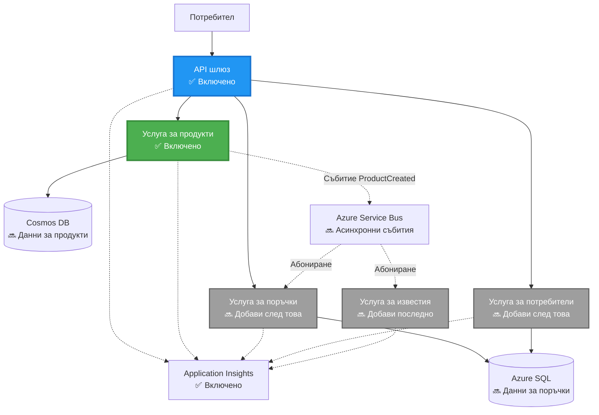
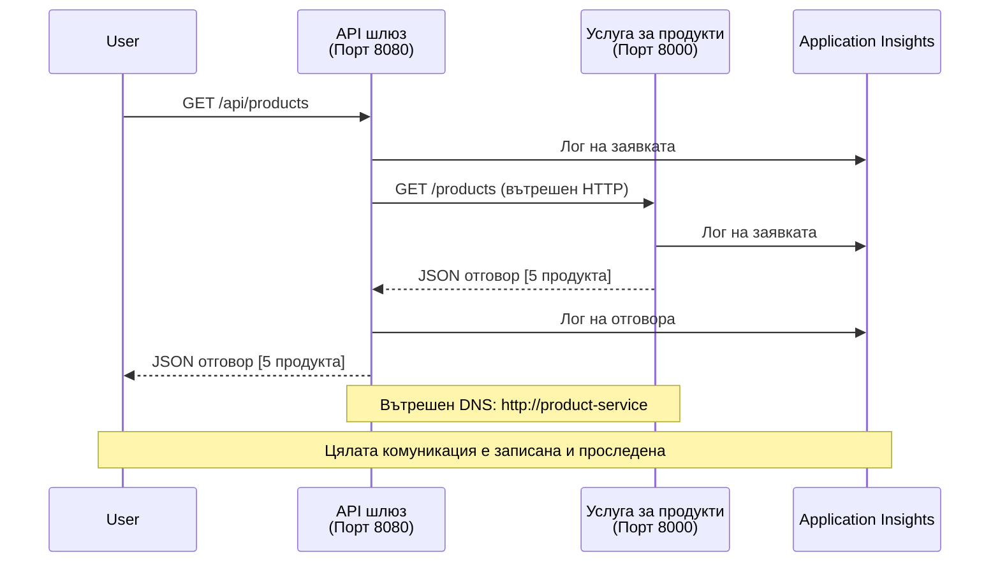

# Архитектура на микросървиси - Пример с Container App

⏱️ **Оценено време**: 25-35 минути | 💰 **Оценена цена**: ~$50-100/месец | ⭐ **Сложност**: Напреднало

**📚 Учебен път:**
- ← Предишна: [Прост Flask API](../../../../examples/container-app/simple-flask-api) - Основи за един контейнер
- 🎯 **Вие сте тук**: Архитектура на микросървиси (фундамент с 2 услуги)
- → Следваща: [Интеграция на AI](../../../../docs/ai-foundry) - Добавяне на интелигентност към вашите услуги
- 🏠 [Начало на курса](../../README.md)

---

Една **опростена, но функционална** архитектура на микросървиси, разположена в Azure Container Apps с помощта на AZD CLI. Този пример демонстрира комуникация между услуги, оркестрация на контейнери и мониторинг с практическа настройка от 2 услуги.

> **📚 Подход за учене**: Този пример започва с минимална архитектура от 2 услуги (API шлюз + бекенд услуга), която наистина можете да внедрите и да научите от нея. След като усвоите този фундамент, предоставяме насоки за разширяване до пълна екосистема от микросървиси.

## Какво ще научите

Чрез завършване на този пример ще:
- Разположите множество контейнери в Azure Container Apps
- Реализирате комуникация между услуги чрез вътрешна мрежа
- Конфигурирате скалиране и health checks, базирани на среда
- Наблюдавате разпределени приложения с Application Insights
- Разберете модели за внедряване на микросървиси и добри практики
- Научите как да разширявате постепенно от опростени към сложни архитектури

## Архитектура

### Фаза 1: Какво градим (включено в този пример)

```mermaid
graph TB
    Internet[Интернет/Потребител]
    Gateway[API шлюз<br/>Контейнер Node.js<br/>Порт 8080]
    Product[Продуктова услуга<br/>Контейнер Python<br/>Порт 8000]
    AppInsights[Приложно наблюдение<br/>Мониторинг и логове]
    
    Internet -->|HTTPS| Gateway
    Gateway -->|HTTP (вътрешен)| Product
    Gateway -.->|Телеметрия| AppInsights
    Product -.->|Телеметрия| AppInsights
    
    style Gateway fill:#2196F3,stroke:#1976D2,stroke-width:3px,color:#fff
    style Product fill:#4CAF50,stroke:#388E3C,stroke-width:3px,color:#fff
    style Internet fill:#FF9800,stroke:#F57C00,stroke-width:2px,color:#fff
    style AppInsights fill:#9C27B0,stroke:#7B1FA2,stroke-width:2px,color:#fff
```
**Детайли за компонентите:**

| Component | Purpose | Access | Resources |
|-----------|---------|--------|-----------|
| **API Gateway** | Насочва външни заявки към бекенд услугите | Public (HTTPS) | 1 vCPU, 2GB RAM, 2-20 replicas |
| **Product Service** | Управлява каталог от продукти с данни в паметта | Internal only | 0.5 vCPU, 1GB RAM, 1-10 replicas |
| **Application Insights** | Централизирано логване и разпределено проследяване | Azure Portal | 1-2 GB/month data ingestion |

**Защо да започнем опростено?**
- ✅ Бързо внедряване и разбиране (25-35 минути)
- ✅ Научавате основните модели на микросървисите без сложност
- ✅ Работещ код, който можете да модифицирате и експериментирате
- ✅ По-ниска цена за учене (~$50-100/месец срещу $300-1400/месец)
- ✅ Изграждате увереност преди да добавите бази данни и опашки за съобщения

**Аналогия**: Мислете за това като за учене да шофирате. Започвате с празен паркинг (2 услуги), усвоявате основите, след това преминавате към градски трафик (5+ услуги с бази данни).

### Фаза 2: Бъдещо разширение (Референтна архитектура)

След като усвоите архитектурата с 2 услуги, можете да разширите до:


```mermaid
graph TB
    User[Потребител]
    Gateway[API шлюз<br/>✅ Включено]
    Product[Услуга за продукти<br/>✅ Включено]
    Order[Услуга за поръчки<br/>🔜 Добави след това]
    UserSvc[Услуга за потребители<br/>🔜 Добави след това]
    Notify[Услуга за известия<br/>🔜 Добави последно]
    
    CosmosDB[(Cosmos DB<br/>🔜 Данни за продукти)]
    AzureSQL[(Azure SQL<br/>🔜 Данни за поръчки)]
    ServiceBus[Azure Service Bus<br/>🔜 Асинхронни събития]
    AppInsights[Application Insights<br/>✅ Включено]
    
    User --> Gateway
    Gateway --> Product
    Gateway --> Order
    Gateway --> UserSvc
    
    Product --> CosmosDB
    Order --> AzureSQL
    UserSvc --> AzureSQL
    
    Product -.->|Събитие ProductCreated| ServiceBus
    ServiceBus -.->|Абониране| Notify
    ServiceBus -.->|Абониране| Order
    
    Gateway -.-> AppInsights
    Product -.-> AppInsights
    Order -.-> AppInsights
    UserSvc -.-> AppInsights
    Notify -.-> AppInsights
    
    style Product fill:#4CAF50,stroke:#388E3C,stroke-width:3px,color:#fff
    style Gateway fill:#2196F3,stroke:#1976D2,stroke-width:3px,color:#fff
    style Order fill:#9E9E9E,stroke:#616161,stroke-width:2px,color:#fff
    style UserSvc fill:#9E9E9E,stroke:#616161,stroke-width:2px,color:#fff
    style Notify fill:#9E9E9E,stroke:#616161,stroke-width:2px,color:#fff
```
Вижте секцията "Ръководство за разширяване" в края за стъпка по стъпка инструкции.

## Включени функции

✅ **Откриване на услуги**: Автоматично DNS-базирано откриване между контейнерите  
✅ **Баланс на натоварването**: Вградено балансиране между репликите  
✅ **Автоматично скалиране**: Независимо скалиране за всяка услуга на база HTTP заявки  
✅ **Мониторинг на здравето**: Liveness и readiness probes за двете услуги  
✅ **Разпределено логване**: Централизирано логване с Application Insights  
✅ **Вътрешна мрежа**: Сигурна комуникация между услугите  
✅ **Оркестрация на контейнери**: Автоматично внедряване и скалиране  
✅ **Актуализации без престой**: Ролни актуализации с управление на ревизиите  

## Предварителни изисквания

### Необходими инструменти

Преди да започнете, проверете дали имате инсталирани следните инструменти:

1. **[Azure Developer CLI (azd)](https://learn.microsoft.com/azure/developer/azure-developer-cli/install-azd)** (версия 1.0.0 или по-нова)
   ```bash
   azd version
   # Очакван изход: azd версия 1.0.0 или по-нова
   ```

2. **[Azure CLI](https://learn.microsoft.com/cli/azure/install-azure-cli)** (версия 2.50.0 или по-нова)
   ```bash
   az --version
   # Очакван изход: azure-cli 2.50.0 или по-нова версия
   ```

3. **[Docker](https://www.docker.com/get-started)** (за локална разработка/тестване - по избор)
   ```bash
   docker --version
   # Очакван изход: Docker версия 20.10 или по-нова
   ```

### Проверете вашата настройка

Изпълнете тези команди, за да потвърдите, че сте готови:

```bash
# Проверете Azure Developer CLI
azd version
# ✅ Очаква се: azd версия 1.0.0 или по-нова

# Проверете Azure CLI
az --version
# ✅ Очаква се: azure-cli 2.50.0 или по-нова

# Проверете Docker (по избор)
docker --version
# ✅ Очаква се: Docker версия 20.10 или по-нова
```

**Критерий за успех**: Всички команди връщат номера на версия, съответстващи или надвишаващи минималните изисквания.

### Изисквания в Azure

- Активен **Azure абонамент** ([създайте безплатен акаунт](https://azure.microsoft.com/free/))
- Права за създаване на ресурси в абонамента ви
- Роля **Contributor** върху абонамента или ресурсната група

### Предварителни познания

Това е пример за **напреднало ниво**. Трябва да:
- Сте завършили примера [Simple Flask API](../../../../examples/container-app/simple-flask-api) 
- Имате базово разбиране за архитектура на микросървиси
- Познавате REST API и HTTP
- Разбирате концепции за контейнери

**Нов в Container Apps?** Започнете първо с примера [Simple Flask API](../../../../examples/container-app/simple-flask-api), за да научите основите.

## Бърз старт (Стъпка по стъпка)

### Стъпка 1: Клонирайте и навигирайте

```bash
git clone https://github.com/microsoft/AZD-for-beginners.git
cd AZD-for-beginners/examples/microservices
```

**✓ Проверка за успех**: Уверете се, че виждате `azure.yaml`:
```bash
ls
# Очаквано: README.md, azure.yaml, infra/, src/
```

### Стъпка 2: Аутентикация в Azure

```bash
azd auth login
```

Това отваря вашия браузър за удостоверяване в Azure. Впишете се с вашите Azure данни за вход.

**✓ Проверка за успех**: Трябва да видите:
```
Logged in to Azure.
```

### Стъпка 3: Инициализирайте средата

```bash
azd init
```

**Подканите, които ще видите**:
- **Име на средата**: Въведете кратко име (например `microservices-dev`)
- **Azure абонамент**: Изберете вашия абонамент
- **Azure регион**: Изберете регион (например `eastus`, `westeurope`)

**✓ Проверка за успех**: Трябва да видите:
```
SUCCESS: New project initialized!
```

### Стъпка 4: Внедрете инфраструктурата и услугите

```bash
azd up
```

**Какво се случва** (отнема 8-12 минути):


```mermaid
graph LR
    A[azd up] --> B[Създаване на ресурсна група]
    B --> C[Разполагане на регистър за контейнери]
    C --> D[Разполагане на Log Analytics]
    D --> E[Разполагане на App Insights]
    E --> F[Създаване на контейнерна среда]
    F --> G[Изграждане на образ на API шлюз]
    F --> H[Изграждане на образ на продуктова услуга]
    G --> I[Качване в регистъра]
    H --> I
    I --> J[Разполагане на API шлюз]
    I --> K[Разполагане на продуктова услуга]
    J --> L[Конфигуриране на Ingress и проверки за здраве]
    K --> L
    L --> M[Разгръщането е завършено ✓]
    
    style A fill:#2196F3,stroke:#1976D2,stroke-width:3px,color:#fff
    style M fill:#4CAF50,stroke:#388E3C,stroke-width:3px,color:#fff
```
**✓ Проверка за успех**: Трябва да видите:
```
SUCCESS: Your application was deployed to Azure in X minutes Y seconds.
Endpoint: https://api-gateway-<unique-id>.azurecontainerapps.io
```

**⏱️ Време**: 8-12 минути

### Стъпка 5: Тествайте внедряването

```bash
# Вземете крайна точка на шлюза
GATEWAY_URL=$(azd env get-values | grep API_GATEWAY_URL | cut -d '=' -f2 | tr -d '"')

# Проверете състоянието на API шлюза
curl $GATEWAY_URL/health
```

**✅ Очакван изход:**
```json
{
  "status": "healthy",
  "service": "api-gateway",
  "timestamp": "2025-11-19T10:30:00Z"
}
```

**Тествайте product service чрез gateway**:
```bash
# Списък с продукти
curl $GATEWAY_URL/api/products
```

**✅ Очакван изход:**
```json
[
  {"id":1,"name":"Laptop","price":999.99,"stock":50},
  {"id":2,"name":"Mouse","price":29.99,"stock":200},
  {"id":3,"name":"Keyboard","price":79.99,"stock":150}
]
```

**✓ Проверка за успех**: И двата крайни пункта връщат JSON данни без грешки.

---

**🎉 Поздравления!** Вие внедрихте архитектура на микросървиси в Azure!

## Структура на проекта

Всички файлове за имплементация са включени—това е пълен, работещ пример:

```
microservices/
│
├── README.md                         # This file
├── azure.yaml                        # AZD configuration
├── .gitignore                        # Git ignore patterns
│
├── infra/                           # Infrastructure as Code (Bicep)
│   ├── main.bicep                   # Main orchestration
│   ├── abbreviations.json           # Naming conventions
│   ├── core/                        # Shared infrastructure
│   │   ├── container-apps-environment.bicep  # Container environment + registry
│   │   └── monitor.bicep            # Application Insights + Log Analytics
│   └── app/                         # Service definitions
│       ├── api-gateway.bicep        # API Gateway container app
│       └── product-service.bicep    # Product Service container app
│
└── src/                             # Application source code
    ├── api-gateway/                 # Node.js API Gateway
    │   ├── app.js                   # Express server with routing
    │   ├── package.json             # Node dependencies
    │   └── Dockerfile               # Container definition
    └── product-service/             # Python Product Service
        ├── main.py                  # Flask API with product data
        ├── requirements.txt         # Python dependencies
        └── Dockerfile               # Container definition
```

**Какво прави всеки компонент:**

**Infrastructure (infra/)**:
- `main.bicep`: Оркестрира всички Azure ресурси и техните зависимости
- `core/container-apps-environment.bicep`: Създава контейнерна среда и Azure Container Registry
- `core/monitor.bicep`: Настройва Application Insights за разпределено логване
- `app/*.bicep`: Индивидуални дефиниции на container app с конфигурации за скалиране и probes

**API Gateway (src/api-gateway/)**:
- Публична услуга, която насочва заявки към бекенд услугите
- Реализира логване, обработка на грешки и препращане на заявки
- Демонстрира HTTP комуникация между услуги

**Product Service (src/product-service/)**:
- Вътрешна услуга с каталог от продукти (в паметта за простота)
- REST API с health checks
- Пример за бекенд микросървисен модел

## Преглед на услугите

### API Gateway (Node.js/Express)

**Порт**: 8080  
**Достъп**: Публичен (външен ingress)  
**Цел**: Насочва входящите заявки към подходящите бекенд услуги  

**Крайни точки**:
- `GET /` - Информация за услугата
- `GET /health` - Health check крайна точка
- `GET /api/products` - Препраща към product service (изброяване)
- `GET /api/products/:id` - Препраща към product service (получаване по ID)

**Ключови функции**:
- Насочване на заявки с axios
- Централизирано логване
- Обработка на грешки и управление на таймаути
- Откриване на услуги чрез променливи на средата
- Интеграция с Application Insights

**Отрязък от кода** (`src/api-gateway/app.js`):
```javascript
// Вътрешна комуникация на услугата
app.get('/api/products', async (req, res) => {
  const response = await axios.get(`${PRODUCT_SERVICE_URL}/products`, {
    timeout: 5000
  });
  res.json(response.data);
});
```

### Product Service (Python/Flask)

**Порт**: 8000  
**Достъп**: Само вътрешен (без външен ingress)  
**Цел**: Управлява каталог от продукти с данни в паметта  

**Крайни точки**:
- `GET /` - Информация за услугата
- `GET /health` - Health check крайна точка
- `GET /products` - Изброява всички продукти
- `GET /products/<id>` - Връща продукт по ID

**Ключови функции**:
- RESTful API с Flask
- Магазин за продукти в паметта (опростен, без нужда от база данни)
- Мониторинг на здравето с probes
- Структурирано логване
- Интеграция с Application Insights

**Модел на данни**:
```python
{
  "id": 1,
  "name": "Laptop",
  "description": "High-performance laptop",
  "price": 999.99,
  "stock": 50
}
```

**Защо е само вътрешен?**
Product service не е изложен публично. Всички заявки трябва да преминат през API шлюза, който осигурява:
- Сигурност: Контролиран входна точка
- Гъвкавост: Може да променя бекенда без да засяга клиентите
- Мониторинг: Централизирано логване на заявки

## Разбиране на комуникацията между услуги

### Как услугите комуникират помежду си


```mermaid
sequenceDiagram
    participant User
    participant Gateway as API шлюз<br/>(Порт 8080)
    participant Product as Услуга за продукти<br/>(Порт 8000)
    participant AI as Application Insights
    
    User->>Gateway: GET /api/products
    Gateway->>AI: Лог на заявката
    Gateway->>Product: GET /products (вътрешен HTTP)
    Product->>AI: Лог на заявката
    Product-->>Gateway: JSON отговор [5 продукта]
    Gateway->>AI: Лог на отговора
    Gateway-->>User: JSON отговор [5 продукта]
    
    Note over Gateway,Product: Вътрешен DNS: http://product-service
    Note over User,AI: Цялата комуникация е записана и проследена
```
В този пример API Gateway комуникира с Product Service чрез **вътрешни HTTP повиквания**:

```javascript
// API шлюз (src/api-gateway/app.js)
const PRODUCT_SERVICE_URL = process.env.PRODUCT_SERVICE_URL;

// Направете вътрешна HTTP заявка
const response = await axios.get(`${PRODUCT_SERVICE_URL}/products`);
```

**Ключови моменти**:

1. **DNS-базирано откриване**: Container Apps автоматично предоставя DNS за вътрешни услуги
   - FQDN на Product Service: `product-service.internal.<environment>.azurecontainerapps.io`
   - Опростено като: `http://product-service` (Container Apps го резолвира)

2. **Няма публично излагане**: Product Service има `external: false` в Bicep
   - Достъпна само в рамките на Container Apps средата
   - Не може да бъде достъпена от интернет

3. **Променливи на средата**: URL адресите на услугите се инжектират при внедряване
   - Bicep предава вътрешния FQDN на gateway
   - Няма хардкоднати URL в приложния код

**Аналогия**: Представете си това като офиси. API Gateway е рецепцията (публична), а Product Service е офисна стая (само вътрешна). Посетителите трябва да преминат през рецепцията, за да стигнат до всяка стая.

## Варианти за внедряване

### Пълно внедряване (Препоръчително)

```bash
# Разгръщане на инфраструктурата и на двете услуги.
azd up
```

Това внедрява:
1. Container Apps среда
2. Application Insights
3. Container Registry
4. Контейнер за API Gateway
5. Контейнер за Product Service

**Време**: 8-12 минути

### Внедряване на отделна услуга

```bash
# Разположете само една услуга (след първоначалното azd up)
azd deploy api-gateway

# Или разположете продуктова услуга
azd deploy product-service
```

**Сценарий за използване**: Когато сте обновили кода в една услуга и искате да внедрите само тази услуга.

### Актуализиране на конфигурацията

```bash
# Промени параметрите за мащабиране
azd env set GATEWAY_MAX_REPLICAS 30

# Разположи отново с новата конфигурация
azd up
```

## Конфигурация

### Конфигурация на скалирането

И двете услуги са конфигурирани с автоматично скалиране, базирано на HTTP, в техните Bicep файлове:

**API Gateway**:
- Мин. реплики: 2 (винаги поне 2 за наличност)
- Макс. реплики: 20
- Тригер за скалиране: 50 едновременни заявки на реплика

**Product Service**:
- Мин. реплики: 1 (може да скалира до нула при нужда)
- Макс. реплики: 10
- Тригер за скалиране: 100 едновременни заявки на реплика

**Персонализиране на скалирането** (в `infra/app/*.bicep`):
```bicep
scale: {
  minReplicas: 1
  maxReplicas: 10
  rules: [
    {
      name: 'http-scale-rule'
      http: {
        metadata: {
          concurrentRequests: '100'  // Adjust this
        }
      }
    }
  ]
}
```

### Разпределение на ресурси

**API Gateway**:
- CPU: 1.0 vCPU
- Памет: 2 GiB
- Причина: Обработва цялото външно натоварване

**Product Service**:
- CPU: 0.5 vCPU
- Памет: 1 GiB
- Причина: Леки операции в паметта

### Health checks

И двете услуги включват liveness и readiness probes:

```bicep
probes: [
  {
    type: 'Liveness'
    httpGet: {
      path: '/health'
      port: 8080
    }
    initialDelaySeconds: 10
    periodSeconds: 30
  }
  {
    type: 'Readiness'
    httpGet: {
      path: '/health'
      port: 8080
    }
    initialDelaySeconds: 5
    periodSeconds: 10
  }
]
```

**Какво означава това**:
- **Liveness**: Ако health check се провали, Container Apps рестартира контейнера
- **Readiness**: Ако не е готов, Container Apps спира насочването на трафик към тази реплика

## Мониторинг и наблюдаемост

### Преглед на логовете на услугите

```bash
# Прегледайте логовете с azd monitor
azd monitor --logs

# Или използвайте Azure CLI за конкретни Container Apps:
# Поточно предавайте логове от API Gateway
az containerapp logs show --name api-gateway --resource-group $RG_NAME --follow

# Прегледайте последните логове на продуктовата услуга
az containerapp logs show --name product-service --resource-group $RG_NAME --tail 100
```

**Очакван изход**:
```
[api-gateway] API Gateway listening on port 8080
[api-gateway] Product Service URL: http://product-service
[api-gateway] GET /api/products 200 - 45ms
[product-service] Retrieved 5 products
```

### Заявки за Application Insights

Достъпете Application Insights в Azure Portal, след това изпълнете тези заявки:

**Намерете бавни заявки**:
```kusto
requests
| where timestamp > ago(1h)
| where duration > 1000  // Requests taking >1 second
| summarize count() by name, cloud_RoleName
| order by count_ desc
```

**Проследете повикванията между услуги**:
```kusto
dependencies
| where timestamp > ago(1h)
| where type == "Http"
| project timestamp, name, target, duration, success
| order by timestamp desc
```

**Процент на грешки по услуга**:
```kusto
exceptions
| where timestamp > ago(24h)
| summarize errorCount = count() by cloud_RoleName, type
| order by errorCount desc
```

**Обем заявки във времето**:
```kusto
requests
| where timestamp > ago(1h)
| summarize requestCount = count() by bin(timestamp, 5m), cloud_RoleName
| render timechart
```

### Достъп до мониторинговото табло

```bash
# Вземете подробности за Application Insights
azd env get-values | grep APPLICATIONINSIGHTS

# Отворете мониторинга в портала на Azure
az monitor app-insights component show \
  --app $(azd env get-values | grep APPLICATIONINSIGHTS_CONNECTION_STRING | cut -d '=' -f2) \
  --resource-group $(azd env get-values | grep AZURE_RESOURCE_GROUP | cut -d '=' -f2) \
  --query "appId" -o tsv
```

### Live Metrics

1. Отидете в Application Insights в Azure Portal
2. Кликнете "Live Metrics"
3. Вижте заявки в реално време, неуспехи и производителност
4. Тествайте, като стартирате: `curl $(azd env get-values | grep API_GATEWAY_URL | cut -d '=' -f2 | tr -d '"')/api/products`

## Практически упражнения

### Упражнение 1: Добавете нов POST крайпункт за продукт ⭐ (Лесно)

**Цел**: Добавете POST крайпункт за създаване на нови продукти

**Начална точка**: `src/product-service/main.py`

**Стъпки**:

1. Добавете този крайпункт след функцията `get_product` в `main.py`:

```python
@app.route('/products', methods=['POST'])
def create_product():
    """Create a new product"""
    data = request.get_json()
    
    # Валидирайте задължителните полета
    if not data or 'name' not in data or 'price' not in data:
        return jsonify({'error': 'Missing required fields: name, price'}), 400
    
    new_id = max(p['id'] for p in products) + 1
    new_product = {
        'id': new_id,
        'name': data['name'],
        'description': data.get('description', ''),
        'price': float(data['price']),
        'stock': int(data.get('stock', 0))
    }
    products.append(new_product)
    logger.info(f"Created product {new_id}")
    return jsonify(new_product), 201
```

2. Добавете POST маршрут към API Gateway (`src/api-gateway/app.js`):

```javascript
// Добавете това след маршрута GET /api/products
app.post('/api/products', async (req, res) => {
  try {
    console.log(`Forwarding POST request to ${PRODUCT_SERVICE_URL}/products`);
    const response = await axios.post(`${PRODUCT_SERVICE_URL}/products`, req.body, {
      timeout: 5000
    });
    res.status(201).json(response.data);
  } catch (error) {
    console.error('Error calling product service:', error.message);
    res.status(503).json({
      error: 'Product service unavailable',
      message: error.message
    });
  }
});
```

3. Разположете отново и двете услуги:

```bash
azd deploy product-service
azd deploy api-gateway
```

4. Тествайте новата крайна точка:

```bash
GATEWAY_URL=$(azd env get-values | grep API_GATEWAY_URL | cut -d '=' -f2 | tr -d '"')

# Създайте нов продукт
curl -X POST $GATEWAY_URL/api/products \
  -H "Content-Type: application/json" \
  -d '{"name":"USB Cable","price":9.99,"stock":500}'
```

**✅ Очакван резултат:**
```json
{"id":6,"name":"USB Cable","description":"","price":9.99,"stock":500}
```

5. Потвърдете, че се появява в списъка:

```bash
curl $GATEWAY_URL/api/products
# Сега трябва да показва 6 продукта, включително новия USB кабел.
```

**Критерии за успех**:
- ✅ POST заявката връща HTTP 201
- ✅ Новият продукт се появява в списъка от GET /api/products
- ✅ Продуктът има автоматично увеличаващо се ID

**Време**: 10-15 минути

---

### Упражнение 2: Променете правилата за автоматично мащабиране ⭐⭐ (Средно)

**Цел**: Направете Product Service да се мащабира по-агресивно

**Начална точка**: `infra/app/product-service.bicep`

**Стъпки**:

1. Отворете `infra/app/product-service.bicep` и намерете блока `scale` (приблизително около ред 95)

2. Променете от:
```bicep
scale: {
  minReplicas: 1
  maxReplicas: 10
  rules: [
    {
      name: 'http-scale-rule'
      http: {
        metadata: {
          concurrentRequests: '100'  // OLD
        }
      }
    }
  ]
}
```

На:
```bicep
scale: {
  minReplicas: 2  // Always have 2 running
  maxReplicas: 20  // Allow more scaling
  rules: [
    {
      name: 'http-scale-rule'
      http: {
        metadata: {
          concurrentRequests: '20'  // Scale at lower threshold
        }
      }
    }
  ]
}
```

3. Разположете отново инфраструктурата:

```bash
azd up
```

4. Проверете новата конфигурация за мащабиране:

```bash
az containerapp show \
  --name $(azd env get-values | grep PRODUCT_SERVICE | head -1 | cut -d '/' -f5) \
  --resource-group $(azd env get-values | grep AZURE_RESOURCE_GROUP | cut -d '=' -f2 | tr -d '"') \
  --query "properties.template.scale" -o json
```

**✅ Очакван резултат:**
```json
{
  "minReplicas": 2,
  "maxReplicas": 20,
  "rules": [...]
}
```

5. Тествайте автоматичното мащабиране с натоварване:

```bash
# Генерирайте паралелни заявки
for i in {1..500}; do curl $GATEWAY_URL/api/products & done

# Наблюдавайте скалирането чрез Azure CLI
az containerapp logs show --name product-service --resource-group $RG_NAME --follow
# Потърсете: събития за скалиране на Container Apps
```

**Критерии за успех**:
- ✅ Product Service винаги работи с поне 2 реплики
- ✅ Под натоварване се мащабира до повече от 2 реплики
- ✅ Azure порталът показва новите правила за мащабиране

**Време**: 15-20 минути

---

### Упражнение 3: Добавете персонализирана заявка за наблюдение ⭐⭐ (Средно)

**Цел**: Създайте персонализирана заявка в Application Insights за проследяване на производителността на Product API

**Стъпки**:

1. Отидете в Application Insights в Azure Portal:
   - Отидете в Azure Portal
   - Намерете вашата ресурсна група (rg-microservices-*)
   - Кликнете върху ресурса Application Insights

2. Кликнете 'Logs' в левия панел

3. Създайте тази заявка:

```kusto
requests
| where timestamp > ago(1h)
| where name contains "products"
| summarize 
    RequestCount = count(),
    AvgDuration = avg(duration),
    P95Duration = percentile(duration, 95),
    SuccessRate = 100.0 * countif(success == true) / count()
  by bin(timestamp, 5m)
| render timechart
```

4. Кликнете 'Run', за да изпълните заявката

5. Запазете заявката:
   - Кликнете 'Save'
   - Име: "Product API Performance"
   - Категория: "Performance"

6. Генерирайте тестов трафик:

```bash
for i in {1..100}; do curl $GATEWAY_URL/api/products; sleep 1; done
```

7. Обновете заявката, за да видите данните

**✅ Очакван резултат:**
- Графика, показваща брой заявки във времето
- Средна продължителност < 500 ms
- Процент успешни заявки = 100%
- Времеви интервали от 5 минути

**Критерии за успех**:
- ✅ Заявката показва над 100 заявки
- ✅ Процент успешни заявки е 100%
- ✅ Средна продължителност < 500 ms
- ✅ Графиката показва 5-минутни времеви интервали

**Постигнати знания**: Разберете как да наблюдавате производителността на услугата с персонализирани заявки

**Време**: 10-15 минути

---

### Упражнение 4: Внедрете логика за повторни опити ⭐⭐⭐ (Напреднало)

**Цел**: Добавете логика за повторни опити в API Gateway, когато Product Service е временно недостъпен

**Начална точка**: `src/api-gateway/app.js`

**Стъпки**:

1. Инсталирайте библиотека за повторни опити:

```bash
cd src/api-gateway
npm install axios-retry --save
cd ../..
```

2. Актуализирайте `src/api-gateway/app.js` (добавете след импортирането на axios):

```javascript
const axiosRetry = require('axios-retry');

// Конфигуриране на логиката за повторни опити
axiosRetry(axios, {
  retries: 3,
  retryDelay: (retryCount) => {
    return retryCount * 1000; // 1 сек, 2 сек, 3 сек
  },
  retryCondition: (error) => {
    // Прави повторни опити при мрежови грешки или при отговори с код 5xx
    return axiosRetry.isNetworkOrIdempotentRequestError(error) ||
           (error.response && error.response.status >= 500);
  }
});

console.log('Retry logic configured: 3 retries with exponential backoff');
```

3. Разположете отново API Gateway:

```bash
azd deploy api-gateway
```

4. Тествайте поведението на повторните опити, като симулирате повреда на услугата:

```bash
# Променете мащаба на услугата за продукти на 0 (симулирайте неизправност)
az containerapp update \
  --name $(azd env get-values | grep PRODUCT_SERVICE | head -1 | cut -d '/' -f5) \
  --resource-group $(azd env get-values | grep AZURE_RESOURCE_GROUP | cut -d '=' -f2 | tr -d '"') \
  --min-replicas 0 \
  --max-replicas 0

# Опитайте да получите достъп до продуктите (ще се опита 3 пъти)
time curl -v $GATEWAY_URL/api/products
# Наблюдавайте: Отговорът отнема ~6 секунди (1 с + 2 с + 3 с при повторни опити)

# Възстановете услугата за продукти
az containerapp update \
  --name $(azd env get-values | grep PRODUCT_SERVICE | head -1 | cut -d '/' -f5) \
  --resource-group $(azd env get-values | grep AZURE_RESOURCE_GROUP | cut -d '=' -f2 | tr -d '"') \
  --min-replicas 1 \
  --max-replicas 10
```

5. Прегледайте логовете за повторни опити:

```bash
az containerapp logs show --name api-gateway --resource-group $RG_NAME --tail 50
# Потърсете: съобщения за опити за повторение
```

**✅ Очаквано поведение:**
- Заявките правят 3 опита преди да се провалят
- Всеки повторен опит изчаква по-дълго (1s, 2s, 3s)
- Успешни заявки след рестартиране на услугата
- Логовете показват опитите за повторение

**Критерии за успех**:
- ✅ Заявките правят 3 опита преди да се провалят
- ✅ Всеки повторен опит изчаква по-дълго (exponential backoff)
- ✅ Успешни заявки след рестартиране на услугата
- ✅ Логовете показват опитите за повторение

**Постигнати знания**: Разберете моделите за устойчивост в микросървисите (circuit breakers, retries, timeouts)

**Време**: 20-25 минути

---

## Проверка на знанията

След като завършите този пример, проверете разбирането си:

### 1. Комуникация между услугите ✓

Проверете знанията си:
- [ ] Можете ли да обясните как API Gateway открива Product Service? (откриване на услуги базирано на DNS)
- [ ] Какво се случва ако Product Service е спряна? (Gateway връща грешка 503)
- [ ] Как бихте добавили трета услуга? (Създайте нов Bicep файл, добавете го в main.bicep, създайте папка src)

**Практическа проверка:**
```bash
# Симулирайте отказ на услугата
az containerapp update --name <product-service-name> --min-replicas 0 --max-replicas 0
curl $GATEWAY_URL/api/products
# ✅ Очаквано: 503 Услугата е недостъпна

# Възстановете услугата
az containerapp update --name <product-service-name> --min-replicas 1 --max-replicas 10
```

### 2. Мониторинг и наблюдаемост ✓

Проверете знанията си:
- [ ] Къде виждате разпределените логове? (Application Insights в Azure Portal)
- [ ] Как проследявате бавни заявки? (Kusto заявка: `requests | where duration > 1000`)
- [ ] Можете ли да идентифицирате коя услуга е причинила грешка? (Проверете полето `cloud_RoleName` в логовете)

**Практическа проверка:**
```bash
# Генерирай симулация на бавна заявка
curl "$GATEWAY_URL/api/products?delay=2000"

# Направи заявка в Application Insights за бавни заявки
# Отиди в Azure Portal → Application Insights → Logs
# Изпълни: requests | where duration > 1000 | project timestamp, name, duration, cloud_RoleName
```

### 3. Мащабиране и производителност ✓

Проверете знанията си:
- [ ] Какво задейства автоматичното мащабиране? (правила за едновременни HTTP заявки: 50 за gateway, 100 за product)
- [ ] Колко реплики работят в момента? (Проверете с `az containerapp revision list`)
- [ ] Как бихте мащабирали Product Service до 5 реплики? (Актуализирайте minReplicas в Bicep)

**Практическа проверка:**
```bash
# Генерирайте натоварване за тестване на автоматичното мащабиране
for i in {1..1000}; do curl $GATEWAY_URL/api/products & done

# Наблюдавайте увеличаването на репликите чрез Azure CLI
az containerapp logs show --name api-gateway --resource-group $RG_NAME --follow
# ✅ Очаквано: Вижте събития за мащабиране в логовете
```

**Критерии за успех**: Можете да отговорите на всички въпроси и да ги проверите с практически команди.

---

## Анализ на разходите

### Прогнозни месечни разходи (За този пример с 2 услуги)

| Ресурс | Конфигурация | Прогнозна цена |
|----------|--------------|----------------|
| API Gateway | 2-20 реплики, 1 vCPU, 2GB RAM | $30-150 |
| Product Service | 1-10 реплики, 0.5 vCPU, 1GB RAM | $15-75 |
| Container Registry | Basic tier | $5 |
| Application Insights | 1-2 GB/месец | $5-10 |
| Log Analytics | 1 GB/месец | $3 |
| **Общо** | | **$58-243/месец** |

### Разбивка на разходите по използване

**Лек трафик** (тест/обучение): ~$60/месец
- API Gateway: 2 реплики × 24/7 = $30
- Product Service: 1 реплика × 24/7 = $15
- Мониторинг + Регистър = $13

**Умерен трафик** (малко продукционно): ~$120/месец
- API Gateway: 5 средни реплики = $75
- Product Service: 3 средни реплики = $45
- Мониторинг + Регистър = $13

**Висок трафик** (натоварени периоди): ~$240/месец
- API Gateway: 15 средни реплики = $225
- Product Service: 8 средни реплики = $120
- Мониторинг + Регистър = $13

### Съвети за оптимизиране на разходите

1. **Мащабиране до нула за разработка**:
   ```bicep
   scale: {
     minReplicas: 0  // Save $30-40/month when not in use
     maxReplicas: 10
   }
   ```

2. **Използвайте Consumption план за Cosmos DB** (когато го добавите):
   - Плащайте само за това, което използвате
   - Няма минимална такса

3. **Настройте семплиране в Application Insights**:
   ```javascript
   appInsights.defaultClient.config.samplingPercentage = 50; // Семплирайте 50% от заявките
   ```

4. **Почиствайте, когато не е необходимо**:
   ```bash
   azd down --force --purge
   ```

### Опции за безплатен план

За обучение/тестове, помислете за:
- ✅ Използвайте безплатните кредити на Azure ($200 за първите 30 дни за нови акаунти)
- ✅ Поддържайте минимален брой реплики (спестява ~50% от разходите)
- ✅ Изтрийте след тестове (няма постоянни разходи)
- ✅ Мащабирайте до нула между учебните сесии

**Пример**: Стартиране на този пример по 2 часа/ден × 30 дни = ~ $5/месец вместо $60/месец

---

## Бърза справка за отстраняване на проблеми

### Проблем: `azd up` се проваля с "Subscription not found"

**Решение**:
```bash
# Влезте отново с изричен абонамент.
az account set --subscription <your-subscription-id>
azd env set AZURE_SUBSCRIPTION_ID <your-subscription-id>
azd up
```

### Проблем: API Gateway връща 503 "Product service unavailable"

**Диагностика**:
```bash
# Проверете логовете на продуктовата услуга, използвайки Azure CLI
az containerapp logs show --name product-service --resource-group $RG_NAME --tail 50

# Проверете здравето на продуктовата услуга
az containerapp show \
  --name $(azd env get-values | grep PRODUCT_SERVICE | head -1 | cut -d '/' -f5) \
  --resource-group $(azd env get-values | grep AZURE_RESOURCE_GROUP | cut -d '=' -f2 | tr -d '"') \
  --query "properties.runningStatus"
```

**Чести причини**:
1. Product service не е стартирал (проверете логовете за Python грешки)
2. Проверка за жизненост не преминава (проверете дали `/health` endpoint работи)
3. Сглобяването на контейнерния образ е неуспешно (проверете регистъра за изображението)

### Проблем: Автоматичното мащабиране не работи

**Диагностика**:
```bash
# Проверете текущия брой реплики
az containerapp revision list \
  --name $(azd env get-values | grep API_GATEWAY | head -1 | cut -d '/' -f5) \
  --resource-group $(azd env get-values | grep AZURE_RESOURCE_GROUP | cut -d '=' -f2 | tr -d '"') \
  --query "[].properties.replicas"

# Генерирайте натоварване за тестване
for i in {1..1000}; do curl $GATEWAY_URL/api/products & done

# Наблюдавайте събитията за скалиране с помощта на Azure CLI
az containerapp logs show --name api-gateway --resource-group $RG_NAME --follow | grep -i scale
```

**Чести причини**:
1. Натоварването не е достатъчно високо, за да задейства правилото за мащабиране (нужни са >50 едновременни заявки)
2. Вече е достигнат максималният брой реплики (проверете конфигурацията в Bicep)
3. Правилото за мащабиране е грешно конфигурирано в Bicep (проверете стойността concurrentRequests)

### Проблем: Application Insights не показва логове

**Диагностика**:
```bash
# Проверете дали низът за връзка е зададен
azd env get-values | grep APPLICATIONINSIGHTS

# Проверете дали услугите изпращат телеметрия
az monitor app-insights component show \
  --app $(azd env get-values | grep APPLICATIONINSIGHTS_NAME | cut -d '=' -f2 | tr -d '"') \
  --resource-group $(azd env get-values | grep AZURE_RESOURCE_GROUP | cut -d '=' -f2 | tr -d '"') \
  --query "properties.InstrumentationKey"
```

**Чести причини**:
1. Connection string не е предаден на контейнера (проверете променливите на средата)
2. Application Insights SDK не е конфигуриран (проверете импортите в кода)
3. Firewall блокира телеметрията (рядко, проверете мрежовите правила)

### Проблем: Docker build не успява локално

**Диагностика**:
```bash
# Тест на изграждането на API Gateway
cd src/api-gateway
docker build -t test-gateway .

# Тест на изграждането на Product Service
cd ../product-service
docker build -t test-product .
```

**Чести причини**:
1. Липсващи зависимости в package.json/requirements.txt
2. Синтактични грешки в Dockerfile
3. Проблеми с мрежата при изтегляне на зависимости

**Все още имате проблем?** Вижте [Common Issues Guide](../../docs/chapter-07-troubleshooting/common-issues.md) или [Azure Container Apps Troubleshooting](https://learn.microsoft.com/azure/container-apps/troubleshooting)

---

## Почистване

За да избегнете текущи такси, изтрийте всички ресурси:

```bash
azd down --force --purge
```

**Подканване за потвърждение**:
```
? Total resources to delete: 6, are you sure you want to continue? (y/N)
```

Въведете `y`, за да потвърдите.

**Какво се изтрива**:
- Среда на Container Apps
- Двете Container Apps (gateway & product service)
- Регистър на контейнерите
- Application Insights
- Работно пространство Log Analytics
- Ресурсна група

**✓ Потвърдете почистването**:
```bash
az group list --query "[?starts_with(name,'rg-microservices')]" --output table
```

Трябва да върне празно.

---

## Ръководство за разширение: От 2 до 5+ услуги

След като овладеете тази архитектура с 2 услуги, ето как да разширите:

### Фаза 1: Добавете бази данни за съхранение (следваща стъпка)

**Добавете Cosmos DB за Product Service**:

1. Създайте `infra/core/cosmos.bicep`:
   ```bicep
   resource cosmosAccount 'Microsoft.DocumentDB/databaseAccounts@2023-04-15' = {
     name: name
     location: location
     kind: 'GlobalDocumentDB'
     properties: {
       databaseAccountOfferType: 'Standard'
       consistencyPolicy: { defaultConsistencyLevel: 'Session' }
       locations: [{ locationName: location, failoverPriority: 0 }]
     }
   }
   ```

2. Актуализирайте product service да използва Azure Cosmos DB Python SDK вместо данни в паметта

3. Прогнозна допълнителна цена: ~ $25/месец (serverless)

### Фаза 2: Добавяне на трета услуга (Управление на поръчки)

**Създайте Order Service**:

1. Нова папка: `src/order-service/` (Python/Node.js/C#)
2. Нов Bicep: `infra/app/order-service.bicep`
3. Актуализирайте API Gateway да маршрутизира `/api/orders`
4. Добавете Azure SQL Database за съхранение на поръчки

**Архитектурата става**:
```
API Gateway → Product Service (Cosmos DB)
           → Order Service (Azure SQL)
```

### Фаза 3: Добавете асинхронна комуникация (Service Bus)

**Реализирайте архитектура, управлявана от събития**:

1. Добавете Azure Service Bus: `infra/core/servicebus.bicep`
2. Product Service публикува събития "ProductCreated"
3. Order Service се абонира за продуктови събития
4. Добавете Notification Service за обработка на събитията

**Модел**: Request/Response (HTTP) + Event-Driven (Service Bus)

### Фаза 4: Добавяне на удостоверяване на потребители

**Реализирайте User Service**:

1. Създайте `src/user-service/` (Go/Node.js)
2. Добавете Azure AD B2C или персонализирано JWT удостоверяване
3. API Gateway валидира токените преди маршрутизация
4. Услугите проверяват разрешенията на потребителя

### Фаза 5: Подготовка за продукция

**Добавете тези компоненти**:
- ✅ Azure Front Door (глобално балансиране на натоварването)
- ✅ Azure Key Vault (управление на тайни)
- ✅ Azure Monitor Workbooks (персонализирани табла)
- ✅ CI/CD Pipeline (GitHub Actions)
- ✅ Blue-Green Deployments
- ✅ Managed Identity за всички услуги

**Пълна производствена архитектура – цена**: ~ $300-1,400/месец

---

## Научете повече

### Свързана документация
- [Документация за Azure Container Apps](https://learn.microsoft.com/azure/container-apps/)
- [Ръководство за микросървисна архитектура](https://learn.microsoft.com/azure/architecture/guide/architecture-styles/microservices)
- [Application Insights за разпределено проследяване](https://learn.microsoft.com/azure/azure-monitor/app/distributed-tracing)
- [Документация за Azure Developer CLI](https://learn.microsoft.com/azure/developer/azure-developer-cli/)

### Следващи стъпки в този курс
- ← Предишен: [Simple Flask API](../../../../examples/container-app/simple-flask-api) - Пример за начинаещ с един контейнер
- → Следващ: [AI Integration Guide](../../../../docs/ai-foundry) - Добавяне на AI възможности
- 🏠 [Начало на курса](../../README.md)

### Сравнение: Кога да използвате какво

| Характеристика | Един контейнер | Микросървиси (този) | Kubernetes (AKS) |
|---------|-----------------|---------------------|------------------|
| **Сценарий** | Прости приложения | Сложни приложения | Предприятни приложения |
| **Мащабируемост** | Единна услуга | Мащабиране на ниво услуга | Максимална гъвкавост |
| **Сложност** | Ниска | Средна | Висока |
| **Размер на екипа** | 1-3 разработчици | 3-10 разработчици | 10+ разработчици |
| **Цена** | ~ $15-50/месец | ~ $60-250/месец | ~ $150-500/месец |
| **Време за разгръщане** | 5-10 минути | 8-12 минути | 15-30 минути |
| **Най-подходящо за** | MVPs, прототипи | Приложения в продукция | Многооблачно, напреднали мрежови възможности |

**Препоръка**: Започнете с Container Apps (този пример), преминете към AKS само ако имате нужда от функции, специфични за Kubernetes.

---

## Често задавани въпроси

**В: Защо само 2 услуги вместо 5+?**  
О: Образователно постепенно усложняване. Усвойте основите (комуникация между услуги, мониторинг, мащабиране) с прост пример преди да добавяте сложност. Шаблоните, които научавате тук, се прилагат към архитектури с 100 услуги.

**В: Мога ли да добавя още услуги самостоятелно?**  
О: Абсолютно! Следвайте ръководството за разширение по-горе. Всяка нова услуга следва същия модел: създайте папка src, създайте Bicep файл, актуализирайте azure.yaml, разположете.

**В: Подходящо ли е за продукция?**  
О: Това е солидна основа. За продукция добавете: managed identity, Key Vault, постоянни бази данни, CI/CD pipeline, известия за мониторинг и стратегия за архивиране.

**В: Защо да не използваме Dapr или друг service mesh?**  
О: Дръжте го просто за целите на обучението. След като разберете вграденото мрежово поведение на Container Apps, можете да добавите Dapr за по-напреднали сценарии (управление на състоянието, pub/sub, bindings).

**В: Как да отстранявам грешки локално?**  
О: Стартирайте услугите локално с Docker:  
```bash
cd src/api-gateway
docker build -t local-gateway .
docker run -p 8080:8080 -e PRODUCT_SERVICE_URL=http://localhost:8000 local-gateway
```

**В: Мога ли да използвам различни програмни езици?**  
О: Да! Този пример показва Node.js (gateway) + Python (product service). Можете да комбинирате всякакви езици, които работят в контейнери: C#, Go, Java, Ruby, PHP и др.

**В: Какво ако нямам кредити за Azure?**  
О: Използвайте безплатния слой на Azure (първите 30 дни новите акаунти получават $200 кредити) или разгръщайте за кратки тестове и изтрийте веднага. Този пример струва ~$2/ден.

**В: Каква е разликата спрямо Azure Kubernetes Service (AKS)?**  
О: Container Apps е по-прост (не се изисква познание за Kubernetes), но по-малко гъвкав. AKS ви дава пълен контрол върху Kubernetes, но изисква повече експертиза. Започнете с Container Apps, преминете към AKS при нужда.

**В: Мога ли да използвам това с вече съществуващи Azure услуги?**  
О: Да! Можете да се свържете с вече съществуващи бази данни, storage accounts, Service Bus и др. Актуализирайте Bicep файловете, за да реферирате съществуващи ресурси вместо да създавате нови.

---

> **🎓 Резюме на учебния път**: Научихте как да разгръщате многоуслуна архитектура с автоматично мащабиране, вътрешна мрежа, централизиран мониторинг и готови за продукция модели. Тази основа ви подготвя за сложни разпределени системи и корпоративни микросервизни архитектури.

**📚 Навигация в курса:**
- ← Предишно: [Simple Flask API](../../../../examples/container-app/simple-flask-api)
- → Следващо: [Пример за интеграция на база данни](../../../../database-app)
- 🏠 [Начало на курса](../../README.md)
- 📖 [Най-добри практики за Container Apps](../../docs/chapter-04-infrastructure/deployment-guide.md)

---

**✨ Поздравления!** Завършихте примера за микросервизи. Сега разбирате как да изграждате, разгръщате и наблюдавате разпределени приложения в Azure Container Apps. Готови ли сте да добавите AI възможности? Вижте [Ръководството за интеграция на AI](../../../../docs/ai-foundry)!

---

<!-- CO-OP TRANSLATOR DISCLAIMER START -->
Отказ от отговорност:
Този документ е преведен с помощта на AI услуга за превод Co-op Translator (https://github.com/Azure/co-op-translator). Въпреки че се стремим към точност, имайте предвид, че автоматичните преводи могат да съдържат грешки или неточности. Оригиналният документ на оригиналния език трябва да се счита за авторитетен източник. За критична информация се препоръчва професионален човешки превод. Не носим отговорност за каквито и да е недоразумения или погрешни тълкувания, произтичащи от използването на този превод.
<!-- CO-OP TRANSLATOR DISCLAIMER END -->