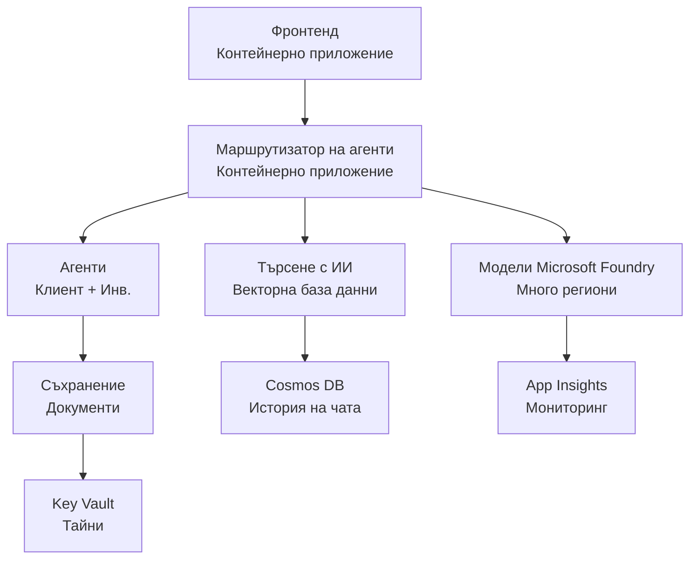

# Решение за многоагентна система за търговия на дребно - Шаблон за инфраструктура

**Глава 5: Пакет за разгръщане в продукция**
- **📚 Начало на курса**: [AZD за начинаещи](../../README.md)
- **📖 Свързана глава**: [Глава 5: Многоагентни AI решения](../../README.md#-chapter-5-multi-agent-ai-solutions-advanced)
- **📝 Ръководство за сценария**: [Пълна архитектура](../retail-scenario.md)
- **🎯 Бързо разгръщане**: [Разгръщане с един клик](#-quick-deployment)

> **⚠️ САМО ШАБЛОН ЗА ИНФРАСТРУКТУРА**  
> Този ARM шаблон разгръща **Azure ресурси** за многоагентна система.  
>  
> **Какво се разгръща (15-25 минути):**
> - ✅ Microsoft Foundry Models (gpt-4.1, gpt-4.1-mini, embeddings в 3 региона)
> - ✅ AI Search услуга (празна, готова за създаване на индекс)
> - ✅ Container Apps (плейсхолдър изображения, готови за вашия код)
> - ✅ Storage, Cosmos DB, Key Vault, Application Insights
>  
> **Какво НЕ е включено (изисква разработка):**
> - ❌ Код за реализация на агенти (Customer Agent, Inventory Agent)
> - ❌ Логика за маршрутизиране и API крайни точки
> - ❌ Фронтенд чат UI
> - ❌ Схеми на индекси за търсене и data pipelines
> - ❌ **Оценено усилие за разработка: 80-120 часа**
>  
> **Използвайте този шаблон ако:**
> - ✅ Искате да осигурите Azure инфраструктура за многоагентен проект
> - ✅ Планирате да разработите реализацията на агентите отделно
> - ✅ Имате нужда от базова инфраструктура готова за продукция
>  
> **Не използвайте ако:**
> - ❌ Очаквате веднага работещ мултиагентен демо
> - ❌ Търсите пълен примерен код на приложението

## Преглед

Тази директория съдържа изчерпателен Azure Resource Manager (ARM) шаблон за разгръщане на **инфраструктурната основа** на система за поддръжка на клиенти с много агенти. Шаблонът предоставя всички необходими Azure услуги, правилно конфигурирани и свързани, готови за разработката на вашето приложение.

**След разгръщане ще имате:** Инфраструктура подходяща за продукция в Azure  
**За да завършите системата, ви е нужен:** Код на агентите, фронтенд UI и конфигурация на данни (вижте [Ръководство за архитектурата](../retail-scenario.md))

## 🎯 Какво се разгръща

### Основна инфраструктура (Статус след разгръщане)

✅ **Microsoft Foundry Models услуги** (Готови за API извиквания)
  - Основен регион: разгръщане на gpt-4.1 (20K TPM капацитет)
  - Вторичен регион: разгръщане на gpt-4.1-mini (10K TPM капацитет)
  - Третичен регион: модел за текстови embeddings (30K TPM капацитет)
  - Регион за оценка: gpt-4.1 grader модел (15K TPM капацитет)
  - **Статус:** Пълнофункционално - може да прави API извиквания незабавно

✅ **Azure AI Search** (Празна - готова за конфигурация)
  - Векторно търсене активно
  - Стандартно ниво с 1 партиция, 1 реплика
  - **Статус:** Услугата работи, но изисква създаване на индекс
  - **Необходима стъпка:** Създайте индекс за търсене със своята схема

✅ **Azure Storage акаунт** (Празен - готов за качване)
  - Blob контейнери: `documents`, `uploads`
  - Сигурна конфигурация (само HTTPS, без публичен достъп)
  - **Статус:** Готов за получаване на файлове
  - **Необходима стъпка:** Качете данните за продуктите и документи

⚠️ **Container Apps среда** (Разположени плейсхолдър изображения)
  - Агент маршрутизиращо приложение (nginx стандартно изображение)
  - Фронтенд приложение (nginx стандартно изображение)
  - Авто-скалиране конфигурирано (0-10 инстанции)
  - **Статус:** Работещи плейсхолдър контейнери
  - **Необходима стъпка:** Създайте и разположете вашите агент приложения

✅ **Azure Cosmos DB** (Празна - готова за данни)
  - База данни и контейнер предварително конфигурирани
  - Оптимизирано за ниска латентност
  - TTL активиран за автоматично почистване
  - **Статус:** Готова за съхранение на история на чата

✅ **Azure Key Vault** (По избор - готов за съхранение на тайни)
  - Soft delete активирано
  - RBAC конфигуриран за управлявани идентичности
  - **Статус:** Готов за съхранение на API ключове и низове за връзка

✅ **Application Insights** (По избор - мониторинг активен)
  - Свързан с Log Analytics работно пространство
  - Потребителски метрики и аларми конфигурирани
  - **Статус:** Готов да приема телеметрия от вашите приложения

✅ **Document Intelligence** (Готово за API извиквания)
  - Ниво S0 за продукционни натоварвания
  - **Статус:** Готов за обработка на качени документи

✅ **Bing Search API** (Готов за API извиквания)
  - Ниво S1 за търсения в реално време
  - **Статус:** Готов за заявки за уеб търсене

### Режими на разгръщане

| Режим | Капацитет OpenAI | Контейнър инстанции | Ниво на търсене | Резервираност на съхранението | Подходящо за |
|------|-----------------|---------------------|-------------|-------------------|----------|
| **Минимален** | 10K-20K TPM | 0-2 реплики | Базово | LRS (локално) | Разработка/тест, обучение, доказателство за концепция |
| **Стандартен** | 30K-60K TPM | 2-5 реплики | Стандартно | ZRS (зонално) | Продакшън, умерен трафик (<10K потребители) |
| **Премиум** | 80K-150K TPM | 5-10 реплики, зонално-резервирано | Премиум | GRS (гео) | Предприятие, висок трафик (>10K потребители), 99.99% SLA |

**Въздействие върху разходите:**
- **Минимален → Стандартен:** ~4x увеличение на разходите ($100-370/mo → $420-1,450/mo)
- **Стандартен → Премиум:** ~3x увеличение на разходите ($420-1,450/mo → $1,150-3,500/mo)
- **Изберете въз основа на:** Очакван товар, изисквания за SLA, бюджетни ограничения

**Планиране на капацитета:**
- **TPM (Tokens Per Minute):** Общо за всички разгръщания на модели
- **Контейнър инстанции:** Обхват на авто-скалиране (мин-макс реплики)
- **Ниво на търсене:** Влияе на производителността на заявки и ограниченията за размер на индексите

## 📋 Предварителни изисквания

### Необходими инструменти
1. **Azure CLI** (версия 2.50.0 или по-нова)
   ```bash
   az --version  # Проверка на версията
   az login      # Удостоверяване
   ```

2. **Активен Azure абонамент** с достъп Owner или Contributor
   ```bash
   az account show  # Потвърдете абонамента
   ```

### Необходими квоти в Azure

Преди разгръщане, проверете дали имате достатъчни квоти в целевите си региони:

```bash
# Проверете наличността на Microsoft Foundry Models във вашия регион
az cognitiveservices account list-skus \
  --kind OpenAI \
  --location eastus2

# Проверете квотата на OpenAI (пример за gpt-4.1)
az cognitiveservices usage list \
  --location eastus2 \
  --query "[?name.value=='OpenAI.Standard.gpt-4.1']"

# Проверете квотата за Container Apps
az provider show \
  --namespace Microsoft.App \
  --query "resourceTypes[?resourceType=='managedEnvironments'].locations"
```

**Минимални изисквани квоти:**
- **Microsoft Foundry Models:** 3-4 разгръщания на модели в различни региони
  - gpt-4.1: 20K TPM (Tokens Per Minute)
  - gpt-4.1-mini: 10K TPM
  - text-embedding-ada-002: 30K TPM
  - **Забележка:** gpt-4.1 може да има списък с чакащи в някои региони - проверете [наличност на модела](https://learn.microsoft.com/azure/ai-services/openai/concepts/models)
- **Container Apps:** Управлявана среда + 2-10 контейнер инстанции
- **AI Search:** Стандартно ниво (Basic е недостатъчно за векторно търсене)
- **Cosmos DB:** Стандартно предоставен пропускателен капацитет

**Ако квотата е недостатъчна:**
1. Отидете в Azure Portal → Quotas → Request increase
2. Или използвайте Azure CLI:
   ```bash
   az support tickets create \
     --ticket-name "OpenAI-Quota-Increase" \
     --severity "minimal" \
     --description "Request quota increase for Microsoft Foundry Models gpt-4.1 in eastus2"
   ```
3. Помислете за алтернативни региони с наличност

## 🚀 Бързо разгръщане

### Опция 1: Използване на Azure CLI

```bash
# Клонирайте или изтеглете файловете с шаблони
git clone <repository-url>
cd examples/retail-multiagent-arm-template

# Направете скрипта за разгръщане изпълним
chmod +x deploy.sh

# Разгърнете с настройките по подразбиране
./deploy.sh -g myResourceGroup

# Разгърнете в продукционна среда с премиум функции
./deploy.sh -g myProdRG -e prod -m premium -l eastus2
```

### Опция 2: Използване на Azure Portal

[](https://portal.azure.com/#create/Microsoft.Template/uri/https%3A%2F%2Fraw.githubusercontent.com%2Fmicrosoft%2Fazd-for-beginners%2Fmain%2Fexamples%2Fretail-multiagent-arm-template%2Fazuredeploy.json)

### Опция 3: Използване директно на Azure CLI

```bash
# Създаване на ресурсна група
az group create --name myResourceGroup --location eastus2

# Разгръщане на шаблон
az deployment group create \
  --resource-group myResourceGroup \
  --template-file azuredeploy.json \
  --parameters azuredeploy.parameters.json
```

## ⏱️ Времева линия на разгръщане

### Какво да очаквате

| Фаза | Продължителност | Какво се случва |
|-------|----------|--------------||
| **Template Validation** | 30-60 seconds | Azure валидира синтаксиса на ARM шаблона и параметрите |
| **Resource Group Setup** | 10-20 seconds | Създава ресурсна група (ако е необходимо) |
| **OpenAI Provisioning** | 5-8 minutes | Създава 3-4 OpenAI акаунта и разгръща модели |
| **Container Apps** | 3-5 minutes | Създава среда и разгръща плейсхолдър контейнери |
| **Search & Storage** | 2-4 minutes | Предоставя AI Search услуга и storage акаунти |
| **Cosmos DB** | 2-3 minutes | Създава база данни и конфигурира контейнери |
| **Monitoring Setup** | 2-3 minutes | Настройва Application Insights и Log Analytics |
| **RBAC Configuration** | 1-2 minutes | Конфигурира управлявани идентичности и разрешения |
| **Total Deployment** | **15-25 minutes** | Цялата инфраструктура готова |

**След разгръщане:**
- ✅ **Инфраструктурата е готова:** Всички Azure услуги са предоставени и работят
- ⏱️ **Разработка на приложението:** 80-120 часа (ваша отговорност)
- ⏱️ **Конфигурация на индекс:** 15-30 минути (изисква ваша схема)
- ⏱️ **Качване на данни:** Варира в зависимост от размера на набора от данни
- ⏱️ **Тестване и валидиране:** 2-4 часа

---

## ✅ Проверете успешното разгръщане

### Стъпка 1: Проверете предоставянето на ресурси (2 минути)

```bash
# Проверете дали всички ресурси са внедрени успешно
az resource list \
  --resource-group myResourceGroup \
  --query "[?provisioningState!='Succeeded'].{Name:name, Status:provisioningState, Type:type}" \
  --output table
```

**Очаквано:** Празна таблица (всички ресурси показват статус "Succeeded")

### Стъпка 2: Проверете разгръщанията на Microsoft Foundry Models (3 минути)

```bash
# Изброяване на всички OpenAI акаунти
az cognitiveservices account list \
  --resource-group myResourceGroup \
  --query "[?kind=='OpenAI'].{Name:name, Location:location, Status:properties.provisioningState}" \
  --output table

# Проверка на разгръщанията на моделите за основния регион
OPENAI_NAME=$(az cognitiveservices account list \
  --resource-group myResourceGroup \
  --query "[?kind=='OpenAI'] | [0].name" -o tsv)

az cognitiveservices account deployment list \
  --name $OPENAI_NAME \
  --resource-group myResourceGroup \
  --output table
```

**Очаквано:** 
- 3-4 OpenAI акаунта (основен, вторичен, третичен, регион за оценка)
- 1-2 разгръщания на модели на акаунт (gpt-4.1, gpt-4.1-mini, text-embedding-ada-002)

### Стъпка 3: Тествайте инфраструктурните крайни точки (5 минути)

```bash
# Вземете URL адресите на Container App
az containerapp list \
  --resource-group myResourceGroup \
  --query "[].{Name:name, URL:properties.configuration.ingress.fqdn, Status:properties.runningStatus}" \
  --output table

# Тествайте крайна точка на рутера (ще върне заместително изображение)
ROUTER_URL=$(az containerapp show \
  --name retail-router \
  --resource-group myResourceGroup \
  --query "properties.configuration.ingress.fqdn" -o tsv)

echo "Testing: https://$ROUTER_URL"
curl -I https://$ROUTER_URL || echo "Container running (placeholder image - expected)"
```

**Очаквано:** 
- Container Apps показват статус "Running"
- Плейсхолдър nginx отговаря с HTTP 200 или 404 (все още няма код на приложението)

### Стъпка 4: Проверете API достъпа до Microsoft Foundry Models (3 минути)

```bash
# Вземете крайна точка и ключ за OpenAI
OPENAI_ENDPOINT=$(az cognitiveservices account show \
  --name $OPENAI_NAME \
  --resource-group myResourceGroup \
  --query "properties.endpoint" -o tsv)

OPENAI_KEY=$(az cognitiveservices account keys list \
  --name $OPENAI_NAME \
  --resource-group myResourceGroup \
  --query "key1" -o tsv)

# Тествайте разгръщането на gpt-4.1
curl "${OPENAI_ENDPOINT}openai/deployments/gpt-4.1/chat/completions?api-version=2024-08-01-preview" \
  -H "Content-Type: application/json" \
  -H "api-key: $OPENAI_KEY" \
  -d '{
    "messages": [{"role": "user", "content": "Say hello"}],
    "max_tokens": 10
  }'
```

**Очаквано:** JSON отговор с chat completion (потвърждава, че OpenAI е функционален)

### Какво работи и какво не

**✅ Работи след разгръщане:**
- Моделите на Microsoft Foundry Models са разположени и приемат API повиквания
- AI Search услуга работи (празна, все още без индекси)
- Container Apps работят (плейсхолдър nginx изображения)
- Storage акаунтите са достъпни и готови за качване
- Cosmos DB е готова за операции с данни
- Application Insights събира телеметрия от инфраструктурата
- Key Vault е готов за съхранение на тайни

**❌ Все още не работи (изисква разработка):**
- Крайни точки на агентите (няма разположен код на приложението)
- Функционалност на чата (изисква фронтенд + бекенд реализация)
- Запитвания за търсене (не е създаден индекс за търсене)
- Пайплайн за обработка на документи (няма качени данни)
- Персонализирана телеметрия (изисква инструментализация на приложението)

**Следващи стъпки:** Вижте [Конфигурация след разгръщане](#-post-deployment-next-steps) за разработка и разполагане на вашето приложение

---

## ⚙️ Опции за конфигурация

### Параметри на шаблона

| Параметър | Тип | По подразбиране | Описание |
|-----------|------|---------|-------------|
| `projectName` | string | "retail" | Префикс за всички имена на ресурси |
| `location` | string | Resource group location | Местоположение на ресурсната група |
| `secondaryLocation` | string | "westus2" | Вторичен регион за многорегионално разгръщане |
| `tertiaryLocation` | string | "francecentral" | Регион за модела за embeddings |
| `environmentName` | string | "dev" | Означение на средата (dev/staging/prod) |
| `deploymentMode` | string | "standard" | Конфигурация на разгръщането (minimal/standard/premium) |
| `enableMultiRegion` | bool | true | Разрешаване на многорегионално разгръщане |
| `enableMonitoring` | bool | true | Разрешаване на Application Insights и логване |
| `enableSecurity` | bool | true | Разрешаване на Key Vault и подсилена сигурност |

### Персонализиране на параметрите

Редактирайте `azuredeploy.parameters.json`:

```json
{
  "$schema": "https://schema.management.azure.com/schemas/2019-04-01/deploymentParameters.json#",
  "contentVersion": "1.0.0.0",
  "parameters": {
    "projectName": {
      "value": "mycompany"
    },
    "environmentName": {
      "value": "prod"
    },
    "deploymentMode": {
      "value": "premium"
    },
    "location": {
      "value": "eastus2"
    }
  }
}
```

## 🏗️ Преглед на архитектурата


## 📖 Употреба на скрипта за разгръщане

Скриптът `deploy.sh` осигурява интерактивно преживяване при разгръщане:

```bash
# Покажи помощ
./deploy.sh --help

# Основно разгръщане
./deploy.sh -g myResourceGroup

# Разширено разгръщане с персонализирани настройки
./deploy.sh \
  -g myProductionRG \
  -p companyname \
  -e prod \
  -m premium \
  -l eastus2

# Разгръщане за разработка без мултирегионална поддръжка
./deploy.sh \
  -g myDevRG \
  -e dev \
  -m minimal \
  --no-multi-region \
  --no-security
```

### Характеристики на скрипта

- ✅ **Валидация на предварителни изисквания** (Azure CLI, вход в системата, файлове с шаблони)
- ✅ **Управление на ресурсна група** (създава, ако не съществува)
- ✅ **Валидация на шаблона** преди разгръщане
- ✅ **Мониторинг на прогреса** с цветен изход
- ✅ **Изходни стойности от разгръщането** за показване
- ✅ **Ръководство след разгръщане**

## 📊 Мониторинг на разгръщането

### Проверете статуса на разгръщането

```bash
# Изброяване на разгръщания
az deployment group list --resource-group myResourceGroup --output table

# Получаване на подробности за разгръщането
az deployment group show \
  --resource-group myResourceGroup \
  --name retail-deployment-YYYYMMDD-HHMMSS

# Наблюдаване на напредъка на разгръщането
az deployment group create \
  --resource-group myResourceGroup \
  --template-file azuredeploy.json \
  --parameters azuredeploy.parameters.json \
  --verbose
```

### Изходи от разгръщането

След успешно разгръщане са налични следните изходни стойности:

- **Frontend URL**: Публична крайна точка за уеб интерфейса
- **Router URL**: API крайна точка за агент маршрутизатора
- **OpenAI Endpoints**: Основни и вторични OpenAI крайни точки
- **Search Service**: Крайна точка на Azure AI Search услугата
- **Storage Account**: Име на акаунта за съхранение за документи
- **Key Vault**: Име на Key Vault (ако е разрешен)
- **Application Insights**: Име на услугата за мониторинг (ако е разрешено)

## 🔧 След разгръщане: Следващи стъпки
> **📝 Важно:** Инфраструктурата е внедрена, но вие трябва да разработите и внедрите кода на приложението.

### Фаза 1: Разработване на агентни приложения (Вашата отговорност)

The ARM template creates **empty Container Apps** with placeholder nginx images. You must:

**Задължителна разработка:**
1. **Реализация на агенти** (30-40 часа)
   - Агент за обслужване на клиенти с интеграция на gpt-4.1
   - Агент за инвентаризация с интеграция на gpt-4.1-mini
   - Логика за маршрутизиране на агенти

2. **Разработка на фронтенд** (20-30 часа)
   - Потребителски интерфейс за чат (React/Vue/Angular)
   - Функционалност за качване на файлове
   - Рендиране и форматиране на отговори

3. **Бекенд услуги** (12-16 часа)
   - FastAPI или Express рутер
   - Middleware за автентикация
   - Интеграция на телеметрия

**Вижте:** [Ръководство за архитектурата](../retail-scenario.md) for detailed implementation patterns and code examples

### Фаза 2: Конфигуриране на AI Search Index (15-30 minutes)

Създайте индекс за търсене, който съответства на вашия модел на данни:

```bash
# Получете подробности за услугата за търсене
SEARCH_NAME=$(az search service list \
  --resource-group myResourceGroup \
  --query "[0].name" -o tsv)

SEARCH_KEY=$(az search admin-key show \
  --service-name $SEARCH_NAME \
  --resource-group myResourceGroup \
  --query "primaryKey" -o tsv)

# Създайте индекс със вашата схема (пример)
curl -X POST "https://${SEARCH_NAME}.search.windows.net/indexes?api-version=2023-11-01" \
  -H "Content-Type: application/json" \
  -H "api-key: ${SEARCH_KEY}" \
  -d '{
    "name": "products",
    "fields": [
      {"name": "id", "type": "Edm.String", "key": true},
      {"name": "title", "type": "Edm.String", "searchable": true},
      {"name": "content", "type": "Edm.String", "searchable": true},
      {"name": "category", "type": "Edm.String", "filterable": true},
      {"name": "content_vector", "type": "Collection(Edm.Single)", 
       "searchable": true, "dimensions": 1536, "vectorSearchProfile": "default"}
    ],
    "vectorSearch": {
      "algorithms": [{"name": "default", "kind": "hnsw"}],
      "profiles": [{"name": "default", "algorithm": "default"}]
    }
  }'
```

**Ресурси:**
- [Проектиране на схема за AI Search индекс](https://learn.microsoft.com/azure/search/search-what-is-an-index)
- [Конфигурация на Vector Search](https://learn.microsoft.com/azure/search/vector-search-how-to-create-index)

### Фаза 3: Качване на вашите данни (времето варира)

След като имате данни за продукти и документи:

```bash
# Получете подробности за акаунта за съхранение
STORAGE_NAME=$(az storage account list \
  --resource-group myResourceGroup \
  --query "[0].name" -o tsv)

STORAGE_KEY=$(az storage account keys list \
  --account-name $STORAGE_NAME \
  --resource-group myResourceGroup \
  --query "[0].value" -o tsv)

# Качете документите си
az storage blob upload-batch \
  --destination documents \
  --source /path/to/your/product/docs \
  --account-name $STORAGE_NAME \
  --account-key $STORAGE_KEY

# Пример: Качване на един файл
az storage blob upload \
  --container-name documents \
  --name "product-manual.pdf" \
  --file /path/to/product-manual.pdf \
  --account-name $STORAGE_NAME \
  --account-key $STORAGE_KEY
```

### Фаза 4: Създаване и внедряване на вашите приложения (8-12 часа)

След като сте разработили кода на агентите си:

```bash
# 1. Създайте Azure Container Registry (ако е необходимо)
az acr create \
  --name myregistry \
  --resource-group myResourceGroup \
  --sku Basic

# 2. Изградете и публикувайте образа на агентния рутер
docker build -t myregistry.azurecr.io/agent-router:v1 /path/to/your/router/code
az acr login --name myregistry
docker push myregistry.azurecr.io/agent-router:v1

# 3. Изградете и публикувайте образа на фронтенда
docker build -t myregistry.azurecr.io/frontend:v1 /path/to/your/frontend/code
docker push myregistry.azurecr.io/frontend:v1

# 4. Актуализирайте Container Apps с вашите образи
az containerapp update \
  --name retail-router \
  --resource-group myResourceGroup \
  --image myregistry.azurecr.io/agent-router:v1

az containerapp update \
  --name retail-frontend \
  --resource-group myResourceGroup \
  --image myregistry.azurecr.io/frontend:v1

# 5. Конфигурирайте променливите на средата
az containerapp update \
  --name retail-router \
  --resource-group myResourceGroup \
  --set-env-vars \
    OPENAI_ENDPOINT=secretref:openai-endpoint \
    OPENAI_KEY=secretref:openai-key \
    SEARCH_ENDPOINT=secretref:search-endpoint \
    SEARCH_KEY=secretref:search-key
```

### Фаза 5: Тествайте вашето приложение (2-4 часа)

```bash
# Получете URL адреса на вашето приложение
ROUTER_URL=$(az containerapp show \
  --name retail-router \
  --resource-group myResourceGroup \
  --query "properties.configuration.ingress.fqdn" -o tsv)

# Тествайте крайна точка на агента (след като кодът ви бъде разположен)
curl -X POST "https://${ROUTER_URL}/chat" \
  -H "Content-Type: application/json" \
  -d '{
    "message": "Hello, I need help with my order",
    "agent": "customer"
  }'

# Проверете логовете на приложението
az containerapp logs show \
  --name retail-router \
  --resource-group myResourceGroup \
  --follow
```

### Ресурси за имплементация

**Архитектура и дизайн:**
- 📖 [Пълно ръководство за архитектурата](../retail-scenario.md) - Detailed implementation patterns
- 📖 [Шаблони за проектиране на многоагентни системи](https://learn.microsoft.com/azure/architecture/ai-ml/guide/multi-agent-systems)

**Примери за код:**
- 🔗 [Microsoft Foundry Models Chat Sample](https://github.com/Azure-Samples/azure-search-openai-demo) - RAG pattern
- 🔗 [Semantic Kernel](https://github.com/microsoft/semantic-kernel) - Фреймуърк за агенти (C#)
- 🔗 [LangChain Azure](https://github.com/langchain-ai/langchain) - Оркестрация на агенти (Python)
- 🔗 [AutoGen](https://github.com/microsoft/autogen) - Многоагентни разговори

**Прогнозирано общо усилие:**
- Внедряване на инфраструктура: 15-25 minutes (✅ Завършено)
- Разработка на приложения: 80-120 часа (🔨 Ваша работа)
- Тестване и оптимизация: 15-25 часа (🔨 Ваша работа)

## 🛠️ Отстраняване на проблеми

### Чести проблеми

#### 1. Квотата за Microsoft Foundry Models е превишена

```bash
# Проверете текущата употреба на квотата
az cognitiveservices usage list --location eastus2

# Поискайте увеличение на квотата
az support tickets create \
  --ticket-name "OpenAI-Quota-Increase" \
  --severity "minimal" \
  --description "Request quota increase for Microsoft Foundry Models in region X"
```

#### 2. Внедряването на Container Apps се провали

```bash
# Проверете логовете на контейнерното приложение
az containerapp logs show \
  --name retail-router \
  --resource-group myResourceGroup \
  --follow

# Рестартирайте контейнерното приложение
az containerapp revision restart \
  --name retail-router \
  --resource-group myResourceGroup
```

#### 3. Инициализация на услугата за търсене

```bash
# Проверете състоянието на услугата за търсене
az search service show \
  --name <search-service-name> \
  --resource-group myResourceGroup

# Тествайте свързаността на услугата за търсене
curl -X GET "https://<search-service-name>.search.windows.net/indexes?api-version=2023-11-01" \
  -H "api-key: <search-admin-key>"
```

### Проверка на внедряването

```bash
# Проверете дали всички ресурси са създадени
az resource list \
  --resource-group myResourceGroup \
  --output table

# Проверете здравето на ресурса
az resource list \
  --resource-group myResourceGroup \
  --query "[?provisioningState!='Succeeded'].{Name:name, Status:provisioningState, Type:type}" \
  --output table
```

## 🔐 Съображения за сигурност

### Управление на ключовете
- Всички тайни се съхраняват в Azure Key Vault (когато е активирано)
- Container apps използват управлявана самоличност за автентикация
- Сметките за съхранение имат защитени настройки по подразбиране (само HTTPS, без публичен достъп до blob)

### Мрежова сигурност
- Container apps използват вътрешна мрежа, когато е възможно
- Услугата за търсене е конфигурирана с опция за частни крайни точки
- Cosmos DB е конфигуриран с минимално необходимите разрешения

### Конфигурация на RBAC
```bash
# Присвоете необходимите роли за управляваната идентичност
az role assignment create \
  --assignee <container-app-managed-identity> \
  --role "Cognitive Services OpenAI User" \
  --scope <openai-resource-id>
```

## 💰 Оптимизация на разходите

### Оценки на разходите (месечно, USD)

| Mode | OpenAI | Container Apps | Search | Storage | Total Est. |
|------|--------|----------------|--------|---------|------------|
| Минимален | $50-200 | $20-50 | $25-100 | $5-20 | $100-370 |
| Стандартен | $200-800 | $100-300 | $100-300 | $20-50 | $420-1450 |
| Премиум | $500-2000 | $300-800 | $300-600 | $50-100 | $1150-3500 |

### Мониторинг на разходите

```bash
# Настройте бюджетни предупреждения
az consumption budget create \
  --account-name <subscription-id> \
  --budget-name "retail-budget" \
  --amount 500 \
  --time-grain Monthly \
  --start-date 2024-01-01 \
  --end-date 2024-12-31
```

## 🔄 Актуализации и поддръжка

### Актуализации на шаблона
- Версионирайте ARM шаблоните
- Тествайте промените първо в среда за разработка
- Използвайте режим на инкрементално внедряване за актуализации

### Актуализации на ресурсите
```bash
# Актуализирайте с нови параметри
az deployment group create \
  --resource-group myResourceGroup \
  --template-file azuredeploy.json \
  --parameters azuredeploy.parameters.json \
  --mode Incremental
```

### Архивиране и възстановяване
- Автоматичното архивиране на Cosmos DB е активирано
- Мекото изтриване (soft delete) в Key Vault е активирано
- Ревизиите на контейнерните приложения се поддържат за възстановяване

## 📞 Поддръжка

- **Проблеми със шаблона**: [GitHub Issues](https://github.com/microsoft/azd-for-beginners/issues)
- **Поддръжка на Azure**: [Azure Support Portal](https://portal.azure.com/#blade/Microsoft_Azure_Support/HelpAndSupportBlade)
- **Общност**: [Azure AI Discord](https://discord.gg/microsoft-azure)

---

**⚡ Готови ли сте да внедрите вашето многоагентно решение?**

Започнете с: `./deploy.sh -g myResourceGroup`

---

<!-- CO-OP TRANSLATOR DISCLAIMER START -->
**Отказ от отговорност**:
Този документ е преведен с помощта на AI преводаческа услуга [Co-op Translator](https://github.com/Azure/co-op-translator). Въпреки че се стремим към точност, имайте предвид, че автоматизираните преводи могат да съдържат грешки или неточности. Оригиналният документ на оригиналния език трябва да се счита за авторитетен източник. За критична информация се препоръчва професионален човешки превод. Не носим отговорност за каквито и да е недоразумения или погрешни тълкувания, произтичащи от използването на този превод.
<!-- CO-OP TRANSLATOR DISCLAIMER END -->