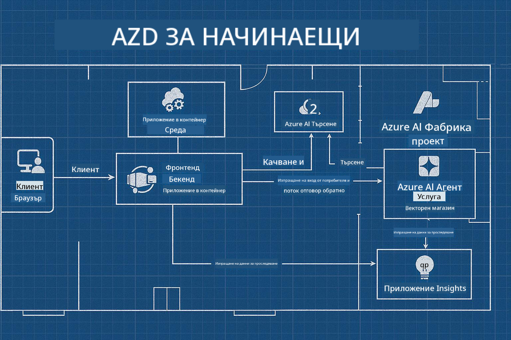

<!--
CO_OP_TRANSLATOR_METADATA:
{
  "original_hash": "245d24997bbcf2bae93bb2a503845d37",
  "translation_date": "2025-09-23T12:05:36+00:00",
  "source_file": "workshop/README.md",
  "language_code": "bg"
}
-->
# AZD за AI Разработчици: Работилница

## AZD Шаблони

Създаването на решение за AI приложение от корпоративен клас за вашия специфичен сценарий е много подобно на изграждането на ваш собствен дом. Можете да го проектирате сами, да го изградите тухла по тухла и да поемете отговорността за спазването на всички насоки за управление и разработка.

**ИЛИ ....**

Можете да работите с архитект, който да ви предостави _план_ за стартов дом и след това да работите заедно, за да го _персонализирате_ според вашите нужди. Това ви позволява да се фокусирате върху това, което прави **вашия дом** специален, докато експертите се грижат за основните инсталации, водопровод и други зависимости.

**Това е подходът зад [AI App Templates](https://ai.azure.com/templates)** - серия от планове за изграждане на различни видове "домове" за AI приложения в зависимост от вашите основни нужди и зависимости.

## Персонализиране на шаблони

Шаблоните са проектирани да работят с [Azure AI Foundry](https://ai.azure.com). Помислете за тази платформа като за вашия "строителен предприемач" с достъп до всички ресурси, инструменти и експертиза, от които се нуждаете, за да свършите работата!

Всичко, което трябва да направите, е да изберете [вашите стартови шаблони](https://learn.microsoft.com/en-us/azure/ai-foundry/how-to/develop/ai-template-get-started). Например, ще се фокусираме върху шаблона _Get Started with AI Agents_, за да изградим "Агентен AI Дом", който е подготвен за функции като AI Търсене, Red Teaming, Оценки, Проследяване, Мониторинг и други!



Всичко, което ви трябва, е да запазите време с архитекта, който да ви насочи през процеса на персонализиране. [GitHub Copilot за Azure](https://learn.microsoft.com/en-us/azure/developer/github-copilot-azure/get-started) може да бъде този водач. Просто "говорете с него", за да:

- Научите за функциите на Azure във вашия шаблон
- Разгърнете ресурси в Azure
- Получите информация за вашето разгръщане
- Диагностицирате и отстранявате проблеми!

В тази работилница ще научим как да _разглобим_ съществуващия шаблон (за да разберем какво предоставя), след това да го _персонализираме_ (за да отговорим на нашите изисквания) - стъпка по стъпка.

AI шаблоните **правят нещата да работят** - като завършите работилницата, ще научите как да **ги направите свои**

----

**Навигация в работилницата**
- **📚 Основна страница на курса**: [AZD за начинаещи](../README.md)
- **📖 Свързани глави**: Обхваща [Глава 1](../README.md#-chapter-1-foundation--quick-start), [Глава 2](../README.md#-chapter-2-ai-first-development-recommended-for-ai-developers) и [Глава 5](../README.md#-chapter-5-multi-agent-ai-solutions-advanced)
- **🛠️ Практическа лаборатория**: [AI Workshop Lab](../docs/ai-foundry/ai-workshop-lab.md)
- **🚀 Следващи стъпки**: [Модули на работилницата](../../../workshop)

Добре дошли в практическата работилница за изучаване на Azure Developer CLI (AZD) с фокус върху разгръщането на AI приложения. Тази работилница е създадена, за да ви преведе от основите на AZD до разгръщането на готови за производство AI решения.

## Преглед на работилницата

**Продължителност:** 2-3 часа  
**Ниво:** Начинаещ до Средно напреднал  
**Предварителни изисквания:** Основни познания за Azure, инструменти за команден ред и AI концепции

### Какво ще научите

- **Основи на AZD**: Разбиране на инфраструктурата като код с AZD
- 🤖 **Интеграция на AI услуги**: Разгръщане на Azure OpenAI, AI Търсене и други AI услуги
- **Разгръщане на контейнери**: Използване на Azure Container Apps за AI приложения
- **Най-добри практики за сигурност**: Имплементиране на Managed Identity и сигурни конфигурации
- **Мониторинг и наблюдение**: Настройка на Application Insights за AI натоварвания
- **Производствени модели**: Стратегии за разгръщане, готови за корпоративна употреба

## Структура на работилницата

### Модул 1: Основи на AZD (30 минути)
- Инсталиране и конфигуриране на AZD
- Разбиране на структурата на AZD проект
- Вашето първо разгръщане с AZD
- **Лаборатория**: Разгръщане на просто уеб приложение

### Модул 2: Интеграция с Azure OpenAI (45 минути)
- Настройка на ресурси за Azure OpenAI
- Стратегии за разгръщане на модели
- Конфигуриране на API достъп и автентикация
- **Лаборатория**: Разгръщане на чат приложение с GPT-4

### Модул 3: RAG приложения (45 минути)
- Интеграция с Azure AI Търсене
- Обработка на документи с Azure Document Intelligence
- Векторни вграждания и семантично търсене
- **Лаборатория**: Създаване на система за въпроси и отговори върху документи

### Модул 4: Производствено разгръщане (30 минути)
- Конфигурация на Container Apps
- Оптимизация на мащабиране и производителност
- Мониторинг и логиране
- **Лаборатория**: Разгръщане в производство с наблюдение

### Модул 5: Разширени модели (15 минути)
- Разгръщания в множество среди
- Интеграция с CI/CD
- Стратегии за оптимизация на разходите
- **Заключение**: Контролен списък за готовност за производство

## Предварителни изисквания

### Необходими инструменти

Моля, инсталирайте тези инструменти преди работилницата:

```bash
# Azure Developer CLI
curl -fsSL https://aka.ms/install-azd.sh | bash

# Azure CLI
curl -sL https://aka.ms/InstallAzureCLIDeb | sudo bash

# Git
sudo apt-get install git

# Docker
curl -fsSL https://get.docker.com -o get-docker.sh
sudo sh get-docker.sh

# Python 3.10+
sudo apt-get install python3.10 python3.10-venv python3-pip
```

### Настройка на Azure акаунт

1. **Абонамент за Azure**: [Регистрирайте се безплатно](https://azure.microsoft.com/free/)
2. **Достъп до Azure OpenAI**: [Заявете достъп](https://aka.ms/oai/access)
3. **Необходими разрешения**:
   - Роля Contributor за абонамент или ресурсна група
   - User Access Administrator (за RBAC назначения)

### Проверка на предварителните изисквания

Стартирайте този скрипт, за да проверите вашата настройка:

```bash
#!/bin/bash
echo "Verifying workshop prerequisites..."

# Check AZD installation
if command -v azd &> /dev/null; then
    echo "✅ Azure Developer CLI: $(azd --version)"
else
    echo "❌ Azure Developer CLI not found"
fi

# Check Azure CLI
if command -v az &> /dev/null; then
    echo "✅ Azure CLI: $(az --version | head -n1)"
else
    echo "❌ Azure CLI not found"
fi

# Check Docker
if command -v docker &> /dev/null; then
    echo "✅ Docker: $(docker --version)"
else
    echo "❌ Docker not found"
fi

# Check Python
if command -v python3 &> /dev/null; then
    echo "✅ Python: $(python3 --version)"
else
    echo "❌ Python 3 not found"
fi

# Check Azure login
if az account show &> /dev/null; then
    echo "✅ Azure: Logged in as $(az account show --query user.name -o tsv)"
else
    echo "❌ Azure: Not logged in (run 'az login')"
fi

echo "Setup verification complete!"
```

## Материали за работилницата

### Лабораторни упражнения

Всеки модул включва практически лаборатории със стартов код и стъпка по стъпка инструкции:

- **[lab-1-azd-basics/](../../../workshop/lab-1-azd-basics)** - Вашето първо разгръщане с AZD
- **[lab-2-openai-chat/](../../../workshop/lab-2-openai-chat)** - Чат приложение с Azure OpenAI
- **[lab-3-rag-search/](../../../workshop/lab-3-rag-search)** - RAG приложение с AI Търсене
- **[lab-4-production/](../../../workshop/lab-4-production)** - Модели за производствено разгръщане
- **[lab-5-advanced/](../../../workshop/lab-5-advanced)** - Разширени сценарии за разгръщане

### Референтни материали

- **[Ръководство за интеграция с AI Foundry](../docs/ai-foundry/azure-ai-foundry-integration.md)** - Изчерпателни модели за интеграция
- **[Ръководство за разгръщане на AI модели](../docs/ai-foundry/ai-model-deployment.md)** - Най-добри практики за разгръщане на модели
- **[Практики за производство на AI](../docs/ai-foundry/production-ai-practices.md)** - Модели за корпоративно разгръщане
- **[Ръководство за отстраняване на проблеми с AI](../docs/troubleshooting/ai-troubleshooting.md)** - Често срещани проблеми и решения

### Примерни шаблони

Шаблони за бърз старт за често срещани AI сценарии:

```
workshop/templates/
├── minimal-chat/          # Basic OpenAI chat app
├── rag-application/       # RAG with AI Search
├── multi-model/          # Multiple AI services
└── production-ready/     # Enterprise template
```

## Начало

### Опция 1: GitHub Codespaces (Препоръчително)

Най-бързият начин да започнете работилницата:

[](https://github.com/codespaces/new?hide_repo_select=true&ref=main&repo=YOUR_REPO_ID)

### Опция 2: Локална разработка

1. **Клонирайте репозитория на работилницата:**
```bash
git clone https://github.com/YOUR_ORG/AZD-for-beginners.git
cd AZD-for-beginners/workshop
```

2. **Влезте в Azure:**
```bash
az login
azd auth login
```

3. **Започнете с Лаборатория 1:**
```bash
cd lab-1-azd-basics
cat README.md  # Follow the instructions
```

### Опция 3: Работилница с инструктор

Ако участвате в сесия с инструктор:

- 🎥 **Запис на работилницата**: [Достъпен при поискване](https://aka.ms/azd-ai-workshop)
- 💬 **Общност в Discord**: [Присъединете се за жива поддръжка](https://aka.ms/foundry/discord)
- **Обратна връзка за работилницата**: [Споделете вашия опит](https://aka.ms/azd-workshop-feedback)

## График на работилницата

### Самостоятелно обучение (3 часа)

```
⏰ 00:00 - 00:30  Module 1: AZD Foundations
⏰ 00:30 - 01:15  Module 2: Azure OpenAI Integration
⏰ 01:15 - 02:00  Module 3: RAG Applications
⏰ 02:00 - 02:30  Module 4: Production Deployment
⏰ 02:30 - 02:45  Module 5: Advanced Patterns
⏰ 02:45 - 03:00  Q&A and Next Steps
```

### Сесия с инструктор (2.5 часа)

```
⏰ 00:00 - 00:15  Welcome & Prerequisites Check
⏰ 00:15 - 00:40  Module 1: Live Demo + Lab
⏰ 00:40 - 01:20  Module 2: OpenAI Integration
⏰ 01:20 - 01:30  Break
⏰ 01:30 - 02:10  Module 3: RAG Applications
⏰ 02:10 - 02:30  Module 4: Production Patterns
⏰ 02:30 - 02:45  Module 5: Advanced Topics
⏰ 02:45 - 03:00  Q&A and Resources
```

## Критерии за успех

До края на тази работилница ще можете да:

✅ **Разгръщате AI приложения** с помощта на AZD шаблони  
✅ **Конфигурирате Azure OpenAI** услуги със съответната сигурност  
✅ **Създавате RAG приложения** с интеграция на Azure AI Търсене  
✅ **Имплементирате производствени модели** за корпоративни AI натоварвания  
✅ **Мониторирате и отстранявате проблеми** при разгръщане на AI приложения  
✅ **Прилагате стратегии за оптимизация на разходите** за AI натоварвания  

## Общност и поддръжка

### По време на работилницата

- 🙋 **Въпроси**: Използвайте чата на работилницата или вдигнете ръка
- 🐛 **Проблеми**: Проверете [ръководството за отстраняване на проблеми](../docs/troubleshooting/ai-troubleshooting.md)
- **Съвети**: Споделяйте открития с други участници

### След работилницата

- 💬 **Discord**: [Общност на Azure AI Foundry](https://aka.ms/foundry/discord)
- **GitHub Issues**: [Докладвайте за проблеми с шаблоните](https://github.com/YOUR_ORG/AZD-for-beginners/issues)
- 📧 **Обратна връзка**: [Форма за оценка на работилницата](https://aka.ms/azd-workshop-feedback)

## Следващи стъпки

### Продължете обучението

1. **Разширени сценарии**: Изследвайте [разгръщания в множество региони](../docs/ai-foundry/production-ai-practices.md#multi-region-deployment)
2. **Интеграция с CI/CD**: Настройте [GitHub Actions работни потоци](../docs/deployment/github-actions.md)
3. **Персонализирани шаблони**: Създайте свои собствени [AZD шаблони](../docs/getting-started/custom-templates.md)

### Приложете в своите проекти

1. **Оценка**: Използвайте нашия [контролен списък за готовност](./production-readiness-checklist.md)
2. **Шаблони**: Започнете с нашите [AI-специфични шаблони](../../../workshop/templates)
3. **Поддръжка**: Присъединете се към [Azure AI Foundry Discord](https://aka.ms/foundry/discord)

### Споделете успеха си

- ⭐ **Оценете репозитория**, ако тази работилница ви е помогнала
- 🐦 **Споделете в социалните мрежи** с #AzureDeveloperCLI #AzureAI
- 📝 **Напишете блог пост** за вашето пътуване с разгръщането на AI

---

## Обратна връзка за работилницата

Вашата обратна връзка ни помага да подобрим опита от работилницата:

| Аспект | Оценка (1-5) | Коментари |
|--------|--------------|----------|
| Качество на съдържанието | ⭐⭐⭐⭐⭐ | |
| Практически лаборатории | ⭐⭐⭐⭐⭐ | |
| Документация | ⭐⭐⭐⭐⭐ | |
| Ниво на трудност | ⭐⭐⭐⭐⭐ | |
| Общо преживяване | ⭐⭐⭐⭐⭐ | |

**Изпратете обратна връзка**: [Форма за оценка на работилницата](https://aka.ms/azd-workshop-feedback)

---

**Предишно:** [Ръководство за отстраняване на проблеми с AI](../docs/troubleshooting/ai-troubleshooting.md) | **Следващо:** Започнете с [Лаборатория 1: Основи на AZD](../../../workshop/lab-1-azd-basics)

**Готови ли сте да започнете изграждането на AI приложения с AZD?**

[Започнете Лаборатория 1: Основи на AZD →](./lab-1-azd-basics/README.md)

---

